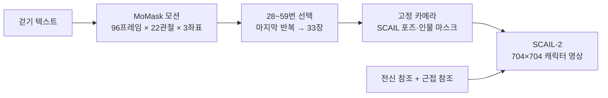
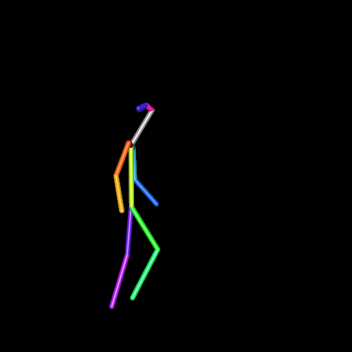
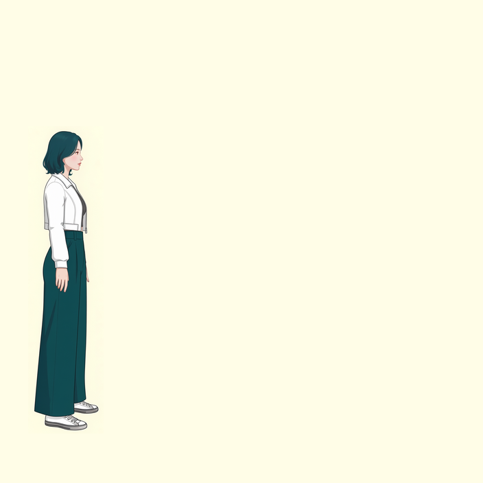
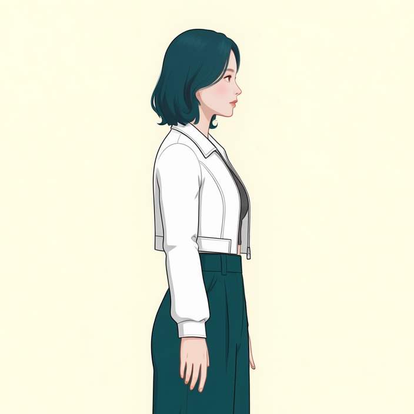
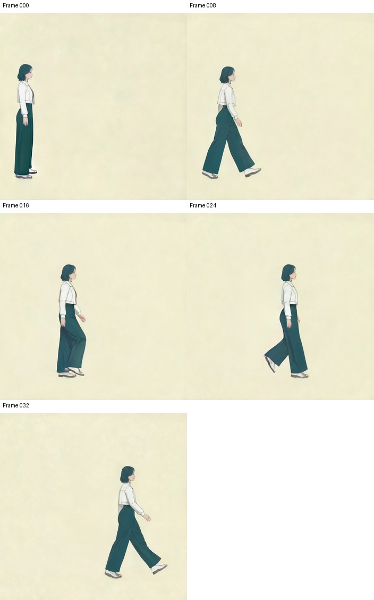

# P7-5.15 MoMask 모션에서 전신·근접 참조 캐릭터 영상으로

> Section ID: `P7-5.15`
> Version: `v2026.09.20`

걷는 캐릭터를 만들려면 몸이 어떻게 움직이는지와 누가 움직이는지를 함께 전달해야 한다. 이 절에서는 **MoMask가 만든 3D 관절 모션을 포즈 입력으로 바꾸고, 전신·근접 참조 이미지와 함께 SCAIL-2에 전달한 결과 영상**을 살펴본다. 모션 산출물은 움직임의 순서를, 참조 이미지는 얼굴·머리·의상의 외형을 맡는다. 두 정보를 연결했을 때 동작이 전달되는지와 개별 프레임의 세부 표현이 유지되는지를 나누어 본다.

## 1. MoMask의 산출물은 시간 순서가 있는 관절 좌표다

MoMask는 동작을 설명하는 텍스트에서 사람의 3D 모션을 생성한다. 관절 좌표 출력은 `(프레임 수, 22, 3)` 형태다. 예를 들어 96프레임이라면 매 시점에 22개 관절의 세 좌표가 들어 있다. 팔·다리·골반이 다음 시점으로 어떻게 이동하는지 표현하지만 얼굴, 옷, 배경의 픽셀은 들어 있지 않다. 공식 구현은 이 좌표 배열과 함께 막대 인체 영상, 관절 계층과 움직임을 담는 BVH 파일을 저장하는 경로를 제공한다. [MoMask 구현 및 출력 형식](https://github.com/centersymmetry/momask){: target="_blank" rel="noopener noreferrer" }

| 산출물 | 담고 있는 정보 | 확인할 내용 |
| --- | --- | --- |
| 3D 관절 배열 | 프레임별 관절의 공간 좌표 | 골반이 앞으로 이동하는가, 좌우 팔다리가 교대하는가 |
| 관절 모션 시각화 | 같은 모션을 카메라로 바라본 모습 | 다리가 겹치는 구간, 발과 바닥의 관계, 시작·종료 정지 |
| 영상 모델용 포즈 이미지 | 관절을 대상 모델의 표현 형식으로 렌더링한 구조 입력 | 좌우·깊이·프레임 순서가 변환 과정에서 유지되는가 |
| 캐릭터 영상 | 포즈와 참조 외형을 바탕으로 생성한 픽셀 | 이동 동작, 얼굴·옷의 유지, 손발 경계와 프레임 간 변화 |

마지막 두 행은 MoMask 결과에 후속 처리를 거친 산출물이다. 관절 모션을 얻었다고 캐릭터 영상까지 완성된 것은 아니다. 특히 현재 사용한 22관절 모션에는 손가락의 세부 움직임이 없으므로, 손의 위치를 전달하는 것과 손가락 모양을 지정하는 것은 다르다.

### 전진 걷기에서 확인한 것

로컬 MoMask v4 실험에서는 `A person walks in a straight line across the room.`이라는 짧은 지시로 96프레임·20fps 모션을 생성했다. 이는 약 4.8초 분량이다. 세 시드의 골반 수평 순이동은 약 **2.55~3.02m**였다. 동일한 카메라 범위로 비교하고, 발 높이를 보정하거나 인위적인 전진 속도를 더하지 않았다.

바닥에서 양발로 시작해 계속 앞으로 이동한다는 설명을 덧붙인 조건은 오히려 순이동이 약 2.7~10.8cm에 그쳤다. 이 두 조건에서는 설명이 길어진다고 전진이 더 잘 제어되지는 않았다. 다만 짧은 지시의 결과도 첫 약 1.2초와 후반에 정지 구간이 있어 처음부터 끝까지 지속되는 걷기는 아니었다. 이동 중 바닥 근처의 발끝 수평 속도 중앙값은 약 0.079~0.127m/s였다. 발 높이로 고른 구간의 대리지표이므로 실제 접촉이나 정상적인 접지를 입증하는 수치는 아니다.

이 수치는 삭제 전 분석 기록이다. 원 모션 배열과 독립적인 MoMask 결과 영상은 정리 후 폐기했으며 [결과 요약](../../../assets/part-07/chapter-05/sec-15/2026-09-19-momask-v4/README.md){ .aibook-markdown-preview }을 남겼다. 아래 캐릭터 실험에 실제로 사용한 포즈·마스크는 보존되어 있다.

## 2. 선택한 모션 구간을 포즈 입력으로 바꾼다

캐릭터 영상에는 MoMask v4의 전진 결과 중 28~59번 구간을 사용했다. 32개의 원 프레임에 마지막 프레임을 한 번 더 배치해 **33장의 입력 포즈**를 구성했다. 따라서 생성한 33프레임 영상은 20fps에서 약 1.65초이고, 4.8초짜리 모션 전체를 영상화한 것은 아니다. 마지막 반복은 새로운 동작이 아니다.

```mermaid
flowchart LR
    A["걷기 텍스트"] --> B["MoMask 모션\n96프레임 × 22관절 × 3좌표"]
    B --> C["28~59번 선택\n마지막 반복 → 33장"]
    C --> D["고정 카메라\nSCAIL 포즈·인물 마스크"]
    D --> E["SCAIL-2\n704×704 캐릭터 영상"]
    F["전신 참조 + 근접 참조"] --> E
```

관절 이름과 순서를 영상 모델의 입력에 맞추고 카메라를 고정해 포즈를 렌더링했다. 이번 입력은 SCAIL-Pose 렌더러로 만든 신체 구조 표현이다. 초기 계획의 ‘12개 OpenPose 키프레임’과 달리, 현재 결과는 33장의 연속 포즈를 사용한다. OpenPose 키포인트와 SCAIL 포즈 영상을 같은 입력 파일로 취급하지 않는다.

위 그림은 완성 캐릭터가 아니라 동작을 전달하는 중간 입력이다. 손가락 포즈는 없고 머리 좌표도 측면 방향을 나타내는 근사값이다. 원 3D 모션에서 자연스러웠던 동작도 투영·렌더링과 캐릭터 생성 과정에서 달라질 수 있으므로, 포즈와 출력의 같은 프레임을 대조해야 한다.

## 3. 전신 참조와 근접 참조가 같은 캐릭터를 가리키게 한다

전신 참조는 옷차림과 몸 전체 비율을 전달한다. 그러나 전신이 작은 영역에 들어가면 얼굴과 손도 작은 픽셀 영역으로 축소된다. 이번 실험은 같은 원본에서 얼굴·상반신·손을 포함한 영역을 따로 잘라 두 번째 참조로 추가했다. 근접 참조는 960×1440 원본의 704×704 영역을 크기 변경 없이 사용했다.

| 전신 참조 | 같은 원본에서 자른 근접 참조 |
| --- | --- |
|  |  |

두 참조의 인물 영역에는 같은 식별 색의 마스크를 지정했다. 이는 서로 다른 인물을 추가하는 대신 한 인물의 외형 정보를 두 장으로 전달하기 위한 조건이다. 마스크가 같다고 얼굴 동일성이 보장되지는 않는다. SCAIL-2의 다중 참조 기능 자체도 공식 구현에서 실험 기능으로 안내한다. [SCAIL-2 다중 참조 안내](https://github.com/zai-org/SCAIL-2/tree/wan-scail2#experimental-functions-multi-reference){: target="_blank" rel="noopener noreferrer" }

기존 전신 참조 실험과 비교할 때 포즈, 시드, 출력 크기, 생성 설정은 유지하고 근접 참조와 그 마스크만 추가했다. 결과의 차이를 참조 추가와 연결해 살펴보기 위한 대조다. 기존 비교 영상은 정리 후 삭제되어 현재는 당시 관찰 기록만 남아 있다.

## 4. 전신·근접 참조로 생성한 걷기 영상

아래 영상은 현재 보존한 실험 결과다. 화면을 가로지르는 동작과 팔다리가 겹쳤다가 다시 드러나는 구간을 먼저 보고, 이어 멈춘 프레임에서 얼굴·손·신발을 확인한다.

<video controls playsinline preload="metadata" style="width:100%;max-width:704px" aria-label="MoMask 포즈와 전신·근접 참조로 생성한 SCAIL-2 걷기 영상" src="/AiBook/assets/part-07/chapter-05/sec-15/2026-09-20-scail2-multiref-v1/multiref-dpo-q4-704/animation.mp4"></video>

[전신 + 근접 참조 결과 영상 열기](../../../assets/part-07/chapter-05/sec-15/2026-09-20-scail2-multiref-v1/multiref-dpo-q4-704/animation.mp4)

| 항목 | 이번 실행 |
| --- | --- |
| 출력 | 704×704, 33프레임, 20fps, 약 1.65초 |
| 모델 | SCAIL-2 Q4 양자화, DPO 어댑터 강도 1.0 |
| 생성 설정 | 40단계, CFG 5, shift 3, 시드 23123134 |
| 장비·시간 | RTX 5070 Laptop 8GB, 생성·저장 약 79.8분 |
| 메모리 측정 | 최대 PyTorch 할당 약 4.44GiB, 예약 약 5.68GiB |

양자화는 모델 가중치를 낮은 정밀도로 저장하는 방식이고, DPO 어댑터는 모델에 추가로 적용한 가중치다. 위 메모리는 이 실행의 측정값이며 전체 장치 사용량이나 다른 환경의 최소 요구량을 뜻하지 않는다. 텍스트 조건은 기존에 저장한 임베딩을 재사용했다. 원문 프롬프트는 남아 있지 않아 해시로 같은 입력인지만 확인했다. 구체적인 입력·모델·실행 근거는 [실험 기록](../../../assets/part-07/chapter-05/sec-15/2026-09-20-scail2-multiref-v1/README.md){ .aibook-markdown-preview }에 연결한다.

### 움직임 확인과 프레임 품질은 구분한다

다섯 표본에서는 인물의 가로 이동과 짧은 머리·흰 상의·짙은 바지의 큰 특징이 유지된다. 그러나 016번을 원본 크기로 보면 얼굴과 손의 세부 표현은 여전히 흐리고 신발 경계도 부드럽다. 근접 참조를 더해도 출력 화면 속 인물 크기는 그대로이며, 입력 포즈에 없는 손가락 모양까지 정확하게 지정한 것은 아니다.

사용자가 기존 전신 참조 결과에서 동작을 알아볼 수 있다고 평가한 것과 이번 다중 참조 결과의 디테일 개선 여부는 별개다. **이 영상은 모션과 캐릭터 외형을 연결한 산출물로 소개하며, 제작에 쓸 수 있는 프레임 품질이나 동일성 개선이 입증된 결과로 소개하지 않는다.** 저장된 33장과 영상의 무결성 확인도 모든 프레임의 손발 교대·깜박임 검수를 대신하지 않는다.

## 5. 이전 실험에서 남긴 판단

이전 결과는 요약 후 폐기했다. MoMask 초기 실험의 부유·제자리 걷기, StableAnimator의 외형·팔다리 유지 실패는 동작 생성과 캐릭터 영상화를 따로 확인해야 한다는 근거가 됐다. SCAIL의 참조 조건 수정에서는 안개 같은 흐림이 줄었다는 사용자 평가가 있었지만, 개별 프레임 품질 부족은 남았다.

SCAIL-2 기본·DPO·704p·전신 참조 실험을 거치며 사용자는 품질 향상과 동작 식별 가능성을 평가했으나 실사용 품질을 승인한 것은 아니다. SeedVR2 복원은 디테일 개선이 없고 복제 잔상이 추가되어 미채택했다. 이 이력에서 중요한 것은 해상도 증가, 선의 강조, 동작 식별을 얼굴·손 디테일과 동일한 성과로 합치지 않는 것이다.

## 체크리스트

- MoMask의 관절 좌표, 렌더링한 포즈, 캐릭터 영상이 각각 담는 정보를 구분할 수 있는가?
- 96프레임 원 모션에서 선택한 구간과 33프레임 출력의 관계를 설명할 수 있는가?
- 전진 이동을 고정 카메라에서 확인하고, 발의 접지·좌우 교대와 외형 유지를 따로 살폈는가?
- 전신 참조와 근접 참조를 추가한 이유를 설명하고, 이를 디테일 개선의 보장으로 오해하지 않는가?
- 연속 영상의 동작과 멈춘 프레임의 얼굴·손발 품질을 나누어 평가했는가?

## 출처와 참고 자료

- Guo et al., [MoMask 구현과 산출물 형식](https://github.com/centersymmetry/momask){: target="_blank" rel="noopener noreferrer" }, 확인일: 2026-09-20.
- zai-org, [SCAIL-2 공식 구현과 다중 참조](https://github.com/zai-org/SCAIL-2/tree/wan-scail2){: target="_blank" rel="noopener noreferrer" }, 확인일: 2026-09-20.
- 이 저장소, [MoMask v4 결과 요약](../../../assets/part-07/chapter-05/sec-15/2026-09-19-momask-v4/README.md){ .aibook-markdown-preview } 및 [전신·근접 참조 실험 기록](../../../assets/part-07/chapter-05/sec-15/2026-09-20-scail2-multiref-v1/README.md){ .aibook-markdown-preview }, 2026-09-20. 로컬 실험의 조건·수치·관찰 근거.
