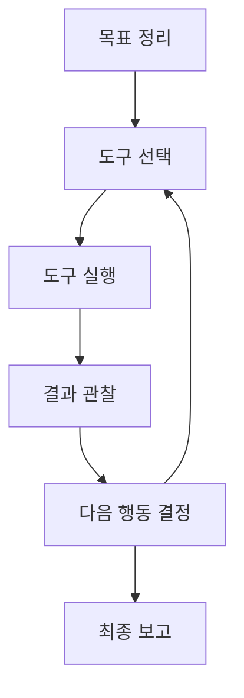

# P7-6.1 도구를 사용하는 에이전트 목표

> Section ID: `P7-6.1`
> Version: `v2026.07.17`

RAG 프로젝트가 `문서를 찾아 답에 붙이는 구조`였다면, 에이전트 프로젝트는 한 단계 더 나아가 `도구를 실제로 호출해 작업을 이어 가는 구조`를 다룹니다.

여기서 중요한 것은 agent를 막연한 지능처럼 설명하지 않는 것입니다.

이번 프로젝트에서 agent는 다음처럼 좁게 정의할 수 있습니다.

목표를 받아, 필요한 도구를 고르고, 도구 결과를 읽고, 다음 행동을 정하는 실행 루프로 볼 수 있습니다. 이 절의 목적은 agent를 똑똑한 존재로 설명하는 것이 아니라, 목표와 도구 결과를 이어 가는 프로젝트 문서 구조를 익히는 데 있습니다.

## 이 절의 범위

- 도구를 사용하는 에이전트 프로젝트는 어떤 흐름으로 적으면 좋은가?
- RAG와 에이전트는 무엇이 다른가?
- 도구 사용과 외부 기능 호출은 프로젝트 문서에서 어떻게 연결되는가?

이 절은 단일 에이전트 프로젝트의 최소 문서 구조를 잡는 데 집중합니다. 즉, 여기서는 목표, 도구, 관찰, 다음 행동을 어떤 실행 루프로 문서화할지까지를 먼저 닫습니다. 권한과 로그를 어떻게 붙여야 하는지는 바로 다음 P7-6.2 권한과 로그 검토에서 다시 회수하고, 배포 이후 운영 기록과 실패 추적은 P7-7.1, P7-7.2에서 이어집니다.

에이전트 프로젝트 문서는 여기서 목표, 도구, 관찰, 다음 행동의 실행 루프로 정리됩니다. 이 절은 그 흐름을 어떤 실행 기록으로 남길지 먼저 고정합니다.

여기서의 `에이전트(agent)`는 강화학습 에이전트가 아니라 도구를 이어 쓰는 서비스형 실행 구조입니다. Part 7을 읽다가 그 구분이 흐려지면 이 절과 [개념사전](../../../reference/concept-glossary.md)으로 돌아오면 됩니다.

## 이 절의 목표

- 에이전트를 `계획 -> 행동 -> 관찰 -> 다음 행동` 루프로 설명할 수 있습니다.
- RAG와 에이전트의 차이를 말할 수 있습니다.
- 제한된 도구 집합으로도 에이전트 프로젝트를 문서화할 수 있습니다.

## 왜 에이전트 프로젝트가 필요한가

Part 5에서 보았듯, 외부 기능 호출은 모델이 바깥 시스템과 연결되도록 만드는 방식입니다. 이 기능은 외부 데이터 조회나 시스템 동작 요청처럼, 답변 생성만으로 끝나지 않는 작업을 이어 주는 연결 지점입니다. 즉, 도구 사용은 단순 답변 생성과 다른 층위의 문제입니다.

RAG와 비교하면 차이가 더 분명합니다.

| 구조 | 중심 동작 |
| --- | --- |
| RAG | 문서를 검색하고 근거를 붙인다 |
| 에이전트 | 도구를 고르고 호출하며 다음 행동을 이어 간다 |

즉, 에이전트 프로젝트는 `문서를 읽는 것`보다 `행동을 이어 가는 것`에 더 가깝습니다.

에이전트 프로젝트 입구에서 바로 확인해야 할 판단 기준을 표로 고정하면 다음과 같습니다.

| 질문 | 짧은 답 |
| --- | --- |
| 이 프로젝트에서 먼저 남길 것은 무엇인가? | 목표, 도구 목록, 실행 순서 |
| RAG와 가장 큰 차이는 무엇인가? | 읽기보다 행동 연결이 중심이라는 점 |
| 최소 산출물은 무엇인가? | 실행 기록과 최종 보고 |

여기에 한 가지를 더 붙이면 에이전트 절의 입구부터 기록 구조가 훨씬 분명해집니다. 목표와 도구 목록만 적는 데서 끝내지 말고, `각 단계에서 무엇을 관찰할 것인가`, `어떤 상태면 검토가 필요한가`, `다음 행동을 무엇으로 바꿀 것인가`를 같이 적어 두는 것입니다.

| 입구에서 같이 남길 기록 | 왜 필요한가 |
| --- | --- |
| 목표 | 무엇을 끝내려는지 고정하기 위해서입니다. |
| 도구 | 어떤 행동 수단이 있는지 분리하기 위해서입니다. |
| 관찰 기준 | 성공과 실패를 무엇으로 읽을지 미리 정하기 위해서입니다. |
| 검토 상태 | 멈춤, 재시도, 사람 검토가 필요한 경우를 구분하기 위해서입니다. |

## 프로젝트 질문 설정

이번 프로젝트는 `목차 읽기 -> 빌드 상태 확인 -> 결과 보고`처럼 제한된 도구 흐름을 하나의 작업으로 연결할 수 있는가?라는 질문에서 시작합니다. 도구 호출과 관찰 결과가 분명하고, 권한과 로그 문제를 다음 절로 자연스럽게 넘길 수 있는 구조입니다.

## 프로젝트 흐름



이 도식은 에이전트 프로젝트의 핵심이 `정답 한 번 출력`이 아니라 `관찰을 바탕으로 다음 행동을 다시 고르는 루프`라는 점을 보여 줍니다. 목표를 받은 뒤 도구를 고르고, 결과를 읽고, 필요하면 다시 도구 선택으로 돌아가는 구조가 에이전트 문서화의 중심입니다.

프로젝트 기록으로 정리하면 순서는 다음과 같습니다.

| 단계 | 문서에 남길 것 |
| --- | --- |
| 목표 | 무엇을 끝내려는가 |
| 도구 선택 | 어떤 도구를 왜 고르는가 |
| 실행 | 실제 호출 결과 |
| 관찰 | 어떤 결과를 읽었는가 |
| 다음 행동 | 계속할지 멈출지 |
| 최종 보고 | 전체 흐름 요약 |

## 작은 에이전트 예제

이번 절에서는 세 개의 장난감 도구를 둡니다.

- 목차 읽기 단계
- 빌드 상태 확인 단계
- 최종 요약 보고 단계

실제 shell 실행 대신, 프로젝트 문서 안에서는 이 도구들이 어떤 입력과 출력을 갖는지 명확히 보여 주는 데 집중합니다.

## Python 예제

이번 예제의 목적은 에이전트 상태와 도구 결과를 순서대로 기록하는 것입니다. 이번에는 단순히 `도구`와 `결과`만 출력하지 않고, 계획 목록, 실행 기록, 최종 보고를 함께 남겨 실제 실행 루프가 어떻게 문서화되는지 보이게 하겠습니다. 계획 목록은 에이전트가 왜 그 순서를 택했는지 남기는 계획 기록이고, 실행 기록은 각 단계의 관찰과 다음 행동 결정을 이어 주며, 최종 보고는 흩어진 실행 로그를 마지막 사용자 보고로 묶는 역할을 합니다.

- 문제 상황: 제한된 도구 집합으로 하나의 작업을 끝까지 연결한다.
- 입력: 목표 1개, 도구 3개, 단계별 계획
- 기대 출력: 계획 목록, 실행 기록, 최종 보고
- 확인할 개념:
  - 계획과 관찰이 함께 있어야 에이전트 루프를 다시 읽을 수 있다
  - 도구 결과는 다음 행동을 정하는 입력이 된다
  - 최종 보고는 마지막 단계 하나가 아니라 전체 실행 기록을 요약해야 한다

```python
도구_목록 = {
    "요청 확인": lambda: {
        "상태": "성공",
        "요약": "작업 개요를 읽었다",
        "관찰": "필요한 출력과 제약 조건을 확인했다",
    },
    "결과 점검": lambda: {
        "상태": "성공",
        "요약": "기본 점검을 마쳤다",
        "관찰": "현재 결과가 기본 점검을 통과했다",
    },
    "결과 공유": lambda: {
        "상태": "성공",
        "요약": "최종 요약을 준비했다",
        "관찰": "사용자에게 최종 답변을 전달할 수 있다",
    },
}

목표 = "작은 구조화 작업 하나를 끝까지 연결한다"
계획_단계 = [
    {"단계": 1, "도구": "요청 확인", "이유": "먼저 작업 범위를 알아야 한다"},
    {"단계": 2, "도구": "결과 점검", "이유": "결과 품질을 먼저 확인해야 한다"},
    {"단계": 3, "도구": "결과 공유", "이유": "관찰을 모은 뒤 최종 요약이 필요하다"},
]
실행_기록 = []

for index, step in enumerate(계획_단계):
    result = 도구_목록[step["도구"]]()
    if result["상태"] != "성공":
        다음_행동 = "검토 후 중지"
    elif index == len(계획_단계) - 1:
        다음_행동 = "종료"
    else:
        다음_행동 = 계획_단계[index + 1]["도구"]

    실행_기록.append({
        "단계": step["단계"],
        "도구": step["도구"],
        "이유": step["이유"],
        "결과 상태": result["상태"],
        "결과 요약": result["요약"],
        "관찰": result["관찰"],
        "다음 행동": 다음_행동,
    })

print("목표 =", 목표)
print("계획 목록 =", 계획_단계)
print("실행 기록 =")
for entry in 실행_기록:
    print(entry)

최종_보고 = {
    "목표": 목표,
    "완료 단계 수": len(실행_기록),
    "최종 상태": 실행_기록[-1]["결과 상태"],
    "마지막 관찰": 실행_기록[-1]["관찰"],
}
print("최종 보고 =", 최종_보고)
```

실행 결과 예시는 다음과 같습니다.

```text
목표 = 작은 구조화 작업 하나를 끝까지 연결한다
계획 목록 = [{'단계': 1, '도구': '요청 확인', '이유': '먼저 작업 범위를 알아야 한다'}, {'단계': 2, '도구': '결과 점검', '이유': '결과 품질을 먼저 확인해야 한다'}, {'단계': 3, '도구': '결과 공유', '이유': '관찰을 모은 뒤 최종 요약이 필요하다'}]
실행 기록 =
{'단계': 1, '도구': '요청 확인', '이유': '먼저 작업 범위를 알아야 한다', '결과 상태': '성공', '결과 요약': '작업 개요를 읽었다', '관찰': '필요한 출력과 제약 조건을 확인했다', '다음 행동': '결과 점검'}
{'단계': 2, '도구': '결과 점검', '이유': '결과 품질을 먼저 확인해야 한다', '결과 상태': '성공', '결과 요약': '기본 점검을 마쳤다', '관찰': '현재 결과가 기본 점검을 통과했다', '다음 행동': '결과 공유'}
{'단계': 3, '도구': '결과 공유', '이유': '관찰을 모은 뒤 최종 요약이 필요하다', '결과 상태': '성공', '결과 요약': '최종 요약을 준비했다', '관찰': '사용자에게 최종 답변을 전달할 수 있다', '다음 행동': '종료'}
최종 보고 = {'목표': '작은 구조화 작업 하나를 끝까지 연결한다', '완료 단계 수': 3, '최종 상태': '성공', '마지막 관찰': '사용자에게 최종 답변을 전달할 수 있다'}
```

## 결과를 어떻게 읽는가

이 장난감 예제에서 읽어야 할 핵심은 `도구 결과가 다음 단계의 입력이 된다`는 점입니다.

- 계획 목록은 agent가 어떤 순서와 이유로 도구를 고르는지 보여 줍니다.
- 첫 단계의 결과가 없으면 현재 요청 범위를 모릅니다.
- 검증 단계의 결과가 실패라면 다음 행동은 최종 보고가 아니라 중단 또는 재시도로 바뀌어야 합니다.
- 마지막 보고 단계는 앞 두 단계 관찰을 묶어야 의미가 있습니다.
- 최종 보고는 실행 루프의 끝에서 무엇을 사용자에게 전달할지 정리합니다.
- 이번 예제에서 모든 단계가 성공으로 끝났더라도, 그것은 `현재 장난감 도구와 현재 목표` 기준의 결과입니다. 실제 프로젝트에서는 같은 계획도 다른 관찰이 나오면 검토 필요 상태로 바뀔 수 있습니다.

즉, 에이전트 프로젝트는 단순 명령 목록이 아니라 `관찰 기반 루프`입니다.

같은 흐름을 최소 기록으로 줄이면 다음 표처럼 정리할 수 있습니다.

| 단계 | 관찰 후 상태 | 다음 행동 |
| --- | --- | --- |
| 요청 확인 | 작업 범위 확인 완료 | 검증 실행 |
| 검증 실행 | 기본 검사 통과 또는 검토 필요 | 계속 진행 또는 중단 |
| 결과 공유 | 최종 답변 가능 | 마무리 |

이 표가 있으면 에이전트 프로젝트의 입구에서부터 `질문 -> 도구 -> 관찰 -> 검토 상태` 구조가 보입니다.

이 결과는 다음 세 줄로 요약할 수 있습니다.

- 도구 결과는 다음 단계 판단의 근거가 된다
- 계획, 관찰, 다음 행동이 함께 남아야 에이전트 루프를 다시 읽을 수 있다
- 계획은 고정 문장이 아니라 관찰에 따라 바뀔 수 있다
- 성공으로 보이는 단계도 현재 관찰 기준 안에서만 읽어야 한다
- 에이전트 프로젝트는 답변보다 실행 흐름 기록이 중요하다

## 왜 도구 인터페이스 표준화가 필요한가

Model Context Protocol(MCP)은 AI 애플리케이션과 외부 시스템 사이의 연결 방식을 표준화하려는 규약입니다. 이 관점은 에이전트 프로젝트에 매우 중요합니다. 에이전트가 도구를 여러 개 쓰더라도, 연결 방식과 입력 구조, 결과 구조가 일관되면 프로젝트 문서와 운영 기록을 훨씬 쉽게 정리할 수 있습니다.

이번 절에서는 MCP 구현 자체를 다루지 않지만, 왜 도구 인터페이스를 표준화하려 하는지의 감각은 여기서부터 잡을 수 있습니다.

이 절은 Part 7 전체 흐름에서 `LLM 프로젝트가 읽기에서 실행으로 확장될 때 문서 구조도 함께 바뀐다`는 점을 보여 줍니다.

## 체크리스트

다음처럼 LLM이 답변을 넘어서 실제 행동을 이어 가기 시작했는데 실행 기록 구조가 아직 느슨하다면 이 절의 관점을 먼저 떠올리는 편이 좋습니다.

- 목표는 적었지만 어떤 도구를 어떤 순서로 왜 쓸지 문서에 남기지 않은 경우
- 도구 호출 결과는 보였지만 그 결과가 다음 행동을 어떻게 바꾸는지 기록하지 않은 경우
- RAG와 에이전트를 같은 방식으로 설명해 읽기와 실행의 차이가 흐려진 경우

이때는 도구 수를 늘리기 전에 `목표 -> 도구 선택 -> 관찰 -> 다음 행동` 루프를 먼저 문서에 고정해야 합니다.

- 에이전트는 목표를 따라 도구를 이어 쓰는 실행 루프라는 점을 설명할 수 있는가?
- RAG와 에이전트는 같은 것이 아니라는 점을 말할 수 있는가?
- 도구 결과는 다음 행동 판단의 근거가 된다는 점을 설명할 수 있는가?
- 표준화된 도구 연결 구조는 프로젝트 문서와 운영을 단순하게 만든다는 점을 말할 수 있는가?
- agent를 계획/행동/관찰 루프로 설명할 수 있는가?
- RAG와 에이전트의 차이를 말할 수 있는가?
- 도구 이름, 도구 결과, 다음 행동을 따로 기록할 수 있는가?
- 어떤 단계에서 권한 문제가 생길지 예측할 수 있는가?

## 출처와 참고 자료

- OpenAI, `Function calling`, OpenAI API Docs, 확인 날짜: 2026-06-29. [https://developers.openai.com/api/docs/guides/function-calling](https://developers.openai.com/api/docs/guides/function-calling){: target="_blank" rel="noopener noreferrer" }
- Model Context Protocol, `What is MCP?`, 확인 날짜: 2026-06-29. [https://modelcontextprotocol.io/docs/getting-started/intro](https://modelcontextprotocol.io/docs/getting-started/intro){: target="_blank" rel="noopener noreferrer" }
