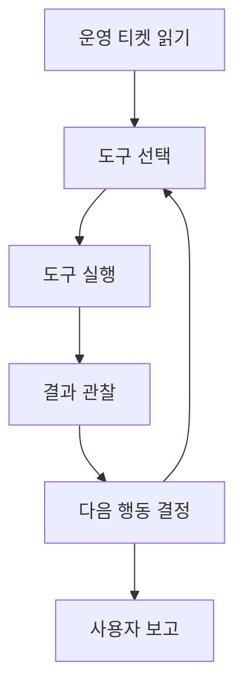

# P7-6.1 도구를 사용하는 에이전트 목표

> Section ID: `P7-6.1`
> Version: `v2026.07.18`

RAG 프로젝트가 `문서를 찾아 답에 붙이는 구조`였다면, 에이전트 프로젝트는 한 단계 더 나아가 `도구를 실제로 호출해 작업을 이어 가는 구조`를 다룹니다.

여기서 중요한 것은 agent를 막연한 지능처럼 설명하지 않는 것입니다. 이번 절에서 agent는 `운영 요청을 받고`, `필요한 도구를 고르고`, `도구 결과를 읽고`, `다음 행동을 정하는 실행 루프`로 이해하면 충분합니다.

## 이 절의 범위

- 도구를 사용하는 에이전트 프로젝트는 어떤 흐름으로 적으면 좋은가?
- RAG와 에이전트는 무엇이 다른가?
- 조회 도구와 변경 도구는 프로젝트 문서에서 어떻게 구분되는가?

이 절은 단일 에이전트 프로젝트의 최소 문서 구조를 잡는 데 집중합니다. 즉, 여기서는 목표, 도구, 관찰, 다음 행동을 어떤 실행 루프로 문서화할지까지를 먼저 닫습니다. 권한과 로그를 어떻게 붙여야 하는지는 바로 다음 P7-6.2 권한과 로그 검토에서 이어서 설명합니다.

에이전트 프로젝트 문서는 여기서 목표, 도구, 관찰, 다음 행동의 실행 루프로 정리됩니다. 이 절은 그 흐름을 어떤 실행 기록으로 남길지 먼저 고정합니다.

여기서의 `에이전트(agent)`는 강화학습 에이전트가 아니라 도구를 이어 쓰는 서비스형 실행 구조입니다. Part 7을 읽다가 그 구분이 흐려지면 이 절과 [개념사전](../../../reference/concept-glossary.md)으로 돌아오면 됩니다.

## 이 절의 목표

- 에이전트를 `계획 -> 행동 -> 관찰 -> 다음 행동` 루프로 설명할 수 있습니다.
- RAG와 에이전트의 차이를 말할 수 있습니다.
- 조회와 변경이 섞인 실제 작업 흐름을 문서화할 수 있습니다.

## 왜 에이전트 프로젝트가 필요한가

Part 5에서 보았듯, 외부 기능 호출은 모델이 바깥 시스템과 연결되도록 만드는 방식입니다. 이 기능은 외부 데이터 조회나 시스템 동작 요청처럼, 답변 생성만으로 끝나지 않는 작업을 이어 주는 연결 지점입니다. 즉, 도구 사용은 단순 답변 생성과 다른 층위의 문제입니다.

RAG와 비교하면 차이가 더 분명합니다.

| 구조 | 중심 동작 |
| --- | --- |
| RAG | 문서를 검색하고 근거를 붙인다 |
| 에이전트 | 도구를 고르고 호출하며 다음 행동을 이어 간다 |

즉, 에이전트 프로젝트는 `문서를 읽는 것`보다 `행동을 이어 가는 것`에 더 가깝습니다.

에이전트 프로젝트 입구에서 바로 확인해야 할 판단 기준을 표로 고정하면 다음과 같습니다.

| 질문 | 짧은 답 |
| --- | --- |
| 이 프로젝트에서 먼저 남길 것은 무엇인가? | 목표, 도구 목록, 실행 순서 |
| RAG와 가장 큰 차이는 무엇인가? | 읽기보다 행동 연결이 중심이라는 점 |
| 최소 산출물은 무엇인가? | 실행 기록과 최종 보고 |

여기에 한 가지를 더 붙이면 에이전트 절의 입구부터 기록 구조가 훨씬 분명해집니다.

| 입구에서 같이 남길 기록 | 왜 필요한가 |
| --- | --- |
| 목표 | 무엇을 끝내려는지 고정하기 위해 |
| 도구 | 어떤 행동 수단이 있는지 분리하기 위해 |
| 관찰 기준 | 성공과 실패를 무엇으로 읽을지 미리 정하기 위해 |
| 검토 상태 | 계속 진행, 재시도, 사람 검토를 구분하기 위해 |

## 프로젝트 질문 설정

이번 프로젝트는 `운영 티켓 하나를 받아 현재 장애 징후를 확인하고, 안전한 다음 행동을 정리할 수 있는가?`라는 질문에서 시작합니다. 이 질문은 단순 Q&A보다 실제 에이전트 동작에 가깝고, 조회 도구와 변경 후보를 분리해 볼 수 있으며, 권한과 로그 문제를 다음 절로 자연스럽게 넘길 수 있습니다.

## 프로젝트 흐름



이 도식은 에이전트 프로젝트의 핵심이 `정답 한 번 출력`이 아니라 `관찰을 바탕으로 다음 행동을 다시 고르는 루프`라는 점을 보여 줍니다.

프로젝트 기록으로 정리하면 순서는 다음과 같습니다.

| 단계 | 문서에 남길 것 |
| --- | --- |
| 목표 | 무엇을 끝내려는가 |
| 도구 선택 | 어떤 도구를 왜 고르는가 |
| 실행 | 실제 호출 결과 |
| 관찰 | 어떤 결과를 읽었는가 |
| 다음 행동 | 계속할지 멈출지 |
| 최종 보고 | 전체 흐름 요약 |

## 운영 티켓 예제

이번 절에서는 `결제 API 5xx 오류가 급증했다`는 운영 티켓을 하나 둡니다. 에이전트는 이 티켓을 보고 바로 서버를 재시작하는 것이 아니라, 먼저 읽기 전용 도구로 현재 상태를 확인한 뒤 어떤 행동이 안전한지 판단합니다. Python 예제에서 사용할 단계 기록은 [`p7-6-agent-triage-steps.csv`](../../../assets/part-07/chapter-06/p7-6-agent-triage-steps.csv)에 따로 두고, 본문 코드는 그 기록을 읽어 실행 루프를 정리하는 데 집중합니다.

| 도구 | 역할 | 성격 |
| --- | --- | --- |
| 티켓 읽기 | 장애 요청과 우선순위를 확인 | 조회 |
| 메트릭 조회 | 최근 15분 오류율과 지연 시간을 확인 | 조회 |
| 배포 이력 조회 | 최근 배포가 있었는지 확인 | 조회 |
| 대응 초안 작성 | 지금 단계에서 사용자에게 줄 보고 초안 작성 | 정리 |

아직 이 절에서는 실제 변경 도구를 실행하지 않습니다. 그 이유는 `무엇을 바꿀 것인가`보다 `무엇을 근거로 다음 행동을 정할 것인가`가 먼저이기 때문입니다.

## Python 예제

이번 예제의 목적은 에이전트 상태와 도구 결과를 순서대로 기록하는 것입니다. 이번에는 단순히 `도구`와 `결과`만 출력하지 않고, 계획 목록, 실행 기록, 최종 보고를 함께 남겨 실제 운영 티켓 처리 루프가 어떻게 문서화되는지 보이게 하겠습니다. 원시 단계 데이터는 CSV로 분리해, 코드가 `기록 읽기 -> 실행 기록 재구성 -> 최종 보고 작성` 흐름에만 집중하도록 맞춥니다.

- 문제 상황: 운영 티켓 하나를 끝까지 읽고 안전한 다음 행동을 정리한다.
- 입력: 티켓 1개, 조회 도구 3개, 보고 도구 1개
- 기대 출력: 계획 목록, 실행 기록, 최종 보고
- 확인할 개념:
  - 계획과 관찰이 함께 있어야 에이전트 루프를 다시 읽을 수 있다
  - 도구 결과는 다음 행동을 정하는 입력이 된다
  - 최종 보고는 마지막 단계 하나가 아니라 전체 실행 기록을 요약해야 한다

## 입력 파일

- 파일 경로: [`p7-6-agent-triage-steps.csv`](../../../assets/part-07/chapter-06/p7-6-agent-triage-steps.csv)
- 한 행의 의미: `운영 티켓 처리 루프의 한 단계`
- 핵심 열: `step`, `tool`, `reason`, `result_status`, `result_summary`, `observation`, `review_state`, `next_action`

즉, 이 파일은 단순 로그 덤프가 아니라 `왜 이 도구를 골랐는가`, `무엇을 봤는가`, `다음 행동이 무엇인가`까지 함께 적힌 실행 기록입니다. Python 예제는 이 파일을 읽어 계획 목록과 실행 기록, 최종 보고를 같은 흐름으로 다시 묶습니다.

```python
import csv
from pathlib import Path

목표 = "결제 API 장애 티켓을 읽고 안전한 다음 행동을 정리한다"
data_path = Path("docs/assets/part-07/chapter-06/p7-6-agent-triage-steps.csv")
step_rows = list(csv.DictReader(data_path.open(encoding="utf-8")))

계획_단계 = [
    {
        "단계": int(row["step"]),
        "도구": row["tool"],
        "이유": row["reason"],
    }
    for row in step_rows
]

실행_기록 = [
    {
        "단계": int(row["step"]),
        "도구": row["tool"],
        "이유": row["reason"],
        "결과 상태": row["result_status"],
        "결과 요약": row["result_summary"],
        "관찰": row["observation"],
        "검토 상태": row["review_state"],
        "다음 행동": row["next_action"],
    }
    for row in step_rows
]

print("읽은 파일 =", data_path)
print("목표 =", 목표)
print("계획 목록 =", 계획_단계)
print("실행 기록 =")
for entry in 실행_기록:
    print(entry)

최종_보고 = {
    "목표": 목표,
    "완료 단계 수": len(실행_기록),
    "현재 판단": "최근 배포 영향 가능성이 있어 즉시 재시작보다 롤백 검토를 우선 제안",
    "다음 운영 행동": "사람 검토 후 롤백 여부 결정",
}
print("최종 보고 =", 최종_보고)
```

실행 결과 예시는 다음과 같습니다.

```text
읽은 파일 = docs/assets/part-07/chapter-06/p7-6-agent-triage-steps.csv
목표 = 결제 API 장애 티켓을 읽고 안전한 다음 행동을 정리한다
계획 목록 = [{'단계': 1, '도구': '티켓 읽기', '이유': '현재 장애 요청과 우선순위를 먼저 알아야 한다'}, {'단계': 2, '도구': '메트릭 조회', '이유': '실제 오류율과 지연이 얼마나 악화됐는지 확인해야 한다'}, {'단계': 3, '도구': '배포 이력 조회', '이유': '최근 변경이 장애 시점과 겹치는지 봐야 한다'}, {'단계': 4, '도구': '대응 초안 작성', '이유': '관찰을 모아 안전한 다음 행동을 보고해야 한다'}]
실행 기록 =
{'단계': 1, '도구': '티켓 읽기', '이유': '현재 장애 요청과 우선순위를 먼저 알아야 한다', '결과 상태': '성공', '결과 요약': 'P1 티켓을 확인했다', '관찰': '결제 API 5xx 오류율 급증, 고객 영향 있음', '검토 상태': '계속 진행', '다음 행동': '메트릭 조회'}
{'단계': 2, '도구': '메트릭 조회', '이유': '실제 오류율과 지연이 얼마나 악화됐는지 확인해야 한다', '결과 상태': '성공', '결과 요약': '최근 15분 메트릭을 읽었다', '관찰': '오류율 12.8%, p95 지연 2.4초, 정상 기준보다 크게 높다', '검토 상태': '긴급 검토', '다음 행동': '배포 이력 조회'}
{'단계': 3, '도구': '배포 이력 조회', '이유': '최근 변경이 장애 시점과 겹치는지 봐야 한다', '결과 상태': '성공', '결과 요약': '최근 배포를 확인했다', '관찰': '18분 전 결제 서비스 v2.3.1 배포가 있었다', '검토 상태': '최근 배포 영향 의심', '다음 행동': '대응 초안 작성'}
{'단계': 4, '도구': '대응 초안 작성', '이유': '관찰을 모아 안전한 다음 행동을 보고해야 한다', '결과 상태': '성공', '결과 요약': '사용자 보고 초안을 만들었다', '관찰': '즉시 재시작보다 배포 영향 점검과 롤백 검토를 먼저 제안한다', '검토 상태': '계속 진행', '다음 행동': '종료'}
최종 보고 = {'목표': '결제 API 장애 티켓을 읽고 안전한 다음 행동을 정리한다', '완료 단계 수': 4, '현재 판단': '최근 배포 영향 가능성이 있어 즉시 재시작보다 롤백 검토를 우선 제안', '다음 운영 행동': '사람 검토 후 롤백 여부 결정'}
```

## 결과를 어떻게 읽는가

이번 예제에서 읽어야 할 핵심은 `도구 결과가 다음 단계의 입력이 된다`는 점과 `도구를 호출했다고 바로 시스템을 바꾸지는 않는다`는 점입니다.

| 단계 | 이번 예제에서 읽어야 할 점 | 왜 중요한가 |
| --- | --- | --- |
| 티켓 읽기 | 무엇이 문제인지 먼저 고정한다 | 목표를 잘못 잡으면 뒤 도구 선택도 흔들린다 |
| 메트릭 조회 | 실제 장애 강도를 수치로 확인한다 | 막연한 느낌이 아니라 운영 지표로 판단해야 한다 |
| 배포 이력 조회 | 최근 변경과 장애 시점을 연결해 본다 | 원인 후보를 좁히기 전에는 변경 행동이 위험할 수 있다 |
| 대응 초안 작성 | 관찰을 사용자 보고와 다음 행동으로 바꾼다 | 에이전트는 조회로 끝나지 않고 행동 제안까지 이어져야 한다 |

이 예제는 `도구를 많이 부른다`보다 `왜 이 순서로 불렀는가`가 중요합니다.

- 오류율이 높다는 사실만으로는 즉시 재시작이 정답이라고 말하기 어렵습니다.
- 최근 배포가 있었다는 관찰이 붙으면, 재시작보다 롤백 검토가 더 안전한 다음 행동이 될 수 있습니다.
- 따라서 에이전트 프로젝트는 `정답 생성`보다 `관찰 기반의 다음 행동 결정`을 기록하는 쪽이 더 중요합니다.

즉, 에이전트 프로젝트는 단순 명령 목록이 아니라 `관찰 기반 루프`입니다.

같은 흐름을 최소 기록으로 줄이면 다음 표처럼 정리할 수 있습니다.

| 단계 | 관찰 후 상태 | 다음 행동 |
| --- | --- | --- |
| 티켓 읽기 | 요청 범위 확인 완료 | 메트릭 조회 |
| 메트릭 조회 | 긴급 검토 필요 | 배포 이력 조회 |
| 배포 이력 조회 | 최근 배포 영향 의심 | 대응 초안 작성 |
| 대응 초안 작성 | 사용자 보고 가능 | 마무리 |

이번 실행은 다음 세 줄로 요약할 수 있습니다.

- 도구 결과는 다음 단계 판단의 근거가 된다.
- 에이전트는 조회와 판단을 거쳐 안전한 다음 행동을 제안해야 한다.
- 운영 티켓에서는 `무엇을 바로 바꿀까`보다 `무엇을 근거로 바꿀까`가 먼저다.

## 직접 바꿔 보며 확인할 것

이 절은 단계 순서를 바꿔 보면 왜 현재 순서가 필요한지 더 분명해집니다.

1. CSV에서 `배포 이력 조회`를 `메트릭 조회`보다 앞 단계로 옮겨 봅니다.
   관찰할 점: 최근 배포 정보는 먼저 알 수 있지만, 장애 강도를 수치로 확인하기 전이라 다음 행동 판단이 더 성급하게 읽히지 않는가?

2. `관찰` 문장에서 `18분 전 배포`를 삭제해 봅니다.
   관찰할 점: 같은 실행 루프라도 최근 변경 단서가 빠지면 `롤백 검토` 결론이 얼마나 약해지는가?

이 실험은 에이전트 프로젝트에서 `도구를 많이 쓰는 것`보다 `어떤 근거가 어떤 결론을 지탱하는가`가 더 중요하다는 점을 보여 줍니다.

## 왜 도구 인터페이스 표준화가 필요한가

Model Context Protocol(MCP)은 AI 애플리케이션과 외부 시스템 사이의 연결 방식을 표준화하려는 규약입니다. 이 관점은 에이전트 프로젝트에 매우 중요합니다. 에이전트가 도구를 여러 개 쓰더라도, 연결 방식과 입력 구조, 결과 구조가 일관되면 프로젝트 문서와 운영 기록을 훨씬 쉽게 정리할 수 있습니다.

이번 절에서는 MCP 구현 자체를 다루지 않지만, 왜 도구 인터페이스를 표준화하려 하는지의 감각은 여기서부터 잡을 수 있습니다.

이 절은 Part 7 전체 흐름에서 `LLM 프로젝트가 읽기에서 실행으로 확장될 때 문서 구조도 함께 바뀐다`는 점을 보여 줍니다.

## 체크리스트

다음처럼 LLM이 답변을 넘어서 실제 행동을 이어 가기 시작했는데 실행 기록 구조가 아직 느슨하다면 이 절의 관점을 먼저 떠올리는 편이 좋습니다.

- 목표는 적었지만 어떤 도구를 어떤 순서로 왜 쓸지 문서에 남기지 않은 경우
- 도구 호출 결과는 보였지만 그 결과가 다음 행동을 어떻게 바꾸는지 기록하지 않은 경우
- RAG와 에이전트를 같은 방식으로 설명해 읽기와 실행의 차이가 흐려진 경우

이때는 도구 수를 늘리기 전에 `목표 -> 도구 선택 -> 관찰 -> 다음 행동` 루프를 먼저 문서에 고정해야 합니다.

- 에이전트는 목표를 따라 도구를 이어 쓰는 실행 루프라는 점을 설명할 수 있는가?
- RAG와 에이전트는 같은 것이 아니라는 점을 말할 수 있는가?
- 도구 결과는 다음 행동 판단의 근거가 된다는 점을 설명할 수 있는가?
- 운영 티켓처럼 실제 작업 흐름으로 예제를 읽을 수 있는가?

## 출처와 참고 자료

- OpenAI, `Function calling`, OpenAI API Docs, 확인 날짜: 2026-06-29. [https://developers.openai.com/api/docs/guides/function-calling](https://developers.openai.com/api/docs/guides/function-calling){: target="_blank" rel="noopener noreferrer" }
- Model Context Protocol, `What is MCP?`, 확인 날짜: 2026-06-29. [https://modelcontextprotocol.io/docs/getting-started/intro](https://modelcontextprotocol.io/docs/getting-started/intro){: target="_blank" rel="noopener noreferrer" }
