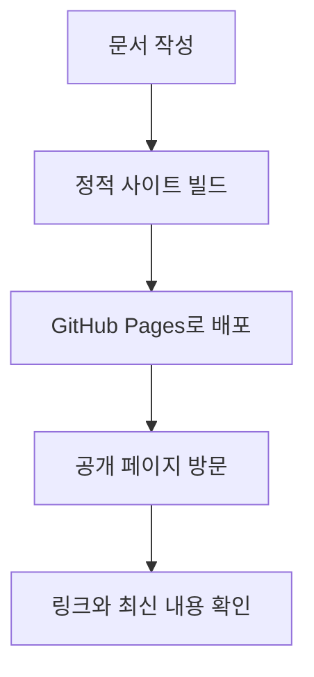

# P7-7.1 배포와 모니터링 목표

> Section ID: `P7-7.1`
> Version: `v2026.07.07`

Part 7의 마지막 프로젝트는 `만들기`보다 `계속 보여 주고 확인하기`에 가깝습니다. 이 책 저장소처럼 정적 웹 문서를 배포하는 프로젝트도 결국 서비스 관점을 갖게 됩니다.

문서를 빌드해서 올리는 것만으로 충분한가, 아니면 배포 상태와 기본 신호를 함께 확인해야 하는가 하는 질문으로 이제 초점이 옮겨갑니다.

이번 절은 GitHub Pages를 기준으로 그 기본 구조를 잡습니다.

이 절의 목적은 문서를 올리는 법 자체보다, 배포 프로젝트에서 빌드와 공개 확인을 분리해 기록하는 데 있습니다.

## 이 절의 범위

- 정적 문서 프로젝트를 배포한다는 것은 무엇을 뜻하는가?
- GitHub Pages는 어떤 종류의 배포 방식인가?
- 배포 후 무엇을 최소한 확인해야 하는가?

이 절은 다음 내용은 깊게 다루지 않습니다.

- CDN 세부 최적화
- 커스텀 도메인 DNS 설정
- 사설 모니터링 시스템 구축

이 절은 정적 문서 프로젝트의 `빌드 -> 배포 -> 확인` 최소 흐름에 집중합니다. 실제 실패 유형과 다음 조치 정리는 바로 다음 P7-7.2 실패 기록과 개선 계획에서 다시 회수하고, CDN과 사설 모니터링의 심화 설계는 현재 본편 범위 밖으로 둡니다.

배포 프로젝트는 여기서 `빌드`, `배포 반영`, `공개 페이지 확인`을 나눠 보는 운영 기록으로 바뀝니다. 이 절은 빌드 성공과 공개 상태 확인을 분리해 기록하는 기준을 세웁니다.

Part 7에서 `배포(deployment)`와 `정적 배포(static deployment)`를 같은 말처럼 읽게 되면 이 절과 [개념사전](../../../reference/concept-glossary.md)으로 돌아와 구분을 다시 잡는 편이 좋습니다.

## 이 절의 목표

- 정적 사이트 배포를 `빌드 -> 배포 -> 확인` 흐름으로 설명할 수 있습니다.
- GitHub Pages가 정적 사이트 호스팅(static site hosting)이라는 점을 말할 수 있습니다.
- 배포 후 기본 상태 확인 체크리스트를 만들 수 있습니다.

## 왜 배포 프로젝트가 필요한가

개인 학습 프로젝트라도 배포를 거치면 다음 문제가 생깁니다.

- 로컬에서는 되는데 배포에서는 안 될 수 있다.
- 링크가 깨질 수 있다.
- 새 변경이 바로 반영되지 않을 수 있다.
- 빌드 성공과 공개 페이지 정상 동작은 같은 말이 아닐 수 있다.

GitHub Docs는 GitHub Pages를 저장소의 정적 파일을 웹사이트로 공개하는 서비스로 설명합니다. 또한 공개 저장소라면 GitHub Free에서도 사용할 수 있다고 안내합니다.

즉, 이번 프로젝트는 단순 업로드가 아니라 `정적 산출물을 공개 서비스로 전환하는 최소 운영 경험`입니다.

배포 시작 기록에서 바로 확인해야 할 판단 기준을 표로 고정하면 다음과 같습니다.

| 질문 | 짧은 답 |
| --- | --- |
| 이 프로젝트에서 먼저 남길 것은 무엇인가? | 빌드 상태, 배포 상태, 공개 주소 |
| 왜 배포 후 확인이 필요한가? | 빌드 성공과 공개 정상 동작이 다를 수 있어서 |
| 최소 산출물은 무엇인가? | 체크리스트와 확인 결과 |

여기에 한 가지를 더 붙이면 운영 시작 절이 뒤의 실패 기록 절과 더 자연스럽게 이어집니다. 배포 목표 절에서도 단순 확인 항목만 적는 것이 아니라, `어떤 상태를 계속 볼 것인가`, `무엇이 검토 대상인가`, `어떤 경우 다음 점검을 다시 해야 하는가`를 같이 남겨 두는 편이 좋습니다.

| 입구에서 같이 남길 기록 | 왜 필요한가 |
| --- | --- |
| 빌드 / 배포 상태 | 어디까지 성공했고 어디서 멈췄는지 구분하기 위해서입니다. |
| 공개 주소 확인 결과 | 사용자에게 실제로 보이는 상태를 기록하기 위해서입니다. |
| 검토 대상 항목 | 최신 반영, 깨진 링크, 404 같은 재점검 대상을 고정하기 위해서입니다. |
| 다음 점검 시점 | 배포 직후와 약간 뒤를 어떻게 나눠 볼지 정하기 위해서입니다. |

## 프로젝트 흐름



이 도식은 배포를 `파일 올리기 한 번`이 아니라 `작성, 빌드, 공개, 실제 확인`으로 나누어 보게 해 줍니다. 특히 마지막 확인 단계가 있어야 빌드 성공과 공개 페이지 정상 동작이 다른 문제라는 점을 프로젝트 문서에 분명히 남길 수 있습니다.

프로젝트 기록으로 정리하면 순서는 다음과 같습니다.

| 단계 | 문서에 남길 것 |
| --- | --- |
| 작성 | 어떤 변경을 배포하는가 |
| 빌드 | 산출물 생성 성공 여부 |
| 배포 | 배포 실행 또는 반영 상태 |
| 공개 확인 | URL 접근 가능 여부 |
| 점검 | 최신 반영, 링크, 오류 페이지 확인 |

## GitHub Pages에서 기억할 점

GitHub Docs는 GitHub Pages가 정적 파일을 배포하며, 필요하면 빌드 과정을 거쳐 공개 반영할 수 있다고 설명합니다. 또한 GitHub Actions를 배포 실행 경로로 사용할 수 있다고 안내합니다. 공개 저장소(public repository)에서는 Actions도 무료로 사용할 수 있습니다.

정적 문서 프로젝트 문맥에서는 아래 항목을 먼저 기억해 두면 됩니다.

- 배포 브랜치 반영 시 정적 사이트 배포가 실행될 수 있다.
- 산출물은 정적 파일이다.
- 배포 후 실제 공개 URL을 확인해야 한다.
- 변경 반영에는 시간이 걸릴 수 있다.

## 작은 배포 체크리스트

이번 절에서는 실제 원격 배포를 다시 실행하는 대신, 프로젝트 문서 관점에서 어떤 항목을 확인해야 하는지 적는 데 집중합니다.

| 확인 항목 | 질문 |
| --- | --- |
| 빌드 상태 | 로컬 또는 CI 빌드가 성공했는가? |
| 배포 상태 | 배포 실행이 성공적으로 끝났는가? |
| 공개 주소 | 공개 URL이 열리는가? |
| 최신 내용 반영 | 가장 최근 수정이 반영되었는가? |
| 깨진 링크 | 주요 내부 링크가 깨지지 않았는가? |

## 바로 쓰는 배포 확인 템플릿

배포 직후 문서에 바로 붙여 넣어 쓸 최소 확인 틀은 아래 정도로 시작할 수 있습니다.

```text
### 배포 확인표
- 빌드 상태:
- 배포 상태:
- 사이트 주소:
- 최신 내용 확인:
- 깨진 링크 확인:
- 메모:

### 모니터링 메모
- 독자에게 보이는 문제:
- 다음 확인 시점:
```

이 템플릿의 핵심은 `배포했다`에서 끝내지 않는 것입니다. 적어도 `빌드는 성공했는가`, `공개 페이지는 열리는가`, `최신 수정이 실제로 보이는가`는 분리해 남겨야 합니다.

여기서 `배포 확인표`는 배포 직후 확인표 한 건이고, `모니터링 메모`는 잠시 뒤 다시 볼 점을 남기는 짧은 운영 메모로 읽으면 됩니다.

가능하면 여기에 `추가 검토 필요` 또는 `재확인 필요` 같은 항목도 함께 두는 편이 좋습니다. 배포 직후에는 정상처럼 보여도, 공개 반영 지연이나 링크 오류가 조금 뒤에 드러날 수 있기 때문입니다.

즉, 배포 직후의 `성공`도 최종 결론이라기보다 현재 시점의 확인 신호로 읽는 편이 안전합니다. 바로 보이는 이상이 없더라도, 약간의 지연 뒤 다시 확인해야 드러나는 문제가 있을 수 있습니다.

이번 절의 흐름을 이 틀에 바로 넣으면 다음처럼 정리할 수 있습니다.

```text
### 배포 확인표
- 빌드 상태: 성공
- 배포 상태: 시작됨
- 사이트 주소: https://example.github.io/project-docs/
- 최신 내용 확인: 최신 수정 제목이 공개 페이지에 보임
- 깨진 링크 확인: 핵심 내부 링크 3개 직접 확인
- 메모: 빌드 성공과 공개 페이지 확인을 분리해 기록함

### 모니터링 메모
- 독자에게 보이는 문제: 없음
- 다음 확인 시점: 공개 페이지에서 최신 수정 반영 여부를 1회 더 확인
```

## 나쁜 배포 확인 기록과 좋은 배포 확인 기록

배포 확인 기록도 자주 `올렸다`, `정상 같다` 정도로 끝납니다. 아래처럼 대비해 보면 기준이 더 분명해집니다.

| 구분 | 예시 |
| --- | --- |
| 나쁜 기록 | `배포했고 사이트도 아마 괜찮다.` |
| 좋은 기록 | `빌드 명령은 성공했고 배포도 시작되었다. 공개 주소 접속과 최신 섹션 제목 노출을 직접 확인했으며, 핵심 내부 링크 3개도 404 없이 열렸다.` |

나쁜 기록은 배포 감상만 남고 실제 확인 항목이 없습니다. 좋은 기록은 `빌드`, `배포 상태`, `공개 페이지`, `최신 내용 반영`, `깨진 링크`가 각각 확인됐는지를 함께 남깁니다.

이 기록은 결국 뒤 절의 실패 회고 입력 자료가 됩니다. 즉, 운영 시작 절은 단순 준비 설명이 아니라 `무엇을 검토 대상으로 남길 것인가`를 먼저 정하는 절로 읽는 편이 맞습니다.

## 실제 명령보다 먼저 남길 실행 구분

이 프로젝트에서는 명령 자체를 외우는 일보다 각 단계의 역할을 분리해 적는 일이 더 중요합니다.

```bash
[로컬 빌드 명령]
[배포 반영 명령]
```

이 두 줄은 단순하지만 역할이 다릅니다.

- 첫 줄은 `정적 산출물 생성`
- 둘째 줄은 `배포 트리거`

프로젝트 문서에는 둘을 분리해 적는 편이 좋습니다.

프로젝트 문서에는 실제 저장소 명령을 그대로 적기보다 아래처럼 역할 중심으로 남기는 편이 좋습니다.

- `로컬 빌드 명령`: 배포 전 산출물 확인
- `배포 반영 명령`: 공개 갱신 시작

## 운영 관점의 연결

Google SRE 책은 monitoring을 실시간 수치 데이터를 수집하고 가공해 보여 주는 활동으로 설명합니다. 또한 alerting, dashboard, retrospective analysis 같은 목적을 함께 두며, 사용자 관점 시스템에서는 latency, traffic, errors, saturation 네 가지 golden signals를 우선 보라고 정리합니다.

정적 문서 사이트는 동적 서비스보다 단순하지만, 운영 질문은 여전히 남습니다.

- 페이지가 열리는가?
- 최근 배포가 반영되었는가?
- 오류 페이지가 보이지 않는가?
- 트래픽이 늘면 정적 파일 전달은 안정적인가?

즉, 작은 문서 배포도 `배포 후 확인` 단계를 가져야 합니다.

이 절은 Part 7 전체 흐름에서 `정적 사이트도 서비스처럼 확인하고 기록해야 한다`는 기준을 잡습니다.

## 다음 절과의 연결

P7-7.2에서는 배포 실패, 링크 오류, 오래된 콘텐츠 노출 같은 문제를 어떻게 회고 문서로 남길지 다룹니다.

## 이 절에서 기억할 관점

- 정적 사이트 배포도 하나의 서비스 배포입니다.
- 빌드 성공과 공개 페이지 정상 동작은 같은 말이 아닙니다.
- GitHub Pages는 정적 파일 호스팅 서비스입니다.
- 배포 후 상태 확인 체크리스트가 필요합니다.
- 배포 직후의 성공 상태도 재확인 시점과 함께 남기는 편이 안전합니다.

## 언제 배포와 기본 모니터링 관점을 먼저 떠올려야 하는가

다음처럼 문서를 공개하기는 했지만 공개 상태 확인 기록이 아직 느슨하다면 이 절의 관점을 먼저 떠올리는 편이 좋습니다.

- 로컬 빌드는 성공했는데 배포 상태와 공개 주소 확인을 분리해 적지 않은 경우
- 배포 성공 메시지는 봤지만 최신 내용 반영 여부와 깨진 링크 점검이 빠진 경우
- 정적 사이트라서 운영 기록이 거의 필요 없다고 보고 넘어가려는 경우

이때는 배포 자동화보다 먼저 `빌드`, `배포 상태`, `공개 페이지`, `최신 내용 반영`, `깨진 링크`를 분리해 남겨야 합니다.

## 짧은 점검

- 빌드 성공과 배포 성공을 분리해 적을 수 있는가?
- 공개 URL과 최신 반영 여부를 확인했는가?
- 링크 깨짐과 오류 페이지 여부를 점검했는가?
- 정적 사이트도 운영 관점이 필요하다는 점을 설명할 수 있는가?

## 출처와 참고 자료

- GitHub Docs, `What is GitHub Pages?`, 확인 날짜: 2026-06-29. [https://docs.github.com/en/pages/getting-started-with-github-pages/what-is-github-pages](https://docs.github.com/en/pages/getting-started-with-github-pages/what-is-github-pages){: target="_blank" rel="noopener noreferrer" }
- GitHub Docs, `Creating a GitHub Pages site`, 확인 날짜: 2026-06-29. [https://docs.github.com/en/pages/getting-started-with-github-pages/creating-a-github-pages-site](https://docs.github.com/en/pages/getting-started-with-github-pages/creating-a-github-pages-site){: target="_blank" rel="noopener noreferrer" }
- Google, `Monitoring Distributed Systems`, Site Reliability Engineering Book, 확인 날짜: 2026-06-29. [https://sre.google/sre-book/monitoring-distributed-systems/](https://sre.google/sre-book/monitoring-distributed-systems/){: target="_blank" rel="noopener noreferrer" }
