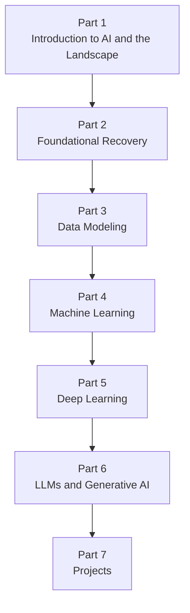

# AiBook（简体中文）

> Section ID: `BOOK-index`
> Version: `v2026.07.08`

AiBook 是一本面向重新学习 AI 的静态网页书。它同时面向几类读者：第一次系统学习 AI 的读者，很久以前学过 AI 导论但如今只记得碎片的读者，以及已经使用过 AI 工具却希望把零散经验重新整理成标准概念的非专业读者。

这本书的目标不是简单收集资料，而是提供一条可重复阅读的学习路径：`基础修复 -> 机器学习 -> 深度学习 -> LLM 与生成式 AI -> 项目实践`。其中一个核心目标，是让读者重新能够解释 `AI`、`机器学习`、`深度学习`、`生成式 AI`、`LLM` 之间如何相互连接。另一个重要目标，是把个人直觉和零散经验与可复用的解释和证据对照后，更新为更一般化的知识。

在同一个 Part 内，重要概念的详细说明会尽量只放在一个代表 Section 中。后续 Section 只保留当前语境所需的最小连接。如果反复出现的核心术语再次变得不稳定，可以回到 [Concept Glossary (English)](/AiBook/en/reference/concept-glossary.md) 查看。词汇表中的 `Core Section` 和 `Appears In` 列表，可以帮助区分某个概念第一次被完整解释的位置，以及它后来在哪些地方再次出现。

## 这本书写给谁

这本书尤其以以下读者为中心来编写。

- 第一次系统学习 AI，希望逐步把术语和想法连接起来的读者
- 曾经学过 AI 导论或基础课程，但现在只记得部分内容的读者
- 用过 LLM、聊天机器人、图像生成工具等 AI 服务，但还没有把内部概念整理清楚的读者

本书默认读者 `可能没有接受过大学本科层级的系统训练`。也就是说，即使读者并不熟悉大学层级的数学、编程和系统基础，解释也应该依然可读。同时，对于已有一定经验的读者，本书也应该帮助他们把分散的经验重新整理成标准术语和结构。

## 当前语言支持

目前本书的基准版本是韩语。

- 韩语：当前持续写作与审校的主版本
- 英语：Part 1 已先开放，其余 Part 将逐步补充
- 简体中文：先开放介绍页、目录页，以及 Part 1 的概览页与总结页；Section 正文将继续补充

因此，现阶段英文版和简体中文版都已经不再只是占位页面，但与韩语主版本相比仍然是不完整的。

## 为什么要重新学习 AI

重新学习 AI，不只是为了跟上最新趋势。更重要的是，要重新理解规则式方法、搜索(search)、概率(probability)、机器学习、神经网络、深度学习在历史和概念上是怎样接起来的。没有这条更大的脉络，今天的 LLM 和生成式 AI 仍然会显得比实际更模糊。

下面这些问题会再次变得重要。

- AI 处理的是哪一类问题？
- 直接编写规则和从数据中学习模式，这两种方式有什么不同？
- 数学不是只作为证明对象，而是怎样成为模型计算的语言？
- 学习(learning)究竟改变了什么？模型执行(inference)又究竟执行了什么？
- 深度学习中的权重与表征学习，和传统编程思维有什么不同？
- LLM、提示词(prompt)、嵌入(embedding)、RAG(retrieval-augmented generation)、代理(agent)如何连接成一个服务流程？

## 这本书覆盖什么

这本书不会止步于基础修复，而是会一直往前推进到足以帮助读者更少混乱地理解当前 AI 服务与工具的程度。

- Part 1 先建立 AI 的整体地形、核心术语、历史脉络，以及当前 AI 服务的结构。
- Part 2 重新连接 Python、数学、数据处理等基础材料。
- Part 3 处理数据建模，把原始数据重新组织成样本、特征、基线和比较结构。
- Part 4 讲机器学习中的问题定义、数据、学习、评估和代表性算法。
- Part 5 讲神经网络、反向传播以及主要深度学习结构。
- Part 6 连接 Transformer、LLM、提示词、嵌入、检索、RAG 与代理。
- Part 7 通过小型项目、记录与评估实践来检查学到的内容。

相对地，这不是一本一开始就直接冲进框架专用 API、大规模生产优化，或研究级数学推导的书。即使这些细节之后变得必要，本书也会先问：为什么需要它、问题与输入输出是什么、核心原理是什么，然后才进入实现层面的细节。

## 整体学习路径

这条流程不是单纯的话题列表，而是学习依赖关系的结构图。Part 1 先建立整体地图；Part 2 修复阅读和小实验所需的基础；Part 3 通过数据建模把原始数据转成可学习的结构；在此之上，Part 4 建立机器学习的共同结构，Part 5 回收深度学习的主体内容，Part 6 将其连接到 LLM 与生成式 AI，Part 7 再延伸到具体产出和验证。

## 如何阅读这本书

最稳妥的默认路径是：`介绍页 -> Part 概览页 -> 代表性解释 Section -> 后续连接 Section -> 术语词汇表`。即使读者已经对某个主题有一定经验，直接跳到后面的 Part 之前，最好也先检查更前面的 Part 中的术语和边界，因为很多词会随着语境变化而改变含义。

当一个概念再次出现时，本书通常不会把同一段解释完整重复一遍。相反，它会默认读者回到那个概念第一次被详细说明的代表 Section。若某个术语再次变得不稳定，请先回到词汇表，确认词条和它的 `Core Section`，再通过 `Appears In` 列表查看它如何连接到当前 Section。

本书中的 Chapter 和 Section 并不都扮演同样的角色。有些是某个概念的代表性说明位置，有些则是在新的问题场景或计算语境里重新接回这个概念。把前面的 Section 读成概念骨架，把后面的 Section 读成“在当前语境里有什么变化”，会更容易进入节奏。

本书在设计各个 Chapter 和 Section 时，尽量让它们能回答下面这些问题：

- 为什么需要这个概念？
- 它的核心原理是什么？
- 能否用一个小例子解释输入、输出和数据？
- 能否用更平实的话重述核心术语？
- 能否通过一个小例子或输出结果进行检查？
- 哪些地方仍然属于 `需要验证`？

## 这本书采用的视角

本书允许把个人直觉当作出发点，但不会把这些直觉原封不动地当成答案。解释会尽量分成下面三层。

- `standard explanation`：能与教材、论文、官方文档或其他可靠来源对接的说明
- `working hypothesis`：为了帮助理解而暂时使用的类比或个人解释
- `needs verification`：与标准说明冲突，或还缺乏足够证据的内容

例如，把深度学习先理解成 `寻找有用权重与表征的过程`，可以是一个不错的起点。但这个描述在哪些范围内才真正成立，仍然需要另外核对。同样，即使 LLM 的输出看起来像人的思考过程，本书也不会直接跳到“它和人的思考相同”这样的结论。

## 一本借助 AI 工具写成的书

这本书是在 AI 工具帮助下完成的。人类负责设定课程结构与审校标准，而 AI 协助资料调查、初稿撰写、对照比较、绘图和文档结构化。

Codex 是这个过程中重要的工具之一。本书不会把 Codex 简单地当成自动写作器，而是把它放在 LLM agent 的视角下，作为协助生成草稿和支持审阅的工具来处理。同时，Codex 和其他生成式 AI 工具给出的内容，始终都被视为需要核对的材料，而不是因为读起来像样就自动视为事实。

因此，这本书最重要的工作不是产出大量“看起来合理”的句子，而是逐句检查这些句子背后是否真的有支撑，并持续修正错误或模糊的解释。

## 写作与审阅原则

- 解释应尽量遵循 `为什么需要 -> 核心原理是什么 -> 如何检查` 的顺序。
- 在韩语版中，核心术语初次出现时尽量采用 `韩语(English)` 的形式；简体中文版会保留同样的概念对应，但不会机械地复制这种格式。
- 对第一次接触某个概念的读者，本书优先提供简短直觉、小表格、简单图示和示例输出。
- 在同一个 Part 内，重要概念的详细说明应尽量只出现在一个代表位置，后续 Section 只保留当前语境需要的最小解释和词汇表连接。
- 若直接引用或概括外部材料，会在文末记录来源和访问日期。
- 管理文档与调查笔记保留在 `management/` 下，面向读者的正文保留在 `docs/` 下。

## 反馈与问题

如果你发现错字、解释错误、目录结构问题，或需要加强的地方，请通过仓库 issue 提交反馈。本书的评论和修订建议统一收集在 [AiBook repository issues](https://github.com/devchan64/AiBook/issues){: target="_blank" rel="noopener noreferrer" }。

## 从这里开始

- [目录](book/table-of-contents.md)
- [Part 1 概览](parts/part-01/index.md)
- [Part 1 总结](parts/part-01/summary.md)
- [Concept Glossary (English)](/AiBook/en/reference/concept-glossary.md)

## 来源与参考

本文是对本书目的、读者、学习路径与写作视角的原创介绍，不直接引用外部来源，也不概括某一篇特定外部文档。若今后补充基于外部来源的说明，会同时记录来源与访问日期。
