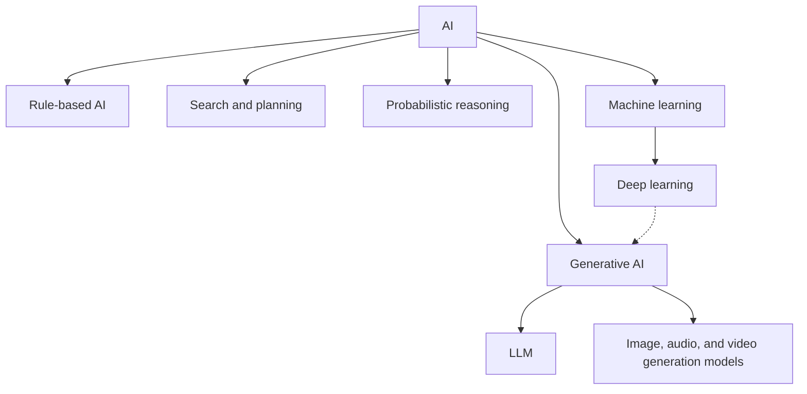

# P1-1.3 AI、机器学习、深度学习与生成式 AI 的关系

> Section ID: `P1-1.3`
> Version: `v2026.07.07`

在 1.1 中，我们整理了 AI 这个词的范围；在 1.2 中，我们看了 AI 处理的问题类型。这一节要进一步整理之后会不断反复出现的几个词：`AI`、`machine learning`、`deep learning`、`generative AI`、`LLM`。

这里需要做的事，并不是把它们背成一条绝对准确的包含链，而是先建立一条基准线，避免把来自不同概念层级(level)的词当成同义词混用。

在 Part 1 中，`AI`、`machine learning`、`deep learning`、`generative AI`、`LLM` 之间的基准关系，就固定在这一节。后面再出现这些词时，只保留当前问题所需的最小连接；如果需要重新整理术语之间的关系，就回到这一节，以及 [Concept Glossary (English)](/AiBook/en/reference/concept-glossary.md)。

## 这一节的范围

这里整理以下问题：

- 最安全的读法是什么：AI、机器学习、深度学习、生成式 AI、LLM 之间到底是什么关系？
- 哪一部分可以大致用包含关系来解释，哪一部分在真实服务里又会以不同方式混合？
- 为什么一旦把术语收缩成 `AI = LLM` 这种读法，就会产生混乱？

这一节不会深入展开以下内容：

- 机器学习和深度学习的细部学习算法
- LLM 的内部结构与 token 级计算
- 商业生成式 AI 产品的功能比较

这些层级内部的结构，会在 Part 4、Part 5 和 Part 6 重新展开。这里先做的是：把每个词的 `位置(place)` 区分出来。

## 这一节的目标

- 区分 AI、机器学习、深度学习、生成式 AI、LLM 之间的基础关系。
- 不再只根据最近的产品体验，把整个 AI 读得过于狭窄。
- 理解：即使粗略的包含关系有用，真实服务里仍然会把多种技术混在一起。

## 先连起来的概念

这一节是 Part 1 之后反复回看的术语关系基准线。下面这些概念先只固定位置，之后若要更完整的定义，再回到对应词条重新核对。

| 概念 | 这里先固定的意思 | 为什么现在需要 |
| --- | --- | --- |
| [AI](/AiBook/en/reference/concept-glossary.md#ai-artificial-intelligence) | 最宽的领域与系统类别 | 为了看清其他词放在哪里 |
| [machine learning](/AiBook/en/reference/concept-glossary.md#machine-learning) | 通过数据改善性能的学习方法 | 为了区分规则式方法与学习式方法 |
| [deep learning](/AiBook/en/reference/concept-glossary.md#deep-learning) | 强调神经网络与表征学习的一类方法 | 为了固定机器学习内部的重要扩展方向 |
| [generative AI](/AiBook/en/reference/concept-glossary.md#aigenerative-ai) | 产生新内容的输出类别 | 为了避免把学习方法和输出性质混成一类 |
| [LLM](/AiBook/en/reference/concept-glossary.md#llm) | 大规模语言模型家族 | 为了避免把生成式 AI 与整个 AI 读成同一回事 |

## 主要学习点

这一节最重要的任务，不是背包含关系，而是稳定地拆开概念层级。下面三条构成整体地图。

| 基准 | 为什么重要 | 这一节需要达到的理解程度 |
| --- | --- | --- |
| AI 是最宽的类别，而机器学习和深度学习是其中的方法 | 这样能减少把不同种类的词当成平级概念比较的错误。 | 先看清 `AI > machine learning > deep learning` 这条大致脉络。 |
| 生成式 AI 是关于 `产出什么` 的词 | 这样才不会把深度学习、LLM 和服务体验压成一团。 | 区分生成式 AI 指的是“生成文本、图像等输出”的类别。 |
| LLM 是生成式 AI 的代表案例，但不是整个 AI | 这样能避免用最近的使用经验把整个领域缩窄。 | 明确区分 `AI` 不等于 `LLM`。 |

这一节首先要留下的区分，是：这五个词并不是同一种名字。`AI` 是最宽的领域与系统类别；`machine learning` 是通过数据改善性能的学习方法；`deep learning` 是其中更强调神经网络与表征学习的技术路径；`generative AI` 是产生新内容的输出类别；`LLM` 则是其中一类代表性的语言模型家族。也就是说，应把它们读成：`AI 是外层类别`，`machine learning/deep learning 是学习方法`，`generative AI 是输出类别`，`LLM 是语言模型家族`。

## 细化学习

### 先看大图

最宽的词是 AI。AI 是一个宽广的领域与系统类别，目标是借助计算机系统、机器和算法，执行与人类智能相关的一部分功能。在它内部，会同时包含规则式方法、搜索、规划、概率推理和机器学习等不同路径。

机器学习(machine learning) 是其中一种方法：让系统通过数据或经验改善性能。它不要求人把所有规则都写死，而是让模型从输入输出样例、奖励信号或数据结构里学习判断标准。

深度学习(deep learning) 是机器学习内部的一类方法，强调通过神经网络，尤其是多层深度网络，去学习表征(representation)。过去很多方法更依赖人手工设计特征(feature)；深度学习则更强地推动“从原始数据一起学到有用表征”这条方向。

生成式 AI(generative AI) 指那些会产生新内容的模型和服务，例如文本、图像、音频、视频或代码。最近的生成式 AI 大多建立在深度学习和大模型之上，但 `deep learning` 和 `generative AI` 并不是同一个词。前者更接近学习方法与模型结构，后者更接近输出的性质。

为什么这里把它叫作“输出性质”，通过比较会更清楚。若系统读入一条客户咨询，然后在 `退款咨询`、`配送咨询`、`账户咨询` 中选一个类别，这更像分类(classification)。若它读完同样的咨询后，生成一句新的回答，例如“退款通常会在三个工作日内完成”，那就更像生成(generation)。也就是说，区分生成式 AI，更直接的边界不是“输入是不是文本”，而是“输出是预先给定的类别，还是新造出的内容”。

LLM 是在大规模文本数据上训练出来的语言模型家族。它是今天生成式 AI 的代表技术之一，但它并不等于整个生成式 AI。图像生成模型、语音生成模型、视频生成模型，都属于生成式 AI，但不一定属于狭义上的语言模型。

这张图是一张学习地图。真实研究与真实服务中的边界会更复杂。比如，当一个 LLM 被接到搜索服务上时，从外面看它可能像生成式 AI，但整个系统里面仍可能同时有搜索引擎、数据库、权限控制、规则过滤器和推荐模型。

这里真正要读出来的，不是箭头的严格谱系，而是术语的位置：`AI 是最外层`，`machine learning/deep learning 更偏向学习方法`，`generative AI 更偏向输出类别`，`LLM 是其中有代表性的语言模型家族`。

### 不要把这些词当成同一层级

混乱最常发生在：把不同概念层级的词并排比较。

| 术语 | 主要概念层级 | 最短说明 | 需要注意什么 |
| --- | --- | --- | --- |
| AI | 领域与系统类别 | 构建会执行与智能相关功能之机器的宽广领域 | 不能缩窄成某一个最近流行的模型 |
| machine learning | 学习方法 | 通过数据或经验改善性能的一类方法 | 不是所有 AI 都是机器学习 |
| deep learning | 机器学习方法 | 借助深层神经网络与表征学习的一条技术流 | 不是所有机器学习都是深度学习 |
| generative AI | 输出性质与服务类别 | 生成新文本、图像、音频或代码的模型与服务 | 会生成不等于一定真实 |
| LLM | 模型家族 | 以语言数据为核心的大规模语言模型 | 不是所有生成式 AI 都是 LLM |

因此，像“AI 和机器学习哪个更好？”这样的问法，起点就已经不稳定。机器学习是 AI 内部的一种方法。同样地，“深度学习和生成式 AI 谁更新？”也混淆了层级：深度学习更偏向模型学习方法，生成式 AI 更偏向输出与服务形态。

### 包含关系只是起点

最开始可以暂时用一条粗略路径来帮助理解：

> AI > machine learning > deep learning > generative AI > LLM

但这条线是非常强的简化。尤其是生成式 AI 更接近输出与服务类别，不应该只被看成深度学习之下的一个简单下位层。若要把解释写得更准确，还必须一起记住几个例外：

- 规则式 AI 可以属于 AI，但不属于机器学习。
- 机器学习内部有很多方法并不是深度学习。
- 深度学习不只用于生成，也用于分类、识别、预测和控制。
- 生成式 AI 不只生成文本，也能生成图像、音频、视频和代码。
- LLM 是生成式 AI 里的代表模型家族，但并不等于整个服务。

所以，包含关系只适合作为入门导航；在解释真实系统时，仍要分别去看：`它在处理什么问题`、`它用了什么模型或规则`、`它输出的是什么类型的结果`。

### 通过例子再次区分

下表可以看作一个区分练习：

| 案例 | 算 AI 吗？ | 算机器学习吗？ | 算深度学习吗？ | 算生成式 AI 吗？ | 算 LLM 吗？ |
| --- | --- | --- | --- | --- | --- |
| 用人工规则判断贷款资格的系统 | 是 | 否 | 否 | 否 | 否 |
| 用历史交易数据预测欺诈风险的模型 | 是 | 是 | 视实现而定 | 通常不是 | 不是 |
| 在图像中定位缺陷区域的神经网络模型 | 是 | 是 | 是 | 通常不是 | 不是 |
| 输入句子后生成摘要的聊天机器人 | 是 | 是 | 通常是 | 是 | 通常是 |
| 从文本提示生成图像的模型 | 是 | 是 | 通常是 | 是 | 通常不是狭义 LLM |

这里使用“是”“通常”“视实现而定”，是因为内部结构仍要核对。表面上很像的服务，内部实现完全可能不同。

初学者最常混淆的，是 `一个服务名字` 与 `它内部同时存在的多个层级`。例如，针对文档问答的聊天机器人，同一个服务可以同时被这样描述：

| 对同一个服务贴上的说明 | 为什么这种说法仍然成立 | 这里要小心什么 |
| --- | --- | --- |
| AI 服务 | 因为它接收问题、产出回答并影响人的判断，是一个宽广系统 | 这只是在说最外层类别，还没有说明内部方法 |
| 基于机器学习或深度学习的服务 | 因为负责提升回答质量的核心模型可能依赖数据学习和神经表征学习 | 这不代表所有部件都是深度学习 |
| 生成式 AI 服务 | 因为最后输出的是新生成的回答句子 | 这不代表结果已经完成事实核查 |
| 含有 LLM 的服务 | 因为核心语言模型在处理问题和回答 | 检索、权限、日志和安全过滤并不等于 LLM 本身 |

这里真正要看清的，不是哪一种说法“错了”，而是“它在说哪一个层级”。同一个系统，从外层看是 AI 服务，从模型视角看可能是深度学习服务，从输出视角看是生成式 AI，而从核心语言模型视角看，它又是“包含 LLM 的系统”。

### 为什么必须区分生成式 AI 和 LLM

今天，许多人第一次遇到 AI，就是通过聊天机器人。因此，AI、生成式 AI、LLM，以及像 ChatGPT 这样的产品名，很容易被感觉成一个整体。

但若要学习，就必须把它们分开。LLM 是以语言为中心的模型家族，生成式 AI 则是生成新内容的更宽类别。NIST 的生成式 AI profile 把生成式 AI 描述为一种 AI 模型类别：它根据输入数据的结构和特征，生成派生出来的合成内容，例子包括图像、视频、音频和文本。该文档也把 LLM 看作这一更大生成式 AI 空间中的一个代表活动。

沿着这个视角来看，LLM 是生成式 AI 的重要案例，但它不能单独解释整个生成式 AI。反过来，构建一个生成式 AI 服务，也并不是有一个 LLM 就结束了。真实服务通常还需要 prompt 处理、检索、权限控制、日志、安全过滤、用户界面和成本管理。

### 本书接下来会使用的基准

从这里开始，本书会按下面方式使用术语：

- `AI` 用于指最宽的领域与系统类别。
- `machine learning` 用于指模型通过数据或经验改善性能的方法。
- `deep learning` 用于强调深层神经网络与表征学习的场景。
- `generative AI` 用于说明会生成新内容的模型与服务。
- `LLM` 用于指在语言数据上训练的大规模语言模型。

这些基准会在后面章节中继续被细化。当前阶段最重要的仍然是先固定“位置”。Part 3 会先整理数据建模，更具体的算法与学习方法，再由 Part 4、Part 5、Part 6 重新展开。

这些术语不会在这里一次讲完，而是先连到它们之后会被完整重读的位置：

| 现在先固定的术语 | 之后更完整重读的位置 | 为什么当前阶段要先记住 |
| --- | --- | --- |
| machine learning | Part 4 | 因为在那里会第一次完整整理问题、数据与评估的结构 |
| deep learning | Part 5 | 因为表征学习、反向传播、CNN、Attention、Transformer 等计算结构会在那里真正回收 |
| generative AI | Part 6 | 因为生成结构、RAG、工具使用与 agent 会在那里一路接到服务视角 |
| LLM | Part 6 | 因为 token、next-token prediction、GPT 系列与 instruction tuning 会在那里被当作一条主线完整展开 |

### 一个简短的层级区分练习

下面这些案例，可以作为区分 `AI`、`machine learning`、`deep learning`、`generative AI`、`LLM` 的练习：

| 案例 | 应先问的区分问题 | 最容易混淆的点 |
| --- | --- | --- |
| 用人工规则表辅助保险审核的系统 | 它是从数据中学习的吗，还是规则由人直接写好？ | 它看起来像 AI，但未必是机器学习。 |
| 根据交易记录检测异常交易的预测模型 | 模式是从数据学出来的吗？是否真的需要神经网络？ | 容易把机器学习和深度学习压成一类。 |
| 根据文本提示生成图像的服务 | 它是否在生成新内容？核心输出是文本还是图像？ | 它是生成式 AI，但未必是 LLM。 |
| 对文档问题作答的聊天机器人 | 核心模型是不是语言模型？是否还附着检索和规则？ | 容易把 LLM 和整个服务看成一回事。 |

这个练习的重点，不是背包含关系，而是分清：眼前被命名的是领域、学习方法、模型家族，还是输出类别。同一个服务完全可能同时被描述成：生成式 AI 服务、包含 LLM 的系统、以及附带检索与规则的应用。

## 这一节要记住的视角

- `AI`、`machine learning`、`deep learning`、`generative AI`、`LLM` 并不是同一概念层级的词。
- 生成式 AI 比 LLM 更宽，而 LLM 是其中有代表性的语言模型家族。
- 真实服务不会止于一个模型，还应与检索、权限、日志、安全过滤等部件一起阅读。

此阶段至少要留下的一句话是：`AI 是最宽的类别，生成式 AI 是输出类别，而 LLM 是其中的一类语言模型家族。`

## 案例

### 案例 1. 为什么图像生成服务不能完全被说成 LLM

假设用户看到一个服务：输入文本提示，它会生成海报图像。因为最近很多 AI 服务都长得像聊天机器人，人很容易想直接把这种系统也叫作 `LLM`。但即使这个服务属于生成式 AI，它的核心模型也未必是狭义上的语言模型。所以，`generative AI` 与 `LLM` 经常重叠，但并不是同一个词；而且输出是图像还是文本，也必须一起看。这个案例说明：生成式 AI 比 LLM 更宽。

### 案例 2. 为什么规则式判断系统可能不是机器学习

假设某个内部审批系统只依赖人工写好的条件来运作。用户可能会觉得：既然它在辅助业务判断，那它就像 AI；但如果没有从数据中学习模式的结构，就很难把它叫作机器学习。也就是说，它可以在宽义上属于 AI，却和机器学习、深度学习、生成式 AI 处在不同层级。这个案例说明：`AI > machine learning > deep learning` 这条大地图，仍要和实际实现方式一起看。

## 简短检查

- 你可以说明 AI 是比机器学习更宽的词。
- 你可以从数据学习与神经表征学习的角度，说明机器学习和深度学习的差别。
- 你可以说明深度学习和生成式 AI 并不是同一个词。
- 你可以把生成式 AI 与 LLM 的关系解释成“代表案例，但不是整体”。
- 你可以说明真实 AI 服务很可能是多个部件的组合，而不是单一模型。

## 什么时候应先想起这个视角

当技术名字看起来都熟悉，但彼此到底处在哪个层级总在混乱时，就先回到这一节：

- 当你觉得像“AI 和机器学习哪个更好”这类比较问题本身就有点奇怪时
- 当你想把一个生成式 AI 服务直接整个叫成 `LLM` 时
- 当你需要把规则式系统、预测模型、图像生成服务和文档问答聊天机器人放在同一张表里区分时

这时就先把 `领域与系统类别`、`学习方法`、`输出类别`、`模型家族` 四层拆开，再看眼前这个案例究竟首先落在哪一格。

## 来源与参考

- OECD.AI, Stuart Russell, Karine Perset, Marko Grobelnik, [Updates to the OECD’s definition of an AI system explained](https://oecd.ai/en/wonk/ai-system-definition-update){: target="_blank" rel="noopener noreferrer" }, 2023-11-29, 确认日期: 2026-06-22.
- Stanford Encyclopedia of Philosophy, Selmer Bringsjord and Naveen Sundar Govindarajulu, [Artificial Intelligence](https://plato.stanford.edu/entries/artificial-intelligence/){: target="_blank" rel="noopener noreferrer" }, 2018-07-12, 确认日期: 2026-06-22.
- Stuart Russell, Peter Norvig, [Artificial Intelligence: A Modern Approach, 4th US ed.](https://aima.cs.berkeley.edu/){: target="_blank" rel="noopener noreferrer" }, 确认日期: 2026-06-22.
- NIST, [Artificial Intelligence Risk Management Framework: Generative Artificial Intelligence Profile](https://doi.org/10.6028/NIST.AI.600-1){: target="_blank" rel="noopener noreferrer" }, NIST AI 600-1, 2024-07, 确认日期: 2026-06-22.
- Wayne Xin Zhao et al., [A Survey of Large Language Models](https://arxiv.org/abs/2303.18223){: target="_blank" rel="noopener noreferrer" }, arXiv:2303.18223, 确认日期: 2026-06-22.
