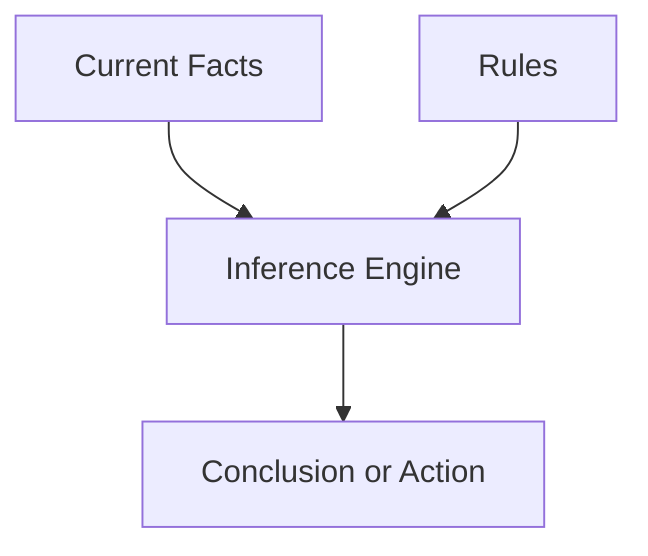

# P1-2.1 符号主义 AI 与规则式方法

> Section ID: `P1-2.1`
> Version: `v2026.07.09`

P1-1 整理了 AI 这个词的范围和主要术语之间的关系。这里开始转向历史上的问题求解范式。这一节的中心是 `symbolic AI` 和 `rule-based approach`。

符号主义 AI，是指把人的知识写成符号、规则、逻辑和显式表征，再通过操作这些表征得到结论或行动的一类方法。用更直白的话说，它的出发点是：如果能把人的知识写成计算机能处理的形式，计算机就可以在这种形式上进行推理。

在 Part 1 中，`symbolic AI`、`rule-based approach` 和 `knowledge representation` 的基准含义固定在这里。后面的 Section 再次提到这些词时，只保留当前问题所需的最小连接；如果要重新核对完整定义，就回到这一节和共享的 [Concept Glossary (English)](/AiBook/en/reference/concept-glossary.md)。

## 这一节的范围

这一节整理以下问题：

- 符号主义 AI 试图做什么？
- 规则、知识表示、推理和搜索，怎样连接成一条更大的脉络？
- 为什么这种方法在今天的一些系统里仍然有效？

这一节不会深入展开以下内容：

- 各类逻辑系统的形式化推导
- 专家系统的实现细节
- 与机器学习模型的定量性能比较

搜索、知识表示和概率推理的更细脉络，会在 `P1-2.2` 继续回收；规则式系统的优势与限制，会在 Part 1 Chapter 3 里再更具体地评价。

## 这一节的目标

- 理解符号主义 AI 试图达成什么。
- 看清规则、知识表示、推理和搜索如何连接。
- 区分规则式方法的优势与限制。
- 理解这种方法为什么在今天的一些系统里仍然有用。

## 先连起来的概念

这一节是 Chapter 2 中首次固定核心术语基准线的代表位置。

| 概念 | 这里先固定的意思 | 为什么现在需要 |
| --- | --- | --- |
| [symbolic AI](/AiBook/en/reference/concept-glossary.md#aisymbolic-ai) | 以符号、规则和显式知识表示为中心的 AI 方法 | 为了建立后面与学习式方法对照的起点 |
| [rule-based system](/AiBook/en/reference/concept-glossary.md#rule-based-system) | 把当前事实与规则相匹配，从而决定结论或行动的系统 | 为了看见符号主义 AI 的一种具体实现形态 |
| [knowledge representation](/AiBook/en/reference/concept-glossary.md#knowledge-representation) | 用来书写事实、关系和规则的形式 | 为了说明系统“知道什么”意味着什么 |
| [fact](/AiBook/en/reference/concept-glossary.md#fact) | 在当前情境下被当作真的信息 | 为了把规则应用的输入材料单独分出来 |
| [inference engine](/AiBook/en/reference/concept-glossary.md#inference-engine) | 找出并应用与当前事实匹配规则的机制 | 为了看见规则与结论之间的执行结构 |

## 主要学习点

虽然这一节看起来像历史说明，但它真正介绍的是 AI 早期一条重要的问题求解方式。

| 基准 | 为什么重要 | 这一节需要达到的理解程度 |
| --- | --- | --- |
| symbolic AI 是一种 `把知识显式写下来` 的方法 | 这样才能和后面的机器学习形成对照。 | 先分清：规则和事实要由人先写出来。 |
| rule-based approach 是一种 `按条件决定结论或行动` 的方法 | 这样更容易和日常规则联系起来理解。 | 看懂当前情境与规则相匹配的结构。 |
| 这种方法 `不是已经消失的过去`，而是仍留在某些系统中 | 这样不会把它误读成“死掉的前史”。 | 把它和政策、权限、安全规则等今天仍在使用的结构连接起来。 |

这里首先应该留下的区分是：什么被明确命名，什么被写成规则，什么在当前状态下被当作事实，以及从这些内容中导出了什么结论。

## 细化学习

### 为什么这种方法会先出现

早期 AI 的大问题之一，是如何把“看起来智能的行为”变成计算机程序。其中一条主要回答是：把人的事实、规则和推理程序显式写下来，再让计算机去操作它们。

在这种思路里，智能常常被看成对“以符号形式表示的事实与规则”进行操作的过程。规则式方法使这件事更容易变成实际系统：专家可以把判断标准写成条件、模式、行动和结论，计算机再把当前事实和这些规则进行比对。

因此，符号主义 AI 和规则式方法不应只被当成过时技术。更准确的读法是：它们是早期 AI 里一条重要的解题策略，即先把知识显式写下来，再在其上进行推理。

### 为什么叫 “symbolic”

这里的 `symbol` 不是文学意义上的象征，而更接近于计算机可以区分和操作的显式标签。

例如，`rain`、`wet road`、`patient`、`symptom`、`position of chess pieces`、`rule A` 之类的名字，都可以是符号主义 AI 中的符号。系统利用这些显式标记来表示知识，并在其上做规则应用、逻辑推理或搜索。

所以，本书里的 `symbolic AI`，指的是围绕符号与显式表征来实现智能的一类方法。

### 试图用符号表示世界

符号主义 AI 的基本假设是：知识可以被显式表示出来。人可以说出“下雨时路会变湿”“某些症状可能对应某些疾病”“这一步会让棋盘变成那样的状态”之类的话。

符号主义 AI 试图把这些知识变成计算机能使用的结构。核心组成可以先看成下面这样。

| 组成 | 作用 |
| --- | --- |
| symbol | 标记对象、概念或状态 |
| rule | 表达在某种条件下应得到什么结论或行动 |
| knowledge representation | 存储事实、概念、关系与规则 |
| inference | 从已有知识推出新结论 |
| search | 在可能状态或候选解中朝目标前进 |

在这种方法里，系统主要依靠人写下来的知识来解题，而不是自动从数据中学习模式。

### 规则式方法的基本形状

规则式方法，是最容易看懂符号主义 AI 的一种形态。核心思想是：把当前事实或情境与显式规则进行比对，再据此决定结论、分类、行动或处理流程。

> 条件或情境 -> 结论、分类、行动或处理流程

`IF condition THEN conclusion` 是最常见的简化写法，但真实系统不一定只用这一种语法。

| 情境 | 示例规则 | 结果 |
| --- | --- | --- |
| 日常判断 | 如果正在下雨且要出门，就带伞 | 行动决定 |
| 工作流 | 如果支付金额超过审批上限，就转到经理审批 | 流程选择 |
| 访问控制 | 如果用户角色不是管理员，就阻止设置变更 | 允许或阻止 |
| 安全策略 | 如果请求匹配被禁止的类别，就停止或改写回复 | 策略应用 |

关键在于结构：事实和规则分开存放，然后进行匹配。

这个图要读出的重点是：只有事实不够，只有规则也不够。系统还需要一个单独的过程，把两者匹配起来并产生结论。

### 优势与限制的轮廓

符号主义 AI 与规则式方法的优势比较直观。

- 规则是显式写出来的，所以更容易检查判断路径。
- 领域专家可以直接审阅和修改知识。
- 它们适合重视法律、政策或流程的领域。
- 对同样输入，通常更容易控制为同样输出。

但限制也很明确。

- 规则的编写与维护成本会越来越高。
- 例外情况和规则冲突会迅速累积。
- 模糊输入和带噪声的数据很难完全覆盖。
- 不是所有模式都能由人提前写成规则。

因此，更准确的对比不是“符号主义 AI 错了，机器学习对了”，而是：问题类型不同。有些问题更适合显式规则，有些问题更适合从数据中学习模式。

## 案例与示例

### 案例 1. 客服里的运费退款规则

设想一个客服流程要判断是否退还运费。最开始规则似乎很简单：卖家责任、买家主观退货、是否为合单、商品是否损坏。规则式方法可以把这些标准写得清楚且可审计。但当例外越来越多时，规则会变得难以一致维护。这个案例同时展示了显式规则的实用优势和扩展时的限制。

### 案例 2. 基于规则的权限控制

权限系统通常有清楚的标准，例如角色、部门和审批阶段。在这种情况下，问题的重点并不在于从数据中学习隐藏模式，而在于正确且可解释地应用显式政策。这说明规则式系统在现代服务架构中仍然有现实价值。

## 这一节要记住的内容

- symbolic AI 试图通过符号、规则和逻辑显式表示知识
- 规则式系统是它最具体的一种实现形态
- 这种方法没有消失，在政策、权限和流程等场景里仍然有用
- 它的主要弱点是：例外和复杂度增长后，规则维护会变得困难

这一节至少要留下的一句话是：`symbolic AI 试图通过把知识显式写下来，并在其上推理来解决问题。`
