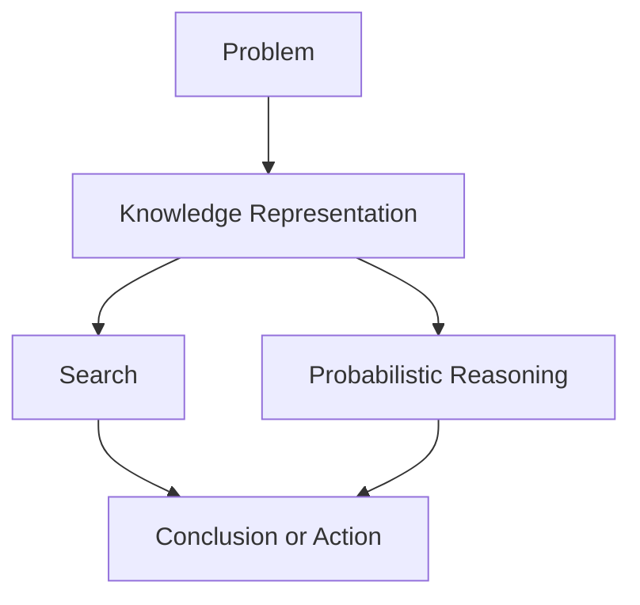

# P1-2.2 搜索、知识表示与概率推理

> Section ID: `P1-2.2`
> Version: `v2026.07.07`

2.1 看了符号主义 AI 和规则式方法。这一节继续回答下一个问题：当“只把规则写出来”还不够时，AI 为什么还需要搜索候选、表示知识，以及在不确定条件下进行推理。

这里的目标不是细学算法，而是先固定：为什么 `search`、`knowledge representation` 和 `probabilistic reasoning` 会在 AI 导论里反复出现，以及它们如何构成后来解释机器学习与深度学习的背景。

在 Part 1 中，`search` 与 `probabilistic reasoning` 的基本区分固定在这里。`knowledge representation` 已在 2.1 中做过初步介绍，这里只在与搜索和概率推理对照时重新连接；如果这些边界之后又变得模糊，就回到这一节和共享的 [Concept Glossary (English)](/AiBook/en/reference/concept-glossary.md)。

## 这一节的范围

这一节整理以下问题：

- 为什么搜索会是早期 AI 的核心解题方式？
- 知识表示与规则式方法如何相连？
- 概率推理如何处理不完整信息和不确定性？

这一节不会深入展开以下内容：

- 搜索算法的具体步骤和复杂度比较
- 表示语言的形式语法
- 概率图模型的数学展开

这里的重点，是把这三条脉络的 `角色差异` 分清楚。为什么后来的解释中心会转向“从数据中学习”，会在 2.3 继续回收。

## 这一节的目标

- 理解为什么搜索是早期 AI 的核心解题方式之一。
- 看清知识表示如何与规则式方法连接。
- 理解概率推理是处理不完整信息和不确定性的一种方式。
- 把搜索、知识表示和概率推理区分为机器学习出现前 AI 的三条重要主轴。

## 先连起来的概念

| 概念 | 这里先固定的意思 | 为什么现在需要 |
| --- | --- | --- |
| [search](/AiBook/en/reference/concept-glossary.md#search) | 沿着可能状态和行动朝目标推进的方法 | 为了看见候选很多时为什么“顺序”会成为问题 |
| [knowledge representation](/AiBook/en/reference/concept-glossary.md#knowledge-representation) | 用来书写事实、关系与约束的形式 | 为了把“系统该知道什么”这个问题单独分出来 |
| [probabilistic reasoning](/AiBook/en/reference/concept-glossary.md#probabilistic-reasoning) | 在不完整信息下处理“多大程度上可信”的方式 | 为了避免把所有判断都压成简单的真或假 |
| [goal](/AiBook/en/reference/concept-glossary.md#goal) | 想要到达的条件 | 为了看搜索在什么地方停下 |

## 主要学习点

| 基准 | 为什么重要 | 这一节需要达到的理解程度 |
| --- | --- | --- |
| search 是一个 `候选太多时先看谁` 的问题 | 这样才看得出为什么光有规则还不够。 | 先区分：可能选择太多，就需要顺序。 |
| knowledge representation 是一个 `把什么写成已知` 的问题 | 这样才能理解为什么事实、规则和关系要分开讨论。 | 把“以计算机可处理的形式写下问题”这件事整理清楚。 |
| probabilistic reasoning 处理的是 `不完整信息下结论有多可信` | 这样才能把 AI 和现实里那些不是非真即假的问题连起来。 | 把概率和不确定判断连接起来。 |

这里首先应该留下的区分是：`search` 处理状态、行动和目标，`knowledge representation` 决定系统把什么写下来，`probabilistic reasoning` 处理不确定条件下的可信度。

## 细化学习

### 规则之后会出现的三个问题

规则式方法描述的是：在某种条件下应得出什么结论或采取什么行动。但真实问题往往不会只靠一条规则就结束。

例如，规划路线时，目的地也许是固定的，但道路很多、条件会变化，而且信息可能不完整。这时，AI 系统至少还得回答三类问题。

| 问题 | 对应的方法 | 核心意思 |
| --- | --- | --- |
| 候选很多时，先看哪个？ | search | 沿着状态和路径朝目标前进 |
| 系统要解决问题，必须知道什么？ | knowledge representation | 把事实、关系、约束和规则写成可用形式 |
| 信息不完整或带噪声时，哪个结论更可信？ | probabilistic reasoning | 根据证据计算可信度或概率 |

这三个问题彼此不同，但真实系统里常常会同时出现。

### 搜索：在状态空间里找到目标

搜索会沿着可能状态和行动前进，直到到达目标。只要候选太多，这个结构就会出现在路线规划、谜题、游戏、计划和排程问题里。

搜索问题可以先简化为下面几个部件。

| 组成 | 例子 |
| --- | --- |
| 初始状态 | 当前位置、棋盘局面、当前排程 |
| 行动 | 移动、落子、改变任务顺序 |
| 下一状态 | 行动之后发生变化的新状态 |
| 目标测试 | 到达目的地、解开谜题、满足条件 |
| 代价或评价 | 距离、时间、风险、分数 |

真正的难点在于：候选数量会迅速膨胀。所以启发式才会重要。启发式不是保证正确的真理规则，而是一种经验性的标准，用来帮助系统决定“先看哪个候选更有希望”。

这也是初学者常把 `heuristic` 和 `probability` 混淆的地方，因为它们都可能表现成数字，但回答的问题不同。

| 区分 | 先回答什么问题 | 这个值扮演的角色 | 简短例子 |
| --- | --- | --- | --- |
| heuristic | 先检查哪个候选？ | 决定搜索顺序或优先级 | 先看直线距离更短的路线 |
| probability | 哪个结论更可信？ | 表达不完整信息下的可信程度 | 症状组合让疾病 A 比疾病 B 更可能 |

所以，启发式更接近 `搜索顺序`，概率更接近 `相信程度`。

### 知识表示：什么算作“已知”

如果说搜索是在候选之间移动，那么知识表示就是在决定：系统首先必须存下什么、并在其上推理什么。

2.1 已经通过规则展示了知识表示的一种形式。但表示并不只是一张规则表。事实、关系、概念、约束、时间变化、行动及其例外，都可以成为表示对象。

以配送计划系统为例，它可能需要表示：

- 仓库、客户地址和中转点等地点
- 道路连通或单行路线等关系
- 冷链时限之类的约束
- 会改变位置或剩余时间的行动
- “完成所有配送并降低成本”这样的目标

真正的关键问题不只是“什么是真的”，而是“该用什么形式写下什么内容，才能让系统之后提出有用的问题”。

### 概率推理：在不确定中计算可信度

规则和逻辑擅长的是“如果这个为真，就推出那个”的结构。但现实信息常常是不完整的、带噪声的，而且可能同时支持多个不同结论。

例如：

| 情境 | 为什么不确定 |
| --- | --- |
| 根据症状推测疾病 | 同一种症状可能出现在多种疾病中 |
| 判断邮件是不是垃圾邮件 | 只靠几个词很难确定 |
| 根据传感器判断是否有障碍物 | 传感器会有噪声或缺失信号 |
| 预测客户是否流失 | 过去行为无法完全决定未来行为 |

概率推理把这类问题里的不确定性显式写出来。重点不是“随机瞎猜”，而是：随着证据变化，系统如何更新不同结论的可信程度。

所以，这里只需先记住：`probabilistic reasoning` 是一种在不完整信息下计算不同结论有多可信的方法。

### 三条脉络如何连接

搜索、知识表示和概率推理，虽然从不同问题出发，但可以一起工作。

这个图要表达的不是竞争，而是分工：`knowledge representation` 写下结构，`search` 在候选里推进，`probabilistic reasoning` 在信息不确定时帮助判断。

例如，一个仓库机器人可能同时需要：

- 用知识表示记录仓库结构、物体位置和约束
- 用搜索决定路径和任务顺序
- 用概率推理处理不稳定传感器或变化中的走廊条件

## 案例

### 案例 1. 配送 App 里的路线规划

在雨天晚高峰，一个配送 App 需要分配订单。搜索关心的是先检查哪条路线或哪种配送顺序；知识表示关心的是骑手位置、门店位置、配送区域和时限约束怎样存下来；概率推理关心的是交通延迟和天气导致的变慢有多大可能。这个案例展示了三类问题如何并存于一个系统里。

### 案例 2. 内部系统中的结构化权限

一个内部权限系统未必需要很重的搜索，但它仍然需要很强的知识表示：角色、部门、审批阶段和例外关系都要写清楚。如果某些状态信息并不完整，周边系统里也可能引入概率推理；但核心难点仍然是表示结构。这个案例有助于把三种角色分开，而不是把它们都压成一个模糊的“AI 过程”。

## 这一节要记住的内容

- search 是在太多候选状态中朝目标推进
- knowledge representation 是在决定系统把什么算作“已知”、又如何写下来
- probabilistic reasoning 是在不完整信息下处理可信度
- 真实 AI 系统常常会同时结合这三者，而不是只选一种

这一节至少要留下的一句话是：`search 在候选之间找路径，knowledge representation 把问题写下来，probabilistic reasoning 处理不确定性。`
