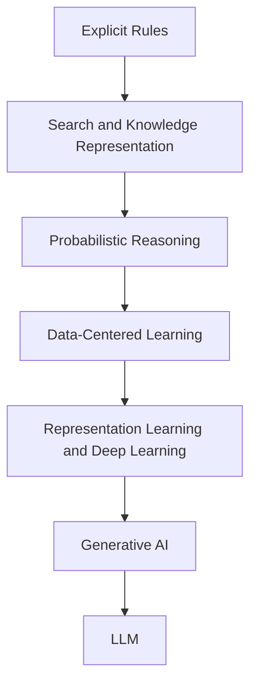

# P1-2.3 走向机器学习、深度学习与生成式 AI 的脉络

> Section ID: `P1-2.3`
> Version: `v2026.07.09`

2.1 看了符号主义 AI 与规则式方法，2.2 看了搜索、知识表示与概率推理。这一节继续回答下一个问题：为什么 AI 的说明中心会越来越多地转向“从数据中学习的模型”？

这里的任务，不是完整讲解机器学习、深度学习和生成式 AI，而是先建立一条历史上的解释线：为什么说明中心会从 `人把规则都写出来`，移动到 `模型从数据和经验中学习`。

在 Part 1 中，从规则式方法转向学习式方法的历史变化，以及 `data`、`feature`、`representation` 和 `parameter` 之间的基本连接，固定在这里。`AI`、`machine learning`、`deep learning`、`generative AI` 和 `LLM` 之间的宽泛关系已在 1.3 建立；这里把它们重新连成一条历史脉络。如果这些边界之后又摇晃起来，就回到这一节和共享的 [Concept Glossary (English)](/AiBook/en/reference/concept-glossary.md)。

## 这一节的范围

这一节整理以下问题：

- 为什么有些问题很难只靠规则解决，从而转向数据式学习？
- 机器学习、深度学习和生成式 AI 经历了怎样的历史连接？
- 为什么数据、特征、表征、模型和参数会越来越重要？

这一节不会深入展开以下内容：

- 监督学习和无监督学习算法的细部步骤
- 神经网络结构与反向传播公式
- LLM 服务在产品层面的实现差异

这里的重点，是先回答这条历史问题：`为什么解释中心转向了学习？`

## 这一节的目标

- 理解为什么许多问题无法只靠显式规则解决，而转向了数据式学习。
- 把机器学习、深度学习和生成式 AI 放进同一条历史脉络中区分。
- 看清为什么数据、特征、表征、模型和参数变得重要。
- 把生成式 AI 和 LLM 理解成累积脉络中的较后阶段，而不是突然断裂的例外。

## 先连起来的概念

| 概念 | 这里先固定的意思 | 为什么现在需要 |
| --- | --- | --- |
| [data](/AiBook/en/reference/concept-glossary.md#data) | 用于学习和判断的材料 | 为了看见替代手写规则的依据来自哪里 |
| [feature](/AiBook/en/reference/concept-glossary.md#feature) | 先由人整理或挑选出的线索 | 为了固定早期机器学习如何依赖输入表示 |
| [representation](/AiBook/en/reference/concept-glossary.md#representation) | 模型内部处理数据的形式 | 为了看见深度学习为何常被解释为表征学习 |
| [parameter](/AiBook/en/reference/concept-glossary.md#parameter) | 在学习过程中被调整的内部值 | 为了固定“学习到底改变了什么” |
| [machine learning](/AiBook/en/reference/concept-glossary.md#machine-learning) | 从数据中提升性能的学习式方法 | 为了理解从写规则到训练模型的转移 |
| [deep learning](/AiBook/en/reference/concept-glossary.md#deep-learning) | 以神经网络为中心、强烈依赖表征学习的方法 | 为了理解从特征设计转向学习表征 |
| [generative AI](/AiBook/en/reference/concept-glossary.md#aigenerative-ai) | 能生成新内容的模型与服务类别 | 为了看清最近的技术流走到了哪里 |

## 主要学习点

| 基准 | 为什么重要 | 这一节需要达到的理解程度 |
| --- | --- | --- |
| 许多问题很难靠人把所有规则都写清，所以中心转向 `数据式学习` | 这样才能理解机器学习为什么会变成核心。 | 先区分：很多问题对手写标准来说过于复杂。 |
| 机器学习、深度学习和生成式 AI 是 `连接起来的阶段`，不是彼此无关的流行词 | 这样很多术语才能放在同一张地图上。 | 把它们整理成 数据学习 -> 表征学习 -> 生成 的脉络。 |
| LLM 只是 `最近很强的一条技术流`，不是整个 AI | 这样不会把当前产品体验误当成全部历史。 | 把 LLM 视为生成式 AI 的代表，而不是 AI 的全部。 |

这一节先留下一个基准就够了：`data` 是材料，`feature` 是人整理出来的线索，`representation` 是模型内部形式，`model` 是计算结构，`parameter` 是学习改变的内部值。

## 细化学习

### 有些问题太难用规则完全覆盖

规则式方法在“标准可以被明确写出来”的场景里仍然很强。但很多真实问题变化太多，无法靠这种方式完整覆盖。

| 问题 | 为什么很难全部写成规则 |
| --- | --- |
| 从照片识别物体 | 人无法现实地写出所有像素层面的有效条件 |
| 理解自然语言 | 语境、省略、歧义和说法变化太多 |
| 垃圾邮件检测 | 攻击者会持续改变模式，几个词远远不够 |
| 客户流失预测 | 行为模式复杂，而且会随时间变化 |
| 语音识别 | 发音、噪声、录音环境和说话风格都在变化 |

这时，问题就从 `人该写什么规则？` 变成 `模型能从数据里学到什么关系？`

### 机器学习：从写规则转向训练模型

机器学习，是一种让模型通过数据或经验不断提高性能的方法。这里的 `model`，指的是接收输入并产生预测、分类、推荐、分数或行动的计算结构。

> data or experience -> learning -> model -> prediction, classification, recommendation, or action

它和规则式系统的对比如下。

| 区分 | 规则式方法 | 机器学习方法 |
| --- | --- | --- |
| 判断标准 | 人显式写下的规则 | 从数据中训练出来的模型 |
| 开发者的主要工作 | 写规则并处理例外 | 准备数据、设计特征、训练和评估 |
| 优势 | 更容易解释，也更容易控制 | 能从数据中学到复杂模式 |
| 弱点 | 面对大量例外和变化时容易变脆弱 | 依赖数据质量、评估和泛化能力 |

机器学习并不是单一方法。这里先只固定大类名称。

| 学习类型 | 最基本的问题 |
| --- | --- |
| supervised learning | 给定输入，要预测什么输出或标签？ |
| unsupervised learning | 没有标签时，怎样发现结构？ |
| reinforcement learning | 行动带来后续回报时，应该学到什么策略？ |

这些学习类型的细节，会在 Part 1 Chapter 8 和后续 Parts 里再展开。

### 数据中心判断与数据挖掘的背景

解释中心转向机器学习，并不只是 AI 内部的变化。它也伴随着数据的大规模积累，以及“希望从数据中发现模式”的实际需求一起扩张。

所以，更稳妥的理解不是“AI 从此只等于数据式判断”，而是：

> 在原本的规则、搜索、知识表示和概率推理之上，又增加了一层更强的结构，让模型从数据中学习判断标准。

这样读，才能保留历史连续性，而不是把更早的 AI 全部擦掉。

### 一次性整理核心学习术语

下面这些术语会在这一节里反复出现。这里先把它们固定成基准线。

| 术语 | 这里先固定的意思 |
| --- | --- |
| data | 观测到或存储下来的例子与数值，例如日志、图像或句子集合 |
| feature | 为了让模型更容易使用而整理出来的输入线索 |
| representation | 数据在模型内部被处理的形式 |
| model | 把输入映射成预测、分类、推荐或生成结果的计算结构 |
| parameter | 在学习过程中被调整的内部值 |

在这一阶段，只要先记住：`data` 是材料，`feature` 与 `representation` 是让材料变得可用的方式，`model` 负责计算，`parameter` 是学习时被调整的内部值，就已经足够。

### 深度学习：从特征设计走向表征学习

在很多传统机器学习场景里，人必须显式设计出有用特征。例如垃圾邮件检测，会看链接数量、域名类型或关键词频率；图像任务，会手工准备颜色、边缘或形状等线索。

深度学习改变了这种平衡。它使用多层神经网络，从数据中学习更丰富的内部表征。

| 区分 | 传统机器学习的典型流程 | 深度学习的典型流程 |
| --- | --- | --- |
| 特征 | 往往较多依赖人来设计 | 越来越多由模型自己学出来 |
| 模型结构 | 常常相对较浅 | 常常使用多层神经网络 |
| 强项场景 | 数据较少或结构较清楚的问题 | 图像、音频和语言等复杂输入 |

这里不应把深度学习讲成“和生物大脑完全一样”。对学习而言，更有用的说法是：

> 深度学习是一种优化过程：具有可学习权重的多层神经网络，从数据中发现有用表征和预测规则。

这也是 `representation` 这类说法开始变得核心的地方。

### 生成式 AI：通过输出变得明显的一次转向

生成式 AI，指的是能生成文本、图像、音频、视频或代码等新内容的模型与服务。

| 类型 | 中心输出 | 例子 |
| --- | --- | --- |
| classification | 类别 | 正常 / 异常 |
| prediction | 数值或分数 | 销售预测、流失概率 |
| recommendation | 候选列表 | 商品或文档推荐 |
| generation | 新内容 | 句子、图像、代码、音频 |

这里最重要的一点是：生成式 AI 不是“会说事实的机器”。它根据训练数据中学到的模式，生成“看起来合理”的输出。读起来很自然，并不自动等于真实。

### LLM 位于这条脉络的哪里

LLM 是生成式 AI 里的代表性模型家族，但它不等于全部生成式 AI，生成式 AI 也不等于整个 AI。

这条脉络可以先这样读。

这个图不该被理解为：后一阶段把前一阶段彻底消灭了。它表达的是一种累积的历史分层，说明解释中心随着时间发生了移动。

现代 AI 服务也并不只由一个 LLM 组成。搜索、工具、显式规则、权限控制、日志、评估和界面，都可能同时属于同一个系统。

## 案例与示例

### 案例 1. 为什么图像分类很难一直靠规则表扩展

设想你想只用显式规则来区分商品图片是正常还是瑕疵，例如裂纹长度、污点数量或亮度阈值。这样的做法在很窄的情境里也许有效，但光照、角度、反光和细微视觉变化很快就会让规则表变脆弱。这个案例说明：说明中心为什么会从 `还要再写哪些规则？` 转向 `模型应该从大量图像里学到什么模式？`

### 案例 2. 为什么不该把 LLM 看成突然冒出来的例外

如果读者主要通过聊天机器人认识 AI，LLM 就很容易看起来像一件与过去 AI 没关系的新事物。但一旦恢复整条脉络，LLM 就更容易被定位：它出现在数据中心学习、深度学习和表征学习之后，是 AI 内部最近很强的一条技术流，而不是全部。

## 这一节要记住的内容

- 解释中心转向学习，是因为很多重要问题太难只靠显式规则完全覆盖
- 机器学习、深度学习和生成式 AI 应被读成同一条脉络中的连续阶段
- 数据、特征、表征、模型和参数之所以变得核心，是因为判断越来越依赖从例子中学习
- LLM 是一条很强的近期技术流，但不是 AI 的全部

这一节至少要留下的一句话是：`AI 的说明中心从直接写规则，转向了从数据中学习模式和表征，而 LLM 是这条脉络较后的一个结果。`
