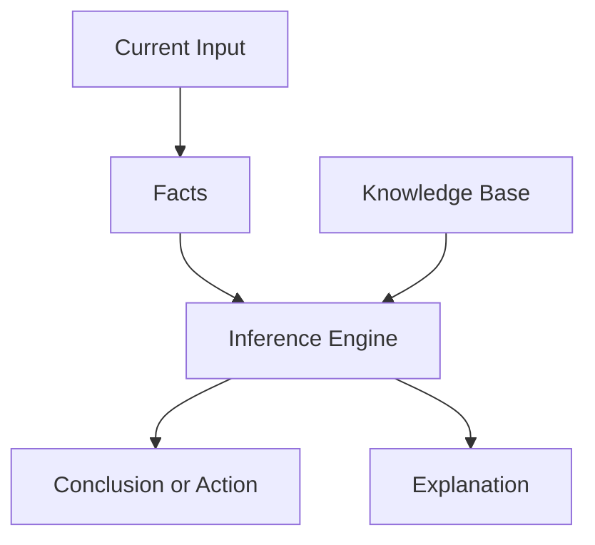

# P1-3.1 规则式系统的优势与限制

> Section ID: `P1-3.1`
> Version: `v2026.07.07`

2.1 说明了 `symbolic AI` 与 `rule-based approach` 的历史位置，2.3 则说明：即使在同一业务里，也会同时存在 `适合写成显式政策条件的部分` 和 `需要从数据中学习关系的部分`。这一节把问题再缩小一步，直接看 `rule-based system` 在实际系统里有哪些优势，又在哪些地方开始暴露限制。

这里的目标不是把规则式 AI 断定成失败的过去，而是区分三件事：为什么规则式系统曾经有用，为什么关注点后来转向了 `machine learning`，以及为什么在今天的很多系统里规则仍然不可或缺。

在 Part 1 中，`rule-based system` 的优势、限制与现代系统中的角色，以这一节为基准。`symbolic AI`、`rule-based approach` 与 `knowledge representation` 的基本含义已经在 2.1 建立，这里只在评价系统时按需要重新连接。

## 这一节的范围

这一节整理以下问题：

- 一个规则式系统由哪些部件组成？
- 这种方法的优势和限制各自出现在哪里？
- 为什么在现代系统里规则仍然需要保留？

这一节不会深入展开以下内容：

- 专家系统完整框架设计
- 与机器学习模型的定量实验比较
- 大型策略引擎的整体设计

超出规则、转向从数据中学习模式的脉络，会在 `P1-3.2` 继续回收；与 `representation learning` 的差异，则会在 `P1-3.3` 继续展开。

## 这一节的目标

- 理解规则式系统的主要组成部件。
- 看清规则式系统为什么在可解释性与可控性上很强。
- 区分专家系统历史所展示的可能性与限制。
- 理解为什么写规则、获取知识、处理例外会变得困难。
- 对现代服务里规则层与模型层如何共存，先建立一个简化图景。

## 先连起来的概念

| 概念 | 这里先固定的意思 | 为什么现在需要 |
| --- | --- | --- |
| [rule-based system](/AiBook/en/reference/concept-glossary.md#rule-based-system) | 把当前事实与规则相匹配，从而决定结论或行动的系统 | 为了把评价对象本身说清楚 |
| [fact](/AiBook/en/reference/concept-glossary.md#fact) | 在当前状态下被当作真的信息 | 为了看清规则究竟应用在什么之上 |
| [knowledge base](/AiBook/en/reference/concept-glossary.md#knowledge-base) | 存放规则、事实与领域知识的结构 | 为了看清规则集“住”在哪里 |
| [inference engine](/AiBook/en/reference/concept-glossary.md#inference-engine) | 找出并应用匹配规则的机制 | 为了看清结论是如何真正产生的 |
| [explanation facility](/AiBook/en/reference/concept-glossary.md#explanation-facility) | 展示某个结果为何出现的功能 | 为了固定规则式系统的重要优势之一 |

## 三个基准

| 基准 | 为什么重要 | 这一节需要达到的理解程度 |
| --- | --- | --- |
| 规则式系统通过连接 `current facts` 与 `rules` 来产生结论 | 这样能先固定基本结构。 | 区分输入、规则与结果。 |
| 它的强项是 `explainability` 与 `controllability` | 这样才能理解为什么规则至今仍留在政策与运营层。 | 理解为什么结果路径更容易追踪。 |
| 它的主要限制是 `例外与变化会让规则管理变难` | 这样会自然连到为何后来转向机器学习。 | 理解为什么窄域问题适配，而复杂现实更难完全覆盖。 |

## 规则式系统的基本结构

规则式系统会把当前事实或输入与规则相匹配，再决定结论、分类、行动或处理流程。

> current facts + rule set -> inference engine -> conclusion or action

再明确一点，可以把结构拆成下面这些部分。

| 组成 | 作用 |
| --- | --- |
| facts | 当前输入、观测值、用户状态、业务数据 |
| rules | 写明在什么条件下应得出什么结论或行动的知识 |
| knowledge base | 存放规则、事实与领域知识的结构 |
| inference engine | 找出并应用匹配规则的机制 |
| explanation facility | 展示哪些规则导致了结果的功能 |

这里最关键的一点，不只是系统会产出结果，而是它往往还能把“为什么会得到这个结果”一起暴露出来。

## 例子：把审批流程写成规则

审批流程是理解规则式系统最直接的场景之一。标准相对明确，处理过程需要留痕，而且在相同条件下通常应该得到相同结果。

| 当前事实 | 应用的规则 | 结果 |
| --- | --- | --- |
| 金额较小且预算充足 | 自动审批 | 已批准 |
| 金额超过较低阈值 | 需要组长审批 | 等待组长 |
| 金额超过较高阈值 | 需要部门负责人审批 | 等待部门负责人 |
| 预算不足 | 无论金额都驳回 | 因预算原因驳回 |
| 申请人与审批人相同 | 禁止自我审批 | 重新指定审批人 |

这类结构容易检查，也容易解释。但真实流程会很快加入紧急采购、项目例外、供应商限制、审批人休假、审计规则等条件，这正是规则扩张开始变难的地方。

## 优势 1：可读、可审阅

规则式系统最大的优势之一，就是判断标准是显式写出来的。

- 人可以直接检查规则内容。
- 领域专家可以修改判断标准。
- 政策与法律要求更容易被追踪。
- 审计与运营复盘更自然地接入这类结构。

在审批例子里，如果有人问“为什么这笔请求进入了部门负责人审批”，系统可以把条件链写出来，而不必解释一堆不透明的内部参数。

## 优势 2：更容易让相同输入得到相同输出

规则式系统往往更容易被做成确定性的。只要事实相同、规则相同，结果就更容易复现。

这使它特别适合那些必须严格执行的程序：

- 没有足够权限就阻止访问
- 条件不满足就禁止上传或进入下一步
- 明确禁止的请求类型必须被拦截
- 自我审批必须被阻止

但要注意，`可复现` 不等于 `一定正确`。如果规则本身写错了，系统也可能会非常稳定地一直输出错误结果。

| 区分 | 含义 | 在规则式系统里的意思 |
| --- | --- | --- |
| reproducibility | 相同条件下能再次得到相同结果 | 有利于测试、审计与运营追踪 |
| correctness | 结果本身是否符合政策或现实 | 仍需要单独检查规则是否正确 |

## 优势 3：在窄域里可以很快变得有用

当问题范围较窄、标准较明确时，规则式系统可以很快产生实际价值。专家系统历史已经展示过这种可能性：只要领域边界够清楚、专家知识能被写下来，符号化知识就能在局部问题上非常有效。

更稳妥的结论不是“专家系统解决了智能”，而是：在范围足够窄、标准足够显式时，符号化知识可以非常有力。

## 主要限制

一旦现实变得更多样、更模糊，这类系统的限制就会更明显。

- 写规则和维护规则的成本很高
- 例外情况会不断累积，规则之间也可能冲突
- 未曾见过或难以精确定义的情境很难覆盖
- 含糊、带噪声、不断变化的输入难以处理
- 系统不会自动通过数据改善自己的内部表征

因此，把历史读成“规则式 AI 错了，机器学习对了”过于简单。更准确的说法是：后来的很多问题已经超出了“维护一套显式规则”能够稳定应对的范围。

## 现代角色

当机器学习和深度学习变强之后，规则并没有消失。只要显式政策仍然重要，规则层就会继续存在。

| 现代场景 | 为什么规则仍然适合 |
| --- | --- |
| 权限与访问控制 | 需要显式标准 |
| 审批流程 | 系统必须说明为什么触发某一步 |
| 安全策略 | 禁止与允许的条件必须可检查 |
| 运营自动化 | 重复条件比灵活模式匹配更重要 |

所以，更准确的总结不是“规则式系统只属于过去”，而是：它在显式政策、流程与可审计性很重要的地方仍然强，而同一个系统里的其他部分则可能更适合学习式模型。

## 案例

### 案例 1. 内部采购审批

一个采购审批流程如果包含金额阈值、角色约束和预算检查，就很适合写成规则，也很适合审计。但当例外和重叠政策开始增多时，这种优势会转化成维护成本。这个案例同时说明了规则式系统为什么有用，以及它为什么会随着复杂度上升而变难。

### 案例 2. AI 服务里的安全过滤

一个 AI 服务可能会用学习式模型生成回答，但仍在外层加上显式安全规则和权限规则。这说明规则式系统即使在现代生成式 AI 服务里，也仍然承担重要职责。

## 这一节要记住的内容

- 规则式系统在显式标准、可复现性和可解释性重要时很强
- 它的主要限制出现在例外、歧义与变化不断累积时
- 规则没有消失，它们仍然留在政策、权限、流程和安全层

这一节至少要留下的一句话是：`rule-based systems 在标准必须显式写清时很强，但当现实充满例外时，它们会很难扩展。`
