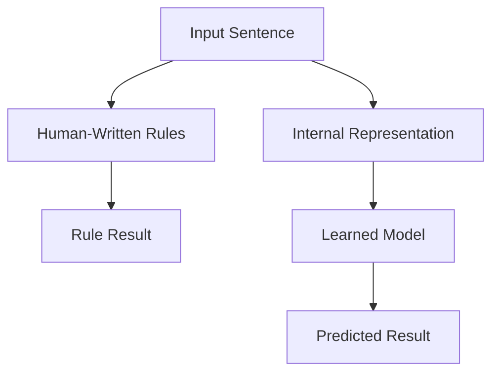
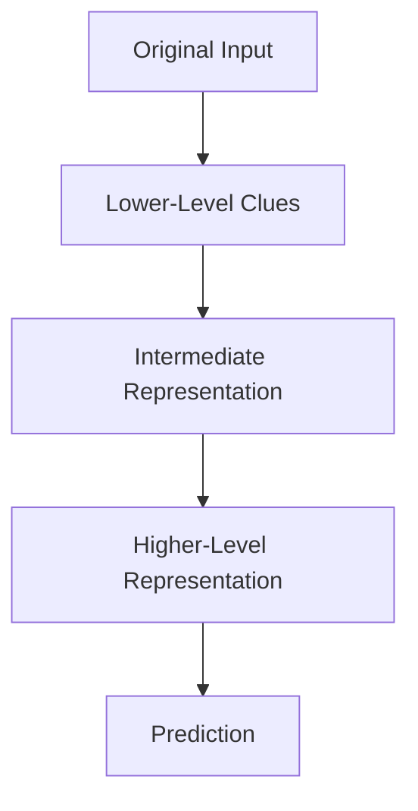
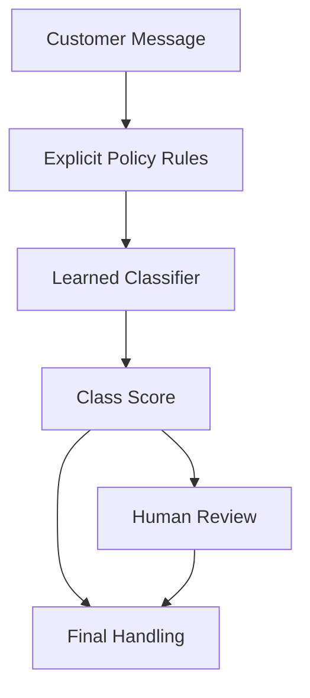

# P1-3.3 规则式方法与表征学习

> Section ID: `P1-3.3`
> Version: `v2026.07.09`

3.1 讨论了直接写规则的优势与限制，3.2 讨论了从数据中学习模式的基本结构。这一节不再重复整个学习流程，而是把焦点缩小到一个问题：`rule-based approach` 和 `representation learning` 在“如何处理输入”这件事上到底有什么不同？

这里的核心任务，不是详细解释深度学习内部实现，而是先固定 `rule`、`feature`、`representation` 和 `parameter` 各自所在的位置，避免把它们混在一起。

在 Part 1 中，`representation`、`vector`、`activation` 与 `representation learning` 的基线含义固定在这里。前一节已经建立了 `example`、`label`、`training` 与 `generalization` 的基本结构，这里只在解释“输入如何被转成内部形式”时按需要重新连接。

## 这一节的范围

这一节整理以下问题：

- 规则式方法与表征学习，在处理输入方式上有什么不同？
- `feature` 与 `representation` 的关系应该怎样理解才最稳妥？
- “学习出来的表征很强，但更难解释”这句话究竟是什么意思？

这一节不会深入展开以下内容：

- 层与参数学习的详细公式
- 学习向量的维度与优化细节
- 模型解释技术的完整实现

这里的重点，是一个中心区分：`规则在模型外面，而学习到的表征在模型里面。`

## 这一节的目标

- 区分规则式方法与表征学习。
- 理解 `features` 与 `representations` 的关系。
- 看清人设计的特征与模型学出来的表征之间的差异。
- 理解为什么学到的表征能很强，但也更难直接读懂。
- 自然连接到下一章关于输入、输出、数据、特征与参数的内容。

## 三个基准

| 基准 | 为什么重要 | 这一节需要达到的理解程度 |
| --- | --- | --- |
| 规则是 `写在外面的标准`，表征是 `模型内部使用的形式` | 这样能看见两者所处位置的差异。 | 区分可读的显式标准与内部计算形式。 |
| 特征可以由人设计，而模型也可能学出更深的表征 | 这样会自然连到传统机器学习和深度学习的差异。 | 整理输入线索与学习得到的内部形式之间的不同。 |
| 学到的表征虽然强，但更难解释 | 这样能说明为什么后面需要评价与解释工作。 | 把“处理变化的能力”与“可直接阅读性下降”联系起来。 |

在这一阶段，最有用的基线是：`rules` 是外部标准，`features` 是抽取出来的线索，`representations` 是内部形式，`vectors` 是数值束，`activations` 是中间值，`parameters` 是学习到的内部标准。

## 先把同一个问题看成两种处理方式

继续沿用客户支持消息的例子。假设输入句子是：

> 如果明天还收不到配送，我就取消。

规则式方法可能会写出类似这样的显式条件：

- 如果句子里包含 `配送` 和 `明天`，就把它视为配送相关
- 如果包含 `取消`，就把它标为取消候选
- 如果两种条件同时出现，就送去人工复核

这种方式的可读性很强，因为标准是直接写出来的。

学习式模型则走另一条路：

> message -> internal representation -> model computation -> class score

这里真正新增的焦点是 `internal representation`。模型不会像人那样直接读取整句文字，而是先把输入变成可计算的数值形式，再基于这个内部形式做判断。

这个图想表达的只是“位置差异”：规则作为书写出来的标准，待在模型外部；而表征是在模型内部先被构造出来，然后预测才发生。

## 这一节的边界

3.2 讲了 `examples`、`labels`、`models`、`training`、`inference` 和 `generalization`。3.3 不会把那整条流程再讲一遍，而是把问题缩小。

| 区分 | 3.2 的中心 | 3.3 的中心 |
| --- | --- | --- |
| 主要问题 | 从数据中学习模式是什么意思？ | 把输入变成内部表征是什么意思？ |
| 核心术语 | example, label, model, training, inference, generalization | rule, feature, representation, parameter |
| 主要风险 | 记忆、过拟合、数据质量弱 | 不透明与难解释 |

## 规则在外，表征在内

显式规则待在模型外部，通常以代码、配置、政策文档或知识库的形式出现，人可以直接读取与修改。

而学到的表征待在模型内部。它们是输入经过已学习参数变换后产生的中间值，或者说，是输入在模型里被改写后的内部形式。

| 区分 | 显式规则 | 学到的表征 |
| --- | --- | --- |
| 位置 | 代码、配置、政策、知识库 | 内部向量、激活值、已学习的变换 |
| 形成方式 | 由人直接写出 | 通过数据与训练过程调整出来 |
| 优势 | 可读、可审阅、较易控制 | 更擅长处理复杂模式与变化 |
| 弱点 | 例外爆炸时维护困难 | 很难直接用人的语言解释 |

这也是为什么说“AI 自己学出了规则”时要非常谨慎。模型也许学到了内部标准，但那并不等于它生成了一份干净、可直接阅读的规则清单。

## 特征可以由人设计，也可以被进一步学习

3.2 已经把 `feature` 解释成模型使用的输入值。它至少可以有两种来源。

第一种，是人显式设计出来。

| 原始输入 | 人设计的特征例子 |
| --- | --- |
| 支持消息 | 是否出现 `退款` 这个词 |
| 支持消息 | 是否出现 `配送` 这个词 |
| 支持消息 | 句子长度 |
| 客户记录 | 最近订单数量 |

这些特征介于“规则写作”和“更深的学习表征”之间。人决定抽什么出来，但最终判断仍可以由学习式模型完成。

第二种，是模型自己继续学习更丰富的内部表征。尤其在深度学习里，输入会经过多层处理，在每一层都变成不同的内部形式。

这个图并不是说真实模型里一定存在这样整齐的人类可读层级，而是为了学习：输入可以在多步处理中逐渐变成不同的内部表征，然后才产生输出。

## 表征会改变问题的难度

同样的原始输入，如果被换成不同的表征，模型面对的问题难度也会变化。

看下面两句话：

> 商品寄来时是坏的。  
> 我昨天收到的东西已经损坏，想请你们再补发一次。

从原始字符串看，它们并不相同；但如果把它们变成更有用的内部表征，两者就可能会变得更接近，因为它们都和“已收到”“损坏”“补发可能性”有关。

| 表征方式 | 更容易看见什么 | 可能漏掉什么 |
| --- | --- | --- |
| 原始字符串 | 完全一致的重复措辞 | 同义但不同写法的表达 |
| 人设计的关键词 | 显式词项是否出现 | 语境、否定、复杂互动 |
| 学到的表征 | 多种线索的组合与更广的相似性 | 人类直接阅读性 |

所以，表征的选择几乎和算法选择一样重要。

## 学到的表征更宽，但不透明

显式规则很清晰。

> 如果句子的意思是“改地址”，就路由到配送信息修改。

但现实里的句子往往没这么清晰。

> 我把收件人号码写错了。  
> 如果还没出库，可以改送到别的地方吗？  
> 请不要送到之前那个地址，改送公司。

这些句子即使没有完全相同的关键词，也都可能与“配送信息修改”相关。学到的表征在这里更有优势，因为它可以跨越表面措辞差异，捕捉更广的相似性。

但这种强项也带来代价：系统更难精确回答“究竟是哪一个线索最重要”或“为什么它觉得这两个例子相似”。

| 情境 | 显式规则更强时 | 学到的表征更强时 |
| --- | --- | --- |
| 法律禁止条件 | 条件必须被精确阻止时 | 只能作为辅助信号 |
| 审批流程 | 必须执行显式标准时 | 适合推荐例外候选 |
| 文本分类 | 关键词边界很清晰时 | 说法变化多且语境重要时 |
| 图像识别 | 简单阈值就足够时 | 角度、光照、背景变化很大时 |

## 规则与表征并不是非此即彼

把规则式方法和学习式表征看成“旧方式”和“新方式”的简单替代，会让人误解真实系统。很多系统会把两者放在一起使用。

比如，一个客服消息路由系统可以：

- 先用显式策略规则过滤掉禁止或必须升级的情况
- 再用学习式模型去分类语言表达更灵活的消息
- 对低置信度或高风险情况转人工复核

这个图想表达的是责任分工：显式规则负责不可协商的约束，学到的表征负责处理灵活变化的输入。

## 案例与示例

### 案例 1. 客服消息路由

一家公司可能会用硬性的政策规则去处理禁止动作、必须升级的场景或特殊客户类别，同时用学习出来的表征去分类更灵活多变的消息语言。这说明规则层和表征层常常会共存于同一个服务里。

### 案例 2. 视觉瑕疵检测

一个简单的视觉系统也许起初只靠亮度阈值或形状规则，但当角度、反光和纹理变化变复杂时，系统就会越来越依赖学习得到的内部表征。这个案例说明：随着原始输入复杂度上升，`representation learning` 的重要性也会上升。

## 这一节要记住的内容

- 规则写在模型外面，而学习到的表征在模型内部被构造出来
- `features` 和学到的内部 `representations` 并不完全是一回事
- 学到的表征更擅长处理变化，但也比显式规则更不透明
- 真实系统常常会把规则层和模型层结合起来，而不是只选一种

这一节至少要留下的一句话是：`rule-based systems 依赖显式的外部标准，而 representation learning 会把输入转成模型内部可用于预测的形式。`
