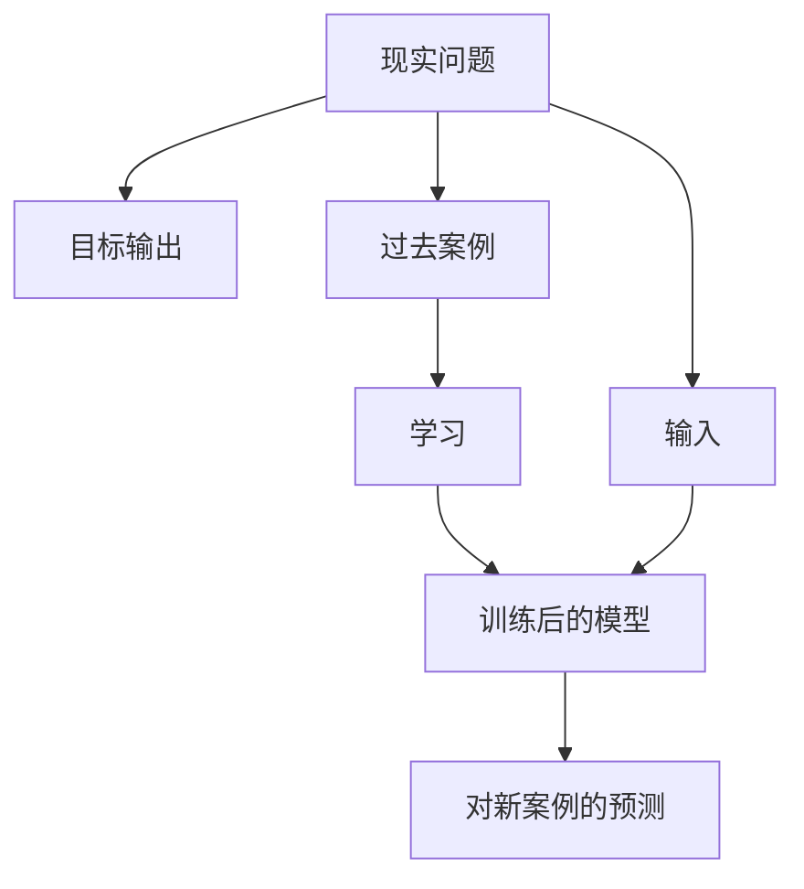

# P1-4.2 输入、输出与数据

> Section ID: `P1-4.2`
> Version: `v2026.07.08`

4.1 把 `model` 说明成：它不是整个现实问题，而是为了某个目的而缩减出来的可计算表示。现在要进一步区分描述这个模型时最先拆开的三个元素：我们往里放什么、希望它产出什么、又需要收集哪些案例。

这一节整理 `input`、`output` 与 `data`。`feature`、`representation` 和 `parameter` 会在 4.3 再讲。

延续前面的例子，这里仍以 `想用 AI 帮助处理客户支持消息` 为主线。我们会不断轻微改写这个场景，去看输入、输出和数据是怎样彼此分开的。

## 这一节的范围

这一节整理以下问题：

- `input`、`output` 和 `data` 分别起什么作用？
- 为什么同一个现实问题，只要输入和输出定义不同，就会变成不同任务？
- 为什么 `data` 不能只被看成文件堆，而应该被看成一组 `examples`？

这一节不会深入展开以下内容：

- `features`、`representations` 与 `parameters` 的细部差别
- 学习算法与损失函数的计算
- 完整的数据流水线与服务运营结构

这里的重点，是先分开 `放进去什么`、`产出什么`，以及 `需要收集什么案例`。

## 这一节的目标

- 区分 `input`、`output` 与 `data` 的角色。
- 理解把现实问题读成“输入和输出之间的关系”这一视角。
- 看到：同一个现实问题，只要输入与输出定义不同，所需数据也会跟着改变。
- 理解数据不是单纯的文件集合，而是教模型学习标准的一组案例。
- 为 4.3 里的 `features` 与 `representations` 做准备。

## 三个基准

| 基准 | 为什么重要 | 这里先固定的区分 |
| --- | --- | --- |
| `input` 是模型真正看到的信息 | 这样才能知道模型凭什么作判断。 | 先抓住“放进去的信息”这个感觉，比如句子、图像、传感器值。 |
| `output` 是要求模型产出的结果 | 这样才能理解同一现实问题为何会变成不同任务。 | 要先分清模型最后是要给类别、分数还是句子。 |
| `data` 是一组输入-输出案例 | 这样才能看清数据不是文件堆，而是学习依据。 | 把过去案例和模型将要学什么联系起来。 |

在这一阶段，只先留下一个大区分就够了：`input` 是放进去的信息，`output` 是想得到的结果，`data` 是案例集合，`example` 是其中一条，而 `label` 是希望模型给出的答案名称。

## 把现实问题变成可计算形式

AI 模型不会直接处理整个现实。人必须先从现实里挑出一部分作为输入，再规定模型应该产出什么输出。

例如，`我们想处理客户支持消息` 还不是一个建模任务。它太宽、太模糊。

可以把它一步步收窄。

| 阶段 | 仍然太宽的表达 | 更接近建模任务的表达 |
| --- | --- | --- |
| 1 | 我们想处理客户支持消息 | 我们想给客户支持消息分类 |
| 2 | 我们想给客户支持消息分类 | 我们想根据支持消息文本判断消息类型 |
| 3 | 我们想根据支持消息文本判断消息类型 | 我们想把消息文本作为输入，输出 `退款`、`配送`、`换货` 或 `其他` 之一 |

到第三步时，事情才真正开始接近建模任务，因为这时我们能看见：什么是输入、什么是输出、需要什么过去案例。

| 问题 | 一个可能的回答 |
| --- | --- |
| 什么是 input？ | 客户写下来的消息文本 |
| 什么是 output？ | `退款`、`配送`、`换货`、`其他` 中的一个类别 |
| 什么是 data？ | 过去的消息文本和人工标好的消息类型 |
| 模型要做什么？ | 预测新消息最接近哪一类 |

这个结构可以先压成一句话：

> input -> model -> output

这个图强调的是：我们不会把整个现实问题直接扔进模型，而是先拆成 `input`、`target output` 和 `past examples`，再通过学习与预测把它们连接起来。

## input 是模型真正观察到的东西

`input` 是模型为作判断而接收到的信息。它可以是文本、图像、传感器值，也可以是表格数据。

| 问题 | 输入例子 |
| --- | --- |
| 客服消息分类 | 消息文本 |
| 垃圾邮件分类 | 邮件标题与正文 |
| 降雨预测 | 温度、湿度、气压、地区、时间 |
| 人脸识别 | 人脸图像 |
| 商品推荐 | 点击、购买和搜索记录 |
| 故障检测 | CPU、内存、错误率、响应时间 |

定义输入时，一个重要点是：现实中重要的信息，不一定就是实际送进模型的信息。

| 人在现实里也许能看到的信息 | 被选作模型输入的信息 |
| --- | --- |
| 客户的消息文本 | 包含 |
| 过去订单记录 | 不包含 |
| 当前配送状态 | 不包含 |
| 之前客服留下的备注 | 不包含 |
| 客户等级或敏感信息 | 不包含 |

如果是这样，模型就只能根据消息文本判断。即使配送状态对人很重要，只要它不在输入里，模型就用不了。

所以，定义输入，其实是在同时决定：

> 什么要展示给模型？  
> 什么不展示给模型？

## output 是我们交给模型的任务

`output` 是模型必须产出的结果。即使输入完全相同，只要输出定义一变，问题本身也会跟着改变。

还是用同一条客服消息，也可以定义出很多种不同输出。

| 输出定义 | 输出形式 |
| --- | --- |
| 选出一种消息类型 | 固定类别 |
| 预测 1 到 5 的紧急程度 | 数值分数 |
| 推荐负责团队 | 路由目标 |
| 生成回复草稿 | 自然语言句子 |
| 判断是否需要人工复核 | 是 / 否 |

所以，单说“用 AI 来处理客户支持消息”还远远不够。还必须说清楚：模型到底要输出类别、数值、句子，还是一个是否复核的标记。

假设输入句子是：

> 我昨天刚下单，但现在还查不到物流。

即使是这一句，也会因为输出定义不同而变成不同任务。

| 交给模型的任务 | 输出例子 | 说明 |
| --- | --- | --- |
| 选择消息类型 | 配送 | 在固定类别中选一个 |
| 给出紧急程度 | 2 | 输出一个数值 |
| 推荐负责团队 | 物流团队 | 选一个下游处理目标 |
| 生成回复草稿 | “物流信息同步可能需要一些时间……” | 生成文本 |
| 判断是否要人工复核 | 否 | 判断自动化是否安全 |

最重要的一点是：一旦 `output` 变了，所需 `data` 也会跟着变。

## data 是输入-输出案例的集合

`data` 是模型用来参考或学习的一组案例。在 `supervised learning` 里，这通常意味着：每个案例都同时带有输入和希望得到的输出。

在这一节里，可以先把一条 `example` 简化地看成：

> input + desired output

| 输入 | 输出 |
| --- | --- |
| “我想退款。” | 退款 |
| “配送什么时候到？” | 配送 |
| “商品寄来时是坏的。” | 换货或补发 |
| “我想修改地址。” | 配送信息修改 |

这个表虽然简单，但已经展示出最重要的结构：

> example 1 = input 1 + output 1  
> example 2 = input 2 + output 2  
> example 3 = input 3 + output 3

所以，`data` 不能只被看成一堆文件，而应该被看成一组在教模型“输入和输出之间应学到什么关系”的案例。

## 这一节要记住的内容

在这一阶段，最关键的区分很简单：

> input = 模型真正看到的信息  
> output = 模型必须产出的结果  
> data = 把两者连起来的一组过去案例

只要这个区分稳定了，像 `我们想用 AI 帮助处理客户支持消息` 这样的大话，就能被压缩成一个更小、更可计算的任务。
