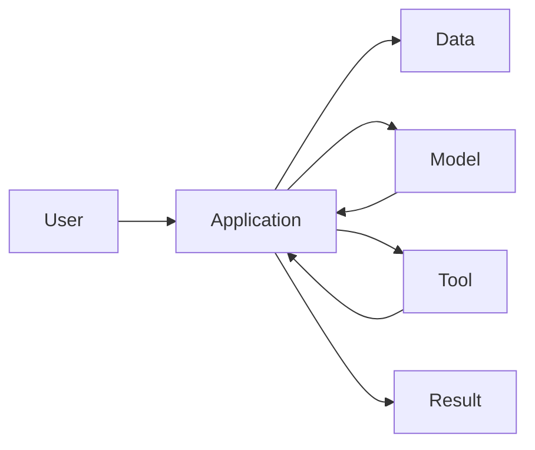

# P1-14.1 模型(model)、应用(application)、数据(data)、工具(tool)

> Section ID: `P1-14.1`
> Version: `v2026.07.08`

第 13 章已经看过嵌入(embedding)、相似度搜索(similarity search)、RAG(retrieval-augmented generation)，以及向量搜索实现的直觉。这条脉络会带来一个重要转向：

> 不再只看单个 LLM  
> -> 开始看围绕 LLM 形成的服务结构

AI 服务并不是只靠一个模型(model)就能构成。还需要用户实际接触到的应用(application)、模型可参考的数据(data)、连接外部系统的工具(tool)，以及把整个流程协调起来的代码与执行结构。

> AI 服务是一种系统：模型负责生成与判断，应用负责用户体验与流程，数据提供依据与状态，工具连接外部动作，而编排(orchestration)把这些部分串起来。

这里更重要的不是实现细节，而是一张整体地图。

Part 1 会在这里先建立 `模型(model)`、`应用(application)`、`数据(data)`、`工具(tool)`、`编排(orchestration)` 的基本区分。第 13 章主要看的是模型如何通过嵌入、检索与 RAG 参考外部资料；这里则把视角再放大一步，整理：`一个完整的 AI 服务究竟由哪些部件组合而成？`

## 本节范围

这里先区分 AI 服务的主要组成部分。RAG 与工具使用(tool use)的具体位置放到 P1-14.2；agent、MCP(Model Context Protocol)、harness、成本与运维约束则放到 P1-14.3 以后。

`模型`、`应用`、`数据`、`工具`、`编排` 是不同层次的服务构件。它们的作用可以先区分如下：

| 术语 | 极简含义 | 本节中的作用 |
| --- | --- | --- |
| 模型 | 根据输入执行生成与判断的计算部件 | 服务的核心计算单元 |
| 应用 | 用户发出请求并接收结果的界面与流程 | 用户体验的入口 |
| 数据 | 提供依据与状态的信息 | 回答与执行所依赖的材料 |
| 工具 | 调用外部系统功能的连接方式 | 查询与动作的执行面 |
| 编排 | 按什么顺序、在什么条件下把这些元素连接起来 | 构成服务结构的框架 |

这里先把 `模型负责计算`、`应用负责体验`、`数据提供依据`、`工具负责执行`、`编排负责连接流程` 作为基准线。

| 主题 | 本节要看的问题 |
| --- | --- |
| 模型(model) | 到底是谁在生成和判断？ |
| 应用(application) | 用户是在什么地方发出请求、看到结果？ |
| 数据(data) | 模型参考的依据与状态来自哪里？ |
| 工具(tool) | 模型之外的系统是如何被调用的？ |
| 流程(orchestration) | 这些元素由谁按什么顺序连接起来？ |

## 本节目标

- 把 AI 服务理解为多个组成部分的组合，而不是单一模型。
- 区分模型(model)、应用(application)、数据(data)、工具(tool)各自的作用。
- 对提示词(prompt)、RAG、工具调用在服务流程中的位置建立整体图景。
- 理解模型并不直接完成全部工作，而是被应用与服务代码包裹在输入输出流程中。
- 为进入 P1-14.2 关于 RAG 与工具使用(tool use)的区分做准备。

## 三个基准

这里要松开“AI 服务 = 模型”这种直觉。阅读本节时，可先抓住下面三个视角。

| 基准 | 为什么重要 | 本节所需的理解水平 |
| --- | --- | --- |
| AI 服务不是只由一个模型构成 | 这能减少把聊天体验直接等同于整个系统的误解。 | 只要理解成应用、数据、工具也必须一起存在即可。 |
| 模型、应用、数据、工具承担不同角色 | 这会成为后面阅读 RAG、agent、MCP 的基本地图。 | 只要区分生成、流程管理、依据提供、外部动作即可。 |
| 服务质量不只取决于模型能力，还取决于整体连接方式 | 这能让读者建立最初的架构视角。 | 只要理解成权限、检索、后处理也同样重要即可。 |

## 模型是生成答案的核心部件

模型(model)是 AI 服务中的核心计算部件。它可以读取用户输入，并输出文本、代码、图像说明、结构化数据等内容。

一开始可以把模型简化为：

> 输入(input)  
> -> 模型(model)  
> -> 输出(output)

但真实服务会在这条链条外面包上更多结构：

> 用户请求  
> -> 应用整理输入  
> -> 检索所需数据  
> -> 调用模型  
> -> 审查或后处理  
> -> 向用户显示

模型负责重要的判断与生成，但它不会独自完成账号管理、权限检查、数据存储、外部 API 调用、界面渲染。这些工作属于应用与服务代码。

因此，如果把“AI 服务”直接看成“模型本身”，就很容易忽略真正的流程。

| 误解 | 更安全的说明 |
| --- | --- |
| 模型处理服务中的一切 | 模型只是服务中的核心计算部件 |
| 模型知道所有数据 | 模型会依据输入上下文与训练得到的表示作答 |
| 模型直接执行动作 | 真正的动作由应用、服务器、工具调用代码完成 |

## 应用负责处理用户请求与结果流

应用(application)是用户真正接触到的表层。网页、移动应用、聊天界面、IDE 扩展、工作台面板都可以是应用。

应用并不只是把问题原封不动地丢给模型，它通常还会同时处理下面这些事情：

| 应用的作用 | 说明 |
| --- | --- |
| 收集输入 | 接收用户的问题、文件、选项、设置 |
| 组装上下文 | 整理用户状态、界面信息、历史对话、选中文档 |
| 展示输出 | 以可读方式显示模型结果 |
| 处理错误 | 告知失败、延迟、权限问题 |
| 审核流程 | 让用户修改、批准或重试结果 |

例如，可以想一个文档写作辅助应用：

> 用户：  
> 请把这一段写得更容易懂。
>
> 应用：  
> 把当前段落、文档标题、选中范围、期望语气一起整理后发送给模型。
>
> 模型：  
> 生成修改候选。
>
> 应用：  
> 把原文与修改稿并排展示，让用户决定是否采用。

用户可能觉得自己像是在“直接和模型对话”，但实际体验往往是由应用设计好的流程塑造出来的。

## 数据提供依据与状态

在 AI 服务里，数据(data)通常承担两种主要角色。

第一，它提供回答所需的依据。RAG 检索到的文档、组织知识库、产品手册、本书正文都属于这一类。

第二，它提供服务当前需要的状态。用户设置、权限、任务历史、订单状态、项目元数据等，都属于处理当前请求所需的信息。

| 数据类型 | 例子 |
| --- | --- |
| 依据数据(evidence data) | 文档、手册、论文、FAQ、书稿正文 |
| 状态数据(state data) | 用户设置、权限、会话、任务进度 |
| 输入数据(input data) | 用户上传文件、提问、选中的段落 |
| 日志数据(log data) | 请求记录、错误、评估结果、反馈 |

对 AI 服务而言，关键并不是“数据越多越好”，而是：哪些数据要展示给模型，哪些数据要隐藏，哪些数据必须保持最新。

> 好的数据连接：  
> 只传递必要信息，符合权限要求，保持最新，并能追溯来源。
>
> 差的数据连接：  
> 混入无关信息、过期信息、无权限信息、无来源信息。

这个视角会和第 13 章讲的 RAG 连起来。RAG 不是把全部数据塞进模型，而是先找出与问题相关的候选，再把它们放进输入上下文(context)。

## 工具负责执行模型之外的动作

工具(tool)是连接模型外部系统的执行路径。它可以让模型之外的功能进入同一个服务流程。

这里可以先这样理解：

> 模型：  
> 提议应该做什么，或者生成要调用的工具名与参数。
>
> 工具执行代码：  
> 真正完成 API 调用、搜索、文件处理、数据库查询。

例如，假设用户请求：

> 从上周会议记录里只找出决议事项，并加到日程备注里。

这类请求不一定能靠模型单独完成。

| 需要完成的事 | 主要负责元素 |
| --- | --- |
| 找会议记录 | 搜索工具或文件检索 |
| 提取决议事项 | 模型 |
| 转换成日程格式 | 模型或应用代码 |
| 写入日历/备注系统 | 日历或备注 API 工具 |
| 确认结果 | 应用 |

工具使用很强大，但也带来风险。工具可能被误调用、访问无权限数据、执行用户未批准的动作。因此，工具调用会在 P1-14.2 里更具体地拆开来看。

## 流程由应用与执行代码来编排

即使有了模型、应用、数据、工具，也不会自动变成一个好的服务。还必须决定这些元素该按什么顺序连接。

这可以称为编排(orchestration)。

> 接收用户请求  
> -> 检查权限  
> -> 检索所需数据  
> -> 组装提示词  
> -> 调用模型  
> -> 判断是否需要工具  
> -> 后处理结果  
> -> 向用户显示  
> -> 保存日志与反馈

不同服务的流程会不同。

| 服务 | 更重要的流程部分 |
| --- | --- |
| 文档检索聊天机器人 | 检索、来源展示、回答审查 |
| 代码辅助工具 | 读文件、生成补丁、运行测试 |
| 客服机器人 | 查询客户状态、核对政策、必要时转人工 |
| 工作自动化应用 | 审批、外部 API 调用、执行日志 |

关键点在于：模型并不自动承担整个流程。模型在流程中负责判断与生成，而应用与服务器代码决定何时调用模型、提供什么数据、允许什么工具、怎样审查结果。

## 把四个组成部分放在一起看

如果把 AI 服务进一步简化，可以得到下面这张结构图：

这张图并没有覆盖真实系统中的全部细节，但足以让我们一眼把这些组成部分的角色连接起来。

## 本节应记住的视角

AI 服务不是只有模型。模型很重要，但只有当应用、数据、工具、编排一起加上去时，服务才真正能被使用。

> 模型负责生成与判断。  
> 应用塑造用户体验与流程。  
> 数据提供依据与状态。  
> 工具连接外部动作。  
> 编排把这些部分串起来。

## 简短检查

- 能把 AI 服务解释成模型、应用、数据、工具、编排的组合。
- 能区分模型(model)、应用(application)、数据(data)、工具(tool)各自的作用。
- 能说明模型是服务中的核心计算部件，而不是整个服务本身。
- 能说明数据既提供依据，也提供状态。
- 能说明工具负责执行模型之外的动作。

## 什么时候要先想起这个视角

- 当聊天体验被直接当作整个系统时
- 当需要把提示词、检索、工具调用放进同一个服务流程里解释时
- 当服务质量被完全归因于模型能力时

这时，先把系统拆成 `模型`、`应用`、`数据`、`工具`、`编排` 五个部分，会更容易避免把整个服务扁平化成“只有模型”。
