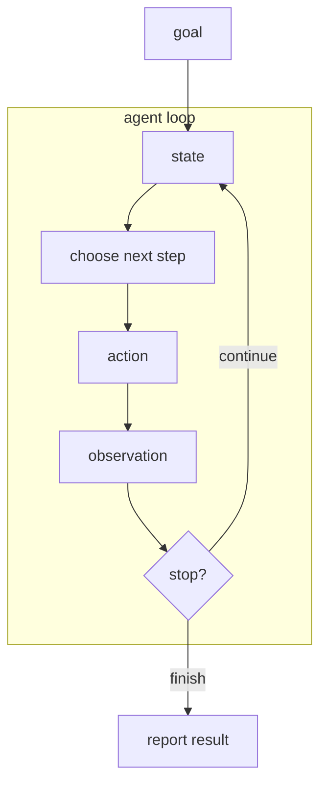

# P1-14.3 agent：把目标(goal)连接成工作流(workflow)的结构

> Section ID: `P1-14.3`
> Version: `v2026.07.09`

在 P1-14.2 中，我们已经区分了 RAG 与工具使用(tool use)。

> RAG：  
> 找到需要的资料，并把它贴进模型输入上下文。
>
> 工具使用(tool use)：  
> 调用外部系统功能来查询信息或执行动作。

agent 可能包含这两者，但它并不是这两个词的同义词。一旦出现 `agent` 这个词，重点就会从 `一次回答` 转向更长的执行流程。

> agent 是一种执行结构：它接收目标(goal)，检查当前状态(state)，选择下一步动作(action)，根据工具执行后的观察(observation)更新状态，并决定继续还是停止。

这里不会把 agent 理解成夸张的“完全自主实体”，而是把它理解成：在 AI 服务中把多步工作持续推进的结构。

## 本节范围

这里把 agent 理解为 `把目标串成工作流的结构`。MCP(Model Context Protocol) 这类工具连接标准放到 P1-14.4；harness、执行日志、评估、可复现性放到 P1-14.5；成本、延迟、运维约束放到 P1-14.6。

`agent`、`目标`、`状态`、`动作`、`观察`、`停止条件` 分别对应执行流程中的不同元素。

| 术语 | 极简含义 | 本节中的作用 |
| --- | --- | --- |
| agent | 把目标推进为多步执行的结构 | 本节的中心概念 |
| 目标(goal) | 想解决的任务 | 循环的起点 |
| 状态(state) | 到目前为止读过、做过、得到过什么 | 决定下一步的材料 |
| 动作(action) | 接下来要执行的工作 | 检索、编辑、调用等具体步骤 |
| 观察(observation) | 动作之后得到的结果 | 更新状态的依据 |
| 停止条件(stop condition) | 什么时候停下来并汇报 | 防止无限循环或过度执行 |

这里先把 `agent 是沿着目标、根据状态来连接动作的结构` 作为基准线。

| 主题 | 本节要看的问题 |
| --- | --- |
| 目标(goal) | 请求中的哪一部分应被理解成工作目标？ |
| 状态(state) | 现在已经知道什么，又已经做了什么？ |
| 动作(action) | 下一步该用什么工具，或生成什么回应？ |
| 观察(observation) | 工具结果应怎样重新放回流程里？ |
| 停止条件(stop condition) | 任务应在什么时候停下并汇报结果？ |

## 本节目标

- 把 agent 理解为一种执行结构，而不是“更聪明的聊天机器人”或另一个模型名字。
- 区分提示词(prompt)、RAG、工具使用(tool use)、agent。
- 理解 agent 可以连接多步任务，但这不意味着无限自主。
- 理解应用(application)、服务器(server)、运行环境(runtime)仍需管理权限(permission)、审批(approval)、状态(state)。
- 为理解 Codex 一类编码 agent 工具在服务架构中的位置做准备。

## 三个基准

| 基准 | 为什么重要 | 本节所需的理解水平 |
| --- | --- | --- |
| agent 是把目标串成多步任务的执行结构 | 这能把 agent 与一次性聊天回答区分开。 | 只要理解成它会在状态基础上持续选择下一步即可。 |
| prompt、RAG、工具使用都可以成为 agent 的组成部分 | 这能把相关概念放进同一张地图。 | 只要理解成 agent 可以组合使用这些部件即可。 |
| agent 仍必须运行在权限与审批边界之内 | 这能建立更安全的服务级理解。 | 只要理解成范围与审批仍由应用和服务器管理即可。 |

## agent 处理的是比“一次回答”更长的流程

普通模型调用(model call)可以简化为：

> 输入(input)  
> -> 模型(model)  
> -> 输出(output)

提示词(prompt)是在输入里加入指示、上下文、示例；RAG 会再附上检索出来的外部资料；工具使用则在需要时调用外部系统。

agent 和这些不同的地方在于：它不会只做一次，而是会把这些部件持续串接，直到任务达到停止条件。

> 请求目标  
> -> 查看当前状态  
> -> 选择下一步  
> -> 执行工具或生成响应  
> -> 观察结果  
> -> 更新状态  
> -> 决定继续还是停止

例如，假设用户请求：

> 请写出技术文档中的某一节，留下审查记录，并确认结果是否正确反映到成品里。

这并不是一次生成一句话就能结束的任务。

| 阶段 | 可能动作 |
| --- | --- |
| 理解目标 | 确认当前小节的中心问题与文档边界 |
| 查看状态 | 阅读目录、前置相关章节、既有审查记录 |
| 获取依据 | 查官方文档、论文、既有资料 |
| 编写内容 | 生成 Section 正文与依据说明 |
| 验证结果 | 运行构建或检查流程确认结果被正确反映 |
| 汇报结果 | 告知用户改了哪些文件、验证结果如何 |

这类多步骤推进，就是 agent 结构的直觉。

## agent 循环：目标、状态、动作、观察

理解 agent 时，`循环(loop)` 这个视角很有用。

| 元素 | 说明 |
| --- | --- |
| 目标(goal) | 用户想解决的事 |
| 状态(state) | 当前对话、已读文件、执行结果、中间判断 |
| 选择下一步 | 决定先做什么、需要什么工具 |
| 动作(action) | 检索、读文件、改代码、调 API、写回答 |
| 观察(observation) | 工具结果、错误、检索结果、测试结果 |
| 停止条件(stop condition) | 判断任务是否完成，或是否需要更多审批/信息 |

ReAct 论文可以作为这里的一个研究参照：它讨论了语言模型如何在 reasoning 与 acting 之间来回切换，并从外部环境中获取信息。这里最重要的不是论文细节，而是这种结构感：

> 思考  
> -> 行动  
> -> 观察  
> -> 继续或停止

## RAG 与工具使用可以成为 agent 的材料

agent 不是用来替代 RAG 或工具使用的词。更准确地说，它会把这些部件放进同一条工作流里。

| 构成部分 | 在 agent 流中的作用 |
| --- | --- |
| 提示词(prompt) | 传递目标、指示、约束、输出格式 |
| RAG | 找依据资料并插入上下文 |
| 工具使用(tool use) | 执行外部检索、计算、文件处理、API 调用 |
| 状态(state) | 保存中间结果与执行历史 |
| 编排(orchestration) | 决定执行顺序 |

例如，“按照差旅报销规定处理这张发票”可以展开为：

> 1. 检索规定文档。  
> 2. 读取发票内容。  
> 3. 比较规定与发票。  
> 4. 询问缺失字段。  
> 5. 经审批后写入报销系统。  
> 6. 汇报依据与处理结果。

把整条流程连接起来的，就是更接近 agent 的结构。

## agent 不等于无限自主

`agent` 这个词很容易被误解，好像模型会自己设目标、任意使用所有工具、自由改变外部世界。这种理解很危险。

更安全的说法是：

> agent 是把目标推进为多步执行的结构，  
> 但权限、审批、执行范围、停止条件仍需要由应用与服务器来管理。

因此，服务设计里仍然要明确下面这些控制项：

| 必要控制 | 为什么需要 |
| --- | --- |
| 权限(permission) | 限制用户可访问的数据与工具 |
| 审批(approval) | 邮件、支付、部署等高风险动作需要人工确认 |
| 校验(validation) | 检查工具参数与执行结果 |
| 停止条件(stop condition) | 防止无穷循环或错误循环 |
| 日志(log) | 保留执行记录以便之后核查 |

## Codex 这类编码 agent 是一个好例子

像 Codex 这样的编码 agent 工具，很适合用来理解这种结构。假如有人请求它“写一节内容并检查构建”，那显然不可能只靠一次自然语言输出就完成。

| 工作 | 从 agent 视角怎么理解 |
| --- | --- |
| 读文件 | 确认当前状态 |
| 检查依据资料 | 观察周边上下文与依据 |
| 写补丁 | 执行下一步动作 |
| 运行构建 | 验证结果是否真的工作 |
| 提交或部署 | 在权限与范围允许时执行动作 |
| 回报结果 | 解释改了什么、验证了什么 |

这种工具之所以有用，不是因为它“神奇地自主”，而是因为它能在不丢失目标的前提下，继续推进多步骤工作，同时仍待在策略与审批边界之内。

## 需要先想到失败点

agent 很强，但失败方式也更复杂。

| 失败点 | 例子 |
| --- | --- |
| 目标理解错误 | 做了超出用户请求范围的事情 |
| 规划错误 | 跳过了本来应先检查的文档 |
| 工具选错 | 本来检索就够了，却调用了外部执行 API |
| 状态管理失败 | 忘了之前的结果，或错误使用了它 |
| 循环反复 | 明明已经完成，却还继续修改或重试 |
| 漏掉审批 | 未经确认就删文件、发消息或部署 |
| 缺少依据 | 把无来源内容写成像事实一样 |

因此，agent 型服务通常必须同时追问：

> 这个目标应拆成哪些步骤？  
> 每一步需要什么数据和工具？  
> 哪些动作必须先经过人工审批？  
> 失败或模糊时应在哪一步停下？  
> 最终结果有没有留下依据与执行记录？

## 本节应记住的视角

agent 不是模型名字，而是一种执行结构。

> 提示词提供指示与上下文。  
> RAG 用外部资料增强输入。  
> 工具使用调用外部系统功能。  
> agent 把目标、状态、动作、观察串成多步工作流。  
> 应用与服务器管理权限、审批、状态与停止条件。

## 检查清单

- 能用目标(goal)、状态(state)、动作(action)、观察(observation)、停止条件(stop condition)来解释 agent。
- 能区分提示词(prompt)、RAG、工具使用(tool use)、agent，而不是把它们混为一谈。
- 能说明 agent 可以持续推进多步任务，但不等于无限自主。
- 能说明应用(application)与服务器(server)仍需管理权限、审批、状态与范围。
- 能把 Codex 一类编码 agent 工具解释成“读取、修改、验证、汇报”连接起来的工作流。

## 什么时候要先想起这个视角

- 当有人把 agent 叫成“更聪明的聊天机器人”或另一个模型名字时
- 当需要把检索、工具调用、汇报这些步骤放进同一条流程解释时
- 当模型被假定成可以不受范围和审批约束地安全行动时

这时，先把流程拆成 `目标`、`状态`、`动作`、`观察`、`停止条件`，会更容易说明 agent 不是单一模型能力，而是多步骤执行结构。

## 来源与参考资料

- Shunyu Yao et al., [ReAct: Synergizing Reasoning and Acting in Language Models](https://arxiv.org/abs/2210.03629){: target="_blank" rel="noopener noreferrer" }, arXiv, 2022, 确认日期: 2026-06-23.
- OpenAI, [Building agents](https://developers.openai.com/tracks/building-agents/){: target="_blank" rel="noopener noreferrer" }, OpenAI Docs, 确认日期: 2026-06-23.
- OpenAI, [Orchestrating multiple agents](https://openai.github.io/openai-agents-python/multi_agent/){: target="_blank" rel="noopener noreferrer" }, OpenAI Agents SDK Docs, 确认日期: 2026-06-23.
