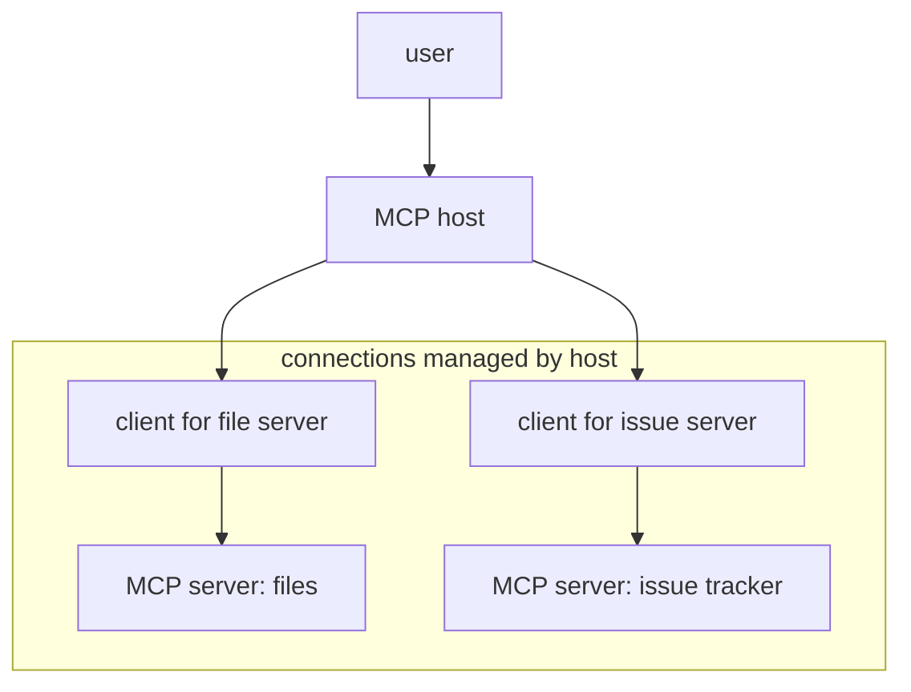

# P1-14.4 MCP(Model Context Protocol)与工具连接标准化

> Section ID: `P1-14.4`
> Version: `v2026.07.09`

在 P1-14.3 中，我们把 agent 看成一种把 `目标(goal)`、`状态(state)`、`动作(action)`、`观察(observation)` 持续推进的工作流结构。要让 agent 使用外部资料或工具，就必须有一种连接方式。

> agent：  
> 决定该做什么，并继续推进工作流。
>
> MCP：  
> 标准化 agent 或 AI 应用连接外部工具与数据的方式。

MCP(Model Context Protocol) 是一种开放协议(open protocol)，目标是标准化 AI 应用(application)连接外部系统(external system)的方式。最重要的点是：MCP 既不是模型(model)本身，也不是 agent 本身。

> MCP 是一种协议，用来统一 AI 应用连接外部数据、工具与可复用工作模板的方式。

## 本节范围

这里说明 MCP 的基本作用与结构。不讨论 MCP 服务器实现细节、SDK 用法、JSON-RPC 消息细节或 OAuth 流程。harness、执行日志、评估放到 P1-14.5；安全与隐私问题则会在 Part 1 Chapter 15 再回看。

`MCP`、`host`、`client`、`server`、`tools`、`resources`、`prompts` 分别属于不同层次的连接概念。

| 术语 | 极简含义 | 本节中的作用 |
| --- | --- | --- |
| MCP | AI 应用与外部系统之间的连接协议 | 本章的标准化视角 |
| host | 用户实际接触到的应用或运行环境 | 持有连接的一方 |
| client | 与某个 MCP 服务器通信的组件 | 管理单条连接的单元 |
| server | 提供工具、资源、提示模板的程序 | 外部能力的提供者 |
| tool | 可执行的函数或动作 | 行动单元 |
| resource | 可读的上下文数据 | 状态与依据的输入面 |
| prompt | 可复用的交互模板 | 复用指示格式的装置 |

这里先把 `MCP 是连接规则`、`server 提供能力`、`tool 用于执行`、`resource 用于阅读`、`prompt 是复用模板` 作为基准线。

## 本节目标

- 把 MCP 理解成连接协议(protocol)，而不是 agent。
- 区分 host、client、server 的角色。
- 不把 tools、resources、prompts 混成同一回事。
- 理解 MCP 可以让工具使用更方便，但不会自动解决权限(permission)、审批(approval)、校验(validation)。
- 为进入 P1-14.5 的 harness 与评估执行环境做准备。

## 三个基准

| 基准 | 为什么重要 | 本节所需的理解水平 |
| --- | --- | --- |
| MCP 是连接协议，而不是 agent | 这能防止把 MCP 误解成“另一个 AI 系统”。 | 只要理解成它是应用连接外部系统的规则即可。 |
| host、client、server 的角色不同 | 这能让标准化结构更容易被读懂。 | 只要区分谁发起、谁维持连接、谁提供能力即可。 |
| 有了标准化，权限与校验问题仍然单独存在 | 这能防止对协议本身产生过度信任。 | 只要理解成批准与安全仍需另外设计即可。 |

## 为什么需要连接标准

正如 P1-14.1 所说，AI 服务会把模型、应用、数据、工具、编排组合在一起。随着服务变复杂，需要连接的外部系统也会越来越多：

> 文件系统  
> 数据库  
> 搜索引擎  
> 日历工具  
> issue tracker  
> 设计工具  
> 自动化工具  
> 内部文档系统

如果每个 AI 应用都为每个工具单独写一套定制连接方式，组合复杂度会迅速上升。

MCP 可以被理解成一种尝试：把

> 每个工具都有一套不同连接方式  
> -> 变成通过同一种可发现、可调用的协议来连接

## host、client、server

MCP 遵循 client-server 结构，但在这个语境里，把 `host`、`client`、`server` 分开理解会更清楚。

| 组成部分 | 说明 |
| --- | --- |
| MCP host | 用户实际交互的 AI 应用或 agent 运行环境 |
| MCP client | 维持某一个 MCP server 连接的组件 |
| MCP server | 通过 MCP 暴露外部数据、工具、提示模板的程序 |

这条关系可以简化成：

一个 AI 应用可能同时连接多个 MCP server。server 也不一定必须是远程服务，它也可以是用户本地机器上的程序。

## MCP server 会提供什么

MCP server 最常提供的是 `tools`、`resources`、`prompts`。

| 元素 | 作用 | 例子 |
| --- | --- | --- |
| tools | 可执行的函数或动作 | 读文件、创建 issue、查数据库、计算 |
| resources | 可读取的上下文数据 | 文件内容、数据库记录、API 响应、文档片段 |
| prompts | 可复用的交互模板 | 特定工作流的任务指示与示例 |

这也会和 P1-14.2 讲过的区分连起来：

> resources：  
> 给模型提供可读上下文。
>
> tools：  
> 执行外部系统功能。
>
> prompts：  
> 让某种交互模式可以被稳定复用。

## 发现与调用

MCP 的一个核心直觉是 `discovery`。AI 应用可以向已连接的 MCP server 询问：它提供了哪些工具与资源。

> 1. AI 应用连接到 MCP server。  
> 2. 检查 server 暴露了哪些能力。  
> 3. 获取可用工具列表。  
> 4. 选择需要的工具并调用。  
> 5. 把结果反映回模型输入或应用状态。

这样一来，工具使用就从“模糊地用自然语言猜测”变成了一个更结构化的过程。

## MCP 整理了 agent 的连接表面

如果把 P1-14.3 的 agent 循环再拿回来：

> 查看目标  
> -> 检查状态  
> -> 选择下一步动作  
> -> 执行工具  
> -> 观察  
> -> 更新状态

MCP 主要整理的是其中两部分的连接面：

| agent 流阶段 | MCP 可以帮助的地方 |
| --- | --- |
| 检查状态 | 通过 resources 读取文件、文档、数据 |
| 选择下一步 | 了解有哪些 tools 以及它们做什么 |
| 执行工具 | 用标准化方式调用工具 |
| 观察结果 | 接收结构化结果，供下一步判断 |

但 MCP 并不保证计划能力、判断质量或任务最终成功。它只是连接规则，不是思考机制。

## MCP 没有解决什么

MCP 有助于标准化工具连接，但它并不会自动解决所有问题。

| 它不能自动解决的问题 | 原因 |
| --- | --- |
| 判断工具是否安全 | server 本身就可能暴露危险能力 |
| 决定用户权限 | 谁能访问什么仍是服务策略问题 |
| 执行审批 | 改变外部状态的动作仍可能需要人工确认 |
| 解释结果的真实性 | 工具结果仍需要被解读与审查 |
| agent 评估 | 成功标准仍属于 harness 与评估设计 |

因为 MCP server 会连接外部系统，所以信任边界(trust boundary)、隔离、审批、日志都仍然重要。

## 本节应记住的视角

MCP 不是模型，也不是 agent。它是一种协议，用来标准化 AI 应用如何发现并连接外部能力。

> host 持有连接。  
> client 管理某条 server 连接。  
> server 提供 tools、resources、prompts。  
> tools 用于执行动作。  
> resources 用于提供可读上下文。  
> prompts 用于复用交互模式。

## 检查清单

- 能把 MCP 解释成一种连接协议，而不是 agent 或模型。
- 能区分 host、client、server 的角色。
- 能区分 tools、resources、prompts。
- 能说明 MCP 会帮助标准化发现与调用，但不会消除权限、审批、校验与安全设计的需要。
- 能说明 MCP 在 agent 工作流中的位置。

## 什么时候要先想起这个视角

- 当 MCP 被说得像“另一个 AI 系统”时
- 当多个外部工具或数据源需要共用一套连接模式时
- 当即使做了标准化，也仍必须分清“读取上下文”与“执行动作”的时候

这时，先拆开 `协议`、`server 能力`、`可读 resource`、`可执行 tool`，会更容易避免误把 MCP 当成 agent 本身。

## 来源与参考资料

- Anthropic, [Introducing the Model Context Protocol](https://www.anthropic.com/news/model-context-protocol){: target="_blank" rel="noopener noreferrer" }, 确认日期: 2026-06-23.
- Model Context Protocol, [Introduction](https://modelcontextprotocol.io/introduction){: target="_blank" rel="noopener noreferrer" }, 确认日期: 2026-06-23.
- Model Context Protocol, [Architecture](https://modelcontextprotocol.io/docs/learn/architecture){: target="_blank" rel="noopener noreferrer" }, 确认日期: 2026-06-23.
- Model Context Protocol, [Security Best Practices](https://modelcontextprotocol.io/specification/2025-06-18/basic/security_best_practices){: target="_blank" rel="noopener noreferrer" }, 确认日期: 2026-06-23.
