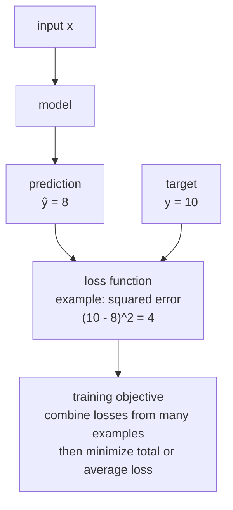

# P2-6.2 损失函数(loss function)与目标函数(objective function)

> Section ID: `P2-6.2`
> Version: `v2026.07.09`

在 P2-6.1 中，我们把最优化看成 `摆出候选、用标准比较、在约束之内寻找更好值的问题`。现在来看，在模型学习里，这个标准会以什么名字出现。

模型并不会从一开始就知道 `自己错了多少`。所以必须先由人决定一个标准，把“错”变成数字。这个标准就是 `损失函数(loss function)`。

这里会重新整理 `损失函数(loss function)`、`目标函数(objective function)`、`误差(error)`、`平均损失(mean loss)`、`评价指标(metric)`。如果说 6.1 讲的是“寻找更好值的问题”，那么现在这一节讲的是：学习实际上是依据什么标准来移动的。

这里并不是去背很多损失函数公式，而是把重点放在：看清学习是按什么标准在动。如果在这里先抓住损失函数、平均损失、目标函数之间的差别，那么后面即使出现梯度下降与反向传播，也不会丢掉 `它到底是在为了减少什么而动` 这个问题。

## 回到 6.1 的共同场景

把前一节的数据原样带过来。

| 学生 | 学习时间 `x` | 实际分数 `y` |
| --- | ---: | ---: |
| A | 1 | 55 |
| B | 2 | 65 |
| C | 3 | 80 |
| D | 4 | 90 |

如果把一条候选直线设成 `\(\hat{y} = 10x + 45\)`，那么预测值就会变成 `55, 65, 75, 85`。在这个场景里，损失函数的作用就是把 `这条直线到底有多不贴合` 变成一个数字。也就是说，6.1 中的 `候选比较`，在这里具体化成了 `损失计算`。

也就是说，模型先做预测，再拿它和真实值比较，把错了多少变成数字，然后朝着让这个数字变小的方向去学习。



## 本节范围

这里把 `损失函数(loss function)` 与 `目标函数(objective function)` 介绍成 AI 学习的标准。至于哪种损失适合什么时候选，回归与分类会在 Part 3 的算法章节重新讨论；按问题类型划分的损失，会在 P4-4.1 与 P4-4.2 再次处理。

下面这些内容不会在这里深入展开。

- 回归(regression)、分类(classification)、生成(generation)各类损失函数的完整清单
- 交叉熵(cross entropy)的概率解释
- 包含正则化(regularization)的目标函数详细设计
- 损失曲面(loss surface)的形状
- 梯度下降(gradient descent)的更新流程

回归和分类里常用损失的直觉，会在 P4-4.1 与 P4-4.2 再讲；正则化会延续到 P4-8.1；梯度下降的重复结构会延续到 P2-6.3 和 P4-7.1。生成模型的损失设计细节，以及损失曲面的详细形状，则放在本书当前正文范围之外。

这里首先要解决的问题是：`模型“错了”这件事，怎样被变成学习真正能推动的数字标准？`

所以，这一节先只固定下面四个问题。

- 损失函数到底把什么变成数字？
- 目标函数和损失函数有什么不同？
- 损失低，是不是就一定代表模型好？
- 评价指标(metric)和损失函数是同一个东西吗？

| 术语 | 很短的意思 | 在本节中的作用 |
| --- | --- | --- |
| 损失函数 | 把错误变成数字的函数 | 学习标准的起点 |
| 目标函数 | 学习实际上要减少或增加的整体标准 | 最优化对象 |
| 误差 | 实际值与预测值之间的差 | 损失的原料 |
| 平均损失 | 把多个样本损失合并后的值 | 看整个数据趋势的标准 |
| 评价指标 | 让人解释和比较的标准 | 必须和损失区分的运营视角 |

这一节之后的流向也很简单。

- 在 `P2-6.3` 中，会继续用梯度下降去看刚刚建立的损失标准是怎样被真正减小的。
- 到 Part 3 与 Part 4 时，我们会再次读到：在回归、分类、生成问题里，损失会怎样变换形状。
- 到 Part 5 的运营语境里，还会再次出现：为什么损失和真实服务指标可能不一样。

## 本节目标

- 能把 `损失函数(loss function)` 解释成把预测错误变成数字的函数。
- 能把 `目标函数(objective function)` 解释成训练想要减少或增加的整体标准。
- 能区分单个样本的损失与多个样本的平均损失。
- 能用小数字计算平均平方误差(mean squared error, MSE)的直觉。
- 能说明损失函数和评价指标并不总是同一个东西。

## 三个判断标准

| 标准 | 为什么重要 | 这里需要的理解层次 |
| --- | --- | --- |
| 损失是把模型错得多严重变成数字的值 | 它说明学习不是靠感觉判断在动，而是在可计算标准上动。 | 理解“把错误变成数字”这个角色。 |
| 要把多个样本的损失合起来看整体趋势 | 因为我们不能只看一次偶然预测，而要看整批数据的表现。 | 只要能说明为什么需要平均损失就足够。 |
| 损失函数和评价指标可能相同也可能不同 | 如果把学习标准和真实运营判断标准混在一起，解释就会偏掉。 | 抓住训练用数字和汇报用数字需要分开的感觉。 |

## 损失把“错”变成数字

对人来说，说模型的预测错了很自然。但对计算机来说，这句话本身不能直接拿来用。只要计算机要调整数值，错误就必须被表达成数字。

例如，假设实际值是 10，而模型预测是 8。

```text
actual value: 10
prediction: 8
error: 10 - 8 = 2
```

这个 `误差(error)` 是 2。但在学习里，我们不会把原始误差直接拿来用。我们会按问题需要对它做变换，例如平方、取绝对值、或对概率套用对数。这个时候使用的函数，就是 `损失函数(loss function)`。

最容易理解的例子，是 `平方误差(squared error)`。

\[
\mathrm{loss} = (y - \hat{y})^2
\]

这里 \(y\) 是实际值，\(\hat{y}\) 是模型的预测值。

```text
actual y = 10
prediction y_hat = 8
loss = (10 - 8)^2 = 4
```

这个数字 4，就是把 `错了多少` 变成可计算数值后的结果。现在模型就可以沿着让这个数变小的方向去调整自己的值。

如果换成共同场景来读，就是对每个学生都先算 `实际分数 - 预测分数`，再把这个误差变成平方误差之类的损失。损失函数最终就是一个装置，把 `候选直线有多不贴合数据` 变成可比较的数字。

## 为什么不直接使用误差

你可能会想，`如果预测错了 2，那直接用误差 2 不就行了吗？` 但 `误差(error)` 是带方向的。比如实际值 10，预测值 8 会得到误差 2；而预测值 12 会得到误差 -2。

这两次预测都离真实值差了 2，但符号不同。如果把多个样本的误差直接加总，它们可能会互相抵消。

```text
2 + (-2) = 0
```

明明有两个预测都错了，但总和却变成 0。这不表示模型预测得好。所以损失函数会把误差变成适合拿来学习的数字。

| 方式 | 计算 | 直觉 |
| --- | --- | --- |
| 绝对误差(absolute error) | \(|y - \hat{y}|\) | 看它离得有多远 |
| 平方误差(squared error) | \((y - \hat{y})^2\) | 对大误差惩罚更重 |
| 对数损失(log loss) | 对概率预测应用对数 | 对“很自信但预测错”的情况强力惩罚 |

这里我们只计算平方误差。为什么回归和分类的损失函数会不同，会在 P4-4.1 与 P4-4.2 再讨论；而如何初步读懂对数损失(log loss)，会在 P3-6.4 的补充学习里再接回来。

## 把多个样本的损失合成一个数

训练数据通常不只包含一个样本。我们会对很多样本做预测，再分别计算每个样本的损失。

例如，假设有三个样本。

| 样本 | 实际值 \(y\) | 预测值 \(\hat{y}\) | 平方误差 |
| --- | ---: | ---: | ---: |
| 1 | 10 | 8 | 4 |
| 2 | 5 | 6 | 1 |
| 3 | 7 | 4 | 9 |

每个样本的损失都不同。在学习里，我们必须把这些损失合成一个统一标准。最简单的方法就是取平均。

\[
\mathrm{MSE} = \frac{4 + 1 + 9}{3} = \frac{14}{3} \approx 4.67
\]

这个 `平均平方误差(mean squared error, MSE)`，就是把多个预测的错误程度压缩成一个数字。

在前面的直线例子里，如果把学生 A 到 D 的损失取平均，也能为这条直线 `\(\hat{y} = 10x + 45\)` 生成一个总分。这样就可以直接和别的候选直线比较平均损失，而这种可比性正是把最优化和学习连接起来的地方。

如果写得更一般一些，就是下面这样。

\[
\mathrm{MSE}(y, \hat{y}) =
\frac{1}{n}
\sum_{i=1}^{n}
(y_i - \hat{y}_i)^2
\]

这里的 sigma 就像我们在 P2-2.2 中看到的那样，表示把同一类计算在多个样本上重复并加起来。损失函数一旦和 sigma 结合，就会变成一个表示 `整个数据集上错了多少` 的数字。

## 目标函数是学习真正按它行动的标准

`损失函数(loss function)` 和 `目标函数(objective function)` 常常一起出现。这里可以这样区分：损失函数是计算“预测错了多少”的函数，而目标函数则是训练实际上想要减少或增加的整体标准。

很多时候，目标函数就是平均损失。

```text
objective = average loss
```

但它并不总是这么简单。例如，我们也可能额外加上一个惩罚项，防止模型变得过于复杂。

```text
objective = average loss + regularization penalty
```

你现在不需要详细理解这个式子。重要的是：目标函数是 `学习过程真正要优化的标准`。而损失函数往往是这个标准最核心的原料。

对于读者来说，重要的是把 `某一个学生上错了多少` 和 `这条候选直线在四个学生整体上有多不贴合` 分开来读。前者是单个损失，后者则会继续连到平均损失或目标函数。

## 损失低是好信号，但还不是充分结论

损失下降通常是好信号。这说明模型在训练数据这个标准下，预测变得更贴合了。

但不能只因为损失低，就断定模型在现实里也一定好。损失可能只是在训练数据上低；在新数据上可能并不贴合；服务目标和损失函数可能不一致；而像安全性、公平性、成本这样的约束，也未必能被一个损失完整表达。

P2-5.3 中讲过的样本(sample)与误差(error)视角，会在这里再次出现。训练数据上的损失，是在我们手里这份数据上算出来的值。它并不能完整保证整个现实世界里的表现。

所以在学习中，通常会把训练数据(training data)、验证数据(validation data)、测试数据(test data)分开来看。这个数据划分会在后面的机器学习部分更详细地处理。

## 损失函数和评价指标可能相同，也可能不同

`损失函数(loss function)` 是在学习过程中用来调整模型数值的。`评价指标(metric)` 则是让人去解释和比较模型结果的。

两者有时会相同。例如，训练也用 MSE，评估也用 MSE。

但它们也可能不同。例如，训练时减少的是 `对数损失(log loss)`，而报告里看的是 `准确率(accuracy)`、`精确率(precision)`、`召回率(recall)`；到了真实服务里，可能还要同时看成本、延迟、风险。

这种差别在实务中非常重要。如果模型在训练时减少的数字，和人真正关心的数字不是同一个东西，那么模型可能会朝着奇怪的方向“变好”。

即使在学习时间-分数这个例子里，也有同样的区分。学习过程也许会找到平均损失更低的直线，但人还会另外问一些解释问题，比如 `它是不是特别容易错高分学生？`、`它是不是整体上把分数压低了？` 损失是学习的指南针，而评价是人来阅读结果的位置。

## 用案例来看

### 案例 1. 在配送时间预测里，损失到底在做什么

假设一个快递服务要预测每一笔订单的送达时间。人可以解释 `首尔市中心`、`下班高峰`、`雨天`、`物流中心拥堵` 这些条件和延迟有关，但很难每次都手动规定每个条件会影响几分钟。

所以模型会先对每一笔订单预测送达时间，再把它和真实送达时间比较。例如，真实送达是 60 分钟，而预测是 50 分钟，那么差了 10 分钟。损失函数就是把这个差距变成一个可以用于学习的数字。

这里重要的是，`模型到底错了多少` 不是只在单个订单上看，而是要把很多订单一起看。某一笔订单可能会偶然偏差很大，但如果整体损失在下降，那就是一个信号，说明模型正在整个数据范围内朝更好的方向调整。

另外，服务运营团队真正关心的标准未必会停在一个平均误差上。VIP 客户延迟、深夜配送失败、特定地区偏差等额外指标，可能更重要。这个案例说明了：为什么损失函数和评价指标有时相同、有时不同。

## 本节要记住的视角

损失函数，是把模型错误变成数字的装置。目标函数，则是把这个数字包含在内，作为学习真正要减少或增加的标准。按顺序写出来，就是：模型先预测，再和真实值比较，计算损失，把多个损失合并，然后沿着让目标函数变小的方向去学习。

下一节会看：为了让这个目标函数下降，模型的数值到底是怎样被一点点改动的。那时就会出现 `梯度下降(gradient descent)`。

## 简短检查

- 能把 `损失函数(loss function)` 解释成把预测错误变成数字的函数。
- 能利用实际值 \(y\) 与预测值 \(\hat{y}\) 的差，计算平方误差。
- 能说明平均平方误差(mean squared error, MSE)是把多个样本损失取平均后的值。
- 能把 `目标函数(objective function)` 解释成训练真正要优化的标准。
- 能说明损失函数与 `评价指标(metric)` 并不总是同一个东西。
- 能说明损失低是好信号，但不会自动保证现实表现。

## 什么时候要先想起这个视角

- 当你还觉得“模型到底怎么把错转成数字”很模糊时，先想起这个视角。
- 当单个误差、多个样本的平均损失、整个学习过程的目标函数混成一团时，先想起这个视角。
- 当你需要区分“损失低”这件事和“这个模型在真实运营里好不好”这件判断时，先想起这个视角。

## 来源与参考资料

- Ian Goodfellow, Yoshua Bengio, Aaron Courville, [Deep Learning, Chapter 5: Machine Learning Basics](https://www.deeplearningbook.org/contents/ml.html){: target="_blank" rel="noopener noreferrer" }, MIT Press, 2016, 确认日期: 2026-06-24.
- scikit-learn developers, [3.4. Metrics and scoring: quantifying the quality of predictions](https://scikit-learn.org/stable/modules/model_evaluation.html){: target="_blank" rel="noopener noreferrer" }, scikit-learn User Guide, 确认日期: 2026-06-24.
