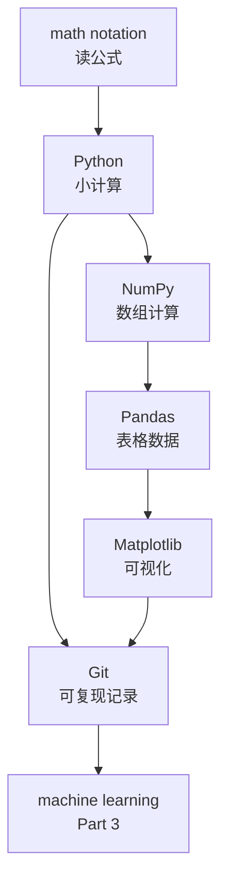
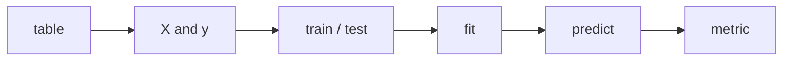

# P2-15.2 进入 Part 3 之前的检查

> Section ID: `P2-15.2`
> Version: `v2026.07.09`

Part 2 是基础恢复区间。它不意味着所有数学与 Python 都已经被完美学完，而是用来确认：你是否已经具备进入机器学习之前所需的最小阅读能力与实践感觉。

这一节与其说是彻底关闭 Part 2 的结尾，不如说是一个“再次返回时的基准点”：当你在 Part 3 卡住时，应该回到哪些概念，把标准重新恢复出来。这里不会继续学习很多新内容，而是区分 `现在应该带着走的东西` 和 `之后可以回来再查的东西`。当你重新寻找概念时，请把代表 Section 和[概念词汇表](../../../reference/concept-glossary.md)一起当作基准点。

如果把这个标准压缩成最短的形式，就是下面这样。

| 现在要带着走的东西 | 如果在 Part 3 卡住，要回来看的东西 |
| --- | --- |
| `X`、`y`、shape、loss、metric 这类最小公共语言 | 数组形状、平均与误差、执行环境、图表阅读、为什么要留下 Git 记录 |

如果再把它缩成更实战的形式，你现在至少应该还能重新说出下面四点。

| 现在要立即检查的最小线 | 为什么这个标准现在重要 |
| --- | --- |
| 能写出哪一列是 feature，哪一列是 label | 因为到了 Part 3，必须先读懂数据结构 |
| 能看着 `shape` 说出行和列各代表什么 | 因为必须区分样本轴和特征轴 |
| 能说出平均、误差和损失不是同一个东西 | 因为不能把训练数字和评价数字的角色混在一起 |
| 能像 Git 提交的一行说明那样写出变更理由 | 因为需要把实验与说明一起记录的感觉 |

Part 3 会讨论“从数据中学习规则”。那时真正需要的，不是困难证明，而是能跟上：数据以什么形状进入、模型在计算什么、结果又如何被评价。

最常卡住的场景，可以重新写成下面这样非常小的形式。

| Part 3 前立刻要再看的场景 | 应该能立刻说出的内容 |
| --- | --- |
| 在一个小表里，哪一列是输入，哪一列是答案？ | `X` 和 `y` 的区分 |
| 看到 `X.shape = (4, 3)` | 4 个样本，3 个特征 |
| 看到 `fit(X_train, y_train)` | 用输入和答案进行学习 |
| 看到 `predict(X_test)` | 用训练好的模型计算新输入 |

所以，在进入 Part 3 之前，最小准备并不更接近于“知道模型名字”，而是更接近于能立即说出 `描述数据结构与学习流程的句子`。

## 本节范围

本节是 Part 2 的最终检查。它不会深入引入新的核心概念。scikit-learn 的具体用法、模型训练 API、评价指标的详细计算会在 Part 3 处理。

本节回答以下问题。

- 进入 Part 3 之前，应该知道什么？
- 即使有些部分还不够强，也能继续往下走的标准是什么？
- 在数学、Python、数据工具、Git 之中，哪些部分要重新检查？
- 读机器学习文档时，会再次出现哪些词？
- 在 Part 3 一开始最需要小心的误解是什么？

## 本节目标

- 能把在 Part 2 恢复出的概念连接到机器学习的学习流程上。
- 能区分数学、Python、NumPy、Pandas、Matplotlib、Git 的最小角色。
- 能在 Part 3 里不把 `X`、`y`、`fit`、`predict`、`train`、`test` 看成完全陌生的表达。
- 能区分哪些项目自己还没完全理解，哪些项目必须回去重新确认。
- 能把机器学习的开始理解为“阅读数据、学习、评价流程”，而不是“背模型名字”。

## 三个判断标准

| 标准 | 为什么重要 | 本节需要达到的理解程度 |
| --- | --- | --- |
| 应该从 Part 2 得到什么？ | 它帮助你把 Part 2 看成进入机器学习前的准备，而不是一门课彻底学完。 | 理解自己需要得到数学、Python、数据与实践环境的最小公共语言。 |
| 现在就要全部背得完美吗？ | 它明确了“回看标准”和“首次解释位置”的作用。 | 理解你首先需要的是回看的基准点，以及对术语不再陌生的感觉。 |
| 什么才算准备好进入 Part 3？ | 它让你先看数据与学习流程，而不是先看模型名字。 | 理解只要不害怕去读数据、损失、学习、评价这些词，就已经够了。 |

## 从 Part 2 必须带走的最小地图

Part 2 的流程可以整理成下面这样。

这张地图里重要的不是工具名称，而是每个工具在回答什么问题。

| 领域 | Part 3 需要提出的问题 |
| --- | --- |
| 公式 | 这个计算在尝试相加、平均或减小什么？ |
| Python | 能不能亲自运行一个小例子？ |
| NumPy | 能不能读懂输入和输出的数组形状？ |
| Pandas | 能不能把数据集读成行和列？ |
| Matplotlib | 能不能用眼睛确认学习结果和数据分布？ |
| Git | 能不能再次追踪正文、代码和结果？ |

这里同样重要的是：不要把 Git 单独切出去看。到了 Part 3，比起比较模型名字，你更需要重新说明 `用了什么输入`、`改了什么`、`哪个结果发生了变化`。

| 在 Part 3 会再次遇到的实验场景 | 你应从 Part 2 带走的记录感觉 |
| --- | --- |
| 改了 train/test 划分后再重新跑一遍 | 像写一行提交说明或实验笔记那样留下“改了什么” |
| 多加一个 feature 或去掉一个 feature | 一起写下输入列如何改变，以及结果如何改变 |
| 图表形状或指标解释发生变化 | 记录下自己判断时看了什么表和什么图，而不只是最后数字 |

这张表的目的，不是让你再背更多 Git 命令。本节要明确抓住的是：`做过一次计算` 和 `能再次解释改了什么、为什么结果变了` 并不是一回事。因此，Part 2 里的 Git 不是开发者附录，而是让 Part 3 实验比较能够重新被读懂的记录抓手。

## 必须重新确认的概念

下面这些项目在 Part 3 里会非常频繁地再次出现。你不需要掌握完美证明，但当你看到这些词时，至少要知道该回到哪里。

| 概念 | 代表 Section | 在 Part 3 里再次出现的位置 |
| --- | --- | --- |
| 变量（variable）、函数（function） | `P2-2.2` | 解释模型如何把输入变成输出 |
| 向量（vector）、矩阵（matrix） | `P2-3.1` | 输入数据 `X`、权重、特征组合 |
| 平均（mean）、方差（variance） | `P2-5.2` | 数据总结、尺度、分布理解 |
| 损失函数（loss function） | `P2-6.1` | 解释模型在试图减小什么 |
| 梯度下降（gradient descent） | `P2-6.3` | 学习如何调整数值 |
| 样本（sample）、特征（feature）、标签（label） | `P2-12.3` | 监督学习的数据结构 |
| 轴（axis）、shape | `P2-11.2` | NumPy 和 Pandas 数据形状 |
| 图表（plot） | `P2-13.1` | 检查学习曲线与评价结果 |

即使这些里有一项还模糊，你也可以进入 Part 3。但当该词出现时，你应该先短暂回到上面的代表 Section 或概念词汇表，重新确认一下。

这里重要的不是把 Part 2 全部从头再读一遍，而是在某个词和问题卡住时，快速回到对应的小节，再马上回到 Part 3 的主流程。

## 在 Part 3 里立刻会遇到的表达

scikit-learn 文档把模型叫作 estimator，一般会展示用 `fit` 学习数据、再用 `predict` 预测新数据结果的流程。它也通常把输入数据 `X` 描述为：样本在行（row），特征在列（column）。

这里先记住下面这张表。

| 表达 | 第一层读法 |
| --- | --- |
| `X` | 放进模型里的输入数据组合 |
| `y` | 监督学习里要去匹配的答案或标签 |
| sample | 一条数据，通常是一行 |
| feature | 模型参考的输入属性，通常是一列 |
| `fit` | 用数据训练模型的动作 |
| `predict` | 用训练好的模型为新输入计算输出的动作 |
| train data | 模型学习时会看到的数据 |
| test data | 学习之后用来检查性能的数据 |

这里最重要的是，不要把 `fit` 和 `predict` 看成魔法。它们只是 Part 1 里已经见过的学习（learning）和模型执行（inference），现在以 API 形式出现。

如果再压缩一次，你应该能立刻读出下面这个顺序。

如果在这条流程里的某一点卡住了，可以按下面这样回去。

| 卡住的表达 | 先回到哪里 |
| --- | --- |
| `shape`、行（row）、列（column） | `P2-11.2` |
| feature、target、`X`、`y` | `P2-12.3` |
| loss、error、mean | `P2-5`、`P2-6`、`P2-15.1` |
| 执行环境、notebook、terminal | `P2-3.5`、Chapter 7、Chapter 10 |

## 什么可以继续往下走，什么应该先停一下

在进入 Part 3 之前，并不需要把所有内容都背得完美。可以这样区分。

| 状态 | 判断 |
| --- | --- |
| 不能证明每一个公式 | 可以继续往下走 |
| 没有背完所有 Python 语法 | 可以继续往下走 |
| 不是每个 NumPy 函数都熟悉 | 可以继续往下走 |
| 完全分不清 `X` 和 `y` 是什么 | 先停一下，回看 Part 2 Chapter 11 和 Chapter 12 |
| 完全分不清平均、损失和误差 | 回看 Part 2 Chapter 5、Chapter 6 和 `P2-15.1` |
| 不知道代码该在哪里运行 | 回看 `P2-3.5`、Part 2 Chapter 7 和 Chapter 10 |
| 看结果图时不知道坐标轴是什么意思 | 回看 Part 2 Chapter 13 |

不需要完美。但如果你完全分不清输入、输出、数据形状和评价结果，那么 Part 3 很容易滑成“背模型名字”。

## 读 Part 3 的标准

在 Part 3 里，比起先看算法名字，先看下面这些问题。

1. 这个问题在试图预测或分类什么？
2. 输入 `X` 的形状是什么？
3. 有没有标签 `y`？
4. 训练数据和评价数据是否被分开？
5. 模型在试图减小什么样的损失或标准？
6. 评价指标（metric）在看什么？
7. 能不能用图表或表格检查结果？

如果你始终保留这些问题，就不会把 Part 3 的各种算法只看成一串不同的名字。

## 用案例来看

### 案例 1. 知道模型名字，但看不见数据流程的状态

假设一位学习者听过“线性回归”“逻辑回归”“决策树”这些名字，但真正去读文档时，首先被 `X`、`y`、`fit`、`predict`、`train`、`test` 卡住了。人可能知道算法名称，但如果分不清数据以什么形状进入、哪一列是答案列，说明就无法继续。

这时，Part 2 的作用并不是提前把模型学完，而是恢复读取这些文档所需的最小公共语言。只要能把 `X` 连接为输入列的组合、`y` 连接为要匹配的答案、`fit` 连接为学习、`predict` 连接为运行训练后的模型，Part 3 的第一幕就会少很多陌生感。

这个案例也会减少“必须全部背完才能继续”的误解。只要你能再次回看平均、损失、数组 shape、DataFrame 的行和列、图表坐标轴这些基础元素，就可以进入 Part 3；卡住时再回到 Part 2 的相关小节就行。

因此，Part 2 的检查更像是在看地图，而不是考试。比起知道很多模型名字，更重要的是确认：你是否已经准备好读数据、跟随学习流程。

### 案例 2. 会读 `shape`，但还连不到 `X`、`y` 上

假设一位学习者看到 `shape = (100, 5)` 时，能说出“100 行 5 列”。但当 Part 3 文档里出现 `X_train.shape`、`y_train`、`feature`、`sample` 时，却还不能立刻把这些数字连到学习场景里的含义上。

这时，NumPy 的小节和 Pandas 的小节就不能只是分开记住，而要重新绑回同一个场景。只要重新抓住：`X` 通常是“行是样本、列是特征”的输入矩阵，而 `y` 是拥有相同样本数的答案向量，Part 3 的第一个代码例子就会少很多陌生感。

所以，进入 Part 3 的准备，并不是停留在“我会读 shape”，而是要进一步连到“这个 shape 怎样对应到 X 和 y 的角色”。

## 本节记住的视角

- Part 2 的目标不是完整掌握数学和编程，而是恢复阅读机器学习所需的最小基础。
- 在 Part 3，应该先看数据形状、学习流程和评价标准，而不是先看模型名字。
- `X`、`y`、`fit`、`predict` 会直接连接到 Part 2 里学过的数组、表格和函数执行流程。
- 如果某个概念仍然模糊，可以回到 Part 2 再检查一次。
- 机器学习应该被读成一个“公式、代码、数据、评价一起联动”的学习流程。

## 检查清单

- 在一个小表里，你能写出哪一列是 feature，哪一列是 label 吗？
- 如果看到 `X.shape = (4, 3)`，你能说出它表示 4 个样本和 3 个特征吗？
- 如果看到 `y.shape = (4,)`，你能解释它是按样本排列的一组答案吗？
- 你能把 `fit(X_train, y_train)` 和 `predict(X_test)` 区分为“学习”和“对新输入进行计算”吗？
- 你能说出损失、误差和评价指标扮演的是不同角色吗？
- 当某个表达卡住时，你能判断应该回到 `P2-11.2`、`P2-12.3`、`P2-5/6` 还是 `P2-3.5` 吗？

## 简短检查

- 你能解释 `X` 和 `y` 的区别吗？
- 你能从行和列的角度解释 sample 和 feature 吗？
- 你能把 `fit` 和 `predict` 区分为“学习”和“模型执行”吗？
- 你能说明损失、误差和评价指标并不是同一个东西吗？
- 你能说出：在读 Part 3 时，你会先看数据与评价流程，而不是先看模型名字吗？

## 什么时候应先想起这个视角

- 当你需要检查：进入 Part 3 之前，自己至少应该还能重新说出什么时，先想起本节。
- 当你需要重新立起“先读数据、输入与输出、学习和评价流程，而不是先看模型名字”的标准时，回到本节。
- 当你想确认自己能否不混淆 `X`、`y`、sample、feature、fit、predict、loss 和评价指标时，再检查本节。

## 来源与参考资料

- scikit-learn developers, `Getting Started`, scikit-learn documentation, 确认日期：2026-06-25. [https://scikit-learn.org/stable/getting_started.html](https://scikit-learn.org/stable/getting_started.html){: target="_blank" rel="noopener noreferrer" }
- scikit-learn developers, `Glossary of Common Terms and API Elements`, scikit-learn documentation, 确认日期：2026-06-25. [https://scikit-learn.org/stable/glossary.html](https://scikit-learn.org/stable/glossary.html){: target="_blank" rel="noopener noreferrer" }
- NumPy Developers, `NumPy: the absolute basics for beginners`, NumPy documentation, 确认日期：2026-06-25. [https://numpy.org/doc/stable/user/absolute_beginners.html](https://numpy.org/doc/stable/user/absolute_beginners.html){: target="_blank" rel="noopener noreferrer" }
