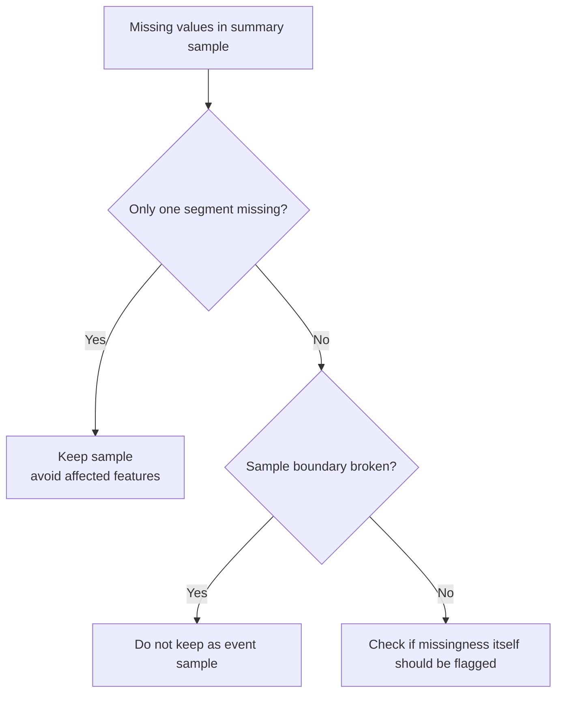

# P3-5.5 数值缺失或区间为空的样本应该怎样处理

> Section ID: `P3-5.5`
> Version: `v2026.07.10`

当我们已经来到“把原始日志变成汇总表”的阶段后，像 `动作是有的，但部分传感器值为空怎么办？`、`中间区间记录缺了，这条样本该丢掉，还是部分使用？` 这样的问题就会立刻出现。这时首先要看的，不是怎么填值，而是这些缺失会在多大程度上动摇样本边界和特征含义。

“值缺了”这件事，不只是一个清洗问题，它更像是一个数据建模信号，要求我们重新问一次：`这条样本还能不能被看成同一种案例？`

## 缺失如何动摇样本结构

如果只看到空值，就立刻觉得 `把 NaN 补上就行`，就很容易漏掉：样本边界是不是已经塌掉了，以及哪些特征的含义是不是已经丢失了。实际上，更早就必须问清下面这些问题。

| 现在看到的现象 | 在 Part 3 里更应该先问的问题 |
| --- | --- |
| 整个后段传感器区间都空了 | 这条样本还能作为一次动作级比较单位来使用吗？ |
| 只有少数时点缺失 | 做出汇总值后，还能保持同样的结构比较吗？ |
| 只有某一个传感器经常缺失 | 缺失本身是不是一种运行信号？ |

所以，带有缺失值的样本，不只是 `一张等着填值的表`，而是 `需要重新检查样本边界和特征含义的案例`。对于第一次看这张表的读者来说，先区分 `部分缺失`、`区间缺失`、`样本边界坍塌`，理解通常会更快。

## 先要区分的三种情况

有空值时，与其先谈复杂方法，不如先区分下面三种情况。

| 先区分什么 | 换成问题就是 |
| --- | --- |
| 只是部分值缺失吗 | 是某个区间平均值的一部分缺了，还是某个传感器的一部分缺了？ |
| 是不是整段区间都缺了 | 前段/中段/后段里，有没有一整个块消失了？ |
| 样本本身的意义是不是已经坏掉了 | 整次动作还容易被当作同一种案例吗？ |

之所以需要这种区分，是因为 `什么算缺失` 的定义不同，后面的判断就会完全不同。`只是缺了一部分值` 和 `动作的结尾已经没了`，表面上都像空白，但真正要做的决定并不一样。

## 看起来都像缺失，其实可能是不同问题

例如，下面三种情况都看起来像是 `没有值`，但实际含义并不相同。

| 看见的问题 | 更接近的解释 |
| --- | --- |
| 缺了 1 到 2 个时点 | 局部测量缺失 |
| 后 20% 区间整段都缺了 | 会动摇结构比较的区间缺失 |
| 没有 `event_end`，连结束时点都不知道 | 样本边界坍塌 |

第一种情况，可能仍然是在同一条样本结构里丢掉了部分信息。第二种情况则会直接动摇“后段下降率”这类特征的含义。第三种情况则更严重，因为整次动作的开始和结束都没有闭合，样本本身可能都要重新判断。

## 所以，在这个阶段最先要决定什么

比起复杂的缺失值补全技术，更重要的是先把下面四个判断写下来。

| 先要写下来的判断 | 为什么需要 |
| --- | --- |
| 这条样本是否保留 | 为了判断它还能不能作为同一种可比较案例 |
| 哪些特征不应该生成 | 为了阻止那些因为区间缺失而失去意义的特征 |
| 缺失本身要不要保留成标记列 | 因为缺失本身可能就是运行信号 |
| 是否需要重新查看原始日志 | 因为这可能不是单纯空值，而是样本边界问题 |

所以，这里真正关心的，与其说是 `怎么补`，不如说更接近 `这条样本现在应该被归到什么状态`。常见的判断顺序通常是 `是否保留样本 -> 哪些特征不能做 -> 缺失本身要不要作为标记列保留`。

## 用一个小图来看



这张图说明：我们并不把 `为空` 看成单一状态。判断会随着缺失发生的位置和样本边界状态而分叉。也就是说，这一节的例子重点，与其说是在展示数值本身，不如说是在先展示一个判断结构：它会分成 `保留`、`排除特征`、`结构坍塌` 三条路。

## 为什么缺失本身也可以保留成一列

人们常常只会想到 `空白应该去掉`。但在实际场景里，缺失本身也可能带有含义。

| 缺失状态 | 为什么可以保留成标记列 |
| --- | --- |
| 某个传感器只在特定条件下经常缺失 | 它可能是运行模式或通信状态的信号 |
| 临近结束前的区间经常缺失 | 它可能和事件结束识别失败有关 |
| 只在某一段时期缺失 | 它可能和系统变更或维护状态有关 |

所以，在 Part 3 里，也有必要判断像 `missing_sensor_flag`、`late_segment_missing` 这样的标记列是否值得留下来。这并不是说它们已经被固定成模型输入，而是说：在立刻删掉缺失之前，先判断缺失本身是否应该作为结构信息留下来。

只要先做了这个判断，就不会把 `可以补的值` 和 `已经破坏样本结构的缺失` 混在一起。关键不在于某种处理技术的名字，而在于更早地分清：这条样本是否仍然是同一种比较单位，以及缺失本身是否应作为结构信息留下。

## 小型代码示例

问题情境：确认带有缺失值的样本并不都处于同一种状态；有些只是需要避开特定特征，有些则是样本结构本身已经坏掉了。

输入(input)：一个动作汇总表，其中部分区间平均值为空，并且带有 `end_detected` 状态

期望输出(output)：把 `late_segment_missing`、`sample_structure_broken`、`keep_sample`、`avoid_features` 一起整理出来的输出

要确认的概念：在补缺失之前，应先把情况分类成 `保留样本`、`排除特征`、`结构坍塌`

```python
import pandas as pd

summary = pd.DataFrame(
    [
        {"event_id": "A", "early_flow_mean": 1.1, "mid_flow_mean": 2.4, "late_flow_mean": 1.8, "end_detected": 1},
        {"event_id": "B", "early_flow_mean": 1.0, "mid_flow_mean": 2.5, "late_flow_mean": None, "end_detected": 1},
        {"event_id": "C", "early_flow_mean": 1.2, "mid_flow_mean": None, "late_flow_mean": None, "end_detected": 0},
    ]
)

summary["late_segment_missing"] = summary["late_flow_mean"].isna().astype(int)
summary["sample_structure_broken"] = ((summary["end_detected"] == 0)).astype(int)
summary["keep_sample"] = summary["sample_structure_broken"].map({0: "yes", 1: "no"})
summary["avoid_features"] = summary.apply(
    lambda row: "late_drop features"
    if row["late_segment_missing"] == 1 and row["sample_structure_broken"] == 0
    else ("all event-level features" if row["sample_structure_broken"] == 1 else "none"),
    axis=1,
)

print("1) missingness flags")
print(summary[["event_id", "late_segment_missing", "sample_structure_broken"]])
print()
print("2) sample decision")
print(summary[["event_id", "keep_sample", "avoid_features"]])
```

期望输出：

```text
1) missingness flags
  event_id  late_segment_missing  sample_structure_broken
0        A                     0                        0
1        B                     1                        0
2        C                     1                        1

2) sample decision
  event_id keep_sample           avoid_features
0        A         yes                     none
1        B         yes       late_drop features
2        C          no  all event-level features
```

这个例子的核心，不是如何填值，而是 `局部区间缺失` 和 `样本结构坍塌` 不能被当成同一种空白来处理。第 1 步里，我们先区分缺失发生在什么位置；第 2 步里，这种区分又会直接通向 `样本是否保留` 和 `哪些特征不应继续生成` 的判断。因此，代码结果会直接展示出：`B` 可以保留为样本，但应保守地排除后段下降特征；而 `C` 因为样本边界本身已不稳定，很难立刻作为“动作级比较样本”继续使用。

这里最后要确认的是三件事：这条样本是否仍然是同一种比较单位；因缺失而不该生成的特征是否已经区分出来；缺失本身要不要作为标记列保留。只有这三点一起成立，空白才不只是 `待清洗对象`，而会变成一个夹带着样本结构判断的数据建模项。

值缺失这件事，不只是预处理问题。它更像一个数据建模信号，要求我们重新问：这条样本是否仍然是同一种比较单位，以及缺失本身是否应被保留成结构信息。所以，说“处理缺失”，与其说是补空白，不如说更接近重新划定边界：哪些样本还应继续比较，哪些样本应从比较中撤回。

## 来源与参考资料

- Google for Developers, `Machine Learning Glossary` 中的 `labeled example`。因为 example 预设的是特征和标签附着在同一个单位上，所以它支持这一点：当缺失已经动摇样本边界时，应该先判断这条样本是否仍然是同一种比较单位，而不是先急着补值。 [https://developers.google.com/machine-learning/glossary](https://developers.google.com/machine-learning/glossary){: target="_blank" rel="noopener noreferrer" } / 确认日期: 2026-07-08
- Google for Developers, `Machine Learning Glossary` 中的 `feature engineering`。它把 feature engineering 解释为把原始数据变成更适合学习和比较的形式，因此强化了这一节的判断：那些因为区间缺失而失去意义的特征，不应该继续生成。 [https://developers.google.com/machine-learning/glossary](https://developers.google.com/machine-learning/glossary){: target="_blank" rel="noopener noreferrer" } / 确认日期: 2026-07-08
- W3C, `PROV-Overview`. provenance framework 说明派生关系和活动上下文应当可解释，因此它提供了一个更高层的框架：缺失发生的位置，以及样本结构是否已经坍塌，都应作为独立信息保留下来，后面才能再次判断质量和可复现性。 [https://www.w3.org/TR/prov-overview/](https://www.w3.org/TR/prov-overview/){: target="_blank" rel="noopener noreferrer" } / 确认日期: 2026-07-08
