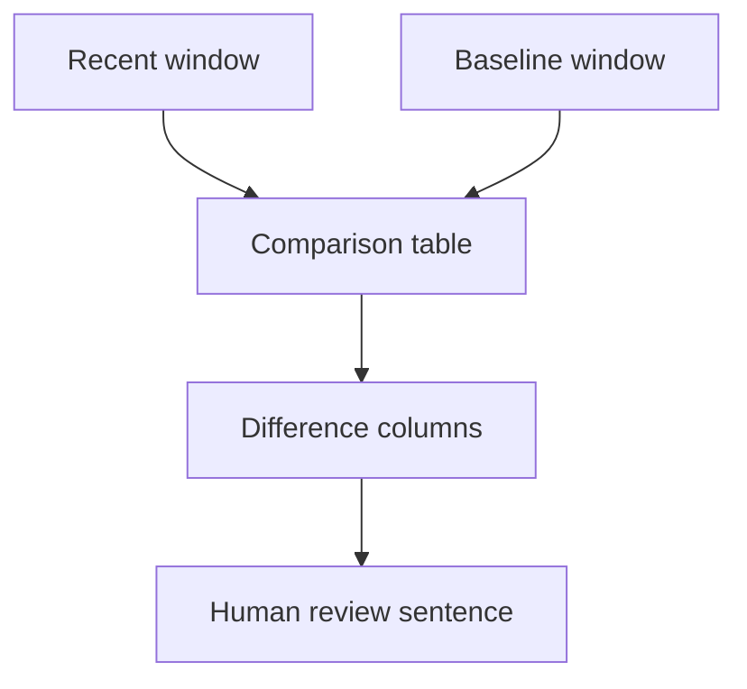

# P3-7.1 应该把留下来的结构拿去和什么比较，变化才会显现

> Section ID: `P3-7.1`
> Version: `v2026.07.10`

一听到“基准线”这个词，人们往往会先想到模型评估或性能比较。确实，在机器学习里也常常会听到 baseline model 这个说法。但这一 Part 里说的基准线，处在更前面的阶段。这里的基准线，是在模型性能比较之前，决定 `当前状态应该和什么相比` 的数据表示结构的一部分。如果前一章已经通过特征和中间表示把结构留下来了，那么现在就要决定：应该把这些结构拿去和什么比较，变化才会显现。

所谓“建立基准线”，不是再额外写下一个当前值，而是在决定：当前结构必须和什么样的平时结构相遇，变化才会被看见。即使最近的值相同，只要基准线不同，解释句子就会变化，所以应该先把比较结构本身设计好。如果前一章已经做出了包含水平、变化、稳定性的特征表，那么现在就进入下一步：要决定这张表必须和什么样的平时区间相遇，才能变成一张比较表。

例如，假设我们想知道最近 30 分钟执行的动作是否和平时不同。此时，只看最近动作本身是不够的。即使最近值是 2.3，这个数字本身也无法告诉我们：它原来是不是一直就在 2.3 附近，还是平时本来是 2.8，只有现在才变成 2.3。也就是说，变化不是从一个绝对值里直接看出来的，而是要等到比较基准出现之后才会显现。

| 比较方式 | 能看到什么 | 容易漏掉什么 |
| --- | --- | --- |
| 只看当前值 | 当前数字大还是小 | 与平时相比是否变化了 |
| 只看最近区间 | 最近若干案例的大致状态 | 最近是否仍在正常范围内，是否和平时不同 |
| 最近区间 vs 基准线 | 最近变化的方向和幅度 | 原因本身 |

从这张表可以看出，基准线并不是一个立刻把事情判定成 `异常还是不异常` 的装置。它真正做的，是让我们读出 `最近区间和平时结构相差多少`。因此，基准线不是评估阶段的附录，而是数据建模本身的一部分，因为它会先决定应该有什么表、什么列。

这里还要注意，不要把 `基准线` 和 `基准模型` 混在一起。

| 区分 | 这一 Part 里指的是什么 | 这里暂时不讨论什么 |
| --- | --- | --- |
| 基准线 | 决定最近区间应该拿去和什么比较的比较基准 | 模型性能竞争 |
| 基准模型 | 后面拿来比较模型性能的起点模型 | 当前比较表本身的设计 |

所以，这里的基准线更接近的，不是 `先立一个模型`，而是 `先把最近值要比较的平时结构也一起准备好`。一旦引入基准线，数据集就不再只是简单记录表，而会变成 `可以比较的表`。这里的重点，不在于再次把基准线这个词长篇定义一遍，而在于决定：现在到底应该设计怎样的比较结构，变化才会显现。

这个比较结构，可以像下面这样来读。

最近区间和基准线区间最开始是分开的，只有在 `Comparison table` 里它们才第一次进入同一张表。人真正读取的，不是单独一个最近值或基准线值，而是两者相遇后产生的 `Difference columns`。最后的 `Human review sentence`，意思不是直接固定原因，而是一个应该由人去复核的比较句子。

如果像下面这样把最近区间和基准线并排摆出来，差异会更容易被看见。

| process_type | recent_mid_flow | baseline_mid_flow | diff | recent_count |
| --- | --- | --- | --- | --- |
| type-A | 2.10 | 2.45 | -0.35 | 20 |
| type-B | 2.30 | 2.28 | 0.02 | 18 |

如果单独看 `2.10` 或 `2.30`，其实很难说出太多意思。但只要把它们放到相同条件的基准线旁边，就能产生像 `type-A 比平时更低`、`type-B 几乎一样` 这样的比较句子。

这里最先应该读的是 `diff`。但这个差值本身，也必须在存在基准线的前提下才能计算出来。所以，基准线不是比较之后再补上的附加信息，而是从一开始就需要有的前提，因为只有这样才能做出比较列。

如果按下面顺序去读这张比较表，就会更清楚地看见：基准线是比较列的前提。

1. 先看，当最近值和基准线值分开看时，有什么是很难说出口的。
2. 再看，只要 `diff` 一出现，哪些比较句子就变得可能。
3. 同时也写下：即便如此，这张表本身仍然不能直接确定原因。

只要经过这个顺序，就会更清楚：基准线不是一个参考数字，而是一种为了生成可比较列和比较句子而存在的结构。

特别需要基准线的场景，也可以更短地总结成这样。

| 现在想看的东西 | 为什么需要基准线 |
| --- | --- |
| 最近平均值是否和平时不同 | 因为只看当前值无法说出变化方向 |
| 最近波动性是否变大 | 因为必须区分波动原本就大，还是最近才变大 |
| 是否只有某一种工艺类型发生变化 | 因为只有在相同条件组内比较，误读才会减少 |

这张表的核心在于：基准线不是 `额外的参考数字`，而是为了能谈“是否发生变化”所必须具备的比较前提。

因此，这一节与其说是在介绍“基准线”这个词，不如说更准确地是在讨论：为了读取当前状态，应该把什么样的 `参考区间(reference window)` 一起放进来。基准线不是多出来的一串数字，而是一个参考区间，它把当前结构从“单独一个值”变成 `可比较的状态`。

## 来源与参考资料

- U.S. Bureau of Labor Statistics, `Base period`. 它把 base period 解释为拿来和其他时点比较的参考，因此支持这一节的核心：只有把当前区间和基准线区间放在一起，变化才会显现。 [https://www.bls.gov/bls/glossary.htm](https://www.bls.gov/bls/glossary.htm){: target="_blank" rel="noopener noreferrer" } / 确认日期: 2026-07-08
- National Cancer Institute, `baseline`. 它把 baseline 解释为设定初始测量之后，用来比较后续变化的标准，因此为在 Part 3 中把基准线读成 `状态比较用参考` 提供了一般依据。 [https://www.cancer.gov/publications/dictionaries/cancer-terms/def/baseline](https://www.cancer.gov/publications/dictionaries/cancer-terms/def/baseline){: target="_blank" rel="noopener noreferrer" } / 确认日期: 2026-07-08
