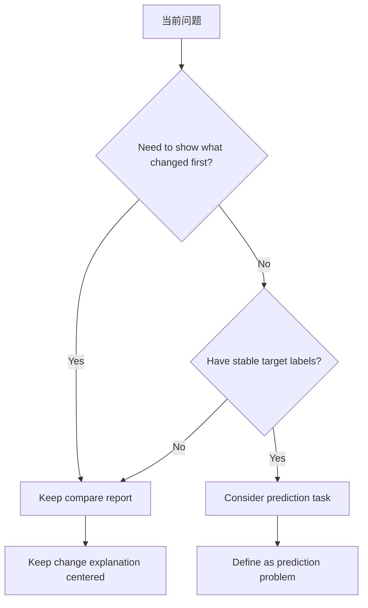

# P3-9.2 为什么有些问题应该一直保留为比较报告

> Section ID: `P3-9.2`
> Version: `v2026.07.11`

把所有现实问题都硬塞进预测问题里，并不是好的数据建模。有些情况下，比较报告更诚实，也更符合当前数据状态。尤其是在原因标签很弱，或者判断者真正想看的不是`正确分类`，而是`现在先把该看的对象挑出来`时，更是如此。这里也要一起整理这样一种可能：有些问题不往上提升，反而一直保留成比较报告会更正确。

在这个位置，人们很容易先想到`输入 -> 正确标签 -> 自动判别`这种结构，于是会觉得现实问题也都该放进这个框架里。但在现实数据里，`应该先展示什么`往往比`应该自动判对什么`更重要。如果把这样的事情硬改成分类问题，就很容易在标签质量还很弱时，先做出一种被夸大的自动化。

通常来说，下面这些情况更适合 comparison report。

- 重要的是先展示最近变化相对平时的方向
- 比起确认标签，复核优先级更有实际价值
- 变化原因还不能自动定性
- 人的后续确认本来就是判断流程的一部分

例如，只要把最近区间均值、波动性、模式差异、相对基线的差值、以及是否需要复核整理清楚，就已经可能很有帮助。在这种情况下，真正重要的不是`匹配到了什么`，而是`先展示了什么`。因此，好的比较报告并不是简单的中间产物，它本身就会成为一种真实的后续判断形式。

反过来，如果要进入预测问题，至少需要下面这些条件。

- 目标标签定义得相对稳定
- 样本单位和标签单位是对齐的
- 样本结构已经整理到足以设计训练/评估切分和评估方式

两种做法的差别可以整理成下面这样。

| 区分 | 比较报告 | 预测问题 |
| --- | --- | --- |
| 中心问题 | 应该先复核什么 | 应该自动匹配什么 |
| 需要的标签 | 即使较弱也能开始 | 必须相对稳定 |
| 产物 | 优先级表、比较句子、复核队列 | 目标标签、预测值、评估结果 |
| 人的角色 | 后续确认的中心 | 评估和例外处理的中心 |

这张表说明，比较报告并不是`因为还做不了预测，所以暂时拿来用的过渡物`。它从一开始就是另一种问题设定。比较报告让人读状态、决定下一步动作；预测问题则是用来自动匹配相对稳定的目标标签。

实际工作里，更安全的做法往往是先判断`继续保留为比较报告，会不会更诚实`，就像下面这样。

| 当前状态 | 更自然的产物 | 原因 |
| --- | --- | --- |
| 几乎没有原因标签，只能做变化比较 | 比较报告 | 可以说明哪里变了，但还很难固定原因 |
| 可以定复核优先级，但确认标签很弱 | 比较报告或复核队列 | 判断者想先知道看什么，而分类答案还很弱 |
| 目标标签和评估结构都相对稳定 | 预测问题 | 已经有根据去定义应当自动匹配什么 |

通过下面这张小表，comparison report 和 prediction problem 的差别会更清楚。

| event_id | diff | repeatability | review_needed | cause_label |
| --- | --- | --- | --- | --- |
| A | -0.35 | high | 1 | 无 |
| B | -0.08 | low | 0 | 无 |
| C | -0.31 | high | 1 | 无 |

## 用一个小图来看

这张图说明，比较报告不是因为还做不了预测，所以暂时停在那里的过渡阶段。对某些问题来说，它本来就可能一直是更合适的产物。如果首先需要做的是展示`哪里变了`，那 comparison report 就是自然的；只有在存在稳定目标标签时，进入 prediction problem 才变得合理。好的数据建模，不是从一开始就定义最复杂的问题，而是诚实地选择最符合当前数据状态的输出形式。如果变化说明和复核优先级更重要，而稳定目标标签仍然偏弱，那么把 comparison report 一直保留到最后，反而可能更准确。

因此，比较报告并不是预测之前的临时替代，而是在某些问题里，它本身就可能是最正确的输出结构。

## 来源与参考资料

- U.S. Bureau of Labor Statistics (BLS), *BLS Handbook of Methods: Glossary*, baseline. [https://www.bls.gov/bls/glossary.htm](https://www.bls.gov/bls/glossary.htm){: target="_blank" rel="noopener noreferrer" }
- National Cancer Institute (NCI), *NCI Dictionary of Cancer Terms: baseline*, baseline. [https://www.cancer.gov/publications/dictionaries/cancer-terms/def/baseline](https://www.cancer.gov/publications/dictionaries/cancer-terms/def/baseline){: target="_blank" rel="noopener noreferrer" }
- Google, *Machine Learning Glossary*, `proxy labels`, `label`, 确认日 2026-07-08. [https://developers.google.com/machine-learning/glossary](https://developers.google.com/machine-learning/glossary){: target="_blank" rel="noopener noreferrer" }
