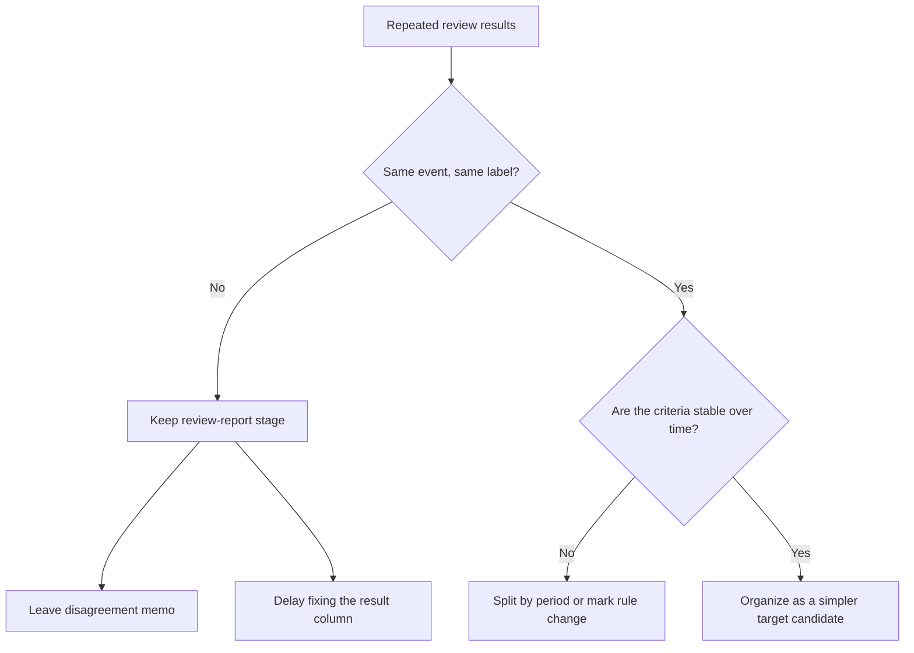

# P3-9.6 如果同一个事件会因人或时期不同而被贴上不同标签，该怎么办

> Section ID: `P3-9.6`
> Version: `v2026.07.11`

即使已经出现了标签候选列，也不能立刻说这就是一个稳定的学习问题。在现实数据里，同一个事件可能会被两个复核者写成不同结果，上个月还被看作`注意`的状态，这个月也可能被记成`正常`。所以，在读取[目标标签候选（target candidate）](../../../reference/concept-glossary.md#glossary-target-candidate)时，不能只看`有没有列`，还要一起看`在同一个事件和相似条件下，是否会重复出现相同含义的判断`。

## 为什么还要一起检查标签一致性

这个问题是用来判断：当前标签候选能不能直接作为目标标签。即使样本边界和结果列都已经设好，只要判断含义不能重复，就很难把它读成一个稳定的学习问题。

| 已经设好的结构 | 为什么在这里还要重新检查 |
| --- | --- |
| 样本单位 | 因为即使样本标准相同，标签也可能摇摆 |
| 目标标签候选列 | 因为就算有列，如果附着标准因人而异，也很难立刻直接使用 |
| 比较报告和复核队列 | 因为当复核过程积累成标签候选时，也要一起看判断是否一致 |

所以，这里真正要确认的不是`标签候选列是否存在`，而是`这个标签候选是否真的会以同样含义重复出现`。

## 为什么同一个事件也会被贴上不同标签

标签候选会摇摆，原因大多会落在下面几类里。

| 摇摆的原因 | 实际上会发生什么 |
| --- | --- |
| 复核者标准不同 | 同样的模式，有人看成 `review_needed`，有人看成 `normal` |
| 判断标准会随时间变化 | 过去会被当成告警的模式，在新规则下可能被当成正常 |
| 依据句子太弱 | 没留下足够理由，之后就难以重新对齐判断 |
| 边界案例很多 | 非常接近基线的案例，更容易被不同人贴成不同结果 |

因此，标签候选的问题不只是`对不对`，还包括`同一套规则是否在重复`。

## 先看比较表

| event_id | diff | repeatability | reviewer | review_label |
| --- | ---: | --- | --- | --- |
| A | -0.34 | high | kim | review_needed |
| A | -0.34 | high | lee | normal |
| B | -0.08 | low | kim | normal |
| B | -0.08 | low | lee | normal |
| C | -0.29 | medium | kim | review_needed |
| C | -0.29 | medium | lee | review_needed |

在这张表里，`A` 是同一个事件，但 `kim` 写成了 `review_needed`，`lee` 却写成了 `normal`。`B` 和 `C` 则是一致的。看到这种状态，人们很容易想成：`反正也有标签列了，那是不是可以直接升成学习问题？` 但实际上，更应该先看的是：像 `A` 这样的事件到底有多少。

关键不在于标签候选列是否存在，而在于`在同样条件下，同样判断会重复多少次`。

## 在当前阶段，先写下什么会比较好

在这个阶段，还不必先上复杂统计指标，先留下下面这些备注就已经足够。

| 先写下的备注 | 为什么需要 |
| --- | --- |
| 在同一事件的重复复核中，是否有经常分裂的标签 | 为了先看一致性低的区域 |
| 是否存在标准改变的时点 | 为了留下标签含义随时期变化的可能性 |
| 当前标签候选是直接作为 target，还是继续保留更多 comparison report 比重 | 为了留下推迟当前问题类型判断的理由 |

这些备注并不是完美的质量认证，而是把`标签可能会摇摆`这个事实，不隐瞒地保留在当前判断记录里。

## 什么时候不适合直接提升成 target

如果下面这些场景反复出现，那么比起把目标标签候选原封不动地直接作为结果列，更安全的做法是先再整理一步。

| 看见的信号 | 更自然的下一步动作 |
| --- | --- |
| 同一事件在不同复核者之间经常出现不同标签 | 更长时间地保留 comparison report 和 review queue |
| 某个日期之后标签标准突然改变 | 按时期拆开阅读，或者留下规则变更备注 |
| 有自由备注，但共同判断列很弱 | 先加强复核备注整理规则 |
| 边界案例经常出现分裂 | 比起`确认标签`，先把`需要复核`作为目标更自然 |

因此，与其把不稳定的原因分类硬抬成预测问题，不如先把更简单、更容易重复的判断列拿来做目标候选，这会更符合当前的问题类型判断。

留下这些备注之后，就可以先检查的不是`有没有列`，而是`这个列是否以相同含义在重复`。所以在当前阶段，比起把问题类型继续加重，更重要的判断是：不要把含义还在摇摆的标签候选原样留下。

## 用一个小图来看



## 一个小 Python 例子

问题场景：当两个复核者对同一个事件给出不同标签时，即使已经有标签候选列，也不意味着它可以立刻被读成稳定目标标签。

输入：由 `event_id`、`reviewer`、`review_label` 组成的重复复核记录表

预期输出：并排展示每个事件的复核次数、标签种类数，以及真正发生不一致的事件列表

要确认的概念：比起是否存在候选列，更重要的是相同事件和相似条件下，相同含义的判断是否在重复

```python
import pandas as pd

reviews = pd.DataFrame(
    [
        {"event_id": "A", "reviewer": "kim", "review_label": "review_needed"},
        {"event_id": "A", "reviewer": "lee", "review_label": "normal"},
        {"event_id": "B", "reviewer": "kim", "review_label": "normal"},
        {"event_id": "B", "reviewer": "lee", "review_label": "normal"},
        {"event_id": "C", "reviewer": "kim", "review_label": "review_needed"},
        {"event_id": "C", "reviewer": "lee", "review_label": "review_needed"},
    ]
)

label_variety = reviews.groupby("event_id")["review_label"].nunique()
disagreed_events = label_variety[label_variety > 1]

review_counts = reviews.groupby("event_id").size()

print("1) reviews per event:")
print(review_counts)
print()
print("2) label variety by event:")
print(label_variety)
print()
print("3) events with disagreement:")
print(disagreed_events.index.tolist())
```

预期输出：

```text
1) reviews per event:
event_id
A    2
B    2
C    2
dtype: int64

2) label variety by event:
event_id
A    2
B    1
C    1
Name: review_label, dtype: int64

3) events with disagreement:
['A']
```

这个例子的目的不是制作模型输入，而是先确认：`同一个事件被复核了多少次，其中哪些地方发生了标签分裂。` 当你先看每个事件的复核次数，再数标签种类数，最后只抽出真正不一致的事件列表时，就会更清楚为什么这一节要求先看`标签含义是否在重复`，而不是先看`有没有标签列`。这里重要的，不是某个团队的备注习惯，而是确认`标签含义稳定性（label meaning stability）`。在阅读目标标签候选时，要一起确认：当前标签候选是否以相对相同的含义重复出现、能否记录标准改变的时点，以及是否避免把不稳定标签直接作为结果列。只有这样，目标标签候选表才不只是一个列清单，而会变成把`标签含义稳定性`也包含进来的结构。

## 来源与参考资料

- Google, *Machine Learning Glossary*, `rater`, `inter-rater agreement`, `label`, 确认日 2026-07-08. [https://developers.google.com/machine-learning/glossary](https://developers.google.com/machine-learning/glossary){: target="_blank" rel="noopener noreferrer" }
- W3C, *PROV-Overview: An Overview of the PROV Family of Documents*, provenance and activity context overview. [https://www.w3.org/TR/prov-overview/](https://www.w3.org/TR/prov-overview/){: target="_blank" rel="noopener noreferrer" }
