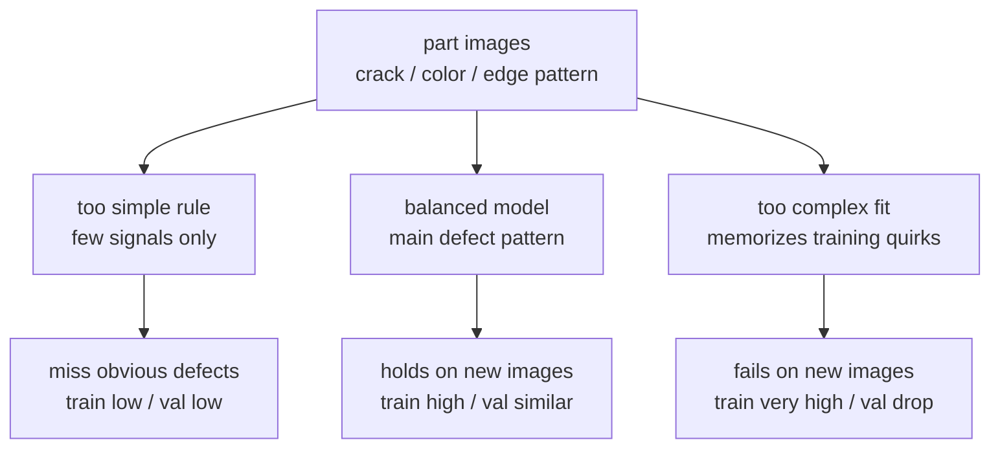
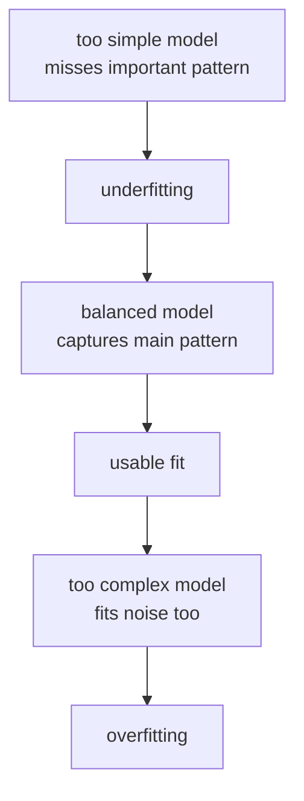
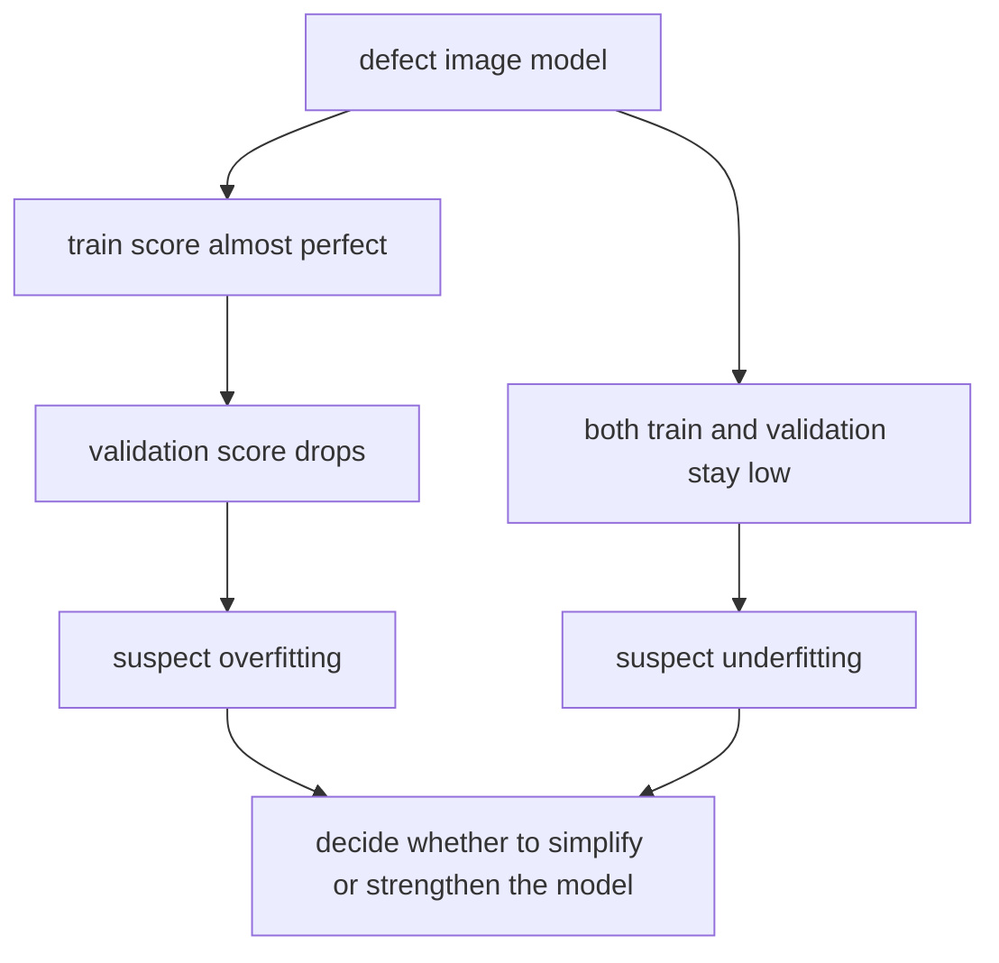

# P4-5.1 过拟合(overfitting)与欠拟合(underfitting)

> Section ID: `P4-5.1`
> Version: `v2026.07.11`

在 P4-4 章里，我们看过为什么要把数据分成 training、validation、test。接下来会自然冒出一个问题。把数据拆开之后，为什么有些 model 在 training data 上表现很好，但一到新数据就变弱？反过来，为什么有些 model 连 training data 都解释得不够好？

这一节把这两种状态分开来看。`过拟合(overfitting)` 指的是过度贴合 training data 的状态，`欠拟合(underfitting)` 指的是还没有把重要模式学够的状态。在 machine learning 里，只有先分清这两种状态，后面的选择才有依据。

这一节说明 `过拟合` 和 `欠拟合` 的基本区分。下一节会沿着这个抓手继续判断当前语境，而 `模型能不能在新数据上站得住` 这个基本区分，会通过本节和 [概念词汇表](../../../reference/concept-glossary.md) 再次接回。

## 本节范围

这一节解释过拟合与欠拟合的基本区分。像 regularization、dropout、early stopping 这样的具体缓解方法，这里还不会展开。这些应对方法会在 Part 4 的 deep learning 部分和后面的模型章节里再回来。

同时，这一节也不会把 `为什么 model 能在新数据上工作` 这个更大的问题一次讲完。这个问题会在 P4-5.2 的 `generalization` 里继续。这里的焦点是先用眼睛分清 `贴得太过` 的状态和 `还没学够` 的状态。

- 过拟合和欠拟合各自是什么状态？
- 为什么不能只看 training score 就相信 model？
- 为什么要把 training score 和 validation score 一起看？
- model 太简单或太复杂时，会发生什么？
- 在实务里，人通常会在什么场景下体会到这个问题？

## 本节目标

- 能说明过拟合和欠拟合的区别。
- 能说明为什么要把 training score 和 validation score 一起读。
- 能说明为什么只对 training data 贴得太紧的状态有风险。
- 能说明为什么简单 model 会漏掉重要模式。
- 能自然接到后面的 P4-5.2 generalization 讨论。

## 学习背景

### 先把两种状态一起抓住

下面这张表，是同时看这两种状态最快的出发点。

| 状态 | 在 training data 上的样子 | 在新数据上的样子 | 解读 |
| --- | --- | --- | --- |
| 欠拟合(underfitting) | 拟合得不好 | 依然拟合得不好 | model 还是太简单，或者还没学够 |
| 适当状态 | 拟合得还不错 | 在新数据上也有相近表现 | 抓到了一部分重要模式 |
| 过拟合(overfitting) | 拟合得太好 | 到新数据上性能下降 | 连 training data 里的偶然波动都跟得太紧了 |

这一节首先读的，不是 `accuracy 0.83 算不算好` 这样的数字判断，而是 `两类数据场景之间的差别`。

这里可以先把几个词很短地固定下来。

- `fit` 指的是 model 能在多大程度上解释并跟随数据里的模式。
- `underfitting` 指的是解释不足、偏向太少的一边。
- `overfitting` 指的是解释过细、偏向太多的一边。

所以这两者都属于 `fit` 的问题，只是方向不同。

- 欠拟合：还没有解释够
- 过拟合：为了解释得太多，连不必要的波动也一起跟上了

可以把这个差别记成 `还没学够的状态` 和 `背得太狠的状态`。

## 主要学习内容

### 欠拟合是还没学够的状态

欠拟合是指 model 还没有把问题里重要的结构抓到位。它常常出现在规则过于简单、训练还不够、或者 model 只看到了很少一部分必要 feature 的时候。

再严一点说，欠拟合可以理解成 `model 能表达的解释范围太窄`，或者 `这个范围还没有被充分用起来`。所以就连在 training data 里，也会反复漏掉一些部分。

这种状态通常会一起出现下面这些特征。

| 观察场景 | 更接近欠拟合的解读 |
| --- | --- |
| training score 低 | 连已经看过的数据都解释不好 |
| validation score 也低 | 那么在新数据上自然也会弱 |
| training 与 validation 的差距小 | 差距小不一定是好事，也可能只是两边都低、一起很弱 |

因此，读者很容易误会成 `差距小，所以没问题`。但如果两边都低，这不一定说明 model 稳，而更可能说明它 `本身就还太弱`。

例如，假设在客户流失预测里只看 `最近购买次数`。但真实情况里，咨询次数、最近登录、支付失败等信号也很重要。如果只用一个变量判断，model 一开始就会太简单。

| 客户 ID | 最近购买次数 | 咨询次数 | 实际是否流失 | 过于简单规则的例子 |
| --- | --- | --- | --- | --- |
| C01 | 8 | 0 | 留存 | 留存 |
| C02 | 2 | 3 | 流失 | 流失 |
| C03 | 6 | 4 | 流失 | 留存 |
| C04 | 5 | 5 | 流失 | 留存 |

在这张表里，如果只看购买次数，就很容易漏掉 C03、C04。这更接近 `还没有解释到必要模式` 的问题，而不是 `因为太复杂才出问题`。

换成别的工作场景，也能看到同样的问题。

| 工作 | 过于简单判断的例子 | 容易漏掉什么 |
| --- | --- | --- |
| spam 分类 | 只要标题里有 `免费` 就全部判成 spam | 无法区分正常促销邮件和更隐蔽的 spam |
| 客户推荐 | 只根据最近买过的 1 个品类推荐 | 无法反映长期偏好变化和多重兴趣 |
| 价格预测 | 只按房间数预测房价 | 会漏掉地段、房龄、交通、维修状态等重要因素 |

这三种情况的共同点都是一样的：`解释太少，装不下重要差异`。

所以，欠拟合通常可以归结成下面这个问题。

`这个 model 连解决当前问题所需的最低解释力都还没有具备吗？`

如果换成不良检测场景，同样的图像分类问题，也要用不同流程去读 `太简单所以漏掉` 和 `把训练样例背得太紧` 这两种情况。



### 过拟合是背得太多的状态

过拟合是指 model 对 training data 贴得太紧。它不只是抓住了重要模式，还把这个数据里偶然出现的波动、特殊排列也一起跟上了。

这里的关键词是 `偶然波动`。任何数据里都会同时有真正重要的结构，也就是 signal，以及偶然混进去的变化，也就是 noise。过拟合可以理解成：model 没有把这两者分开，结果连 noise 也当成了该学的规则。

再严一点读，过拟合也可以换成下面这个问题。

`这个 model 跟住的不只是一般性模式，而是连这份 training data 里偶然才有的形状也一起跟住了吗？`

这种状态通常会一起出现下面这些特征。

| 观察场景 | 更接近过拟合的解读 |
| --- | --- |
| training score 很高 | 对已经看过的数据贴得过于好 |
| validation score 比预期低 | 在新数据上没有同样站住 |
| training 与 validation 的差距大 | 可能形成了只对 training data 很强的解释 |

换成工作场景，可以这样理解。

- 在 training data 上几乎接近完美。
- 一到 validation data，分数就比预期掉得更多。
- 但团队如果只看 training score，还是可能误以为 `已经做得很好了`。

例如，假设 spam 分类 model 在 training 邮件上做到 99%，但在新邮件上只有 81%。这时候，它不一定是真的学会了更一般的 spam 模式，更可能只是对 training data 变得太熟。

推荐系统里也会出现类似场景。

- 在 training data 里，几乎能完美解释某些用户的历史点击。
- 但对新来的用户，或最近兴趣已经变化的用户，推荐效果会变弱。

这时，与其说 model 学会了 `推荐原理`，不如说它更像是 `把旧记录记得太牢了`。

下面这个区分能让过拟合读得更清楚。

| 问题 | 在过拟合时的回答 |
| --- | --- |
| 对已经看过的数据很强吗？ | 是 |
| 对第一次看到的数据也有同样强吗？ | 不一定 |
| 问题是数据不够，还是背得太狠？ | 很多时候更像后者 |

所以，过拟合往往不是 `model 更聪明了`，而更像是 `它对这张试卷太熟了`。

### 分数一定要放到两个场景里读

过拟合和欠拟合通常都是通过把 `training score` 和 `validation score` 放在一起读来判断的。

| 候选 | training accuracy | validation accuracy | 读法 |
| --- | --- | --- | --- |
| Model A | 0.62 | 0.60 | 两边都低，可能是欠拟合 |
| Model B | 0.84 | 0.82 | 两边相近，而且都还不错 |
| Model C | 0.99 | 0.78 | 只有 training 特别高，可能是过拟合 |

这里的关键不只是 `validation score 比 training 稍低`，而是 `为什么会以这种方式出现差距`。

- 两边都低 -> 可能还没抓住重要结构
- 两边都高且差距小 -> 可能相对稳定
- 只有 training 很高而 validation 掉得明显 -> 可能对 training data 贴得太紧

读者尤其容易把第一种和第三种混在一起。

| 常见误解 | 实际上更准确的是 |
| --- | --- |
| validation score 低就一定是过拟合 | 如果 training score 也低，可能是欠拟合 |
| training score 高就是好 model | 必须连 validation score 一起看 |
| 只要有一点差距就是问题 | 小差距很自然，关键是 `模式` 和 `幅度` |

用一句话概括，就是这样。

- 欠拟合是 model 还不够
- 过拟合是 model 贴得太过

在实务里，首先常常要判断的是 `现在更该优先怀疑欠拟合，还是过拟合？`

| 当前观察 | 先怀疑哪种状态 | 原因 |
| --- | --- | --- |
| training score 和 validation score 都低 | 欠拟合 | 更可能是还没抓住重要结构 |
| training score 很高但 validation score 明显下降 | 过拟合 | 更可能是把 training data 的偶然波动也一起跟上了 |
| training 与 validation 都高而且差距小 | 相对合适的状态 | 更可能在新数据上也能撑住一定程度 |

## 细部学习内容

### 用图看会更快



这张图不是精确数学说明，而是方向性说明。左边表示还不够的状态，中间表示相对平衡的状态，右边表示贴得过头的状态。

把这张图换成句子，就是下面这样。

- 左边：还会漏掉重要结构
- 中间：主要抓住了重要结构
- 右边：不只抓重要结构，连偶然波动也想一起抓住

### 再用一个小表来看

下面这张表能更直观地看到三种状态。

| model 状态 | training score | validation score | 读起来的感觉 |
| --- | --- | --- | --- |
| 太简单 | 低 | 低 | 还没学够 |
| 合适 | 高 | 也比较高 | 在新数据上可能撑得住 |
| 太复杂 | 很高 | 相对较低 | 对 training data 贴得太紧 |

这张表不是严格数学公式，而是实务里第一次读状态时的起点。

所以，过拟合和欠拟合并不只是考试术语，而更像是读 model 的第一层诊断语言。

### 为什么更复杂的 model 也不一定更好

model 更复杂之后，确实可以表达更多模式。这本身是优点。但当数据少、feature 不稳定、或者偶然波动很多时，这种复杂度反而可能让 model 连 training data 里的 noise 也一起跟上。

scikit-learn 的官方例子也说明了这一点。它指出：过于简单的函数可能因为解释不了训练样本而变成欠拟合，而次数过高的多项式则可能把 training data 里的 noise 也一起学进去，变成过拟合。对这一节来说，比起完整的数学形状，更重要的是这个观点：`model complexity 和新数据表现并不会永远一起变好`。

因此，下面这种阅读习惯很重要。

1. 现在看到的是 training score，还是 validation score？
2. 它们之间的差距大还是小？
3. 是两边都低，还是只有 training 特别高？
4. 当前问题是 `还需要学更多`，还是 `需要少背一点`？

第四个问题尤其重要。

- 还需要学更多 -> 更偏向怀疑欠拟合
- 需要少背一点 -> 更偏向怀疑过拟合

这两个问题在后面的章节里也会持续有用。

- 看线性回归时
- 看决策树时
- 看神经网络时

最先抛出的判断问题都很像：`这个 model 是还没学够，还是背得太狠？`

## 案例与示例

### 案例 1. 当不良检测 model 在内部演示里看起来近乎完美

制造团队想根据零件照片来分类是否不良。人最先使用的标准，是 `表面有没有裂纹`、`颜色是否不均匀`、`边缘有没有破损` 这样比较直观的信号。

第一次实验时，团队用了一个非常复杂的 model，因此在 training data 上拿到了几乎完美的分数。于是，在内部演示里，团队很容易觉得 model 已经足够好了。但一换到 validation data，分数就明显下降，尤其当光照条件稍有变化时，误判也会增加。

这个场景说明，过拟合与欠拟合必须一起区分。如果 training score 和 validation score 都低，那更像是还没学会重要模式的欠拟合。反过来，如果只有 training score 过高，而 validation score 明显变低，就应该把它读成过拟合，也就是 model 跟住的不是不良的本质特征，而是训练照片里的偶然背景和 noise。

真正可检查的结果，会在把 training score 和 validation score 并排放时出现。一起看两边分数的水平和差距，才能判断下一步更需要的是 `给 model 更多解释力`，还是 `让它少背一点`。



## 案例与示例

### 再用实务场景读一次

如果拿客户流失预测项目举例，团队通常会看到下面两种场景中的一种。

| 场景 | 表面现象 | 实际更该怀疑什么 |
| --- | --- | --- |
| model 只在 training data 上很好 | 内部评审时看起来很出色 | 可能是过拟合 |
| model 连 training data 上都不太好 | 到处都拿不到好分数 | 可能是欠拟合 |

关键不是把结果直接读成 `分数低就是坏 model`。真正该先问的是：为什么低，以及在哪类数据上低。

如果把它改写成会议里的说法，可以这样理解。

| 团队的说法 | 更准确的解释 |
| --- | --- |
| `training score 都 99% 了，不就差不多结束了吗？` | 应该先看它和 validation score 的差距 |
| `validation score 只有 60%，是不是说明 model 没用了？` | 如果 training score 也低，可能只是还没学够 |
| `把 model 做得更复杂一点，不就能解决了吗？` | 复杂度会增加表达力，但也会同时增加过拟合风险 |

所以，在实务里真正重要的并不是简单地比较 `复杂 model` 和 `简单 model`。更准确地说，是判断：`相对当前数据和问题，这个解释是太少了，还是太多了？`

## 练习与示例

### 用 Python 读欠拟合和过拟合

下面这段代码，不需要真的训练 model，也能展示怎样去读分数组合。

问题场景：

- 与其只读定义，不如直接看 training score 和 validation score 的组合，会更快抓住欠拟合和过拟合

输入(input)：

- 各 model 的 `train_score`
- 各 model 的 `validation_score`

输出(output)：

- 各 model 的 training score、validation score、差距 `gap`

确认概念：

- 必须把两边分数的水平和差距一起看，才能解释状态
- `gap` 只是辅助信号，分数高低也要一起读

```python
models = [
    {"name": "simple_rule", "train_score": 0.62, "validation_score": 0.60},
    {"name": "balanced_model", "train_score": 0.84, "validation_score": 0.82},
    {"name": "very_complex_model", "train_score": 0.99, "validation_score": 0.78},
]

for item in models:
    gap = round(item["train_score"] - item["validation_score"], 2)
    print(item["name"])
    print("  train score:", item["train_score"])
    print("  validation score:", item["validation_score"])
    print("  gap:", gap)
```

执行结果示例可以这样读。

```text
simple_rule
  train score: 0.62
  validation score: 0.6
  gap: 0.02
balanced_model
  train score: 0.84
  validation score: 0.82
  gap: 0.02
very_complex_model
  train score: 0.99
  validation score: 0.78
  gap: 0.21
```

从这个输出里要看的，不只是 `gap`。

- `simple_rule` 差距小，但两边都低，更接近欠拟合。
- `balanced_model` 两边都高，差距也小，可以读成相对稳定。
- `very_complex_model` training 很高，但和 validation 的差距大，这是更该怀疑过拟合的场景。

所以，差距小不一定总是好，training score 高也不一定总是好。

更准确地换句话说，就是下面这样。

- `低 + 低` 可能是因为还不够，所以总在漏
- `高 + 也比较高` 可能是相对稳定的状态
- `很高 + 明显更低` 可能是对 training data 贴得太狠

如果把同一个例子压成一行判断，可以这样写。

```text
simple_rule -> 还是太简单
balanced_model -> 目前候选里最稳定
very_complex_model -> 可能对 training data 贴得太紧
```

### 用 Python 再接上工作问题

这一次，把同样的数字接到工作判断上。

问题场景：

- 要把内部评分表变成真正的候选选择判断，就必须明确读出：按照 validation 标准，应该选哪一个 model

输入(input)：

- 各候选的 training score 与 validation score

输出(output)：

- 各候选的分数摘要
- 依据 validation 标准选出的最终候选

确认概念：

- training score 最高的候选，不一定就是按照 validation 标准最稳定的候选
- model selection 应该主要按 validation score 来读

```python
cases = [
    {"name": "candidate_A", "train_score": 0.65, "validation_score": 0.61},
    {"name": "candidate_B", "train_score": 0.88, "validation_score": 0.85},
    {"name": "candidate_C", "train_score": 0.98, "validation_score": 0.76},
]

for item in cases:
    gap = round(item["train_score"] - item["validation_score"], 2)
    print(item["name"], "-> train:", item["train_score"], "validation:", item["validation_score"], "gap:", gap)

best = max(cases, key=lambda item: item["validation_score"])
print("choose by validation:", best["name"])
```

执行结果示例可以像下面这样。

```text
candidate_A -> train: 0.65 validation: 0.61 gap: 0.04
candidate_B -> train: 0.88 validation: 0.85 gap: 0.03
candidate_C -> train: 0.98 validation: 0.76 gap: 0.22
choose by validation: candidate_B
```

在这个例子里，如果只看 training score，`candidate_C` 最像最好。但真正的选择会按 validation score 变成 `candidate_B`。这就是防止过拟合时最基本的读法。

这里读者要记住的一句核心话是：

`model selection 不是挑 training score 最高的候选，而是挑在 validation 标准下更稳定的候选。`

而这个稳定判断的中心，最终还是这一个问题。

`这个 model 抓到的是该学的模式，还是把这份数据的形状跟得太多了？`

## 本节要记住的观念

- 欠拟合是 model 还没有把重要模式学够的状态。
- 过拟合是 model 对 training data 贴得太紧的状态。
- 只看 training score，很难判断 model。
- 必须连 validation score 一起看，才能更快发现它在新数据上的弱点。
- 即使 training score 很高，只要 validation score 变低，就该怀疑过拟合。
- 如果两边都低，应该先想到欠拟合的可能。

## 检查清单

- 当 training score 和 validation score 一起看时，能不能说明为什么 `两边都低` 和 `只有 training 特别高` 要用不同方式来读？
- 在什么场景下，能把问题拆成 `还要多学一些` 和 `要少背一点` 来读？
- 能不能说明：更复杂的 model 不一定总更好，因为它也可能同时推高过拟合风险？

## 什么时候应该先想起这个观念

- 当你需要先根据 training 与 validation score 的差距，判断 model 是还没学够还是背得太多时，就应该想到这一节。
- 当你需要把 `training 高、validation 低` 和 `两边都低` 读成两种不同问题时，就该回到这一节。
- 当候选选择里不能只看单一分数，而要先看 generalization 方向时，这一节会成为标准。

## 出处与参考资料

- scikit-learn developers, `Underfitting vs. Overfitting`, scikit-learn Examples, 确认日期: 2026-06-26. [https://scikit-learn.org/stable/auto_examples/model_selection/plot_underfitting_overfitting.html](https://scikit-learn.org/stable/auto_examples/model_selection/plot_underfitting_overfitting.html){: target="_blank" rel="noopener noreferrer" }
- Google for Developers, `Machine Learning Glossary`, 确认日期: 2026-06-26. [https://developers.google.com/machine-learning/glossary](https://developers.google.com/machine-learning/glossary){: target="_blank" rel="noopener noreferrer" }
- Gareth James, Daniela Witten, Trevor Hastie, Robert Tibshirani, Jonathan Taylor, `An Introduction to Statistical Learning`, Springer, 官方网站确认日期: 2026-06-26. [https://www.statlearning.com/](https://www.statlearning.com/){: target="_blank" rel="noopener noreferrer" }
