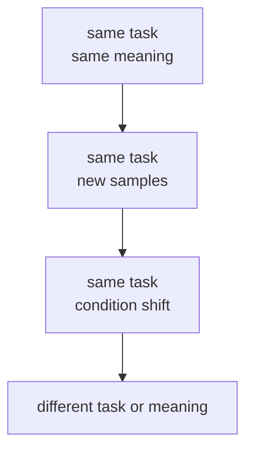
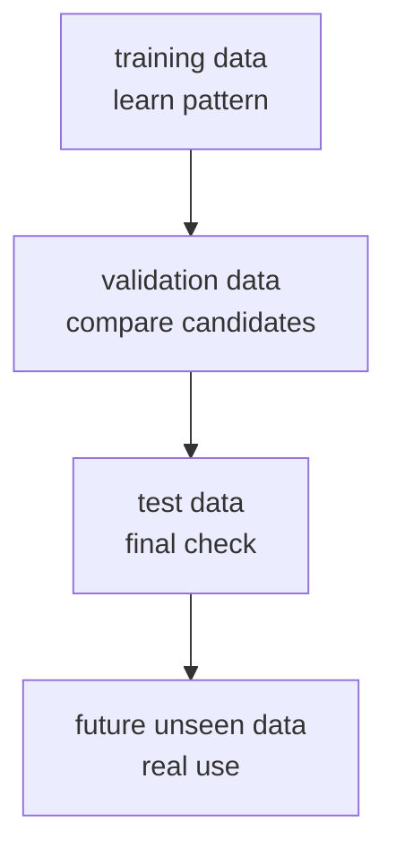
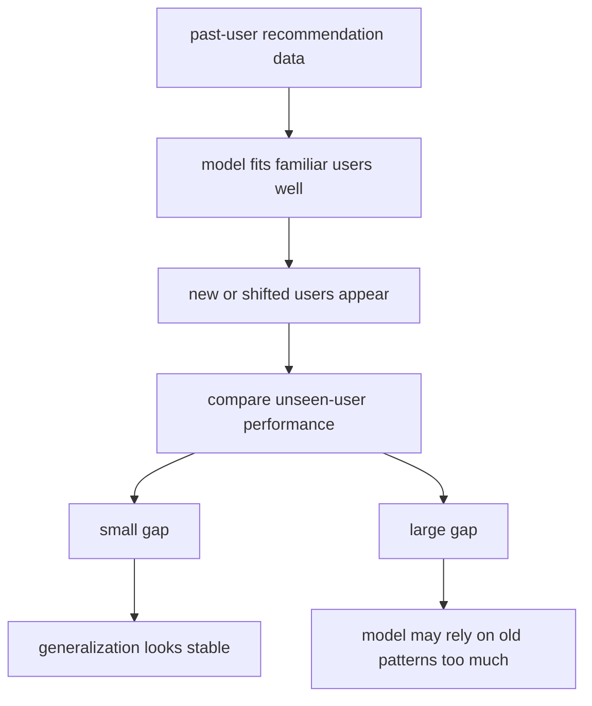

# P4-5.2 泛化(generalization)

> Section ID: `P4-5.2`
> Version: `v2026.07.11`

在 P4-5.1 里，我们区分了 `过拟合` 和 `欠拟合`。现在还要再往上一层问。为什么这个区分这么重要？因为 machine learning 的目标并不是 `把 training data 的分数做高`，而是 `即使面对还没见过的数据，也能维持可用表现`。把这个问题整理起来的词，就是 `泛化(generalization)`。

泛化听起来可能有点抽象，但起点很简单。它问的是：model 会不会只停留在重新答对已经见过的例子，还是也能对结构相近的新例子做出合适反应。

## 本节范围

这一节解释 generalization 的意义。像 generalization error 的公式和理论边界，这里还不会展开。这里的焦点，是把 `为什么新数据重要`、`为什么需要 validation 和 test`、`为什么不能只靠 training score` 这几件事连起来。

metric 的细致计算会在 P4-6 处理，cross-validation 的实务用法会在 P4-8.1 与 P4-9.2 再接回来。这一节先把 generalization 固定成一句贯穿整个 machine learning 的目标句，而不是先把它当成纯理论。

- 什么是 generalization？
- 为什么 machine learning 的目标要用 generalization 来说，而不是用 training score？
- overfitting 和 generalization 是什么关系？
- unseen data 到底是什么意思？
- 在实务里，人会怎样体会到 generalization？

## 本节目标

- 能用一句话说明 generalization。
- 能说明 training score 和 generalization 不是同一个意思。
- 能说明为什么 overfitting 会让 generalization 变弱。
- 能理解 validation data 和 test data 本质上都是为了确认 generalization。
- 能接上后面为什么还要学习 metric 与 model 选择。

## 学习背景

### generalization 到底在问什么

Google 的 machine-learning glossary 基本上是把 generalization 解释成这样一个问题：`model 能不能在 training set 之外的例子上也做出好的 prediction？` 这里最该抓住的意思是下面这句。

`generalization 是指：model 即使面对还没见过的数据，也能做出可用判断的性质。`

这里重要的是 `即使不是同一份数据` 这一点。

也需要顺带问一句：为什么要专门用这个词？因为 machine learning 是靠看数据来学习规则的，所以表面上很容易只剩下一句 `分数很高`。但 `只是在见过的数据上高` 和 `在没见过的数据上也能维持` 是完全不同的问题。为了把这两者分开，才需要 `generalization` 这个词。

| 问题 | 从 generalization 角度的含义 |
| --- | --- |
| 对 training data 拟合得好吗？ | 那只是起点 |
| 对新数据也能保持相近表现吗？ | 这才是 generalization 的核心问题 |
| 会不会只是记住了某些特定样本？ | 这可能是伤害 generalization 的警讯 |

所以，generalization 追问的，不太是 model `有没有适应这份 dataset`，而更是它 `有没有学到问题的结构`。

把这件事说得更直白一点，就是下面两个问题。

- 它是把 dataset 的形状背下来了？
- 还是学到了问题的结构？

generalization 更接近第二种。

### 为什么历史上会越来越重视 generalization

generalization 并不是到了最近的 generative AI 才突然冒出来的词。它是 statistical learning theory 历史里一直在处理的问题。Ulrike von Luxburg 和 Bernhard Schoelkopf 的综述论文指出，statistical learning theory 起源于 1960 年代的俄罗斯，并随着 1990 年代 support vector machine 的发展而被更广泛地认识。那篇文章还把这门领域的核心问题概括成：`如何从 empirical data 中得出有效结论？`

这段历史可以用下面这个顺序来读。

1. 统计与学习研究一直都想区分：哪些规则只是贴合已见数据，哪些规则也能对新数据成立。
2. 这个问题后来在 statistical learning theory 里被更系统地处理。
3. 再往后，machine-learning 实务中，validation、test、cross-validation 这类程序就逐渐成为确认 generalization 的基本习惯。

所以，generalization 不是流行词，而是长期以来拿来分辨 `这到底算不算真的学会了` 的核心标准。

## 主要学习内容

### 为什么目标会变成 generalization

machine learning 几乎总是为了 `接下来会进来的数据` 而建立 model。

- spam 分类 model 要分类明天到达的邮件。
- 客户流失预测 model 要预测下个月的客户。
- 价格预测 model 要估计还没交易过的房屋。

所以，真正的使用场景永远都站在 `还没见过的数据` 这一边。

| model 用在哪里 | training data 是什么 | 真正使用时进来的是什么 |
| --- | --- | --- |
| spam filter | 过去的邮件记录 | 新到达的邮件 |
| recommendation system | 过去的点击与购买记录 | 现在登录用户的下一步行为 |
| demand forecasting | 过去的销售数据 | 还没到来的下周需求 |

看完这张表，就能马上理解为什么不能只靠 training score。因为实际服务不是 `复习过去`，而是 `应对未来`。

因此，generalization 不是一个额外加分项，而是和 machine learning 被使用的理由本身连在一起。如果根本不需要处理新数据，那很多时候根本不必用 machine-learning model，规则表或查询表就已经够用了。

### 什么叫新数据

一说到 `unseen data`，听起来很像来自完全陌生世界的数据。但通常它指的是 `同一个问题里、还没有拿去训练的例子`。

这一点很容易被误会。generalization 一般并不等于 `无论什么环境都一定能表现好`。它首先更接近的是：`在同一个问题设定里，对还没见过的例子也能撑住一定程度。`

比如在客户流失预测里，可以这样整理。

| 区分 | 例子 |
| --- | --- |
| training data | 过去三个月客户记录中的一部分 |
| validation data | 同一时期里没有拿去训练的一部分 |
| test data | 作为最后确认而另外留出的部分 |
| 实际服务输入 | 下个月新累积的客户记录 |

这四类数据都属于同一个 domain，但对 model 来说，会分成 `见过的` 和 `还没见过的`。generalization 讲的，正是这个边界上的问题。

为了把这个边界看得更清楚，也可以像下面这样区分。

| 情况 | 通常会直接放进 generalization 说明里吗？ | 原因 |
| --- | --- | --- |
| 同一服务下周的客户数据 | 会 | 它是同一问题的未来样本 |
| 同一分类任务里的其他样本 | 会 | 它们是同一结构的未观测例子 |
| 完全不同产业的数据 | 通常不会直接算 | 问题定义本身可能已经不同 |
| 输入形式和意义差很多的数据 | 通常需要另外判断 | 很难直接视为同一个 generalization 问题 |

所以，generalization 不是 `对任何数据都有效` 的宣告，而更像是 `对同一问题里还没见过的例子，到底能撑到什么程度？`

如果先问 `这里到底还能不能算是同一个问题的新例子`，generalization 的范围就会更好整理。

| 当前比较场景 | 会不会直接放进 generalization 讨论 | 原因 |
| --- | --- | --- |
| 同一服务的下周数据 | 通常会 | 因为它是同一问题的新样本 |
| 同一问题的其他未观测案例 | 通常会 | 因为它们是同一结构但未用于训练的例子 |
| 同一问题但条件略有变化的数据 | 条件式会 | 因为它可能仍是同一问题，只是更难的 generalization 区间 |
| 完全不同产业或意义不同的数据 | 通常不会直接放入 | 因为问题定义本身可能已经变了 |

把这个范围画出来，可以像下面这样。



这张图把 generalization 指向的范围分了出来。最直接的 generalization 检验，发生在同一问题的新样本上；而越往条件变化、乃至完全不同任务走，就越难把它们简单地统称为同一个 generalization。

- `same task, same meaning` 是最靠近 training data 的区间
- `same task, new samples` 是最先测试 generalization 的区间
- `same task, condition shift` 可能仍然是同一个问题，但难度更高
- 到了 `different task or meaning`，通常就很难直接归为同一种 generalization 问题

### overfitting 和 generalization 的关系

这时也就能自然接回：为什么要重新把 P4-5.1 的 `overfitting` 与 `underfitting` 拿出来。因为 generalization 最终问的，就是 `在新数据上站不站得住？`

P4-5.1 里看到的过拟合，就是 generalization 变弱的代表场景。

| 状态 | 从 generalization 角度读就是 |
| --- | --- |
| 欠拟合 | 因为重要结构没学够，所以在新数据上也可能弱 |
| 适当状态 | 在 training data 和新数据之间可能表现得相对稳定 |
| 过拟合 | 在 training data 上强，但在新数据上可能掉下来 |

所以，过拟合可以读成 `伤害 generalization 的方向`。但 generalization 并不只是 `过拟合的反义词`。它更宽地指向：`在新数据上到底能撑住多少` 这个整体问题。

- 过拟合会让 generalization 变弱
- 欠拟合也会让 generalization 变弱
- generalization 最终问的是 `在新数据上的站得住的力量`

### validation 和 test 本质上都是为了看 generalization

P4-4.2 里为什么要把 validation 和 test 分开，说到底也是因为 generalization。

- validation data：比较多个候选里，谁更可能在新数据上撑得住
- test data：最后再确认一次，最终选择是否真的在新数据上撑得住



这张图显示的是：train、validation、test 归根到底，都是为了提前估计未来 unseen data。generalization 不能只被读成 validation 分数或 test 分数本身，而要放进一个完整流程里看：这些环节到底是在帮助我们判断 model 在真实使用里的 unseen data 上能撑到什么程度。

在这张图里，validation 和 test 不是终点。它们都是为了估计 `未来还没见过的数据` 而存在的中间装置。

因此，validation 和 test 在给分之前，更本质上是间接观察 generalization 的程序。

如果把同一流程改写成表格，就是下面这样。

| 阶段 | 当前在做什么 | 最终想确认什么 |
| --- | --- | --- |
| training | 在已见数据上学 pattern | 有没有最起码的起点 |
| validation | 比较候选 model 或 setting | 哪个候选更可能在新数据上撑住 |
| test | 最后再单独确认一次 | 最终选择是不是过度乐观 |
| real use | 接收未来输入 | generalization 是否真的维持住 |

## 细部学习内容

### generalization 不是完美，而是站得住

读者很容易把 generalization 误解成 `在新数据上也必须完全一样地做对`。但 generalization 不是完美复制。通常它问的是：`在新数据上，能不能至少维持到可用水平？`

| 误解 | 更准确的表达 |
| --- | --- |
| generalization 就是在新数据上也完全一样地答对 | generalization 是在新数据上也能维持可用表现 |
| training score 和 validation score 必须完全一样 | 有一点差距是自然的 |
| 只要 generalization 成立，就能答对所有情况 | 就算 generalization 成立，也还是可能出错；关键是整体是否站得住 |

所以，generalization 更接近 `稳定性`，而不是 `完美性`。

generalization 不是重复背过答案的力量，而是对第一次见到的相似问题也能撑住的力量。

## 案例与示例

### 案例 1. 当推荐 model 只对熟悉用户很强

某内容服务团队正在运营推荐 model。人最先使用的标准，是 `最近看过的题材`、`经常点击的分类`、`相似用户常看的项目` 这样的信号。

在 training data 上，如果 model 很好地跟住这些标准，就可能拿到很高的分数。但一旦换到更接近实际服务的新用户群，或者最近兴趣已经发生变化的用户群，推荐满意度就会明显下降。如果团队一直只看 training score，就很容易误以为这个 model 已经足够好。

从 generalization 角度看，问题就变了。重要的不是 `它有没有把过去记录解释好`，而是 `它对还没见过的相似用户，能不能也撑住`。validation data 与 test data，应该正是用来提前确认这一点的装置。

真正可检查的结果，会在把熟悉用户集合与新用户集合的分数拿来比较时出现。这能让你读出：model 在同一问题内部到底稳不稳。如果差距小，说明 generalization 相对还在；如果差距大，就要重新检查它是否只对旧模式适应得太深。



### 示例 1. 用推荐系统和价格预测重新读 generalization

前面已经整理过定义、新数据、overfitting、validation、test 的关系，现在可以再回到实际场景里读一遍。下面这些例子都会连到同一个问题上。

`这个 model 能不能撑过眼前这张表？`

如果换成推荐系统场景，可以这样理解。

| 场景 | 从 generalization 角度的解读 |
| --- | --- |
| 对既有用户记录的推荐非常准 | 可能只是对 training data 适应得不错 |
| 对新用户或最近兴趣变化的用户变弱 | generalization 可能不够 |
| 在多个用户群上的 validation 结果都比较接近 | generalization 的可能性相对更高 |

价格预测也类似。

| 场景 | 从 generalization 角度的解读 |
| --- | --- |
| 在过去交易记录上的误差很小 | 可能对 training data 拟合得好 |
| 到新地区、新时间点时误差变大 | generalization 可能偏弱 |
| 在不同时间与地区里都维持相近误差范围 | generalization 可能相对稳定 |

### 示例 2. 社会现象数据也能用同样的 generalization 问题来读

generalization 不是只有企业服务里才需要。用 model 去读社会现象时，也会出现同样的问题。

例如，可以想象一个对线上舆论或帖子流向做分类的 model。

| 场景 | 从 generalization 角度的解读 |
| --- | --- |
| 对上个月的表达方式反应很好 | 可能已经适应了过去数据里的语气和模式 |
| 一出现新流行语、讽刺、绕弯表达就开始摇晃 | 对新数据的 generalization 可能偏弱 |
| 即使时间变化，仍能读出大方向 | generalization 可能相对还在 |

像交通拥堵或民愿增加这类反复出现的社会模式，也可以这样读。

| 场景 | 从 generalization 角度的解读 |
| --- | --- |
| 对平日通勤时段模式很准 | 可能对常见规则很强 |
| 一遇到假期、活动、暴雨这类不寻常条件就大幅出错 | generalization 的范围可能过窄 |
| 面对季节变化或轻微条件变化时，不会完全崩掉 | generalization 可能相对稳定 |

这些例子想说明的核心都是一样的。model 看过很多过去案例，这件事本身还不够。因为社会现象会换表达、会换条件、人的反应方式也会变。所以，generalization 也可以读成这样一个问题：`到了新的社会场景里，它还能不能撑住一定程度？`

同时也要看到，社会现象一侧的变化不是只有一种。

| 变化类型 | 例子 | 给 generalization 带来的负担 |
| --- | --- | --- |
| 表达变化 | 新流行语、缩略语、讽刺 | 同样意思会以不同表面句子出现，容易摇晃 |
| 条件变化 | 假期、活动、暴雨、政策变化 | 平常模式会变弱，例外情况会变大 |
| 群体变化 | 新用户群、不同地区、不同世代 | 会出现和过去分布不同的反应 |
| 时间变化 | 季节变化、长期趋势变化 | 旧规则可能会慢慢变得没那么适合 |

## 练习与示例

### 用 Python 读 generalization 问题

下面这段代码展示的是：从 generalization 角度，应该怎样去读分数。

问题场景：

- generalization 听起来像抽象词，但实际上可以从 training score 与 validation score 的差距开始读起

输入(input)：

- 各 model 的 `train_score`
- 各 model 的 `validation_score`

输出(output)：

- 各 model 的 training score、validation score、`generalization gap`

确认概念：

- generalization 是一种询问新数据上站得住程度的视角
- 就算差距小，如果两边都低，也不能马上说这是好的 generalization

```python
results = [
    {"name": "model_A", "train_score": 0.81, "validation_score": 0.79},
    {"name": "model_B", "train_score": 0.99, "validation_score": 0.74},
    {"name": "model_C", "train_score": 0.63, "validation_score": 0.61},
]

for item in results:
    gap = round(item["train_score"] - item["validation_score"], 2)
    print(item["name"])
    print("  train:", item["train_score"])
    print("  validation:", item["validation_score"])
    print("  generalization gap:", gap)
```

执行结果示例可以这样读。

```text
model_A
  train: 0.81
  validation: 0.79
  generalization gap: 0.02
model_B
  train: 0.99
  validation: 0.74
  generalization gap: 0.25
model_C
  train: 0.63
  validation: 0.61
  generalization gap: 0.02
```

在这个例子里，`generalization gap` 不是正式理论定义，只是帮助读者解释 training score 与 validation score 差距的辅助表达。

- `model_A` 的 training 与 validation 相对接近。
- `model_B` 的 training 很高，但 validation 掉得明显。
- `model_C` 虽然差距小，但两边都低。

所以，读 generalization 时，只看 `差距` 不够，只看 `高低水平` 也不够，必须两者一起看。

这里最重要的解释是下面这两个问题。

- training score 问的是：`对已经见过的数据，到底答得怎样？`
- validation score 问的是：`对还没见过但结构相近的数据，到底撑得怎样？`

generalization 主要更贴近第二个问题。

### 用 Python 读社会现象一侧的 generalization

下面这个例子把一种情况简化了：帖子分类 model 对 `熟悉表达` 很强，但只要出现 `新表达` 就会摇晃。

问题场景：

- 即便是同一个任务，只要表达方式变化，也值得用数字确认 model 的 generalization 会被摇动多少

输入(input)：

- 熟悉表达下的分数 `train_like_score`
- 新表达下的分数 `new_expression_score`

输出(output)：

- 各情境里的两类分数与 `generalization gap`

确认概念：

- generalization 不只和适应过去数据有关，也和条件变化下能不能撑住有关
- 表达变化，是同一问题里测试 generalization 的好例子

```python
scenarios = [
    {"case": "posts from last month", "train_like_score": 0.93, "new_expression_score": 0.90},
    {"case": "new slang appears", "train_like_score": 0.93, "new_expression_score": 0.68},
    {"case": "sarcasm and indirect wording increase", "train_like_score": 0.93, "new_expression_score": 0.61},
]

for item in scenarios:
    gap = round(item["train_like_score"] - item["new_expression_score"], 2)
    print(item["case"])
    print("  familiar expression score:", item["train_like_score"])
    print("  new expression score:", item["new_expression_score"])
    print("  generalization gap:", gap)
```

输出结果可以像下面这样读。

```text
posts from last month
  familiar expression score: 0.93
  new expression score: 0.9
  generalization gap: 0.03
new slang appears
  familiar expression score: 0.93
  new expression score: 0.68
  generalization gap: 0.25
sarcasm and indirect wording increase
  familiar expression score: 0.93
  new expression score: 0.61
  generalization gap: 0.32
```

这不是实际训练代码，而是为了练习读 generalization 而准备的阅读例子。

- `posts from last month` 里，熟悉表达和新表达之间差距很小。
- `new slang appears` 说明只要表达稍有变化，分数就可能明显下降。
- `sarcasm and indirect wording increase` 说明当表面句子变化更大时，model 可能摇晃得更厉害。

所以，即使在社会现象里，generalization 也应该更准确地读成：`面对新表达和条件变化时，它还能撑到什么程度？` 而不是仅仅看 `过去做得不错`。

而这里的 `撑住` 这个说法非常重要。新数据一进来，总会有一些差别和波动。generalization 问的是：在这些波动里，model 会不会完全崩掉，还是仍然保持在可用范围内。

## 本节要记住的观念

- generalization 是指 model 即使面对还没见过的数据，也能维持可用表现的性质。
- machine learning 的真正目标不是 training score 本身，而是 generalization。
- 过拟合和欠拟合都会让 generalization 变弱。
- validation 和 test 本质上都是为了提前估计 generalization。
- generalization 指的是在新数据上的稳定站得住，而不是完美一致。

## 检查清单

- 能不能说明：为什么 generalization 不该解释成 `把 training score 做高`，而该解释成 `对同一问题里的新例子也能撑住`？
- 能不能区分：哪些情况可以直接放进 generalization 范围里，哪些情况应该视为问题本身已经变了？
- 能不能说明：validation 和 test 本质上是为了确认 generalization？

读完这一节后，下面这条线应该能继续走下去。

| 这一节先抓住的问题 | 紧接着会更具体化什么 | 后面还会作为比较标准重新看的是什么 |
| --- | --- | --- |
| 为什么 model 必须在新数据上也撑住？ | 要用什么 metric 与 error 结构去读这种站得住？ | 比 baseline 到底更能撑多少，以及 tuning 之后还能不能维持 |

## 什么时候应该先想起这个观念

- 当你需要重新说明 machine learning 的目标不是 training score 本身，而是新数据上的站得住时，就应该先想起 generalization 视角。
- 当你需要重新接回：过拟合与欠拟合最终都会削弱 generalization 时，就应该回到这一节。
- 当你需要整理为什么 validation 与 test 是提前估计 generalization 的装置时，这一节会成为标准。

## 出处与参考资料

- Google for Developers, `Machine Learning Glossary`, 确认日期: 2026-06-26. [https://developers.google.com/machine-learning/glossary](https://developers.google.com/machine-learning/glossary){: target="_blank" rel="noopener noreferrer" }
- scikit-learn developers, `Cross-validation: evaluating estimator performance`, scikit-learn User Guide, 确认日期: 2026-06-26. [https://scikit-learn.org/stable/modules/cross_validation.html](https://scikit-learn.org/stable/modules/cross_validation.html){: target="_blank" rel="noopener noreferrer" }
- Gareth James, Daniela Witten, Trevor Hastie, Robert Tibshirani, Jonathan Taylor, `An Introduction to Statistical Learning`, Springer, 官方网站确认日期: 2026-06-26. [https://www.statlearning.com/](https://www.statlearning.com/){: target="_blank" rel="noopener noreferrer" }
- Ulrike von Luxburg, Bernhard Schoelkopf, `Statistical Learning Theory: Models, Concepts, and Results`, Max Planck Institute publication page, 确认日期: 2026-06-26. [https://is.mpg.de/publications/4179](https://is.mpg.de/publications/4179){: target="_blank" rel="noopener noreferrer" }
