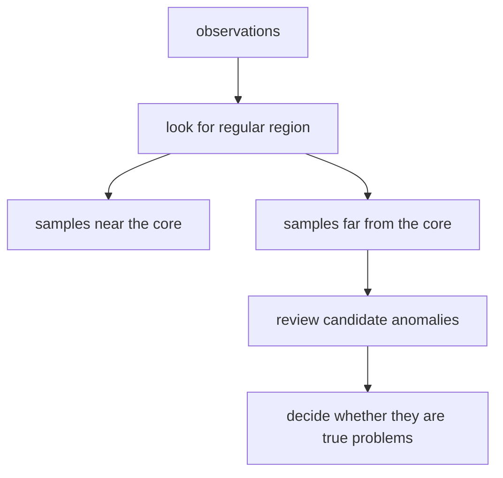

# 2026-07-11 P4-17 anomaly detection 보충학습 설계 메모

이 문서는 Part 4 보강 검토 결과에 따라, anomaly detection을 실제로 추가할 경우 어떤 위치와 질문 구조가 가장 적절한지 설계 수준으로 정리한 내부 메모다.

## 왜 지금 이 메모가 필요한가

Part 4 전체 커리큘럼 비교와 보강 우선순위 정리에서 현재 가장 유력한 실제 보강 후보는 `anomaly detection 보충학습 1개`로 좁혀졌다.

이미 다음 사실은 확인된 상태다.

- P4-2.2는 비지도학습 대표 문제로 `군집화`, `차원 축소`, `이상치 탐지`를 소개한다.
- P4-17은 clustering을 다시 회수하고, P4-18은 dimensionality reduction을 다시 회수한다.
- anomaly detection만은 후반부에서 독립적으로 다시 닫히는 자리가 없다.
- scikit-learn는 `Novelty and Outlier Detection`을 별도 범주로 두고, `outlier detection`과 `novelty detection`을 구분한다.
- DeepLearning.AI Machine Learning Specialization도 `Clustering`과 `Anomaly detection`을 같은 unsupervised learning 주차에서 독립 항목으로 배치한다.

따라서 이 메모의 목적은 `추가 여부 자체를 다시 논쟁`하기보다, 실제로 넣는다면 어디에 어떤 질문으로 넣는 것이 가장 자연스러운지 정리하는 데 있다.

## 권장 위치

가장 자연스러운 위치는 Chapter 17 안이다.

구체적으로는 다음 두 안이 있다.

1. `P4-17.2` 뒤에 새 보충학습 추가
2. `P4-17.4` 뒤에 새 보충학습 추가

현재 판단은 1안이 더 낫다.

### 1안을 우선하는 이유

- P4-17.1은 `군집이 무엇인가`를 잡는다.
- P4-17.2는 `군집 결과를 과신하지 않는 태도`를 잡는다.
- anomaly detection도 본질적으로 `정답 자동 확정이 아니라 점검 후보를 읽는 태도`가 중요하다.

즉, `구조 제안`과 `과신 방지`를 본 직후 anomaly detection을 붙이면, `cluster label`과 `anomaly flag`가 둘 다 `해석 전 단계의 신호`라는 공통점이 더 잘 읽힌다.

반면 P4-17.4 뒤에 두면 반지도학습 이야기까지 간 다음 다시 anomaly detection으로 돌아오게 되어 흐름이 조금 늦어진다.

## 권장 Section ID

현재 구조 기준으로는 다음 두 후보가 가능하다.

- `P4-17.3`을 anomaly detection으로 넣고, 기존 `P4-17.3`, `P4-17.4`를 뒤로 미는 안
- 기존 번호는 유지하고 `P4-17.5`로 새 보충학습을 추가하는 안

현재는 `P4-17.5`가 더 안전하다.

이유는 이미 번역, 릴리즈노트, 링크 체계가 Chapter 17 현재 번호를 기준으로 안정되어 있기 때문이다. 커리큘럼 보강만을 위해 기존 Section 번호를 밀어 버리는 편익이 크지 않다.

즉, 현재 설계 기준에서는 `P4-17.5 보충학습: anomaly detection을 처음 구분하는 법` 같은 형태가 가장 현실적이다.

## 권장 제목 후보

가장 적절한 제목 후보는 다음 두 개다.

1. `P4-17.5 보충학습: anomaly detection을 처음 구분하는 법`
2. `P4-17.5 보충학습: outlier detection과 novelty detection을 처음 읽는 법`

현재는 1안이 더 낫다.

이유는 Part 4의 다른 보충학습 제목들도 대체로 `무엇을 처음 구분하는가`, `무엇을 처음 읽는가` 형식을 따르고 있고, `anomaly detection`이 독자에게 가장 먼저 보이는 상위 이름이기 때문이다. 그 안에서 outlier detection과 novelty detection을 하위 구분으로 설명하면 된다.

## 이 절의 중심 질문

이 절은 다음 한 질문에 집중하는 편이 좋다.

`이상 탐지는 군집화와 무엇이 다르고, 왜 outlier detection과 novelty detection을 구분해야 하는가?`

이 질문이 좋은 이유는 다음과 같다.

- clustering과의 차이를 함께 닫아 현재 Chapter 17 구조 안에 자연스럽게 들어간다.
- scikit-learn가 강하게 구분하는 `outlier detection`과 `novelty detection`을 바로 연결할 수 있다.
- 초심자가 실제로 겪는 혼란인 `이상치 후보 = 나쁜 데이터인가`, `새로운 이상 = 군집 밖 점인가`를 함께 다룰 수 있다.

## 이 절의 권장 범위

다음 질문까지만 책임지는 편이 좋다.

- anomaly detection은 어떤 문제 장면에서 등장하는가?
- clustering과 anomaly detection은 무엇이 다른가?
- outlier detection과 novelty detection은 왜 다른가?
- `점검 후보`, `경계 밖 새 관측`, `확정 이상`을 왜 구분해야 하는가?
- 어떤 결과를 바로 정책/차단 규칙으로 쓰면 왜 위험한가?

반대로 다음은 현재 절 범위 밖에 두는 편이 낫다.

- Isolation Forest, LOF, One-Class SVM의 수식 유도
- ROC 기반 평가 절차의 상세 구현
- 산업별 fraud detection, intrusion detection, predictive maintenance를 길게 비교하는 확장 사례

즉, 현재 절은 `알고리즘 카탈로그`가 아니라 `문제 구분과 해석 경계`에 집중해야 한다.

## 권장 구조 초안

아래 정도 구조면 충분하다.

1. 도입: clustering 다음에 anomaly detection이 왜 나오는가
2. 이 절의 범위와 목표
3. anomaly detection은 무엇을 찾는가
4. clustering과 anomaly detection의 차이
5. outlier detection과 novelty detection의 차이
6. 점검 후보와 확정 이상을 구분해야 하는 이유
7. 짧은 사례
8. 작은 Mermaid 흐름도
9. 체크리스트

## 권장 비교 표

이 절의 핵심 표는 아래 방향이 좋다.

| 질문 | clustering | anomaly detection |
| --- | --- | --- |
| 먼저 찾는 것 | 비슷한 묶음 | 유난히 다른 점 |
| 대표 출력 | cluster label | anomaly score 또는 flag |
| 해석 위험 | 묶음을 정답 범주로 과신 | 이상 후보를 곧바로 오류/위험으로 확정 |
| 다음 단계 | 묶음 의미 검토 | 대표 이상 사례와 정상 경계 검토 |

그리고 scikit-learn 구분을 반영한 표는 다음 방향이 적절하다.

| 구분 | outlier detection | novelty detection |
| --- | --- | --- |
| 학습 데이터 상태 | 이미 이상치가 섞여 있을 수 있다 | 학습 데이터는 대체로 정상으로 본다 |
| 주된 질문 | 현재 데이터 안에서 튀는 점은 무엇인가 | 새로 들어온 점이 정상 분포 밖인가 |
| 읽는 감각 | 오염된 표에서 중심부를 찾는다 | 정상 경계를 배운 뒤 새 관측을 비교한다 |

## 권장 사례

가장 자연스러운 사례는 다음 둘 중 하나다.

1. 결제 로그에서 평소와 다른 거래를 점검 후보로 찾는 장면
2. 설비 센서에서 정상 동작 범위를 벗어나는 새 관측을 찾는 장면

현재 Part 4 전체 흐름상 1안이 더 좋다.

이유는 classification, threshold, calibration, tree, boosting 등 앞 절의 운영 판단 맥락과 더 직접적으로 이어지기 때문이다.

다만 novelty detection 설명에는 2안도 짧게 함께 쓰면 좋다. 정상 운전 데이터로 경계를 배운 뒤 새 센서 관측이 바깥으로 나가는 장면이 `새로운 이상`을 설명하기 쉽기 때문이다.

## 권장 Mermaid 흐름도

도식은 다음 정도가 적당하다.

핵심은 `이상 탐지 출력 = 최종 판정`이 아니라 `검토 시작 신호`라는 점을 시각적으로 못 박는 것이다.

## 기대 효과

이 절이 들어가면 다음 공백을 메울 수 있다.

- P4-2.2에서 이름만 본 anomaly detection이 후반부에서 다시 한 번 닫힌다.
- clustering과 anomaly detection을 같은 것으로 읽는 오해를 줄인다.
- outlier detection과 novelty detection의 차이를 초심자 기준에서 한 번은 직접 짚고 넘어갈 수 있다.
- Chapter 17 전체가 `구조 제안 -> 해석 브레이크 -> 다른 군집 직관 -> 반지도 연결`에 더해 `이상 후보 읽기`까지 포함하는 더 균형 잡힌 비지도 Module이 된다.

## 최종 권장안

현재 설계 기준에서 가장 권장하는 안은 다음과 같다.

- 새 Section ID: `P4-17.5`
- 제목: `보충학습: anomaly detection을 처음 구분하는 법`
- 위치: Chapter 17 맨 뒤에 두되, 실제 집필은 `P4-17.2`와의 연속성을 가장 강하게 유지한다
- 중심 질문: `이상 탐지는 군집화와 무엇이 다르고, 왜 outlier detection과 novelty detection을 구분해야 하는가?`

즉, 실제 집필 단계로 넘어간다면 지금 필요한 것은 `새 알고리즘을 더 많이 넣는 일`이 아니라, `비지도학습의 세 번째 대표 문제를 후반부에서 한 번 더 닫는 짧은 보충학습`을 설계하는 일이다.

## 실제 적용 시 최소 수정 파일 묶음

이 절을 실제로 추가한다면 최소한 다음 파일들이 함께 움직여야 한다.

1. 새 본문:
   - `docs/parts/part-04/chapter-17/section-05.md`
2. 독자용 목차:
   - `docs/book/table-of-contents.md`
3. 배포 nav:
   - `mkdocs.yml`
4. 릴리즈노트:
   - `management/release-notes/sections/part-04/P4-17.5.md`
5. 개요 연결 점검:
   - 필요 시 `docs/parts/part-04/chapter-02/section-02.md`
   - 필요 시 `docs/parts/part-04/chapter-17/section-02.md`

즉, 실제 패치는 `본문 1개 + 목차 2개 + 릴리즈노트 1개`를 기본 단위로 보면 된다.

## 집필 시 완료 기준

실제 `P4-17.5`를 쓴다면 완료 기준은 다음 정도가 적절하다.

- anomaly detection을 clustering과 구분하는 한 문장 정의가 있다.
- outlier detection과 novelty detection의 차이를 초심자 기준 표 하나로 닫는다.
- `점검 후보`와 `확정 이상`을 구분하는 사례가 있다.
- 결과를 바로 차단/정책 규칙으로 쓰면 왜 위험한지 명시한다.
- Chapter 17 흐름 안에서 `P4-17.2`와 `P4-17.4` 사이 의미 연결이 자연스럽다.
- Section ID, Version, 릴리즈노트가 함께 맞춰진다.

이 완료 기준을 만족하면, 이번 보강은 `새 알고리즘 이름 추가`가 아니라 `이미 Part 4 초반에 소개한 대표 문제를 후반에서 한 번 더 학습적으로 닫는 작업`으로 볼 수 있다.
