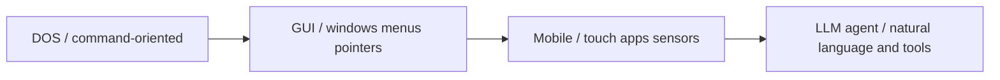

# 책 중심축 보관 메모

## 목적

- 이 문서는 다음 개별 노트를 통합 보관하기 위해 만든다.
  - `codex.md`
  - `heuristics-and-ai-thinking.md`
  - `gpt-3-5-evidence-notes.md`
  - `ai-intro-curriculum-survey.md`
  - `token-term-analysis.md`
  - `user-claim-evidence-map.md`
- 위 문서들은 단순 관리 로그가 아니라, 책에 담고 싶은 중심 해석 축, 작업 가설, 표준 설명 후보, 원고 반영 문장, 검증 보류 항목을 함께 담고 있었다.
- 따라서 지금 단계의 목표는 `짧은 분류표만 남기기`가 아니라, 삭제 전 문서가 갖고 있던 설명 밀도와 판단 근거를 하나의 보관 문서 안에 다시 살리는 것이다.

## 이 문서의 성격

- 이 문서는 가이드라인이 아니다.
- 이 문서는 배포 원고도 아니다.
- 이 문서는 `저자가 계속 붙들고 갈 중심축`을 보관하는 중간 문서다.
- 이후 본문에 회수할 때는 이 문서에서 문장을 직접 복사하기보다, 해당 Section의 중심 질문에 맞게 다시 줄이고 검증해 사용한다.

## 보관 원칙

- 개인적 직관과 해석은 `작업 가설`로 남긴다.
- 교과서, 논문, 공식 문서, 반복적으로 인용되는 교육 자료와 연결되는 설명은 `표준 설명 후보`로 남긴다.
- 아직 문장으로 단정하기 어렵거나 비유의 성격이 강한 내용은 `검증 보류`로 남긴다.
- 비유, 역사 해석, 기술 정의, 제품 경험, 커리큘럼 설계 논리를 서로 같은 층위로 섞지 않는다.

## 중심축 1. Codex와 책 제작 방식

### 왜 이 축을 보관하는가

이 책은 AI를 설명하는 책이면서 동시에 AI 도구를 사용해 만들어지는 프로젝트다. 따라서 Codex는 단순한 집필 보조 도구가 아니라, 책의 제작 방식 자체를 드러내는 대상이기도 하다. 독자에게는 `무엇을 설명하는 책인가`만큼 `어떻게 만들어졌는가`도 중요한 맥락이 된다.

### 기본 설명

- Codex는 OpenAI의 소프트웨어 개발용 코딩 에이전트다.
- 코드 작성, 기존 코드베이스 이해, 코드 리뷰, 디버깅, 반복 작업 자동화에 사용할 수 있다.
- 이 저장소에서는 원고 초안 작성, 구조 정리, MkDocs 설정 수정, 빌드 검증, 브랜치 작업 보조까지 포함한 협업 도구로 사용한다.

### 이 책에서 Codex가 하는 일

- 커리큘럼 기준 잡기
- 원고 초안 작성
- 목차와 파일 구조 정리
- Mermaid 다이어그램 작성
- MkDocs 설정 수정
- 빌드 검증
- GitHub 브랜치, 커밋, 푸시, Pages 배포 보조
- `AGENTS.md`를 통한 작업 규칙 유지

### 왜 이 축이 중요한가

이 책의 목적은 AI를 다시 배우는 것이다. 그래서 책을 만드는 과정 자체도 AI와 협업하는 방식으로 진행한다. 이 점은 독자에게 다음을 동시에 보여 줄 수 있다.

- AI 도구를 이용한 문서 제작
- AI가 만든 초안의 검증
- 사람의 작업 가설과 표준 설명의 비교
- 정적 웹 책 제작과 배포 자동화
- AI 시대의 개발 워크플로우

즉, 이 저장소는 AI를 설명하는 책이면서 동시에 AI 도구로 만들어지는 실험 기록이다.

### 작업 가설: CLI에서 GUI, 모바일, LLM 에이전트로

Codex를 단순한 개발 보조 도구가 아니라, 컴퓨터 사용 인터페이스가 바뀌는 흐름 속에서 등장한 에이전트형 도구로 볼 수 있다는 해석을 보관한다.



- CLI 환경에서는 사용자가 명령어를 정확히 알고 입력해야 했다.
- GUI 환경에서는 창, 아이콘, 메뉴, 포인터를 통해 기능을 시각적으로 조작할 수 있게 되었다.
- 모바일 환경에서는 터치, 앱, 센서, 항상 연결된 네트워크가 사용 경험의 중심이 되었다.
- Codex 같은 LLM 기반 에이전트는 자연어로 목표와 제약을 설명하고, 시스템이 파일 읽기, 명령 실행, 수정, 검증을 작업 단위로 번역하는 계층처럼 보인다.

이 해석을 다음 표로 요약할 수 있다.

| 시대적 인터페이스 | 사용자의 주요 행동 | 시스템의 역할 |
| --- | --- | --- |
| CLI | 명령어를 정확히 입력 | 명령 실행 |
| GUI | 화면 요소를 선택하고 조작 | 기능을 시각적으로 노출 |
| 모바일 | 터치와 앱 흐름을 따라 사용 | 개인화된 앱 경험 제공 |
| LLM 에이전트 | 목표, 맥락, 제약을 설명 | 작업을 계획하고 도구를 사용 |

### 주의할 점

- 이것은 역사적 사실의 단정이 아니라 해석 모델이다.
- LLM 에이전트가 기존 OS를 대체한다는 뜻은 아니다.
- 더 조심스러운 설명은 `OS, IDE, 브라우저, CLI 위에서 동작하며 사용자의 의도를 더 높은 수준의 작업 단위로 연결하는 인터페이스 계층`이다.

### 검증 질문

- LLM 에이전트는 OS의 대체재인가, 아니면 OS 위의 새로운 작업 인터페이스인가?
- 자연어 인터페이스는 CLI와 GUI의 어떤 문제를 해결하고, 어떤 새 문제를 만드는가?
- 에이전트가 도구를 사용할 때 사용자의 책임과 검증 범위는 어떻게 바뀌는가?
- Codex 같은 도구는 개발자의 사고 과정을 확장하는가, 아니면 자동화 가능한 작업만 대체하는가?

### AGENTS.md의 역할

- Codex는 작업 전 `AGENTS.md` 같은 지침 파일을 읽고 저장소 목적과 작업 규칙을 반영한다.
- 이 저장소의 `AGENTS.md`에는 책의 목적, 문서 구조, 출처 표기, 브랜치 운영, 검증 방식, 차트 원칙이 들어 있다.
- 따라서 `AGENTS.md`는 단순 안내문이 아니라, Codex가 이 프로젝트를 어떻게 이해해야 하는지 알려 주는 운영 기준이다.

### 안전과 승인

- Codex는 로컬 파일을 읽고 수정하며 명령을 실행할 수 있다.
- 따라서 sandbox, 승인 정책, 네트워크 접근 제한 같은 안전 장치가 필요하다.
- 이 저장소에서는 일반 원고 작업은 `dev`에서, 배포는 `main`에서만 수행한다.
- 외부 자료를 참고하면 출처를 남기고, 빌드와 배포 관련 작업은 결과를 확인한다.
- AI가 생성한 내용은 검증 전까지 확정된 사실로 취급하지 않는다.

### 한계

- 문맥을 잘못 이해할 수 있다.
- 최신 정보가 필요할 때 공식 문서 확인이 필요하다.
- 그럴듯하지만 틀린 설명을 만들 수 있다.
- 사용자의 개인적 해석과 표준 설명을 혼동할 수 있다.
- 코드나 문서 변경이 의도보다 넓어질 수 있다.

### 본문 회수 위치

- Part 1의 AI 도구와 현대 작업 환경 설명
- Codex 또는 에이전트 소개 절
- 책 서문 또는 제작 방식 설명

## 중심축 2. 휴리스틱, 불확실성, 초기 AI

### 왜 이 축을 보관하는가

휴리스틱을 단순한 실무 팁이나 요령으로 축소하지 않고, 초기 AI의 문제 해결 방식, 인간의 제한된 판단, 불확실한 세계를 다루는 소프트웨어적 기준이라는 축으로 설명하고 싶다. 이 관점은 AI 역사, 탐색, 데이터 모델링, 실무형 판단 기준을 잇는 다리 역할을 한다.

### 사용자 직관

사용자 직관은 다음과 같이 정리할 수 있다.

> 휴리스틱은 AI적 사고를 만들기 위한 인류의 첫 시도에 가깝지 않을까. 휴리스틱은 불확실성을 반영하고자 한 시도라고 볼 수 있지 않을까.

이 직관은 유용하지만 그대로 단정하면 과장될 수 있다. 더 안전한 표현은 다음과 같다.

> 휴리스틱은 초기 AI가 인간의 문제 해결을 모방하려 할 때 사용한 핵심 방법 중 하나였다. 완전한 탐색이나 최적화가 어려운 상황에서, 제한된 정보와 계산 자원으로 충분히 좋은 방향을 선택하게 하는 규칙으로 이해할 수 있다.

또는 다음처럼 일반화할 수 있다.

> 휴리스틱은 불확실성과 계산 한계를 소프트웨어의 선택 규칙으로 반영하려는 시도였다.

### 전달하고 싶은 핵심 일반화

> 인간은 오래전부터 불확실한 현상을 이해하고 다루려 했다. 주사위와 도박은 우연을 경험하고 계산하려는 출발점이었고, 확률은 그 우연을 수학으로 표현하려는 시도였다. 휴리스틱은 모든 경우를 계산할 수 없을 때 충분히 좋은 선택을 하려는 사고 방식이며, 초기 AI는 이 방식을 소프트웨어의 탐색 규칙으로 구현하려 했다. 현대 AI는 대규모 데이터에서 확률적 패턴을 학습하고 반복적으로 예측함으로써, 인간의 사고와 비슷해 보이는 언어와 판단 행동을 만들어낸다.

더 짧게는 다음 문장도 유지할 가치가 있다.

> AI의 한 흐름은 불확실한 세계를 확률과 경험 규칙으로 다루려는 인간의 시도가 소프트웨어와 학습 모델로 옮겨온 역사다.

### 이 일반화에 붙여야 할 제한

- 휴리스틱은 AI의 유일한 출발점이 아니다.
- 확률적 예측이 반복된다고 인간의 사고 자체가 생긴다고 단정하지 않는다.
- 관찰 가능한 것은 인간과 비슷해 보이는 출력, 판단, 문제 해결 행동이다.
- 그 유사성이 어디까지 표면적 행동이고 어디부터 추론 능력인지 별도 검증이 필요하다.

### 표준 설명 후보

- 휴리스틱은 최적해를 보장하는 공식이 아니라, 탐색과 판단을 유망한 방향으로 이끄는 경험적 규칙이다.
- 초기 AI에서는 문제 해결을 탐색으로 보고, 탐색 공간을 줄이기 위해 휴리스틱을 사용했다.
- Newell과 Simon의 작업은 인간 문제 해결을 컴퓨터로 모사하려는 시도와 연결된다.
- AIMA에서도 informed heuristic search, heuristic functions, learning heuristics from experience가 주요 항목으로 놓인다.
- Simon의 bounded rationality와 satisficing은 완전한 최적화 대신 제한된 정보와 계산 능력 안에서 충분히 만족스러운 해를 찾는 관점을 제공한다.
- Kahneman과 Tversky의 연구는 사람이 휴리스틱을 사용하지만, 그 결과가 편향으로 이어질 수 있음을 보여 준다.

### 여러 관점에서의 휴리스틱

| 관점 | 설명 |
| --- | --- |
| 계산 관점 | 가능한 모든 경우를 다 살펴볼 수 없을 때 탐색을 줄이는 규칙 |
| 소프트웨어 관점 | 불확실성과 계산 한계를 프로그램 안의 선택 규칙, 평가 함수, 우선순위로 옮기는 방식 |
| 인지 관점 | 인간이 제한된 정보와 시간 안에서 판단하는 방식 |
| 불확실성 관점 | 정답, 확률, 결과를 완전히 알 수 없을 때 방향을 정하는 임시 기준 |
| 실무 관점 | 데이터 전처리, 모델 선택, 튜닝에서 검증 가능한 출발점 |
| 위험 관점 | 빠른 판단을 돕지만 편향과 과신을 만들 수 있음 |

### 불확실성과의 관계

휴리스틱이 불확실성을 반영한다는 표현은 부분적으로 맞다. 다만 확률 모델처럼 불확실성을 명시적으로 계산하는 방식과는 구분해야 한다.

| 구분 | 설명 |
| --- | --- |
| 휴리스틱 | 불확실하거나 너무 큰 문제에서 방향을 정하는 경험적 규칙 |
| 확률 모델 | 불확실성을 확률 분포나 조건부 확률로 명시하는 모델 |
| 최적화 | 명확한 목적 함수를 두고 더 좋은 해를 찾는 과정 |
| 학습 | 데이터에서 규칙이나 표현을 조정하는 과정 |

따라서 휴리스틱은 불확실성을 수학적으로 표현하는 방법이 아니라, 불확실성과 계산 한계가 있는 상황에서 판단을 가능하게 하는 실용적 장치로 설명하는 것이 더 안전하다.

소프트웨어 관점에서는 휴리스틱을 다음과 같은 구현으로 생각할 수 있다.

- `if-then` 규칙
- 점수 함수
- 우선순위 큐
- 탐색 중단 조건
- 모델 선택 기준

### 주사위, 확률, 휴리스틱, AI 시스템의 층위

주사위 게임이나 도박도 넓게 보면 불확실성을 다루려는 오래된 인간의 시도다. 하지만 휴리스틱과 같은 층위는 아니다.

| 층위(level) | 질문 | 대표 형태 |
| --- | --- | --- |
| 놀이와 도박 | 결과를 알 수 없는 상황에서 어떻게 행동하는가 | 주사위, 카드, 내기 |
| 확률 | 가능한 결과가 얼마나 그럴듯한가 | 경우의 수, 기대값, 확률 분포 |
| 휴리스틱 | 모든 계산이 불가능할 때 어떤 선택을 먼저 할 것인가 | 경험 규칙, 평가 함수, 탐색 우선순위 |
| AI 시스템 | 불확실성과 계산 한계를 어떻게 프로그램으로 다룰 것인가 | 탐색 알고리즘, 확률 모델, 학습 모델 |

이 흐름을 다음처럼 설명할 수 있다.


### 책에서의 배치

1. Part 1에서는 AI 역사와 문제 해결의 관점에서 다룬다.
2. Part 3에서는 모델링과 실무의 경험 규칙으로 다룬다.
3. 프로젝트 파트에서는 휴리스틱을 사용하되, 반드시 검증 데이터와 평가 지표로 확인한다.

### 피해야 할 표현

| 피할 표현 | 이유 | 대체 표현 |
| --- | --- | --- |
| 휴리스틱은 AI의 첫 시도다 | 여러 초기 흐름이 함께 존재함 | 휴리스틱은 초기 AI의 핵심 문제 해결 방식 중 하나다 |
| 휴리스틱은 불확실성을 계산한다 | 확률 모델과 혼동됨 | 휴리스틱은 불확실한 상황에서 판단 방향을 잡는 규칙이다 |
| 휴리스틱은 좋은 실무 팁이다 | 역사적 의미가 사라짐 | 휴리스틱은 탐색, 판단, 모델링의 경험적 기준이다 |
| 휴리스틱은 정답이다 | 실패 가능성을 숨김 | 휴리스틱은 검증해야 할 출발점이다 |
| 확률이 반복되면 인간 사고가 된다 | 행동 유사성과 사고 동일성을 혼동함 | 확률적 예측의 반복이 인간과 비슷해 보이는 출력을 만들 수 있다 |

### 본문 회수 위치

- Part 1의 AI 역사와 패러다임 변화
- 탐색, 문제 해결, 초기 AI 절
- 데이터 모델링과 모델 선택에서의 경험 규칙 설명

## 중심축 3. 딥러닝, 직관, 소프트웨어 작성 방식의 변화

### 왜 이 축을 보관하는가

사용자가 가지고 있는 핵심 직관 중 하나는 `AI는 기존 소프트웨어의 함수 또는 요청 처리 방식을 다른 방식으로 구성한 것 같다`는 관점과, `딥러닝은 직관적 추론의 방식을 컴퓨팅으로 해석한 것 아닐까`라는 관점이다. 이 둘은 책의 중심 비유로 강하지만, 그대로 쓰면 과장이 되기 쉽다. 따라서 외부 근거와 연결해 더 안전한 일반화 문구로 다듬는 작업이 필요하다.

### 사용자 관점

- AI는 기존 소프트웨어의 함수 또는 요청 처리 방식을 다른 방식으로 구성한 것처럼 볼 수 있다.
- 사람이 직접 규칙을 작성하던 방식에서 데이터와 모델이 판단 기준을 맡는 방향으로 이동했다.
- AI 시스템은 사람이 수행하는 워크플로우와 유사하게, 요청을 받고 여러 단계를 거쳐 응답이나 행동을 만든다.
- 딥러닝은 직관적 추론의 방식을 컴퓨팅으로 해석한 것일 수 있다.

### 근거 후보와 판단

| 사용자 관점 | 유사 근거 | 학술적 일반화 | 반영 판단 |
| --- | --- | --- | --- |
| 소프트웨어 작성 방식이 바뀌었다 | Karpathy의 `Software 2.0` | 중간 | 표준 정의가 아니라 소프트웨어 관점의 비유로 제한 |
| 데이터와 목표로 프로그램을 만든다 | `Software 2.0`의 데이터·가중치 관점 | 중간 | 보조 근거로 사용 |
| 딥러닝은 직관적 인식·판단을 계산으로 옮긴다 | SEP `Connectionism` | 높음 | `직관적 추론`을 `패턴 판단`으로 보정하는 핵심 근거 |
| 딥러닝은 표현을 학습한다 | LeCun, Bengio, Hinton Nature review | 높음 | 딥러닝 정의의 핵심 근거 |
| AI 발전은 계산 활용으로 이동했다 | Sutton `The Bitter Lesson` | 중간 | 역사 해석의 보조 관점으로 사용 |
| AI 서비스는 워크플로우다 | MLOps 논문 | 중간-높음 | 운영 관점의 보조 근거로 사용 |
| reasoning은 별도 분리가 필요하다 | Neurosymbolic AI 논문 | 중간-높음 | `inference`와 `reasoning` 구분의 핵심 근거 |

### 1. Software 2.0에서 가져올 수 있는 것

Karpathy의 `Software 2.0`은 사용자의 관점과 매우 가깝다.

- 전통적 소프트웨어는 사람이 명시적 명령을 코드로 작성한다.
- 신경망 기반 소프트웨어는 사람이 직접 가중치를 쓰는 대신, 데이터와 목표를 주고 학습으로 가중치를 찾는다.
- 훈련 데이터와 신경망 구조가 일종의 소스 역할을 하고, 학습 과정이 이를 실행 가능한 모델로 바꾼다.
- 복잡한 문제에서는 명시적 프로그램보다 원하는 행동을 데이터로 정의하는 편이 쉬울 수 있다.

여기서 본문에 안전하게 반영할 문장은 다음과 같다.

> 딥러닝 기반 모델은 사람이 모든 분기와 규칙을 코드로 쓰는 대신, 데이터와 목표를 통해 학습된 가중치가 입력을 처리하도록 만든다는 점에서 소프트웨어 작성 방식의 변화로 볼 수 있다.

주의:

- `Software 2.0`은 영향력 있는 비유이지만 표준 학술 정의는 아니다.
- 모든 AI를 `Software 2.0`으로 부르면 규칙 기반 AI, 탐색, 지식 표현, 확률 추론이 가려진다.

### 2. 연결주의와 인지 처리

Stanford Encyclopedia of Philosophy의 `Connectionism`은 연결주의를 인공신경망으로 지적 능력을 설명하려는 인지과학 운동으로 본다. 이 근거는 사용자의 `직관적 추론` 관점을 더 안전하게 바꾸는 데 유용하다.

권장 보정 문장:

> 딥러닝은 인간의 직관적 사고 전체를 구현한 것이 아니라, 명시 규칙으로 쓰기 어려운 인식, 분류, 유사성 판단, 패턴 처리를 다층 신경망의 표현 학습과 가중치 조정으로 계산 가능하게 만든 접근으로 볼 수 있다.

주의:

- 연결주의는 인간 인지를 설명하려는 계보와 관련 있지만, 현대 딥러닝이 인간 직관 그 자체라는 뜻은 아니다.
- `reasoning`은 논리적 추론을 뜻할 수 있으므로, 이 문맥에서는 `직관적 인식`, `패턴 판단`, `인지 처리`가 더 안전하다.

### 3. 표현 학습과 다층 추상화

LeCun, Bengio, Hinton의 Nature review는 딥러닝을 `여러 추상 수준의 표현을 학습하는 다층 계산 모델`로 설명한다.

반영 후보 문장:

> 딥러닝의 핵심은 사람이 특징을 모두 설계하는 대신, 여러 층의 계산을 통해 데이터에서 더 추상적인 표현을 학습하게 만드는 것이다.

추가 보정:

> 이 때문에 딥러닝은 사람이 직관적으로 처리하는 것처럼 보이는 이미지, 음성, 언어의 패턴 판단을 계산 가능한 표현 학습 문제로 옮긴 접근이라고 설명할 수 있다.

### 4. The Bitter Lesson의 위치

Sutton의 글은 AI 발전이 사람이 넣은 도메인 지식보다 계산을 활용하는 일반 방법에서 나왔다는 강한 역사 해석을 제공한다. 이 관점은 유용하지만 표준 정의처럼 쓰면 안 된다.

반영 후보 문장:

> AI의 발전은 사람이 지식을 직접 넣는 방식만으로는 한계가 있었고, 대규모 계산을 활용하는 탐색과 학습 방법이 여러 분야에서 더 강한 성과를 내는 방향으로 이동했다.

### 5. MLOps와 워크플로우

운영 관점에서 AI 서비스는 모델 하나가 아니라 데이터 준비, 학습, 평가, 배포, 모니터링, 피드백으로 구성된 워크플로우다. 이는 `AI 서비스는 사람이 수행하던 워크플로우와 유사하게 여러 단계를 거친다`는 사용자의 관점을 기술적으로 안전한 방향으로 바꿔 준다.

### 6. Perception과 cognition의 분리

Neurosymbolic AI 문헌은 인간의 perception과 cognition을 구분하며, 신경망 기반 machine perception과 지식 기반 reasoning을 나눠 설명한다. 이 구분은 `딥러닝은 직관적 추론을 계산으로 옮긴다`는 문장을 더 안전하게 나누는 데 필수적이다.

반영 후보 문장:

> 딥러닝은 인간의 사고 전체를 구현했다기보다, 사람이 직관적으로 처리하는 것처럼 보이는 감각적 인식, 분류, 유사성 판단, 언어 패턴 처리를 대규모 데이터 기반 패턴 인식과 표현 학습으로 계산 가능하게 만든 접근에 가깝다.

추가로 추론까지 언급해야 한다면:

> 딥러닝 모델의 inference는 학습된 표현과 가중치를 사용해 입력에 대한 출력을 계산하는 과정이며, 이 결과가 사람의 직관적 판단처럼 보일 수 있다. 그러나 명시적 근거를 따라가는 reasoning, 장기 계획, 규칙 검증은 별도의 상징적 표현, 검색, 도구, 검증 절차와 결합해 설명하는 편이 안전하다.

### 현재 가장 안전한 일반화 문구

> 딥러닝은 인간의 직관적 사고를 그대로 복제한 기술이라기보다, 사람이 명시적 규칙으로 쓰기 어려운 인식·분류·유사성 판단·언어 패턴 처리를 다층 신경망의 표현 학습과 가중치 최적화로 계산 가능하게 만든 접근으로 볼 수 있다.

소프트웨어 관점 문장:

> 전통적인 소프트웨어가 사람이 작성한 규칙과 함수로 입력을 처리했다면, 딥러닝 기반 AI는 데이터와 목표를 통해 학습된 가중치 함수가 입력을 처리하도록 만든다. 이 점에서 딥러닝은 소프트웨어 작성 방식의 일부를 데이터 기반 최적화 문제로 바꾼 접근이라고 볼 수 있다.

워크플로우 관점 문장:

> 현대 AI 서비스는 학습된 모델만이 아니라 입력 정리, 검색, 도구 호출, 규칙 검증, 모델 inference, 사람의 검토가 결합된 워크플로우로 구성된다.

### 피해야 할 문구

| 피해야 할 문구 | 이유 | 대체 문구 |
| --- | --- | --- |
| 딥러닝은 인간의 직관을 구현한 것이다 | 구현 범위가 너무 넓음 | 딥러닝은 직관처럼 보이는 패턴 판단을 계산 가능한 학습 문제로 옮긴 접근이다 |
| 딥러닝은 추론을 컴퓨팅으로 만든 것이다 | `추론`이 inference와 reasoning으로 갈라짐 | 딥러닝의 inference는 학습된 모델을 실행하는 과정이며, reasoning과 구분한다 |
| LLM은 사람처럼 생각한다 | 과도한 의인화 | LLM은 학습된 언어 패턴과 문맥을 바탕으로 출력을 생성한다 |
| 신경망은 뇌와 같다 | 과도한 동일시 | 신경망은 뇌에서 영감을 받은 단위와 가중치 구조를 사용한다 |
| 규칙 기반 AI는 사라졌다 | 실제 시스템 현실과 다름 | 현대 시스템은 규칙, 검색, 학습 모델, 검증 절차를 조합한다 |

### 검증 보류

- `Software 2.0` 원문은 별도 확보 문제가 있었으므로, 본문 근거로 쓸 때는 접근성 문제를 다시 확인해야 한다.
- `직관적 추론`은 그대로 두지 않고 `직관적 패턴 판단`, `machine perception`, `representation learning`, `model inference`로 분해한다.
- 인간의 직관과 딥러닝을 연결할 때는 비유와 기술 정의를 분리한다.

### 본문 회수 위치

- Part 1의 패러다임 변화 설명
- Part 4 딥러닝 도입부
- Part 6의 LLM, 에이전트, 워크플로우 설명

## 중심축 4. GPT-3.5, ChatGPT, 대화형 LLM의 전환

### 왜 이 축을 보관하는가

GPT-3.5는 사용자 경험 차원에서 매우 큰 전환점인데, GPT-3처럼 단일 공개 논문으로 설명하기 어려운 계열이다. 따라서 이 부분은 아키텍처 중심 설명이 아니라, instruction following, RLHF, dialogue format, API 제품화가 결합된 흐름으로 보관해 두어야 한다.

### 1차 판단

GPT-3.5는 GPT-3처럼 하나의 공개 기술 논문으로 설명하기 어렵다. 공개적으로 확인 가능한 흐름은 다음 조합으로 읽는 편이 더 안전하다.

```text
GPT-3
-> InstructGPT: instruction following and RLHF
-> GPT-3.5 series: text-davinci-002, text-davinci-003, gpt-3.5-turbo
-> ChatGPT: dialogue fine-tuning as product experience
-> GPT-3.5 Turbo API: chat/message format and low-cost API spread
```

따라서 GPT-3.5의 의미는 `새로운 아키텍처의 공개`라기보다 다음 변화로 본다.

- instruction following의 전면화
- RLHF가 사용자 의도 정렬의 핵심 방법으로 부각
- ChatGPT를 통한 대화형 맥락 처리 경험의 대중화
- `gpt-3.5-turbo` API를 통한 서비스형 LLM 확산

### 공식 자료에서 가져갈 핵심

#### Aligning language models to follow instructions

- 모델을 크게 만드는 것만으로 사용자 의도를 잘 따르는 것은 아니라고 설명한다.
- GPT-3를 human feedback으로 fine-tuning해 InstructGPT를 만들었다.
- 작은 InstructGPT가 더 큰 GPT-3보다 선호되는 결과가 보고되었다.
- truthfulness와 toxic output 감소를 말하지만, 한계도 인정한다.

이 자료로부터 본문에 남길 핵심은 다음이다.

> GPT-3.5로 이어지는 중요한 전환은 `더 큰 모델`보다 `사용자 지시를 따르도록 정렬된 모델`이라는 방향이다.

#### Introducing ChatGPT

- ChatGPT는 GPT-3.5 series 모델에서 fine-tuning된 대화형 모델로 설명된다.
- dialogue format은 follow-up question, mistake admission, incorrect premise challenge, inappropriate request rejection을 가능하게 한다고 한다.
- RLHF를 사용하며 InstructGPT와 유사한 방향이지만 대화 데이터 구성이 다르다.

이 자료로부터 본문에 남길 핵심은 다음이다.

> 사용자가 기억하는 `문맥을 이어 가는 느낌`은 모델 구조 하나의 변화라기보다 dialogue format, RLHF, 제품 인터페이스가 결합된 경험으로 설명하는 편이 안전하다.

#### Introducing APIs for GPT-3.5 Turbo and Whisper

- `gpt-3.5-turbo`는 ChatGPT 제품에 쓰인 모델과 같은 모델로 소개된다.
- 기존 GPT-3.5 모델보다 저렴하고, many non-chat use cases에도 적합하다고 설명된다.
- 기존 GPT 계열은 비정형 텍스트 입력 중심이었지만, ChatGPT 계열은 metadata를 포함한 message sequence 입력 형식을 갖는다.
- stable alias와 snapshot 개념이 등장한다.

이 자료로부터 남길 핵심은 다음이다.

> GPT-3.5 Turbo의 전환점은 모델 성능만이 아니라, chat/message API 형식, 비용 절감, 개발자 확산, snapshot과 drift 문제까지 포함한다.

### 학술 자료에서 가져갈 핵심

- Ouyang et al.: InstructGPT, RLHF, smaller aligned model preference
- Ye et al.: GPT-3와 GPT-3.5 계열 비교, RLHF가 모든 과업에서 선형 향상을 보장하지 않음
- Chen et al.: 서비스형 모델의 행동이 시간에 따라 바뀔 수 있음
- Chalkidis: 자연스러운 대화와 전문 과업 안정성은 구분해야 함
- Kabir et al.: 기술 질의응답에는 강점이 있으나 프로젝트 맥락 유지보수에는 한계가 큼

### 본문에 남길 안전한 문장 후보

> GPT-3.5는 GPT-3처럼 하나의 공개 논문으로 설명되는 단일 전환이라기보다, InstructGPT의 instruction following, RLHF, ChatGPT의 dialogue format, 그리고 `gpt-3.5-turbo` API 확산이 결합된 흐름으로 보는 편이 안전하다.

> GPT-3.5/ChatGPT가 바꾼 것은 Transformer 구조 자체라기보다, 사용자가 LLM을 대화형 작업 도구로 인식하게 만든 사용 경험이었다.

> 다만 GPT-3.5 계열의 성능은 과업마다 다르게 나타났고, 외부 평가 논문들은 버전 상승이나 RLHF가 모든 과업에서 선형적 성능 향상을 보장하지 않는다고 보고한다.

### 피해야 할 표현

```text
GPT-3.5에서 AI가 문맥을 이해하기 시작했다.
GPT-3.5는 GPT-3보다 모든 면에서 더 우수하다.
GPT-3.5 Turbo는 GPT-3.5의 학술적으로 공개된 최종 형태다.
```

권장 요약 문장:

> GPT-3.5/ChatGPT는 instruction following, RLHF, dialogue format, API 제품화가 결합되면서 사용자가 LLM을 대화형 작업 도구로 경험하게 만든 전환점이었다.

### 본문 회수 위치

- Part 6의 LLM 역사 또는 제품화 전환 설명
- ChatGPT와 API 사용 경험의 차이
- 서비스형 모델 업데이트와 drift 경고

## 중심축 5. 토큰, 표식, 표현 학습의 접점

### 왜 이 축을 보관하는가

`토큰(token)`은 LLM 설명에서 너무 빨리 등장하기 쉬운 용어다. 한국어로는 `단어 조각`, `처리 단위`, `기호`, `표식`이 섞여 이해될 수 있다. 또 symbolic AI의 symbol과 느슨하게 이어지는 교육용 접점도 있어서, 이 부분을 정교하게 다듬어 보관해 둘 필요가 있다.

### 설명을 나눌 층위

- 일반 영어와 어원에서의 token
- 컴퓨터 과학과 NLP에서의 tokenization
- LLM에서의 token, token ID, embedding, next-token prediction
- symbolic AI의 symbol과 LLM token의 관계

### 어원과 일반 의미

어원 관점에서 token은 `그 자체가 전체 의미인 것`이라기보다, 어떤 것을 알아보게 하거나 가리키는 표식, 증거에 가까운 말로 설명할 수 있다.

이 관점은 LLM 설명에 유용하다.

> LLM의 token도 사람이 읽는 자연스러운 단어와 동일한 것이 아니라, 모델이 입력과 출력을 처리하기 위해 사용하는 표식 단위다.

### symbolic AI의 symbol과 이어지는가

답은 `느슨하게 이어지지만, 같은 것은 아니다`이다.

| 구분 | symbolic AI의 symbol | LLM의 token |
| --- | --- | --- |
| 기본 역할 | 사람이 정의한 개념, 관계, 사실, 규칙을 명시적으로 나타냄 | 텍스트를 모델 vocabulary의 처리 단위로 나눔 |
| 의미 부여 | 사람이 정한 의미와 규칙에 강하게 연결됨 | 학습 데이터와 tokenizer vocabulary에 의해 정해진 이산 단위 |
| 처리 방식 | 규칙, 논리, 탐색, 지식 표현 위에서 조작됨 | token ID, embedding, attention, 확률 분포 계산으로 처리됨 |
| 해석 가능성 | 비교적 사람이 읽고 추적하기 쉬움 | token 자체보다 embedding과 모델 내부 상태에 의미가 분산됨 |
| 예시 | `환자`, `증상`, `규칙 A` | `hello`, `ing`, 공백 포함 조각, 구두점, byte-level token |

가장 안전한 정리 문장:

> LLM의 token은 넓은 의미에서 컴퓨터가 다루는 표식이라는 점에서 symbol과 이어진다. 그러나 symbolic AI의 symbol처럼 사람이 정의한 의미와 규칙을 직접 조작하는 단위는 아니다. LLM에서 token은 텍스트를 숫자열로 바꾸는 이산 입력 단위이고, 의미는 token 하나에 고정되어 있다기보다 embedding과 모델의 학습된 파라미터 안에 분산되어 있다.

이 연결을 교육용으로 간단히 그리면 다음과 같다.

```text
symbolic AI:
explicit symbol + explicit rule -> reasoning

LLM:
token ID + embedding + learned parameters -> next-token distribution
```

### 앞선 개념과 이어지는 지도

```text
symbol
-> label
-> feature
-> representation
-> token
-> token ID
-> embedding
-> next-token probability
```

이 순서는 역사적 계보가 아니라 교육용 연결 지도다.

| 앞선 개념 | 연결되는 질문 | LLM에서 이어지는 표현 |
| --- | --- | --- |
| symbol | 무엇을 컴퓨터가 구분할 수 있는 표식으로 만들 것인가 | token |
| label | 사람이 붙인 구분 기준은 학습에서 어떤 역할을 하는가 | target, expected output |
| feature | 원래 입력에서 모델이 사용할 값은 무엇인가 | token ID, input IDs |
| representation | 원래 데이터를 계산 가능한 형태로 어떻게 바꾸는가 | embedding, hidden representation |
| parameter | 학습으로 조정된 내부 값은 무엇을 바꾸는가 | weight, bias, attention parameters |
| probability | 불확실한 후보를 어떻게 점수화하는가 | next-token probability distribution |

### 왜 단어가 아니라 토큰인가

| 단위 | 장점 | 한계 |
| --- | --- | --- |
| 단어(word) | 사람이 이해하기 쉽다 | 모든 변형과 신조어를 vocabulary에 넣기 어렵다 |
| 문자(character) | 모든 문자열을 표현할 수 있다 | sequence가 길어지고 의미 정보가 약하다 |
| 토큰(token) | 단어와 문자 사이 절충이 가능하다 | 사람이 보는 단어 경계와 다를 수 있다 |

Hugging Face 문서와 `tiktoken` 계열 설명을 바탕으로 다음을 유지한다.

- 일반 단어는 하나의 token으로 남을 수 있다.
- 드문 단어는 subword로 나뉠 수 있다.
- token은 단어, 부분 단어, 문자, 바이트, 특수 기호가 될 수 있다.

### LLM에서 token이 하는 역할

```text
text
-> tokenization
-> token ID
-> embedding vector
-> Transformer computation
-> next-token probability distribution
-> selected token
-> decoded text
```

| 역할 | 설명 |
| --- | --- |
| 입력 단위 | 문자열을 모델 vocabulary 단위로 나눈다 |
| 숫자 ID | 각 token을 정수 ID로 바꾼다 |
| 임베딩의 키 | token ID는 embedding table의 인덱스 역할을 한다 |
| 예측 대상 | LLM은 다음 token 후보 확률 분포를 계산한다 |
| 비용과 한계 단위 | API와 context length는 token 수 기준으로 관리되는 경우가 많다 |

### 본문에 남길 안전한 설명 문구

> 토큰(token)은 사람이 읽는 단어와 항상 같지 않다. 원래 token은 표식이나 증거를 뜻하는 말에 가깝고, LLM에서는 텍스트를 모델이 처리할 수 있도록 나눈 기본 단위를 가리킨다. 토큰은 다시 숫자 ID로 바뀌고, 모델은 이 ID의 임베딩을 사용해 다음 토큰의 확률 분포를 계산한다.

더 짧은 문장:

> LLM에서 token은 `단어`라기보다, 텍스트를 계산 가능한 숫자열로 바꾸기 위한 표식 단위다.

### 피해야 할 설명

| 피할 표현 | 문제 | 대체 표현 |
| --- | --- | --- |
| token은 단어다 | subword, punctuation, whitespace, byte-level token 설명이 안 됨 | token은 모델 vocabulary의 처리 단위다 |
| token은 의미 단위다 | BPE token은 항상 의미 단위가 아님 | 일부 token은 의미 있는 subword에 가깝지만 항상 의미 단위는 아니다 |
| token은 글자 조각이다 | 단어 전체가 하나의 token일 수 있음 | token은 단어, 부분 단어, 문자, byte, 특수 기호가 될 수 있다 |
| LLM은 단어를 예측한다 | 실제로는 token ID 분포를 예측함 | LLM은 다음 token의 확률 분포를 계산한다 |
| LLM token은 symbolic AI의 symbol과 같다 | 처리 방식과 의미 부여가 다름 | token은 symbol과 이어지는 이산 표식이지만, LLM에서는 embedding과 확률 예측의 계산 단위다 |

### 본문 회수 위치

- Part 6의 토큰화와 임베딩 설명
- symbolic AI와 neural AI 비교
- next-token prediction 도입부

## 중심축 6. AI 개론과 데이터 모델링 커리큘럼 축

### 왜 이 축을 보관하는가

이 책의 Part 1과 데이터 모델링 Part는 외부 커리큘럼을 참고하되 그대로 복사할 수 없다. 따라서 반복적으로 등장하는 주제를 정규화하고, 현재 책의 학습 순서를 검증하는 용도로 커리큘럼 조사 메모를 보관해야 한다.

### AI 개론 목차 조사

#### 조사 목적

- AI 개론에서 먼저 다룰 주제를 근거 기반으로 고른다.
- 깊은 수학과 구현은 뒤 파트로 미루고, 역사와 패러다임 변화의 지도를 먼저 세운다.
- 개인적 작업 가설과 표준 커리큘럼에서 반복되는 설명을 구분한다.

#### 조사 표본

- AIMA
- Poole & Mackworth 공개 교재
- Harvard CS50 AI
- Berkeley CS188
- MIT 6.034

#### 정규화 주제

- AI 개론, 역사, 에이전트
- 탐색과 문제 해결
- 지식 표현, 논리, 규칙 기반 AI
- 제약과 최적화
- 게임과 적대적 탐색
- 불확실성과 확률 추론
- 계획과 의사결정
- 머신러닝
- 신경망과 딥러닝
- 강화학습
- 언어, NLP, LLM
- 지각, 비전, 로봇, 행동
- 윤리, 사회적 영향, 미래

#### 1차 해석

- AI 개론, 탐색, 불확실성, 머신러닝은 거의 공통적으로 등장한다.
- 지식 표현, 규칙 기반 AI, 제약, 게임, 계획도 강한 축이다.
- 신경망과 딥러닝은 개론에서 위치만 잡고 뒤 파트로 넘기는 편이 자연스럽다.
- LLM, RAG, Agent는 중요하지만 개론 앞부분에서 결론처럼 놓기보다 후반에 연결하는 편이 안정적이다.

#### 책에 주는 의미

AI 개론의 첫 흐름은 최신 LLM 기능 소개보다 다음 순서가 더 안정적이다.

1. AI란 무엇인가
2. AI의 역사와 패러다임 변화
3. 탐색과 문제 해결
4. 지식 표현과 규칙 기반 AI
5. 불확실성과 확률적 사고
6. 데이터와 학습
7. 신경망과 딥러닝의 위치
8. 생성형 AI와 LLM의 위치
9. 사회적 영향과 미래

이 조사로부터 남기는 결정:

- Part 1은 최신 기능 목록이 아니라 역사와 패러다임 변화의 지도로 시작한다.
- `CLI -> GUI -> LLM 에이전트`는 커리큘럼 통계가 아니라 별도 작업 가설로 분리한다.
- 개인 해석은 개론에서 바로 중심 정의로 올리지 않는다.

### 데이터 모델링 커리큘럼 조사

#### 조사 목적

- 현재 책의 데이터 모델링 Part가 개인 사례 정리가 아니라, 실제 데이터과학 교육에서 반복되는 축과 어떻게 맞물리는지 확인한다.
- 외부 커리큘럼 이름을 그대로 베끼지 않고, 책이 필요한 질문으로 다시 정규화한다.

#### 현재 책 기준의 정규화 주제

| 정규화 주제 | 외부 커리큘럼에서 주로 보이는 이름 |
| --- | --- |
| 샘플 단위 정의 | row meaning, sample, measurement, data representation |
| 원시 로그와 요약 표 | data wrangling, cleaning, aggregation, summary statistics |
| 특징과 중간 표현 | feature engineering, transformations, representation |
| 최근 구간과 기준선 비교 | baseline, comparison, model selection, statistical inference |
| 표본 수와 해석 경계 | sampling, bias and variance, inference, uncertainty |
| 모델링 사다리 | regression, classification, clustering, machine learning |

#### 조사 표본

- Berkeley Data 100
- Berkeley 데이터과학 커리큘럼 해설
- PCMI 데이터과학 학부 커리큘럼 가이드
- ASA GAISE College Report 관련 업데이트 문서

#### 자료별 핵심 관찰

- Berkeley Data 100은 `wrangling -> EDA -> modeling -> feature engineering -> validation` 흐름을 강하게 보여 준다.
- Berkeley 커리큘럼 해설은 계산적 사고와 추론적 사고를 함께 묶는 구조를 강조한다.
- PCMI 가이드는 데이터과학을 여러 기초를 묶는 전공 설계 문제로 본다.
- GAISE 관련 문서는 실데이터, 해석, 표본과 불확실성 교육을 강조한다.

#### 책 설계에 주는 의미

1. `샘플 단위`는 일반 커리큘럼보다 더 앞에 세워야 한다.
2. `원시 로그 -> 요약 표 -> 특징` 흐름은 교육적으로 방어 가능하다.
3. `기준선 비교`는 평가 부록이 아니라 데이터 모델링의 핵심으로 승격할 가치가 있다.
4. `표본 수, 반복성, false alarm`은 통계 축과 더 직접 연결해야 한다.
5. `모델링 사다리`는 뒤 Part 예고가 아니라 현재 Part의 마무리 질문으로 쓰는 편이 좋다.

#### 잠정 결론

표준 커리큘럼을 그대로 따르면 데이터 정리, 특징 공학, 검증, 추론은 들어오지만, 현재 책이 중요하게 보는 다음 축은 희미해질 수 있다.

- 샘플 단위
- 원시 시계열과 동작 1회 요약 행의 구분
- 기준선 비교를 데이터 표현 문제로 먼저 다루는 방식

따라서 현재 책은 표준 커리큘럼을 거스르기보다, 흩어진 주제를 `자동으로 실행되는 동작 1회와 그 원천 시계열`이라는 사례 축으로 더 앞당겨 재구성하는 편이 맞다.

### 본문 회수 위치

- Part 1의 전체 지도
- Part 3 데이터 모델링 구조
- Part 6 이전까지의 선행 지식 설계 이유

### 검증 보류

- 외부 목차를 그대로 옮기지 않는다.
- 표본이 작고 질적 해석 비중이 큰 조사라는 한계를 함께 남긴다.

## 중심축 간 연결

이 문서의 여섯 축은 따로 떨어진 메모가 아니라 다음 흐름으로 읽는다.

1. AI 개론 커리큘럼 축이 책의 전체 순서를 정한다.
2. 휴리스틱과 불확실성 축이 초기 AI와 확률적 사고의 연결을 만든다.
3. 딥러닝과 소프트웨어 변화 축이 규칙 기반 설명에서 학습 기반 설명으로 넘어가는 다리를 만든다.
4. token 축이 symbolic AI와 LLM 설명 사이의 교육용 접점을 만든다.
5. GPT-3.5 축이 현대 대화형 LLM 경험의 전환점을 정리한다.
6. Codex 축이 이 책이 AI 도구와 함께 만들어지는 제작 방식 자체를 설명한다.

## 이후 정리 원칙

- 이 문서는 당분간 유지한다.
- 새 원고에 반영할 때는 이 문서에서 바로 복사하지 않는다.
- 개인 해석이 강한 항목은 반드시 `작업 가설` 또는 `해석`으로 남긴다.
- 표준 설명 후보는 이후 각 Part의 evidence analysis나 출처 정리 문서로 다시 분해해 회수한다.
- 추가 조사로 판단이 바뀌면 개별 노트를 다시 만드는 것보다 이 문서를 갱신하는 편을 우선한다.

## 이관 출처 메모

- Codex 관련 공식 문서 메모
- 휴리스틱, bounded rationality, 탐색 관련 메모
- GPT-3.5, InstructGPT, ChatGPT, GPT-3.5 Turbo 관련 메모
- AI 개론 및 데이터 모델링 커리큘럼 조사 메모
- token 어원, tokenization, tiktoken, symbolic AI 접점 메모
- 사용자 관점과 유사 근거 매핑 메모

위 메모들은 개별 파일로 유지하지 않고 이 문서에 통합 보관한다.
