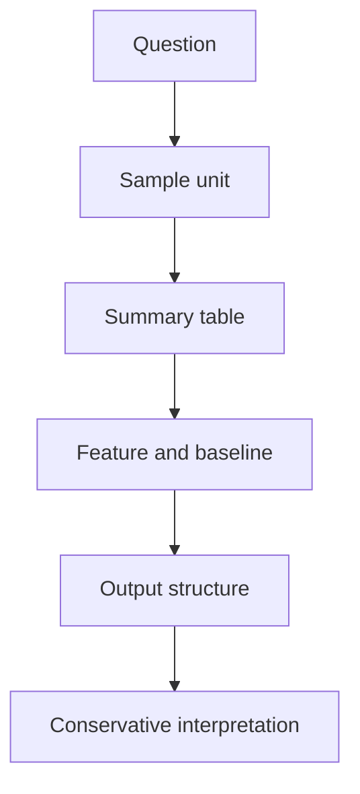

# Part 3 새 Chapter 1 초안

## Chapter 제목 초안

Chapter 1. 데이터 모델링은 무엇을 달성하고 어떻게 진행하는가

이 챕터는 Part 3의 개념 진입 챕터다. 뒤의 `저장 구조`, `샘플`, `특징`, `기준선`, `출력 구조`, `경고`, `target` 설명을 읽기 전에, 독자가 먼저 `데이터 모델링이 어떤 일인지`와 `무슨 결과를 만들려는지`를 붙잡게 한다.

## Section 초안 1

### 제목

`3.1 데이터 모델링은 무엇을 달성하려는가`

### 초안 본문

# 3.1 데이터 모델링은 무엇을 달성하려는가

> Section ID: `P3-1.1`
> Version: `v2026.07.06`

Part 3에 들어오면 독자는 곧바로 `샘플`, `특징`, `기준선`, `출력 구조`, `target` 같은 말을 만나게 됩니다. 그런데 이 용어들을 먼저 배우기 전에 더 앞의 질문이 있습니다. 데이터 모델링은 도대체 무엇을 하려는 일인가 하는 질문입니다.

데이터 모델링을 저장 구조 정리로만 이해하면, 이미 쌓여 있는 표를 보기 좋게 바꾸는 정도로 생각하기 쉽습니다. 하지만 AI와 데이터 분석에서 말하는 데이터 모델링은 그보다 더 앞선 판단입니다. 데이터 모델링은 `지금 있는 원천데이터로 어떤 질문에 답할 수 있게 만들 것인가`를 정하는 일입니다.

예를 들어 자동으로 실행되는 동작 기록이 있다고 하겠습니다. 원천데이터에는 시점별 센서 값, 제어 파라미터, 동작 시작과 종료 시각이 들어 있을 수 있습니다. 이 기록은 저장과 추적에는 충분할 수 있습니다. 하지만 그 상태만으로는 아직 `이번 동작이 평소와 달랐는가`, `최근 구간에서 반복성이 흔들리는가`, `사람이 먼저 검토해야 할 건은 무엇인가` 같은 질문에 바로 답하기 어렵습니다.

여기서 데이터 모델링이 달성하려는 것은 단순합니다. 원천데이터를 그대로 두지 않고, 사람이 비교하고 모델이 활용할 수 있는 구조로 다시 만드는 것입니다. 이때 만들어야 하는 결과는 보통 다음 네 층으로 나눌 수 있습니다.

1. 무엇을 한 건의 샘플로 볼지 정한다.
2. 그 샘플을 설명하는 특징을 만든다.
3. 최근 상태를 무엇과 비교할지 기준선을 세운다.
4. 최종적으로 사람 검토용 결과인지, 예측용 목표 후보인지 출력 구조를 정한다.

즉 데이터 모델링은 `표를 정리하는 일`보다 `문제를 풀 수 있는 비교 구조를 설계하는 일`에 가깝습니다.

이 점을 더 분명히 보기 위해, 데이터 모델링이 실제로 만들고자 하는 산출물을 나란히 놓고 봅니다.

| 달성하려는 것 | 왜 필요한가 | 뒤에서 연결되는 질문 |
| --- | --- | --- |
| 샘플 단위 | 무엇을 한 건으로 셀지 정해야 하기 때문 | 한 행은 무엇을 뜻하는가 |
| 특징 표 | 비교와 학습에 쓸 설명 값을 만들어야 하기 때문 | 어떤 값을 남겨야 하는가 |
| 기준선 비교 구조 | 최근 상태를 평소와 구분해 읽어야 하기 때문 | 무엇과 비교해야 하는가 |
| 출력 구조 | 사람 검토와 예측 문제를 섞지 않기 위해 | 무엇을 결과로 내보낼 것인가 |

이 표에서 중요한 점은 데이터 모델링이 아직 `모델 선택` 단계가 아니라는 사실입니다. 이 단계에서는 분류기 이름이나 딥러닝 구조보다 먼저, 어떤 표를 만들고 어떤 비교를 가능하게 할 것인지가 결정되어야 합니다. 그래야 뒤의 머신러닝 Part에서도 `X`, `y`, `평가`, `기준 모델`이 공중에 뜨지 않습니다.

데이터 모델링이 잘 되었는지는 화려한 모델을 썼는지로 판단하지 않습니다. 오히려 다음 질문에 답할 수 있는지로 판단합니다.

- 지금 표의 한 행은 무엇을 뜻하는가
- 이 값은 왜 남겼는가
- 무엇과 비교하면 변화가 보이는가
- 이 결과는 자동 확정인가, 사람 검토 후보인가

이 네 질문에 답할 수 있으면, 데이터 모델링은 이미 상당 부분 성공한 것입니다. 반대로 이 질문에 답하지 못하면 원천데이터가 아무리 많아도 뒤의 모델 설명은 흔들리기 쉽습니다.

이 절에서 먼저 고정할 문장은 다음과 같습니다. `데이터 모델링은 원천데이터를 질문에 답할 수 있는 샘플, 특징, 비교, 출력 구조로 다시 설계하는 일이다.` 다음 절에서는 바로 이 일을 어떤 순서로 진행하는지 한 번에 정리합니다.

## Section 초안 2

### 제목

`3.2 데이터 모델링은 어떤 순서로 진행하는가`

### 초안 본문

# 3.2 데이터 모델링은 어떤 순서로 진행하는가

> Section ID: `P3-1.2`
> Version: `v2026.07.06`

데이터 모델링이 무엇을 달성하려는지 이해했다면, 다음 질문은 자연스럽게 이어집니다. 실제로는 어떤 순서로 진행해야 하는가 하는 질문입니다.

현실에서는 원천데이터를 받자마자 모델 이름부터 떠올리기 쉽습니다. 분류를 할지, 회귀를 할지, 이상 탐지를 할지 먼저 정하고 싶어집니다. 하지만 이 순서는 자주 문제를 만듭니다. 아직 `한 행의 뜻`, `샘플 단위`, `비교 기준`, `출력 구조`가 정해지지 않았기 때문입니다.

Part 3에서는 데이터 모델링을 다음 여섯 단계로 읽습니다.

1. 문제 질문을 정한다.
2. 샘플 단위를 정한다.
3. 원시 로그를 비교 가능한 표로 다시 묶는다.
4. 특징과 기준선을 설계한다.
5. 출력 구조와 목표 라벨 후보를 구분한다.
6. 해석 경계와 보수적 문장을 정한다.

이 여섯 단계를 한 줄 파이프라인으로 보면 다음과 같습니다.

각 단계가 하는 일은 다음처럼 읽을 수 있습니다.

| 단계 | 핵심 질문 | 대표 산출물 |
| --- | --- | --- |
| 문제 질문 정하기 | 무엇을 알고 싶은가 | 비교 질문 또는 예측 질문 |
| 샘플 단위 정하기 | 무엇을 한 건으로 볼 것인가 | 동작 단위, 구간 단위, 개체 단위 |
| 표 다시 묶기 | 원시 로그를 어떻게 다시 표현할 것인가 | 요약 표, 집계 표 |
| 특징과 기준선 설계 | 어떤 값을 남기고 무엇과 비교할 것인가 | 특징 열, 기준선 비교 열 |
| 출력 구조 구분 | 사람 검토와 예측 목표를 어떻게 나눌 것인가 | 경고, 검토 후보, 목표 라벨 후보 |
| 해석 경계 정하기 | 어디까지 말하고 어디서 멈출 것인가 | 보수적 문장, 검토 필요 표기 |

이 순서가 중요한 이유는 뒤 단계가 앞 단계를 전제로 하기 때문입니다. 샘플 단위가 정해지지 않으면 특징도 흔들립니다. 특징이 흔들리면 기준선 비교도 흔들립니다. 비교 구조가 흔들리면 `검토 필요`와 `목표 라벨`을 구분하기도 어려워집니다.

작은 예로 보면 더 분명합니다.

- 질문: 최근 동작이 평소보다 불안정해졌는가
- 샘플: 동작 1회
- 표: 동작별 평균, 기울기, 변동성 요약 표
- 특징: `mid_flow_mean`, `late_drop_rate`, `flow_std`
- 기준선: 최근 20건과 이전 200건 비교
- 출력: `검토 필요` 또는 `정상 범위`

이 예시에서 모델 이름은 아직 등장하지 않습니다. 그런데도 이미 중요한 데이터 모델링 결정이 거의 다 들어 있습니다. 무엇을 한 건으로 볼지, 어떤 값을 남길지, 무엇과 비교할지, 무엇을 결과로 낼지가 정해졌기 때문입니다.

Part 3의 각 장은 사실 이 여섯 단계를 더 자세히 펼친 것입니다.

- 다음 장들은 저장 구조와 문제 표현 구조의 차이를 먼저 확인합니다.
- 그 다음 데이터셋이 처음부터 주어진 것이 아니라는 점을 분명히 합니다.
- 이어서 샘플 단위, 요약 표, 특징, 기준선, 해석 경계를 차례로 세웁니다.
- 마지막에는 어떤 문제를 비교 리포트로 남기고 어떤 문제를 Part 4의 학습 문제로 넘길지 정리합니다.

따라서 이 절의 역할은 세부 설명을 대신하는 데 있지 않습니다. 오히려 Part 3 전체를 읽는 독서 지도를 먼저 주는 데 있습니다. 독자가 어느 장을 읽더라도 `지금 나는 여섯 단계 중 어디에 있는가`를 계속 확인할 수 있어야 합니다.

이 절에서 먼저 고정할 문장은 다음과 같습니다. `데이터 모델링은 질문, 샘플, 표, 특징, 비교, 출력 구조를 순서 있게 설계하는 과정이다.` 다음 Chapter부터는 이 순서를 실제 장면과 표 구조로 하나씩 펼쳐서 봅니다.

## 이 초안으로 다음 단계에서 할 일

- 새 Chapter 1을 실제 `docs/parts/part-03/chapter-01/`에 반영한다.
- 기존 Chapter 1 이후 파일을 한 칸씩 뒤로 이동한다.
- 기존 `3.1`, `3.2`는 `3.3`, `3.4`가 아니라 새 장 번호 체계에 맞게 `P3-2.1`, `P3-2.2`로 이동시킨다.
- 새 대표 설명 위치가 생긴 만큼, 뒤 Section들에서 `데이터 모델링` 정의 중복을 줄일지 검토한다.
