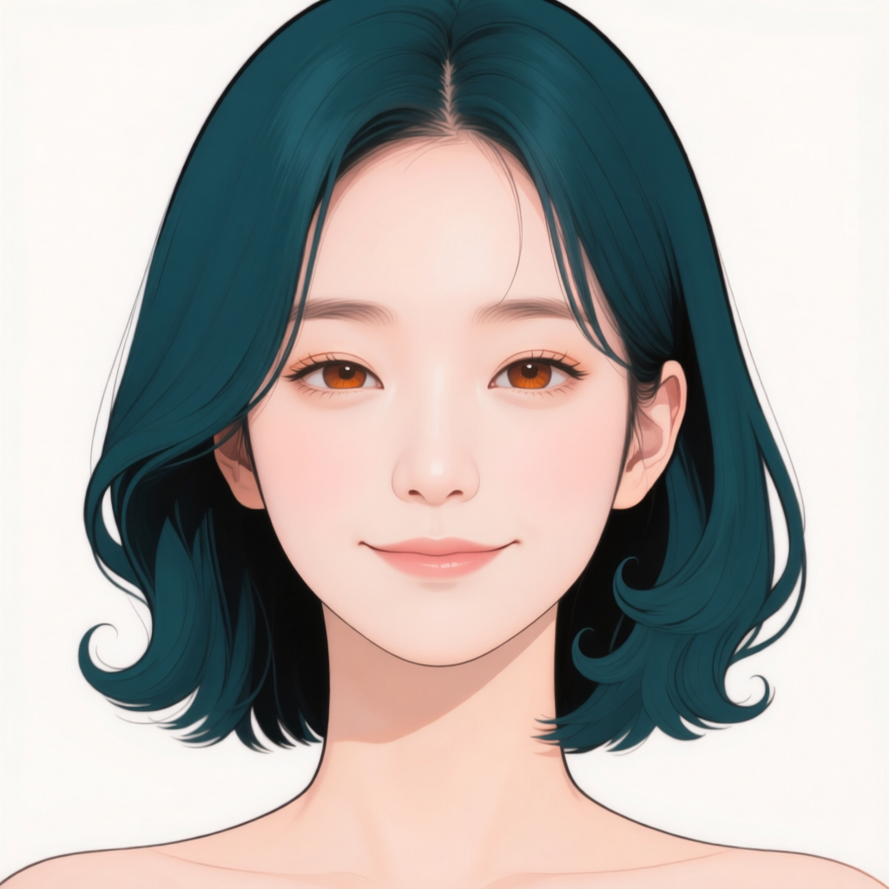
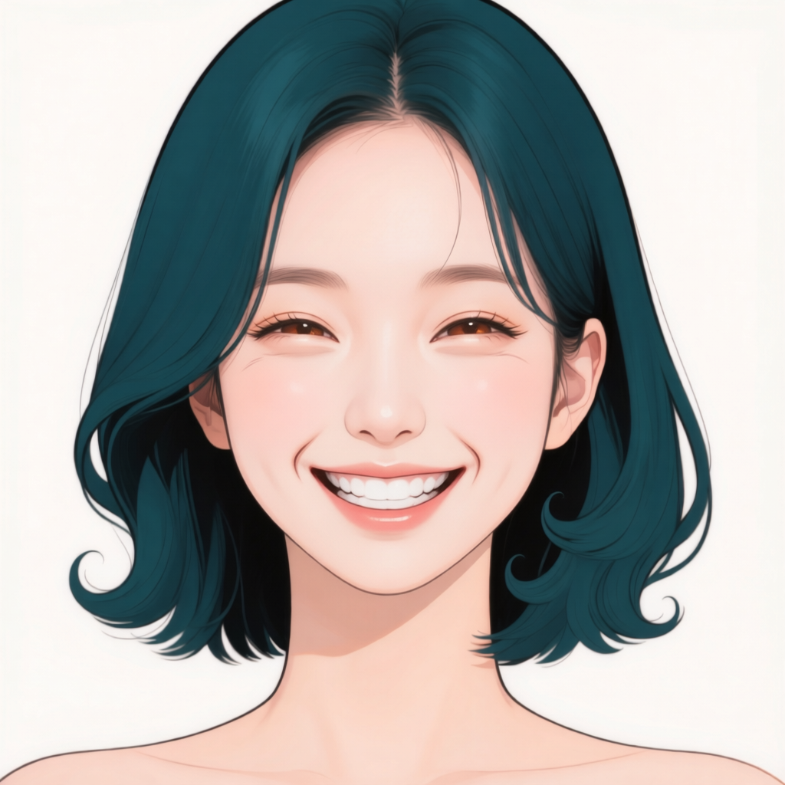
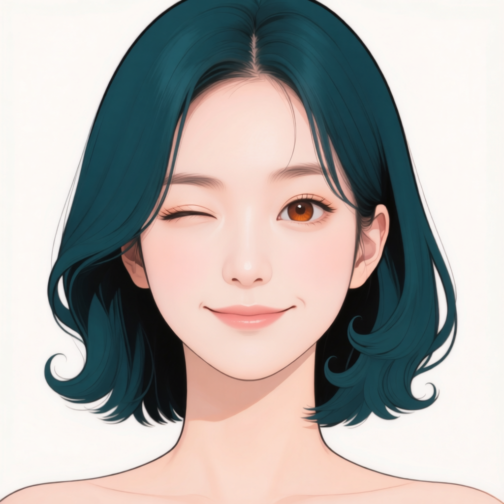
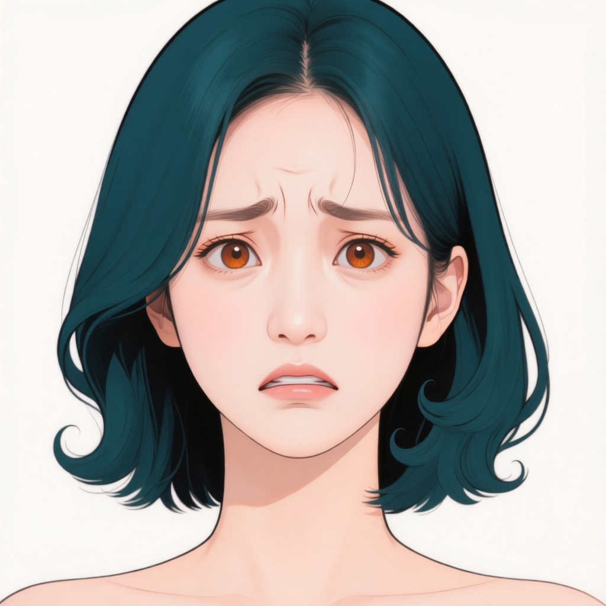
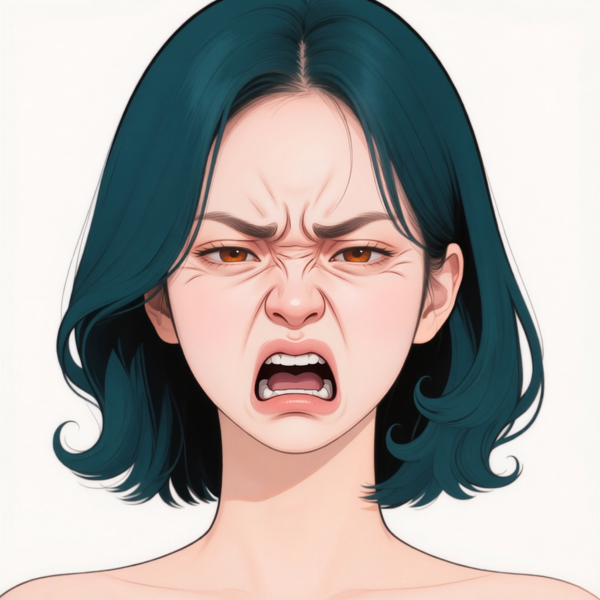
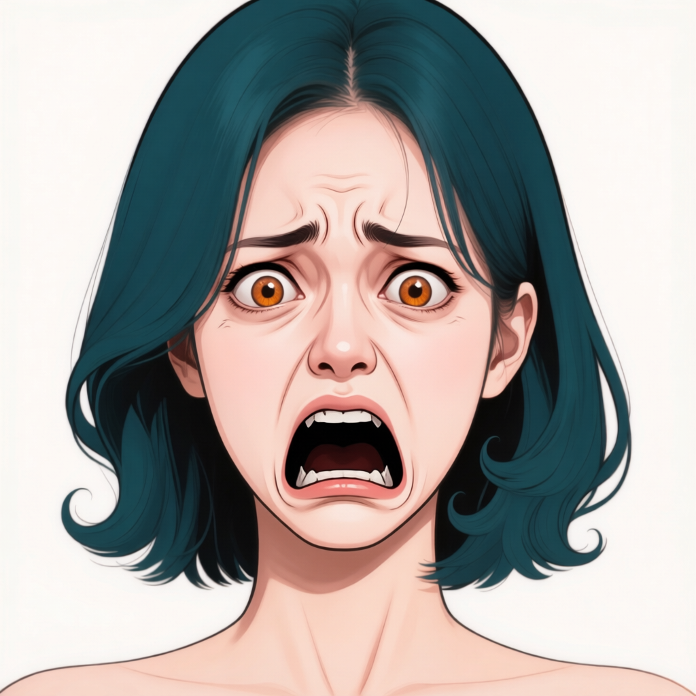
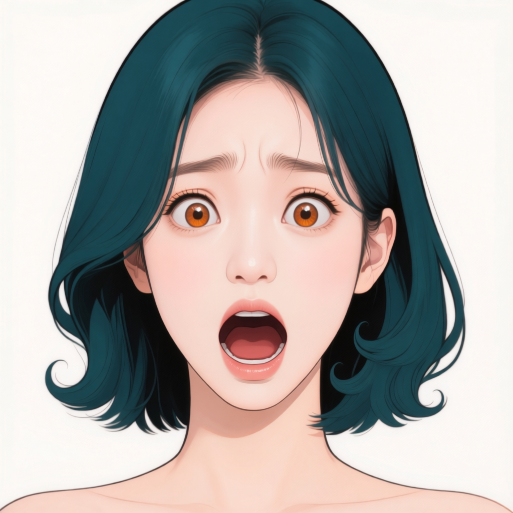
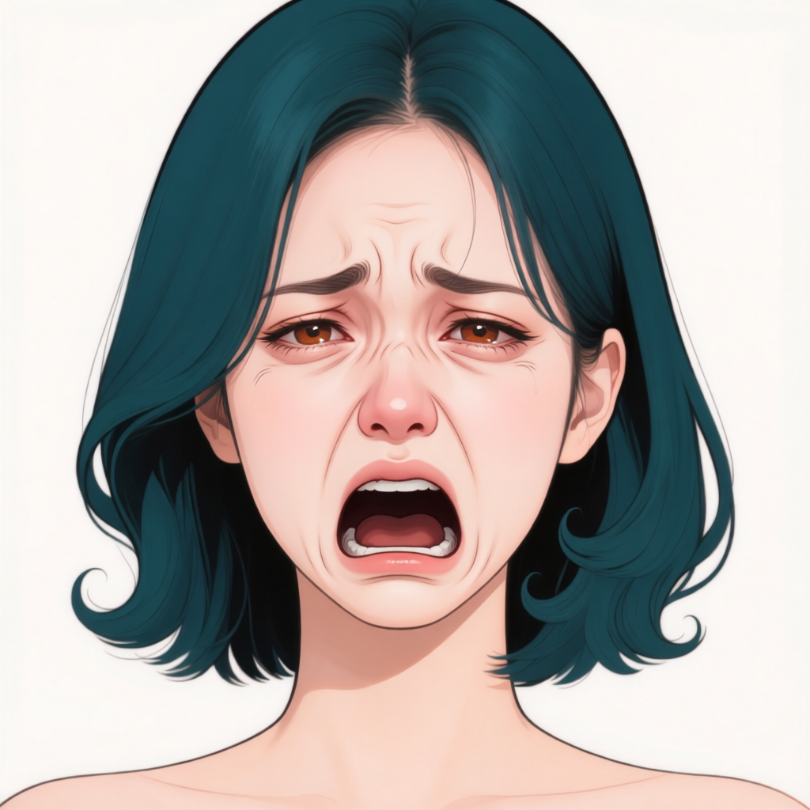

# P7-5.11 Mira LoRA 후보 검수

**최신 상태:** [5.2 원본 17장 재검수와 학습 후보 재정의](part-07-p7-5-2-identity-training-review.md). 우선 12장·보완 4장·중복 예비 1장으로 갱신했다. 아래 표는 철회된 이전 분할 기록이며 최신 판정은 연결 문서와 JSON을 따른다.

- 재점검일: 2026-09-12
- **기존 학습 24장·검증 7장·제외 25장 분할의 확정 상태를 철회한다.** JSON의 56장은 `pending`으로 돌리고 이전 분류·관찰은 별도 필드에 보존했다.
- 아래 3열 표는 **이전 제안 기록**이다. 현재 학습 승인이나 부적합 확정 목록이 아니다.
- 기존 학습 제안은 5.2 기준·각도 7장과 5.9 정면 표정 17장으로 구성되어 있었다. 측면은 모두 검증으로 빠져 있었다. 이는 정체성 학습용 최종 구성으로 검증되지 않았다.
- 생성 결과의 감정명 일치, 얼굴·헤어 정체성 보존, 중복 조절, 검증 배치를 서로 다른 항목으로 판단해야 한다.

## 정체성 관점에서 바로잡을 기준

| 이전 판단 | 문제 | 수정 기준 |
| --- | --- | --- |
| 전신이라 제외 | 목표 해상도에서 얼굴 정보가 적다는 문제와 인물 불일치를 혼동 | 원본과 실제 학습 전처리 결과를 함께 보고 얼굴 관찰 가능성을 판정한다. 필요하면 크롭 보완을 검토하고 파생본은 같은 그룹으로 묶는다. |
| 표정이 강해서 제외 | 입 벌림·눈꺼풀 변화 자체는 다른 인물이 됐다는 근거가 아님 | 표정으로 설명되는 변화와 설명되지 않는 눈·코·턱·헤어의 불일치, 구강 오류를 구분해 지적한다. |
| 유사 표정이라 제외 | 중복은 표집 비중의 문제이며 개별 이미지의 부적합 판정이 아님 | 정체성 검수 뒤 대표 선정이나 표집 비중을 정한다. |
| 측면 전체를 검증에 배치 | 보지 않은 측면 시험과 다양한 방향의 정체성 학습을 한 실험으로 묶음 | 최종 학습에는 검수한 방향별 근거를 확보하고, 미학습 각도 시험은 별도 실험으로 명시한다. 검증을 늘리려고 같은 이미지의 파생본을 양쪽에 나누지는 않는다. |
| 캡션을 교정하면 채택 가능 | 설명 교정은 외형 오류를 고치지 않음 | 표정 라벨과 별개로 정체성·이미지 품질을 먼저 판단한다. |

현재 검수 기록만으로 **정체성 훼손이 확인되어 반드시 폐기할 후보는 확정하지 않는다.** 이는 모든 후보가 적합하다는 뜻도 아니다. 이전 표의 외형 관찰은 재검수 근거로 남기되 승인으로 사용하지 않는다. 이전 `.tmp/p7-5-11/reviewed-run-001`은 철회된 분할의 준비 산출물이며 학습용으로 사용하지 않는다.

주체 개인화의 목표는 다른 맥락에서도 같은 주체를 재현하는 것이다([DreamBooth 원저자 설명](https://dreambooth.github.io/), 확인일 2026-09-12). 이 일반 목표가 Qwen-Image-Edit-2511의 현재 참조·목표 쌍이나 분할을 검증해 주지는 않는다. Mira 참조를 항상 주는 편집 학습과 참조 없이 이름만으로 인물을 불러오는 학습도 별도로 평가해야 한다.

[검수 목록 JSON](../../docs/assets/part-07/chapter-05/p7-5-11/datasets/p7-5-11-mira-lora-reviewed.json)

## 이전 학습 제안

| 이미지 1 | 이미지 2 | 이미지 3 |
| --- | --- | --- |
|  **Qwen 정면 얼굴 기준** 정면 얼굴·홍채·가르마·단발 끝 형태를 비교하는 기준 컷. |  **Mira 정면 상반신 기준** 정면 상반신과 회색 상의 구도를 제공하며 얼굴·헤어가 기준과 이어진다. |  **Mira 로우앵글 −45도** 아래에서 본 사선 얼굴과 헤어를 제공한다. |
|  **Mira 로우앵글 +45도** 반대쪽 낮은 사선에서 얼굴·헤어를 관찰할 수 있다. |  **Mira 아이레벨 −45도** 화면 오른쪽 사선의 얼굴·가르마를 제공한다. |  **Mira 아이레벨 +45도** 화면 왼쪽 사선의 얼굴·헤어를 제공한다. |
|  **Mira 엘리베이티드 +45도** 다른 높은 각도 컷보다 얼굴 비중이 크고 사선 얼굴을 관찰할 수 있어 채택. |  **Mira 만족** 다문 입의 작은 미소 대표. 홍채·얼굴 윤곽·머리 끝을 확인할 수 있다. |  **Mira 즐거움** 미소에 따른 볼 상승과 좁아진 눈을 추가한다. |
|  **Mira 기쁨** 치아가 보이는 미소를 제공한다. |  **Mira 큰 웃음** 눈을 감고 입을 벌린 웃음. 홍채 근거는 다른 컷에서 보완한다. |  **Mira 머쓱한 미소** 눈썹을 모으면서 입은 웃는 조합을 제공한다. |
|  **Mira 윙크** 화면 왼쪽 눈을 감는 비대칭 움직임이 뚜렷하고 헤어가 유지된다. |  **Mira 안도** 눈을 부드럽게 감고 입을 다문 표정으로 웃음·하품과 구분된다. |  **Mira 하품** 감긴 눈과 세로로 벌린 입이 뚜렷하다. 하품의 턱 변화를 기록하고 홍채 근거로는 쓰지 않는다. |
|  **Mira 볼 부푼 삐짐** 볼 팽창은 뚜렷하지 않다. 다문 입·내려간 입꼬리·약간 올라간 턱으로 캡션을 교정해 채택. |  **Mira 못마땅함** 반쯤 감긴 눈과 다문 입 대표. |  **Mira 의심** 약한 눈썹 비대칭과 다문 입을 제공한다. |
|  **Mira 엄격함** 입을 다문 채 눈썹을 내리고 모은 표정 대표. |  **Mira 분노** 눈썹을 강하게 모으고 치아를 드러내는 표정 대표. |  **Mira 경멸** 한쪽 입술이 더 올라가고 조금 벌어진 입을 제공한다. |
|  **Mira 혐오** 좁아진 눈·모인 눈썹·내려간 입꼬리 조합을 제공한다. |  **Mira 경이로움** 크게 뜬 눈과 조금 열린 입의 대표. |  **Mira 놀람** 올라간 눈썹과 둥글게 열린 입을 제공한다. |

## 이전 검증 제안

| 이미지 1 | 이미지 2 | 이미지 3 |
| --- | --- | --- |
|  **Mira 아이레벨 −90도** 화면 오른쪽을 보는 측면 대표. 측면 계열 전체를 학습에서 제외하고 검증한다. |  **Mira 아이레벨 +90도** 화면 왼쪽 측면 대표. 학습 참조로도 사용하지 않는다. |  **Mira 걱정** 안쪽 눈썹이 올라가고 입꼬리가 내려간 검증 대표. |
|  **Mira 불안** 눈썹 상승과 조금 벌어진 입의 검증 대표. |  **Mira 두려움** 크게 뜬 눈과 가로로 열린 입의 검증 대표. 공포 계열은 학습에서 제외. |  **Mira 낙담** 내려온 눈꺼풀과 올라간 안쪽 눈썹의 슬픔 계열 검증 대표. |
|  **Mira 슬픔** 눈가의 물기와 내려간 입꼬리를 포함하는 슬픔 계열 검증 대표. |  |  |

## 이전 제외 제안

| 이미지 1 | 이미지 2 | 이미지 3 |
| --- | --- | --- |
|  **Mira 로우앵글 −90도** 얼굴 비중이 작고 머리 끝 형태와 배경도 달라 첫 얼굴 학습에서 보류. |  **Mira 로우앵글 정면** 턱 아래가 강조되고 몸통 비중이 커 첫 512 목표 학습에서 제외. |  **Mira 로우앵글 +90도** 측면 계열은 학습에서 모두 남기며 이 컷은 얼굴 비중이 작아 검증 대표에서도 제외. |
|  **Mira 아이레벨 정면** 정면 상반신 기준과 구도·표정이 유사해 중복 제외. |  **Mira 엘리베이티드 −90도** 전신으로 넓어진 구도에서 얼굴 비중이 작아 첫 얼굴 학습에서 제외. |  **Mira 엘리베이티드 −45도** 전신과 발까지 포함되어 얼굴 중심 첫 학습에서는 보류. |
|  **Mira 엘리베이티드 정면** 위에서 본 전신 구도로 얼굴 외 영역 비중이 커 보류. |  **Mira 엘리베이티드 +90도** 높은 측면 전신으로 얼굴 비중이 작아 보류. |  **Mira 수줍은 미소** 작은 미소 대표와 유사해 제외. |
|  **Mira 민망함** 원래 감정명보다 걱정 계열과 닮아 검증 계열 유사 컷으로 학습 제외. |  **Mira 장난기** 장난기의 비대칭보다 평범한 작은 미소에 가까워 중복 제외. |  **Mira 삐짐** 입 돌출보다 걱정·슬픔에 가까워 해당 검증 계열과 함께 학습 제외. |
|  **Mira 토라짐** 반쯤 감긴 눈과 약한 찌푸림이 못마땅함 대표와 유사해 제외. |  **Mira 서운함** 걱정 계열과 비슷한 눈썹·입 조합으로 학습 제외. |  **Mira 억울함** 강한 미간·치아 노출은 분노 대표와 겹쳐 제외. |
|  **Mira 난처함** 아랫입과 턱 변화가 강하고 찌푸림 대표와 겹쳐 첫 학습에서 보류. |  **Mira 분개** 엄격함·분노 사이의 유사 찌푸림으로 중복 제외. |  **Mira 격노** 크게 열린 입과 길어진 턱의 과장을 줄이기 위해 첫 학습에서는 분노 대표만 채택. |
|  **Mira 반감** 반감보다 걱정 계열과 비슷한 출력으로 학습 제외. |  **Mira 극심한 혐오** 코·미간 주름과 구강 변화가 강해 첫 얼굴 학습에서 보류. |  **Mira 극도의 공포** 눈·코·주름·구강 변화가 매우 커 첫 검증 대표에서는 보류. |
|  **Mira 주의 집중** 걱정 계열과 닮은 약한 변화로 학습 제외. |  **Mira 충격** 입 벌림이 큰 다른 대표들과 겹쳐 과장 비중을 줄이기 위해 제외. |  **Mira 우울한 표정** 낙담과 매우 유사해 검증 중복 제외. |
|  **Mira 비통함** 코 붉어짐·주름·큰 입 벌림이 함께 강해 첫 검증에서는 보류. |  |  |

## 보충 생성 결과의 사용자 오류 판정

본 배치 40장과 측면 교정본 1장의 생성은 완료됐지만 학습 승인과 구분한다. 사용자는 본 배치 중 다음 31개를 오류로 지정했다.

- background: 03, 04, 05
- evaluation(사용자 표기 이벨): 01, 02, 03, 05, 06, 07, 08
- expression: 01, 02, 03, 05, 06, 07, 08
- lighting: 01–08 전체
- outfit: 01, 02, 03, 05, 06, 08

보고된 공통 문제는 이목구비·홍채색 변화와 큰 피부색 차이다. 개별 이미지에 세 증상이 모두 있다고 자동 기록하지는 않는다. 31개는 사용자 반려로 기록했고 나머지 9개도 통과가 아닌 검수 대기다. 별도 evaluation-03 측면 교정본까지 포함한 지적인지는 불명확하여 교정본도 보류한다. **현재 보충 이미지의 학습 승인 수는 0장**이다.

[사용자 검수 JSON](part-07-p7-5-11-supplement-user-review.json)

방향을 맞춘 참조는 이 배치에서 정체성 유지의 충분조건이 되지 못했다. 다음 비교에서는 생성물·사용한 방향 참조·최초 정면 기준을 함께 놓고, 참조 단계의 외형 차이와 편집 중 추가 변화를 나누어 확인한다. 조명 변화 자체는 허용되는 변수지만 이목구비·홍채의 고유색 변화까지 허용하는 근거가 되지는 않는다. 원인을 확정하지 않았으므로 동일 설정으로 대량 재생성하지 않고 대표 조건에서 먼저 교정 효과를 검증해야 한다.
