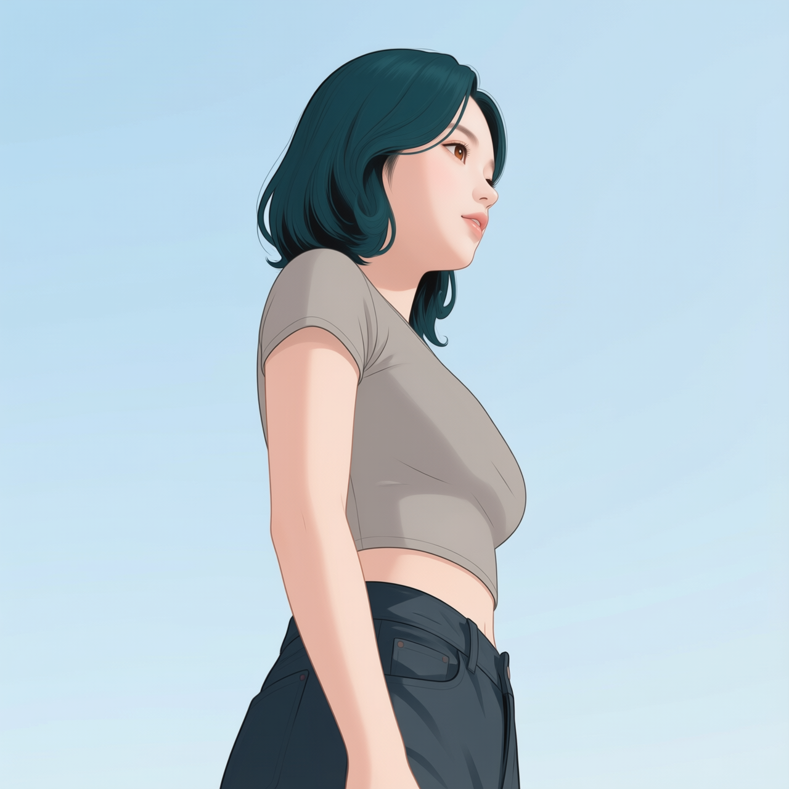
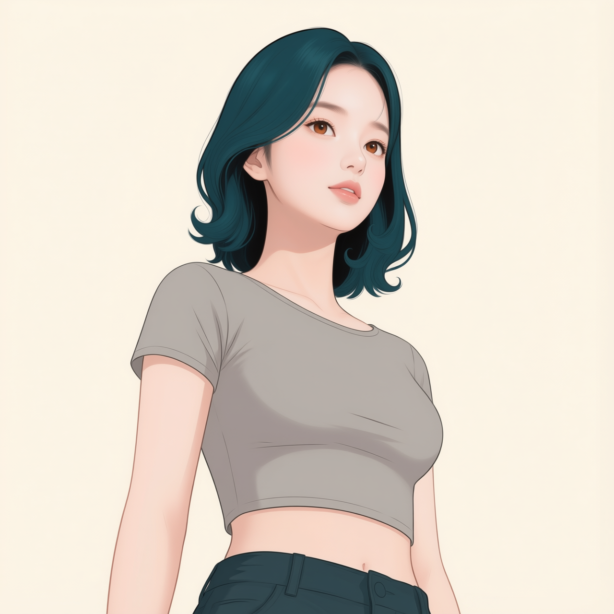
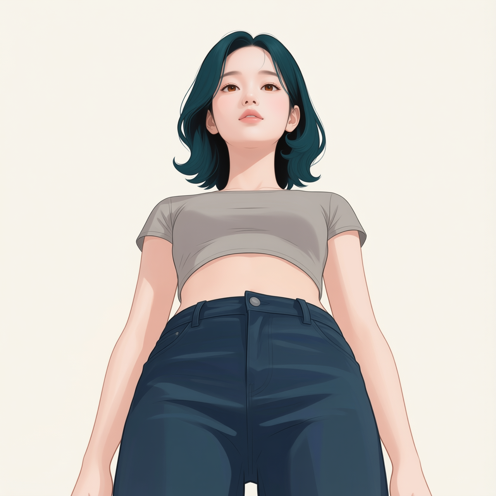
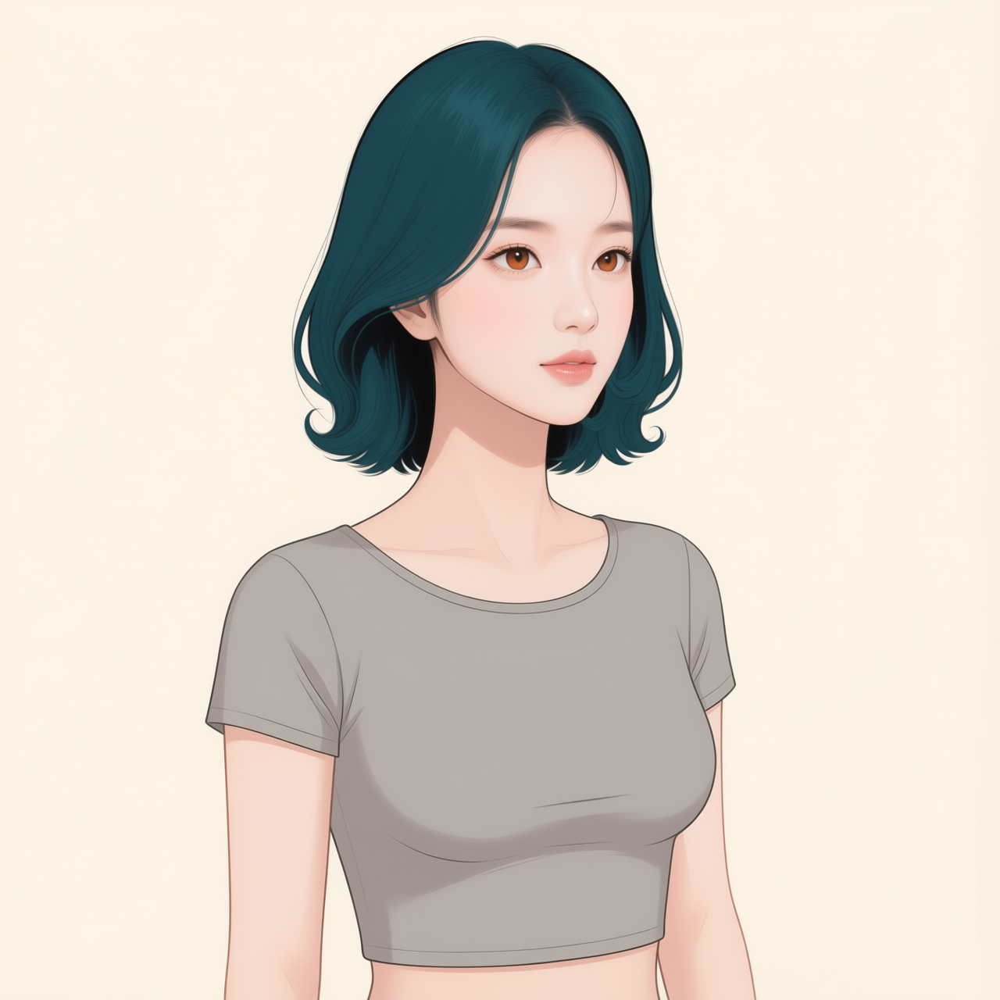
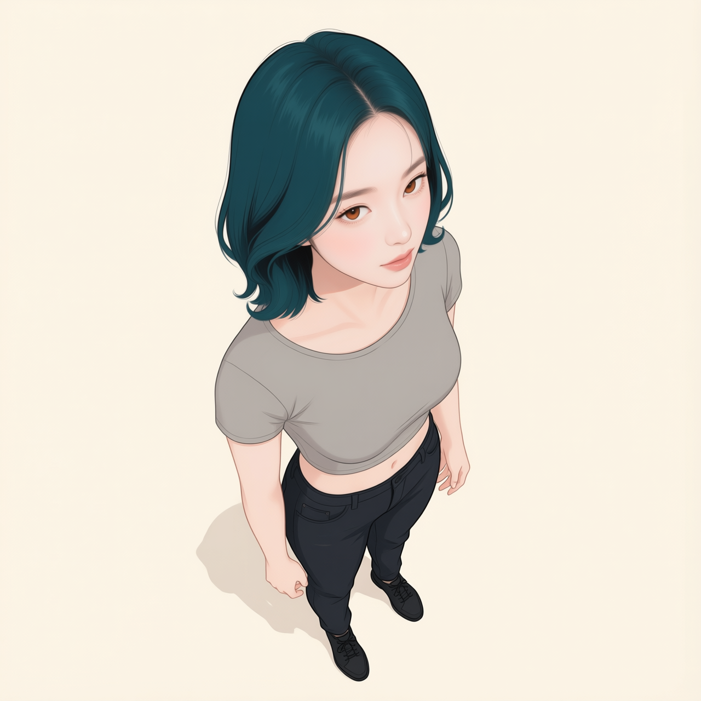
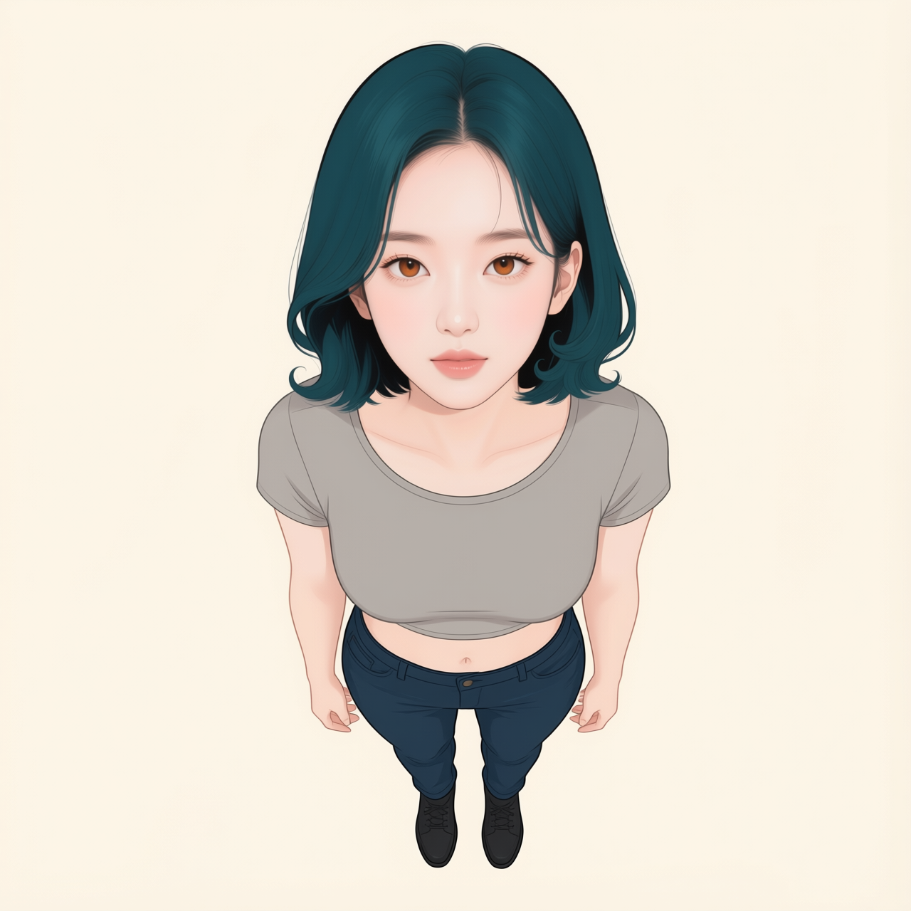
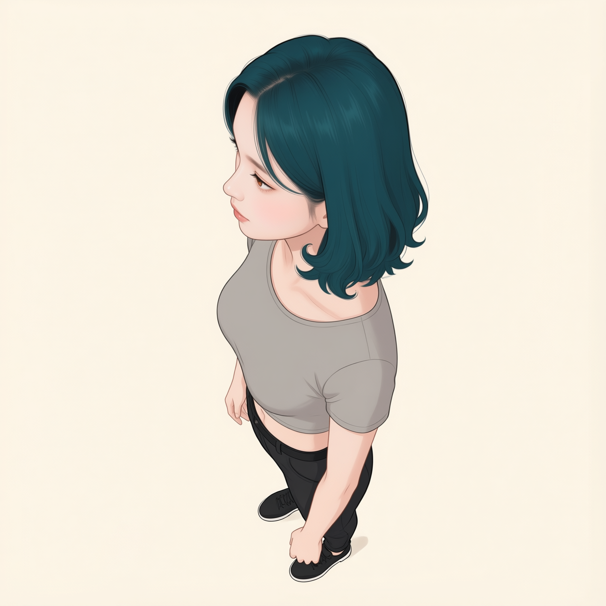

# P7-5.2 검수와 P7-5.11 학습 후보 재정의

- 검수일: 2026-09-12. 기준 얼굴·상반신 2장과 각도 결과 15장의 원본을 모두 다시 시각 비교하고 이미지 SHA-256을 확인했다.
- 판정: 우선 후보 12장, 보완 후보 4장, 정면 중복 예비 1장. 정체성 훼손에 의한 확정 폐기 0장.
- 방향 자료를 일괄 새로 생성할 필요는 확인하지 못했다. 좌우 측면은 학습 후보로 복구한다.
- 이는 AI의 시각 검수다. 같은 캐릭터의 실제 3D 모델에 대한 기하 검증, 학습 후 성능 판정은 아니다.
- 원본은 모두 1280×1280이며 아이레벨 +45°와 엘리베이티드 +45°는 1024×1024다. 원본 전체를 512로 줄이면 가로·세로가 각각 0.4배 또는 0.5배가 된다. 얼굴의 정보량은 실제 크롭·리사이즈 결과에서 별도 검수해야 한다. 이번에는 전처리 이미지를 만들거나 학습기 전처리를 실행하지 않았다.
- 따라서 전신의 작은 얼굴을 부적합으로 판정하지 않는다. 정수리·양쪽 머리 끝·턱을 포함하는 크롭을 우선 전처리 후보로 정의한다. 크롭은 픽셀의 새 정보를 만들지 않으며 원본과 같은 데이터 계보로 관리한다.

## 원본별 재검수

| 이미지 1 | 이미지 2 | 이미지 3 |
| --- | --- | --- |
|  **Qwen 정면 얼굴 기준 · 우선 후보** 기준 얼굴. 주황빛 홍채, 가는 눈썹, 작은 코끝, 완만하게 좁아지는 턱, 비대칭 가르마와 바깥으로 말린 단발 끝을 확인했다. 입은 조금 벌어져 있어 완전한 다문 입으로 캡션하지 않는다. |  **Mira 정면 상반신 기준 · 우선 후보** 정면 상반신. 기준의 눈·코·입 배치와 단발 실루엣이 이어진다. 기준보다 홍채가 갈색에 가까워 보인다. 회색 상의와 배경을 정체성의 고정 속성으로 취급하지 않는다. |  **Mira 로우앵글 −90도 · 보완 후보** 낮은 화면 오른쪽 사선. 반대쪽 눈 일부가 보여 정확한 90도 측면으로 단정하지 않는다. 뒤쪽 머리 끝의 말림이 약해 보이나 시점·겹침 영향과 분리할 근거는 부족하다. 코·턱 외곽과 보이는 눈은 판독 가능하다. |
|  **Mira 로우앵글 −45도 · 우선 후보** 낮은 화면 오른쪽 사선. 눈 크기의 원근 차이, 코 아래와 턱 아래 노출이 시점과 연결된다. 가르마·양쪽 머리 끝과 입술을 관찰할 수 있다. |  **Mira 로우앵글 정면 · 우선 후보** 낮은 정면. 콧구멍과 턱 아래 노출이 커지는 시점이다. 이를 코·턱 오류로 판정하지 않는다. 얼굴과 머리 끝은 모두 보이며 몸통을 줄이는 크롭 후보로 유지한다. |  **Mira 로우앵글 +45도 · 우선 후보** 낮은 화면 왼쪽 사선. 보이는 귀와 눈매, 가르마와 단발 끝이 이어진다. 광대·턱의 사선 형태를 제공한다. |
|  **Mira 로우앵글 +90도 · 보완 후보** 낮은 화면 왼쪽의 측면에 가까운 사선. 반대쪽 눈 일부가 보이므로 정확한 90도 라벨을 사용하지 않는다. 뒤쪽 머리 볼륨은 아이레벨 측면과 함께 비교할 보완 근거다. |  **Mira 아이레벨 −90도 · 우선 후보** 아이레벨 화면 오른쪽 측면. 코끝·입술·턱의 연속 윤곽이 명료하다. 정면에서 가려진 뒤통수는 생성 모델이 보완한 형태이므로 실제 3D 정답으로 단정하지 않는다. 측면 학습 후보로 복구한다. |  **Mira 아이레벨 −45도 · 우선 후보** 아이레벨 화면 오른쪽 사선. 양 눈·코·턱과 가르마를 함께 볼 수 있어 정면과 측면을 연결하는 후보로 적합하다. |
|  **Mira 아이레벨 정면 · 중복 예비** 아이레벨 정면. 상반신 기준과 눈·입·헤어·구도가 매우 유사하다. 외형 결함으로 제외하지 않고 대표 교체용 예비로 둔다. |  **Mira 아이레벨 +45도 · 우선 후보** 아이레벨 화면 왼쪽 사선. 보이는 귀·눈매·코끝·턱과 단발 길이를 확인할 수 있다. 반대 사선과 함께 우선 후보로 둔다. |  **Mira 아이레벨 +90도 · 우선 후보** 아이레벨 화면 왼쪽 측면. 코·입술·턱 윤곽과 뒤통수·단발 끝을 확인할 수 있다. 측면 두 장을 모두 검증으로 빼지 않고 학습 후보로 복구한다. |
|  **Mira 엘리베이티드 −90도 · 보완 후보** 높은 화면 오른쪽 사선. 양 눈이 보여 요청된 90도 측면보다 사선에 가깝다. 정수리·가르마는 보이나 앞쪽 머리 끝이 더 길게 내려와 보인다. 시점에 따른 투영인지 헤어 변화인지 확정하지 않고 보완 후보로 둔다. |  **Mira 엘리베이티드 −45도 · 우선 후보** 높은 화면 오른쪽 사선. 정수리·가르마와 양 눈·코·입이 명료하다. 전신이라는 이유로 제외할 근거는 없으며 머리 전체를 남기는 크롭을 우선 검토한다. |  **Mira 엘리베이티드 정면 · 우선 후보** 높은 정면. 정수리가 드러나고 몸통이 짧아지는 투영이 보인다. 얼굴·머리 끝은 명료하여 크롭 우선 후보로 복구한다. |
|  **Mira 엘리베이티드 +45도 · 우선 후보** 높은 화면 왼쪽 사선. 정수리·가르마·귀와 눈·코·턱을 관찰할 수 있다. 오른쪽 높은 사선과 함께 우선 후보로 둔다. |  **Mira 엘리베이티드 +90도 · 보완 후보** 높은 화면 왼쪽의 측면에 가까운 사선. 가르마와 뒤통수 실루엣을 제공하지만 아이레벨의 완전 측면과 동일한 방향으로 단정하지 않는다. 머리 전체를 포함하는 크롭 보완 후보로 둔다. |  |

## 필요한 학습 후보의 새 정의

1. **방향 근거:** 5.2 우선 12장을 기존 자료에서 확보한다. 기준 얼굴·상반신 2장, 아이레벨 좌우 사선·측면 4장, 낮은 정면·좌우 사선 3장, 높은 정면·좌우 사선 3장이다. 보완 4장은 낮거나 높은 측면에 가까운 시점으로 활용하며 정확한 각도 라벨 대신 관찰 방향을 쓴다.
2. **표정 근거:** 5.9를 재사용한다. 감정 이름이나 강도만으로 제외하지 않고 얼굴·헤어 보존과 구강 오류를 판정한다. 정면 표정의 수를 늘리는 신규 생성은 우선 과제로 두지 않는다. 5.9의 개별 재판정과 최종 표집 비중은 이번 5.2 검수 범위 밖이다.
3. **장면 변화 근거:** 다음 8개 조건을 보충 후보로 정의한다. 먼저 5.4·5.5 기존 장면에서 해당 조건과 얼굴 일관성을 확인하고, 없거나 통과하지 못한 조건만 생성한다. 아래 수량은 첫 비교 설계이며 최적 데이터 수가 아니다.

| 보충 조건 | 제안 수 | 고정·변경할 것 |
| --- | --- | --- |
| 의상 변화 | 2 | 정면 또는 사선 상반신, 배경·조명은 비슷하게 두고 상의만 바꾼다. |
| 배경 변화 | 2 | 같은 외형·의상으로 실내와 실외 상반신을 확보한다. |
| 조명 변화 | 2 | 한 방향의 얼굴에서 부드러운 정면광과 측면광을 비교한다. 머리색 자체는 바꾸지 않는다. |
| 방향과 표정의 조합 | 2 | 좌우 사선에서 미소·말하기 등 눈·입 움직임을 추가한다. |

## 검증과 채택 조건

- 5.2 측면을 통째로 검증에 빼는 방식을 기본 분할로 사용하지 않는다. 학습 방향 근거를 남기면서 원본·크롭·근접 파생 결과를 같은 그룹으로 유지한다.
- 별도의 새 장면 4조건을 평가용으로 예약한다. 예: 창가에서 독서, 실외에서 대화, 옆모습으로 앉기, 다른 옷으로 걷기. 학습과 같은 이미지나 그 크롭을 쓰지 않는다. 생성·선정 과정에서 본 결과라는 한계도 기록한다.
- 참조 Mira를 사용하는 편집과 참조 없이 식별 문구로 불러오는 사용은 따로 평가한다. 현재 코드의 Mira 참조·목표 쌍은 전자의 실험 가설이다.
- 새 후보는 눈·코·턱과 가르마·머리 길이가 시점·표정·조명으로 설명되는 범위에서 이어지는지 검수한다. 머리색만 같다고 승인하지 않는다.
- 최종 train/validation 분할과 전처리가 미확정이므로 JSON의 split은 pending을 유지한다. candidate_role은 새 시각 검수의 우선순위이며 실행 승인 필드가 아니다.

[후보 JSON](../../docs/assets/part-07/chapter-05/p7-5-11/datasets/p7-5-11-mira-lora-reviewed.json)

근거: 이 문서의 개별 판정은 연결된 저장소 원본에 대한 관찰이다. 다른 맥락에서 주체 특징을 유지한다는 일반 목표는 [DreamBooth 원저자 설명](https://dreambooth.github.io/)을 참조했다(확인일 2026-09-12). 위 구성·수량은 Qwen-Image-Edit-2511에서 검증된 학습 처방이 아니다.

## 생성 중 방향 참조 점검

학습 후보 32개는 정면·좌우 사선 목표에 대응하는 5.2 참조를 사용한다. 평가용 evaluation-03에서 사선 지시와 측면 조건의 충돌을 발견해 [측면 교정 목록](../../docs/assets/part-07/chapter-05/p7-5-11/datasets/p7-5-11-mira-supplement-profile-correction.json)을 분리했다. 실행 중인 원본 목록은 변경하지 않는다. 기존 배치가 종료한 뒤 교정본을 생성하고 원래 evaluation-03 대신 검수한다. 방향 일치 참조가 더 유리하다는 판단은 실험 가설이며 비교 측정 결과는 아니다.
