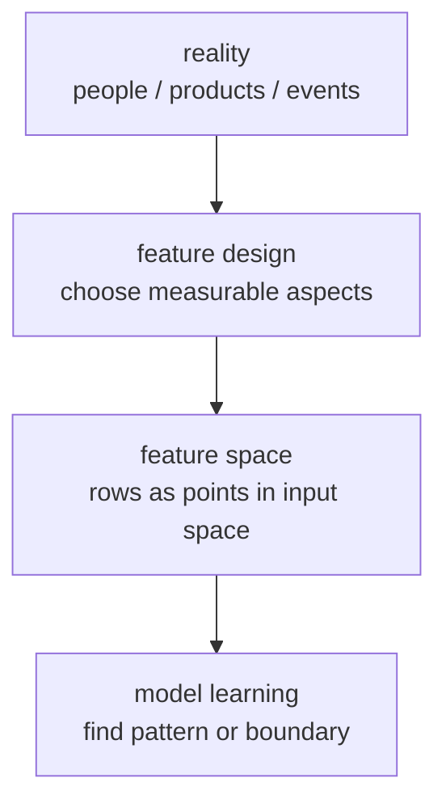
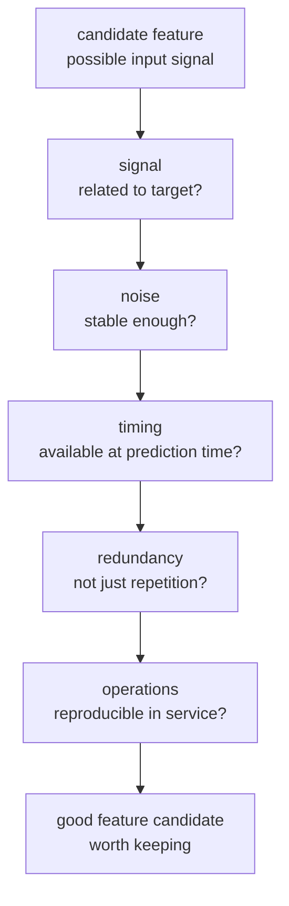
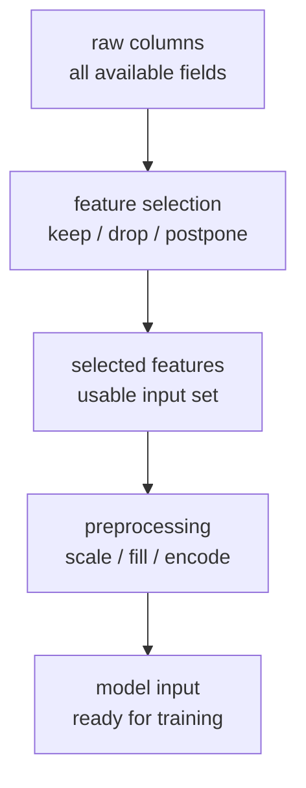
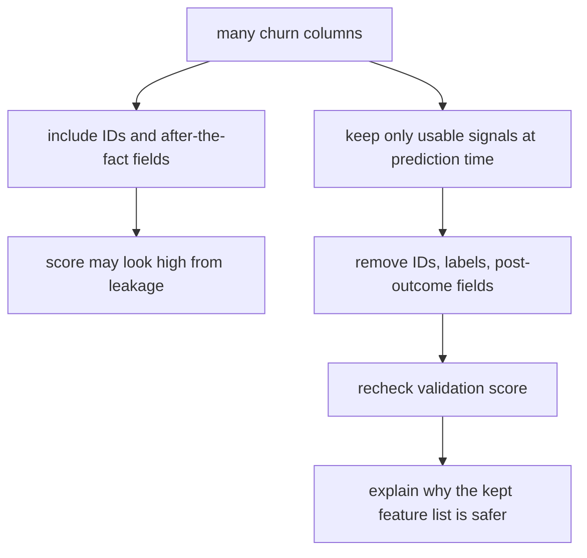

# P4-7.1 Feature Selection

> Section ID: `P4-7.1`
> Version: `v2026.07.10`

P4-6 looked at `what criterion should be used for evaluation`. Now the question moves one step earlier. Before changing an evaluation metric, you must first inspect what input will be given to the model in the first place. Feature selection is the starting point of that input design.

This Section deals with `how should good features be chosen?` Rather than explaining complex selection algorithms in depth, the goal is to fix the judgment criteria that should be checked first in actual work.

This Section explains the meanings of `feature selection` and `feature space`. The next Section continues the current context through this handle, and the basic criterion for deciding what should fill the input slots is connected again through this Section and the [concept glossary](../../../reference/concept-glossary.md).

## Scope Of This Section

This Section answers the following questions.

- What is a feature, and why is input design important?
- Why should not everything be included just because a lot of data are available?
- What feature-selection criteria should a reader inspect first?
- How is feature selection different from preprocessing?

This Section does not treat the following topics deeply.

- formulas of statistical-test-based feature-selection algorithms
- the detailed procedure of recursive feature elimination
- the internal calculation of dimensionality-reduction algorithms

The sense of separating preprocessing types by input problem is revisited in the supplementary P4-7.3. The comparison perspective between statistical-test-based selection and recursive feature elimination is organized again in supplementary P4-7.4. The big picture and internal calculations of dimensionality reduction reconnect in P4-18.1 and P4-18.2.

## Goals Of This Section

- You can explain a feature as `a form in which real-world information has been turned into model input`.
- You can explain that feature selection is connected not only to performance numbers but also to leakage, cost, stability, and interpretability.
- You can use basic questions that distinguish features to discard first from features to keep first.
- You can explain that if preprocessing is `refining the selected features`, then feature selection is `deciding which features should be adopted in the first place`.

## Learning Background

### What Is A Feature?

In machine learning, a feature is what happens when a real-world object is turned into an input slot the model can read.

For example, a customer-churn prediction problem can be read like this.

| Real-world information | Example after turning it into a feature |
| --- | --- |
| visit count in the last month | `visits_30d` |
| payment amount in the last month | `spend_30d` |
| inquiry count in the last week | `support_tickets_7d` |
| membership tier | `membership_tier` |

A feature is not a literal copy of something that existed in the world. It is `an input representation cut and shaped to make the problem easier to solve`.

So even with the same data, a completely different model emerges depending on which slots are chosen as features.

However, this judgment becomes stable only after `what counts as one sample row` is fixed first. If it is unclear whether one row means one customer, one action, or a summary row of several time points, then the meaning of the features also shakes.

To say it a little more theoretically, a feature is the unit of an `input variable`. A model usually cannot understand one large answer all at once. Instead, it looks at several input variables together and finds repeating patterns in their combination. Each input variable in that combination is a feature.

For example, in a house-price prediction problem, `area`, `number of rooms`, and `distance to the station` can become features. In a spam-classification problem, `occurrence of a particular word`, `whether there is an attachment`, and `sender-domain pattern` can become features. In other words, features change by problem, and even the same reality is expressed through a different set of features depending on what question is being asked.

## Main Learning Content

### Why Feature Selection Matters First

Feature selection is not simply the job of reducing the number of columns. It is the job of deciding `what information will be allowed to participate in model judgment`.

The scikit-learn documentation explains that its feature-selection modules can be used to reduce unnecessary features or features with heavy noise, thereby improving performance and computational efficiency. This judgment becomes even more important especially in high-dimensional data.

The core reasons are the following four.

1. If there are many irrelevant inputs, the model may learn noise.
2. Too many inputs can increase learning and inference cost.
3. The more hard-to-explain inputs there are, the harder result interpretation can become.
4. If an input that will not be available at the future prediction point is included, data leakage can occur.

Feature selection is `keeping good signals while reducing dangerous signals and unnecessary signals`.

Put theoretically again, feature selection adjusts the following four things at the same time.

| Perspective | What feature selection changes |
| --- | --- |
| representation perspective | the shape of the input space as seen by the model |
| learning perspective | the difficulty of the patterns the model must learn |
| statistical perspective | the ratio of signal to noise |
| operations perspective | whether the input can be reproduced in an actual service |

Read through this table, feature selection is closer not to simple data cleanup but to `redefining the learning problem`.

### Feature Space And Representation

It is important to look at features one by one, but machine learning usually does not judge from only one feature. It looks at the input space created by several features together. This Section handles that as `feature space`.

For example, suppose there are only two features.

- `visits_30d`
- `support_tickets_30d`

Then one customer can be represented as one point, `(visit count, inquiry count)`. If there are thousands of customers, those points gather and make one space. Inside that space, the model learns `the tendency of points that churn`, `the grouping among similar points`, and `the shape of boundaries`.

So feature selection is not only the job of reducing the number of columns. It is also the job of `designing the input space the model will see`.



This diagram shows that feature selection is not simply choosing columns. It is a process of deciding into what kind of input space reality will be translated. Even with the same reality, the patterns and boundaries the model learns can change completely depending on what features are drawn out.

The key point of this diagram is that what matters more than whether there are many or few features is `from what perspective reality was cut to create the input space`.

Even the same fact can become easier or harder for a model to learn depending on how it is turned into a representation.

For example, imagine representing customer activity.

| Same reality | Representation 1 | Representation 2 |
| --- | --- | --- |
| recent activity | total visits in the last 30 days | visits in the last 7, 30, and 90 days |
| purchase scale | amount of the most recent purchase | average purchase amount in the last 30 days |
| inquiry behavior | total number of inquiries | refund-inquiry count, delivery-inquiry count |

The key point this table shows is that feature selection is connected not only to `choosing original columns`, but also to `what unit of representation will be used to build the input`.

This difference becomes clearer when raw logs are handled. Even if values appear as a time sequence, model input often does not use all those raw rows directly. Instead, feature candidates are frequently made by summarizing them again by action unit.

Here too, the order is `raw time series -> one summarized row per action -> feature selection`. Feature selection is the stage that comes after this order, and again decides `which input slots in the summarized row will be kept`.

| Value seen in raw logs | Example after changing into a feature candidate | Why this kind of representation is needed |
| --- | --- | --- |
| values of `signal_a` changing over time | `signal_a_mean` | to summarize the overall level into one slot |
| the difference between early and late values | `signal_a_drop` | to expose the direction and size of change |
| fluctuation by section | `signal_a_std` | to inspect stability and variability together |
| repeated shapes by progress section | `pattern_code` | to compare similar patterns briefly |

What matters here is not memorizing a specific name. It is asking whether the data are being changed from `raw values as they are` into `a reading unit more directly connected to the problem`. In other words, feature selection is not only column removal. It is also the work of redesigning the representation as `raw time series -> one summarized row per action -> model input slots`.

Read in reverse, this also means that in a table where `what one row means` is still unclear, the discussion of feature selection should not be started too early.

This scene becomes more direct when read like the following.

| action_id | duration_steps | control_mean | sensor_a_peak | sensor_b_mean | sensor_a_slope |
| --- | ---: | ---: | ---: | ---: | ---: |
| A-101 | 5 | 0.44 | 28.4 | 1.18 | 0.63 |
| A-102 | 5 | 0.46 | 28.0 | 1.22 | 0.51 |
| A-103 | 5 | 0.43 | 29.1 | 1.34 | 0.72 |

This table is an example of several rows of raw time series being re-expressed into `one row per action` summary rows. Here columns such as `control_mean`, `sensor_a_peak`, and `sensor_a_slope` are not just computed values. They are already the result of a choice about what should remain as model input slots. In other words, feature selection is already connected to the question `what will be left in what representation` even before the later question `which columns should be dropped?`

Go one step further, and some features do not end with describing one action only. They also connect to input that compares recent state and a baseline.

| metric | recent_5_avg | baseline_20_avg | delta | interpretation |
| --- | ---: | ---: | ---: | --- |
| duration_steps | 5.4 | 5.0 | 0.4 | recent longer |
| control_mean | 0.48 | 0.44 | 0.04 | recent slightly higher |
| sensor_a_peak | 29.6 | 28.2 | 1.4 | recent peak increased |
| sensor_b_mean | 1.42 | 1.16 | 0.26 | recent average increased |

What matters in this comparison table is not the `delta` number itself, but that the features built earlier are now being used again in an interpretation frame that compares `the recent section` and `the baseline`. So feature selection is not only input design for learning. It is also design of a comparison report that people will read.

However, this comparison table only shows the change signal first. It does not automatically settle the cause of that difference.

This flow becomes even clearer when seen in a short code example.

Problem situation:

- raw logs across several rows should be turned into action-level features, and those features should then be reused as comparison inputs between a recent section and a baseline

Input:

- a small raw-log table containing `action_id`, `time_step`, `control_level`, `sensor_a`, and `sensor_b`

Expected output:

- an action-level summary table
- a comparison table with recent average, baseline average, and deltas

Concept to check:

- a feature is representation design that turns raw logs into one-row input
- the same feature can be reused both for model input and for an operations comparison table

```python
import pandas as pd

raw = pd.DataFrame(
    [
        ["A-101", 0, 0.20, 24.8, 0.3],
        ["A-101", 1, 0.35, 25.6, 0.8],
        ["A-101", 2, 0.55, 27.1, 1.5],
        ["A-102", 0, 0.18, 24.5, 0.2],
        ["A-102", 1, 0.32, 25.3, 0.7],
        ["A-102", 2, 0.60, 27.8, 1.6],
        ["A-103", 0, 0.22, 25.0, 0.4],
        ["A-103", 1, 0.36, 26.1, 0.9],
        ["A-103", 2, 0.54, 29.1, 1.8],
    ],
    columns=["action_id", "time_step", "control_level", "sensor_a", "sensor_b"],
)

summary = (
    raw.groupby("action_id")
    .agg(
        duration_steps=("time_step", "count"),
        control_mean=("control_level", "mean"),
        sensor_a_peak=("sensor_a", "max"),
        sensor_b_mean=("sensor_b", "mean"),
    )
    .reset_index()
)

recent = summary.tail(2).mean(numeric_only=True)
baseline = summary.head(len(summary) - 2).mean(numeric_only=True)

comparison = pd.DataFrame(
    {
        "recent": recent,
        "baseline": baseline,
        "delta": recent - baseline,
    }
)

print(summary)
print(comparison.round(2))
```

The first thing to read in this code is not a performance number. It is the transformation of the representation.

- several rows of raw logs are turned into an action-level feature table
- that feature table is again turned into a recent-versus-baseline comparison table
- so feature selection already decides `what will become a comparable input` before later preprocessing
- summary rows make comparison easier, but they do not fully replace all context in the raw time series

So feature selection always carries the following two questions together.

1. What information will be kept?
2. In what form of input representation will that information be kept?

The second question connects to preprocessing too, but the starting point is still feature design.

### What Should A Good Feature Have?

People often misunderstand `a good feature = a numeric feature`. But what matters is not the data type. It is what kind of relationship that feature has with the problem.

This Section sees a good feature as `an input that contains signal the model can learn from, while also being reproducible again in actual operations`. In other words, it should not be a column that only looks convincing inside a training table. It should be `an input that can still be used legitimately at prediction time, whose meaning does not shake, and whose role remains clear when placed beside other features`.

Theoretically, the following five perspectives matter.

#### 1. Does It Contain Signal?

That feature should contain some pattern related to the target label.

For example, in a churn problem, recent visit count may plausibly relate to churn. By contrast, a completely arbitrary internal serial number usually does not explain the cause or tendency of the problem.

A good feature should contain to some extent `signal that helps predict the target`.

#### 2. Is The Noise Not Too Large?

Just because a value looks present does not automatically make it a good feature.

- Is the measurement itself inaccurate?
- Was it entered manually, so fluctuation is large?
- Does the meaning often change by situation?

In such a feature, the noise can become larger than the signal. Then the model becomes more likely to learn accidental fluctuation than a stable rule.

#### 3. Can It Actually Be Used At Prediction Time?

It is not enough that a good feature is `a value that exists` inside the training dataset. It must also be `a value that can be obtained` at the actual prediction moment.

- Is it recorded only after the outcome appears?
- Is it a value that a human attached afterward as a judgment?
- Is it a summary value that can be calculated only after looking across the entire period?

For example, values such as `contract_cancelled_at`, `refund_confirmed_at`, and `next_30d_spend` may look like very strong signals in the training table, but at the actual prediction moment they are often still unknown. Even if the signal looks strong, such features are not `good features`; they are `features with leakage risk`.

So a good feature should bring not only `help for prediction`, but also `legitimate usability at the actual prediction time`.

#### 4. Is Redundancy Not Excessive?

If too many features with similar meaning are included, the information may not become richer. The explanation may simply repeat itself.

For example, some redundancy may be suspected if the following columns appear together.

- `monthly_spend`
- `quarterly_spend`
- `yearly_spend`

Of course, all of them are not always unnecessary. But the first thing to check is whether `similar meaning is just being repeated at different units`.

#### 5. Can It Be Recreated In Operations?

A good feature should not be a value that exists only in the offline experiment table. It must be reproducible by a similar rule in the actual service.

- Is the collection delay not too large?
- Is the quality not too unstable because it depends on manually written notes?
- Is it a value that is hard to fetch stably at inference time because of privacy, cost, or API dependence?

For example, a summary note written later by a support agent may look useful during training, but it may arrive too late for real-time churn prediction or fluctuate in format. By contrast, aggregate features such as `visits_7d` and `failed_payments_30d` are relatively easier to reproduce stably.

In summary, a good feature tends toward the following condition.

`It contains signal related to the problem, is not overwhelmed by noise, can be used at prediction time, has manageable redundancy with other features, and can be recreated in operations.`

These five conditions do not live separately. For example, even if a feature looks strong, it is disqualified if it cannot be used at prediction time. If it cannot be reproduced in operations, then it is not suitable as a service input. By contrast, even if the signal is not extremely strong, it can become a good basic feature candidate if it is collected repeatedly in a stable way and its meaning stays clear.

To grasp a good feature more intuitively, it helps to contrast it against `a feature that looks attractive but is actually dangerous`.

| Why it looks attractive on the surface | Why it can actually be risky | Better direction |
| --- | --- | --- |
| It moves almost perfectly with the label | If it is a post-outcome value, it may be leakage | Look for behavior signals from before the prediction point |
| The number is large and its change is easy to notice | The unit effect may be large while the real signal is weak | Look first at meaning directly connected to the problem |
| It contains long descriptive text and seems rich in information | Manual entry, delay, and format instability can make operational reproducibility low | Prefer structured signals that can be collected repeatedly |
| Many aggregates over similar periods make it look rich | Redundancy may be large, so it becomes repeated explanation rather than new information | Reduce it into a combination of features with different roles |

So a good feature is closer not to `a feature that looks strong`, but to `a feature that can be reused legitimately and stably`.

The same churn problem can be read like this.

| Feature candidate | signal | noise | timing legitimacy | redundancy | operational reproducibility | first judgment |
| --- | --- | --- | --- | --- | --- | --- |
| `visits_30d` | present | relatively low | yes | moderate | high | inspect first for keeping |
| `customer_id` | low | may look low but generalization is weak | yes | low | high | usually exclude |
| `contract_cancelled_at` | looks very strong | low | no | moderate | low | exclude |
| `agent_note_score` | may have signal | may be high | depends on the situation | moderate | may be low | hold / inspect further |
| `monthly_spend` and `quarterly_spend` together | may have signal | relatively low | yes | high | high | inspect redundancy |

The important point here is not to find `the single feature with the strongest signal`. It is to build `a bundle of features that both the model and operations can sustain`. For example, `contract_cancelled_at` may look extremely strong but still gets rejected, while `visits_30d` may remain even if it is not perfect. The reason is that the latter is more legitimate and repeatable.

If these five conditions are bundled once more, they can be organized like this.



This diagram means that `a good feature` should not be read as a single mysterious property. It should be split into the five questions of relevance, stability, timing legitimacy, redundancy management, and operational reproducibility.

#### The Last Questions That Follow When Choosing A Good Feature

A good feature usually has to survive the following questions too.

1. If this feature disappears, does the model really miss an important signal?
2. If this feature exists but cannot be reproduced later in operations, what good is it?
3. Is this feature merely repeating what another feature is already saying, or does it add a new perspective?

Once those questions are attached, feature selection becomes closer not to `gathering many columns` but to `designing explainable input`.

### Why You Should Not Include Everything Just Because It Is Available

In practice, the more columns a database has, the more dangerous it can become.

For example, imagine that a loan-review model has the following columns.

| Column | Problem that can occur if it is included immediately |
| --- | --- |
| `customer_id` | It may only identify the person, without explaining a generalized pattern. |
| `loan_approved_at` | It is created only after the review result already exists, so it cannot be used at the prediction moment. |
| `default_next_90d` | It is the label itself, so putting it in the input becomes leakage. |
| `branch_note_text` | In actual operations, it may be entered late or have very unstable format. |
| `monthly_income` | It may contain a problem-relevant signal, so it can remain as a candidate. |

The key point this table shows is simple.

`Feature selection is not a competition to include more. It is the job of choosing information that can be used legitimately at the prediction moment.`

### Three Questions Readers Should Use First

When starting feature selection, the order of questions matters more than a complex algorithm.

#### 1. Can This Information Really Be Used At Prediction Time?

The first thing to inspect is timing.

- Is it a value that exists only after the result appears?
- Is it a judgment attached afterward by a human?
- Is it a value made after looking across the whole test dataset?

The common-pitfalls section of scikit-learn explains that preprocessing steps, including feature selection, should use only the training data, and that performance becomes optimistically inflated when the test data are pulled in.

This can be remembered like this.

`If information that is unknown at prediction time is put into the input, the result is not a model that predicts well. It is a model that peeked at the answer beforehand.`

#### 2. Is This Information A Signal Related To The Problem?

The second question is relevance.

Not every column has the same weight.

- Is it a behavior record directly connected to the problem?
- Is it just a number that distinguishes a person or an object?
- Is it almost always the same value, so its information content is low?
- Is it almost repeating the same meaning as another column?

The scikit-learn documentation provides ways to reduce features with almost no variance, features that can be scored by univariate statistics, and features that can be reduced through model-based importance. But in this Section, the focus comes before algorithms. It is on understanding `why could this be reduced?`

#### 3. Can This Information Be Obtained Stably In Operations?

The third question is operational reality.

Some features look present inside a training dataset but are hard to obtain stably every time in an actual service.

- Does collection delay happen often?
- Does quality fluctuate because a human must type it by hand?
- Is it difficult to use in operations because of privacy or cost?
- Does it increase inference-time latency because it has to be fetched at every model call?

In the end, feature selection is not only a data-science problem. It is also a service-design problem.

The key of this judgment flow is not an algorithm but the inspection order. In particular, it matters that the structure asks `can this be used at prediction time?` first.

### How Are Feature Selection And Preprocessing Different?

Readers often mix the two together. But the questions are different.

| Distinction | The first question asked | Example |
| --- | --- | --- |
| feature selection | Which columns should be adopted? | removing IDs, removing post-outcome information, excluding features that are too weak |
| preprocessing | Into what form should the adopted columns be changed? | handling missing values, scale adjustment, categorical encoding |

Feature selection is `the job of fixing the entrance`, and preprocessing is `the job of refining the chosen input so the model can read it well`.

If that difference is drawn simply, it becomes the following.



### What Should Be Kept First, And What Should Be Removed First?

Before complex algorithms, feature selection is also the job of making clear `for what reason is something kept, and for what reason is it postponed or removed?`

| State of the input candidate | First judgment to make | Why |
| --- | --- | --- |
| it is already available at the prediction moment | inspect first | because it is a reproducible candidate for service input |
| it appears only after the answer exists | remove | because the risk of leakage is high as post-outcome information |
| it only distinguishes the entity like an ID | usually remove | because it is closer to individual identification than to a generalized pattern |
| it contains a behavior signal related to the problem | inspect first for keeping | because it may contain a pattern connected to the target |
| collection delay or manual-entry fluctuation is large | hold or inspect for reinforcement | because it is hard to reproduce stably in operations |
| it almost repeats the same meaning as another feature | inspect for reduction | because redundancy may grow more than information |

The order in this table matters. `Does it look relevant?` should come only after `can it be used legitimately at prediction time?` is checked. That way the legitimacy of the input is inspected before performance numbers.

## Detailed Learning Content

### Organizing The Meaning In An Academic Context

Introductory books often use `variable` and `feature` almost as if they were the same word. But in an academic context, they are sometimes separated slightly.

The classic survey paper by Guyon and Elisseeff distinguishes `raw input variables` from `constructed features`. At an introductory level, that difference can be translated like this.

| Expression | Reader-level understanding |
| --- | --- |
| variable | an originally given input column or measured value |
| feature | an expression built for model input by using that variable as it is, or by transforming it |

For example, it can be read like this.

| Original values | In an academic view | Role in model input |
| --- | --- | --- |
| `year_of_birth`, `current_year` | raw variables | before calculation |
| `age = current_year - year_of_birth` | constructed feature | a feature the model reads directly |

A feature is not only a column name. It points to the whole `input representation fed into learning`. So feature selection is sometimes used in a broad sense that includes both `which original variables will remain` and `which constructed features will be adopted`.

The purpose of feature selection is also organized a little more clearly in academic writing. Guyon and Elisseeff explain the purpose as the following.

1. improving prediction performance
2. building a faster and lower-cost predictor
3. helping understanding of the data-generating process

These three purposes continue directly into practice.

| Academic purpose | How it appears in practice |
| --- | --- |
| improve prediction performance | reduce noise and stabilize performance |
| reduce computational cost | reduce training time and inference time |
| improve interpretability | make it easier to explain what information was used in the judgment |

One more important point is that `relevance` and `usefulness` are not always the same word.

| Expression | Meaning |
| --- | --- |
| relevance | what kind of connection the feature has to the target |
| usefulness | whether the feature actually helps inside the current model and the current feature set |

For example, if two columns contain almost the same information, both can still be relevant. But when building a predictor, just one may already be enough. Then the other becomes a feature that is `relevant but less additionally useful`.

This distinction shows that feature selection is not `keeping every column that seems most relevant`, but `finding a subset that has low redundancy and is useful when used together`.

## Cases And Examples

### Case 1. In A Churn-Prediction Table, More Columns Can Become More Dangerous

A subscription-service team is building a customer-churn prediction model. The signals people first used were things such as `recent login count`, `inquiry frequency`, `whether there was payment failure`, and `history of plan changes`.

But when the database is opened, there are far more columns available. It may look richer to include everything, from `customer_id` to `contract completion timestamp`, `notes left later by an agent`, and `whether there will be delinquency next month`. But among these are numbers that only distinguish people, values that exist only after the result happened, and information that would still be unknown at the actual prediction time.

In this scene, feature selection becomes not `put in more` but `keep only signals that can be used legitimately`. First inspect whether the value is available at the prediction moment, then check whether it contains a signal relevant to the problem, and then inspect whether it can be collected stably in operations. After that process, the table may look smaller on the surface, but in reality it creates a more generalizable input space.

The checkable result is clear as well. When the validation score is compared between the version that includes leakage columns and the version that excludes them, the reason the original high performance was an illusion can appear. And when the remaining feature list is reviewed, it becomes possible to explain which columns were actual behavior signals and which columns were post-outcome information.



## Cases And Examples

### Candidates To Drop First Through Practical Heuristics

Before complex computation, the following features are worth checking first.

| Feature to inspect first | Why it needs caution |
| --- | --- |
| ID, order number, customer number | It distinguishes the entity, but it may stay far from generalized patterns. |
| Columns created after the outcome | They can create leakage. |
| Columns that are almost always the same | Their information content may be too small. |
| Redundant-meaning columns | The explanation can grow while the real gain stays small. |
| Columns that are unstable to collect in real operations | Reproduction can be difficult in the service stage. |

This list is not a mathematical formula. It is a checklist a reader can use immediately when opening a dataset for the first time.

### Choosing Feature Candidates Through A Small Example

The following is a very small example that assumes a customer-churn problem.

| Column | Inclusion judgment | Reason |
| --- | --- | --- |
| `customer_id` | exclude | identifier |
| `visits_30d` | include | recent-activity signal |
| `support_tickets_30d` | include | complaint or churn-warning signal |
| `contract_cancelled_at` | exclude | value exists only after the result happened |
| `promo_code_used_30d` | hold | meaning changes by situation, so more review is needed |
| `churn_next_month` | exclude | target label |

The important point in this example is not `include` itself. It is whether the reader can explain `why it was included or excluded`.

## Practice And Examples

### Inspecting Feature Candidates In A First Pass Through A Python Example

The example below imitates a very simple first pass often done in practice. It first catches identifiers, the label column, columns created after the outcome, and constant columns.

Problem situation:

- when feature candidates are opened for the first time, it may not be immediately clear what should remain as input and what should be excluded

Input:

- a list of customer rows `rows`

Expected output:

- include/exclude judgment for each column
- the reason for that judgment

Concept to check:

- the first step of feature selection is to inspect candidate columns by risk signal before model learning
- it is safer to read identifiers, labels, and post-outcome values as exclusion candidates first

```python
rows = [
    {
        "customer_id": "C001",
        "visits_30d": 12,
        "support_tickets_30d": 0,
        "contract_cancelled_at": "",
        "membership_tier": "gold",
        "country": "KR",
        "churn_next_month": 0,
    },
    {
        "customer_id": "C002",
        "visits_30d": 3,
        "support_tickets_30d": 2,
        "contract_cancelled_at": "2026-05-14",
        "membership_tier": "gold",
        "country": "KR",
        "churn_next_month": 1,
    },
    {
        "customer_id": "C003",
        "visits_30d": 7,
        "support_tickets_30d": 1,
        "contract_cancelled_at": "",
        "membership_tier": "gold",
        "country": "KR",
        "churn_next_month": 0,
    },
]

target = "churn_next_month"
columns = list(rows[0].keys())

selected = []
rejected = []

for column in columns:
    values = [row[column] for row in rows]
    unique_count = len(set(values))

    if column == target:
        rejected.append((column, "label"))
    elif column.endswith("_id"):
        rejected.append((column, "identifier"))
    elif column.endswith("_at"):
        rejected.append((column, "post-outcome timestamp"))
    elif unique_count == 1:
        rejected.append((column, "constant value"))
    else:
        selected.append((column, "keep as candidate"))

print("selected candidates:")
for name, reason in selected:
    print("-", name, "->", reason)

print()
print("rejected candidates:")
for name, reason in rejected:
    print("-", name, "->", reason)
```

The output is as follows.

```text
selected candidates:
- visits_30d -> keep as candidate
- support_tickets_30d -> keep as candidate

rejected candidates:
- customer_id -> identifier
- contract_cancelled_at -> post-outcome timestamp
- membership_tier -> constant value
- country -> constant value
- churn_next_month -> label
```

This output does not mean `good features were fully determined`. It shows what should be suspected first when a reader opens a data table for the first time.

## Supplement To The Detailed Learning Content

### What Feature-Selection Methods Are Commonly Seen In scikit-learn?

In practice, the following methods appear often.

| Method | Very short explanation | Position in this Section |
| --- | --- | --- |
| low variance removal | reduce columns that barely change | intuition only |
| univariate selection | score columns one by one and keep part of them | intuition only |
| model-based selection | reduce columns using importance given by a model | intuition only |
| recursive feature elimination | repeatedly remove columns with low importance | only the name is introduced |

The goal of this Section is not to memorize those algorithms. It is to first fix `can the reason for selection be explained?` Algorithms are only tools that help in the next stage.

## Perspective To Remember In This Section

- A feature is a representation that turns real-world information into model input.
- Feature selection is closer to `choosing input that can be used legitimately` than to `putting in more`.
- The first things to check are leakage, relevance, and operational usability.
- Feature selection is the job of choosing inputs, while preprocessing is the job of refining the chosen inputs.

## Short Check

- Are you first checking whether this column actually exists at prediction time?
- Even if a feature seems to contain signal, are you marking separately features that cannot be collected stably in operations?
- Can you explain feature selection and preprocessing separately as `what will remain` and `how it will be transformed`?

## When Should This Perspective Come To Mind First

- Bring up the perspective of feature selection first when you need to check whether columns unavailable at prediction time or post-label information have been mixed into the input.
- Return to this Section when you need to explain again why identifiers, constant columns, and unstable operational signals should be filtered first.
- This Section becomes the criterion when checking whether feature selection and preprocessing are being spoken of as if they were the same thing.

- Are columns unknown at prediction time being removed?
- Are the label itself or post-label information not mixed in?
- Were identifiers and constant columns inspected first?
- Are only features that can be obtained stably in the real service being kept?
- Are feature selection and preprocessing not being mixed together as if they were one task?

## Connection To The Next Section

If this Section decided `what should remain`, then the next Section, P4-7.2 on preprocessing, examines `into what form should the remaining features be changed`. Missing values, scale, and categorical encoding are exactly that next-stage problem.

## Sources And References

- scikit-learn, `1.13. Feature selection`, scikit-learn User Guide, accessed 2026-06-26. [https://scikit-learn.org/stable/modules/feature_selection.html](https://scikit-learn.org/stable/modules/feature_selection.html){: target="_blank" rel="noopener noreferrer" }
- scikit-learn, `12.2. Data leakage during pre-processing`, scikit-learn User Guide, accessed 2026-06-26. [https://scikit-learn.org/stable/common_pitfalls.html](https://scikit-learn.org/stable/common_pitfalls.html){: target="_blank" rel="noopener noreferrer" }
