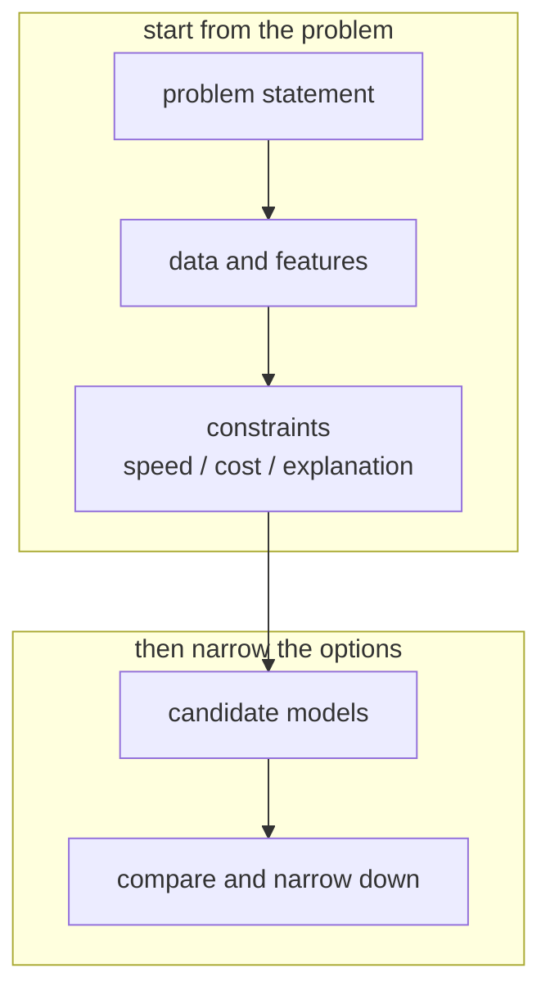
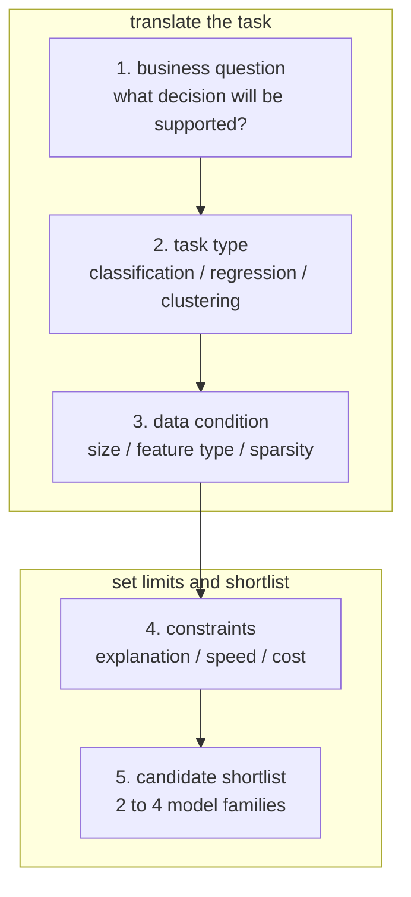
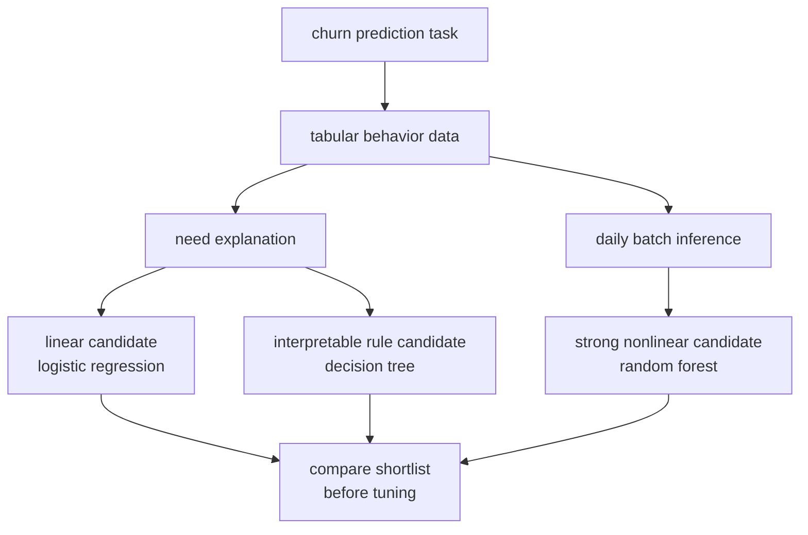

# P4-8.1 Model Selection

> Section ID: `P4-8.1`
> Version: `v2026.07.10`

In P4-7, the discussion examined what inputs should remain and what representation those inputs should be changed into. Now it moves to the next question.

What kind of model should those inputs be handed to?

That question is exactly the starting point of model selection.

Model selection is often understood as `choosing the most famous algorithm`. In practice, it is closer to the opposite. Model selection is the work of narrowing candidates while looking together at the form of the problem, the nature of the data, interpretability, computational cost, and operational conditions.

In academic contexts as well, model selection is not a peripheral choice. In statistics and machine learning, the problem of judging which model to adopt from among several model candidates under observed data and an objective is treated as an independent topic. In other words, model selection is not `a matter of taste about picking an algorithm name`, but the stage that decides `what hypothesis structure should be tested first for the given problem and constraints`.

Model selection is the work of setting up a candidate family of models to test for solving a problem and then narrowing that family into a comparable form.

This Section explains `model selection`, `model candidates`, and `the judgment that narrows candidates by problem form and constraints`. Later Sections continue the current context through this handle, and the criterion for deciding which model drawer should be opened first reconnects through this Section and the [concept glossary](../../../reference/concept-glossary.md).

The quickest starting point is the following table.

| Problem seen now | First question for the reader | Candidate family to bring to mind first |
| --- | --- | --- |
| classification | `Does it separate two or more classes?` | logistic regression, decision tree, k-NN |
| regression | `Does it predict a continuous value?` | linear regression, tree regression |
| clustering | `Does it find groups without labels?` | k-means, DBSCAN |

The purpose of this table is not to guess the right answer. It is to help the reader know `which drawer should be opened first` after looking at the problem.

## Scope Of This Section

This Section answers the following questions.

- What is model selection the work of choosing?
- Why is it difficult to handle practical problems by memorizing only one model?
- What model families can be brought to mind first depending on the problem type and data conditions?
- What criteria besides performance enter model selection?

This Section does not treat the following topics deeply.

- detailed formulas of cross-validation procedures
- statistical model-selection theories such as information criteria like AIC and BIC
- implementation of AutoML or large-scale search systems

The basic role of cross-validation reconnects in P4-4.2 and P4-9.2, while information criteria, AutoML, and large-scale search systems are organized separately in the supplementary learning of P4-9.3 from the perspective of `advanced model selection and automation`.

## Goals Of This Section

- You can explain model selection as `the work of narrowing choices that fit the problem from a set of candidate models`.
- You can say that problem type, data size, feature representation, interpretability, and speed requirements affect model selection.
- You can use the thinking of setting up `a reasonable candidate set` rather than trying to find one correct model.
- You can explain how this connects to the baseline model, hyperparameters, and algorithm introduction in the later Sections.

## Learning Background

Part 4 has so far followed the flow below.

- P4-4: how should data be split
- P4-5: why is generalization difficult
- P4-6: what criterion should be used for evaluation
- P4-7: what inputs should remain, and what representation should they be changed into

Only after organizing those points does a condition for `choosing a model` finally appear.

That means model selection is a Section that can be properly handled only after the earlier Sections have been read. If a model is chosen without data splitting, evaluation becomes unstable. If a model is chosen without an evaluation criterion, there is no way to judge what is better. If a model is chosen without feature selection and preprocessing, the choice may not match the input at all.

So in the curriculum, this Section plays the following role.

| Curriculum position | Role of the model-selection Section |
| --- | --- |
| after feature selection and preprocessing | make the reader think about what models fit what input representations |
| before the baseline model | organize candidate families for setting a comparison starting point |
| before the algorithm introduction | provide a large map of where the algorithms that appear later should be used |

In other words, this Section is not `an encyclopedia of algorithms`, but `a topographic map of algorithms`.

From the curriculum perspective, this Section is also the boundary where the flow of Part 4 moves from `handling data fairly` to `deciding what experiment to actually begin`.

- P4-4 examined how data should be split.
- P4-5 examined generalization and overfitting.
- P4-6 examined what should be used as an evaluation criterion.
- P4-7 examined what inputs should remain and how they should be represented.

Only after that does the following question become valid.

`What model families should now be raised as candidates?`

That means model selection is the Section that gathers the results of the previous Sections into `the first choices of experiment design`. That is why this Section serves as the entrance to the later P4-8.2 baseline, P4-9 hyperparameter tuning, and the algorithm-introduction Sections after P4-10.

So model selection is not a Section that appears suddenly. It is the Section that gathers data splitting, generalization, evaluation criteria, and feature design in order to design the next experiment. After that, the flow moves into baseline and tuning to build a comparison structure, and then into the later algorithm chapters.

At this point, the evaluation criteria seen in P4-6 must be carried over unchanged. When setting up a candidate family, the reader should not ask only `who will get the highest score`, but also write down together `what kind of error needs to be reduced`, `which cell in the confusion matrix especially needs to be reduced`, and `what improvement is expected later when compared with the baseline`. Only then are later baseline comparison and tuning results read not as simple score competition, but as `how much the error structure changed`.

The reader should leave the same criteria immediately in candidate notes as well.

| Item to write down now | Why it should be written down together here |
| --- | --- |
| first 2 to 4 candidate models | to reduce the mistake of grabbing one model and tuning it immediately |
| the simplest baseline | to make clear in advance what has to be beaten first in the later Section |
| evaluation metric to look at first | to avoid judging only by one surface score such as accuracy or MAE |
| error scene to inspect | to immediately track problematic cells in the confusion matrix or large-error regions |

That means model-selection notes should not end as `a list of candidate names`. They should also record `the starting point of baseline and error interpretation`.

At this point, the reader naturally asks the next question.

`Then what must be known in order to build a baseline?`

To answer that question, it is more natural not to go deeply into the baseline itself yet, but first to know what must be fixed before setting the baseline. A baseline is not a rule that appears suddenly. It can be built only after `what is being treated as one sample`, `what problem is being solved`, and `what score will be used for comparison` are decided first.

That is why P4-8.1 mentions the baseline in advance: to show that `comparison criteria must also be noted together with candidate-family design`. How the baseline itself is actually built is handed over to the next Section, P4-8.2, as the central question, but the preparation knowledge is more naturally fixed here first.

One more thing makes model-selection notes much stronger. Before writing down candidate models, the reader should also note `what is currently being treated as one sample`, `whether raw logs are being used as they are or a one-action summary table is being used`, and `what baseline recent results will be compared against`. Even the same algorithm name can have a very different meaning in a comparison experiment depending on how the input structure was built.

| What to confirm before writing model candidates | Why it must be confirmed first |
| --- | --- |
| what the sample unit is | because if one row and one case are confused, the evaluation unit also becomes unstable |
| whether to use the raw time series or a one-action summary row | because if the input representation changes, even the same model becomes a completely different experiment |
| what baseline recent results will be compared against | because if only absolute values are seen, the direction of improvement of candidate models is easily misread |
| whether warning and cause confirmation should be distinguished | to avoid exaggerating the interpretation of model output |

That means model selection is the work of opening the algorithm drawer, but before that it is tied to the work of fixing `a comparable data structure`.

The preparation knowledge needed immediately for building the baseline also overlaps here in fact.

| What should be known before the baseline | Why the baseline needs this information first |
| --- | --- |
| whether the problem type is classification or regression | because this determines whether the baseline becomes majority-class prediction or mean/median prediction |
| what one sample is | because if the unit of a row is unstable, what the baseline score is even trying to predict also becomes unstable |
| what evaluation metric will be viewed first | because the interpretation of the baseline changes depending on whether accuracy, recall, or MAE is being watched |
| what the current data distribution is | because to judge what `an easy standard` is, the class imbalance or target distribution must be known |
| what failure is important in operations | because to judge whether barely beating the baseline is actually meaningful, the important error type must be known first |

That means building a baseline does not suddenly require some new advanced theory. It first requires the `problem definition`, `sample unit`, `evaluation metric`, `data distribution`, and `error cost` that have already been organized. Those are exactly the preparations the reader should still be holding at the end of this Section.

In particular, in examples dealing with action-unit raw time series, even the same model name becomes a completely different comparison experiment depending on whether multiple time points are fed in directly or changed into a one-action summary row.

This point ties together once more the flow of Part 3 and P4-7. In Part 3, the reader examined `what one row means` and `why a one-action summary row is needed`. In P4-7, the reader examined what input slots to keep as features in that summary row. Only then does model selection reach the stage of asking `for this input representation, what model family should be tested first`.

That means model selection is not a stage that competes with feature selection. It is a stage that sets up a candidate family on top of an already fixed sample unit and input representation.

The judgments that should be fixed here are the following three.

| What should be nailed down in this Section now | What will be examined in the very next Section | What should remain to the end in actual comparison |
| --- | --- | --- |
| set the first 2 to 4 candidate models | look at what has to be beaten first using the baseline | problematic cells in the confusion matrix, large-error regions, representative failure cases |
| decide which candidate-family drawer should be opened first after seeing the problem | compare whether score increases are real improvements | write down what failure should be reduced more in the next experiment |

Candidate-family notes should be left in the following form so that the comparison criterion becomes less unstable.

| Note item | Example |
| --- | --- |
| sample unit | one action |
| input representation | one-action summary row |
| first candidate family | logistic regression, decision tree, random forest |
| baseline | the simplest rule or majority-class prediction |
| failure to view first | error types that must not be missed, large-error regions |

If notes are written this way, not only model names remain, but also `what kind of experiment is intended to reduce what kind of failure with what kind of input representation`.

It is fine if the baseline item in this table still feels vague. The purpose here is not `how to complete the baseline immediately`, but to first grasp `what materials are needed to build the baseline`. In the next Section, P4-8.2, the reader sees why the baseline is needed first and what the principle of score interpretation is. Then in the following `P4-8.3 supplementary learning`, the reader sees concretely what simple standards can be set first in classification, regression, and time series by using exactly these materials.

## Main Learning Content

### What Is Model Selection The Work Of Choosing?

Academically, model selection is the problem of choosing among candidate models in a way that fits the objective. However, the objective may not be only one thing.

- Is the predictive performance good?
- Does it create less overfitting?
- Is the computational cost manageable?
- Is it easy to explain?
- Is it deployable in the operating environment?

That means model selection is a broader problem than simply `finding a model with high accuracy`.

Put a little more theoretically, what is being chosen here is not simply the name of a program, but a part of the hypothesis space. Whether the reader examines linear models, tree families, or distance-based models is ultimately connected to `what structure is being tried to read from the data`. This Section does not dig into those mathematical details, but focuses on making it possible to distinguish them as `differences in the character of candidate families`.

`Model selection is the work of narrowing model candidates so that they fit the problem and its constraints.`

### Why Should One Not Memorize Only One Model?

Even with the same dataset, if the question changes, the suitable model can change too.

For example, even with customer data, completely different problems can appear as follows.

| Same data | Different question | Model-selection perspective |
| --- | --- | --- |
| customer activity records | will the customer churn next month | classification candidates |
| customer activity records | how much revenue will there be next month | regression candidates |
| customer activity records | can similar customers be grouped together | clustering candidates |

That means model selection starts not from the dataset name, but first from `what kind of prediction or judgment is being attempted`.

The incorrect starting points readers often use also need to be organized together.

- choose the famous algorithm first
- choose the library already used before
- choose the model that looks most complex first

All three of these are `starting from the tool before the problem`. Model selection is the opposite procedure: see the problem first, then narrow tools later.

### Four Questions To Ask Before Model Selection

Here, the order of questions matters more than the algorithm names.

#### 1. What Is The Problem Type?

The very first thing to ask is the problem type.

- is it classification
- is it regression
- is it clustering
- is it closer to ranking or recommendation

If the problem type changes, the candidate family itself changes.

#### 2. How Much Data Are There, And In What Form?

Second comes the size and representation of the data.

- are there many samples or few
- are there many features or few
- are the inputs mostly numeric, or are there many strings and categories
- is the data sparse or dense

For example, the sense of model selection can differ between a case with few samples and many features and a case with very many samples and simple features.

#### 3. Is Interpretability Important?

For some problems, simply getting a correct answer is not enough.

- must the reason for this judgment be explained
- are there regulations or audits
- must people review together

In such cases, an interpretable model can be a better starting point than a more complex model.

#### 4. Are Speed And Operational Constraints Strong?

It also matters whether real-time response is needed, whether inference cost is limited, and whether memory or deployment environments are narrow.

Even if performance is good, it may not be a good choice if service response time is too long or operating cost is not manageable.

### Model Selection Is The Work Of Setting Up A Candidate Family

People often ask:

`So which model is the right answer?`

But the actual starting point of model selection is closer to making `a first shortlist` than to deciding on one correct model.



The core of this diagram is that the model does not come first. The problem and constraints come first.

If the practical flow is unfolded a little more, it can be read as follows.



This diagram shows model selection not as `algorithm search`, but as `the process of translating a business question into an experimental shortlist`.

### What Model Candidates Should Be Raised First?

The first stage of model selection is not `guessing the best model`, but clarifying `why these candidates should be compared first`.

| Current condition | Candidate family to raise first | Reason |
| --- | --- | --- |
| interpretability matters and the starting point should be simple | linear models, shallow trees | because interpretation and baseline comparison are easy |
| numeric features are relatively organized and the idea of distance matters | review k-NN, SVM | because distance and boundaries among inputs can become directly important |
| nonlinear relationships and interactions should be tested quickly | decision tree, random forest | because complex relationships can be tested relatively quickly |
| the structure should be viewed first without labels | k-means, DBSCAN | because grouping structure and abnormal clusters can be inspected first |
| there are many inputs and operational constraints, so quick baseline comparison comes first | 2 to 4 simple models in a shortlist | because a comparison structure can be set before digging deeply into one model |

This table is not for guessing the correct model. It is a starting table for reasonably narrowing a candidate family based on `problem type`, `input representation`, `interpretability`, and `operational constraints`.

### Candidate Families That Can First Be Brought To Mind By Problem Type

Rather than trying to compare all algorithms at once, the reader should make candidate families that can first be brought to mind by problem type.

| Problem type | Candidate family to bring to mind first |
| --- | --- |
| classification | logistic regression, decision tree, k-NN, SVM |
| regression | linear regression, decision-tree regression, random-forest regression |
| clustering | unsupervised candidates such as k-means and DBSCAN |

This table is not an answer key. It is `a starting point for exploration`.

If it is read together with the baseline in the very next Section, it becomes even clearer as follows.

| Problem scene | Example of a first candidate family | Baseline to write together | Error or comparison point to look at first |
| --- | --- | --- | --- |
| customer-churn classification | logistic regression, decision tree, random forest | always predict `no churn` | the cell where churn customers are missed, change in recall |
| house-price regression | linear regression, tree regression, random-forest regression | predict the average house price | large-money error regions, difference between MAE and RMSE |
| customer-segment clustering | k-means, DBSCAN | none, instead compare with simple rule-based splits and interpretation | density inside clusters, separation between clusters |

The purpose of this table is not to stop at `what model should be chosen`, but to make the reader write at once `what should it be compared against, and what failure should be viewed first`.

Here, baseline comparison is not just adding one more score table. It is the starting point for reading what kind of error structure the recent result actually reduced compared with the existing baseline.

These candidates are handled one after another in the later chapters.

- P4-10 linear regression
- P4-11 logistic regression
- P4-12 k-NN
- P4-13 SVM
- P4-14 decision tree
- P4-15 random forest

That means this Section serves as the entrance to the algorithm Sections that continue from P4-10 to P4-19.

## Detailed Learning Content

### How Do Data Conditions Change Candidate Families?

Even if the problem type is the same, the sense of selection changes when the data conditions change.

| Data condition | Change to think about first |
| --- | --- |
| few features and interpretability matters | start with simple models such as linear models and small trees |
| the concept of distance matters | become more conscious of candidates such as k-NN and SVM |
| nonlinear boundaries seem common | include tree families and kernel-based methods in the candidate set |
| there are many categorical values | review preprocessing burden together with model suitability |
| real-time response matters | review models with fast inference first |

That means model selection is not the superiority of algorithms themselves, but the reading of `the combination of problem and data conditions`.

If this sentence is shortened for the reader, it can be said as follows.

`Model selection is not about finding a good algorithm, but about removing candidates that fit the current problem less well first.`

### Interpretability And Operational Conditions Are Also Selection Criteria

Even with the same performance, in practice different choices can be made for reasons such as the following.

| Criterion | Why a simpler model can have an advantage |
| --- | --- |
| interpretability | results are easier to explain and review |
| debugging | when a strange prediction appears, tracing it is easier |
| operational cost | inference cost and memory usage can be smaller |
| deployment simplicity | the pipeline and model structure are simple, so management is easier |

That means model selection does not end in one line of a performance table.

## Cases And Examples

### Case 1. Even For The Same Churn Prediction, The First Candidate Family Can Differ

A subscription-service team is preparing customer-churn prediction. The criteria people first used were behavioral signals such as `recent visit count`, `number of inquiries`, `whether payment failed`, and `plan-change history`.

In the first meeting, some people say `let's use strong modern models first`, while others say `we need a model that is easy to explain`. The data are tabular, prediction once per day in a batch is enough, and the operations team wants some explanation for why a certain customer was judged risky. Under these conditions, rather than choosing one correct model from the start, it is more reasonable to raise an explainable linear model, a rule-based model, and a stronger nonlinear candidate together.

In this scene, model selection becomes not `choosing a famous algorithm`, but `translating the problem and constraints into a candidate family`. Conditions such as whether it is a classification problem, whether the data are tabular, whether explanation is needed, and whether inference is not real-time become the criteria that narrow the candidate family. That is why it is more reasonable to first set up two or three models with different characters, such as logistic regression, decision tree, and random forest.

The confirmable results appear in the candidate-family table and comparison experiments. If the reader compares side by side which model offers interpretability, which handles nonlinear patterns better, and which can bear the operational cost, the reader can explain why `candidate-family design` is the first stage of model selection.

If this scene is drawn as a diagram, it becomes visible at a glance how even the same churn-prediction problem splits into different candidate families because of constraints.



## Cases And Examples

### Setting Up Model Candidates Through A Small Example

Consider the following problem.

| Condition | Content |
| --- | --- |
| problem | customer-churn prediction |
| input | recent visit count, inquiry count, payment amount, membership tier |
| target | classify whether churn will occur next month |
| constraint | results should be explainable to some degree |
| operation | daily batch prediction, not real-time |

In this case, at the introductory level the candidate family can be set up as follows.

| Candidate | Why it is a candidate |
| --- | --- |
| logistic regression | good for interpretation and setting a baseline |
| decision tree | can inspect nonlinear rules intuitively |
| random forest | can become a stronger performance candidate |

By contrast, fixing one very complex model from the beginning can make the comparison criterion disappear.

## Practice And Examples

### Organizing A Candidate Family Into A Table Through A Python Example

The example below does not train models. It is a very simple thought tool that organizes what candidates can be brought to mind first depending on problem conditions.

Problem situation:

- model selection is closer to first narrowing a candidate family by looking at problem conditions than to memorizing algorithm names

Input:

- a dictionary `problem` containing problem conditions

Output:

- a list of model candidates narrowed according to the conditions

Concepts to check:

- a candidate family can be organized by beginning with conditions such as task type, need for interpretation, and expectation of nonlinearity
- if the initial candidate family is organized like a table, later comparison and baseline setting become easier

```python
problem = {
    "task_type": "classification",
    "need_explanation": True,
    "real_time": False,
    "distance_sensitive_features": False,
    "nonlinear_pattern_expected": True,
}

candidates = []

if problem["task_type"] == "classification":
    candidates.append(("logistic_regression", "clear baseline and easier interpretation"))
    candidates.append(("decision_tree", "simple nonlinear rules"))

if problem["nonlinear_pattern_expected"]:
    candidates.append(("random_forest", "stronger nonlinear candidate"))

if problem["distance_sensitive_features"]:
    candidates.append(("knn", "distance-based comparison"))
    candidates.append(("svm", "margin-based boundary"))

print("candidate shortlist:")
for name, reason in candidates:
    print("-", name, "->", reason)
```

The output is as follows.

```text
candidate shortlist:
- logistic_regression -> clear baseline and easier interpretation
- decision_tree -> simple nonlinear rules
- random_forest -> stronger nonlinear candidate
```

The purpose of this example is not automatic selection. It is to show `the thinking that reads problem conditions and reduces candidates`.

The reader should extract the following three points here.

- a candidate family usually begins with not one model, but at least two or three
- words such as `interpretability`, `nonlinearity`, and `distance concept` become criteria that reduce candidates
- model selection is not yet the stage of deciding a winner, but the stage of creating a comparable list of entrants

## Perspective To Remember In This Section

- Model selection is not the work of guessing one correct algorithm.
- It looks together at problem type, data condition, interpretability, and operational constraints.
- The real starting point is a reasonable shortlist rather than one model.
- The baseline and later algorithm Sections are the stages that compare and narrow this shortlist.

## Short Check

- Are you fixing the problem type first and then setting up the shortlist?
- Before tuning one model immediately, are you leaving a shortlist of around 2 to 4 models to compare?
- Are you noting not only candidate model names but also the baseline and the error scenes to inspect first?

## When Should This Perspective Come To Mind First

- Bring up the model-selection perspective when a reasonable candidate family should be set first instead of immediately grabbing one famous model.
- Return to this Section when the shortlist has to be narrowed while looking together at problem type, input representation, interpretability, and operational constraints.
- This Section becomes the standard when reorganizing why the baseline and the error scenes to inspect first must also be noted together.

- Is the current problem classification, regression, or clustering?
- Have you considered the input representation and the scale of the data?
- Have you included interpretability and operational constraints as criteria?
- Are you ready to set up at least two or three candidate models and compare them?
- Are you still not grabbing only one complex model without a baseline?

## Connection To The Next Section

In the next Section, P4-8.2 baseline, the reader sees why `the simplest starting point for comparison` is needed first among the candidate family built here. Then in P4-9, the reader examines how those candidates should be adjusted and compared, and after P4-10 the reader sees more concretely what character each candidate actually has.

## Sources And References

- Jie Ding, Vahid Tarokh, Yuhong Yang, `Model Selection Techniques -- An Overview`, arXiv, 2018, accessed 2026-06-26. [https://arxiv.org/abs/1810.09583](https://arxiv.org/abs/1810.09583){: target="_blank" rel="noopener noreferrer" }
- Sebastian Raschka, `Model Evaluation, Model Selection, and Algorithm Selection in Machine Learning`, arXiv, 2018, accessed 2026-06-26. [https://arxiv.org/abs/1811.12808](https://arxiv.org/abs/1811.12808){: target="_blank" rel="noopener noreferrer" }
