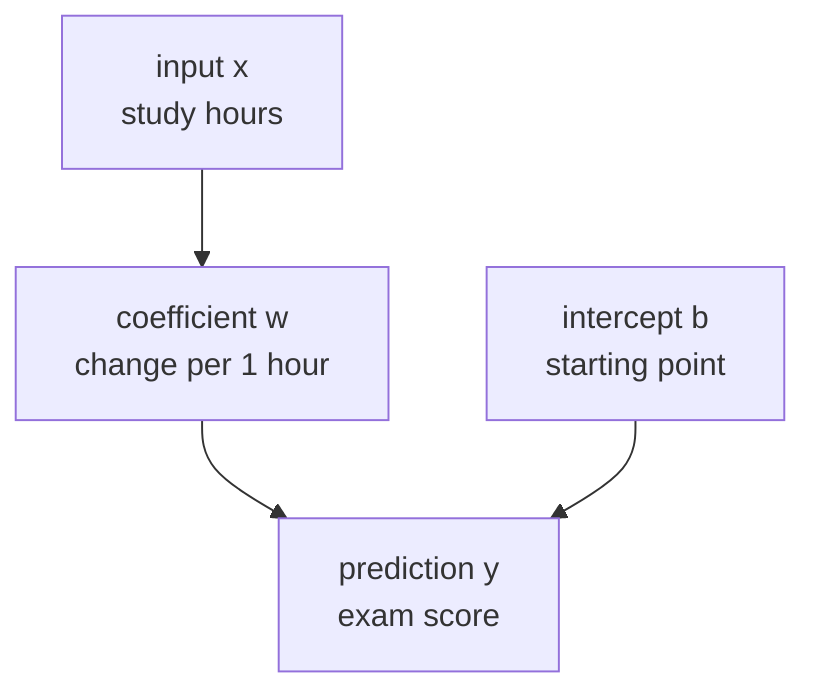
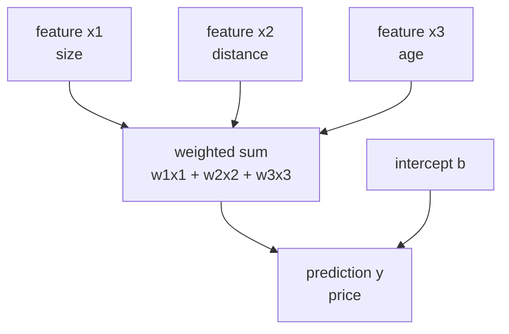
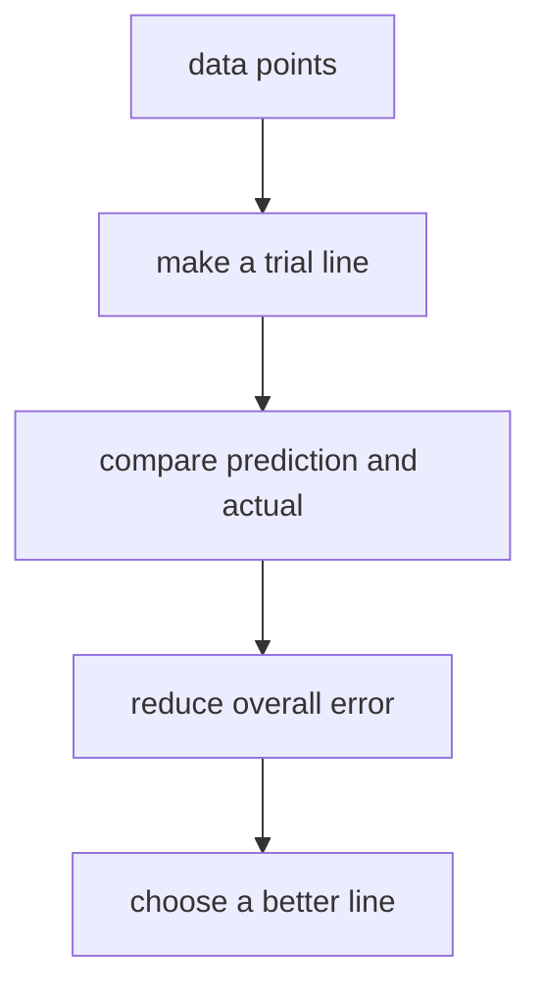
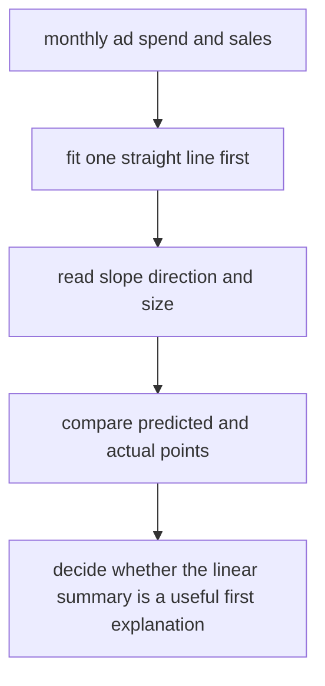

# P4-10.1 Intuition Of Linear Regression

> Section ID: `P4-10.1`
> Version: `v2026.07.10`

In P4-9.2, tuning and validation cost were used to examine `how promising settings should be compared`. Now it is time to connect that comparison procedure to one actual algorithm.

The reason linear regression is chosen as the first algorithm of Part 4 is clear. Linear regression is both the most basic starting point of a regression problem and a model that shows the relationship between input and output most transparently through `slope` and `intercept`.

The central question of this Section is the following.

How can a relationship such as `as the input grows, the output also grows or shrinks` be expressed in the simplest possible model?

Linear regression is a model that first answers this question with `a line`.

This Section explains the basic meanings of `regression`, `linear regression`, `coefficient`, and `intercept`. The later Sections continue judgment in the current context on top of these handles, and the basic intuition for reading continuous-value prediction through a line reconnects through this Section and the [concept glossary](../../../reference/concept-glossary.md).

## Scope Of This Section

This Section answers the following questions.

- What kind of problem does regression handle?
- Why is linear regression said to express a relationship with `a line`?
- How can the direction and size between input (feature) and output (target) be read?
- Why is linear regression learned as the first algorithm of Part 4?

This Section does not treat the following topics deeply.

- the statistical properties of residuals
- the rigorous derivation of ordinary least squares
- multicollinearity, regularization, and assumption testing
- detailed comparison of evaluation metrics such as R², MAE, and RMSE

Evaluation metrics and residual interpretation continue immediately in the next Section, P4-10.2. Basic reading of multicollinearity, assumption testing, and regression diagnostics is reorganized again in the supplementary learning of P4-10.3. A broader perspective on regularization and related hyperparameters reconnects again through P4-9.1 and P4-9.2.

## Goals Of This Section

- You can explain regression as `the problem of predicting continuous values`.
- You can describe linear regression as `a model that first approximates the relationship between input and output with a line`.
- You can explain that the word linear means `reading the whole input as a fixed weighted sum`.
- You can explain the intuition of slope (coefficient) and intercept.
- You can explain at an introductory level what linear regression is trying to reduce.
- You can understand why linear regression is both a good baseline and a good starting point.

## Learning Background

The earlier part of Part 4 first organized data splitting, baselines, tuning, and evaluation criteria. The reason was to let readers first understand `what kind of problem is being solved in what form`, rather than memorizing algorithm names first.

In this curriculum, linear regression plays the following role.

| Curriculum position | Role of linear regression |
| --- | --- |
| after P4-4 regression and classification | connects a regression problem to an actual model |
| after P4-8 baselines | provides a first comparison model that is simple but interpretable |
| before classification models after P4-11 | prepares the difference between continuous-value prediction and probabilistic classification |

In other words, linear regression does not come first because it is `the easiest algorithm`, but because it is `the algorithm that makes the relationship between input and output easiest to explain`.

## Main Learning Content

### What Kind Of Problem Does Regression Handle?

Regression is not a problem of matching a category like classification, but a problem of predicting a continuously changing numeric value.

For example:

| Work situation | Value to predict |
| --- | --- |
| predict a house price from house size and location | price |
| predict sales from ad spending and season information | sales amount |
| predict delivery time from travel distance and traffic conditions | time |
| predict a final score from study time and assignment score | score |

The common point in these problems is that the output is a number, not `yes/no`.

`Regression is the problem of estimating one continuous value from the input.`

### Why Does Linear Regression Express A Relationship With A Line?

The scikit-learn linear model documentation explains linear regression as a family of models that learns the relationship between observed values and a linear combination. This Section rewrites that in the form of an easier question.

`If the input increases a little, then on average how much does the output increase?`

The simplest equation that answers this question has the following form.

\[
y = wx + b
\]

- `x`: input
- `y`: prediction
- `w`: coefficient
- `b`: intercept

The coefficient `w` means `how much y changes when x changes by 1`. The intercept `b` is the starting point the model places when the input is 0.

If this structure is read like a picture, it looks as follows.



This diagram shows single-variable linear regression as `a structure where one input passes through a coefficient and an intercept to become a prediction`. The key is to first hold on to the fact that linear regression is not a model that memorizes data, but a model that reads numerically how a change in input pushes up or pulls down a change in output.

The key point is that linear regression is not `a model that claims reality is a perfect line`, but `a model that checks whether there is a relationship that can first be explained with a line`.

But one more point must be stated more precisely here. Readers often remember linear regression only as `a model that always draws one line on a two-dimensional graph`. That memory is correct for a single-variable example, but too narrow for explaining the algorithm itself.

### What Does The Word Linear Exactly Mean?

The word linear in linear regression is usually introduced first through the picture of `a line`, but theoretically it is closer to meaning `the inputs are read as a weighted sum`.

When there is one input:

\[
y = wx + b
\]

and when there are many inputs, it expands as follows.

\[
y = w_1x_1 + w_2x_2 + \cdots + w_nx_n + b
\]

In other words, linear regression places one coefficient on each input feature and makes the final prediction by adding their contributions.

`Linear regression is a model that assigns a number to the influence of each input, then adds those influences together to make one prediction.`

If this point is drawn simply, it looks as follows.



This diagram shows that even when there are many inputs, the core structure of linear regression stays the same. Even if each feature carries its own meaning, the model ultimately gathers them as a weighted sum and makes one prediction. That is the central intuition of `linear`.

So in a single-variable example it is read as `a line`, while with two or more variables it is read as `a plane` or a higher-dimensional `linear relationship`. Readers do not need to understand all mathematical ideas of dimension here. It is enough to hold on to the fact that `even if inputs increase, the structure remains a weighted sum`.

### Why Is The Assumption Of A Line Useful?

Most real data are not placed on a perfect line. Even so, linear regression remains important for three reasons.

1. It allows the simplest explanation to be tried first.
2. The coefficient and intercept are relatively easy to interpret.
3. It becomes a criterion for judging whether a more complex model is really necessary.

For example, if exam scores generally rise as study time increases, linear regression first summarizes with a line `how many points of change, on average, one additional hour is connected to`.

Even if that line is not perfect, it immediately lets readers answer questions such as the following.

- Is the direction of the relationship positive or negative?
- Is the size of the change large or small?
- Is there a pattern that is being missed because the model is too simple?

In other words, linear regression is less a tool that contains all of reality and more like the first coordinate axis for starting to read reality.

### What Does Linear Regression Learn?

In an algorithm Section, the intuition `it reads with a line` is not quite enough. It is also necessary to state what the model is actually learning.

Linear regression makes predictions for data points and adjusts the coefficients and intercept so that the differences between those predictions and the actual values become small overall.

At each data point there are:

- an actual value
- a prediction
- the difference between them (a residual or error)

Linear regression chooses a line in the direction that keeps these differences from becoming too large overall.

scikit-learn's `LinearRegression` basically uses a solution corresponding to ordinary least squares. This flow can be read immediately through the following sentence.

`A method that tries to find the line that leaves the least overall prediction error on the whole dataset`

What matters here is not yet a rigorous proof or matrix calculation, but the fact that the line is not chosen by `drawing a line that looks good by eye`, but by `choosing the line according to a criterion that reduces error`.

If this flow is drawn in the simplest way, it looks like this.



This diagram shows that linear regression is not simply drawing a line, but moving toward a better line under a criterion that reduces error. In other words, more than the visible shape of the line, the core of the algorithm is `how it tries to reduce the difference between prediction and reality overall`.

That means linear regression is both `a model that draws a line` and `a model that reduces error`. The word algorithm becomes clearer precisely from this second perspective.

### When Is It Good To Raise Linear Regression As A First Candidate?

Linear regression is not first because it is `the simplest regression model`, but because it is often a good starting point for reading the direction and size of a relationship most transparently.

| Current problem state | Why linear regression should be raised first | What to check first |
| --- | --- | --- |
| The goal is continuous-value prediction. | because it is easy to interpret as a baseline for a regression problem | whether the output is numeric rather than categorical |
| You want to read the direction between input and output first. | because the relationship is easy to explain through coefficients and intercept | the effect of units and preprocessing on interpretation |
| It is still unclear whether a complex model is necessary. | because it lets readers first check whether a simple model already explains the problem to some degree | whether error improves beyond the baseline |
| Explainability matters. | because each feature's contribution is easy to explain through a weighted-sum structure | whether correlation and causation are being confused |
| A first comparison model is needed in a regression experiment. | because it creates a starting point against which later, more complex models can be compared | whether there is a nonlinear relationship or a missing feature |

The core of this table is not that linear regression is `always a good model`, but that it is a `comparison model that reveals the structure of the problem first`.

## Detailed Learning Content

### What Misunderstandings Appear Most Often In Interpretation?

Mistakes happen more often in interpretation than in formulas with linear regression. The following three points in particular cause confusion often.

### 1. It Is Easy To Mistake A Large Coefficient For An Always Important Feature

It cannot be concluded that a feature is automatically more important just because the coefficient value is large.

That is because the size of the coefficient is affected by the scale and measurement unit of the input.

- If the input is `time`, then one unit is one hour.
- If the input is `won`, then one unit may be one won.
- If the input is `kilometers`, then one unit is one kilometer.

Therefore, if readers directly compare only the coefficient numbers of features with different units, interpretation can become unstable.

`A coefficient is especially useful for reading direction, while comparison of size must be read together with units and preprocessing.`

### 2. It Is Easy To Mistake A Positive Coefficient For A Cause

What linear regression shows first is `a tendency to move together`. That does not immediately mean causality.

For example, even if ad spending and sales rise together, the number alone does not allow readers to conclude that increasing ad spending is the only cause of increasing sales.

There can also be other explanations in between, such as:

- seasonal effects
- promotion periods
- existing brand awareness
- unmeasured external variables

That means the coefficients of linear regression are first interpretation tools that show `the direction and size of a relationship`, not tools that automatically prove a cause.

### 3. Predictions Can Be Read As If They Were Actual Values

The output of linear regression is not a value copied directly from the real world, but an estimate obtained under the current data and the current assumptions.

For example, an output such as `study time 7 hours -> predicted score 76.4` means:

- not that the student will definitely get 76.4 points
- but that according to the currently learned line, a value near there is expected

This difference must be understood in order to prepare for reading residuals and errors in the next Section.

### What Assumptions Does Linear Regression Place Implicitly?

When learning an algorithm, it is important to build the habit of first seeing `how this model simplifies the world`, even before performance. Linear regression places the following simplifications.

### 1. The Relationship Is Largely Linear

It assumes that when the input changes, the output also moves in a roughly consistent direction and proportion.

For example, scores may rise as study time increases, but in reality the amount of increase can shrink after a certain range. Even so, linear regression first summarizes the whole thing in the direction of one line.

### 2. The Influence Of Each Input Can Be Added

When there are many features, linear regression reads them first not through complex interactions, but as `the sum of each feature's contribution`.

For example, if size, distance, and age all affect house prices, linear regression first reads them as the sum of how much each factor contributes to the price.

### 3. Error Remains As The Unexplained Part

The model cannot explain all variation in reality. Linear regression leaves the unexplained difference as error and fits the model so that this error becomes small overall.

These three points do not explain the whole set of rigorous statistical assumptions, but they are key criteria for understanding the worldview of linear regression.

`Linear regression is a model that simplifies a relationship into a sum of consistent directions and treats the remaining gap as error.`

### Why Does Linear Regression Become A Good First Baseline?

Linear regression is often used as a baseline model because of its explainability and simplicity.

If readers run linear regression before looking at a complex model, they can check the following.

- Can the problem already be explained to some extent by only a simple linear relationship?
- Does the direction between the feature and the target match expectation?
- How necessary is a more complex model?

In other words, linear regression is useful not only as a model that aims at high performance, but also as a reference model that first tests `how linearly the problem can be read`.

Linear regression is also especially useful for interpretation training. More complex models may achieve slightly better performance, but often make it difficult to explain immediately why such a prediction came out. By contrast, linear regression at least makes the following questions relatively easy to answer.

- In what direction did it read the relationship?
- As which input increases, does the prediction increase together?
- Is the problem too rough to be explained by a single line?

That means linear regression is not only the starting point of performance, but also `the starting point of interpretation`.

This comparison also connects to the later algorithm Sections.

- In P4-11 logistic regression, the line is read instead as a probabilistic classification boundary.
- In P4-14 decision trees, the relationship is read through branching rules rather than a line.
- In P4-15 random forests, several trees are combined to handle nonlinear relationships.

## Cases And Examples

### Case 1. How Can The Statement `If Ad Spending Increases, Sales Also Increase` Be Expressed In The Simplest Way?

A small online shopping team wants to read the relationship between monthly ad spending and sales first. The criteria people first looked at were questions such as `In months with higher ad spending, does the number of orders rise together?` and `Is a similar flow visible even in ordinary months without events?`

At this point, the team tries the simplest linear regression before a more complex model. If the average movement of sales as ad spending increases is summarized by one line, the direction of the relationship, whether positive or negative, and the rough size of the change can be read immediately. Even if reality is not a perfect line, this is still sufficiently useful as a first reference point for seeing `what change one unit of increase makes on average`.

In this scene, linear regression is not a model that asserts `reality is a line`, but a model that asks `can this first be explained with a line?` If the relationship between ad spending and sales moves mostly in the same direction, the coefficient and intercept become the first explanation that shows that relationship most transparently.

The confirmable result appears in the learned line and in the interpretation of the coefficients. If the coefficient is positive, readers can read the tendency for increased ad spending and increased sales to move together. By looking at the gap between predictions and actual values, they can also immediately check how rough it is to explain the situation with only one line.



## Cases And Examples

### Reading Single-Variable Linear Regression In The Simplest Way

Consider an example with study hours and exam scores.

| study_hours | exam_score |
| --- | --- |
| 1 | 52 |
| 2 | 55 |
| 3 | 61 |
| 4 | 64 |
| 5 | 68 |
| 6 | 72 |

When readers look at this data, the score does not rise by a perfectly constant amount, but in general the score rises as time increases. Linear regression tries to find one line like the following in this scene.

`A line in which scores also rise on average as study time increases`

The key point here is not to find `a line that passes through every point exactly`, but to find `a line that most reasonably explains the overall direction`. As seen just above, linear regression chooses a better line under the criterion of reducing the gap between prediction and reality, and then uses the result for prediction on new inputs as well.

If this expression is turned a little more theoretical, it becomes the following.

- Error can remain for each individual data point.
- But over the whole dataset, some lines leave smaller error and others leave larger error.
- Linear regression chooses `the line that reduces overall error better`.

In other words, linear regression is not a model that perfectly fits each point, but `a model that summarizes the overall trend most economically`.

### How Should Coefficients And Intercepts Be Read?

When first learning linear regression, many readers see the formula but miss the meaning. This Section fixes interpretation before calculation.

### Coefficient

The coefficient shows in what direction and by how much the output changes when the input changes.

- coefficient > 0: a tendency for the output to rise as the input rises
- coefficient < 0: a tendency for the output to fall as the input rises
- large coefficient magnitude: the output changes more sensitively as the input changes

For example, if expected sales rise on average by 3 units when ad spending rises by 1 unit, the coefficient can be read roughly as `+3`.

But two points must always be seen together in interpretation.

- `direction`: does it increase or decrease?
- `unit`: what does one unit of input actually mean?

For example, the meaning of the same number 3 is completely different depending on whether the input is `one hour of study time` or `10,000 won of ad spending`. Therefore, a coefficient should be read less as a bare number and more as the sentence `when what changes by one unit, what changes by how much`.

### Intercept

The intercept is the starting point the model places when the input is 0. But the intercept is not always something that can be interpreted realistically.

For example, predicting a test score when study time is 0 can be read to some extent in context, but interpreting a house price at a size of 0 square meters may not have much practical meaning.

Therefore, the intercept is read as follows.

`It is the mathematical starting point of the model, but whether it can be interpreted directly depends on the domain.`

## Practice And Examples

### A Small Linear Regression In Python

The example below is a very small linear-regression exercise that predicts exam scores (`exam_score`) from study hours (`study_hours`).

- problem situation: roughly predict a score from study time
- input: study hours
- label: actual exam score
- concepts to check:
  - linear regression learns one line
  - `coef_` is the coefficient, and `intercept_` is the starting point
  - a continuous-value prediction can be made for a new input

```python
import numpy as np
from sklearn.linear_model import LinearRegression

study_hours = np.array([1, 2, 3, 4, 5, 6]).reshape(-1, 1)
exam_score = np.array([52, 55, 61, 64, 68, 72])

model = LinearRegression()
model.fit(study_hours, exam_score)

pred_2 = model.predict([[2]])[0]
pred_7 = model.predict([[7]])[0]

print("sample count      :", len(study_hours))
print("coefficient       :", round(model.coef_[0], 3))
print("intercept         :", round(model.intercept_, 3))
print("prediction at x=2 :", round(pred_2, 3))
print("prediction at x=7 :", round(pred_7, 3))
```

An example execution result is as follows.

```text
sample count      : 6
coefficient       : 4.114
intercept         : 47.6
prediction at x=2 : 55.829
prediction at x=7 : 76.4
```

This result can be read as follows.

- The coefficient of about `4.114` means that when study time increases by 1 hour, the score rises on average by about 4 points.
- The intercept of about `47.6` is the mathematical starting point placed by the model.
- The prediction at `x=7` shows that even for a new input not present in training, the model can still make a continuous value along the learned line.

What matters here is not yet `exactly how many points were correct`, but `whether the direction and size of the relationship were read through a line`.

If this interpretation is written more carefully, it becomes the following.

- In this example, the direction `as study time increases, scores also rise` was read.
- But that does not mean every range has exactly the same amount of increase.
- The predicted value 76.4 means `the current line model estimates it that way`, not that the actual score must be that value.

In other words, the first interpretation of linear regression is not `an exact prediction of the future`, but `a simple summary of a relationship`.

### Reading Several Coefficients In Python

A single-variable example is good for catching the feel of a line, but real work data usually have several features. The example below is a small multivariable linear-regression exercise that predicts `final_score` from three features: `study_hours`, `attendance`, and `assignment_score`.

- problem situation: predict a final score by looking at study time, attendance, and assignment score together
- input: three numeric features
- label: final score
- concepts to check:
  - linear regression places one coefficient on each feature
  - direction can be read from the sign of the coefficient
  - the size of the coefficient must be read carefully together with units

```python
import numpy as np
from sklearn.linear_model import LinearRegression

X = np.array([
    [2, 80, 60],
    [3, 82, 65],
    [4, 85, 70],
    [5, 88, 72],
    [6, 90, 78],
    [7, 93, 83],
])

y = np.array([58, 63, 67, 71, 77, 82])

feature_names = ["study_hours", "attendance", "assignment_score"]

model = LinearRegression()
model.fit(X, y)

new_student = np.array([[5, 89, 75]])
pred_new = model.predict(new_student)[0]

print("sample count :", len(X))
for name, coef in zip(feature_names, model.coef_):
    print(f"{name:17}: {coef:.3f}")
print("intercept         :", round(model.intercept_, 3))
print("prediction new    :", round(pred_new, 3))
```

An example execution result is as follows.

```text
sample count : 6
study_hours      : 2.174
attendance       : 0.609
assignment_score : 1.130
intercept         : -6.391
prediction new    : 73.12
```

This result can be read as follows.

- Because the coefficient of `study_hours` is positive, if the other conditions are the same, it is read in the direction that predicted scores rise as study time rises.
- Because `attendance` and `assignment_score` are also positive, all three features in this example contribute in the direction of increasing the score.
- But readers should not immediately conclude from `2.174` and `0.609` that `study time is more than three times as important as attendance`. The units and distributions of the two features may differ.
- A negative intercept does not mean `scores are negative in reality`. This too is read as the mathematical starting point of the model.

This multivariable example shows linear regression again in the following way.

`A model that reads the influence of several features separately, then adds those influences together to make one prediction`

### Change One More Value: If One Input Is Raised, What Stays The Same And What Changes?

This time, keep `attendance` and `assignment_score` fixed for the same student and raise only `study_hours` from `5` to `7`.

```python
import numpy as np
from sklearn.linear_model import LinearRegression

X = np.array([
    [2, 80, 60],
    [3, 82, 65],
    [4, 85, 70],
    [5, 88, 72],
    [6, 90, 78],
    [7, 93, 83],
])

y = np.array([58, 63, 67, 71, 77, 82])

model = LinearRegression()
model.fit(X, y)

student_base = np.array([[5, 89, 75]])
student_more_hours = np.array([[7, 89, 75]])

pred_base = model.predict(student_base)[0]
pred_more_hours = model.predict(student_more_hours)[0]

print("prediction at [5,89,75] :", round(pred_base, 3))
print("prediction at [7,89,75] :", round(pred_more_hours, 3))
print("difference              :", round(pred_more_hours - pred_base, 3))
```

An example execution result is as follows.

```text
prediction at [5,89,75] : 73.12
prediction at [7,89,75] : 77.468
difference              : 4.348
```

### What Stays The Same And What Changes?

- What stayed the same: when the other features are fixed, the direction of the `study_hours` coefficient remains the same. As study time rises, the predicted score also rises.
- What changed: even though only one input changed, the predicted value rises by about `4.348` points. In other words, linear regression makes readers read change through the intuition of `input change amount x coefficient`.
- The judgment to leave first: this change is an estimated change made by the current model, not a guarantee that reality will rise by the same amount. Units and data range must be read together.

### How Does This Exercise Recover The Goal Of Part 4?

This exercise recovers linear regression not as `a model for memorizing a line`, but as a starting point for reading `in what direction and by what size the prediction moves when one input changes`. What matters in Part 4 is not knowing the names of coefficients, but explaining `what was fixed and what changed` by actually changing one value. Only with this repeated exercise can later baseline comparison, residual interpretation, and judgments about adding features continue in the same language.

| Shared recording language | What should be left immediately from this exercise |
| --- | --- |
| structure that appeared | when one feature alone changed for the same student, the prediction moved continuously in the direction of the coefficient |
| boundary of interpretation | the difference in predicted values does not immediately mean a real causal effect or a guaranteed improvement in performance |
| next question | should readers check again whether the same change still holds outside the training range, and whether it remains valid once residuals and baseline comparison are added |

### The Basic Order For Reading Numbers In This Section

When readers see numbers in an algorithm Section, it is easy to jump directly to `the performance is good` or `the prediction is correct`. In linear regression, the following order should be used instead.

1. First confirm that this problem is regression.
2. Confirm what the input and output are.
3. Read the direction from the sign of the coefficient.
4. Read the size of change from the unit of the coefficient.
5. Confirm whether the intercept is interpretable in context.
6. Remember that a prediction is an estimate, not an actual value.

The key is that there is `an order for reading numbers`. Linear regression must be read under interpretation rules like these, rather than trusting the calculation result immediately.

## Perspectives To Remember In This Section

- Regression is the problem of predicting continuous values.
- Linear regression is a model that first approximates the relationship between input and output with a line.
- The coefficient shows the direction and size of change, and the intercept shows the starting point of the model.
- The coefficient number must be read together with units, and a positive relationship should not immediately be read as a cause.
- Linear regression is not a model that explains reality perfectly, but the first model for starting to read a relationship in the simplest way.
- A prediction is not the actual value, but an estimate produced by the current model.
- Before viewing more complex models, linear regression is used like a baseline.

## Quick Check

- Did you first confirm that the current problem is continuous-value prediction?
- Can you explain from the baseline perspective why linear regression is used as the first interpretable comparison model?
- Are you looking at units and context together rather than immediately reading the coefficient number as importance or cause?

## When Should This Perspective Be Brought To Mind First?

- Bring the perspective of linear regression to mind when you first need to confirm again that the current problem is not classification but continuous-value prediction.
- Return to this Section when you need to explain again why linear regression is placed as the first interpretable baseline candidate and how far the meaning of the coefficient should be read.
- This Section becomes the criterion when you need to organize why a line is still a useful starting point even if it is not perfect.

- Did you distinguish that the current problem is regression rather than classification?
- Did you understand that the output of linear regression is a continuous value rather than a category?
- Can you explain coefficients and intercepts as meanings rather than just as formulas?
- Can you explain why linear regression becomes a good first baseline?
- Can you explain why a line is still useful even if it is not perfect?

## Connection To The Next Section

In this Section, linear regression was first read as `a model that reads a relationship with a line`. In the next Section, P4-10.2, the discussion moves to how well that line actually fit, in what cases it easily becomes distorted, and how residuals and errors should be read.

In other words, if P4-10.1 is the Section that looks at `the shape of the model`, then P4-10.2 is the Section that reviews `how appropriate that shape was`.

## Sources And References

- scikit-learn, `1.1. Linear Models`, scikit-learn User Guide, accessed on 2026-06-26. [https://scikit-learn.org/stable/modules/linear_model.html](https://scikit-learn.org/stable/modules/linear_model.html){: target="_blank" rel="noopener noreferrer" }
- scikit-learn, `LinearRegression`, scikit-learn API Reference, accessed on 2026-06-26. [https://scikit-learn.org/stable/modules/generated/sklearn.linear_model.LinearRegression.html](https://scikit-learn.org/stable/modules/generated/sklearn.linear_model.LinearRegression.html){: target="_blank" rel="noopener noreferrer" }
