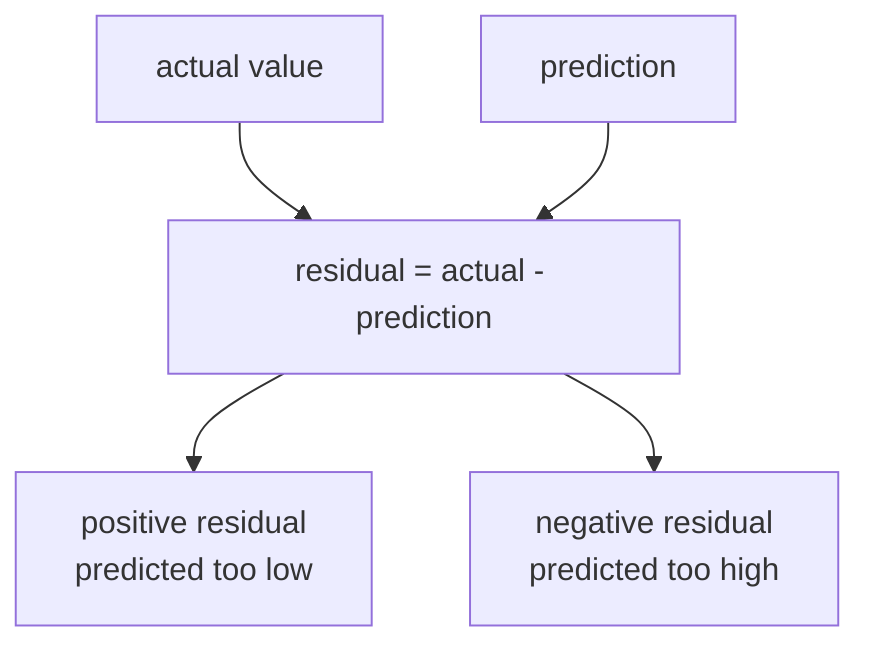
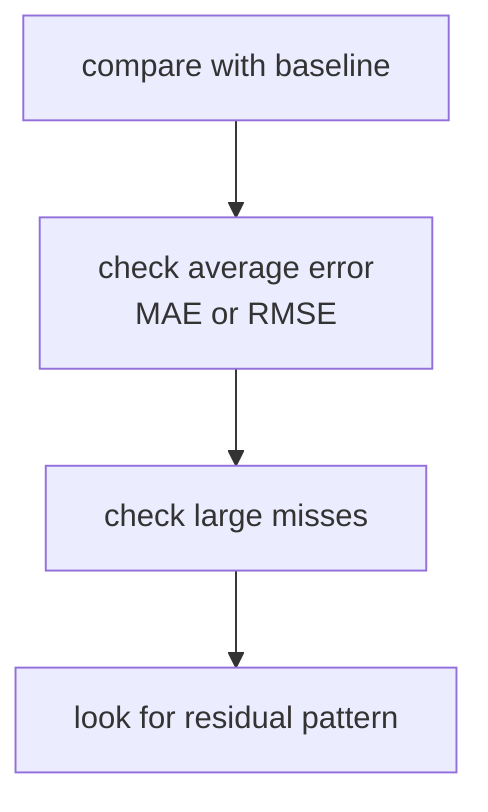
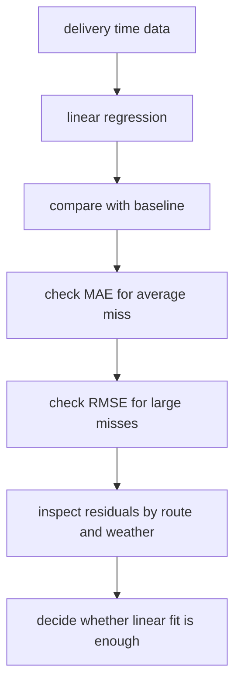

# P4-10.2 Evaluation And Limits Of Linear Regression

> Section ID: `P4-10.2`
> Version: `v2026.07.10`

In P4-10.1, linear regression was read as `a model that first reads a relationship through a line`. Now the discussion moves to the next question.

How well did that line actually fit, and from what point does it start failing easily?

This question is exactly the starting point of evaluation and limits.

After learning linear regression, readers often stop at `the coefficient looks plausible` or `the predicted values look similar enough`. But in an algorithm Section, one more step is necessary. Readers must look together at how the gap between prediction and reality should be read, by what metric it should be summarized, and when the assumption of a line becomes too strained.

In other words, this Section does not stop at `a line was drawn`, but reads `how much that line explained the data`.

This Section does not repeat at length the basic definition of linear regression. The core intuition of `a model that reads a relationship through a line` reconnects through P4-10.1 and the [concept glossary](../../../reference/concept-glossary.md), while this Section focuses only on evaluation and limits.

## Scope Of This Section

This Section answers the following questions.

- How should residuals and errors be understood?
- What does it mean to say that the prediction of linear regression fits well?
- How can MAE, MSE, RMSE, and R² be distinguished at an introductory level?
- What limits appear when the assumption of a line breaks down?
- How far should the result of linear regression be trusted, and from where should readers become cautious?

This Section does not treat the following topics deeply.

- statistical significance testing
- rigorous testing of residual normality and homoscedasticity
- multicollinearity diagnosis
- advanced regression regularization and feature engineering

Basic reading of regression diagnostics, significance testing, and the interpretation of multicollinearity is reorganized again in the supplementary learning of P4-10.3. A broader perspective on regularization and related hyperparameters reconnects again through P4-9.1 and P4-9.2. The broader flow of feature engineering reconnects again through P4-7.1, P4-7.2, and P4-18.1, P4-18.2.

## Goals Of This Section

- You can explain a residual as `the difference between the actual value and the prediction`.
- You can explain MAE, MSE, RMSE, and R² as metrics seen from different perspectives.
- You can distinguish metrics that react more sensitively to large errors from metrics that react less sensitively.
- You can explain typical situations in which linear regression does not fit well.
- You can understand why readers should not overtrust linear regression by looking at only one good number.

## Learning Background

P4-10.1 introduced linear regression as `the first model that summarizes a relationship`. But once a model has been built, readers must next read `how correct it was`.

- Even if a line exists, prediction error remains.
- If error remains, readers must choose how to summarize its size.
- Even if the metric looks good, the model should be doubted again if the line missed a structural pattern.

Therefore, in an algorithm Section this Section plays the following role.

| Curriculum position | Role of this Section |
| --- | --- |
| after P4-10.1 | connects intuitive interpretation to numerical evaluation |
| after P4-6 evaluation metrics | reuses regression metrics in the context of an actual model |
| before other algorithms after P4-11 | provides a criterion for distinguishing `is the prediction correct` from `does the model explain well` |

In other words, if P4-10.1 was the Section that looked at `the shape of the model`, then P4-10.2 is the Section that looks at `the remaining gap in the model`.

In regression evaluation, the following four things must also be left together.

| What to check first | Why it must be seen together |
| --- | --- |
| baseline error | because readers must know whether the line model actually improved over simple mean prediction |
| average error (MAE, RMSE) | because readers must know how far off it is overall |
| regions where large failures occurred | because large errors hidden behind an average must be seen separately |
| representative error cases | because readers must explain in what input conditions the model fails in the same way repeatedly |

In other words, good regression evaluation is not the act of reading one metric and stopping. It is the act of checking together `did it improve over the baseline`, `how wrong is it on average`, `where is it very wrong`, and `in what scene does that failure repeat`.

If one more point is fixed here, the comparison structure learned in the classification Sections continues directly into the regression Sections. In regression too, a baseline can be a `reference model` such as simple mean prediction, and it can also be a `comparison baseline` that places recent prediction error next to the usual error distribution. That means regression evaluation is also not the act of looking at absolute error numbers alone, but proceeds in the structure of reading together `is the current error larger than usual` and `does it repeat only in a specific interval`. Here too, a large error is first read as a signal of change, and explanation of cause is added only after missing features or interval differences are checked again.

That means the comparison frame in regression evaluation must also be tied together as one. If baseline error, current model error, and error distribution in the recent interval are read separately in different units or different intervals, it becomes hard to say `what actually improved`.

| What should be left together before regression evaluation | Why it is needed |
| --- | --- |
| baseline error | because readers must first see whether it really improved over mean prediction |
| regions where large errors concentrated | because failure regions hidden behind the average must be seen immediately |
| a sentence about the boundary of error interpretation | because even when a large error appears, the cause should not be fixed immediately |
| next review priority | because readers must decide what interval to inspect further and what feature to strengthen |

## Main Learning Content

### What Is The Difference Between Residual And Error?

When these two terms are first seen, they can look similar, but this book distinguishes them as follows.

- residual: `actual value - prediction` for an individual data point
- error: a general word that refers to the difference left by a model

For example, if the actual score is 72 and the prediction is 68, the residual is `72 - 68 = 4`. Conversely, if the actual score is 64 and the prediction is 67, the residual is `64 - 67 = -3`.

What matters here is sign and size.

- positive residual: the model predicted too low
- negative residual: the model predicted too high
- large absolute value: at that data point the prediction missed by more

If this difference is drawn simply, it looks as follows.



This diagram makes readers read a residual not as a simple failure mark, but as `a gap with direction`. Readers must see together whether the prediction was lower or higher than reality, so that later it becomes possible to suspect whether the model is leaning in one direction in a certain interval.

The key point is that a residual is not a simple `mistake`, but a signal that shows `in what direction and by how much it was wrong`.

### What Does It Mean That The Prediction Of Linear Regression Fits Well?

In regression, unlike classification, it is difficult to divide results immediately into `correct/incorrect`. Numeric prediction usually misses by a little. So when reading a regression model, readers first look not at `how often was it correct`, but at `how far off was it on average`.

Suppose there are two models such as the following.

| Model | Character of the error |
| --- | --- |
| Model A | usually misses by about 2 to 3 points |
| Model B | is similar most of the time, but sometimes misses by 20 points |

Both can look plausible on average, but in real use B can be more dangerous. That is why the core of regression evaluation is `how the error is summarized`.

That means the phrase `it fits well` in regression usually has to be reopened through questions like the following.

- How far off is it on average?
- Are there frequent large errors?
- Did it really improve over the baseline?
- Is there a structural pattern that the line misses?

### How Should MAE, MSE, And RMSE Be Distinguished?

The scikit-learn regression-metrics documentation provides metrics such as mean absolute error, mean squared error, and coefficient of determination (R²). Readers first understand them not through formulas but through `what kind of failure they penalize more strongly`.

#### MAE (mean absolute error)

MAE is the average of the absolute values of residuals.

- Its interpretation is intuitive.
- It is easy to read how many points, minutes, or units it misses on average.
- It does not exaggerate large errors especially strongly.

In other words, MAE is the metric that shows `how wrong it is on average` in the plainest way.

#### MSE (mean squared error)

MSE averages the squared residuals.

- It is more sensitive to large errors.
- It treats a few large errors more heavily than many small ones.
- Interpretation may be less intuitive because the unit is squared.

In other words, MSE is useful `when readers want to penalize large mistakes more strongly`.

#### RMSE (root mean squared error)

RMSE takes the square root of MSE.

- It keeps the advantage of sensitivity to large errors.
- It becomes easier to read because the unit returns to the original unit of the value.

In other words, RMSE is often used `when readers want to react sensitively to large errors, but still interpret them in the original unit`.

This difference can be summarized very briefly as follows.

| Metric | Introductory interpretation |
| --- | --- |
| MAE | how wrong it is on average |
| MSE | average error that penalizes large errors more strongly |
| RMSE | error that is sensitive to large errors, but read in the original unit |

If it is turned into practical scenes, the difference becomes clearer.

| Work situation | Metric to look at first | Reason |
| --- | --- | --- |
| predicting delivery arrival time | MAE | because readers want to read immediately how many minutes off it is on average |
| predicting hospital waiting time | RMSE | because if a few patients suffer very large delays, readers want to react more sensitively |
| predicting sales | MAE + RMSE | because readers want to see both the average miss and large failures together |
| predicting equipment failure timing | RMSE | because rare large errors can lead to operational risk |

That means metric choice is not a matter of mathematical taste, but connects to the question `what kind of mistake hurts more`.

### What Does R² Show?

R² (score, coefficient of determination) is a number often seen in introductions to linear regression, but it is also easily misunderstood.

`R² is a summary value that shows how much this model explains the data better than simple mean prediction.`

At an introductory level, it can be read as follows.

- R² close to 1: the line explains a fairly large part of the variation in the current data
- R² close to 0: it is not very different from predicting with the mean
- R² can even be negative: it can be worse than mean prediction

What matters here is that R² is easy to read like a simple score of `the higher the better`. But R² alone cannot tell readers whether a few large errors are hiding underneath. Therefore it must be viewed together with error metrics such as MAE and RMSE.

This kind of scene also appears often empirically. For example, in sales prediction most weekdays may fit well, but a few large event days may fail badly. In this case the overall variation can be explained fairly well, so R² can come out high, yet operators may still find the model hard to trust because of those few large failures.

That means R² is strong for `overall explanatory power`, but it does not replace `the felt impact of a few large failures`.

### How Should Metrics Be Read Together?

If only one metric is viewed when reading linear regression, interpretation can become unstable. For example, the following scenes appear.

| Scene | Risk of interpretation |
| --- | --- |
| R² is high | a few large errors may be hiding |
| MAE is low | the model may be wrong structurally in a certain interval |
| RMSE is high | it may be a signal that there are some large failures |

Regression evaluation becomes clearer when it is read in the following order.

1. Did it improve over the baseline?
2. What is the average error?
3. Are there unusually large errors?
4. Are the residuals concentrating in one direction?

If this order is drawn simply, it looks as follows.



This diagram organizes the order for reading regression metrics. Good regression evaluation is not the act of looking at one number, but the act of checking in sequence whether it improved over the baseline, how large the average error is, and whether large failures are hiding.

The key is not to stop at `one number looks good`.

The following three sentences are left together in regression-evaluation notes.

- Change is observed, but the cause is not yet fixed.
- Intervals with large errors are signals that raise review priority.
- Large errors in small-sample intervals should be interpreted more conservatively.

These three sentences all point in the same direction. Regression evaluation also becomes more explainable when readers place `the same baseline, the same interval, and the same representative failures` side by side, rather than reading only `one error number`.

### Which Metric Should Be Read First?

Regression metrics should not simply be listed all at once. The order of reading should become clear depending on what kind of failure readers are currently trying to guard against.

| Current concern | Metric or criterion to look at first | Reason |
| --- | --- | --- |
| You want to know how far off it is on average. | MAE | because it is easy to read plainly in the real unit |
| You want to react more sensitively to large failures. | RMSE or MSE | because they reflect large errors more heavily |
| You want to confirm whether it is truly better than mean prediction. | baseline error + R² | because they show together explanatory power and improvement over a simple criterion |
| You suspect that it fails badly only in a certain interval. | representative error cases + large-error intervals | because failures hidden behind the average must be seen directly |
| You want to see whether recent performance is shaking. | recent error vs. usual baseline | because readers need a comparison frame to see whether the error distribution changed |

The purpose of this table is not to fix one metric forever, but to make the evaluation order clear depending on `what kind of failure readers are trying to read right now`.

## Detailed Learning Content

### What Are The Typical Situations In Which Linear Regression Does Not Fit Well?

The limits of linear regression usually appear when `one line is not enough, but readers keep pushing with one line anyway`.

Representative scenes are as follows.

#### 1. When the relationship is nonlinear

As the input grows, the output may rise quickly at first, then become gentler after a certain point. In such a case, one line has difficulty fitting both the early and the late part well at the same time.

For example, this can happen when scores rise as study time increases, but after a certain amount of time the increase becomes smaller.

#### 2. When the relationship changes by interval

Some data change character before and after a certain interval.

- the price structure of small houses and large houses can be different
- the time pattern of short-distance delivery and long-distance delivery can be different

In such cases, if the whole thing is summarized by one line, it can look plausible on average but keep failing inside each interval.

#### 3. When an important feature is missing

The line itself may not be the problem. An input feature needed for explanation may simply be missing.

For example, if house-price prediction uses only size and leaves out location, the model acts as if it is reading the relationship between size and price, but in reality it misses an important structure.

#### 4. When outliers are strong

Linear regression cannot ignore large errors. If a few data points are unusually far away, the line can be pulled toward them and make overall interpretation unstable.

Practical scenes include cases such as the following.

- delivery time is usually between 5 and 20 minutes, but becomes 90 minutes on one day because of heavy rain
- sales are usually between 20 million and 60 million won, but become 2 billion won because of one special event
- a few ultra-expensive penthouses are mixed into an ordinary housing-price range

Such data can be important events in reality, but when readers try to read the whole thing with one line, they can pull the model too strongly.

That means the limits of linear regression are read not as `the algorithm is bad`, but as a signal that `summarizing the current problem with one line may be too much`.

If this signal is reduced into a practical retrospective note, it can be written as follows.

| Item to leave in retrospective notes | Example |
| --- | --- |
| change from the baseline | `MAE fell, but intervals with large errors remain` |
| repeated failure scene | `it keeps underpredicting in the high-value interval` |
| interpretation boundary | `a nonlinear possibility is visible, but the cause needs further feature review` |
| next question | `is interval splitting or feature addition needed instead of one line` |

## Supplement To The Detailed Learning Content

### Academic Background And History

After seeing evaluation and limits, readers can also understand more clearly the historical background of why linear regression reads error in this way. Behind linear regression there are two flows together.

The first is the flow of least squares. The problem of how to choose the line or equation that best explains data with observational error was very important in early nineteenth-century astronomy and geodesy. In this context, least squares quickly took hold as a method for systematically reducing the difference in observed values.

The second is the flow of the word regression. The term regression became widely known through Francis Galton's studies of heredity and height in the late nineteenth century. At the time, it referred to the tendency of extreme values to return toward the mean in the next generation, and later it broadened in statistics into the name for estimating more general linear relationships.

- least squares came from the history of `a calculation method that reduces error`
- regression came from the history of `statistical interpretation that tries to quantify relationships`
- today's linear regression is the result of these two flows joining together

Once readers know this background, it becomes clearer that linear regression is not merely the first algorithm in a textbook, but a meeting point between `how to handle observational error` and `how to interpret relationships`.

### Where Do The Major Controversies Arise?

Only after seeing the metrics and limits can readers read the controversies around linear regression more accurately. Linear regression itself is an old classical tool, but controversies around interpretation still repeat today. The important controversies are the following four.

#### 1. Treating prediction and explanation as if they were the same thing

Even if a regression equation predicts quite well, that does not allow readers to conclude that the coefficient itself explains the real-world cause. Predictive performance and explaining causality are different problems.

This controversy appears often in data-driven services as well.

- even if sales prediction works well, that does not prove that the ad-spending coefficient itself is a causal effect
- even if house-price prediction works well, that does not allow readers to conclude that one variable alone determines price

That means linear regression helps explanation, but it does not automatically prove causality.

#### 2. Reading a coefficient immediately as importance

Just because a coefficient is large, it cannot immediately be said that the feature is more essential. Scale, preprocessing, and variable-selection method all affect it together.

This controversy appears especially often in multivariable regression. When readers look at coefficients in linear regression, they must ask first not `is it large or small`, but `in what unit was it measured?`

#### 3. Overtrusting a high R²

If R² is high, the model can look as if it explains the data well. But a few large failures, structural errors in certain intervals, and omission of important variables can all hide under a high R².

That means R² is a useful summary, but not a final verdict.

#### 4. The issue between the historical starting point of regression and social interpretation

The term regression spread widely through Galton's heredity research, and around it there was also a history of genetic determinism and eugenics that is critically reviewed today. When learning linear regression in modern statistics and machine learning, readers need the attitude of separating the mathematical tool itself from the social interpretation of that time.

This point is a different kind of controversy from technical limits, but it shows that `explaining a relationship with numbers` does not automatically justify its social meaning.

### Good Linear-Regression Interpretation And Bad Linear-Regression Interpretation

Linear regression has the advantage of high interpretability, but for that same reason premature interpretation also appears easily.

| Bad interpretation | Better interpretation |
| --- | --- |
| the coefficient is positive, so it is the cause | a positive relationship is visible, but the cause needs separate review |
| R² is high, so it is good enough | R² is high, but large errors and residual patterns must also be viewed together |
| the coefficient is large, so it is the most important feature | coefficients must be viewed together with units and preprocessing context |
| the prediction is 76.4, so reality will also be near there | the current model estimates a value near there, but the possibility of error remains |

The following sentence is especially important.

`Linear regression lets explanation begin, but it does not finish explanation.`

## Cases And Examples

### Case 1. Delivery-Time Prediction That Fits Well On Average But Fails Badly In A Specific Customer Interval

A logistics team is predicting arrival time from delivery distance and order time. The criteria people first looked at were relationships such as `does it take longer as distance grows` and `do orders around commuting hours arrive later`.

After running linear regression, overall R² is fairly high and MAE is not bad either. On the surface, the model can look acceptable. But on closer inspection, predictions on long-distance delivery or rainy days fail badly, and RMSE becomes higher than expected because of those large failures.



In this scene, regression evaluation does not end with one number. MAE shows how far off it is on average, RMSE reacts more sensitively to rare large failures, and R² summarizes the size of overall explanatory power. Therefore `R² is high` alone cannot explain the real operational risk.

The confirmable result appears when readers view residuals and metrics together. Even if the average error looks small, if residuals pile strongly in one direction in a certain interval or large failures repeat, that should be read as a signal that linear regression is not sufficiently explaining the structure of that interval. This difference too is first a review-priority signal that tells readers `what interval should be looked at more`, not a sentence that automatically fixes the cause.

## Cases And Examples

### Empirical Example 1. Delivery-Time Prediction

Suppose readers are predicting delivery time in the same region.

| Model | MAE | RMSE | Interpretation |
| --- | --- | --- | --- |
| Model A | 8 minutes | 9 minutes | wrong rather evenly overall |
| Model B | 7 minutes | 18 minutes | average looks better, but large failures are mixed in |

In this case, if readers look only at the average number, B may look better. But if some customers experience delays of 30 or 40 minutes, the actual service experience can be worse instead.

In other words, this empirical example shows why MAE and RMSE must be read together.

### Empirical Example 2. House-Price Prediction

In house-price prediction, most mid-range prices may fit well, but very expensive houses may fail badly.

- MAE may be quite low.
- RMSE may be higher because of the errors on expensive houses.
- R² may also come out high because it explains much of the overall variation.

In this scene, the important question is not `is it okay on average`, but `in what interval is it especially risky`.

In other words, metrics show an overall average, but practical interpretation is complete only when the interval-specific failure pattern is also viewed.

## Practice And Examples

### Viewing Residuals And Metrics Together In A Python Example

The example below reuses the study-time data from 10.1 and checks predictions, residuals, MAE, RMSE, and R² together in a small exercise.

- problem situation: predict exam scores from study time, then check how far off the model was
- input: study time
- label: actual exam score
- concepts to check:
  - residuals arise separately for each data point
  - MAE and RMSE summarize error
  - R² shows how much more the model explains than mean prediction

```python
import numpy as np
from sklearn.linear_model import LinearRegression
from sklearn.metrics import mean_absolute_error, mean_squared_error, r2_score

study_hours = np.array([1, 2, 3, 4, 5, 6]).reshape(-1, 1)
exam_score = np.array([52, 55, 61, 64, 68, 72])

model = LinearRegression()
model.fit(study_hours, exam_score)

pred = model.predict(study_hours)
residuals = exam_score - pred

print("predictions :", np.round(pred, 3))
print("residuals   :", np.round(residuals, 3))
print("MAE         :", round(mean_absolute_error(exam_score, pred), 3))
print("RMSE        :", round(mean_squared_error(exam_score, pred) ** 0.5, 3))
print("R2          :", round(r2_score(exam_score, pred), 3))
```

An example execution result is as follows.

```text
predictions : [51.714 55.829 59.943 64.057 68.171 72.286]
residuals   : [ 0.286 -0.829  1.057 -0.057 -0.171 -0.286]
MAE         : 0.448
RMSE        : 0.608
R2          : 0.992
```

This output can be read as follows.

- Because residuals are mixed between positive and negative, the pattern of continuously failing in only one direction is not strong.
- MAE of about `0.448` means that on average the model misses by about 0.45 points.
- RMSE of about `0.608` is an average error that reflects large errors a little more sensitively.
- R² of about `0.992` shows that in this small example the line explains the variation of the data quite well.

But even here there are points to be cautious about.

- This example is small and simple.
- It was evaluated again on the same points as the training data, so it can differ from real generalization performance.
- Just because the numbers came out neatly does not mean linear regression is sufficient for every regression problem.

That means metrics are tools that help interpretation, not tools that deliver a final verdict all at once.

### Seeing How An Outlier Shakes Metrics In A Python Example

The example below deliberately inserts one large error into the last point of data with the same overall flow and shows how MAE and RMSE react differently.

Problem situation:

- assume a scene where most points follow a similar pattern, but one data point misses badly

Input:

- actual value array `actual`
- ordinary prediction `pred_good`
- prediction `pred_outlier` with a large error at the last point

Expected output:

- MAE in the two cases
- RMSE in the two cases

Concepts to check:

- MAE shows the average miss
- RMSE reacts more sensitively to one large failure

```python
import numpy as np
from sklearn.metrics import mean_absolute_error, mean_squared_error

actual = np.array([52, 55, 61, 64, 68, 72])
pred_good = np.array([51, 56, 60, 65, 67, 73])
pred_outlier = np.array([51, 56, 60, 65, 67, 90])

print("good MAE    :", round(mean_absolute_error(actual, pred_good), 3))
print("good RMSE   :", round(mean_squared_error(actual, pred_good) ** 0.5, 3))
print("outlier MAE :", round(mean_absolute_error(actual, pred_outlier), 3))
print("outlier RMSE:", round(mean_squared_error(actual, pred_outlier) ** 0.5, 3))
```

An example execution result is as follows.

```text
good MAE    : 1.0
good RMSE   : 1.0
outlier MAE : 3.833
outlier RMSE: 7.431
```

This output is very useful for interpretation training.

- In the `good` prediction, MAE and RMSE are nearly the same.
- In the `outlier` prediction, where the last point fails badly, MAE also rises, but RMSE reacts much more strongly.

In other words, empirically the statement that RMSE is `a metric that dislikes large failures more` appears directly in the numbers.

### Change One More Value: If One Large Failure Becomes Two Points, What Stays The Same And What Changes?

This time, instead of having only the last point fail badly, the scene is changed so that the last two points fail badly together.

```python
import numpy as np
from sklearn.metrics import mean_absolute_error, mean_squared_error

actual = np.array([52, 55, 61, 64, 68, 72])
pred_outlier = np.array([51, 56, 60, 65, 67, 90])
pred_two_outliers = np.array([51, 56, 60, 65, 84, 90])

print("one-outlier MAE :", round(mean_absolute_error(actual, pred_outlier), 3))
print("one-outlier RMSE:", round(mean_squared_error(actual, pred_outlier) ** 0.5, 3))
print("two-outlier MAE :", round(mean_absolute_error(actual, pred_two_outliers), 3))
print("two-outlier RMSE:", round(mean_squared_error(actual, pred_two_outliers) ** 0.5, 3))
```

An example execution result is as follows.

```text
one-outlier MAE : 3.833
one-outlier RMSE: 7.431
two-outlier MAE : 6.5
two-outlier RMSE: 8.91
```

### What Stayed The Same And What Changed?

- What stayed the same: in both cases RMSE reacts more strongly than MAE. The interpretation that it is `more sensitive to large failures` remains the same.
- What changed: once the large failure increased from one point to two points, MAE also rises more quickly. In other words, the signal that `it is also wrong a lot on average` becomes stronger.
- The judgment to leave first: depending on whether it is a one-point incident or a failure repeating across several intervals, the same `increase in error` leads to completely different operational questions.

### How Does This Exercise Recover The Goal Of Part 4?

This exercise ties regression evaluation back from `reading numbers` to `reading failure structure`. The question is not simply whether the error became larger, but `where`, `at how many points`, and `in the same direction` the failure grew. Because the goal of Part 4 is not to admire model scores but to pass evaluation results into the next judgment, training to distinguish `is the large failure one point or a repeating interval` is more important than memorizing the difference between MAE and RMSE.

| Shared recording language | What should be left immediately from this exercise |
| --- | --- |
| structure that appeared | one-point large failure and large failure spreading across several points increased MAE and RMSE at different speeds |
| boundary of interpretation | the fact that RMSE jumped strongly does not by itself prove whether the cause is one outlier or structural omission |
| next question | should readers first check whether large errors are concentrated in a certain interval, and whether missing inputs or nonlinear patterns are repeating |

## Perspectives To Remember In This Section

- A residual is the difference between the actual value and the prediction.
- MAE shows how far off it is on average, and RMSE shows an average error that reacts more sensitively to large errors.
- R² is a summary that shows how much more the model explains than mean prediction.
- Interpretation can become unstable if only one metric is viewed, so readers must see baseline, average error, large error, and residual pattern together.
- The limit of linear regression usually appears in `a problem for which one line is not enough`.

The core of this Section is not memorizing more names of regression metrics, but fixing how far regression evaluation must be viewed together.

| What must be viewed together | The question read first in this Section | Where it reconnects later |
| --- | --- | --- |
| baseline error | is the line model actually better than simple mean prediction | P4-8 baseline comparison |
| average error and intervals of large failure | how wrong is it overall, and where does it fail unusually badly | P4-6 regression metrics |
| representative error cases | in what input condition does the same type of failure repeat | P4-18 feature engineering and later regression-model comparison |

## Quick Check

- Before confirming whether it improved over the baseline, are you concluding from only one error number?
- Are you distinguishing average error from large failures?
- When a large-error interval appears, are you checking again the possibility of missing inputs or nonlinearity rather than fixing the cause immediately?

## When Should This Perspective Be Brought To Mind First?

- Bring this Section to mind when checking whether you are concluding from one error number before confirming improvement over the baseline.
- Return to this Section when average error and large failures must be distinguished, and residuals and representative error cases must be read together.
- This Section becomes the criterion when a good number appears, but readers still need to recheck missing inputs or the possibility of nonlinearity before fixing the cause.

## Understanding Check

- Can you explain what the sign of a residual means?
- Can you explain the difference between MAE and RMSE through `sensitivity to large errors`?
- Did you understand R² not just as a simple score, but as explanatory power relative to the baseline?
- Can you give one or two examples of scenes in which the assumption of a line breaks down?
- Can you explain why readers should not overtrust the result immediately even if the numbers look good?

## Connection To The Next Section

After linear regression, readers are now ready to move from `a model that predicts continuous values with a line` to `a model that reads a line like a classification boundary`. The next Section, P4-11 logistic regression, shows this connection most directly.

- linear regression: continuous-value prediction
- logistic regression: probabilistic output and boundary interpretation for classification

In other words, Chapter 10 shows `how a line is used in regression`, and Chapter 11 shows `how that linear way of thinking changes in classification`.

## Sources And References

- scikit-learn, `1.1. Linear Models`, scikit-learn User Guide, accessed on 2026-06-26. [https://scikit-learn.org/stable/modules/linear_model.html](https://scikit-learn.org/stable/modules/linear_model.html){: target="_blank" rel="noopener noreferrer" }
- scikit-learn, `3.4. Metrics and scoring: quantifying the quality of predictions`, scikit-learn User Guide, accessed on 2026-06-26. [https://scikit-learn.org/stable/modules/model_evaluation.html](https://scikit-learn.org/stable/modules/model_evaluation.html){: target="_blank" rel="noopener noreferrer" }
- scikit-learn, `mean_absolute_error`, scikit-learn API Reference, accessed on 2026-06-26. [https://scikit-learn.org/stable/modules/generated/sklearn.metrics.mean_absolute_error.html](https://scikit-learn.org/stable/modules/generated/sklearn.metrics.mean_absolute_error.html){: target="_blank" rel="noopener noreferrer" }
- scikit-learn, `mean_squared_error`, scikit-learn API Reference, accessed on 2026-06-26. [https://scikit-learn.org/stable/modules/generated/sklearn.metrics.mean_squared_error.html](https://scikit-learn.org/stable/modules/generated/sklearn.metrics.mean_squared_error.html){: target="_blank" rel="noopener noreferrer" }
- scikit-learn, `r2_score`, scikit-learn API Reference, accessed on 2026-06-26. [https://scikit-learn.org/stable/modules/generated/sklearn.metrics.r2_score.html](https://scikit-learn.org/stable/modules/generated/sklearn.metrics.r2_score.html){: target="_blank" rel="noopener noreferrer" }
