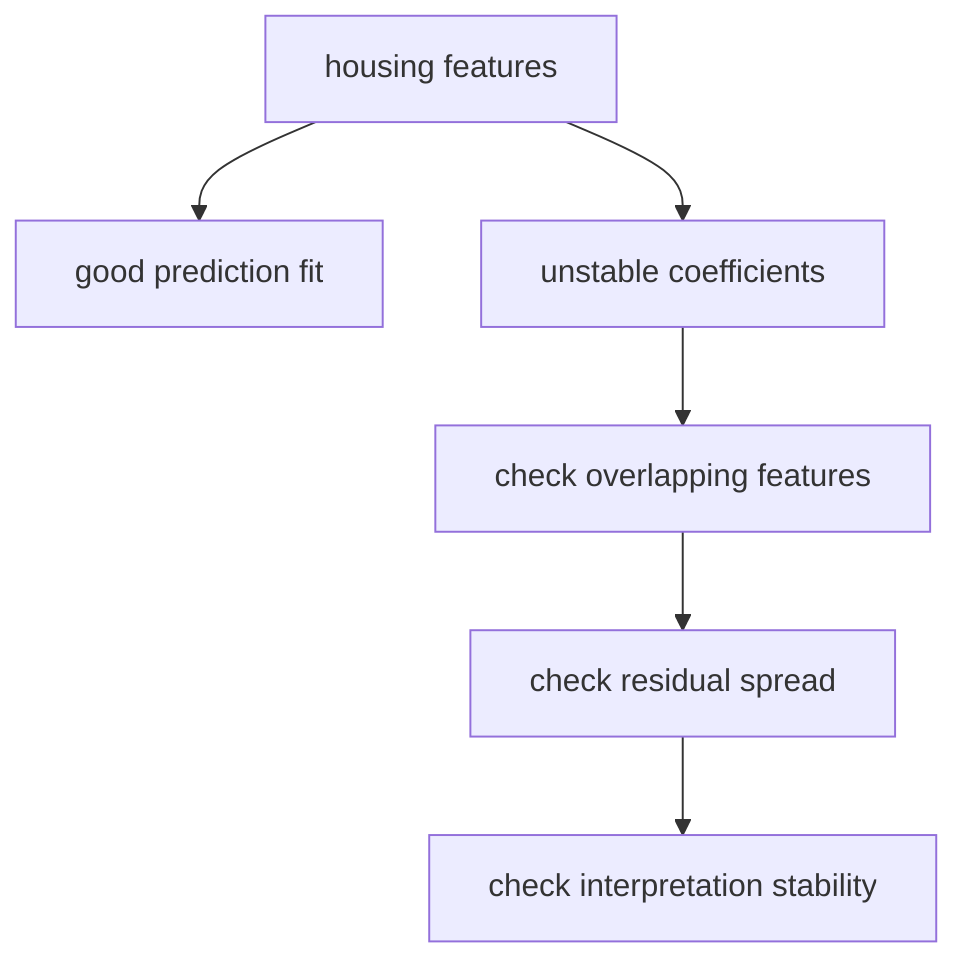

# P4-10.3 Supplementary Learning: How To First Read Regression Diagnostics

> Section ID: `P4-10.3`
> Version: `v2026.07.10`

Once readers have read up to P4-10.2, the basic evaluation of linear regression is in place. But in real documents or lectures, they soon meet expressions such as the following.

- statistical significance
- normality of residuals
- homoscedasticity
- multicollinearity

The goal of this Section is not to learn proofs of all these concepts, but to organize `what these words are worried about`, so that readers do not stop when reading a regression result table.

This supplementary learning is not a Section that expands and re-explains the definition of linear regression. The basic intuition and evaluation handles remain in P4-10.1, P4-10.2, and the [concept glossary](../../../reference/concept-glossary.md), while here the discussion only organizes what kind of risk regression-diagnostic terms point to.

## Scope Of This Supplementary Learning

This Section answers the following questions.

- Why does regression diagnostics come after linear regression?
- What should be read carefully in statistical significance?
- What kind of worries are normality of residuals and homoscedasticity?
- Why can multicollinearity shake coefficient interpretation?

This Section does not treat the following topics deeply.

- formula derivations of each test statistic
- the full history of debates around p-value interpretation
- VIF calculation practice and the use of advanced regression packages

Those detailed procedures are left outside the scope of the current main text of this book.

## Goals Of This Supplementary Learning

- You can explain regression diagnostics as `checks for not overtrusting the result of linear regression`.
- You can distinguish what significance, normality, homoscedasticity, and multicollinearity are each worried about.
- When reading a regression coefficient table, you can avoid treating `there is a number` and `the interpretation is stable` as the same thing.

## Why Does Regression Diagnostics Appear Separately?

Linear regression is a model that fits a line, but just because a line was drawn does not mean interpretation automatically becomes safe. So regression diagnostics usually continues with the following questions.

1. How far off is this line on average?
2. Are those errors leaning in a certain direction?
3. Are the input features overlapping so much that coefficient interpretation becomes unstable?
4. How far can the numbers in the coefficient table actually be trusted?

In other words, regression diagnostics is the language for checking `the stability of interpretation`, not `a performance score`.

## What Does Statistical Significance Ask?

`Could this coefficient or relationship appear only from accidental fluctuation, or does it look like a somewhat consistent signal inside the data?`

What matters is that significance does not immediately mean practical importance or predictive performance.

| Expression | Introductory reading |
| --- | --- |
| statistically significant | a signal that it is hard to explain only by chance |
| practically important | it has a large effect in actual decision-making |

These two can differ. Therefore significance is one axis that asks `why this number exists`, but it does not replace overall model quality.

## What Does Normality Of Residuals Worry About?

Put very simply, normality of residuals is the concern `are the errors severely leaning in some strange shape?`

For making predictions themselves, normality does not need to feel like an absolute condition. But in the context of coefficient interpretation and some statistical tests, if the residual shape is severely distorted toward one side, the interpretation can become less stable.

- if residuals stretch very long to one side, interpretation needs caution
- a large outlier can strongly shake the shape of residuals

In a very small comparison exercise, it can be read as follows.

```python
balanced_residuals = [-3, -1, 0, 1, 3]
skewed_residuals = [-1, 0, 1, 2, 12]

print("balanced residuals:", balanced_residuals)
print("skewed residuals  :", skewed_residuals)
print("balanced range    :", max(balanced_residuals) - min(balanced_residuals))
print("skewed range      :", max(skewed_residuals) - min(skewed_residuals))
```

An example execution result is as follows.

```text
balanced residuals: [-3, -1, 0, 1, 3]
skewed residuals  : [-1, 0, 1, 2, 12]
balanced range    : 6
skewed range      : 13
```

This comparison does not replace a normality test, but at an introductory level it immediately shows the difference between `a scene where errors spread in a roughly balanced way` and `a scene where one long tail appears`. In other words, it is enough to accept normality of residuals as the language that first worries `are errors stretching far to one side and shaking interpretation?`

## What Does Homoscedasticity Worry About?

Homoscedasticity is the concern of whether the spread of errors changes too much depending on the input interval.

For example, if errors are small for small values but become larger and larger as the values grow, the following questions arise.

- Is the model unusually unstable only in a certain interval?
- Is some hidden structure present that is hard to explain with one line?

In other words, homoscedasticity is the perspective that looks at `do errors spread by roughly the same amount in every interval?`

In a very small comparison table, it can be read as follows.

| Input interval | Example residuals | First concern that arises |
| --- | --- | --- |
| low price range | `-2, 1, 0` | the error spread is relatively small |
| high price range | `-15, 12, 18` | the error spread becomes much larger in a certain interval |

In this kind of scene, before saying `the average performance is acceptable`, readers should first confirm `in what interval the explanation is collapsing`.

## Why Does Multicollinearity Shake Coefficient Interpretation?

Multicollinearity appears when input features contain too much similar information.

For example:

- `monthly_spend`
- `quarterly_spend`
- `yearly_spend`

If strongly overlapping features like these enter together, the model may still make predictions to some degree, but it can become hard to say stably `which feature's coefficient was really more important`.

The core is this.

`Being able to predict` and `having stable coefficient interpretation` are not the same statement.

## Cases And Examples

### Case 1. House-Price Prediction Looks Right, But Coefficient Interpretation Keeps Shaking

A real-estate analysis team is building a house-price prediction regression formula. The criteria people first looked at were questions such as `does price rise when area becomes larger`, `does price rise when the home is closer to a station`, and `is a newer building more valuable`.

But even if there are no obvious duplicates like `monthly_spend`, strongly overlapping information still enters together, such as `exclusive area`, `gross floor area`, `number of rooms`, and `number of living rooms`. The predictions themselves look plausible, but in one experiment the area coefficient becomes large, in another experiment the room count coefficient becomes larger, and even coefficient directions become unstable. In a scene like this, predictive performance and stability of coefficient interpretation must not be treated as the same thing.



At this point, regression diagnostics asks `how far can these numbers be trusted?` Multicollinearity can shake coefficient interpretation by making similar features split the explanation among themselves, homoscedasticity breaking can make the error spread larger in some price ranges, and if the residual shape leans to one side, interpretation must become more cautious. In other words, just because one line was obtained does not mean the whole coefficient table immediately becomes a safe explanation.

The confirmable result appears when readers look together at residual distribution and the degree of overlap among input features. If predictions remain similar but the size and sign of coefficients shake from experiment to experiment, that regression formula can be `a model usable for prediction, but one whose explanation must be handled more carefully`.

## Practice And Examples

### Seeing How Overlapping Features Shake Coefficient Interpretation In A Python Example

The example below shows that when two features carrying almost the same information, such as `monthly_spend` and `yearly_spend_proxy`, enter together, predictions can stay similar while coefficient interpretation can still shake substantially.

- problem situation: read a regression formula in which monthly spending and a yearly-spending proxy enter together
- input: `monthly_spend`, `yearly_spend_proxy`
- label: next month's sales
- concepts to check:
  - when strongly overlapping features enter together, the role of coefficients can look split
  - keeping prediction stable and keeping coefficient interpretation stable are not the same thing

```python
import numpy as np
from sklearn.linear_model import LinearRegression

monthly_spend = np.array([10, 12, 14, 16, 18, 20], dtype=float)
yearly_spend_proxy = np.array([121, 145, 167, 193, 215, 239], dtype=float)
y = np.array([30, 35, 40, 45, 50, 55], dtype=float)

X_two_features = np.column_stack([monthly_spend, yearly_spend_proxy])
X_one_feature = monthly_spend.reshape(-1, 1)

model_two = LinearRegression()
model_two.fit(X_two_features, y)

model_one = LinearRegression()
model_one.fit(X_one_feature, y)

query_two = np.array([[17, 203]], dtype=float)
query_one = np.array([[17]], dtype=float)

print("two-feature coefficients :", np.round(model_two.coef_, 3))
print("two-feature prediction   :", round(model_two.predict(query_two)[0], 3))
print("one-feature coefficient  :", round(model_one.coef_[0], 3))
print("one-feature prediction   :", round(model_one.predict(query_one)[0], 3))
```

An example execution result is as follows.

```text
two-feature coefficients : [1.661 0.143]
two-feature prediction   : 47.517
one-feature coefficient  : 2.5
one-feature prediction   : 47.5
```

The first points to read from this result are the following.

- The predictions of the two models are almost the same.
- But when the two features are entered together, coefficient interpretation looks split into `1.661` and `0.143`.
- In other words, even if prediction stays stable, `which feature was really more important` can shake more.

### Change One More Value: If Only One Point Of An Overlapping Feature Shakes, What Stays The Same And What Changes?

This time, change only the last value of `yearly_spend_proxy` from `239` to `233` and train again.

```python
import numpy as np
from sklearn.linear_model import LinearRegression

monthly_spend = np.array([10, 12, 14, 16, 18, 20], dtype=float)
yearly_spend_proxy = np.array([121, 145, 167, 193, 215, 239], dtype=float)
yearly_spend_shifted = np.array([121, 145, 167, 193, 215, 233], dtype=float)
y = np.array([30, 35, 40, 45, 50, 55], dtype=float)

query = np.array([[17, 203]], dtype=float)

model_original = LinearRegression().fit(
    np.column_stack([monthly_spend, yearly_spend_proxy]), y
)
model_shifted = LinearRegression().fit(
    np.column_stack([monthly_spend, yearly_spend_shifted]), y
)

print("original coefficients :", np.round(model_original.coef_, 3))
print("original prediction   :", round(model_original.predict(query)[0], 3))
print("shifted coefficients  :", np.round(model_shifted.coef_, 3))
print("shifted prediction    :", round(model_shifted.predict(query)[0], 3))
```

An example execution result is as follows.

```text
original coefficients : [1.661 0.143]
original prediction   : 47.517
shifted coefficients  : [2.157 0.097]
shifted prediction    : 47.479
```

### What Stayed The Same And What Changed?

- What stayed the same: the predictions of the two models are still almost the same.
- What changed: even though only one value in an overlapping feature changed slightly, the way the coefficients are divided moves quite a lot.
- The judgment to leave first: in this kind of scene, the warning of regression diagnostics that `predictions may be usable, but coefficient interpretation must be treated more carefully` should come to mind first.

### How Does This Exercise Recover The Goal Of Part 4?

This exercise recovers regression diagnostics not as `a list of statistical terms learned later`, but as `a procedure that asks again how far the model result can actually be trusted`. The goal of Part 4 is not simply to accept scores and coefficient tables, but to distinguish which changes shake prediction and which changes shake only interpretation. Multicollinearity is a representative scene that demands exactly that distinction.

| Shared recording language | What should be left immediately from this exercise |
| --- | --- |
| structure that appeared | if overlapping features exist, prediction can stay stable while coefficient interpretation still shakes easily |
| boundary of interpretation | it cannot be concluded from coefficient change alone that the real influence of a certain feature suddenly changed |
| next question | if residual spread and interval-specific failures are also viewed together, should this regression formula still be used as an explanatory model |

### Reading Homoscedasticity Too Through A Small Comparison

Rather than stopping after looking only at multicollinearity, let readers also compare very briefly a scene where error spread differs by interval.

```python
low_range_residuals = [-2, 1, 0]
high_range_residuals = [-15, 12, 18]

print("low-range spread  :", max(low_range_residuals) - min(low_range_residuals))
print("high-range spread :", max(high_range_residuals) - min(high_range_residuals))
```

An example execution result is as follows.

```text
low-range spread  : 3
high-range spread : 33
```

This number does not replace a complex test, but at an introductory level it immediately shows the homoscedasticity concern that `even under the same regression formula, error can spread much more widely in some intervals`. In other words, regression diagnostics is a procedure that asks not only about shaking coefficient interpretation, but also about `imbalance in error spread`.

### If The Small Exercises In This Supplementary Learning Are Read Together

- the comparison of residual normality makes readers first look at `does the error shape stretch long to one side`
- the comparison of homoscedasticity makes readers first look at `in what interval does error spread become larger`
- the comparison of multicollinearity makes readers first look at `does prediction stay stable while only coefficient interpretation shakes`

In other words, regression diagnostics is not a Section for memorizing one test name, but is better read as a Section for distinguishing whether the unstable part is `error shape`, `error spread`, or `coefficient-interpretation stability`.

## Perspectives To Remember In This Section

- Regression diagnostics is less a technique for raising the score and more a check that makes interpretation more cautious.
- Significance especially shakes the signal of relationship interpretation, homoscedasticity shakes error spread, and multicollinearity shakes coefficient-interpretation stability.
- When reading a linear-regression table, readers must ask together not just `is there a number`, but `how far can that number be trusted`.

## When Should This Perspective Be Brought To Mind First?

- Bring regression-diagnostics perspective to mind when checking whether predictive performance and stability of coefficient interpretation are being treated as the same thing.
- Return to this Section when readers need to explain again what significance, homoscedasticity, and multicollinearity each shake.
- This Section becomes the criterion when readers need to ask first not `there is a number`, but `how far can that number be trusted`.

## Understanding Check

- Can you avoid treating significance and practical importance as the same thing?
- Can you explain that homoscedasticity worries about `whether the size of error changes by interval`?
- Can you explain why multicollinearity shakes coefficient interpretation?

## Sources And References

- statsmodels developers, [Regression diagnostics](https://www.statsmodels.org/stable/examples/notebooks/generated/regression_diagnostics.html){: target="_blank" rel="noopener noreferrer" }, accessed on 2026-07-01.
- Gareth James, Daniela Witten, Trevor Hastie, Robert Tibshirani, [An Introduction to Statistical Learning](https://www.statlearning.com/){: target="_blank" rel="noopener noreferrer" }, accessed on 2026-07-01.
