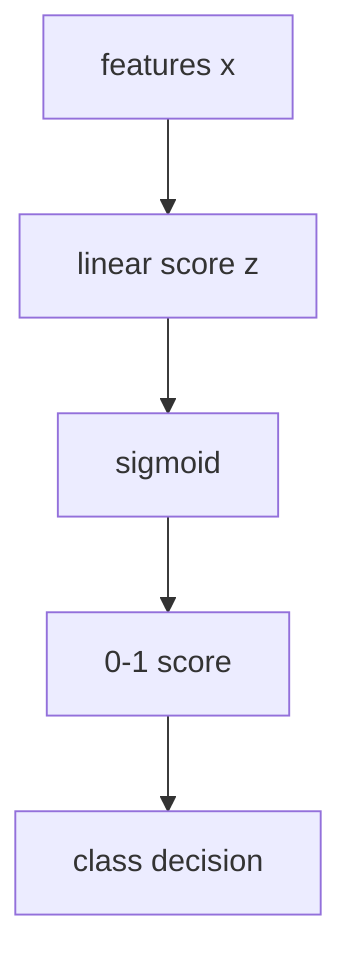
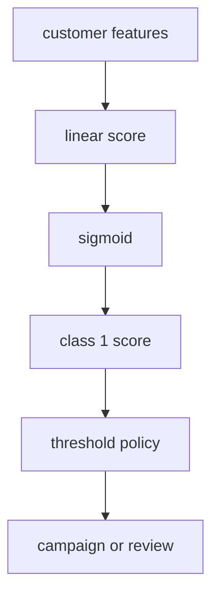

# P4-11.1 Intuition Of Logistic Regression

> Section ID: `P4-11.1`
> Version: `v2026.07.10`

In P4-10, linear regression showed `how to predict continuous values with a line`. Now the discussion moves to how that same linear way of thinking changes in classification.

The central question of this Section is the following.

If readers want to keep linear computation, but read the output as a value between 0 and 1, what should be done?

This question is exactly the starting point of logistic regression.

The name often causes confusion. Why is it called `regression` if it performs classification? Logistic regression has classification as its final purpose, but inside it still computes a linear combination and changes that value into a form that can be read like a probability, so the name remains.

In other words, logistic regression is not `a model that uses linear regression directly for classification`, but `a model that changes the output of linear computation so it can be interpreted like a classification probability`.

This Section explains the basic meanings of `logistic regression`, `sigmoid`, `predict_proba`, and `threshold`. The later Sections continue current judgments on top of these handles, and the basic intuition for reading linear computation like a classification probability reconnects through this Section and the [concept glossary](../../../reference/concept-glossary.md).

## Scope Of This Section

This Section answers the following questions.

- Why is logistic regression used for classification problems?
- Why is the name `regression` kept even though the result is read like classification?
- How does a linear combination change into a value between 0 and 1?
- What does an output such as `predict_proba` mean?
- Why is a threshold needed?

This Section does not treat the following topics deeply.

- the rigorous derivation of log-odds
- formula development of maximum likelihood estimation (MLE)
- detailed formulas of multinomial logistic regression
- differences by solver and regularization settings

The spatial interpretation of decision boundary and threshold continues immediately in P4-11.2. `Why readers start seeing log-odds` and `why MLE is used` are recovered in P4-11.3, `how binary classification extends into multinomial` is recovered in P4-11.4, and `why solver and regularization appear as implementation settings` is recovered in P4-11.5. A broader general principle of regularization and the reading of related hyperparameters reconnect through P4-9.1, P4-9.2, and P5-8.1.

## Goals Of This Section

- You can explain logistic regression as `a linear model that produces an output readable like a probability in classification problems`.
- You can distinguish the common points and differences between linear regression and logistic regression.
- You can explain at an introductory level why the sigmoid function appears.
- You can understand that `predict_proba` and final class prediction are different stages.
- You can explain that the threshold intervenes in classification judgment.

## Learning Background

The algorithm flow of Part 4 is designed so that the discussion does not jump abruptly from regression to classification. The reason linear regression was seen first is to show that logistic regression is not a completely separate world, but a case inside the same linear-model family where only the interpretation of the output changes.

| Curriculum position | Role of logistic regression |
| --- | --- |
| after P4-10 linear regression | extends linear thinking into classification problems |
| after P4-6 evaluation metrics | prepares the link between probability-like outputs and classification metrics |
| before P4-11.2 | introduces the concept of decision boundary |

In other words, 11.1 is both `the Section that first introduces a classification model` and the Section that shows `continuity with linear regression`.

## Main Learning Content

### What Kind Of Problem Does Logistic Regression Handle?

Logistic regression is usually introduced in `binary classification`, where readers choose one of two outcomes.

For example:

| Work situation | Value to predict |
| --- | --- |
| will a customer churn? | churn / no churn |
| is an email spam? | spam / normal |
| is a transaction fraud? | fraud / normal |
| is the patient at high risk for a certain disease? | high risk / low risk |

The common point in these problems is that the output is not a continuous value, but a category. But the inner computation is still numerical.

`Logistic regression is a model that estimates from the input a value between 0 and 1 for belonging to one class, then decides classification based on that value.`

### Why Is It Called Regression Even Though It Performs Classification?

This is the first misunderstanding that must be untangled in this Section. Logistic regression performs classification, but inside it still computes a linear score.

The simplest form can be thought of as follows.

\[
z = w_1x_1 + w_2x_2 + \cdots + w_nx_n + b
\]

This equation has the same structure seen in linear regression. The difference is that it does not stop here. Linear regression tried to read this value directly as a prediction, but logistic regression passes it through the sigmoid function and changes it into a value between 0 and 1.

That means the word `regression` in the name is a trace of linear combination and numerical estimation, while the actual use is closer to classification.

### Why Is The Sigmoid Function Needed?

If the output of a linear expression is used directly in a classification problem, values such as 1.7, -2.3, and 5.8 can appear. But in classification it is hard to read such values directly. Readers usually want to read `how likely is this class` inside the range between 0 and 1.

The sigmoid function does exactly this work.

- very large positive input is sent near 1
- very large negative input is sent near 0
- middle values are sent near 0.5

`Sigmoid is a function that compresses the result of linear computation into a 0-1 range that is easy to read for classification.`

If this flow is drawn simply, it looks as follows.



The key point is that logistic regression does not discard the line, but `adds one more interpretation transform after the linear computation`.

### What Is The Same Between Linear Regression And Logistic Regression, And What Is Different?

The two models resemble each other in that they use linear combination. But the meaning of their output is different.

| Item | Linear regression | Logistic regression |
| --- | --- | --- |
| problem mainly handled | regression | classification |
| internal computation | linear combination | linear combination |
| final output | continuous value | a value between 0 and 1, then class decision |
| introductory interpretation | predict points, minutes, money | how likely is one class |

In other words, logistic regression is not a model with a completely different starting point from linear regression, but a model that reinterprets the same linear structure for classification.

### What Does `predict_proba` Show?

One important output in the scikit-learn logistic-regression documentation is `predict_proba`. Readers easily read this immediately like `the final answer`, but in reality it is one stage earlier.

For example, if a value such as `0.82` comes out, this usually means `the model sees the possibility of belonging to the positive class as fairly high`. But whether the class is finally written as 0 or 1 is decided by the threshold.

That means:

- `predict_proba`: the degree of possibility
- `predict`: the final classification decision

That is the basic distinction.

If this distinction is missed, `score` and `decision` are easily confused as the same thing.

It becomes clearer in a very small example.

| User | class 1 score read through `predict_proba` | decision by 0.5 threshold |
| --- | ---: | --- |
| A | 0.18 | class 0 |
| B | 0.49 | class 0 |
| C | 0.51 | class 1 |
| D | 0.87 | class 1 |

What matters in this table is B and C. The score difference between the two users is not large, but under threshold 0.5 the final class splits. In other words, the score space made by the model is continuous, but the service judgment can be divided discontinuously on top of it.

### Why Is A Threshold Needed?

Logistic regression is usually first introduced through the example of deciding classification using 0.5 as the criterion.

- if the probability-like value is >= 0.5, then class 1
- if the probability-like value is < 0.5, then class 0

But this criterion is not a law of nature. It is a selected policy.

For example, in fraud detection, readers may want to act more sensitively because the cost of missing fraud is large. Conversely, in a service where normal users must not be blocked too aggressively, the threshold can be placed more conservatively.

That means logistic regression creates `a value readable like a probability`, and the real service decides `where to draw the line` on top of it.

This point also connects to the evaluation metrics of P4-6, the baselines of P4-8, and the tuning of P4-9.

Consider one more simple example.

| Customer | churn score | threshold = 0.5 | threshold = 0.7 |
| --- | ---: | --- | --- |
| E | 0.42 | retain | retain |
| F | 0.58 | warning | retain |
| G | 0.73 | warning | warning |

Even with the same score, service behavior changes when the threshold changes. Because of this, when reading logistic regression, `model score` and `operating policy` must be viewed separately. Cases near the boundary are first read as signals that raise review priority, and readers should not think that because the threshold changed, explanation of the cause is already finished.

Here too, the comparison frame must stay the same. Only when the same baseline, the same score interval, and the same representative failure cases are placed before and after the threshold can readers separate more clearly `what comes from policy change` and `what comes from lack of model expression`.

If this point is rewritten from the perspective of project notes, it becomes clearer. When logistic regression is used as the first comparison model, it is not enough to leave only the score table. Readers also leave `what score interval should be treated as a review target`, `what cases change behavior when the threshold changes`, and `what actually improved over the baseline`. Only then can the same probability score later be reread without mixing `policy change`, `lack of features`, and `representative failure cases`.

| Record to leave together | Why it is needed |
| --- | --- |
| comparison between baseline and logistic-regression scores | to see what actually improved over a simple criterion |
| cases where behavior changes by threshold | to record how service policy changes even under the same score |
| score intervals for review targets | to reread near-boundary cases as targets for human review |
| next adjustment question | to decide whether to change the threshold, inspect features more, or look at another candidate model |

Only with these records can facts such as `the score rose`, `the threshold changed`, and `warnings increased` be read without mixing them together. In other words, the logistic-regression Section is also a Section that leaves as an explainable comparison `by what criterion the same score space is being divided`.

### When Is It Good To Raise Logistic Regression As A First Candidate?

Logistic regression is often used as the first comparison model in a classification problem, but the reason is not that it is `famous`. It is because it is a linear classification model in which score and policy are easy to read separately.

| Current problem state | Why logistic regression should be raised first | What to check first |
| --- | --- | --- |
| the goal is binary classification | because a score between 0 and 1 and the final class can be read together easily | whether the output is a categorical decision |
| an explainable first classification model is needed | because linear score, coefficient, and threshold can be explained relatively directly | whether a linear boundary is enough |
| a score model slightly better than the baseline is needed | because it is easy to compare real improvement over the majority-class criterion | what decreased in the confusion matrix |
| you want to leave score intervals for human review | because `predict_proba` and threshold can be separated to define review targets | whether near-boundary cases are recorded separately |
| operating policy and model output must be distinguished | because the structure is clear: the model makes scores, the policy decides actions | whether threshold change and model improvement are being mixed |

The core of this table is to treat logistic regression as both `a comparison model that goes beyond the first classification baseline` and `a training model for reading score and policy separately`.

## Detailed Learning Content

### Academic Background And History

After reading this far, readers can naturally ask: `why was this kind of model needed separately?` Because of the name, logistic regression can look like a simple variation of linear regression, but historically it sits at the meeting point of `the flow of regression for explaining continuous values` and `the statistical need to handle binary outcomes`.

1. First, in classical statistics, linear regression was widely used to explain continuous values such as height, score, price, and time.
2. But in reality there are many problems in which the result falls into one of two outcomes, such as `success/failure`, `pass/fail`, `survive/die`, and `buy/not buy`.
3. If linear regression is used directly on such problems, outputs smaller than 0 or larger than 1 can appear, making them hard to read like probabilities.
4. So instead of discarding the linear expression itself, statistics developed a way to `move the result of the linear expression into the 0-1 range and interpret it there`.

In this flow, the logistic function had also been used in the nineteenth century to explain growth curves and cumulative phenomena, and later became an important connection in statistical models handling binary outcomes.

In other words, the historical meaning of logistic regression is closer not to `giving up the line`, but to `changing the interpretation so that classification problems, which are hard to handle with only a line, can be treated statistically`.

From this perspective, the order between linear regression and logistic regression also becomes clearer.

- linear regression: the most basic linear model that explains continuous values
- logistic regression: a model that keeps the thinking of linear models but interprets the output to fit binary classification

In modern machine-learning contexts, this model is usually introduced as `a linear model for classification`. Rather than memorizing the entire history, it is enough to keep the following sentence as a criterion.

`If linear regression was the representative linear model for explaining continuous values, logistic regression is the model that expanded that linear way of thinking toward binary classification and probability interpretation.`

### Where Do The Main Discussion Points Arise?

After seeing the working method and examples, the next question becomes `how far can this model be trusted, and where should readers become cautious?` Logistic regression is often used as an introductory model, and it is also known as being relatively interpretable. But in reality it is also `a model that is easy to misunderstand by oversimplifying precisely because its explanation seems easy`. It is important to hold on to the following discussion points.

### 1. Are score and decision the same thing?

The most common misunderstanding is to treat the model's output and the service's action as the same thing.

- The model usually gives a score close to `how highly it sees the possibility of class 1`.
- The service decides actions such as `block`, `warn`, `review`, and `pass` on top of that score.

Therefore, the first discussion point around logistic regression is `how far the model speaks, and from where service policy begins to intervene`.

`Logistic regression produces the material for judgment, but it does not automatically set the final action rule.`

If this sentence is rewritten in the form of operating records, it can be written as follows.

| Record item | Example |
| --- | --- |
| score | `0.58` |
| current threshold | `0.50` |
| current action | `warning` |
| whether review is needed | `review because it is near the boundary` |
| next question | `if it is raised above 0.60, how much does FN increase` |

With this table, probability score, threshold, and review-target cases do not drift apart and remain as one comparison record.

### 2. Until When Is A Probability-Like Value Really A Probability?

Even if a value such as `0.82` appears, that does not automatically mean it perfectly represents the true probability of the real world. Depending on data distribution, training method, and calibration state, `a score that looks like a probability` and `actual frequency` can differ.

The discussion point that arises here is simple.

- Is this value closer to `a score for ranking`?
- Or is it acceptable to read it as `a real-world probability`?

In practice, this difference matters. If the task is prioritizing customers, the order of scores can be more important. In scenes such as medical-risk guidance, where probability interpretation is sensitive, calibration can become more important.

The key can be summarized as follows.

`The output of logistic regression is a score that can be read like a probability, but it does not always mean a perfectly accurate real probability.`

### 3. Is A Coefficient An Explanation Or A Cause?

One reason logistic regression is widely used is that its coefficients are relatively easy to read. But `it can be read` and `the cause is known` are different statements.

- The sign of a coefficient can show in what direction it pushes the score.
- The size of a coefficient can be a clue for comparing relative influence inside the model.
- But that does not immediately prove the direct cause in the real world.

This discussion point is especially important in social data, medical data, and user-behavior data. If correlation and causation are mixed, the explanation can look easy, but the conclusion becomes risky.

### 4. Is Logistic Regression Good Because It Is Simple, Or Weak Because It Is Simple?

Logistic regression is a linear model. This simplicity is both an advantage and a limit.

- advantage: it is fast, good as a baseline, and relatively easy to interpret
- limit: when the relationship between input and outcome is very complex or nonlinear, expressive power can be insufficient

That is why in practice discussions such as the following arise.

- Should readers start with logistic regression and first establish a baseline?
- Or should they move to a more complex model from the beginning?

This book uses the first approach as the criterion. Logistic regression matters not because it is `the best model`, but because it is `a model that makes it easy to first understand the structure of a classification problem`.

### 5. Why Is Threshold 0.5 Used Often, But Why Is It Not An Absolute Criterion?

0.5 is only a commonly used default. In real services, a different threshold can be more appropriate depending on cost structure, class imbalance, and policy standards.

- a service where spam must not be missed
- a service where normal users must not be blocked incorrectly
- a service where risk signals must be caught broadly at an early stage

can all use different thresholds even on the same logistic-regression output.

In other words, one important discussion point around logistic regression is that `a good score` and `a good behavior criterion` are not always the same thing.

## Cases And Examples

Before reading the cases, the common comparison frame of this Section can first be fixed as follows.

| Scene | A criterion people can easily use first | Limit of that criterion | What logistic regression changes | Result to confirm |
| --- | --- | --- | --- | --- |
| churn prediction | choose risky customers by intuition | even the same customer can be judged differently by different people | place a probability-like score and threshold together | review targets and automatic-action criteria can be separated |
| spam classification | block suspicious mail strongly | FP and FN costs are easily mixed under one criterion | read score and policy criterion separately | service-by-service threshold differences can be explained |
| medical risk classification | warn broadly when it looks risky | hard to handle missed-risk cost and over-warning cost together | even with the same score, a more sensitive threshold can be placed | it becomes clear that decision criteria beyond accuracy are needed |
| lending / fraud detection | approve or block using one or two criteria | domain-specific cost-structure differences can be missed | place different operating policies on top of the same model | read model score and action policy separately |

### Case 1. Customer Churn Prediction

In churn prediction, logistic regression is often used like a baseline.

- the output value is `likelihood of churn`
- the actual service decision is `above what score should a retention campaign be sent`

Suppose, for example, that a subscription service first looks only at the following three features.

| Customer | days active in last 30 days | payments in last 30 days | complaint inquiry | class 1 score | action by 0.5 criterion |
| --- | ---: | ---: | --- | ---: | --- |
| A | 26 | 4 | none | 0.18 | normal retention |
| B | 9 | 1 | yes | 0.61 | churn-prevention campaign |
| C | 4 | 0 | yes | 0.84 | priority review + strong retention |

What readers must first catch in this table is that `input features do not go directly into action`. The model first creates a score, and the service then divides behavior such as `normal retention`, `campaign`, and `human review` based on that score.



In this scene, logistic regression is usually considered first for three reasons. It can establish a baseline quickly, it is relatively easy to read what features are pushing the score upward, and several operating scenarios can be compared immediately by changing threshold policy.

What matters in this scene is the threshold policy more than the model itself. For example, whether a customer like B with `0.61` should be an automatic campaign target, or whether only customers like C with `0.80` or higher should receive strong intervention, depends on the cost structure. In other words, even with the same score table, `where automatic action begins` is an operating decision outside the model.

### Case 2. Email Spam Classification

In spam filtering, if there are too many false positives, normal mail gets blocked. Conversely, if there are too many false negatives, spam is missed.

It becomes clearer when turned into a very small email-classification scene.

| Mail | Example of signals seen by model | class 1 score | 0.5 criterion | more conservative 0.8 criterion |
| --- | --- | ---: | --- | --- |
| M1 | few advertising words, normal sender | 0.12 | normal pass | normal pass |
| M2 | many links, exaggerated subject | 0.57 | mark as spam | send to human review |
| M3 | many links, strange sender, repeated phrases | 0.93 | mark as spam | mark as spam |

This table shows that whether a `spam score of 0.57` should be blocked immediately, sent to review, or passed is changed by the threshold.

In other words, even with the same logistic regression:

- a service that blocks conservatively
- a service that must filter aggressively

can use different thresholds.

Put simply, the following two questions always follow.

- Is the cost of missing spam larger?
- Or is the cost of blocking normal mail by mistake larger?

Logistic regression does not answer these questions directly. Instead, it provides a score that allows those questions to be translated into threshold policy.

### Case 3. Medical Risk Classification

In the medical field, the cost of missing a positive risk can be extremely large. In this case, a policy that uses a threshold lower than 0.5 and gives warnings more sensitively may be needed.

For example, it can be read as follows in an outpatient screening stage.

| Patient | Example of signals seen by model | class 1 score | 0.5 criterion | 0.3 criterion |
| --- | --- | ---: | --- | --- |
| P1 | young age, stable major measurements | 0.11 | normal guidance | normal guidance |
| P2 | rising blood pressure, family history | 0.34 | normal guidance | recommend additional test |
| P3 | many major measurements abnormal | 0.79 | recommend additional test | recommend additional test |

The case of P2 is important here. `0.34` can look low under a 0.5 criterion, but in an environment where the cost of missing risk is large, recommending an additional test first can be safer.

In this scene, readers must not look only at simple accuracy. A perspective closer to sensitivity can become more important. So logistic regression is usually used first as `a score model`, and actual operation is designed separately together with medical criteria.

### Case 4. The Difference Between Loan Screening And Fraud-Transaction Detection

In loan screening, the cost of both wrongly approving and wrongly rejecting can be high. In fraud-transaction detection, blocking normal users is also costly, but the cost of missing real fraud can be even larger.

Both problems look like binary classification, but their operating perspective is different.

- loan screening: explainability and policy consistency can matter
- fraud detection: quick warning and high recall can matter more

The difference becomes clearer when the two scenes are placed in the same form.

| Scene | How the same score 0.62 can be easily read |
| --- | --- |
| loan screening | it can be sent to additional document request or human review, and not immediately rejected |
| fraud detection | the payment can be held temporarily or an extra authentication step can be requested more quickly |

In other words, even if the score is similar, if `the kinds of mistakes the service allows` differ, the same logistic-regression score can lead to different actions.

Because of this, the same logistic regression can survive for a long time as a baseline in some domains, while in others it is used only as a starting point for more complex models.

These cases all show the following fact in common.

`Logistic regression makes a score, and the service separately decides how to turn that score into action.`

## Practice And Examples

### A Small Logistic Regression In Python

The example below is a very small binary-classification exercise that predicts exam pass/fail (`passed`) from study hours (`study_hours`).

- problem situation: assume that as study time increases, the possibility of passing rises
- input: study hours
- label: pass (1) / fail (0)
- concepts to check:
  - a linear score passes through sigmoid and becomes readable in the 0-1 range
  - `predict_proba` and `predict` are not the same stage
  - the sign of the coefficient shows in what direction the possibility rises

The input can be read as follows.

| Input bundle | Meaning |
| --- | --- |
| `study_hours` | a one-dimensional input with only one feature |
| `passed` | pass / fail answer |
| `[[3], [5], [7]]` | samples for checking before the boundary, near the boundary, and after the boundary |

If the training data are rewritten again as a table, they can be read as follows.

| Student | Study hours | Actual result |
| --- | ---: | --- |
| S1 | 1 | fail |
| S2 | 2 | fail |
| S3 | 3 | fail |
| S4 | 4 | fail |
| S5 | 5 | pass |
| S6 | 6 | pass |
| S7 | 7 | pass |
| S8 | 8 | pass |

In other words, this example is the smallest toy data for asking `does the reading begin to move toward the pass class when study time crosses from the 4-hour range into the 5-hour range?`

```python
import numpy as np
from sklearn.linear_model import LogisticRegression

study_hours = np.array([1, 2, 3, 4, 5, 6, 7, 8]).reshape(-1, 1)
passed = np.array([0, 0, 0, 0, 1, 1, 1, 1])

model = LogisticRegression()
model.fit(study_hours, passed)

proba = model.predict_proba([[3], [5], [7]])
pred = model.predict([[3], [5], [7]])

print("coefficient      :", round(model.coef_[0][0], 3))
print("intercept        :", round(model.intercept_[0], 3))
print("proba at x=3     :", np.round(proba[0], 3))
print("proba at x=5     :", np.round(proba[1], 3))
print("proba at x=7     :", np.round(proba[2], 3))
print("class prediction :", pred)
```

An example execution result is as follows.

```text
coefficient      : 1.236
intercept        : -5.561
proba at x=3     : [0.831 0.169]
proba at x=5     : [0.452 0.548]
proba at x=7     : [0.117 0.883]
class prediction : [0 1 1]
```

This output can be read as follows.

- Because the coefficient is positive, as study time increases, the score moves toward the `pass class`.
- At `x=3`, the value read like a class 1 probability is low, so it is classified toward fail.
- At `x=5`, the classification flips while passing near 0.5.
- At `x=7`, the pass side is seen as more likely.

What matters is that when a value such as `0.548` is seen, it must be read not as an absolute fact, but as meaning `the current model, looking at this data, sees that class as more likely`.

There are points that become clearer when values are changed directly.

- If readers use `[[4], [5], [6]]` instead of `[[3], [5], [7]]`, they can inspect the score change near the boundary in more detail.
- If the correct labels near the boundary are changed slightly in `passed`, the coefficient and intercept also move together.
- The point that even with the same score, final action changes when threshold changes, connects directly into the next example.

### Seeing Threshold Difference Too In A Python Example

This time, let readers check with their own eyes that even under the same score, final action changes depending on how the threshold is placed.

- problem situation: assume that a churn score has already been received
- input: already calculated class 1 scores
- expected output: how the judgment changes at thresholds 0.5 and 0.7
- concepts to check:
  - even with the same score, class decision changes when policy criterion changes
  - model output and service action must be read separately

```python
import numpy as np

scores = np.array([0.42, 0.58, 0.73])

pred_05 = (scores >= 0.5).astype(int)
pred_07 = (scores >= 0.7).astype(int)

print("scores          :", scores)
print("threshold 0.5   :", pred_05)
print("threshold 0.7   :", pred_07)
```

An example execution result is as follows.

```text
scores          : [0.42 0.58 0.73]
threshold 0.5   : [0 1 1]
threshold 0.7   : [0 0 1]
```

This output again shows the fact that `the model makes a score, and the operating rule decides how to turn that score into action`.

For example, whether a score such as 0.58 should immediately trigger a warning or instead become a review target is decided not by the model but by policy. The next action is to gather near-boundary scores and recheck a threshold that fits FP and FN costs. In other words, the core of the threshold Section is not only score interpretation, but judgment that continues into `how should near-boundary cases be handled`.

### Change One More Value: If One Correct Label Near The Boundary Changes, How Does Score Interpretation Shake?

This time, in the training data change the case with `study_hours = 4` near the boundary from `fail (0)` to `pass (1)`.

```python
import numpy as np
from sklearn.linear_model import LogisticRegression

study_hours = np.array([1, 2, 3, 4, 5, 6, 7, 8]).reshape(-1, 1)
passed_original = np.array([0, 0, 0, 0, 1, 1, 1, 1])
passed_shifted = np.array([0, 0, 0, 1, 1, 1, 1, 1])

model_original = LogisticRegression()
model_original.fit(study_hours, passed_original)

model_shifted = LogisticRegression()
model_shifted.fit(study_hours, passed_shifted)

score_original = model_original.predict_proba([[4]])[0][1]
score_shifted = model_shifted.predict_proba([[4]])[0][1]

print("class 1 score at x=4, original labels :", round(score_original, 3))
print("class 1 score at x=4, shifted labels  :", round(score_shifted, 3))
```

An example execution result is as follows.

```text
class 1 score at x=4, original labels : 0.327
class 1 score at x=4, shifted labels  : 0.579
```

### What Stayed The Same And What Changed?

- What stayed the same: the overall direction that study time rises and the score toward passing also rises is preserved.
- What changed: when one correct label near the boundary changed, the class 1 score at `x=4` moved sharply from `0.327` to `0.579`.
- The judgment to leave first: logistic-regression scores did not discover a probability that was already sitting in nature, but an interpretation result made by the current boundary in the training data.

### How Does This Exercise Recover The Goal Of Part 4?

This exercise makes readers reread logistic regression not as `a model that prints a score`, but as `a classification criterion sensitive to cases near the boundary`. The goal of Part 4 is not to trust one score number, but to read how much changes in cases shake the score and threshold judgment. When the same example is changed repeatedly, it becomes clearer that between model output and service action there is always one more step of data interpretation.

| Shared recording language | What should be left immediately from this exercise |
| --- | --- |
| structure that appeared | even changing one correct label near the boundary shook the interpretation of the class 1 score for the same input greatly |
| boundary of interpretation | this score change alone does not allow readers to conclude that the real-world probability suddenly changed that much, and sample and data boundary must be seen together |
| next question | if more near-boundary cases are gathered, does the shaking of scores become smaller, and if threshold policy is added, what actions change |

| Signal seen first | What this signal means | Immediate next action |
| --- | --- | --- |
| many scores lie near 0.5 and the judgment flips often when threshold changes | the operating boundary is making a bigger difference than the model score itself | gather near-boundary cases and recheck a threshold that matches FP and FN cost |
| there are many high scores, but actual frequency and felt risk look mismatched | it can be risky to treat score order and probability interpretation as the same thing | decide again whether calibration is needed, or whether the score should be used only for ranking |

## Perspectives To Remember In This Section

- Logistic regression is a linear model that produces outputs readable like probabilities in classification problems.
- The inner computation is a linear combination, but the final interpretation changes into a 0-1 value through sigmoid.
- `predict_proba` is the score stage, while `predict` is the decision stage that applies a threshold.
- Coefficients are useful for reading direction, but they do not automatically prove causes.
- A threshold is less a part of the model itself and more a judgment criterion connected to service policy.

## Quick Check

- Did you first confirm that the current problem is binary classification?
- Are you reading `predict_proba` and final `predict` as if they were the same thing?
- Can you explain separately threshold change and improvement of the model itself?

## When Should This Perspective Be Brought To Mind First?

- When dealing with binary classification but talking as if score and final decision were one sentence, first bring to mind the distinction between `predict_proba` and `predict` in logistic regression.
- When threshold adjustment and retraining the model are being treated as the same kind of modification, separate policy boundary and model itself again.
- When coefficient interpretation, sigmoid, and probability-like outputs look tangled together at once, return to the perspective that this is a model with one more interpretation step added after the linear combination.

## Connection To The Next Section

In 11.1, logistic regression was viewed as `a linear model that makes a score readable like a probability`. In the next Section, P4-11.2, the discussion moves to the perspective of what kind of boundary this score makes in input space, that is, to decision boundary.

In other words, if 11.1 is the Section of `output interpretation`, then 11.2 is the Section of `space and boundary interpretation`.

## Sources And References

- scikit-learn, `1.1.11. Logistic regression`, scikit-learn User Guide, accessed on 2026-06-26. [https://scikit-learn.org/stable/modules/linear_model.html#logistic-regression](https://scikit-learn.org/stable/modules/linear_model.html#logistic-regression){: target="_blank" rel="noopener noreferrer" }
- scikit-learn, `LogisticRegression`, scikit-learn API Reference, accessed on 2026-06-26. [https://scikit-learn.org/stable/modules/generated/sklearn.linear_model.LogisticRegression.html](https://scikit-learn.org/stable/modules/generated/sklearn.linear_model.LogisticRegression.html){: target="_blank" rel="noopener noreferrer" }
