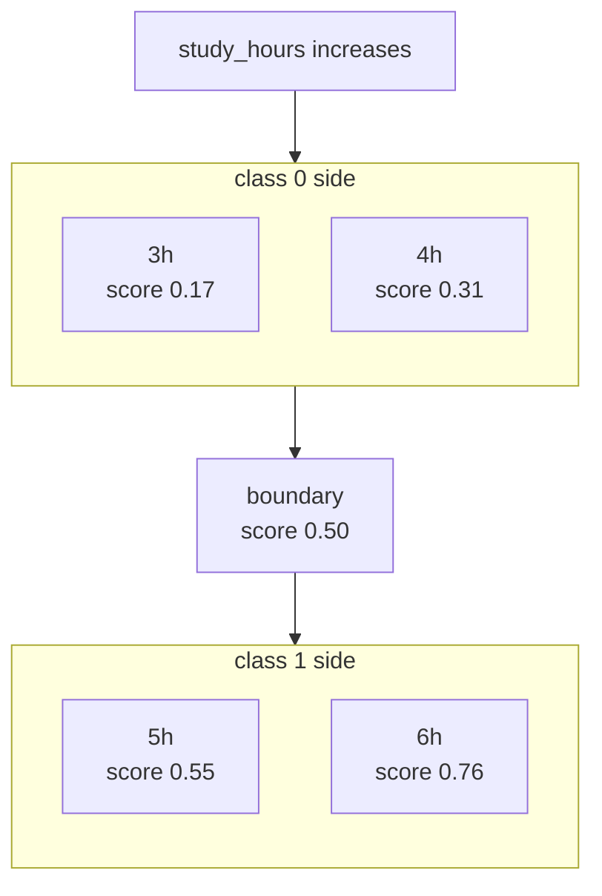
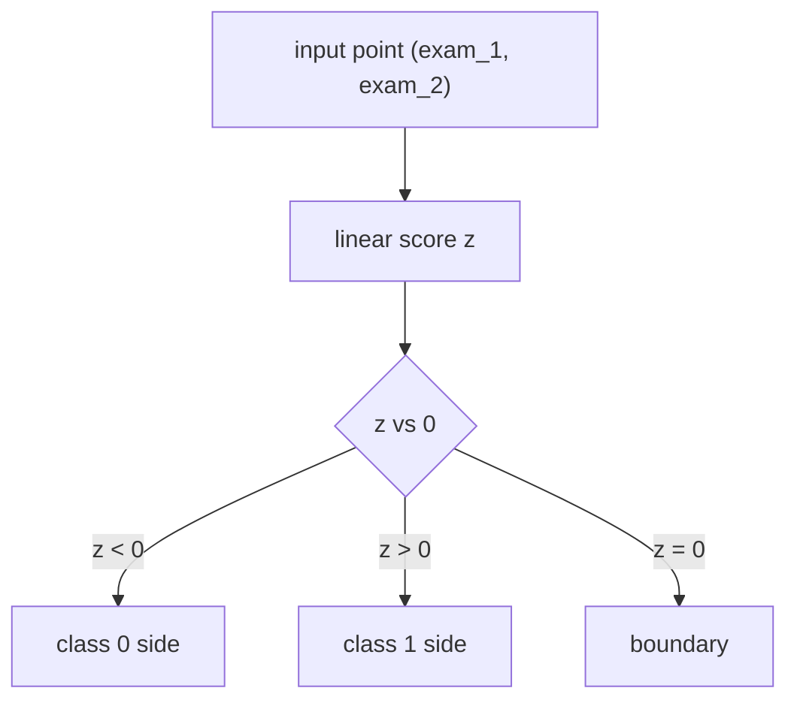
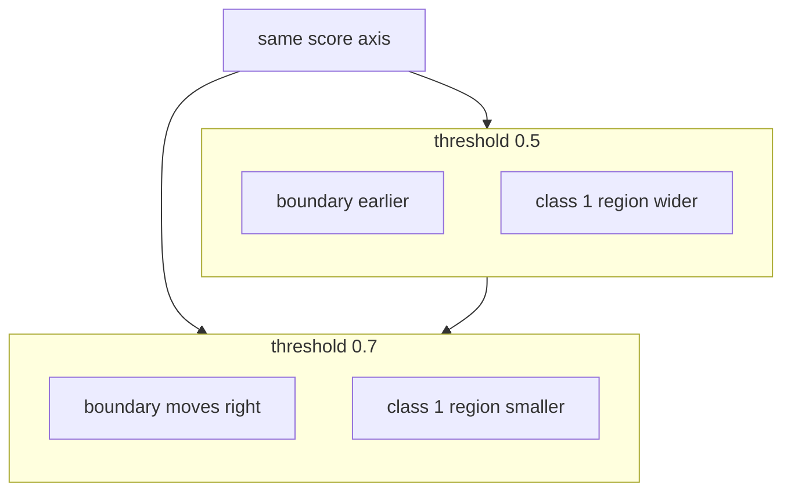
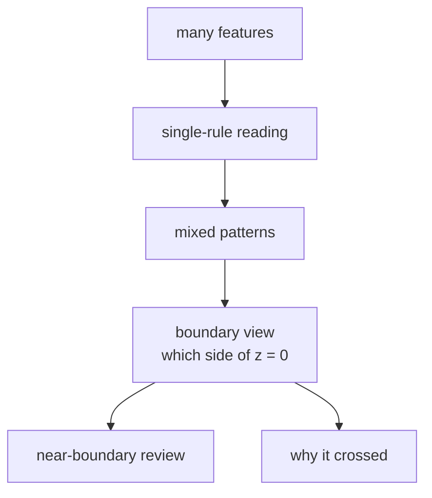

# P4-11.2 Decision Boundary

> Section ID: `P4-11.2`
> Version: `v2026.07.10`

In P4-11.1, logistic regression was read as `a linear model that makes scores readable like probabilities`. Now the question is changed one step.

Why does that score divide some inputs into class 0 and other inputs into class 1?

To answer this question, it is not enough to look only at `what the probability is`. The criterion `up to where it is read as class 0, and from where it is read as class 1` must also be visible. The perspective that reads that criterion in input space is decision boundary.

That is why expressions such as `where a line is drawn in input space` are closer to the result than to the essence. The more essential question is the following.

By what criterion does the model read inputs as split into two parts?

If 11.1 was the Section that read the output, 11.2 is the Section that looks at the input.

A decision boundary is the criterion line or criterion plane by which a model divides class 0 and class 1.

This Section does not repeat at length the basic definition of logistic regression. The core intuition of `a linear classifier that makes scores readable like probabilities` reconnects through P4-11.1 and the [concept glossary](../../../reference/concept-glossary.md), while this Section focuses on how that score cuts input space.

Once decision boundary is understood, the next questions become `why the probability is read in this shape`, `why log-odds and MLE follow in the training explanation`, and `how this intuition expands into multiple classes and setting comparison`. That recovery continues in the supplementary learning of P4-11.3, P4-11.4, and P4-11.5.

## Scope Of This Section

This Section answers the following questions.

- What is a decision boundary?
- In one-dimensional input, what does the boundary look like?
- In two-dimensional input, why does the boundary look like a line?
- How are the coefficients of logistic regression related to the direction of the boundary?
- How does the boundary change when the threshold changes?

This Section does not treat the following topics deeply.

- rigorous hyperplane geometry in high-dimensional space
- boundary partitioning in multiclass classification
- mathematical development of kernel methods or nonlinear boundaries
- detailed implementation of plots for boundary visualization

The intuition of a hyperplane reconnects through P4-1.2, and kernel methods and nonlinear boundaries are revisited in P4-13.1 and P4-13.2. Settings such as `C`, `gamma`, and threshold adjustment, together with computational cost, reconnect through P4-9.1 and P4-9.2. Detailed multiclass boundary partitioning and plot implementation remain outside the current scope of the main text of this book.

## Goals Of This Section

- You can explain decision boundary not as `an output score`, but as `a criterion that divides input space`.
- You can understand that in one dimension the boundary looks like `one point`, and in two dimensions it usually looks like `one line`.
- You can explain that the coefficients of logistic regression participate in changing the direction of the boundary.
- You can explain that when the threshold changes, the boundary itself can also move.
- You can connect that the probability output of 11.1 and the boundary perspective of 11.2 are two expressions of the same model.

## Learning Background

### Why Should Decision Boundary Be Viewed Separately?

In 11.1, scores such as `0.58` and `0.73` were read. But in practice and in learning, questions such as the following often matter more.

- Why did one input become class 0?
- Why did another input become class 1?
- Where is the criterion between the two classes?

To answer these questions, looking only at the output table is not enough. The output table shows `the result`, but it does not fully explain `why that result came out`.

This is exactly why decision boundary is viewed.

- to explain why one input became class 0
- to explain why another input became class 1
- to say where the criterion dividing the two classes lies
- to identify ambiguous cases near the boundary separately

In other words, decision boundary is not a simple visualization device, but an interpretation tool `for reading the reason of classification`.

The perspective that appears when readers need to see `by what criterion input space was divided into two` is decision boundary.

Decision boundary too must be seen together with the following four things.

| What should be seen together | Why it is needed |
| --- | --- |
| baseline classification result | because readers must know whether the linear boundary actually improved over a simple criterion |
| threshold location | because even with the same score, readers need to know where classes split |
| problematic cells in the confusion matrix | because readers must see what kinds of misclassification the boundary produced more |
| representative cases near the boundary | because readers must explain why ambiguous inputs crossed into the opposite class |

In other words, decision boundary is not a Section for drawing one line, but a Section for reading together `what it improved over`, `where the class splits`, and `what misclassification resulted`.

If one more point is added here, the decision-boundary Section connects more directly to operational interpretation. Cases near the boundary are not simply `ambiguous points`, but cases that should first be left as review targets. That means decision boundary can also be read not as a visualization result, but as a comparison frame for deciding `what inputs a person should look at again`. Here too, the fact that a case is near the boundary first shows a signal of change and review priority, not a sentence that automatically explains why that case crossed over.

This comparison too should keep the same criterion whenever possible. Only when readers place the same baseline classification result, the same score interval, and the same representative failure cases before and after the boundary can they read `change in model score`, `change in threshold policy`, and `lack of feature representation` with less mixing.

| What should be left together when viewing the boundary | Why it is needed |
| --- | --- |
| IDs of cases near the boundary | to find review targets again |
| changed classifications relative to baseline | to see what cases actually split differently from a simple criterion |
| cases that moved when the threshold changed | to see what inputs policy change pushed to the opposite side |
| next review question | to decide whether to add more features or adjust the threshold |

When these records exist, facts such as `the boundary moved`, `warnings increased`, and `newly split cases appeared` can be reread inside the same comparison frame instead of separately.

## Main Learning Content

### What Is A Decision Boundary?

A classification model usually computes a score internally, then divides the class based on that score. A decision boundary is exactly `the place where that score becomes equal to the criterion value`.

If logistic regression is simplified to an introductory level, it can be thought of as follows.

\[
z = w_1x_1 + w_2x_2 + \cdots + w_nx_n + b
\]

When this linear score \(z\) enters the sigmoid, a value between 0 and 1 appears. If the usual threshold 0.5 is used, then the place where the sigmoid output becomes 0.5 becomes the class boundary.

The fact that the sigmoid output is 0.5 connects to the fact that the linear score \(z\) is 0. That is why the decision boundary of logistic regression can usually be understood as `the place where linear score = 0`.

`The decision boundary is the place where the probability becomes ambiguous, and at the same time the place where the class splits.`

### In One Dimension, The Boundary Looks Like One Point

If there is only one input, the boundary appears not as a line but as `one point`.

For example, if the input is only study time (`study_hours`), the model can divide fail and pass using some time as the criterion.

| Study hours | Class 1 score | Prediction |
| ---: | ---: | --- |
| 3 | 0.17 | fail |
| 4 | 0.31 | fail |
| 5 | 0.55 | pass |
| 6 | 0.76 | pass |

In this case, the boundary can be read as lying `somewhere between 4 hours and 5 hours`. In other words, a one-dimensional decision boundary is close to `one cutoff point`.

If it is drawn simply, it looks as follows. This time it is useful to read at the same time `how the score grows on the study-hours axis, and where the class changes`.



The key in this diagram is that as the input value grows, the score rises, and on the `score 0.50` boundary point, `class 0 side` and `class 1 side` split. In other words, in one dimension readers do not need to find a complex surface or region, but only `one point on the axis`.

This perspective is very important when checking thresholds. What looked like a score table in 11.1 now begins to look again like `a boundary point on the input axis` in 11.2.

### In Two Dimensions, The Boundary Looks Like A Line

Now suppose there are two inputs, for example `exam_1` and `exam_2`, and readers classify pass/fail from those two scores. The input space can now be thought of not as a table but as a plane.

- one axis is `exam_1`
- the other axis is `exam_2`
- each student is one point on this plane

At this point, logistic regression tries to find a criterion line that divides those points into two groups. That is why in two dimensions the decision boundary usually looks like `a line`.



This diagram shows the decision boundary of logistic regression as `the trace left in input space by the rule that compares score z with 0`. The key is not that a line is being drawn first, but that the classes split according to what sign the linear score has.

`When one more input is added, the boundary changes from one point into one line.`

What matters here is not `there is first a line, and then the classes are divided`, but that `because of the rule comparing score z with 0`, a boundary line appears in the plane as a result.

That means in two dimensions the most direct answer to the following three questions is the same.

- Why did one input become class 0? `Because z for that input is smaller than 0.`
- Why did another input become class 1? `Because z for that input is larger than 0.`
- Where is the criterion between the two classes? `The set of all points where z = 0.`

That is why decision boundary should be read not as a simple picture, but as `the trace in the plane left by the classification rule`.

### How Are Coefficients Related To The Direction Of The Boundary?

The coefficients of logistic regression are not used only for calculating the score. When readers view input space, these values also influence the direction in which the boundary is placed.

For example, if there are two features:

\[
z = w_1x_1 + w_2x_2 + b
\]

then the relative sizes and signs of \(w_1\) and \(w_2\) change the slope and direction of the boundary line.

More important than formula derivation is the following intuition.

- if the coefficient of one feature becomes larger, the influence of that axis can become larger
- if the combination of the two coefficients changes, the slope of the boundary that divides the classes also changes
- the intercept moves the boundary in parallel

In other words, in 11.1 coefficients were `numbers that make scores`, while in 11.2 they can also be read as `numbers that decide the boundary`.

### If The Threshold Changes, The Boundary Can Move Too

In 11.1, readers saw that if the threshold changes, final action changes. In 11.2, that statement must be reread from the spatial perspective.

The boundary at threshold 0.5 and the boundary at threshold 0.7 do not necessarily lie in the same place. The reason is simple.

- threshold 0.5: from the place where the score crosses this criterion, it becomes class 1
- threshold 0.7: from the place where a higher score is required, it becomes class 1

That means if readers raise the threshold, the region classified as class 1 becomes smaller, and the boundary can move in a more conservative direction.

`The coefficients of the model make the direction of the boundary, and the threshold can adjust again where that boundary is placed.`

If this movement is drawn conceptually, it looks as follows.



The key in this diagram is that `even without retraining the model itself`, if the threshold becomes stricter, the boundary is pushed farther to the right on the same score axis and the class 1 region is read more narrowly. Therefore the movement of the boundary should be seen as a policy change that makes readers reread `what cases crossed to the opposite side`, and that movement alone should not be read as if explanation of the feature cause were already completed.

The following three sentences are left together in decision-boundary records.

- Cases near the boundary are signals for raising review priority rather than for automatic confirmation.
- If the threshold changes, the same input can move to a different action.
- Movement of the boundary is observed, but that itself does not complete explanation of the cause.

### When Is The Decision-Boundary Perspective Especially Important?

Decision boundary is not a simple visualization scene. It becomes especially important when readers must interpret `why this input crossed into the opposite class`.

| What readers want to see now | Why the decision-boundary perspective is needed | What should be checked together |
| --- | --- | --- |
| ambiguous cases near the boundary | because score alone weakly explains why they split | threshold and review-target interval |
| a certain type of misclassification repeats | because readers must see to which side the boundary is leaning | problematic cells in the confusion matrix |
| deciding whether to change threshold | because readers must read from the spatial perspective what inputs policy change moves | case changes before and after threshold |
| suspecting whether more features are needed | because readers must check whether the current boundary is too simple | newly split cases relative to baseline |
| selecting targets for human review | because cases near the boundary should receive review priority | case IDs and score-interval records |

The purpose of this table is not to view the boundary as a pretty picture, but to make readers trace `where the classification rule actually splits and what it is missing`.

## Detailed Learning Content

### Academic Background And History

At first glance, the phrase decision boundary can look like an expression only for visualization. But historically it connects to an important change in perspective on `how classification itself should be understood`.

In early statistics and the tradition of regression, the central issue was usually `the problem of estimating a value`. In other words, the core question was how well a continuous result could be explained when the input was given. But in classification problems, the question changes somewhat.

- Into which class does this sample fall?
- By what criterion do the two classes split?
- Inside the same input space, where are the risky regions and the safe regions?

As these questions appeared, classification models began to be read not merely as `functions that make scores`, but also as `devices that divide space`.

One of the starting points often mentioned historically when recalling this flow is the tradition of Fisher's discriminant. In 1936, Ronald A. Fisher dealt with the problem of distinguishing categories using multiple measurements together, and this context later continued into linear discriminants and the perspective of classification boundaries. In that period, rather than placing the phrase `decision boundary` at the center as today, the more direct problem was `what kind of linear combination separates groups well`.

`The early problem-awareness of classification was closer to how to distinguish different groups than to how to predict one value a little more accurately.`

Afterward, in statistical classification and pattern recognition, this distinction problem began to be treated in a more general language. In particular, explanations of the Bayes classifier, linear discriminant analysis (LDA), and quadratic discriminant analysis (QDA) organized a way of reading the boundary as `the place where the posterior probabilities of two classes become equal`, or `the place where the values of the classification functions become equal`.

This perspective matters because it shows that decision boundary is not merely an expression for drawing pictures. The boundary can be read as follows.

- the place where which class is more plausible changes
- the place where misclassification cost and judgment rule meet
- the place where ambiguous cases gather

In other words, historically too, it is more accurate to understand decision boundary not as `a technique of drawing a line in space`, but as `a way of expressing the criterion where classification judgment flips`.

If logistic regression is viewed from this perspective, it can be summarized as follows.

- perspective of 11.1: logistic regression makes a score readable like a probability
- perspective of 11.2: logistic regression draws a boundary in input space and divides classes

These two perspectives are not different models, but two ways of reading the same model.

The reason the decision-boundary perspective is even more important in modern machine learning is clear. SVM, decision trees, and neural networks, which readers will see later, can all eventually be reread through the question `how do they divide the input`.

Therefore, if the historical meaning of decision boundary is organized at an introductory level, it becomes the following.

`Classification is a problem of score computation, but at the same time it is also a problem of how input space is divided.`

Once this sentence is understood, readers also understand more clearly why other classification algorithms follow after logistic regression.

## Cases And Examples

Before reading the cases, the common comparison frame of this Section can first be fixed as follows.

| Scene | A criterion people can easily use first | Limit of that criterion | What the decision-boundary perspective changes | Result to confirm |
| --- | --- | --- | --- | --- |
| pass prediction | place one cutoff on one score | explanation becomes weak when many features act together | read it as a combined criterion line | it starts being read not as one point but as a line or plane |
| customer churn | judge risk by looking at only one variable | misses combined patterns | see whether combinations of many features form a risky region | readers can explain what combination lies beyond the boundary |
| medical risk | judge risk by one number | misses ambiguous combination cases | view near-boundary cases separately | review-priority targets can be identified |
| lending / spam | explain approval and block by one simple rule | misses combined features and the limit of a linear boundary | see what combinations the boundary is dividing | the strengths and limits of a linear boundary can be read together |



### Case 1. Pass Prediction

If there is only one score, one cutoff point becomes the boundary. But if there are two subjects, offsetting relationships such as `math score is high but English score is low` can appear. In that case, a `boundary line that looks at the two scores together` fits better than `a criterion based on only one score`.

When placed in a small table, it can be read as follows.

| Student | Math score | English score | Boundary interpretation |
| --- | ---: | ---: | --- |
| A | 92 | 38 | one subject is high, but the other is low, so it can remain near the boundary |
| B | 71 | 68 | because both scores are at least moderate together, it can easily move to the pass side |
| C | 45 | 44 | because both scores are low, it is likely to remain on the fail side |

The core of this table is that with a single criterion such as `did math alone exceed 90`, the difference between A and B is hard to explain fully. The decision-boundary perspective makes readers look at `on which side of the region the combination of the two scores lies`.

This case matters because readers easily keep understanding classification only as `one passing line on one score`. The decision-boundary perspective shows that `if many features act together, the criterion also changes into a combination`.

### Case 2. Customer Churn Prediction

When the inputs are several things such as `days recently active`, `payment frequency`, and `number of customer-service inquiries`, it becomes hard to explain churn using only one variable. The decision-boundary perspective helps readers see `what combination enters the risk region when many features come together`.

For example, compare the following three customers.

| Customer | days active in last 30 days | payments in last 30 days | inquiry count | Boundary interpretation |
| --- | ---: | ---: | ---: | --- |
| A | 22 | 3 | 0 | likely to remain in the retention region |
| B | 11 | 1 | 2 | easy to read as a review target near the boundary |
| C | 4 | 0 | 4 | easy to read as having crossed into the risk region |

What matters here is B. If readers look only at activity days, it is not extremely low yet. But if declining payment frequency and increasing inquiries appear together, it can become a near-boundary case.

For example, even if activity drops a little, if payment frequency stays stable, the person can still be read as a retained customer. But if declining activity and stopped payment appear together, the case can move into the risk region. In other words, the boundary makes readers read `a pattern of combination`, rather than `one value`.

### Case 3. Medical Risk Classification

One test measurement alone can be ambiguous, but if `blood pressure`, `blood sugar`, and `age` are viewed together, the risk region can become clearer. Here, decision boundary helps readers imagine visually `what kind of combination crosses into the risk class`.

Placed simply, it becomes the following.

| Patient | Blood pressure | Blood sugar | Age | Boundary interpretation |
| --- | ---: | ---: | ---: | --- |
| P1 | normal | normal | 34 | far from the risk region |
| P2 | slightly high | near the borderline | 58 | can become a near-boundary case requiring additional review |
| P3 | high | high | 67 | easy to read as having crossed into the risk region |

The key in this scene is P2. One measurement alone can be ambiguous, but if many values are all near the boundary at the same time, actual decision-making must view the case more carefully.

In this case, especially `patients near the boundary` are important. More than patients with very high scores, patients whose several measurements overlap ambiguously around the boundary can be harder in real decision-making. That is why decision boundary helps not only in simple classification, but also in reading `what cases are ambiguous`.

### Case 4. Loan Screening

In loan screening, features such as `income`, `debt ratio`, `delinquency history`, and `employment duration` act together. Here, the decision-boundary perspective is useful for explaining `which applicant lies in the approval region and which lies in the rejection region`.

Looking at a small example:

| Applicant | Income | Debt ratio | Delinquency history | Boundary interpretation |
| --- | --- | --- | --- | --- |
| D1 | high | low | none | easy to read as lying on the approval side |
| D2 | medium | high | none | additional-document review may be needed near the boundary |
| D3 | low | high | yes | easy to read as having crossed into the rejection side |

Here D2 is hard to explain with one single rule. Looking only at income, it is not very bad. But if the debt ratio is high, the boundary can change.

The important point is that there exist applicants who are hard to explain with one single criterion. Income can be high while the debt ratio is also high, and employment duration can be short while delinquency history is absent. Such combined judgments are hard to explain without the decision-boundary perspective.

### Case 5. Separating Spam And Normal Mail

In email classification, things such as `frequency of certain words`, `sender pattern`, `number of links`, and `subject expression` can all act together. Here the boundary makes readers think `what mail crosses out of the normal-mail region and into the spam region`.

Written in a small way, it becomes the following.

| Mail | Number of links | Sender anomaly | Subject expression | Boundary interpretation |
| --- | ---: | --- | --- | --- |
| M1 | 0 | none | ordinary work subject | close to the normal region |
| M2 | 2 | none | exaggerated wording | can become a near-boundary case needing human review |
| M3 | 5 | yes | repeated exaggerated wording | easy to read as having crossed into the spam region |

The reason M2 is important in this table is that it is hard to close the conclusion by only one fact such as `there are many links`. Only when placed together with other features does it become clearer whether it is really near the boundary.

This case shows both the strengths and the limits of a linear boundary. Simple separation is fast and easy to explain, but because real spam appears in many mixed forms, one line may not be enough.

## Practice And Examples

### Reading A Two-Dimensional Decision Boundary In Python

This example is a very small binary-classification exercise that classifies pass/fail (`passed`) from two exam scores (`exam_1`, `exam_2`).

- problem situation: assume that passing becomes more likely when both scores are high together
- input: two subject scores
- label: pass (1) / fail (0)
- concepts to check:
  - logistic regression uses both features together to calculate a score
  - two coefficients and one intercept participate in the position and direction of the decision boundary
  - even inside the same input space, the classes are divided on the two sides of the boundary

The input can be read as follows.

| Input bundle | Meaning |
| --- | --- |
| `X` | a two-dimensional input made of two exam scores |
| `y` | pass / fail answers |
| `samples` | samples for checking below the boundary, near the boundary, and above the boundary |

```python
import numpy as np
from sklearn.linear_model import LogisticRegression

X = np.array([
    [35, 40],
    [40, 45],
    [45, 35],
    [55, 60],
    [60, 55],
    [65, 70],
    [50, 52],
    [48, 46],
])
y = np.array([0, 0, 0, 1, 1, 1, 1, 0])

model = LogisticRegression()
model.fit(X, y)

samples = np.array([
    [42, 42],
    [50, 50],
    [62, 60],
])

print("coef            :", np.round(model.coef_[0], 3))
print("intercept       :", round(model.intercept_[0], 3))
print("decision score  :", np.round(model.decision_function(samples), 3))
print("predict_proba   :", np.round(model.predict_proba(samples), 3))
print("prediction      :", model.predict(samples))
```

An example execution result is as follows.

```text
coef            : [0.518 0.471]
intercept       : -48.263
decision score  : [-4.102  0.187  12.979]
predict_proba   : [[0.984 0.016]
                   [0.453 0.547]
                   [0.    1.   ]]
prediction      : [0 1 1]
```

This output can be read as follows.

- Because both coefficients are positive, when the two scores rise together, the score moves toward class 1.
- `[42, 42]` lies on the class 0 side of the boundary.
- `[50, 50]` is near the boundary, so the probability-like value also comes out near 0.5.
- `[62, 60]` is a point that has entered far enough into the class 1 side.

In particular, a `decision score` near 0 can be read as meaning that the point is near the boundary. This point connects exactly to the explanation in 11.1 that `predict_proba is ambiguous when it is near 0.5`.

If the same content is read again as a table, it becomes clearer.

| Sample | Input | decision score \(z\) | relation to boundary \(z = 0\) | Prediction |
| --- | --- | ---: | --- | --- |
| A | `[42, 42]` | -4.102 | below the boundary | class 0 |
| B | `[50, 50]` | 0.187 | just above the boundary | class 1 |
| C | `[62, 60]` | 12.979 | high enough above the boundary | class 1 |

In real operations, this reading continues directly.

- samples far from the boundary easily become candidates for automatic handling
- samples very close to the boundary easily become review targets
- therefore decision boundary connects not only to simple visualization, but also to `an operating criterion for finding ambiguous cases`

There are also points that become clearer when values are changed directly.

- if readers change `samples` into `[48, 49]`, `[50, 50]`, and `[52, 51]`, they can inspect movement of the scores near the boundary in more detail
- if one or two points in `X` are moved, coefficients and intercept change, and the interpretation of the boundary changes together
- even under the same model, if the threshold is placed differently, the final action of near-boundary samples changes, and that connects to the next example

### Checking Threshold Change Too With A Small Code Example

This time, let readers use already computed class 1 scores and confirm how the interpretation of the boundary also changes when the threshold changes.

Problem situation:

- even with the same probability score, final class judgment changes depending on where the threshold is placed

Input:

- class 1 scores of three samples in `proba_class_1`

Expected output:

- classification result at threshold 0.5
- classification result at threshold 0.7

Concepts to check:

- changing the threshold changes the size of the class region
- the boundary is not only a mathematical expression, but is also connected to operating rules

```python
import numpy as np

proba_class_1 = np.array([0.48, 0.62, 0.81])

pred_05 = (proba_class_1 >= 0.5).astype(int)
pred_07 = (proba_class_1 >= 0.7).astype(int)

print("class 1 scores  :", proba_class_1)
print("threshold 0.5   :", pred_05)
print("threshold 0.7   :", pred_07)
```

An example execution result is as follows.

```text
class 1 scores  : [0.48 0.62 0.81]
threshold 0.5   : [0 1 1]
threshold 0.7   : [0 0 1]
```

This result shows that a point like 0.62 can be `fairly positive according to the model`, but under a stricter threshold it still may not be accepted into the class 1 region.

### Change One More Value: If The Threshold Is Raised More, What Stays The Same And What Changes?

This time, while keeping the same score array, raise the threshold further to `0.9`.

```python
import numpy as np

proba_class_1 = np.array([0.48, 0.62, 0.81])

pred_07 = (proba_class_1 >= 0.7).astype(int)
pred_09 = (proba_class_1 >= 0.9).astype(int)

print("class 1 scores  :", proba_class_1)
print("threshold 0.7   :", pred_07)
print("threshold 0.9   :", pred_09)
```

An example execution result is as follows.

```text
class 1 scores  : [0.48 0.62 0.81]
threshold 0.7   : [0 0 1]
threshold 0.9   : [0 0 0]
```

### What Stayed The Same And What Changed?

- What stayed the same: the relative order of the scores remains the same. `0.81` is still closest to class 1, and `0.48` is still farthest.
- What changed: when the threshold is raised further, even `0.81`, which used to be a candidate for automatic handling, can no longer be fixed as class 1.
- The judgment to leave first: the score itself and the final action are not the same stage. Not only near-boundary cases, but even cases that originally looked certain can return to review targets if the operating criterion changes.

### How Does This Exercise Recover The Goal Of Part 4?

This exercise makes readers read a classification model not as `a probability calculator`, but as `a device for adjusting the operating boundary`. What matters in Part 4 is not making one score slightly higher, but reading what cases move from automatic handling to review when the threshold changes, and what error costs change together. A repeated exercise that keeps the same score array and only changes the boundary trains the reader to separate `model output` from `applied judgment`.

| Shared recording language | What should be left immediately from this exercise |
| --- | --- |
| structure that appeared | with the same score, once the threshold rose, the class 1 region shrank and automatically confirmed cases returned to review candidates |
| boundary of interpretation | a more conservative threshold does not always mean a better service policy, and the cost of increased FN must also be viewed together |
| next question | is the FP that was reduced actually more important now, or is the increased FN and review volume the larger cost |

## Supplement To The Detailed Learning Content

### Where Do The Main Discussion Points Arise?

Even if a decision boundary looks simple in a picture, there are points that readers often misunderstand.

### 1. Is the boundary line a wall?

The decision boundary is not a wall in the real world, but `a dividing criterion that the model drew for convenience`. Samples near the boundary can cross into the opposite class even with a small change.

### 2. Is it more certain the farther it is from the boundary?

In logistic regression, usually the farther a point is from the boundary, the more strongly the score leans toward one class. But that does not perfectly guarantee certainty in the real world. Data quality and distribution still matter.

### 3. Is a linear boundary always enough?

No. If the data are mixed in curved shapes or the structure dividing the classes is very complex, one line may not be enough. Because of this limit, more complex models appear later.

### 4. Does the boundary stay fixed even if the data change?

No. If the training data change, coefficients and intercept can change, and with them the location and direction of the boundary can also change. That means a decision boundary is closer to `a learning result` made by the current data and model than to discovering a line that already existed in nature.

This discussion point also connects to why train/test split, sample bias, and dataset refresh matter.

### 5. Why Should Samples Near The Boundary Be Treated As Important?

Samples far from the boundary are usually classified stably by the model. By contrast, samples near the boundary can change class even under a small change.

Because of this, in practice policies such as the following are often attached.

- if it is far from the boundary, handle it automatically
- if it is near the boundary, send it to human review
- gather near-boundary cases separately for quality inspection

In other words, decision boundary is not only a tool for dividing classes, but can also be used to find `what cases are ambiguous and carry high operational risk`.

### 6. Are A Good Boundary And A Good Service Always The Same?

Even if classification looks clean from the model's perspective, that boundary may not be appropriate from the service's perspective. For example, if the cost of misclassification differs by class, then a boundary that is operationally safer may be needed instead of the one that looks mathematically neat.

This discussion point connects to the threshold of 11.1, the evaluation metrics in the earlier part of Part 4, and later model selection.

## Perspectives To Remember In This Section

- A decision boundary is the criterion line or criterion plane that divides classes.
- In one dimension, the boundary looks like one point; in two dimensions, it usually looks like one line.
- The coefficients and intercept of logistic regression participate in the direction and position of the boundary.
- If the threshold changes, class regions and the interpretation of the boundary can also change.
- The boundary is the way of reading the calculation result of the model inside input space.

This Section is not about learning how to draw a line, but about reading the boundary inside the evaluation flow.

| What should be seen together | The question read first in this Section | Where it reconnects later |
| --- | --- | --- |
| threshold position | where does the class split, and how conservative is the boundary | P4-6 classification metrics, P4-15.3 threshold adjustment |
| problematic cells in the confusion matrix | of FP and FN, what kind of mistake is this boundary making more | P4-6 evaluation metrics |
| representative cases near the boundary and baseline comparison | why ambiguous inputs crossed into the opposite class, and is it really better than a simple criterion | P4-8 baseline and later classification-algorithm comparison |

## Quick Check

- Are you looking not only at output scores, but also at where the split happens in input space?
- Are you distinguishing cases that crossed over because of threshold change from cases that failed because feature representation was insufficient?
- Are you leaving cases near the boundary not as automatically fixed, but as signals of review priority?

## When Should This Perspective Be Brought To Mind First?

- When classification scores are visible but the explanation of where the split happens in input space becomes blurry, first draw the decision boundary.
- When readers need to interpret what samples moved to the opposite side after changing the threshold, they should read together the boundary position and the change of class regions.
- When readers feel vaguely frustrated about why the linear model is not enough, they should return to this Section as a starting point for distinguishing whether the issue is the limit of the line boundary itself or lack of representation.

## Connection To The Next Section

In 11.2, readers looked at `where logistic regression draws a line`. In the following chapters, the questions change further.

- Is a straight boundary enough?
- What other classification algorithms explain the data better?
- How do evaluation metrics and model selection compare these boundaries?

In other words, 11.2 is the Section where readers begin to read classification models as `devices that divide space`. This perspective connects directly to later trees, SVM, and more complex classifiers.

## Sources And References

- Ronald A. Fisher, `The Use of Multiple Measurements in Taxonomic Problems`, *Annals of Eugenics*, 1936, DOI: [https://doi.org/10.1111/j.1469-1809.1936.tb02137.x](https://doi.org/10.1111/j.1469-1809.1936.tb02137.x){: target="_blank" rel="noopener noreferrer" }, accessed on 2026-06-29.
- Benyamin Ghojogh, Mark Crowley, `Linear and Quadratic Discriminant Analysis: Tutorial`, arXiv, 2019, [https://arxiv.org/abs/1906.02590](https://arxiv.org/abs/1906.02590){: target="_blank" rel="noopener noreferrer" }, accessed on 2026-06-29.
- scikit-learn, `1.1.11. Logistic regression`, scikit-learn User Guide, accessed on 2026-06-26. [https://scikit-learn.org/stable/modules/linear_model.html#logistic-regression](https://scikit-learn.org/stable/modules/linear_model.html#logistic-regression){: target="_blank" rel="noopener noreferrer" }
- scikit-learn, `LogisticRegression`, scikit-learn API Reference, accessed on 2026-06-26. [https://scikit-learn.org/stable/modules/generated/sklearn.linear_model.LogisticRegression.html](https://scikit-learn.org/stable/modules/generated/sklearn.linear_model.LogisticRegression.html){: target="_blank" rel="noopener noreferrer" }
