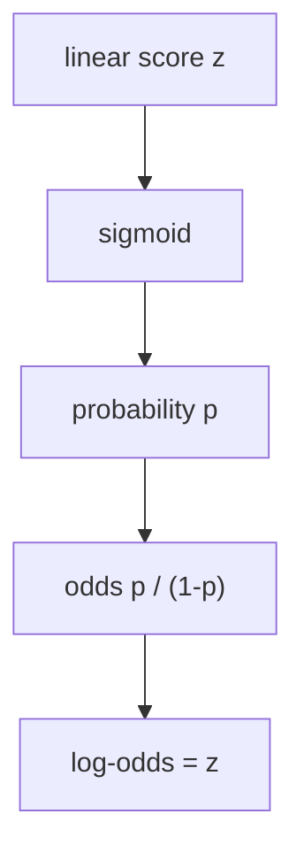
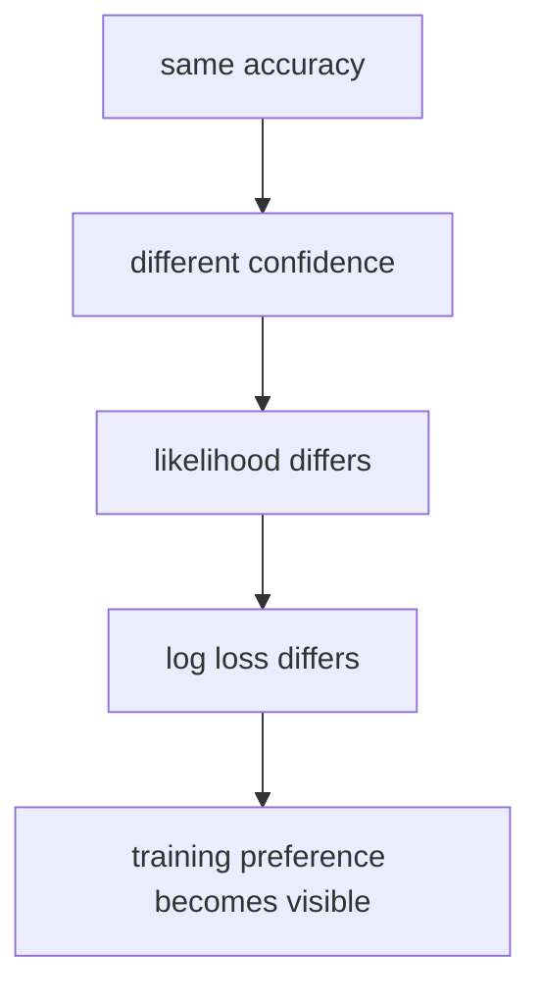

# P4-11.3 Supplementary Study: How To First Read Log-Odds and MLE

> Section ID: `P4-11.3`
> Version: `v2026.07.09`

In P4-11.1, we viewed logistic regression as `a linear classification model that produces a score readable like a probability`, and in P4-11.2, we read how that score divides input space through the perspective of a decision boundary. Once you get here, the next question naturally remains.

Why do we not handle probability itself directly with a linear expression, and why do terms like log-odds and maximum likelihood estimation (MLE) follow along?

This section is a supplementary study that closes that question. Its center is the `probability interpretation of logistic regression` and its `learning objective`. Multiclass (multinomial) extension, solvers, and regularization are handled separately later in P4-11.4 and P4-11.5.

## Scope Of This Section

This section answers the following questions.

- Why does log-odds appear?
- Why is logistic regression said to learn through maximum likelihood estimation (MLE)?
- How is log loss connected to MLE?

This section does not go deeply into the following topics.

- Detailed formulas for multiclass (multinomial) logistic regression
- Softmax expansion and comparison with one-vs-rest
- Differences across solvers and regularization settings
- Derivative expansion of negative log-likelihood and general optimization theory

The multiclass (multinomial) extension continues in P4-11.4, and solvers and regularization continue in P4-11.5. Derivative expansion of negative log-likelihood and general optimization theory remain outside the current scope of this book.

## Goals Of This Section

- You can explain the relationship among probability, odds, and log-odds at an introductory level.
- You can explain that `z = 0`, `probability 0.5`, and `odds 1` point to the same place.
- You can explain that logistic regression learns in the direction of `assigning high probability to the correct answer`.
- You can read MLE and log loss as two expressions of the same learning objective.

## Learning Background

Logistic regression usually starts with the explanation that it `adds a sigmoid and reads the result as a value between 0 and 1`. That explanation is enough for a first understanding, but as soon as you go a bit further, you immediately run into the following terms.

- logit or log-odds
- likelihood or log-likelihood
- MLE
- log loss

Beginners often get stuck here because the language suddenly changes into something that looks like a math textbook. But these names are not operating separately. They are the result of reading the same question from different directions.

1. Probability is constrained between 0 and 1, so it is hard to connect directly to a linear expression.
2. So log-odds appears to connect probability to a linear score.
3. In classification learning, you need to ask `how high a probability was assigned to the correct answer`.
4. So likelihood, MLE, and log loss appear together.

In other words, the core of this section is not memorizing a new algorithm. It is understanding why `probability interpretation` and `learning objective` continue in the same chapter.

## Main Learning Content

### Log-Odds Appears Because Probability Is Hard To Handle Directly With A Linear Expression

As seen in P4-11.1, logistic regression first makes a linear score \(z\), then passes it through a sigmoid and reads the result as a value between 0 and 1.

\[
p = \frac{1}{1 + e^{-z}}
\]

If you reverse this formula step by step with the feeling of `solving probability p back into z`, the following flow appears.

\[
p = \frac{1}{1 + e^{-z}}
\]

\[
\frac{1}{p} = 1 + e^{-z}
\]

\[
\frac{1-p}{p} = e^{-z}
\]

\[
\frac{p}{1-p} = e^z
\]

So if you finally take the logarithm, you get the following relation.

\[
\log \frac{p}{1-p} = z
\]

On the left, \(\frac{p}{1-p}\) is the odds, and its logarithm is log-odds or logit. The reason this formula matters is simple.

- Probability \(p\) is trapped between 0 and 1.
- By contrast, the linear expression \(z\) can freely move across negative and positive values.
- So if you want to connect `a scale convenient for linear expressions` and `a scale convenient to read like probability`, you need a transformation such as log-odds in the middle.

In other words, log-odds is not an unnecessarily difficult name. It is `the bridge that connects probability to a linear expression`.

The intuition becomes clearer in a small table.

| Probability \(p\) | Odds \(p / (1-p)\) | Log-odds |
| ---: | ---: | ---: |
| 0.10 | 0.111 | -2.197 |
| 0.50 | 1.000 | 0.000 |
| 0.80 | 4.000 | 1.386 |
| 0.90 | 9.000 | 2.197 |

The key point of this table is as follows.

- Probability 0.5 corresponds to log-odds 0.
- The more strongly the model leans toward class 1, the larger the positive log-odds becomes.
- The more strongly the model leans toward class 0, the smaller and more negative the log-odds becomes.

In other words, the explanation in P4-11.2 that `the decision boundary is where the linear score \(z = 0\)` can also be read back as saying that `probability 0.5`, `odds 1`, and `log-odds 0` all point to the same place.



### Maximum Likelihood Estimation (MLE) Means Finding The Direction That Gives High Probability To The Correct Answer

In linear regression, it is natural to think in terms of reducing squared error. But in classification, the correct answer is 0 or 1, so what matters more than `how close a continuous value is` is `how high a probability was assigned to the correct class`.

So logistic regression is usually explained as maximizing likelihood, or more often log-likelihood.

At this point, if the correct answer \(y_i\) for one sample in binary classification is 0 or 1, and the model's class 1 probability is \(p_i\), then the probability of one sample can be written in one line like this.

\[
P(y_i \mid x_i) = p_i^{y_i}(1-p_i)^{1-y_i}
\]

This expression looks unfamiliar at first, but it is really just a compressed way of saying `if the correct answer is 1, use p_i, and if the correct answer is 0, use 1-p_i`.

- If \(y_i = 1\), then \(p_i^{1}(1-p_i)^0 = p_i\)
- If \(y_i = 0\), then \(p_i^{0}(1-p_i)^1 = 1-p_i\)

If you look at all \(n\) data points together, the likelihood is grouped as a product.

\[
L(w, b) = \prod_{i=1}^{n} p_i^{y_i}(1-p_i)^{1-y_i}
\]

Products are inconvenient to handle, so we usually take the logarithm and convert it to log-likelihood.

\[
\log L(w, b) = \sum_{i=1}^{n} \left(y_i \log p_i + (1-y_i)\log(1-p_i)\right)
\]

And in implementation, rather than maximizing this value, we often put a minus sign in front and use the form of minimizing negative log-likelihood.

\[
-\log L(w, b) = - \sum_{i=1}^{n} \left(y_i \log p_i + (1-y_i)\log(1-p_i)\right)
\]

This formula is exactly the core form of log loss that you often see in binary logistic regression.

If you read this derivation line by line, it means the following.

1. One sample is read as `the probability corresponding to the correct answer`.
2. The whole dataset is read as `the product of the probabilities for all samples`.
3. To make computation easier, you take the logarithm so the product becomes a sum.
4. In implementation, it is more convenient to `make it smaller` than to `make it bigger`, so you attach a minus sign and turn it into a minimization problem.

At an introductory level, it is enough to first hold onto the following sentence.

`Maximum likelihood estimation is a way of finding parameters so that the current model explains the observed correct answers as plausibly as possible.`

### Looking At MLE Shows Why You Cannot Explain Learning With Accuracy Alone

A common misunderstanding at the introductory stage is, `Since this is a classification problem, isn't counting how many were correct enough?` Accuracy may be important at evaluation time, but the learning process has to distinguish finer differences.

For example, on a sample whose true label is 1:

- If model A gave 0.51, it was only barely correct.
- If model B gave 0.99, it was correct much more strongly.

From the viewpoint of accuracy alone, both are simply `correct`. But learning should not treat them as the same. MLE is exactly what lets you reflect this difference.

| Sample | True Label | Model A Class 1 Probability | Model B Class 1 Probability |
| --- | ---: | ---: | ---: |
| 1 | 1 | 0.55 | 0.90 |
| 2 | 0 | 0.45 | 0.10 |

Both models get the answers right under the 0.5 threshold. But model B is assigning much higher probability to the correct class. The idea that appears here is `let us judge the model that gave higher probability to the correct answer as better`. In logistic regression, MLE is the mathematical expression of exactly that idea.

Because of this, log loss is something you often see together with learning. Log loss can be read as `a value that penalizes more strongly when low probability is assigned to the correct answer`. In other words, MLE and log loss are saying the same learning objective from opposite directions.

## Cases And Examples

Before reading the cases, you can first fix the comparison frame for this section in one table as follows.

| Scene | The criterion a person would most easily use first | The limit of that criterion | What logistic regression changes | Result to confirm |
| --- | --- | --- | --- | --- |
| Probability interpretation | Look only at a value between 0 and 1 | The connection to the linear score is not visible | Connect probability and linear score through log-odds | \(z = 0\), \(p = 0.5\), and odds 1 are connected |
| Learning objective | Look only at whether it got the answer right | Misses the confidence difference inside the same accuracy | Read the confidence difference through MLE and log loss | Even with the same accuracy, learning evaluation can differ |

### Case 1. Why Does A Score Near The Boundary Feel Ambiguous

In pass prediction for an exam, if a student's class 1 probability is 0.51, the model is looking at that student as passing. But this value is not strong confidence. It is a decision near the boundary. If you recall log-odds here, the statement `the probability went a little above 0.5` becomes connected to the statement `the linear score \(z\) went a little above 0`.

In other words, the ambiguity that looked vague in a probability table gets read again as the structure of `a score near the boundary`.

### Case 2. Why Can Learning Evaluation Differ Even With The Same Accuracy

Suppose that in customer churn prediction, two models both got 86 out of 100 cases correct. But one model gives only scores like 0.51 and 0.52 to near-boundary cases, while the other gives scores like 0.80 and 0.88 to those same correctly predicted cases. The two models have the same accuracy, but `how strongly they assign confidence to the correct answer` is different.

This scene shows why MLE and log loss are needed. A classification model must distinguish not only `whether it was correct`, but also `how plausibly it explained the correct answer`.



## Practice And Example

### Reading Accuracy And Log Loss Together With A Python Example

The example below shows that `even when the same correct answers are matched, log loss changes depending on the strength of probability confidence`.

| Input Bundle | Meaning |
| --- | --- |
| `true_binary` | True labels of binary classification |
| `proba_model_a`, `proba_model_b` | Two probability examples with different confidence levels for the same correct answers |

```python
import numpy as np
from sklearn.metrics import log_loss

true_binary = np.array([1, 0, 1, 0])
proba_model_a = np.array([0.55, 0.45, 0.60, 0.40])
proba_model_b = np.array([0.90, 0.10, 0.85, 0.15])

pred_a = (proba_model_a >= 0.5).astype(int)
pred_b = (proba_model_b >= 0.5).astype(int)

print("binary accuracy A :", (pred_a == true_binary).mean())
print("binary accuracy B :", (pred_b == true_binary).mean())
print("log loss A        :", round(log_loss(true_binary, proba_model_a), 4))
print("log loss B        :", round(log_loss(true_binary, proba_model_b), 4))
```

An example output is as follows.

```text
binary accuracy A : 1.0
binary accuracy B : 1.0
log loss A        : 0.5543
log loss B        : 0.1446
```

You can read this output as follows.

- The two models have the same accuracy, but different log loss.
- In other words, from the learning perspective connected to MLE, `how strongly the correct answer was supported` is distinguished.
- So when understanding logistic regression, it is important to keep the sense of distinguishing the `evaluation metric` from the `learning objective function`.

## Next Connection

Once you get here, the `probability interpretation` and `learning objective` of logistic regression close. In the next supplementary study, this sense expands beyond `choosing one of two` into `choosing one among several classes`, that is, into the basic structure for reading multiclass (multinomial) logistic regression.

## Sources And References

- C.M. Bishop, *Pattern Recognition and Machine Learning*, Springer, 2006.
- scikit-learn, `log_loss` API documentation, [https://scikit-learn.org/stable/modules/generated/sklearn.metrics.log_loss.html](https://scikit-learn.org/stable/modules/generated/sklearn.metrics.log_loss.html){: target="_blank" rel="noopener noreferrer" }, checked on 2026-07-09
- scikit-learn, `LogisticRegression` API documentation, [https://scikit-learn.org/stable/modules/generated/sklearn.linear_model.LogisticRegression.html](https://scikit-learn.org/stable/modules/generated/sklearn.linear_model.LogisticRegression.html){: target="_blank" rel="noopener noreferrer" }, checked on 2026-07-09
