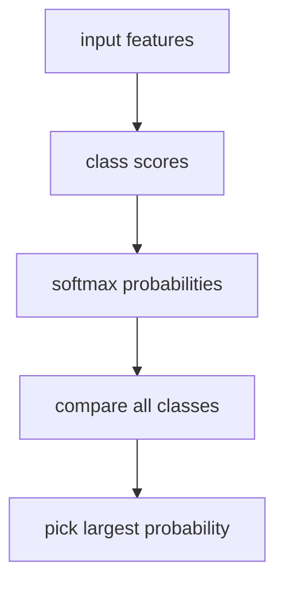

# P4-11.4 Supplementary Study: How To Read Multiclass (Multinomial) Logistic Regression

> Section ID: `P4-11.4`
> Version: `v2026.07.09`

The log-odds and MLE discussed in P4-11.3 were basically explained using `binary classification, where you choose one of two`. But in real classification problems, there are many cases where you choose one among three or more.

The central question of this section is the following.

How does the sense of `score -> probability -> class choice` learned in binary classification continue into problems with multiple classes?

## Scope Of This Section

This section answers the following questions.

- What is preserved in multiclass (multinomial) problems?
- Why does softmax appear?
- How should the difference between one-vs-rest and multinomial be read?

This section does not go deeply into the following content.

- Derivative expansion of softmax
- Strict matrix formulas for multiclass log-likelihood
- Differences in numerical optimization across solvers

The implementation perspective on solvers and regularization continues in P4-11.5. Derivative expansion of softmax and strict matrix formulas for multiclass log-likelihood remain outside the current scope of this book.

## Goals Of This Section

- You can explain that even in multiclass settings, the structure `input -> score -> probability comparison -> class choice` is preserved.
- You can read softmax as `a function that turns class-wise scores into a probability distribution`.
- You can explain the difference between one-vs-rest and multinomial at an introductory level.

## Learning Background

When logistic regression is first introduced in P4-11.1, you usually look at one `class 1 probability` and compare it with a threshold. But many real problems, such as news classification, customer inquiry classification, and image classification, are not problems of choosing one of two. They are problems of choosing one among several classes.

For example:

| Problem | Example Classes |
| --- | --- |
| News classification | Politics / Economy / Sports |
| Customer inquiry classification | Refund / Shipping / Account |
| Image classification | Cat / Dog / Bird |

What the reader should first grasp here is not that `a completely different model begins`, but that `the reading frame learned in binary classification widens`.

## Main Learning Content

### The Structure Of Comparing Scores And Probabilities Is Preserved Even In Multiclass Settings

In multiclass settings, you can think of making a score \(z_k\) for each class \(k\).

\[
z_k = w_k^\top x + b_k
\]

And to turn these scores into a probability distribution, softmax is usually used.

\[
P(y = k \mid x) = \frac{e^{z_k}}{\sum_{j=1}^{K} e^{z_j}}
\]

The key point of this formula is simple.

- The numerator is `the score of the current class k`
- The denominator is `the sum of the scores of all classes`
- Therefore, the probability of one class is always determined by `relative comparison among all classes`

In other words, the minimum formula structure of multiclass logistic regression is two lines: `make a score for each class`, and `normalize those scores together into a probability distribution`.

### The Threshold Sense Of Binary Classification Shifts To The Sense Of Argmax In Multiclass Settings

If the core intuition in binary classification was `does it exceed 0.5`, then in multiclass settings the core intuition usually becomes `which class probability is largest`.

- Binary classification: look at one `class 1 probability` and compare it with a threshold
- Multiclass: look at `class-wise probabilities` and choose the largest value

This change connects directly to P4-11.1. Beginners can easily misunderstand this as `if several probabilities come out, is this a more complex completely different model?`, but the core structure is still `input -> score -> probability comparison -> class choice`.

### One-Vs-Rest And Multinomial Differ In The Way They Compare

At the introductory stage, it is enough to grasp the difference between one-vs-rest and multinomial roughly as follows.

- one-vs-rest: treat each class separately as `is it this class or not`, then compare later
- multinomial: place the classes together at once and read them as a structure of relative comparison

If you convert it into a very small customer inquiry classification scene, the difference becomes easier to read.

| Reading Method | How It Reads The Same Inquiry |
| --- | --- |
| one-vs-rest | It separately asks `is this a refund inquiry?`, `is this a shipping inquiry?`, `is this an account inquiry?`, then compares them later. |
| multinomial | It places `refund / shipping / account` together at once and immediately compares which one looks most plausible. |

There is no need in the current section to push long into detailed matrix formulas and the full softmax expansion. What matters is the connection that `the sense of comparing score and probability learned in binary classification continues into multiple classes as well`.

The shape on the likelihood side also expands with the same idea as binary classification. If you think of the correct class as given like a one-hot vector, the log-likelihood of multiclass classification is usually read in the following summed form.

\[
\log L = \sum_{i=1}^{n}\sum_{k=1}^{K} y_{ik} \log P(y=k \mid x_i)
\]

Here, \(y_{ik}\) means `1 if the true answer of sample i is class k, and 0 otherwise`. This expression, too, is ultimately the multiclass version of the idea `judge the side that gave high probability to the true class as better`.

## Cases And Examples

Before reading the cases, you can first set the comparison frame for this section in one table as follows.

| Scene | The criterion a person would easily use first | The limit of that criterion | What multiclass logistic regression changes | Result to confirm |
| --- | --- | --- | --- | --- |
| Several-class classification | Recall the 0.5 threshold as-is | Misreads a multiple-class comparison problem | Makes you compare relatively through softmax and argmax | Select the class with the largest probability |
| Implementation choice | Look at each class separately | Misses the relative comparison among classes | Read them as competing all at once through the multinomial structure | See the full class distribution together |

### Case 1. In Multiclass Settings, Relative Comparison Matters More Than 0.5

Suppose that in customer inquiry classification, the three classes are `refund`, `shipping`, and `account`. If the probabilities for one inquiry come out as `[0.41, 0.39, 0.20]`, there is no value above 0.5. But the model is still viewing `refund` as the most plausible.

This scene shows that in multiclass settings, `what is largest` becomes more important than `does it exceed 0.5`.

### Case 2. Even With The Same Input, One-Vs-Rest And Multinomial Read It Differently

If an inquiry contains expressions such as `refund`, `payment cancellation`, and `account lock` all mixed together, one-vs-rest checks each class separately and compares afterward. By contrast, multinomial places the full set of classes together at once and assigns relative probabilities. From a beginner's point of view, the latter can often be easier to read as `one comparison structure`.



## Practice And Example

### Reading A Multiclass Probability Table With A Python Example

The example below shows the basic intuition that in multiclass settings, what you read is not `does it exceed 0.5`, but `which probability is the largest`.

| Input Bundle | Meaning |
| --- | --- |
| `class_names` | List of class names |
| `multi_proba` | Example of class-wise probability distributions |

```python
import numpy as np

class_names = ["refund", "shipping", "account"]
multi_proba = np.array([
    [0.41, 0.39, 0.20],
    [0.18, 0.63, 0.19],
    [0.22, 0.28, 0.50],
])

print("multiclass predictions")
for row in multi_proba:
    best_idx = int(np.argmax(row))
    print(
        "  probs =",
        np.round(row, 2),
        "->",
        class_names[best_idx],
    )
```

An example output is as follows.

```text
multiclass predictions
  probs = [0.41 0.39 0.2 ] -> refund
  probs = [0.18 0.63 0.19] -> shipping
  probs = [0.22 0.28 0.5 ] -> account
```

You can read this output as follows.

- In the first row, even though no value exceeds 0.5, it chooses `refund`, which has the largest probability.
- In multiclass settings, `relative comparison across the whole probability distribution` matters more than `one probability vs. a threshold`.
- In other words, the basic intuition moves from threshold toward argmax.

## Next Connection

Once you get here, the `multiclass extension` of logistic regression closes. In the next supplementary study, you will look at why, even within the same logistic regression, you encounter settings such as solver, penalty, and `C`, and why these settings are not just implementation options but comparison conditions.

## Sources And References

- C.M. Bishop, *Pattern Recognition and Machine Learning*, Springer, 2006.
- scikit-learn, linear models user guide, [https://scikit-learn.org/stable/modules/linear_model.html#logistic-regression](https://scikit-learn.org/stable/modules/linear_model.html#logistic-regression){: target="_blank" rel="noopener noreferrer" }, checked on 2026-07-09
- scikit-learn, `LogisticRegression` API documentation, [https://scikit-learn.org/stable/modules/generated/sklearn.linear_model.LogisticRegression.html](https://scikit-learn.org/stable/modules/generated/sklearn.linear_model.LogisticRegression.html){: target="_blank" rel="noopener noreferrer" }, checked on 2026-07-09
