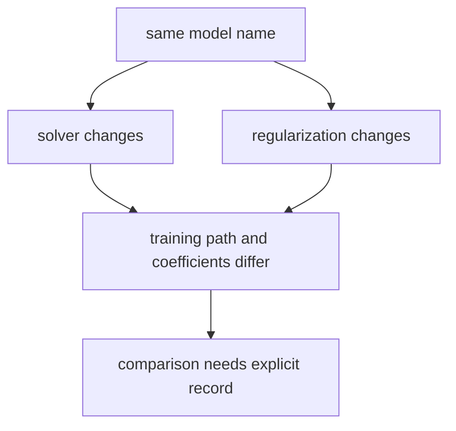

# P4-11.5 Supplementary Study: How To First Read Solver and Regularization

> Section ID: `P4-11.5`
> Version: `v2026.07.09`

If you use logistic regression through a library, you soon encounter arguments such as solver, penalty, and `C`. Beginners often feel at this point that `it suddenly jumped into implementation details`. But these settings are not noise completely separated from the theory.

The central question of this section is the following.

Why do you need to record and compare solver and regularization settings even for the same logistic regression?

## Scope Of This Section

This section answers the following questions.

- What does a solver do?
- What does regularization control?
- In what direction should penalty and `C` be read?

This section does not go deeply into the following content.

- Proofs of the internal optimization algorithms of each solver
- General theory of convex optimization
- Strict statistical interpretation of regularization

Proofs of the internal optimization algorithms of each solver, the general theory of convex optimization, and the strict statistical interpretation of regularization remain outside the current scope of this book.

## Goals Of This Section

- You can explain a solver as `the computational procedure that actually finds the parameters`.
- You can explain regularization as `a mechanism that controls the model so it does not fit the training data too tightly`.
- You can read the direction of L1, L2, Elastic-Net, and `C` at a beginner level.
- You can explain that even with the same model name, setting differences can change result interpretation.

## Learning Background

Logistic regression is usually implemented not by directly writing a closed-form solution, but by finding good parameters through repeated computation. So depending on the data size, whether the input is a sparse matrix, and what regularization term is used, the choice of settings becomes important.

You can first read regularization as `a mechanism that controls the model so it does not fit the training data too tightly`. Even with the same logistic regression, if the data is small or the number of features is large, coefficients can grow unstably or lean too heavily on particular features. At such times, regularization helps keep the coefficients more conservative.

## Main Learning Content

### A Solver Is The Procedure That Actually Computes Learning

First, solver is connected to `how the parameters of this model will actually be found`.

If you organize it briefly in a table, it looks like this.

| Setting | Meaning To Understand First In This Section | Question To Look At More Deeply Later |
| --- | --- | --- |
| solver | Computational procedure that actually finds the parameters | What is favorable depending on data size and sparsity |
| penalty | The regularization method that decides how conservatively to hold the coefficients | What difference do L1 and L2 create |
| `C` | A control value in the opposite direction of regularization strength | How do you read between overfitting and underfitting |

In other words, solver is not `a trivial option in a library`. It is the handle that implements, through actual computation, the learning objective set up by MLE or log loss.

The table below summarizes implementation behavior based on the scikit-learn stable documentation checked on `2026-07-09`. Since solver support range and defaults can change across library versions, in actual practice or projects you should check the documentation for the version you are using again.

| solver | Multiclass (multinomial) | penalty / regularization | Characteristic To Read First |
| --- | --- | --- | --- |
| `lbfgs` | supported | L2 or no regularization | Broadly safe as a default |
| `liblinear` | direct multinomial unsupported | L1, L2 | Often mentioned for small data and binary classification |
| `newton-cg` | supported | L2 or no regularization | Optimization family based on second-order information |
| `newton-cholesky` | supported | L2 or no regularization | A candidate when `n_samples` is very large and there are many one-hot features |
| `sag` | supported | L2 or no regularization | Often fast on large data, sensitive to scaling |
| `saga` | supported | L1, L2, Elastic-Net | Convenient for sparse input and Elastic-Net as well |

When reading this table, the first judgments to hold are about this level.

- First check whether `you want to use multinomial directly`.
- Check whether `L1` or `Elastic-Net` is needed.
- If the data is large and also has many features, first recall families favorable for large data.
- If you need a default starting point, `lbfgs` becomes a reasonable first candidate.

### Regularization Is A Mechanism That Keeps Coefficients More Conservative

On the regularization side as well, at least the following intuition should be visible.

| Setting | Form Seen In The Formula | Meaning To Read At An Introductory Level |
| --- | --- | --- |
| L2 | \(\lambda \sum_j w_j^2\) | Presses coefficients down overall to reduce excessive fluctuation |
| L1 | \(\lambda \sum_j |w_j|\) | Can strongly push some coefficients toward 0 and create sparsity |
| Elastic-Net | \(\lambda_1 \sum_j |w_j| + \lambda_2 \sum_j w_j^2\) | Mixes the character of L1 and L2 |
| `C` | Reciprocal of regularization strength | The smaller `C` is, the stronger the regularization becomes |

If you immediately convert these formulas into interpretive sentences, they become the following.

- L2 means `large coefficients are generally less preferred`, so it can be read as reducing cases where the boundary is pulled too much by one specific feature.
- L1 means `coefficients of less important features can be pushed to 0`, so it is more directly connected to a feature selection effect.
- Elastic-Net can be read as a compromise of `wanting to shrink things overall, but also wanting to make some of them 0`.
- `C` is a control handle often seen in scikit-learn, and you must remember the direction that `the smaller it is, the stronger the regularization`.

### Solver And Regularization Are Not Implementation Options But Comparison Conditions

In P4-8, when comparing baselines, we saw that comparison only works when they are placed on `the same split, the same metrics, and the same failure cases`. Solver and regularization should be read similarly.

- If you change the solver, the computation process and convergence characteristics can change.
- If you change the regularization strength, the coefficient size and the conservativeness of the boundary can change.

In other words, even if you say `the same logistic regression`, in actual comparison you have to record which solver and which regularization were used. Only then can you distinguish whether a performance difference came from `the model structure itself` or from `the setting difference`.

## Cases And Examples

Before reading the cases, you can first set the comparison frame for this section in one table as follows.

| Scene | The criterion a person would easily use first | The limit of that criterion | What solver / regularization changes | Result to confirm |
| --- | --- | --- | --- | --- |
| Setting choice | Assume the default is enough | Misses data structure and setting differences | Makes you read computational procedure and regularization strength as comparison conditions | Even with the same model name, result interpretation can change |
| Coefficient interpretation | Accept large coefficients as they are | Misses instability from too little data or too many features | Leads to more conservative coefficient interpretation through regularization | Stability of the boundary and coefficients can change |

### Case 1. Why Are Sparse Text Classification And Structured Tabular Data Hard To Read With The Same Settings

In spam classification with many words, it is common to have many features and sparse input. By contrast, in structured tabular data such as customer churn prediction, the number of features may be relatively small and interpretability may matter more. At that point, solver and regularization are not universal constants fixed at the same value. They become handles that must be read again depending on the data structure and operational purpose.

### Case 2. How Do You Distinguish Whether A Performance Difference Comes From The Model Or From The Settings

Suppose experiment A and experiment B are both logistic regression, but one uses `lbfgs + L2` while the other uses `saga + Elastic-Net`. You should not read the difference in results simply as `logistic regression got better`. In this case, the difference in settings may be a larger cause than the model name.



## Practice And Example

### Looking At A Way To Leave Setting Comparison Records With A Python Example

The example below is toy code that shows not actual learning, but `how comparison records should be left`.

```python
from sklearn.linear_model import LogisticRegression

configs = [
    {
        "name": "baseline_lr",
        "solver": "lbfgs",
        "penalty": "l2",
        "C": 1.0,
    },
    {
        "name": "sparse_candidate",
        "solver": "saga",
        "penalty": "elasticnet",
        "l1_ratio": 0.5,
        "C": 0.5,
    },
]

models = []
for cfg in configs:
    kwargs = {
        "solver": cfg["solver"],
        "penalty": cfg["penalty"],
        "C": cfg["C"],
        "max_iter": 1000,
    }
    if "l1_ratio" in cfg:
        kwargs["l1_ratio"] = cfg["l1_ratio"]
    models.append((cfg["name"], LogisticRegression(**kwargs)))

for name, model in models:
    print(name, "->", model)
```

What matters in this example is not running the model immediately, but the point that `even with the same logistic regression, you separately record which setting combinations were compared`.

An example output is as follows.

```text
baseline_lr -> LogisticRegression(max_iter=1000)
sparse_candidate -> LogisticRegression(C=0.5, l1_ratio=0.5, max_iter=1000,
                                       penalty='elasticnet', solver='saga')
```

## Next Connection

Once you get here, the supplementary learning axis of Chapter 11 closes. In other words, logistic regression can be read in five layers: `scores readable like probabilities`, `boundaries`, `log-odds and MLE`, `multiclass extension`, and `learning computation and regularization settings`.

## Sources And References

- scikit-learn, `LogisticRegression` API documentation, [https://scikit-learn.org/stable/modules/generated/sklearn.linear_model.LogisticRegression.html](https://scikit-learn.org/stable/modules/generated/sklearn.linear_model.LogisticRegression.html){: target="_blank" rel="noopener noreferrer" }, checked on 2026-07-09
- scikit-learn, linear models user guide, [https://scikit-learn.org/stable/modules/linear_model.html#logistic-regression](https://scikit-learn.org/stable/modules/linear_model.html#logistic-regression){: target="_blank" rel="noopener noreferrer" }, checked on 2026-07-09
