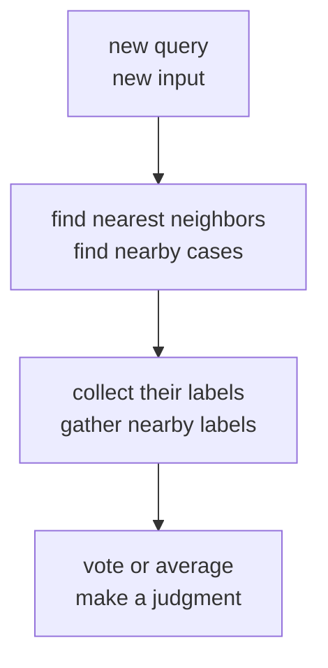
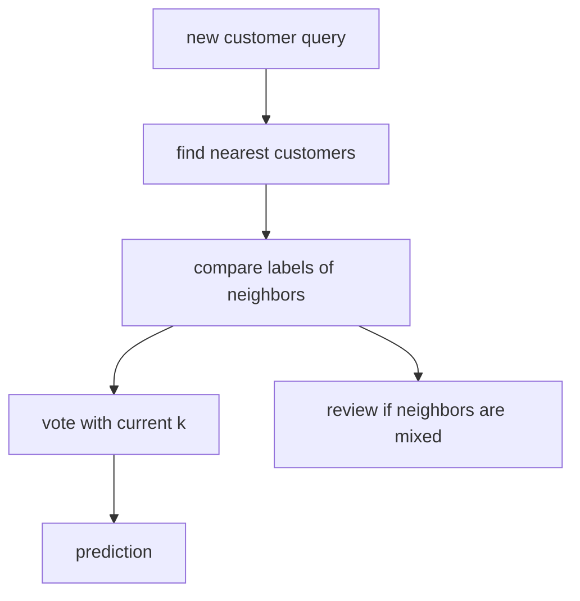

# P4-12.1 The Intuition Of k-NN

> Section ID: `P4-12.1`
> Version: `v2026.07.10`

In P4-11.2, we saw logistic regression as `a way of dividing classes by drawing a boundary in input space`. Now we change the question.

Instead of making a straight line first, could we make a judgment by looking at similar nearby cases?

This question is the starting point of k-NN (k-nearest neighbors). It is more accurate to read k-NN not as `a model that first sets up a formula`, but as `a model that first finds similar cases around a new input`.

## Scope Of This Section

This section answers the following questions.

- By what idea does k-NN make judgments?
- What roles do `query`, `neighbor`, `label`, and `k` each play?
- How does the character of the judgment change when `k` changes?
- In k-NN, what should we think training does?

This section does not go deeply into the following content.

- Differences among distance functions
- Why scale changes the result
- An application guide for what to check first when using k-NN

Those topics continue in `P4-12.2 Distance and Scale` and `P4-12.3 What Should You Check First When Using k-NN?`.

## Goals Of This Section

- You can explain k-NN as `a method that gathers nearby cases and makes a judgment by majority vote or average`.
- You can explain what `query`, `training data`, `neighbor`, and `label` each do inside the judgment.
- You can explain the difference between when `k` is too small and when it is too large.
- You can explain that learning in k-NN is closer to `preparing reference cases for comparison` than to `making a complex formula`.

## Main Learning Content

### By What Method Does k-NN Make Judgments

k-NN first looks at a new input (query). Next, it finds cases close to the query in training data that already has labels attached. Finally, it gathers the labels of those neighbors and makes a judgment by majority vote or average.

If you summarize it briefly, the order is as follows.

1. A new input (query) comes in.
2. Find nearby cases in the existing training data.
3. Gather the labels of the nearby cases.
4. Decide the result by majority vote or average.

In other words, k-NN can be read as `not interpreting a new point alone, but making a judgment by comparing it with already known nearby cases`.

### What Does Each Term Do Inside The Judgment

| Term | Role Inside The Judgment |
| --- | --- |
| query | The new input you want to predict now. |
| training data | A collection of reference cases where input and label already exist together. |
| neighbor | A case chosen as evidence for judgment because it is close to the query. |
| label | The already known correct answer or category that each reference case has. |
| `k` | The value that decides how many neighbors to look at when making the judgment. |

The reason this table matters is that k-NN is closer to `how to read reference cases` than to `a method that calculates a formula inside the model`.

### Why Use Nearby Cases As Evidence

The core assumption of k-NN is that `similar inputs are likely to have similar outputs`. This assumption is not always correct, but in problems where local similarity actually has meaning, it becomes a strong starting point.

For example:

- Customers with similar purchase patterns may show similar reactions.
- Users with similar click flows may be closer to similar product-interest categories.
- Students with similar score patterns may be grouped into similar result categories.

If you reduce this intuition into computational order, it becomes as follows.



However, `close` does not mean `correct`. The neighbors themselves can change depending on what rule is used to calculate closeness. That exact point is handled in the next section.

### What Does `k` Change

`k` decides how many neighbors to look at when making a judgment.

- If `k = 1`, you look at only the single closest one.
- If `k = 3`, you look at the three closest ones.
- If `k = 5`, you look at five and judge more broadly.

Even for the same query, the character of the judgment changes when `k` changes.

| `k` Value | Visible Character |
| --- | --- |
| Too small | Becomes sensitive to one or two nearby cases. |
| Moderate | Can preserve local patterns while reducing instability. |
| Too large | Farther cases may get mixed in, and the boundary can become dull. |

This becomes clearer in a small toy example.

| Labels of Neighbors Around The Query | `k = 1` | `k = 3` | `k = 5` |
| --- | --- | --- | --- |
| `1, 0, 0, 0, 0` | `1` | `0` | `0` |

This example shows that if you look only at the single nearest one, the result is `1`, but if you widen to three or five, the result can change because there are more `0`s. In other words, `k` is not just a simple number. It is the handle that decides `how narrowly to look` and `how broadly to look`.

### What Does Training Do In k-NN

In linear regression or logistic regression, we usually say that `the coefficients are learned`. k-NN has a different atmosphere.

At the introductory level, learning in k-NN is mostly close to the following.

- Store the inputs and labels.
- Prepare for comparison when a new input comes in.
- If needed, use internal structures to speed up distance calculation.

In other words, k-NN should be read as `learning that prepares reference cases for later comparison`, rather than `learning that makes a sophisticated formula in advance`.

That is why two features follow k-NN together.

- How the data is organized and represented matters.
- Comparison cost can become large at prediction time.

For example, if there are 100 training cases, you only need 100 comparisons for one query. But if there are 100,000 cases, you have to compare that same query far more times. Saying that `learning is simple` does not mean `preparation is less important`. It is closer to saying that `judgment cost may show up more at prediction time than at training time`.

### What Is Different From A Linear Boundary Model

Logistic regression first asks `how should one formula or boundary divide the whole space well?` By contrast, k-NN first asks `what kinds of cases are gathered around this point?`

| Model Perspective | Central Question |
| --- | --- |
| Logistic regression | What boundary line would divide the classes well? |
| k-NN | What class do the similar cases around the new point belong to? |

Because of this difference, k-NN puts `local neighbors` ahead of `global rules`.

## Cases And Examples

### Case 1. When You Want To Judge A New Customer First Through Similar Existing Customers

A subscription service team wants to judge the possibility that a new customer will churn. People first look at behavior signals such as `recent visit count`, `inquiry frequency`, `payment amount`, and `time of access`.

But the team has not yet found a simple formula strong enough to say `customers who churn always follow this rule`. Instead, when they look at existing customer records, they often find that customers with similar behavior also had similar outcomes. At that point, k-NN does not interpret the new customer alone. It first finds a few most similar existing customers nearby and refers to their labels.



This case shows three key points.

- k-NN is closer to `a model that first refers to nearby cases` than to `a model that first sets up a rule`.
- If `k=1`, it can become sensitive to one person's exceptional case, and if `k=5`, it can be more stable, but the boundary can become dull.
- If the composition of neighbors is split, that is first a signal telling you `this is a query to review again`.

## Practice And Example

### Looking At A Small k-NN With A Python Example

- Problem situation: look at which of two existing groups a new point is closer to.
- Input: two features that can be read like two-dimensional coordinates
- Correct answer (label): class 0 / class 1
- Concepts to confirm:
  - Prediction is made by looking at neighbor labels.
  - Even with the same query, the result can actually change when `k` changes.
  - A query near the boundary can be easily unstable to interpret.

```python
from math import dist
from collections import Counter

train = [
    ((4.1, 4.1), 1),
    ((3.7, 4.0), 0),
    ((3.8, 4.3), 0),
    ((4.2, 3.8), 0),
    ((4.4, 4.0), 1),
]

query = (4.0, 4.2)

def knn_predict(train, query, k):
    ranked = sorted(
        [(dist(point, query), point, label) for point, label in train],
        key=lambda x: x[0],
    )
    neighbors = ranked[:k]
    labels = [label for _, _, label in neighbors]
    prediction = Counter(labels).most_common(1)[0][0]
    return prediction, neighbors

for k in [1, 3, 5]:
    prediction, neighbors = knn_predict(train, query, k)
    print(f"k={k}, prediction={prediction}")
    for d, point, label in neighbors:
        print(" ", point, "label=", label, "distance=", round(d, 3))
    print()
```

An example output is as follows.

```text
k=1, prediction=1
  (4.1, 4.1) label= 1 distance= 0.141

k=3, prediction=0
  (4.1, 4.1) label= 1 distance= 0.141
  (3.8, 4.3) label= 0 distance= 0.224
  (3.7, 4.0) label= 0 distance= 0.361

k=5, prediction=0
  (4.1, 4.1) label= 1 distance= 0.141
  (3.8, 4.3) label= 0 distance= 0.224
  (3.7, 4.0) label= 0 distance= 0.361
  (4.4, 4.0) label= 1 distance= 0.447
  (4.2, 3.8) label= 0 distance= 0.447
```

This output concretely shows that `k` is not just a simple number, but a handle that changes the range of judgment.

- At `k=1`, the closest single point is class 1, so the prediction is also `1`.
- But when it widens to `k=3`, two of the three nearby points are class 0, so the prediction changes to `0`.
- At `k=5`, class 0 is still more numerous, so it remains `0`.

In other words, this example closes the point that `the exception of the single nearest point` and `the local majority seen a bit more broadly` can say different things. What should first be read here is not the score, but `which neighbors were included, and because of that, how the majority vote changed`.

This query `(4.0, 4.2)` also continues into the next sections. In `P4-12.2`, you will see how different neighbors can appear if `the rule for calculating closeness` changes, and in `P4-12.3`, you will read what should be checked first when the same query becomes unstable.

## Perspectives To Remember In This Section

- k-NN makes judgments by comparing a new input with already known surrounding cases.
- `query`, `neighbor`, `label`, and `k` each play different roles inside the judgment.
- `k` is not just a simple number, but a handle that controls the judgment range.
- Learning in k-NN is closer to `preparing reference cases for comparison` than to `making a formula`.

## Short Check

- Can you explain k-NN as `a way of making a judgment by gathering nearby cases`?
- Can you explain the difference between when `k` is too small and when it is too large?
- Do you understand that comparison cost can become large at prediction time in k-NN?

## Sources And References

- scikit-learn, *Nearest Neighbors*, scikit-learn User Guide, checked on 2026-06-27. <https://scikit-learn.org/stable/modules/neighbors.html>{: target="_blank" rel="noopener noreferrer" }
