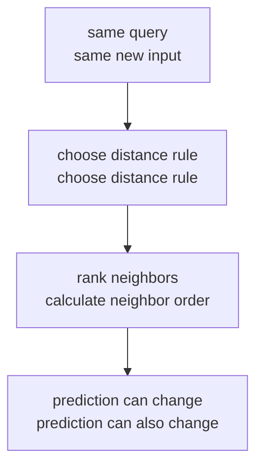
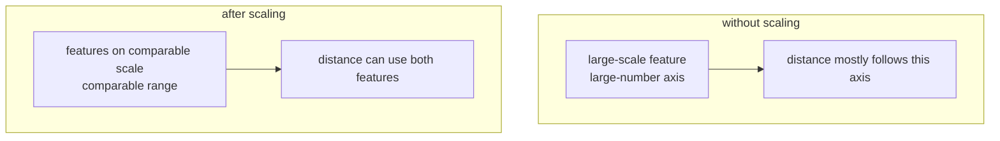
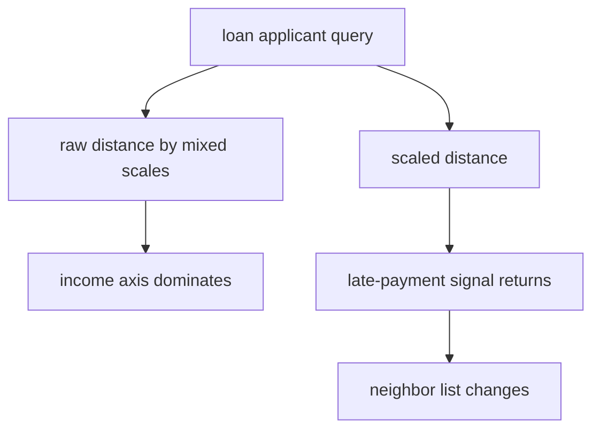

# P4-12.2 Distance and Scale

> Section ID: `P4-12.2`
> Version: `v2026.07.10`

In P4-12.1, we said that k-NN (k-nearest neighbors) is `a model that makes judgments by looking at nearby cases`. But the most important word here is actually `near`.

What exactly does nearness mean?

If you try to understand k-NN without this question, then you have not understood the model, only the result. In k-NN, `what standard is used to calculate nearness` is part of the model.

## Scope Of This Section

This section answers the following questions.

- What role does distance play in k-NN?
- If the distance function changes, can neighbor order and prediction also change?
- Why can scale distort distance calculation?
- In the interpretation of k-NN, what does standardization change?

This section does not go deeply into the following content.

- Comparison of the mathematical properties of all distance functions (metrics)
- The full system of preprocessing
- The theory of distance concentration in high-dimensional spaces

The purpose and types of preprocessing itself remain anchored at `P4-7.2 Preprocessing` as the reference explanation location. Here, we focus only on `why distance and scale change judgment in k-NN`.

## Goals Of This Section

- You can explain that the distance function is not `a setting outside the model`, but `part of the judgment rule`.
- You can explain that if the distance function changes, neighbor order and prediction can change.
- You can explain that if feature units (scales) differ, a large axis can dominate distance.
- You can explain that standardization is not `making numbers look nice`, but `resetting the comparison standard`.

## Main Learning Content

### Distance Is The Judgment Rule Of The Model

k-NN calculates the distance between a new input and existing data, then finds the nearest neighbors. Therefore, the distance function is not just a computational tool. It is the rule that decides `who will be selected as a neighbor`.

- Euclidean distance: a way of reading it like straight-line distance
- Manhattan distance: a way of summing movement along axes

Even for the same query, if the distance rule changes, the neighbor order can change, and the prediction can also change.



The key sentence is this.

`The distance function is part of the perspective used to interpret the input.`

### If The Distance Function Changes, Neighbor Order Can Change

For example, suppose the query and two candidate points are as follows.

| Target | Coordinates |
| --- | --- |
| query | (0, 0) |
| point A | (3, 0) |
| point B | (2, 2) |

Under Euclidean distance:

- distance between query and A = 3
- distance between query and B = about 2.83

So B is closer.

But under Manhattan distance:

- distance between query and A = 3
- distance between query and B = 4

This time A is closer.

This example shows `distance-rule change -> neighbor-order change`. In actual k-NN, if the neighbor order changes, the labels entering the majority vote can also change, and then the final prediction can change as well.

### Why Can Scale Distort Distance Calculation

Scale matters just as much as the distance function. Even if two features are both numbers, they are not necessarily read with the same weight in distance calculation.

For example, suppose two features are as follows.

- annual income: from millions to tens of millions
- late payments: 0, 1, 2, 7 times

Both may be important information. But if you leave the numeric ranges as they are, differences on the annual-income side look much larger. Then distance calculation asks more strongly `who has a similar income number` than `who has a similar late-payment pattern`.

At this point, there are two things to distinguish.

- unit difference: the numeric magnitude systems can differ from the start, such as won, seconds, and counts
- variance difference: even among numeric features, one axis can have a much wider spread of values

Both can ultimately lead to a similar problem: `the large axis dominates distance`.



### What Does Standardization Change

Standardization is not decoration that makes numbers pretty. More precisely, it is the act of resetting `the balance of how much each feature influences distance calculation`.

At a representative level, it is enough to understand it in the following order.

- subtract the mean from each feature
- divide each feature by its standard deviation
- then large-unit and small-unit features can be moved into a more comparable range

In other words, standardization can be seen as `putting previously ignored features back into the comparison`.

But this does not mean that it `always improves performance`. The feature brought back into the comparison may be useful information, but it may also be noise.

## Cases And Examples

### Case 1. Loan-Risk Classification Where Late-Payment Records Get Hidden Because Income Is A Large Number

A loan-screening support model wants to divide a new applicant into `safe` and `risky`. The signals people looked at first were things such as `annual income`, `late-payment count`, `existing loan size`, and `repayment record`.

The problem is that the units of these columns differ greatly. Annual income is a number in the millions or tens of millions, while late-payment count is on the level of 0 to a few occurrences. If you calculate k-NN distance in this state, then even if late-payment count is actually important, it can get buried under the income difference.



The key points this case shows are as follows.

- Distance and scale are not trivial choices outside preprocessing. They are part of the judgment rule.
- Even if the data stays the same, if the representation changes, the very identity of `the nearby person` can change.
- Therefore, when comparing before and after scale adjustment, you should read first not the `score`, but `which neighbors entered and left`.

## Practice And Example

### Comparing Raw Distance And Distance After Scale Adjustment With A Python Example

- Problem situation: check whether a new customer is closer to the `safe` side or the `risky` side.
- Input: annual income, late-payment count
- Correct answer (label): `safe` / `risky`
- Concepts to confirm:
  - In the raw numbers, income with its large unit can dominate distance.
  - After standardization, information from the small axis can become active again.
  - Therefore, even for the same query, the order of nearest neighbors can change.

The reading order can be set as follows.

1. Look at which group appears closer in the raw distance.
2. Look at which neighbors became newly closer after standardization.
3. If a difference appears, first interpret whether `the model changed` or `the calculation standard for nearness changed`.

```python
from math import sqrt
from collections import Counter

train = [
    ((1800000, 1), "safe"),
    ((2200000, 0), "safe"),
    ((9000000, 7), "risky"),
    ((9500000, 8), "risky"),
]

query = (6000000, 0)

def euclidean(a, b):
    return sqrt(sum((x - y) ** 2 for x, y in zip(a, b)))

def zscore_from_train(train_points):
    cols = list(zip(*train_points))
    means = [sum(col) / len(col) for col in cols]
    stds = []
    for i, col in enumerate(cols):
        m = means[i]
        var = sum((x - m) ** 2 for x in col) / len(col)
        stds.append(var ** 0.5)
    return means, stds

def scale(point, means, stds):
    return tuple((x - m) / s for x, m, s in zip(point, means, stds))

def ranked_neighbors(points_with_labels, query_point):
    ranked = []
    for point, label in points_with_labels:
        ranked.append((euclidean(point, query_point), point, label))
    return sorted(ranked, key=lambda x: x[0])

def majority_vote(labels):
    return Counter(labels).most_common(1)[0][0]

train_points = [point for point, _ in train]
means, stds = zscore_from_train(train_points)

print("raw distances")
raw_ranked = ranked_neighbors(train, query)
for distance, point, label in raw_ranked:
    print(point, label, round(distance, 3))

print()

scaled_query = scale(query, means, stds)
print("scaled distances")
scaled_ranked = []
for point, label in train:
    scaled_point = scale(point, means, stds)
    scaled_ranked.append((euclidean(scaled_point, scaled_query), point, label, scaled_point))
scaled_ranked.sort(key=lambda x: x[0])

for distance, point, label, scaled_point in scaled_ranked:
    print(
        point,
        label,
        "scaled =", tuple(round(v, 3) for v in scaled_point),
        "distance =", round(distance, 3),
    )

print()
print("top-2 neighbors before scaling =", [(point, label) for _, point, label in raw_ranked[:2]])
print("top-2 neighbors after scaling =", [(point, label) for _, point, label, _ in scaled_ranked[:2]])
raw_top3_labels = [label for _, _, label in raw_ranked[:3]]
scaled_top3_labels = [label for _, _, label, _ in scaled_ranked[:3]]
print("k=3 labels before scaling =", raw_top3_labels)
print("k=3 labels after scaling =", scaled_top3_labels)
print("k=3 prediction before scaling =", majority_vote(raw_top3_labels))
print("k=3 prediction after scaling =", majority_vote(scaled_top3_labels))
```

An example output is as follows.

```text
raw distances
(9000000, 7) risky 3000000.0
(9500000, 8) risky 3500000.0
(2200000, 0) safe 3800000.0
(1800000, 1) safe 4200000.0

scaled distances
(2200000, 0) safe scaled = (-0.943, -1.131) distance = 1.046
(1800000, 1) safe scaled = (-1.053, -0.849) distance = 1.305
(9000000, 7) risky scaled = (0.929, 0.849) distance = 1.897
(9500000, 8) risky scaled = (1.067, 1.131) distance = 2.179

top-2 neighbors before scaling = [((9000000, 7), 'risky'), ((9500000, 8), 'risky')]
top-2 neighbors after scaling = [((2200000, 0), 'safe'), ((1800000, 1), 'safe')]
k=3 labels before scaling = ['risky', 'risky', 'safe']
k=3 labels after scaling = ['safe', 'safe', 'risky']
k=3 prediction before scaling = risky
k=3 prediction after scaling = safe
```

The sentence you should first hold onto in this output is the following.

`The result of k-NN depends not only on the data, but also on the way the data is represented.`

In the raw distance, the `risky` group comes up first, but after standardization, the `safe` group comes up first. And if you read it with `k=3`, then under raw distance it becomes `risky, risky, safe`, so the final prediction is also `risky`, while after standardization it becomes `safe, safe, risky`, so the final prediction changes to `safe`. Therefore, this example should first make the reader see not simply a score, but the fact that `the neighbor order itself changed, and that change can also change the k-NN judgment`.

### Changing One More Value: If Only The Late-Payment Count Increases Under The Same Scale, How Does Neighbor Order Mix Again

This time, keep the standardization method the same, and change only the query's late-payment count from `0` to `2`.

```python
from math import sqrt

train = [
    ((1800000, 1), "safe"),
    ((2200000, 0), "safe"),
    ((9000000, 7), "risky"),
    ((9500000, 8), "risky"),
]

def euclidean(a, b):
    return sqrt(sum((x - y) ** 2 for x, y in zip(a, b)))

def zscore_from_train(train_points):
    cols = list(zip(*train_points))
    means = [sum(col) / len(col) for col in cols]
    stds = []
    for i, col in enumerate(cols):
        m = means[i]
        var = sum((x - m) ** 2 for x in col) / len(col)
        stds.append(var ** 0.5)
    return means, stds

def scale(point, means, stds):
    return tuple((x - m) / s for x, m, s in zip(point, means, stds))

def ranked_neighbors(points_with_labels, query_point):
    ranked = []
    for point, label in points_with_labels:
        ranked.append((euclidean(point, query_point), point, label))
    return sorted(ranked, key=lambda x: x[0])

train_points = [point for point, _ in train]
means, stds = zscore_from_train(train_points)

scaled_query_0 = scale((6000000, 0), means, stds)
scaled_query_2 = scale((6000000, 2), means, stds)

ranked_0 = ranked_neighbors([(scale(point, means, stds), label) for point, label in train], scaled_query_0)
ranked_2 = ranked_neighbors([(scale(point, means, stds), label) for point, label in train], scaled_query_2)

print("top-2 after scaling, late_payment=0 :", [(label, round(distance, 3)) for distance, _, label in ranked_0[:2]])
print("top-2 after scaling, late_payment=2 :", [(label, round(distance, 3)) for distance, _, label in ranked_2[:2]])
```

An example output is as follows.

```text
top-2 after scaling, late_payment=0 : [('safe', 1.046), ('safe', 1.305)]
top-2 after scaling, late_payment=2 : [('safe', 0.975), ('risky', 1.184)]
```

### What Stayed The Same And What Changed

- What stayed the same: after scale adjustment, not only income alone, but the `late-payment count` axis still participates in actual distance calculation.
- What changed: even if you raise the query's late-payment count only a little, the second neighbor begins to change from `safe` to `risky`.
- The judgment to leave first: standardization is not a technical checklist item that you do once and finish. It is the starting point for looking again at `how sensitively a change in some feature shakes neighbor composition and prediction`.

### How This Exercise Recovers The Goal Of Part 4

This exercise makes the reader re-read k-NN from `a model that brings nearby cases` into `a comparison rule sensitive to representation and input changes`. The goal of Part 4 is not memorizing a k value, but being able to explain which neighbors enter and leave when the representation method and feature values change a little, even for the same query. In other words, the learning effect of repeated-change practice appears not when you can say `the prediction changed`, but when you can say `what changed so that the comparison standard got mixed again`.

| Common Recording Language | What Should Be Left Immediately In This Exercise |
| --- | --- |
| Structure shown | After scale matching, even a small feature change could mix neighbor composition and final judgment again |
| Interpretation boundary | From the fact that neighbors changed in one query alone, you cannot conclude that a specific feature is always more important |
| Next question | If the k value changes, does neighbor replacement continue all the way into the final majority vote, and does the same sensitivity repeat for other queries? |

## Perspectives To Remember In This Section

- The distance function is not decoration outside the model. It is the rule that decides neighbor order.
- If the distance function changes, neighbor order and prediction can change.
- If a large axis dominates distance, information from an important small axis can get buried.
- Standardization is the act of resetting the balance of the comparison standard.

## Short Check

- Can you explain why the distance function is part of the judgment rule?
- Are you comparing which neighbors entered and left before and after scale adjustment, using the same query as the basis?
- Even if a difference appears after standardization, are you avoiding fixing the cause from that alone?

## Sources And References

- scikit-learn, *Nearest Neighbors*, scikit-learn User Guide, checked on 2026-06-27. <https://scikit-learn.org/stable/modules/neighbors.html>{: target="_blank" rel="noopener noreferrer" }
- scikit-learn, *Importance of Feature Scaling*, scikit-learn Examples, checked on 2026-06-27. <https://scikit-learn.org/stable/auto_examples/preprocessing/plot_scaling_importance.html>{: target="_blank" rel="noopener noreferrer" }
