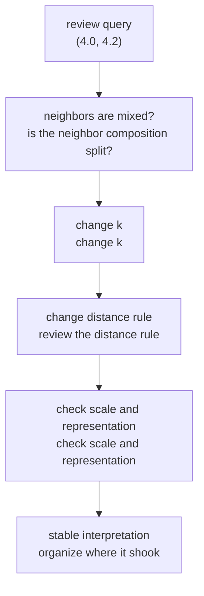

# P4-12.3 What Should You Check First When Using k-NN

> Section ID: `P4-12.3`
> Version: `v2026.07.10`

In P4-12.1, we looked at the intuition of k-NN, and in P4-12.2, we saw why distance and scale can change the result. The question that remains now is this.

When the judgment of k-NN becomes unstable, what should you look at again first?

The purpose of this section is not to re-explain the general theory of preprocessing, but to organize `where you should check first` when reading k-NN.

## Scope Of This Section

This section answers the following questions.

- In what kinds of problems can k-NN first be placed as a candidate?
- If what kinds of signals appear, should you first suspect a distance or scale problem?
- Among `distance rule`, `k`, and `data representation`, what should you review first?
- How should a query that needs review be read?

This section does not go deeply into the following content.

- The full system of preprocessing
- The full general theory of model selection
- Advanced optimization or approximate nearest-neighbor implementation

## Goals Of This Section

- You can explain problems for which k-NN is worth raising first as a candidate.
- You can explain the signals that should make you suspect a distance or scale problem.
- When results are unstable, you can set an order for what to review first.

## Main Learning Content

### When Is It Good To Raise k-NN First As A Candidate

k-NN is not the basic answer to every classification problem. But in problems where `explaining by using nearby cases as evidence` feels natural, it becomes a good first comparison candidate.

| Current Problem State | Why Recall k-NN First |
| --- | --- |
| Similar cases tend to produce similar results | It is easy to explain prediction using surrounding neighbors as evidence. |
| Local patterns look more important than a global rule | It is good for directly comparing cases around the query. |
| You want to show example-based judgment before showing a model formula | The fact of which neighbors were looked at becomes explanation evidence itself. |
| The data size is not extremely large and comparison cost is manageable | Comparison work at prediction time is realistically possible. |

The key point is not `we use k-NN because we cannot build a formula`. It is that `in problems where looking at local similarity first is natural, k-NN can be a good starting point`.

### If What Kinds Of Signals Appear, Should You First Suspect A Distance Or Scale Problem

In distance-based models, when performance looks strange, there are many cases where before the model structure, you should first suspect `which axis is almost deciding the distance by itself`.

| Visible Signal | What To Suspect First | Reason |
| --- | --- | --- |
| Only one column has a very large numeric range | Scale dominance | Because the large axis can monopolize distance. |
| Neighbors change greatly before and after scale adjustment | Representation dependence | It means the definition of nearness is sensitive to representation change. |
| A small-range column is important, but is not well reflected in prediction | Concealment by a large axis | Important information can get buried in distance calculation. |
| The same kind of queries repeatedly gather near the boundary | Distance rule or `k` setting | It may be a signal that neighbor order is easily shaking. |

The purpose of this table is not to set scale adjustment up as a universal solution. It is to make you first check whether `the definition of nearness is already unstable`.

### What Should You Review First

When results are unstable, it is usually good to check in the following order.

1. Is this really a problem that should be read through `comparison with nearby cases`?
2. Does the distance rule match the current problem?
3. Is `k` too small or too large?
4. Is scale or data representation pushing one particular axis too strongly?
5. Can you actually afford the comparison cost at prediction time?

This order matters because each question points to a different kind of problem.

- Number 1 is a `model family` problem.
- Numbers 2 and 3 are `judgment rule` problems.
- Number 4 is a `representation` problem.
- Number 5 is an `operational cost` problem.

In other words, even within the single sentence `the result looks strange`, causes from different layers can be mixed together.

Especially in number 4, if you actually begin to suspect a scale or representation problem, then rather than re-explaining the whole general theory of preprocessing in this section, it is better to return to `P4-7.2 Preprocessing` and check the standard again.

### If You Re-Read The Same Query From P4-12.1

If you bring back the query `(4.0, 4.2)` from the previous section, the inspection order becomes more concrete.

| Question To Revisit | What You Actually Look At In `(4.0, 4.2)` | Judgment To Make Now |
| --- | --- | --- |
| Is `k` too sensitive? | It is class 1 at `k=1`, but changes to class 0 at `k=3` | Since it can shake on one-point exceptions, review `k` again |
| Is the neighbor composition mixed? | Nearby neighbor labels are mixed like `1, 0, 0, 1, 0` | It is likely a query near the boundary |
| Would it change if the distance rule changed? | Even with the same coordinates, neighbor order can change depending on the distance rule | Continue into the distance-rule comparison in `P4-12.2` |
| Is it a situation where even scale problems should be suspected? | In the current example, the axes are the same coordinate axes, so the scale problem is weak | In real data with different numeric ranges, revisit `P4-7.2` and `P4-12.2` |

The purpose of this table is not to make you memorize a checklist, but to show in order `where to start doubting again` while holding onto one query.

### A Small Flow For Checking One Query All The Way Through

If you compress the previous table back into an actual judgment order, then the phrase `the result is ambiguous` changes from just a feeling into a task of finding again `at which step it was shaking`.

1. First, check whether the neighbor composition leans clearly to one side.
2. If it splits by only one or two points, check whether the interpretation is maintained when you change `k`.
3. If it keeps shaking even when you change `k` a little, check whether the distance rule itself matches the current problem.
4. If there are features with very different numeric ranges, finally review scale and data representation again.

In other words, a review query should be read not as `one wrong prediction`, but as `an observation point that shows which layer of the judgment rule is shaking`.

### How Should A Query That Needs Review Be Read

A query that needs review is usually one where `neighbor composition does not clearly lean to one side`.

For example:

| query | nearest labels | Current Reading |
| --- | --- | --- |
| `(4.0, 4.2)` | `[1, 0, 1]` | It leans toward class 1, but may be near the boundary |
| `(4.0, 4.2)` with `k=5` | `[1, 0, 1, 0, 0]` | Need to check again whether interpretation changes when `k` widens |

At this point, what matters is that the fact `the neighbors split` is not itself the end of the cause explanation. It is closer to a signal that first tells you `what you should review again`.

In other words, a review query is usually read in the following order.

1. How much is the neighbor composition split?
2. If `k` changes, is the interpretation maintained?
3. If the distance rule changes, do the neighbors change?
4. Before and after scale adjustment, which neighbors enter and leave?

These four questions matter because each one aims at a different cause.

- Number 1 looks at `is this query near the boundary now`.
- Number 2 looks at `is it overly sensitive to one or two exceptional neighbors`.
- Number 3 looks at `does the definition of nearness match the current problem`.
- Number 4 looks at `is the representation method distorting the judgment`.

## Cases And Examples

### Case 1. When Prediction Works But The Explanation Keeps Shaking

A subscription service team is looking at churn possibility with k-NN. The score itself comes out to some degree, but it repeatedly happens that two customers who look similar receive different predictions.

At that point, instead of immediately jumping to `should we switch to another model`, they first look again at the following.

- whether this problem is being read through local similarity
- whether the distance rule fits the current features
- whether a too-sensitive setting such as `k=1` is being used
- whether a large axis such as payment amount is overwhelming other features

If you go through this order, you can separate `failure of the model itself` and `instability of the judgment standard` a little more clearly.

In other words, the goal of this section is not the vague conclusion `k-NN should be used carefully`. More precisely, it is to make the reader able to say for themselves `where to look again first even when predictions shake`.

## Perspectives To Remember In This Section

- k-NN can be a good first comparison candidate in problems where local similarity is important.
- When results are unstable, it is better to review `distance rule`, `k`, and `data representation` before the model name.
- A review query is not evidence that fixes the cause of an error, but a signal telling you `what should be reviewed again`.

## Short Check

- Can you distinguish problems where k-NN is worth recalling first from those where it is not?
- When results are unstable, can you explain in what order to look at `distance rule`, `k`, and `scale`?
- Are you reading a review query not as `cause fixed`, but as `a reinspection signal`?

## Sources And References

- scikit-learn, *Nearest Neighbors*, scikit-learn User Guide, checked on 2026-06-27. <https://scikit-learn.org/stable/modules/neighbors.html>{: target="_blank" rel="noopener noreferrer" }
- scikit-learn, *Importance of Feature Scaling*, scikit-learn Examples, checked on 2026-06-27. <https://scikit-learn.org/stable/auto_examples/preprocessing/plot_scaling_importance.html>{: target="_blank" rel="noopener noreferrer" }
