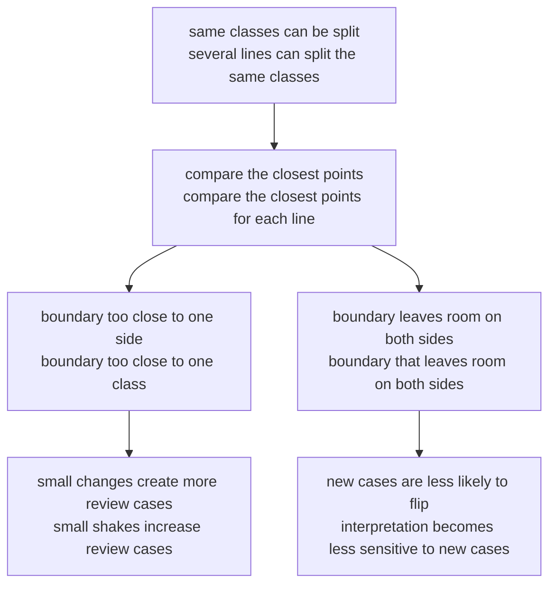
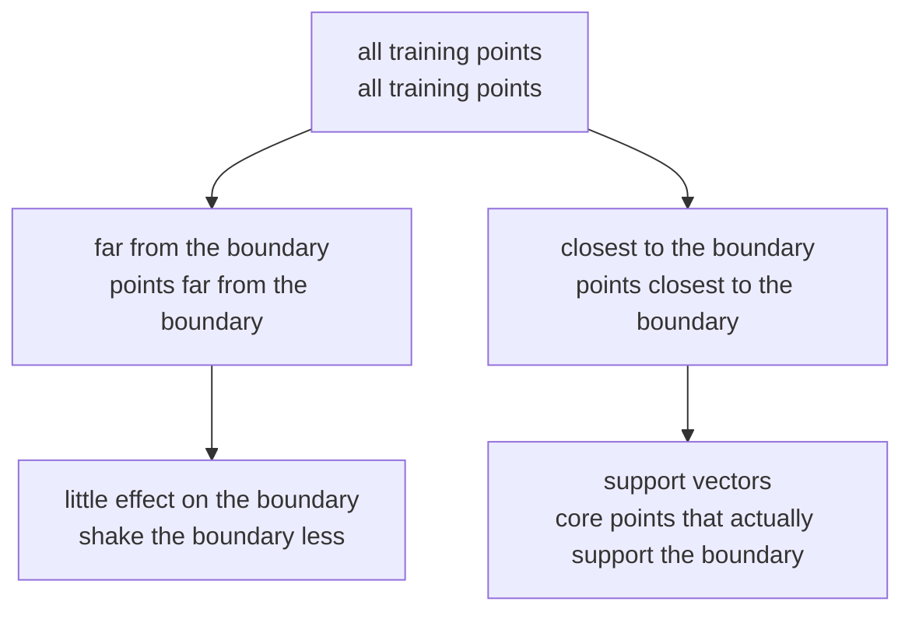
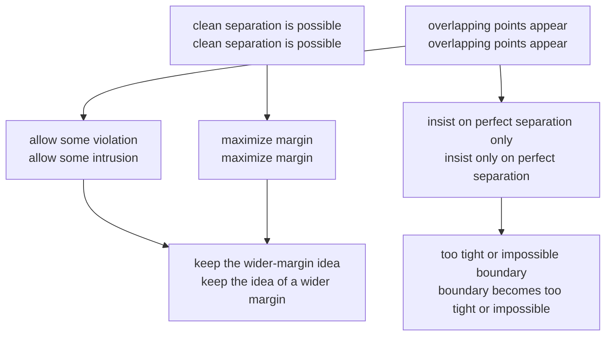
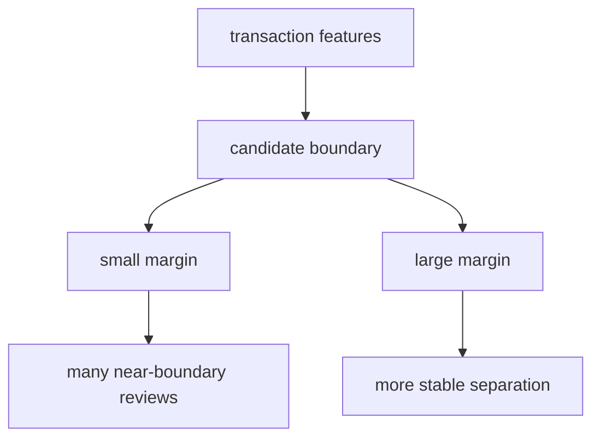
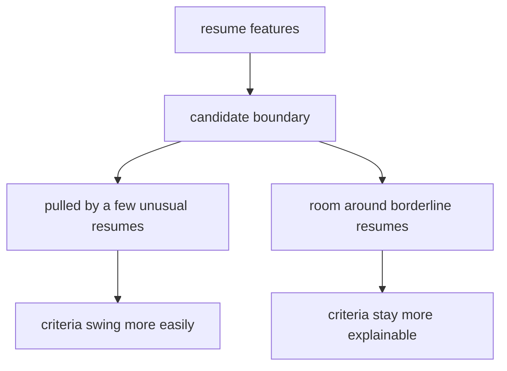
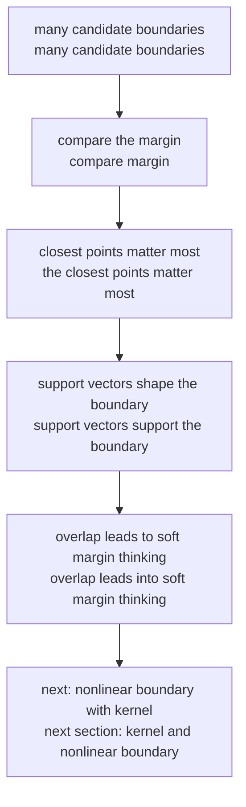

# P4-13.1 The Intuition Of SVM

> Section ID: `P4-13.1`
> Version: `v2026.07.10`

In P4-11.2, we viewed classification as `drawing a boundary and dividing space`. In P4-12, we also looked at `a way of making judgments by looking at nearby neighbors`. Now we read the same classification problem again with a different question.

If you can draw a boundary, then among them, which boundary is the better boundary?

This question is the starting point of SVM (support vector machine).

SVM is a model that finds a line separating classes, but tries to make that line stay as far away as possible from the data on both sides.

SVM does not stop at just finding `one classification line`. It is an attempt to find `the separation line that looks most stable`.

This section explains the basic meaning of `SVM (support vector machine)`, `margin`, and `support vector`. In the following sections, we continue the current context of judgment using these handles, and the basic sense for reading the stability of boundaries is connected again through this section and the [concept glossary](../../../reference/concept-glossary.md).

## Scope Of This Section

This section is the place where you first grasp the question `what is a good boundary?` through the handles of SVM. Here, centered on the intuitions of margin, support vector, and soft margin, we first read not `separable or not`, but `the criterion for separating more stably`.

This section answers the following questions.

- Why does SVM consider `margin` more important than a simple boundary line?
- What is margin, and why is it connected to classification stability?
- What is a support vector, and why is it central enough to be in the name?
- When data cannot be perfectly separated, what additional idea appears?
- In what way is SVM different from the earlier logistic regression and k-NN?

This section does not go at length into the strict derivation of the optimization objective function, Lagrange multipliers and the dual problem, detailed computation of the kernel trick, or detailed tuning of hyperparameters such as `C` and `gamma`. The kernel idea and the big picture of nonlinear boundaries continue directly in P4-13.2, and the standards for reading hyperparameters such as `C` and `gamma` and the cost of verification connect again in P4-9.1 and P4-9.2. The strict development of the optimization objective function, Lagrange multipliers, and the dual problem remains outside the scope of the current main text of this book.

## Goals Of This Section

- You can explain SVM through the intuition that it is `a classifier that maximizes the margin`.
- You can explain why among several boundaries that divide the same data, some boundaries can be said to be better.
- You can explain that support vectors are `the core points closest to the boundary`.
- You can understand at an introductory level that when perfect separation is difficult, margin and tolerance for error appear together.
- You can explain why the decision boundary of Chapter 11 and the distance and scale discussion of Chapter 12 lead into SVM.

## Learning Background

The logistic regression in P4-11 showed `a boundary that divides input space`. But that section alone leaves the following questions.

- Is it enough just to divide?
- Is it okay even if the boundary is pressed too tightly against the classes?
- What happens if predictions change easily even with a small shake near the boundary?

SVM is the first representative example that answers these questions.

This section is closer to learning `the standard of a good classification line` than the `classification line` itself.

## Main Learning Content

### Why Must We Look At Margin Separately

There may not be only one straight line that can separate two classes. Even with the same data, several different lines can be drawn.

The problem is that these lines do not all look equally good.

- Some lines are pressed too closely against points on one side.
- Some lines stay a little farther away from points on both sides.
- Some lines look as if a tiny amount of noise would flip the class.

SVM captures exactly this difference with the word `margin`.

`Margin is the width of room between the boundary line and the closest data points.`

If this room is wide, then the boundary can be read as being placed more stably between the data.

In other words, SVM goes beyond `can a line be drawn` and asks `which boundary is more stable among several boundary candidates`. The key is not simply whether separation is possible, but that it chooses a boundary with more room based on the minimum gap to the closest points.

If you compress the same idea again into a judgment order, it becomes as follows.



The core of this diagram is that `looking at margin separately` is not an extra decoration. Only after first placing several boundaries that can divide the same data as candidates, and then comparing the closest points for each boundary, can you distinguish a boundary vulnerable to small shakes from a boundary that leaves room. If a boundary is too close to one class, then even a slight movement of a new case rapidly increases near-boundary review cases, while a boundary that leaves room on both sides is relatively less likely to flip immediately under the same change.

### Why Is A Large Margin Good

You cannot say that a large margin is always the absolute correct answer. But educationally, it becomes a very important standard for the following reasons.

1. The boundary does not cling too tightly to either class.
2. It looks less sensitive to small shakes near the boundary.
3. It gives the intuition that somewhat more stable generalization can be expected even on unseen data.

Because of this third reason, SVM is often mentioned together with statistical learning theory. As we saw in earlier sections of this book, generalization is closer to `maintaining a valid judgment on new data` than to `memorizing the training data well`. SVM lets you read that generalization problem in the geometric language of `margin`.

`SVM re-reads the problem of getting the boundary right as the problem of finding a boundary with room.`

If you shorten it in project-note style, you can write it like this.

| Record Item | Example |
| --- | --- |
| current boundary candidate | `linear SVM` |
| cases near the margin | `transaction A`, `transaction B` |
| whether review is needed | `too close to the boundary, so review` |
| next question | `if softened with soft margin, do the same cases remain` |

With this table, the SVM introduction is first read not through formulas, but through the structure `comparison candidate -> review cases -> next question`. Even if the same accuracy or similar average scores appear, you still have to separately check which candidate leaves more room and which candidate leaves more near-boundary cases.

### What Is A Support Vector

The name SVM contains `support vector`. This matters because not all points determine the boundary to the same degree.

In the intuition of SVM, the most important points are usually `the points closest to the boundary`. These points can be read as effectively supporting the position of the boundary. That is why the name support vector is used.

- Points far away have less sensitivity in determining the boundary.
- The points pressed most tightly against the boundary influence its position much more strongly.
- So among all the data, SVM pays special attention to `the tightest points`.

If drawn simply, it looks like this.



This diagram shows why support vectors are special. It means that not all training points determine the boundary with the same weight; the points far from the boundary shake it less, while the few closest points more strongly support the position of the separation line in practice.

Operationally, support vectors can also be read like this.

- Not all customer records have the same importance.
- Not all test papers shake the boundary criterion to the same degree.
- In practice, it is `the ambiguous cases near the boundary` that change the model criterion more.

This sense is also important later in model interpretation and error analysis. Once you develop the habit of checking `ambiguous cases near the boundary` in any model, you can read more than just the simple accuracy number.

### Looking At `Which Boundary Has A Larger Margin` With A Python Example

This example does not directly implement an SVM learner. Instead, it places several `vertical boundary candidates` that divide the same two classes, and directly calculates which boundary has the larger margin.

- Problem situation: two classes are divided on the left and right of the x-axis
- Input: two-dimensional points
- Correct answer (label): negative / positive
- Concepts to confirm:
  - There can be several candidates that create a boundary.
  - The interest of SVM lies in finding the boundary whose `minimum gap` is largest.
  - The closest points to the boundary are read like support vectors.

```python
negative = [(1.0, 2.0), (2.0, 3.0), (3.0, 2.5)]
positive = [(5.0, 2.2), (6.0, 3.2), (7.0, 2.8)]

candidates = [3.4, 4.0, 4.6]

for boundary_x in candidates:
    neg_min = min(boundary_x - x for x, _ in negative)
    pos_min = min(x - boundary_x for x, _ in positive)
    margin = min(neg_min, pos_min)

    support_neg = [p for p in negative if abs((boundary_x - p[0]) - neg_min) < 1e-9]
    support_pos = [p for p in positive if abs((p[0] - boundary_x) - pos_min) < 1e-9]

    print("boundary x =", boundary_x)
    print("  negative-side nearest distance =", round(neg_min, 3))
    print("  positive-side nearest distance =", round(pos_min, 3))
    print("  margin =", round(margin, 3))
    print("  support-like points =", support_neg + support_pos)
    print()
```

An example output is as follows.

```text
boundary x = 3.4
  negative-side nearest distance = 0.4
  positive-side nearest distance = 1.6
  margin = 0.4
  support-like points = [(3.0, 2.5), (5.0, 2.2)]

boundary x = 4.0
  negative-side nearest distance = 1.0
  positive-side nearest distance = 1.0
  margin = 1.0
  support-like points = [(3.0, 2.5), (5.0, 2.2)]

boundary x = 4.6
  negative-side nearest distance = 1.6
  positive-side nearest distance = 0.4
  margin = 0.4
  support-like points = [(3.0, 2.5), (5.0, 2.2)]
```

The key points to read from this output are the following.

- All three boundaries do divide the two classes.
- But when `x = 4.0`, the smallest width of room is the largest.
- The closest points, `(3.0, 2.5)` and `(5.0, 2.2)`, act like support vectors.

SVM does not stop at `can it divide`. It additionally asks `how much room does it leave while dividing`.

## Detailed Learning Content

### What Happens If The Data Is Not Perfectly Separable

Real-world data is not always this clean. Some points can be mixed in near the opposite class. Then it becomes difficult to make a perfect separating line.

At this point, the intuition of SVM changes like this.

- It does not insist only on perfectly separating every point.
- Even while allowing some errors or intrusions,
- it tries to find a margin that is more reasonable overall.

This idea later leads into `soft margin` and the hyperparameter `C`. In this section, it is enough to hold onto the following sentence.

`Real-world SVM deals not only with perfect separation, but also with the balance between room and tolerance for error.`

If drawn conceptually, it becomes as follows.



### What Kinds Of Problems Does SVM Handle

In the official scikit-learn documentation as well, SVM is introduced as a family of supervised learning methods used for classification, regression, and outlier detection. But in this section, we first deal only with binary classification.

For example:

| Work Situation | Value To Predict |
| --- | --- |
| normal transaction / fraud transaction | 0 / 1 |
| fail / pass | 0 / 1 |
| non-churn / churn | 0 / 1 |

Here, the interest of SVM is not only in `getting the prediction right`. It also looks at `how much room the correct line leaves`.

If you re-read it in an operational sense, it becomes as follows.

| Scene | Question SVM Particularly Cares About |
| --- | --- |
| fraud transaction detection | Is the boundary between normal and fraud too dense, so that even a small shake flips it? |
| resume classification | Is the pass / hold boundary being pulled too strongly by specific cases? |
| equipment anomaly detection | Even if normal and anomalous states are separated, is the boundary so tight that alerts become unstable? |

SVM is a model that makes you stay aware not only of `who belongs to which class`, but also of `how unstable that criterion is`.

### In What Way Is It Different From Logistic Regression And k-NN

If you place SVM alongside the earlier models, the difference becomes clearer.

| Model | Central Question |
| --- | --- |
| logistic regression | With what linear score and threshold should classes be divided? |
| k-NN | What class do the nearby cases around this point belong to? |
| SVM | While dividing two classes, what is the boundary with the most room? |

This comparison is very important. All three models do classification, but `what they regard as a good judgment criterion` is different.

- Logistic regression shows outputs that can be read like scores and probabilities.
- k-NN shows judgments that take surrounding cases as evidence.
- SVM shows judgments centered on boundary and margin.

Therefore, when reading SVM, you should not look only at the `predicted value`, but also at `how tight the boundary is` and `which points are supporting the boundary`.

### When Is It Good To Raise SVM First As A Candidate

SVM is not the basic answer to every classification problem, but in problems where `the stability of the boundary` itself matters, it becomes a good candidate.

| Current Problem State | Why Raise SVM First | What To Confirm First |
| --- | --- | --- |
| The classification boundary looks too tight | Because it tries to find a boundary with a large margin first | Whether there are many cases near the boundary |
| The class changes often even with small shakes | Because the idea of finding a stable separation line is needed | Where the points that look like support vectors are |
| There is a linear boundary candidate, but the width of room is doubtful | Because even with the same separation, a better boundary can be compared | What is different from a baseline or logistic regression |
| You want to manage near-boundary cases as review targets | Because it is good for separately recording cases near the margin | Which cases should remain as review targets |
| There is a possibility of later extending to nonlinear boundary candidates | Because it naturally continues from linear SVM to kernel SVM | Whether a linear form is enough for now |

The core of this table is to position SVM not as `another classifier`, but as `a candidate that more strongly asks for the criterion of a good boundary`.

This section captures what becomes differently important from the earlier models as follows.

| Model | Question To Hold First | Criterion Looked At More Strongly In This Section |
| --- | --- | --- |
| logistic regression | With what score and threshold should the class be divided? | Output readable like probability and a linear boundary |
| k-NN | Which surrounding cases should be referenced? | Local neighbors and the distance criterion |
| SVM | Among several boundaries, which one is more stable? | Margin and support vector |

SVM changes the central question from `can a boundary be drawn` to `how much room and stability does that boundary have`. Only when this criterion is set can later explanations of soft margin, kernel, and `C` be read not as a list of new options, but as `devices for adjusting the criterion of a good boundary`.

If you add one more thing here, the SVM section directly connects to the comparison-record structure organized up to now. When you raise SVM as a candidate, you should not leave only the statement `the margin is large`, but also write down together `which cases remain near the margin`, `what looks more stable than the baseline or another candidate`, and `what will be adjusted next`. At this point, cases near the margin should be read first as signals that raise review priority, and not as if the explanation of why those cases remain there has automatically been completed.

| Record To Leave Together | Why It Is Needed |
| --- | --- |
| baseline and SVM comparison | To see what the margin perspective actually changes compared with a simple criterion |
| cases near the margin | To find ambiguous cases that should remain as review targets |
| points read like support vectors | To see again which points shake the boundary the most |
| next experiment question | To decide whether to look at `C`, raise a kernel candidate, or look at more features |

## Practice And Example

### Looking At What Changes When `Perfect Separation` Breaks In A Python Example

This time, the example adds one `ambiguous negative point` near the boundary to the previous example.

Problem situation:

- Originally, between two well-separated classes, one exceptional case near the boundary enters

Input:

- list of negative points
- list of positive points
- several candidate boundaries `boundary_x`

Expected output:

- nearest distance on the negative side for each boundary
- nearest distance on the positive side
- margin value

Concepts to confirm:

- Some boundaries can no longer create perfect separation
- When perfect separation becomes difficult, you must think not only `is the margin large`, but also `how much intrusion should be allowed`

```python
negative = [(1.0, 2.0), (2.0, 3.0), (3.0, 2.5), (4.7, 2.4)]
positive = [(5.0, 2.2), (6.0, 3.2), (7.0, 2.8)]

for boundary_x in [4.0, 4.8, 5.2]:
    neg_min = min(boundary_x - x for x, _ in negative)
    pos_min = min(x - boundary_x for x, _ in positive)
    margin = min(neg_min, pos_min)

    print("boundary x =", boundary_x)
    print("  negative-side nearest distance =", round(neg_min, 3))
    print("  positive-side nearest distance =", round(pos_min, 3))
    print("  margin =", round(margin, 3))
    print("  perfectly separates? =", neg_min > 0 and pos_min > 0)
    print()
```

An example output is as follows.

```text
boundary x = 4.0
  negative-side nearest distance = -0.7
  positive-side nearest distance = 1.0
  margin = -0.7
  perfectly separates? = False

boundary x = 4.8
  negative-side nearest distance = 0.1
  positive-side nearest distance = 0.2
  margin = 0.1
  perfectly separates? = True

boundary x = 5.2
  negative-side nearest distance = 0.5
  positive-side nearest distance = -0.2
  margin = -0.2
  perfectly separates? = False
```

The points to read from this output are clear.

- Even if just one exceptional point near the boundary enters, some boundaries are no longer perfectly separating.
- Even if separation barely remains possible, the margin can become very small.
- So real-world SVM moves in the direction of `not insisting only on perfect separation`, but `adjusting margin and tolerance for error together`.

### Changing One More Value: If The Exceptional Point Moves Closer To The Boundary, What Stays The Same And What Changes

This time, move the ambiguous negative point from `(4.7, 2.4)` further right to `(4.9, 2.4)`.

```python
negative = [(1.0, 2.0), (2.0, 3.0), (3.0, 2.5), (4.9, 2.4)]
positive = [(5.0, 2.2), (6.0, 3.2), (7.0, 2.8)]

for boundary_x in [4.8, 4.95]:
    neg_min = min(boundary_x - x for x, _ in negative)
    pos_min = min(x - boundary_x for x, _ in positive)
    margin = min(neg_min, pos_min)

    print("boundary x =", boundary_x)
    print("  negative-side nearest distance =", round(neg_min, 3))
    print("  positive-side nearest distance =", round(pos_min, 3))
    print("  margin =", round(margin, 3))
    print("  perfectly separates? =", neg_min > 0 and pos_min > 0)
    print()
```

An example output is as follows.

```text
boundary x = 4.8
  negative-side nearest distance = -0.1
  positive-side nearest distance = 0.2
  margin = -0.1
  perfectly separates? = False

boundary x = 4.95
  negative-side nearest distance = 0.05
  positive-side nearest distance = 0.05
  margin = 0.05
  perfectly separates? = True
```

### What Stays The Same And What Changes

- What stayed the same: the question is still not only `can the classes be divided`, but `how much room can they be divided with`.
- What changed: as the exceptional point moved closer to the boundary, even a boundary that originally looked possible to use changed more easily into a failed separation, or left only a very small margin.
- The first judgment to leave: even with the same success or failure of separation, the stability at margin `0.2` and margin `0.05` is completely different.

### How This Exercise Recovers The Goal Of Part 4

This exercise recovers SVM from `a classifier that gets the answer right` into `a model that compares boundary quality`. The goal of Part 4 is not to look at one classification result, but to read which cases make the boundary tight and increase generalization risk. There needs to be repeated practice of moving the exceptional point little by little for margin to connect beyond a numeric definition into `a sense of instability`.

| Common Recording Language | What Should Be Left Immediately In This Exercise |
| --- | --- |
| Structure shown | Even moving the exceptional point near the boundary only a little shook both separability and margin size strongly |
| Interpretation boundary | From one toy example where the margin got smaller, you cannot conclude that the same boundary is always bad in all real data |
| Next question | If soft margin and `C` are used, up to where should this intrusion be allowed, and what becomes visible first when compared with other classifiers? |

## Cases And Examples

The intuition of this section becomes blurry if it remains only abstract. So it needs to be re-read through work scenes.

### Case 1. Fraud Transaction Detection

- Margin that is too small:
  - The boundary between normal transactions and fraudulent transactions is too dense.
  - If features such as small payments, overseas access, or time of day shake only a little, the class can change.
- Larger margin:
  - The boundary stays a bit farther away from both classes.
  - Ambiguous transactions remain, but the criterion line itself shakes less sensitively.



### Case 2. Resume Classification

- Margin that is too small:
  - A few unusual resumes pull the boundary too strongly.
  - If the scoring system changes or applicants with new backgrounds enter, the result can shake easily.
- Larger margin:
  - The boundary is pulled less by one or two cases.
  - The criterion is more likely to stay in a more general and explainable direction.



`The margin intuition of SVM is connected to the question of how sensitively the boundary made by the model will shake in the field.`

### Academic Background And History

SVM is a method that occupies a very important place in statistical learning theory and the discussion of generalization. As seen earlier in P4-5.2, generalization is connected to the question `does it maintain a valid judgment even on new data`, beyond just fitting the training data well.

In this section, academic background and history are used only as a supporting context that briefly holds onto why `a good boundary is separately asked about through margin` rather than as an explanation that replaces the main discussion.

Historically, the 1990s paper *Support-Vector Networks* by Cortes and Vapnik represents this line of development. What matters in this section is the following change rather than the detailed proof.

1. Classification can be read as the problem of finding a boundary.
2. There can be several boundaries, not just one.
3. Therefore, a criterion for `which boundary is better` is needed.
4. SVM presented that criterion in the language of margin maximization.

For this reason, SVM is often introduced not just as the name of an algorithm, but also as `a representative example trying to explain generalization geometrically`.

## Perspectives To Remember In This Section

- SVM is a model that tries to find, among boundaries dividing classes, the one with `the larger margin`.
- Margin can be read as the width of room between the boundary and the closest data points.
- Support vectors are the core points closest to the boundary.
- In real data, the balance between `room` and `tolerance for error` becomes more important than perfect separation.
- So SVM makes you look again at classification problems as `a problem of boundary quality`.

The core of this section is not memorizing the name SVM, but fixing the criterion for how to read a good boundary.

If you tie the same flow together once more at once, it becomes as follows.



| What Should Be Seen Together | Question First Read In This Section | Where It Continues Next |
| --- | --- | --- |
| margin and support vector | Among several boundaries, which one has more room and is more stable? | P4-13.2 kernel and nonlinear boundary |
| soft margin and tolerance for error | What balance should be chosen rather than perfect separation? | P4-9 hyperparameters and reading `C` |
| comparison with earlier models | What criterion is added that logistic regression and k-NN could not show? | Later comparison of classifiers and generalization interpretation |

## Short Check

- In the current problem, is room and stability of the boundary more important than simply dividing?
- Can you look again at what cases are actually supporting the boundary like support vectors?
- Are you checking together the character of the cases near the margin rather than only a small score difference?

## When Should You Recall This Perspective First

- When room and stability of the boundary look more important than merely dividing classes, bring out the margin perspective first.
- When you see scenes where a few cases near the boundary decide the whole judgment, recall again why support vectors are central.
- When you need to organize what question SVM asks compared with logistic regression or k-NN, re-read it through the criterion `what is a better boundary`.

## Sources And References

- scikit-learn, *Support Vector Machines*, scikit-learn User Guide, checked on 2026-06-27. <https://scikit-learn.org/stable/modules/svm.html>{: target="_blank" rel="noopener noreferrer" }
- C. Cortes and V. Vapnik, *Support-Vector Networks*, Machine Learning, 1995, DOI: 10.1007/BF00994018, checked on 2026-06-27.
