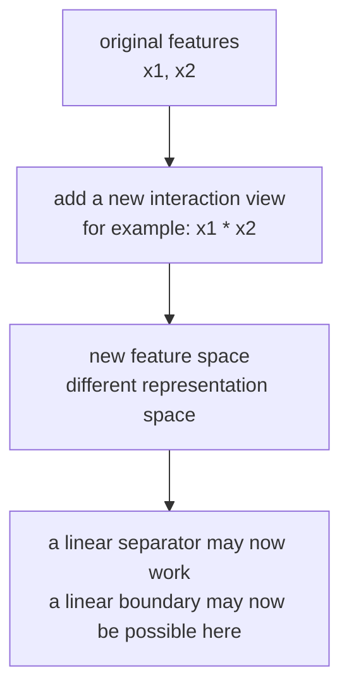
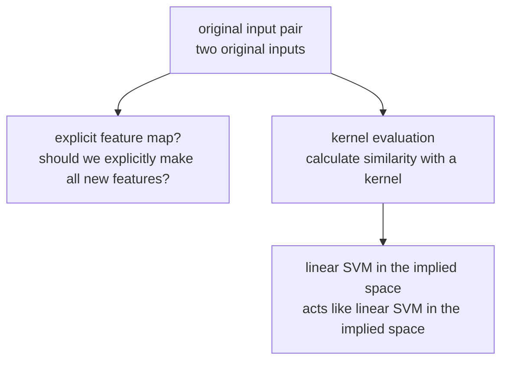
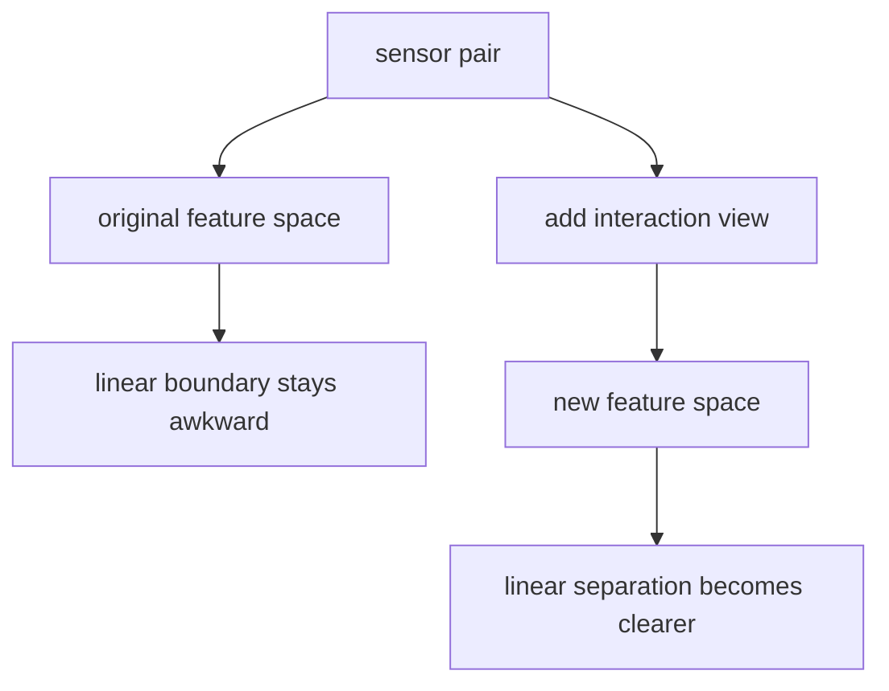

# P4-13.2 The Introductory Meaning Of Kernel

> Section ID: `P4-13.2`
> Version: `v2026.07.10`

In P4-13.1, we viewed SVM (support vector machine) as `a classifier that finds a boundary with a large margin`. But that naturally leads to the following question.

If that boundary must be a straight line, then what should we do with data that cannot be separated well by a straight line?

This question is exactly why the kernel needs to be introduced.

Kernel is the idea that lets data be compared in another representation space, so that problems that were originally hard to divide linearly can be handled more effectively.

In other words, the core of 13.2 is not `a new magic function`, but the perspective that `if you change the representation, even a linear boundary can take on a different meaning`.

This section does not repeat the basic definition of SVM at length. The core intuition that it `finds a boundary with a large margin` is reconnected through P4-13.1 and the [concept glossary](../../../reference/concept-glossary.md), and here we focus only on why the idea of changing the representation space is needed.

## Scope Of This Section

This section answers the following questions.

- Why can some data not be separated well by only a linear boundary?
- What does it mean to change the representation (feature space)?
- Why is kernel said to help `even without directly creating new features`?
- What do kernel names such as polynomial and RBF suggest?
- When can kernel-based SVM be raised as a candidate?

This section does not go deeply into the following content.

- The strict positive semidefinite condition of kernel functions
- The mathematics of RKHS (reproducing kernel Hilbert space)
- The derivation of formulas where the kernel enters dual optimization
- Detailed tuning strategies for `gamma`, `degree`, and `coef0`

The standards for reading settings such as `gamma`, `degree`, and `coef0`, and their verification cost, reconnect in P4-9.1 and P4-9.2. The positive semidefinite condition, RKHS, and the mathematical development of dual optimization remain outside the current scope of this book, and if needed, it is better to see them separately in more advanced mathematical documents.

## Goals Of This Section

- You can explain by example problems where a linear boundary does not work well.
- You can explain that if the feature space changes, the same data can be read differently.
- You can explain kernel at an introductory level as `a way of calculating similarity, and an idea for using a new representation space indirectly`.
- You can speak intuitively about what kind of nonlinearity polynomial kernels and RBF kernels each have in mind.
- You can position kernel-based methods not as `the default used all the time`, but as `a candidate to recall when a linear boundary seems insufficient`.

## Learning Background

In 13.1, SVM was read as a model that finds `a good linear boundary`. But real data often looks like this.

- classes are intertwined like curves
- it has a circular structure, like center and outside
- the product or interaction of two features looks important

At this point, the question does not stop at `is there a better straight line?` Rather, it moves to `is the way of reading with a straight line itself insufficient?`

| Previous Section | The Question That Changes In This Section |
| --- | --- |
| P4-13.1 The intuition of SVM | What is a good straight-line boundary? |
| P4-13.2 The introductory meaning of kernel | Must the very space that reads with straight lines be changed? |

In other words, 13.2 is not a section that overturns 13.1. It is a section that acknowledges `the power of a linear boundary`, but reinforces the point that `if the representation changes, the meaning of linearity can also change`.

## Main Learning Content

### What Have We Already Seen In The Previous Section, And What Newly Changes In This Section

If this section looks as if it is suddenly bringing up a completely new story, it is better first to hold onto the following three things that were already seen before.

- In P4-11.2, we saw `linear scores and decision boundaries`.
- In P4-12.2, we saw that `if the representation and the calculation standard change, the same data can be read differently`.
- In P4-13.1, we saw the criterion for finding a better linear boundary `within the same coordinate space`.

P4-13.2 is not a section that abandons these three. Rather, it is a section that deals with what else must be asked when those three are not enough to work.

`If 13.1 was a section about finding a better boundary within the same space, 13.2 is a section that asks again whether that space itself reveals the problem simply.`

### Why Can Some Data Not Be Separated Well By A Straight Line

The most famous example is an XOR-like classification problem. Suppose there are four points on a two-dimensional plane.

- bottom-left and top-right are class 0
- top-left and bottom-right are class 1

In this case, it is difficult to cleanly separate the two classes with one straight line. No matter what line is drawn, the two points along the diagonal direction tend to remain on the same side.

`The problem may not be hard. Rather, the current coordinates and feature representation may simply be unfavorable to linear separation.`

The key point is that the data is not `hard` in itself, but that the current representation may be unfavorable for linear separation. In other words, if a straight-line boundary looks frustrating in the original coordinate space, then a reason arises to try changing the representation before changing the boundary.

What matters here is distinguishing between `should we keep looking for a better straight line?` and `should we change the very space in which straight lines are read?`

- The question of P4-13.1: can a better boundary be found within the same coordinate space?
- The question of P4-13.2: does that coordinate space itself reveal the problem simply?

In other words, revisiting soft margin or `C` is closer to `choosing the boundary better within the same space`, while kernel is closer to `re-reading the space itself where the boundary is placed`.

### What Does It Mean To Change The Representation

Changing the representation does not mean `throwing away the original features`. It is usually closer to the following.

- combine the existing features
- make new interaction features
- see the same data again from a different point of view

For example, if there are two features, \(x_1\) and \(x_2\), then you can additionally make a new feature such as `x1 * x2`. Then a pattern that was hard to separate in the original two dimensions may look simpler in a space where the new feature has been added.

If you draw this flow simply, it looks like the following.



This diagram shows the starting point of the kernel idea. Rather than making the boundary complicated first, what matters is that if the feature representation changes, the same data can be read again with a simpler linear boundary.

The key sentence is the following.

`The starting point of kernel is to try changing the representation before changing the boundary.`

What the reader especially needs to hold onto here is the following.

- There is no need to conclude that the model is weak just because the classes look complex.
- Rather, you need to ask, `are the current coordinate axes and feature combinations failing to reveal the problem simply?`
- Kernel is one representative answer to this question.

In other words, kernel is closer not to a technique that makes the model complicated, but to `a technique for resetting the coordinate system in which the problem is read`.

### How Does Directly Adding Features Connect To Kernel

At this point, one more question must be raised.

- `Then is it enough to directly make new features?`
- `Why is the word kernel needed separately?`

At the introductory level, it is better first to hold onto it like this.

- direct feature addition: a person explicitly makes new features such as `x1 * x2` or `x1^2`
- kernel idea: the effect of comparison in a richer representation space is handled indirectly through calculations in the original space

In other words, kernel is not a completely different magic that competes with `direct feature addition`. It is more natural to read it as a more generalized computational direction of the same idea, `seeing the representation more richly`.

### Why Is The Name `Kernel`

The name `kernel` can sound abstract. In this section, more than mathematical strictness, we first pin down what this name points to in practice.

`Kernel is the central computation that takes two inputs and calculates how close or similar they should be read in a new representation space.`

In other words, the word kernel does not mean `all the new features themselves`. It is better read as the name of the core computational part that performs comparison in that space.

So the questions the reader actually needs to hold when understanding a kernel are the following.

- What kind of similarity between two samples does this kernel emphasize?
- Does it make interaction more visible?
- Does it make the local structure of nearby neighbors more sensitive?
- As a result, can the boundary become more flexibly curved?

If you hold onto these questions, you end up reading `what kind of comparison method the kernel is pushing`, rather than `memorizing kernel names`.

### Why Is It Said That Kernel Helps Even Without Making All New Features Directly

Once the feel of the name is in place, the next question follows.

- Then can we just directly make all the new features?
- Why is the word kernel needed at all?

`Kernel is the idea that lets the inner product or similarity in a new representation space be obtained instead through calculations only in the original space.`

In other words, without explicitly writing out all high-dimensional features, it gives a way to calculate `how similar they are in that space`.

It can be understood as `a calculation that imitates the effect of comparing in the whole high-dimensional space, without writing it all out`.

If you draw it as a flow, it becomes as follows.



This diagram shows why kernel is said to help `even without explicitly making all new features`. The key is the detour that directly calculates similarity from the original input pair, and thereby makes it act like linear SVM in the implied high-dimensional space.

## Detailed Learning Content

### What Do Polynomial And RBF Kernels Suggest

In 13.2, there is no need to memorize every kernel. Instead, it is enough to grasp what two representative names are trying to do.

#### Polynomial kernel

- It pays more attention to products, squares, and interactions among features.
- Instead of looking only at `x1` and `x2`, it is easy to recall when combinations such as `x1^2`, `x1*x2`, `x2^2` seem important.
- At an introductory level, it can be read as `an idea similar to greatly increasing explicit interaction features`.

#### RBF kernel (radial basis function kernel)

- It pays more attention to locality and distance-based similarity around points.
- It gives the sense that similarity decreases quickly when far away and reacts strongly when close.
- At an introductory level, it is often introduced as `a representative kernel that can make complex curved boundaries more flexible`.

If you compare these two very simply, it becomes as follows.

| Kernel | Reader-Level Intuition |
| --- | --- |
| polynomial | looks more at interaction features |
| RBF | looks more sensitively at nearby local structure |

If you unpack the same difference with a bit more practical feeling, it can be read like this.

| Kernel | Structure Suggested By The Data | Question For The Reader |
| --- | --- | --- |
| polynomial | products, squares, and combinations among features seem important | `Do combinations matter more than one value alone?` |
| RBF | nearby points gather locally, and the boundary is curved | `Does the shape of the nearby region divide the classes?` |

In other words, the kernel name is not just an option name. It suggests `through what lens we are trying to look at the data again`.

### How Should A Circular Structure Be Re-Read

XOR is the representative example that shows the sense of interaction features. By contrast, when recalling RBF, it is clearer to imagine a circular structure such as `center and outside`.

For example, you can imagine a situation like the following.

- points near the center are class 0
- as the radius increases, they become class 1

In this case, a straight-line boundary that looks only at `x1` or only at `x2` may feel frustrating. But if you use more strongly the distance sense of `how far is it from the origin`, the problem can be read more clearly.

At an introductory level, this can be organized as follows.

- the polynomial family connects well to the idea of looking more at `feature combinations`
- the RBF family connects well to the idea of looking more at `distance-based local structure`

In other words, both kernels deal with nonlinear problems, but they do not read nonlinearity in the same way.

If you move this difference into project-note style, it can be written like this.

| Comparison Item | Original Space | New Representation Or Kernel View | Reading |
| --- | --- | --- | --- |
| ambiguous case | classes look mixed | they may separate more clearly | if the representation changes, the same case can be read differently |
| whether review is needed | high | can decrease or its character can change | review questions also change together |
| next question | is the linear criterion insufficient | which kernel fits better | do not separate the representation question from the boundary question |

In other words, the kernel section is read not as `the formulas get more complicated`, but as `cases get rearranged in another space`. Even if the classification result looks similar, it must still be checked separately which cases continue to remain ambiguous and which cases separate more clearly.

### How Do Logistic Regression, Linear SVM, And Kernel SVM Continue Into One Another

The three methods are not completely different worlds. Rather, the level at which the boundary is read shifts little by little.

| Model | Core Idea |
| --- | --- |
| logistic regression | output readable like a linear score and probability |
| linear SVM | a linear boundary with a large margin |
| kernel SVM | changing the representation space so that even structures that look nonlinear can be read through the idea of linear SVM |

In other words, kernel SVM is more accurately understood not as `a way of abandoning linear SVM`, but as `a way of making richer the space in which linear SVM reads`.

If you compress the same flow further into curriculum language, it becomes as follows.

- logistic regression in P4-11: learn linear scores and decision boundaries
- SVM in P4-13.1: choose a more stable boundary among those linear boundaries
- kernel in P4-13.2: redesign the very space in which the linear boundary works

Once this organization is in place, even when more diverse models appear later, the reader can still reorganize them again through the questions `does this model change the boundary`, `change the comparison method`, or `change the representation`.

### What Is Boundary Adjustment And What Is Representation Change

What is especially easy to confuse in this section is reading `adjusting the boundary better` and `changing the representation space` as if they were the same thing.

| Question | Section It Is Closer To | Interpretation Read Here |
| --- | --- | --- |
| Can a boundary with more room be found within the same coordinate space? | P4-13.1 | question about margin, support vector, and soft margin |
| Does the current coordinate space itself reveal the class structure simply? | P4-13.2 | question about kernel, explicit feature addition, and representation space |

This distinction matters because when a straight-line boundary feels frustrating, what you must first separate is not immediately `find a more complex model`, but rather `what exactly is insufficient`.

- Is the boundary insufficient?
- Is the threshold insufficient?
- Is the distance rule insufficient?
- Is the representation space insufficient?

Kernel is closer to the last of these four questions.

## Cases And Examples

### Case 1. A Defect Pattern That Does Not Separate By A Straight Line, But Separates When Interaction Features Are Seen

A manufacturing team wants to classify defects using two sensors. What people first observed was not `only temperature is high` or `only pressure is high`, but rather that defects are frequent `when the two values appear together in a certain combination`.

They first try a linear model and a linear SVM, but the boundary keeps feeling awkward. If you look at only one axis, normal and defect cases are mixed, and one straight line has difficulty cleanly dividing a pattern where four regions cross diagonally. At this point, if you read the problem only as `is there a better straight line?`, it stays frustrating.



In this scene, the kernel idea is closer to `let us change the representation` than to `let us draw a more complicated boundary`. For example, if interaction features such as the product or squares of the two sensor values are brought into view, then a pattern that was entangled in the original space can look like a simpler linear boundary in the new representation space. In other words, the data did not change. The coordinate system used to read the data changed.

The checkable result appears when you compare the degree of separation between using only the original features and using a representation that brings interaction into view. If the straight boundary keeps looking ambiguous in the original space, but the classes split more clearly in the new representation, then you can explain that kernel is not `a magic function`, but `the idea of resetting the representation space`.

## Cases And Examples

### When In Practice Can Kernel-Based SVM Be Raised As A Candidate

Here as well, the record structure can be fixed together. The kernel section is not a section for simply learning `another function name`, but a section for recording `how the same cases are read again in another representation space`. Therefore, you should write down together which cases were ambiguous in the original space, how they were rearranged in the new representation, and whether review targets decreased or new ones appeared as a result. This change should first be read as a signal showing `which failure pattern is separated better even when the same score is given`, and not as if one representation alone has already completed the cause explanation.

| Record To Leave Together | Why It Is Needed |
| --- | --- |
| ambiguous cases in the original space | To look again at why linear separation felt frustrating |
| rearrangement in the new representation space | To check which cases became more clearly separated |
| change in review status | To see whether the representation change actually reduced review targets |
| next question | To decide whether to look next at polynomial, RBF, or explicit feature addition |

If the place of the kernel is brought back into a practical question, then kernel-based SVM is not the default option for every problem. But it can be recalled as a candidate in situations like the following.

| Scene | Why It Becomes A Candidate |
| --- | --- |
| linear model performance keeps staying ambiguous | a straight-line boundary alone may be insufficient for the pattern |
| feature interaction looks important | a polynomial-family idea may fit |
| the data size is not extremely large, and the shape of the boundary matters | a kernel-based boundary can be more flexible |
| the dimension is not high, but the pattern is curved | a richer representation than linear SVM may be needed |

Conversely, if the data is very large or real-time prediction cost is especially important, then kernel-based methods can be burdensome. This point reconnects again in the hyperparameter and computation-cost sections of P4-9.

Here, the misunderstandings readers often have also need to be organized together.

- `If it looks nonlinear, must we always go to kernel SVM?` No.
- `If the linear model looks weak, must we immediately move to a more complex kernel?` Not that either.

Usually, interpretation shakes less if it is read in the following order.

1. Check whether feature scale and preprocessing are appropriate.
2. Check whether the linear baseline is really insufficient.
3. Consider explicit feature addition or simple nonlinear criteria as well.
4. Then raise kernel-based SVM as a candidate.

The reason to keep this order is that, because kernel is powerful, it can blur `what actually became better`. What matters here is not using kernel quickly, but becoming able to say `why linearity was insufficient` and `why kernel filled that insufficiency`.

### Academic Background And History

The kernel idea also became important in the process through which SVM became widely known. Historically, *A Training Algorithm for Optimal Margin Classifiers* by Boser, Guyon, and Vapnik, and the following kernel-method research, opened the way to applying `optimal margin classifiers` to more flexible data structures as well.

What matters in this section is the following flow rather than detailed proof.

1. Linear boundaries are powerful, but they do not capture every structure.
2. Then a linear boundary can be found in a richer feature space.
3. Without explicitly unfolding all new features, a way is needed to calculate similarity in that space.
4. Kernel provides that detour.

Because of this, kernel can be read not as a mere function list, but also as `a computational detour strategy for changing the representation`.

## Practice And Example

### Re-Reading An XOR Shape With A Python Example

The simplest way to confirm the discussion so far is to re-read an XOR-type example. This example lets you see directly `why we try to change the representation`.

- Problem situation: four points are crossed diagonally by class
- Input: `x1`, `x2`
- Correct answer (label): class 0 / class 1
- Concepts to confirm:
  - In the original coordinates, a simple linear reading such as `x1 + x2` is not natural
  - If you look at the new feature `x1 * x2`, the classes divide more simply

```python
points = [
    ((-1, -1), 0),
    ((-1,  1), 1),
    (( 1, -1), 1),
    (( 1,  1), 0),
]

print("original space")
for (x1, x2), label in points:
    print((x1, x2), "label=", label, "x1+x2=", x1 + x2)

print()
print("transformed space with z = x1 * x2")
for (x1, x2), label in points:
    z = x1 * x2
    print((x1, x2), "label=", label, "z=", z)
```

An example output is as follows.

```text
original space
(-1, -1) label= 0 x1+x2= -2
(-1, 1) label= 1 x1+x2= 0
(1, -1) label= 1 x1+x2= 0
(1, 1) label= 0 x1+x2= 2

transformed space with z = x1 * x2
(-1, -1) label= 0 z= 1
(-1, 1) label= 1 z= -1
(1, -1) label= 1 z= -1
(1, 1) label= 0 z= 1
```

What must be read clearly from this result is the following.

- In the original space, the four points are crossed diagonally, so reading them with one straight line feels frustrating.
- But if you look at `z = x1 * x2`, then class 0 falls at `z = 1` and class 1 at `z = -1`.

In other words, the data did not change. The `way of representing it` changed.

The reason this example is important is that it prevents kernel from being misunderstood as only `a trick for making a nonlinear model`. In practice, it should be read more accurately through the following flow.

1. In the original coordinates, the classes look crossed.
2. Once one more new feature is seen, the structure becomes simpler.
3. In that simplified space, the idea of a linear boundary becomes alive again.

In other words, kernel should be introduced not as `a technique that directly grabs a nonlinear problem`, but as `a technique that secures again a representation readable in a linear way`.

## If You Compare Module 4 Again Using The Same Small Data Scene

When re-reading Module 4 at once, it is better to bind together not the algorithm names, but `what it makes you compare first in the same problem scene`.

First, in a regression scene, linear regression becomes the starting point.

| Same Scene | Model To Recall First | Comparison Axis Looked At First | Next Question To Leave Immediately |
| --- | --- | --- | --- |
| Predict a continuous value such as sales from advertising cost, season, and visit count | linear regression | Did average error really decrease compared with the baseline? | Where are the large error regions that the straight line missed? |

In a classification scene, the same customer churn problem can be compared again across three models.

| Same Scene | Model To Recall First | Comparison Axis Looked At First | Next Question To Leave Immediately |
| --- | --- | --- | --- |
| Want to divide customer churn into 0/1 while reading the score and policy together | logistic regression | score, threshold, and cases near the boundary | should the threshold be changed, or should more features be added? |
| Want to judge a new customer first through similar existing customer cases | k-NN | which neighbors entered, and how the result shakes when `k` changes | should the distance rule and scale be reset? |
| Need a boundary with more room in the same classification problem | linear SVM | cases near the margin and points read like support vectors | should `C` be adjusted, or should soft margin be explored more? |
| The straight-line boundary keeps feeling frustrating, and feature combinations or curved structure look important | kernel SVM | how the same cases are rearranged when the representation space changes | among polynomial, RBF, and explicit feature addition, what should be checked first? |

The core of this comparison is not `who is the more advanced model`. Even in the same customer churn scene, logistic regression makes you first look at `score and policy`, k-NN at `neighbors and distance`, linear SVM at `room in the boundary`, and kernel SVM at `change in the representation space`. In other words, the goal of Module 4 is not to increase the number of algorithms, but to hold differently `the questions for looking at problem structure`.

| Common Recording Language | What Should Be Left Immediately In The Module 4 Comparison |
| --- | --- |
| Structure shown | Even the same classification problem was read through different questions: score, neighbors, margin, and representation space |
| Interpretation boundary | A more complex candidate does not always mean a better starting point or an easier explanation |
| Next question | Should we first distinguish whether what is insufficient is average-error interpretation, threshold policy, distance criterion, boundary room, or representation space? |

## Perspectives To Remember In This Section

- Even if a linear boundary looks insufficient, that does not mean you immediately abandon linear thinking.
- The question is `if the representation space changes, can a linear boundary take on meaning again?`
- Kernel is the idea of handling similarity in a new space through calculation in the original space instead.
- Polynomial makes you think more strongly about interaction features, while RBF makes you think more strongly about local similarity structure.
- Kernel-based SVM is a strong candidate for dealing with nonlinear patterns, but it is not always the default choice.

## Short Check

- Are you distinguishing whether the current difficulty is a lack of straight-line boundary or a lack of feature representation?
- Can you explain kernel not as a new magic function, but as a lens for seeing another representation space?
- Are you recording how the same cases are rearranged in the new representation space?

## When Should You Recall This Perspective First

- When the straight-line boundary keeps feeling frustrating but there is room to re-represent the input itself, recall the representation-space-change perspective before the kernel itself.
- When you need to re-explain cases that look tangled in the original coordinates like XOR, bring out the point that one new feature can simplify the structure.
- When polynomial and RBF should not be compared only by name but by what kind of similarity structure they emphasize, re-read kernel as a representation lens.

## Sources And References

- scikit-learn, *Support Vector Machines*, scikit-learn User Guide, checked on 2026-06-27. <https://scikit-learn.org/stable/modules/svm.html>{: target="_blank" rel="noopener noreferrer" }
- B. E. Boser, I. M. Guyon, V. N. Vapnik, *A Training Algorithm for Optimal Margin Classifiers*, COLT 1992, checked on 2026-06-27.
