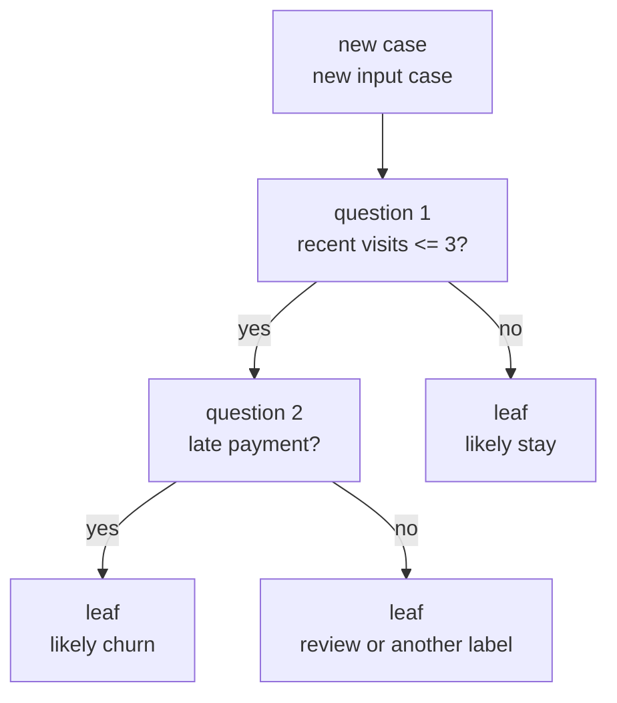
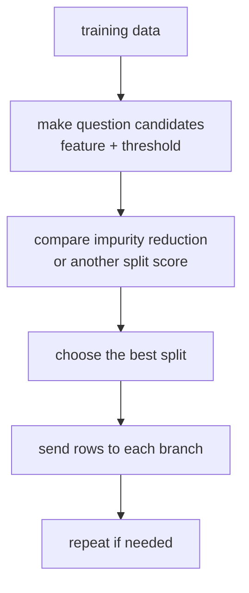
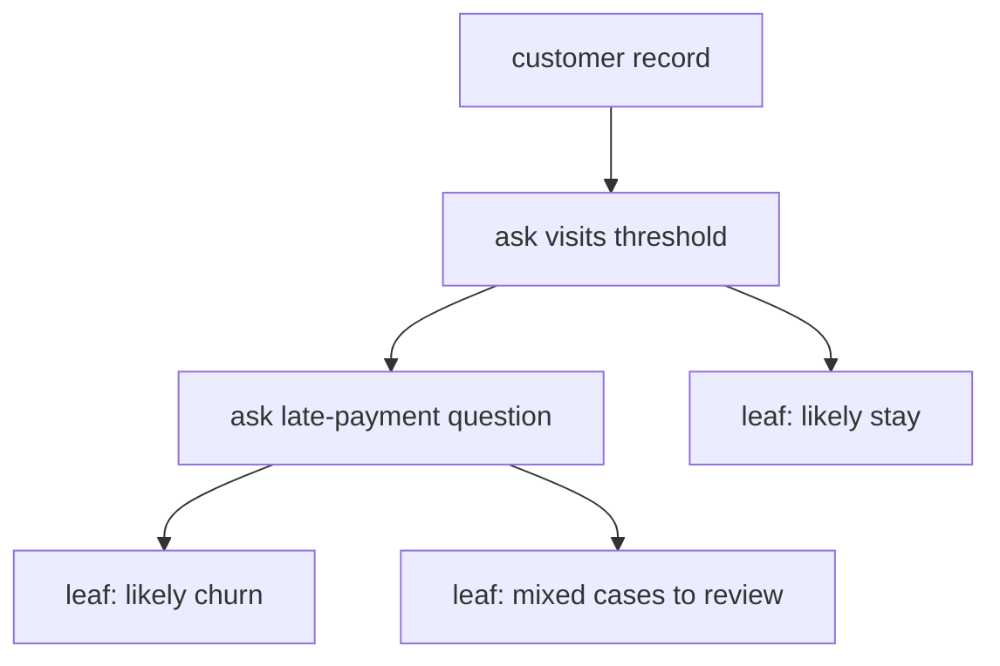

# P4-14.1 Decision Tree

> Section ID: `P4-14.1`
> Version: `v2026.07.10`

In P4-11, we looked at the perspective of drawing a boundary like a straight line, in P4-12 we looked at the way of viewing nearby neighbors, and in P4-13 we looked at margin as the criterion for a better boundary. Now we re-read the same supervised learning problem in a completely different way.

What if, instead of drawing one straight line, we divide the questions one by one?

This question is the starting point of the decision tree.

A decision tree is a model that does not try to explain the data all at once, but repeatedly asks yes/no questions and divides cases into more and more similar groups in order to predict.

In other words, a decision tree is closer to `a flow of questions` than to `one boundary line`.

This section explains the basic meanings of `decision tree`, `split`, `node`, and `leaf`. In later sections, we continue the current context of judgment based on these handles, and the basic sense of connecting predictions by linking questions is reconnected again through this section and the [concept glossary](../../../reference/concept-glossary.md).

## Scope Of This Section

This section answers the following questions.

- How does a decision tree make predictions?
- What are `split`, `node`, and `leaf`?
- Why is a tree considered a comparatively readable model for people?
- During learning, what kinds of question candidates are compared?
- Why can it be used for both classification and regression?

This section does not go deeply into the following content.

- overfitting that appears when tree depth grows large
- detailed procedures of pruning
- random forest and gradient boosting
- the formula development of entropy and information gain

Those topics continue in P4-14.2, P4-15, and P4-16.

## Goals Of This Section

- You can explain a decision tree as `a model that predicts by dividing questions`.
- You can describe the meaning of split, node, leaf, and threshold.
- You can understand that a decision tree can be used for both classification and regression.
- You can explain that the learning process is `a repetition of choosing questions that look good`.
- You can distinguish that `being easy to read` and `having the risk of becoming too deep` come together.

## Learning Background

The representative models seen in the previous chapters mostly give the following impressions.

- linear regression: sees relationships with lines or planes
- logistic regression: sees boundary probabilities
- k-NN: sees nearby neighbors
- SVM: sees boundaries with room

The decision tree changes the question here.

| Perspective Of Earlier Sections | Question That Changes In Decision Tree |
| --- | --- |
| Can one boundary be drawn well? | With what question is it good to divide the data? |
| Are distance or margin important? | If we split now, do the labels become more organized? |
| Is a tendency expressed through a formula? | Can cases be divided like a flow of conditions? |

In other words, the decision tree changes the view from `a model that draws lines in space` to `a model that links questions`. This perspective also continues directly into understanding the later random forest and boosting.

If one more thing is added here, the decision-tree section directly connects to the comparison-record structure organized so far. When raising a decision tree as a candidate, you should not leave only `what the first split is`, but also write down together `which cases remain near the split`, `what is easier to read than the baseline or other candidates`, and `which split question should be reviewed next`. Even if the same score seems to appear, one tree may still have more mixed classes remaining inside a particular leaf, so differences in the patterns remaining after the split must also be read separately.

| Record To Leave Together | Why It Is Needed |
| --- | --- |
| baseline and decision tree comparison | To see what a rule-like question flow explains more clearly in practice |
| cases near the first split | To look again at which cases are ambiguous near the question boundary |
| representative cases gathered in a leaf | To confirm what grouping the split result actually made |
| next question | To decide whether to increase depth further or split with another feature |

### When Is It Good To Raise Decision Tree First As A Candidate

The decision tree becomes an especially strong first candidate in problems where `the flow of questions` itself becomes the explanation.

| Current Problem State | Why Raise Decision Tree First | What To Confirm First |
| --- | --- | --- |
| Explanation in the form of conditions is important | Because the split flow can be read close to human language | Whether the first split does not strongly contradict domain common sense |
| Tabular features are central | Because numeric and categorical features are easy to divide by threshold questions | Which features dominate the splits |
| The order of questions feels more natural than linear boundaries or distance criteria | Because stepwise separation can be more explanatory than the whole space | Whether cases inside each leaf are not too mixed |
| You want to compare classification and regression under the same structure | Because the same structure can be reused just by changing the leaf output | Whether evaluation metrics appropriate to the problem type are being used |
| There is a possibility of later extending to random forest or boosting | Because the starting structure of the whole tree family can be set first | Whether handles such as depth and leaf size are understood |

The core of this table is to position the decision tree not merely as `an easy-to-read model`, but as `a candidate to try first when the flow of questions itself becomes the real explanatory unit`.

## Main Learning Content

### What Kind Of Model Is A Decision Tree

The scikit-learn user guide introduces a decision tree as a non-parametric supervised learning method used for classification and regression. The same document explains the goal of the model as `learning simple decision rules inferred from data features to predict a target value`. It also adds that this structure can be viewed as a `piecewise constant approximation`.

This explanation can be translated more easily as follows.

`A decision tree is a model that looks at input features, asks questions such as whether they are larger or smaller than some threshold, divides input space into many pieces, and places a representative prediction value in each piece.`

For example, think of customer churn prediction.

| Feature | Example Question |
| --- | --- |
| visits in the last 30 days | Are visits 3 or fewer? |
| whether payment was delayed | Was there a recent late payment? |
| number of customer-center inquiries | Were there 2 or more inquiries? |

A decision tree first chooses one of these questions, then divides the data into two or more branches according to the answer. In each branch, it can then continue asking more questions.

### Looking At It As A Small Flow

Before seeing a decision tree as a learner, read it as `a decision flow that goes down along questions`.



This diagram lets you read a decision tree as `a flow that goes down through questions and reaches a leaf`. Unlike a model that draws one boundary at once, the key is that a tree goes through intermediate questions in order and gradually narrows toward groups of more similar cases.

The key in this figure is the following.

- The question boxes in the middle are nodes.
- The points where the question branches are splits.
- The endpoints that no longer ask questions and instead output a prediction are leaves.

In other words, a decision tree can be read as `a structure that follows question nodes and reaches a leaf`.

If you shorten it in project-note style, it can be written like this.

| Record Item | Example |
| --- | --- |
| first split | `visits <= 3` |
| near-split cases | `customer C`, `customer D` |
| current leaf prediction | `churn` or `stay` |
| whether review is needed | `customers near the boundary should be rechecked` |
| next question | `whether late_payment should be placed as the next split` |

With this table, the introduction to decision trees is read through the structure `comparison candidate -> cases near the split -> next question`. At this point, both the near-split cases and the leaf composition must be seen together, so that even if the same accuracy seems to appear, you can distinguish which tree is easier to read and which tree is more unstable.

### How Is It Good To Understand Node, Split, And Leaf

In this section, it is important to cut the terms short and clearly.

| Term | Easy Explanation | Role In This Section |
| --- | --- | --- |
| node | the point where a question is placed | places the criterion for dividing data |
| split | the act of branching according to the result of a question | tries to divide data into more similar groups |
| leaf | the endpoint where the final prediction is written | outputs a class or a number |
| threshold | the cutoff value that slices a number | makes a question like `x <= 3.5` |

These terms also connect directly to the later hyperparameter section.

- `max_depth` connects to how deeply the tree is allowed to grow.
- `min_samples_split` connects to whether there are enough cases to split a node further.

But in this section, we still focus not on `how deep should it be allowed to go`, but on `what the structure of dividing questions itself is`.

## Detailed Learning Content

### Why Is It Said To Be A Comparatively Readable Model

Among the models first met in Part 4, the decision tree belongs to the comparatively `easy to read like a rule` side. The scikit-learn user guide explains this through the viewpoint of a `white box model`. In other words, if a situation is observed inside the model, it means that the condition is comparatively easy to explain with Boolean logic. Compared with the weights of linear models or the margins of SVM seen in earlier sections, the structure `if you follow the questions, a prediction comes out` is more familiar to people.

For example, the feeling becomes clearer if you compare the following two explanations.

- linear model: if the weighted sum of several features is larger than a criterion, it is positive
- decision tree: if recent visits are low and there was a late payment, churn is likely

Both are models, but the latter looks more like the way people read work rules.

In practice, this advantage is often mentioned as well.

| Situation | Advantage Given By Decision Tree |
| --- | --- |
| customer churn analysis | It is easy to see in what order questions divided churn |
| loan-screening support | It is easy to explain what condition made the first split |
| equipment anomaly detection | It is easy to read what sensor-value range made what split |

But there is also an immediate point of caution here.

`Being easy to read and always giving good generalization do not mean the same thing.`

That risk is handled directly in the next section, P4-14.2.

### What Does It Mean That It Can Be Used For Both Classification And Regression

A decision tree can be used for both classification and regression. What changes is `what is output at the leaf`.

| Problem Type | What Is Output At The Leaf |
| --- | --- |
| classification | the most common class, or class proportions |
| regression | a representative number, such as the average of values that entered that leaf |

For example:

- customer churn prediction: `churn`, `stay`
- house-price prediction: `predicted price 520 million won`

In other words, the tree structure is similar, and only the character of the final output changes. The scikit-learn `predict_proba` explanation also reads prediction probability in classification trees as `the proportion of same-class samples that entered that leaf`. For this reason, as emphasized in the evaluation-metric sections of Part 4, you must check first `is this problem classification or regression`, before the algorithm name.

### How Does Learning Choose Questions

The core of decision-tree learning is `comparing question candidates that look good`.

1. Look at multiple features.
2. Make threshold candidates that can split each feature.
3. Compute whether after splitting, the labels become more organized than before splitting.
4. Place the best question at the current node.
5. If needed, repeat again in each branch.

If you draw it simply, it becomes as follows.



This diagram shows that decision-tree learning is ultimately `a repetition of choosing a good first question and the next question`. It compares features and threshold candidates, chooses the split that reduces impurity better, and repeats the same process again in each branch.

Here, `impurity` is a word for how mixed the inside of a node is. By API-document criteria, in classification trees the `criterion` can be `gini`, `entropy`, or `log_loss`. Before memorizing formulas at length, it is enough first to hold the sense that `if classes are mixed within one node, impurity is high; if they are organized toward one class, impurity is low`.

### Reading Impurity Intuitively

In a classification tree, you want to see `did asking this question make the labels more organized?`

For example, if there are 10 customers inside one node and:

- 5 are churn
- 5 are stay

then they are quite mixed.

By contrast, after splitting with some question:

- the left branch has 4 churn, 1 stay
- the right branch has 1 churn, 4 stay

then both branches can be read as more organized than before.

In other words, a good split is usually `a question that changes a mixed node into less mixed nodes`.

## Cases And Examples

### Case 1. When You Want To Narrow Customer Churn Not All At Once, But Through Questions

A subscription service team is building a customer-churn prediction model. The criteria that people first looked at were questions such as `are recent visits low`, `was there a late payment`, and `are customer-center inquiries frequent`.

Rather than a one-shot score calculation like a linear model, this team needs a flow of questions that operations people can read. So if the model asks `are recent visits 3 or fewer?` and then `was there a late payment?`, cases with similar behavior begin to gather more and more into the same branches. At this point, the decision tree is read not as one boundary line, but as a model that finds `a good order of questions`.



What matters in this scene is that the questions themselves are selected from the data. It is not using just any condition; it compares features and thresholds that organize labels better inside the current node, chooses the first split, and then repeats the same procedure. So the decision tree is not a model in which people arbitrarily write rules, but a model that accumulates questions that organize the data better.

The checkable result appears in the compared scores of the first split candidates and in the structure of the final small tree. If `visits <= 3` separates better than other questions, then you can explain why that question was placed at the first node, and when you see which customers gather in each leaf, you can also confirm how the tree is read like a rule.

## Cases And Examples

### How Can It Be Read In Practical Scenes

Decision trees are especially often recalled in `tabular data`. The reason is that dividing numeric and categorical features by criteria or conditions feels comparatively natural.

| Work Scene | Example Decision-Tree-Style Question |
| --- | --- |
| customer churn | Are recent visits low? Was there a late payment? |
| loan-screening support | Is income above a certain criterion? Is there a late-payment history? |
| equipment anomaly detection | Did temperature exceed the criterion? Is vibration outside a certain range? |
| marketing-response prediction | Was there a recent purchase? Is response rate to discount messages high? |

In scenes like these, the decision tree can feel more intuitive than a linear model. Conversely, if the data has a very smooth continuous relationship or the structure changes greatly even with a small shake, caution is needed. Also, as the API documentation warns, if no default size-control value is set, the tree can become very large in a fully grown and unpruned state. That point directly continues into the next section's discussion of overfitting.

## Practice And Example

### Finding `A Good First Question` With A Python Example

This example is a small exercise that directly checks the feeling of how a decision tree chooses its first split, rather than immediately using a scikit-learn learner.

- Problem situation: choose the first question for customer churn classification.
- Input: `visits`, `late_payment`
- Correct answer (label): `stay`, `churn`
- Concepts to confirm:
  - If the feature and threshold change, the split score changes.
  - A question that organizes things better can become a better first question.
  - A decision tree ultimately repeats this question selection.

```python
rows = [
    {"customer": "A", "visits": 1, "late_payment": 1, "label": "churn"},
    {"customer": "B", "visits": 2, "late_payment": 1, "label": "churn"},
    {"customer": "C", "visits": 2, "late_payment": 0, "label": "stay"},
    {"customer": "D", "visits": 4, "late_payment": 0, "label": "stay"},
    {"customer": "E", "visits": 5, "late_payment": 0, "label": "stay"},
    {"customer": "F", "visits": 6, "late_payment": 1, "label": "stay"},
]


def gini(group):
    total = len(group)
    if total == 0:
        return 0.0

    counts = {}
    for row in group:
        counts[row["label"]] = counts.get(row["label"], 0) + 1

    score = 1.0
    for count in counts.values():
        p = count / total
        score -= p * p
    return score


def weighted_gini(left, right):
    total = len(left) + len(right)
    return (len(left) / total) * gini(left) + (len(right) / total) * gini(right)


candidates = [
    ("visits", 1.5),
    ("visits", 3.0),
    ("visits", 5.5),
    ("late_payment", 0.5),
]

best = None

for feature, threshold in candidates:
    left = [row for row in rows if row[feature] <= threshold]
    right = [row for row in rows if row[feature] > threshold]
    score = weighted_gini(left, right)

    print(f"feature={feature:12} threshold={threshold:>3} weighted_gini={score:.3f}")
    print("  left :", [(row["customer"], row["label"]) for row in left])
    print("  right:", [(row["customer"], row["label"]) for row in right])
    print()

    if best is None or score < best["score"]:
        best = {"feature": feature, "threshold": threshold, "score": score}

print("best first split")
print(best)
```

An example output is as follows.

```text
feature=visits       threshold=1.5 weighted_gini=0.400
  left : [('A', 'churn')]
  right: [('B', 'churn'), ('C', 'stay'), ('D', 'stay'), ('E', 'stay'), ('F', 'stay')]

feature=visits       threshold=3.0 weighted_gini=0.222
  left : [('A', 'churn'), ('B', 'churn'), ('C', 'stay')]
  right: [('D', 'stay'), ('E', 'stay'), ('F', 'stay')]

feature=visits       threshold=5.5 weighted_gini=0.400
  left : [('A', 'churn'), ('B', 'churn'), ('C', 'stay'), ('D', 'stay'), ('E', 'stay')]
  right: [('F', 'stay')]

feature=late_payment threshold=0.5 weighted_gini=0.250
  left : [('C', 'stay'), ('D', 'stay'), ('E', 'stay')]
  right: [('A', 'churn'), ('B', 'churn'), ('F', 'stay')]

best first split
{'feature': 'visits', 'threshold': 3.0, 'score': 0.2222222222222222}
```

There are three things to read from this output.

1. Not every question gives the same quality.
2. `visits <= 3.0` looks like the first question that organizes the current data best.
3. Tree learning builds the structure by repeating comparisons like this.

In other words, a decision tree is not `a model where a person writes questions by intuition`, but `a model that finds and accumulates questions that organize the data better`.

### Applying A Very Small Tree Directly

Based on the first split just found, if you write down a small tree that a person can read by hand, it can be read as follows.

```text
if visits <= 3:
    if late_payment == 1:
        predict churn
    else:
        predict stay
else:
    predict stay
```

This code is not `the whole learner`, but a simplification of how a person reads the learning result. When people say a decision tree looks comparatively explainable, it usually comes from this kind of shape.

It becomes even clearer if you run the same structure very briefly in Python.

Problem situation:

- Understanding improves if the branching rules of a decision tree are not only seen in a figure, but also checked by placing in actual inputs and seeing how the result comes out

Input:

- simple tree rule `predict`
- example customer list `examples`

Expected output:

- prediction results for each example customer

Concepts to confirm:

- a decision tree can be read as an if-else branching rule
- saying it has high explainability is close to saying that a person can follow this branching process

```python
def predict(tree_input):
    if tree_input["visits"] <= 3:
        if tree_input["late_payment"] == 1:
            return "churn"
        return "stay"
    return "stay"


examples = [
    {"customer": "G", "visits": 2, "late_payment": 1},
    {"customer": "H", "visits": 2, "late_payment": 0},
    {"customer": "I", "visits": 5, "late_payment": 1},
]

for row in examples:
    print(row["customer"], "->", predict(row))
```

An example output is as follows.

```text
G -> churn
H -> stay
I -> stay
```

This example shows important characteristics of the decision tree.

- You can read it by following the prediction path.
- It is easy to explain at which question it branched.
- But if questions keep being added, the structure can grow quickly.

That last item is exactly the subject of the next section.

## Perspectives To Remember In This Section

- A decision tree is `a model that predicts by dividing questions`.
- A node is a question, a split is a branch, and a leaf is the final prediction.
- A good split is usually one that changes labels into less mixed groups.
- A decision tree can be used for both classification and regression.
- It is relatively easy to read, but the risk also grows together when it becomes deep.

## Short Check

- In the current problem, is a flow-of-questions explanation more natural than a straight-line boundary?
- Can you look again at what grouping of cases the first split and leaf composition made?
- Are you avoiding mixing readability and generalization performance as if they were the same thing?

## When Should You Recall This Perspective First

- When an explanation that divides questions in order feels more natural than drawing a line, recall first the question-flow perspective of the decision tree.
- When you need to explain which `feature + threshold` actually divides groups well, look at the split again as a question candidate.
- When you start to mix up whether the leaf is a classification result or a numeric prediction, recall together that the tree can be used for both classification and regression.

## Sources And References

- scikit-learn developers, `1.10. Decision Trees`, scikit-learn User Guide, checked on 2026-06-27. [https://scikit-learn.org/stable/modules/tree.html](https://scikit-learn.org/stable/modules/tree.html){: target="_blank" rel="noopener noreferrer" }
- scikit-learn developers, `DecisionTreeClassifier`, scikit-learn API Reference, checked on 2026-06-27. [https://scikit-learn.org/stable/modules/generated/sklearn.tree.DecisionTreeClassifier.html](https://scikit-learn.org/stable/modules/generated/sklearn.tree.DecisionTreeClassifier.html){: target="_blank" rel="noopener noreferrer" }
- Leo Breiman, Jerome Friedman, Richard Olshen, Charles Stone, *Classification and Regression Trees*, Routledge, 1984.
