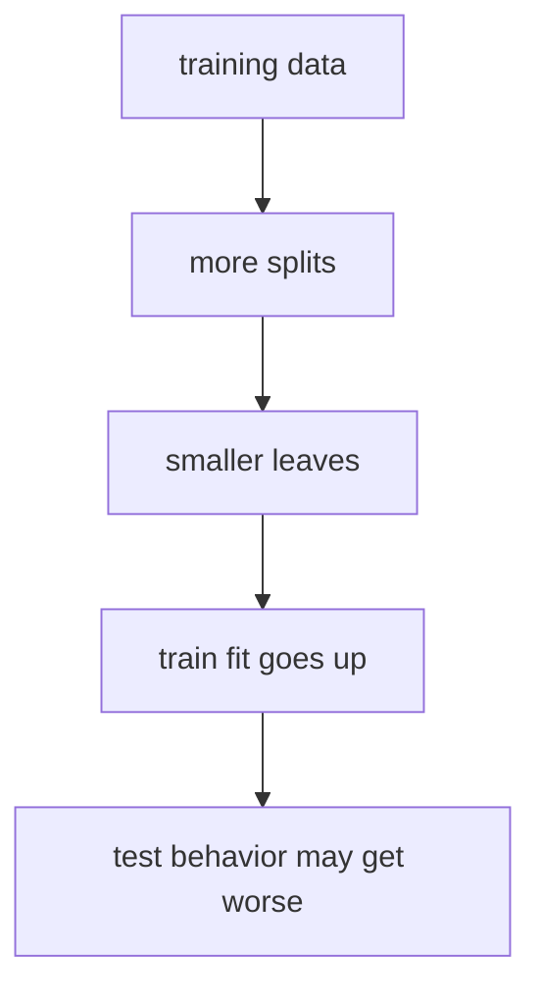
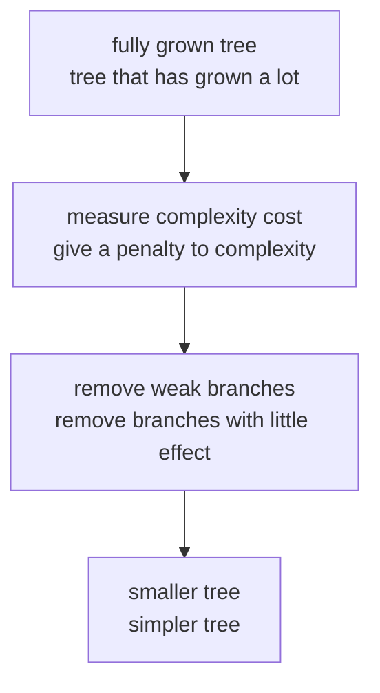
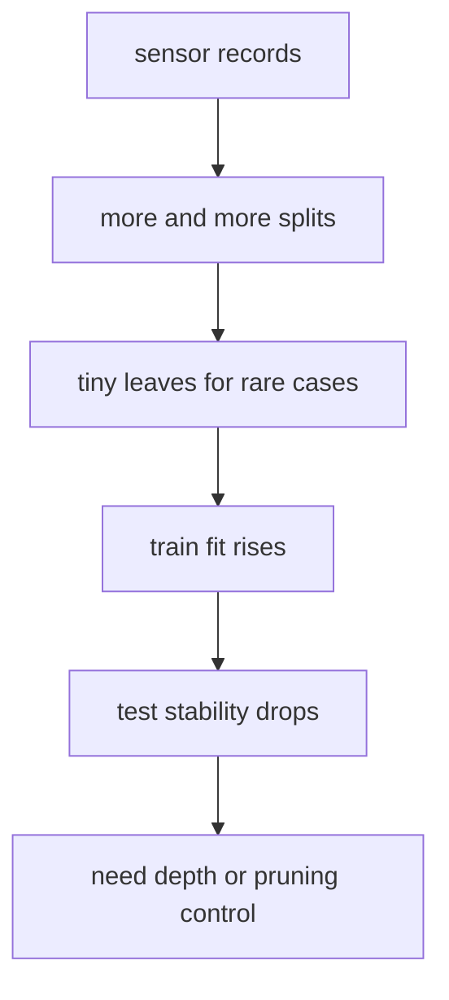
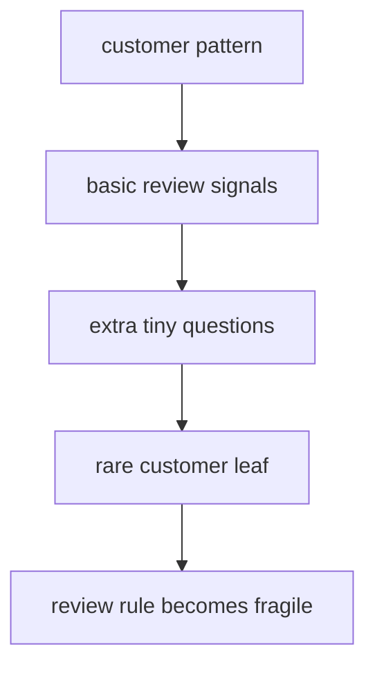

# P4-14.2 Overfitting Of Trees

> Section ID: `P4-14.2`
> Version: `v2026.07.10`

In P4-14.1, we viewed the decision tree as `a model that predicts by dividing questions`. The strengths of that section were clear.

- It is easy to read as a flow of questions.
- It is easy to explain like conditional statements.
- It feels intuitive in tabular data.

But that same character also directly leads to danger.

If we can keep making more questions, then couldn’t we end up almost memorizing the training data?

This question is exactly the problem of overfitting in trees.

This section does not repeat the basic definition of the decision tree at length. The core intuition that it `predicts by dividing questions` reconnects through P4-14.1 and the [concept glossary](../../../reference/concept-glossary.md), and for the general handle of overfitting itself, P4-5.1 should also be recalled together.

## Scope Of This Section

This section answers the following questions.

- Why does overfitting become easier to notice in trees than in some other models?
- What happens as the tree grows deeper?
- What roles do `max_depth`, `min_samples_leaf`, and `ccp_alpha` play?
- Why can train performance and test performance move differently?

This section does not go deeply into the following content.

- the bagging mitigation effect of random forest
- the sequential correction structure of gradient boosting
- mathematical optimization details of pruning algorithms
- refined hyperparameter search procedures based on cross-validation

These connect again in P4-15, P4-16, and the tuning context of P4-9.

## Goals Of This Section

- You can explain overfitting in trees as `a phenomenon where overly detailed questions memorize the training data`.
- You can state that depth, leaf size, and pruning are devices for controlling tree complexity.
- You can reconfirm that improvement in train performance does not guarantee improvement in test performance.
- You gain a standard for reading together the advantages of the decision tree and its overfitting risk.

## Learning Background

### Why Is Overfitting Easy To See In Trees

A decision tree is essentially `a structure that keeps dividing nodes into smaller pieces by repeating splits`. This structure is powerful, but if left unconstrained, it can keep making smaller and smaller leaves.

The scikit-learn user guide explains that decision-tree learners can create `over-complex trees`, and that such trees do not generalize well. The same document calls this overfitting, and explains that devices such as pruning, `min_samples_leaf`, and `max_depth` are needed.

`The more questions a tree adds, the more it can follow exceptions in the training data. But there is no guarantee that those exceptions will repeat in new data.`

Here again, it is useful to fix the recording structure together. The overfitting section is not merely a section that says `it becomes risky when it gets deeper`, but a section for recording `what new failures appear as complexity grows`, `what review cases keep remaining`, and `at what point branches should be stopped or reduced`. Even if the same accuracy or a similar average score range seems to appear, which cases the deeper tree newly memorizes and which failures it leaves unchanged must be read separately.

| Record To Leave Together | Why It Is Needed |
| --- | --- |
| change in depth or leaf size | To see how the complexity handle changed |
| train/test difference | To distinguish memorization from generalization |
| failure cases that keep remaining | To look again at cases that are not solved even when more branches are made |
| next pruning question | To decide whether to adjust `max_depth`, `min_samples_leaf`, or `ccp_alpha` |

### When Should Tree Overfitting First Be Suspected

With trees, to catch overfitting quickly, it is often better to look together not only at performance numbers, but also at `whether the questions have become too detailed`.

| Visible Signal | What To Suspect First | Reason |
| --- | --- | --- |
| train is almost perfect but test drops | excessive depth | because it may have started memorizing the training data |
| one leaf has almost no samples | leaf overshrinkage | because it may be talking about an exception as if it were a pattern |
| the same failure cases remain even when branches increase | wrong complexity increase | because only the number of questions grew, while the real problem did not get solved |
| after the first split, later splits become excessively numerous | overly fine later-stage splitting | because the later branches may be following accidental shakes |
| the explanation became longer, but the interpretation became harder | pruning needed | because the advantage of readability is disappearing |

This table makes tree overfitting readable not only at the level of `it becomes risky when it gets deeper`, but as `at what point did the questions stop talking about patterns and start talking about exceptions`.

## Main Learning Content

### Intuition From Comparing A Small Tree And A Large Tree

Think again of customer churn data.

| Tree State | Intuition |
| --- | --- |
| shallow tree | sees only large tendencies |
| tree of moderate depth | sees important patterns and exceptions in balance |
| excessively deep tree | follows accidental fluctuations in the training data |

If the same content is drawn more briefly, it becomes as follows.



This diagram shows that overfitting in trees does not mean `the more questions are made, the better it always becomes`. As the number of splits increases, it may fit the training data better, but at the final stage, memorization rather than generalization can begin.

The key is the last arrow.

`Fitting better` and `generalizing better` do not mean the same thing.

If you shorten it into project-note style, it can be written like this.

| Record Item | Example |
| --- | --- |
| complexity change | `max_depth 3 -> 5` |
| train change | `0.971 -> 1.000` |
| test change | `0.933 -> 0.911` |
| whether review is needed | `depth increased, but failure cases remain` |
| next question | `should we enlarge leaves or do pruning?` |

With this table, the overfitting section is read through the structure `complexity change -> remaining failure -> next pruning question`. In the end, what matters is not one numeric cell, but seeing together `did the remaining failure pattern become simpler, or did it only fit the training data more?`

### What Happens As It Gets Deeper

As the tree gets deeper, fewer samples remain in each leaf. Then the following things happen.

1. One or two exceptional cases can create a new split.
2. One leaf may make a prediction based on only a very small number of samples.
3. On train data, it may end up making almost no mistakes.
4. But on test data, even a small shake can easily change the prediction.

The scikit-learn documentation explains that each additional level in the tree doubles the number of samples needed to fill the tree, and recommends controlling size with `max_depth`. It also recommends using `min_samples_split` and `min_samples_leaf` so that every decision is based on information from multiple samples.

If you shorten this explanation, it becomes as follows.

`As a tree gets deeper, it becomes more detailed, but if there is not enough data to support that detail, then the tree may become not smarter, but more sensitive.`

### Looking At Overfitting As A Data Flow

If overfitting is understood as a flow rather than as a formula, it lasts longer.

The early splits often capture meaningful large tendencies. The problem tends to arise later. The final few stages can begin explaining not `real structure`, but `accidental fluctuations that only appeared in the training data`.

If you divide this flow into stages, it can be read as follows.

| Flow Stage | What The Tree Mainly Does | Question To Recall First |
| --- | --- | --- |
| early splits | divides large patterns | is it really capturing the important difference? |
| middle splits | sees exceptions and subpatterns more | is it still seeing a repeating structure? |
| later splits | begins separating small-number cases | is it now memorizing accidental fluctuations? |
| final leaves | can become rules almost only for the training data | will this leaf survive on new data too? |

For example, early on, comparatively large criteria may work, such as `is temperature high and vibration large` or `are access decrease and complaint signals appearing together`. But farther back, it becomes easy for narrow questions to be attached, such as `did the value shake slightly only at the third time point` or `did access drop twice only during a particular week`.

What matters here is not merely the fact that `the number of questions increased`, but `did the character of the questions begin to change from explaining large patterns into explaining exceptions in the training data`.

In other words, looking at overfitting as a data flow is closer to reading the following movement.

- front: large tendencies in which many samples move together
- back: increasingly small questions that explain only fewer and fewer samples
- end: leaves where the train score goes up, but may not repeat on test

So when reading a tree, it is not enough to see only `did the number of splits increase`; you must also see `are the later splits still explaining structure, or are they separately memorizing small-number cases`.

### Why Must Train Performance And Test Performance Be Seen Together

Overfitting in trees is especially clearly revealed when train and test performance are seen together.

| Observation | Interpretation |
| --- | --- |
| both train and test are low | it may still be too simple and not have learned enough |
| train and test are both high together | the balance currently looks okay |
| only train is very high and test drops | overfitting should be suspected |

This perspective appears especially often in decision trees, but in fact it is also a common principle across all of Part 4. For linear regression, logistic regression, SVM, and tree models alike, what matters more in the end is `how it holds up on unseen data`.

## Detailed Learning Content

### Why Is `min_samples_leaf` Needed

If `max_depth` is the handle that limits the overall height of the tree, then `min_samples_leaf` is the handle that prevents one leaf from becoming too small.

The API documentation explains `min_samples_leaf` as the minimum number of samples that must be in a leaf node. It also explains that in regression, this value can have a smoothing effect on the model.

`If one leaf is allowed to contain only one or two cases, that leaf becomes more likely to speak about an exception than about a pattern.`

For example:

- `min_samples_leaf=1`: even a leaf with just one case is allowed
- `min_samples_leaf=5`: at least five cases must remain before it is accepted as a leaf

This difference can be read as the difference in `how small an exception are we willing to trust`.

### Looking At Leaf-Size Control With A Python Example

This time, instead of fixing depth, change only leaf size.

Problem situation:

- On the same data, changing how small a leaf is allowed to become can change how train and test are read

Input:

- `X_train`, `X_test`, `y_train`, `y_test` of the iris dataset
- several `leaf_size`

Expected output:

- train score for each leaf size
- test score for each leaf size

Concepts to confirm:

- if leaves are too small, the train score tends to rise easily
- if leaf size is increased, the structure can become less sensitive

```python
from sklearn.datasets import load_iris
from sklearn.model_selection import train_test_split
from sklearn.tree import DecisionTreeClassifier

X, y = load_iris(return_X_y=True)

X_train, X_test, y_train, y_test = train_test_split(
    X, y, test_size=0.3, random_state=42, stratify=y
)

for leaf_size in [1, 2, 5, 10]:
    model = DecisionTreeClassifier(
        min_samples_leaf=leaf_size,
        random_state=42
    )
    model.fit(X_train, y_train)

    print(f"min_samples_leaf={leaf_size}")
    print("  depth          :", model.get_depth())
    print("  leaves         :", model.get_n_leaves())
    print("  train accuracy :", round(model.score(X_train, y_train), 3))
    print("  test accuracy  :", round(model.score(X_test, y_test), 3))
    print()
```

An example output is as follows.

```text
min_samples_leaf=1
  depth          : 5
  leaves         : 8
  train accuracy : 1.0
  test accuracy  : 0.911

min_samples_leaf=2
  depth          : 4
  leaves         : 7
  train accuracy : 0.981
  test accuracy  : 0.933

min_samples_leaf=5
  depth          : 3
  leaves         : 4
  train accuracy : 0.971
  test accuracy  : 0.933

min_samples_leaf=10
  depth          : 2
  leaves         : 3
  train accuracy : 0.952
  test accuracy  : 0.889
```

This example gives one important sense.

`Preventing leaves from becoming too small does not always worsen performance. In some cases, the test side can become more stable instead.`

### What Does Pruning Do

If the method of stopping depth in advance can be read like `pre-pruning`, then the method of simplifying again a tree that has already grown can be read as `pruning`.

scikit-learn supports `Minimal Cost-Complexity Pruning`, and the API documentation explains `ccp_alpha` as the complexity parameter for that pruning. The larger the value becomes, the more nodes can be cut away.

- `max_depth`, `min_samples_leaf`: prevent the tree from becoming too complex from the start
- `ccp_alpha`: after it has grown, reduce complexity again by treating it like a penalty

In other words, the purpose of both is the same.

`Rather than memorizing the training data, leave behind a structure that holds up on new data as well.`

The difference beginners should first grasp here is `when does it intervene`.

| Method | When Does It Intervene | Meaning To Read First |
| --- | --- | --- |
| `max_depth`, `min_samples_leaf` | while the tree is growing | prevents overly detailed splitting from the beginning |
| pruning, `ccp_alpha` | after it has grown once | trims weak residual branches again |

In other words, pre-pruning is `a handle that stops it from growing too deep from the start`, while pruning is `a handle that chooses again which branches to keep and which to discard in a tree that has already grown once`.

It becomes clearer in a small scene.

| Branch State | Before Pruning | After Pruning |
| --- | --- | --- |
| large early branches | can remain | usually remain |
| leaf explaining only a few cases | may remain | can be cut away |
| train score | may look higher | may go down slightly |
| test stability | may shake | can become more stable |

The core of this table is that pruning should be read not as `damaging the tree`, but as `keeping the large structure while removing only the tiny residual questions`.

For example, suppose one later branch creates one more leaf through a very narrow condition such as `temperature is high`, `vibration is large`, and `only the third time-point pressure was in a specific range`. If this leaf is only barely explaining two products in the training data, then pruning makes you ask again `is this branch worth keeping`.

So `ccp_alpha` is not simply one more number option, but a handle that asks again `is the benefit of this tiny branch, which raises the train score, larger than the cost of increasing complexity`.

If you read only the direction first, it is enough to remember it like this.

- if `ccp_alpha` is very small, it is easier to keep more branches
- as `ccp_alpha` gets larger, it becomes easier to cut small branches more aggressively
- if it is too small, it can tilt toward memorization; if it is too large, even important patterns can be cut away together

### Looking At Pruning As A Flow



In this section, we do not calculate the pruning formula. Instead, it is read around `which small leftover branches should not be kept` and `why we try to gain test stability while giving up a little train score`.

## Cases And Examples

### Case 1. When A Defect-Detection Tree Begins To Memorize Even Exceptions In Factory Data

A manufacturing team is building a decision tree that divides product defects using sensor values. The criteria people first looked at were questions such as `is temperature above the criterion`, `does vibration exceed a certain range`, and `is the pressure change sharp`.

It can look as if the more questions are made, the smarter the model becomes. In practice, if the tree is made deep, it may become almost error-free on the training data. But if you look at the later branches, leaves appear that explain only one or two exceptional cases, and those leaves shake easily on new data even when the process changes only slightly.

If converted into a small scene, it can be seen as follows.

| Product | Temperature | Vibration | Pressure Change | What A Person Reads First |
| --- | --- | --- | --- | --- |
| A | high | large | sharp | defect review priority is high |
| B | medium | small | stable | likely normal |
| C | high | medium | slightly large | review candidate |
| D | slightly high | very briefly large | stable | hard to immediately conclude defect |

Here, what a person reads first is a comparatively large pattern such as `temperature rise + vibration / pressure anomaly`. But an excessively deep tree can add leftover questions such as `did vibration rise only briefly at the third measurement point` or `did the pressure change bend twice within a specific range`, and try to explain separately only a few products that happened to resemble D in the training data.

| What A Person Read First | What An Excessively Deep Tree Tends To Grab |
| --- | --- |
| are temperature and vibration anomalies seen together? | a short shake at a specific time point |
| does the pressure change look like a process anomaly? | a rare sensor combination in the training data |
| is it worth seeing first as a review target? | an overly detailed split that matches only one or two products |



If the same scene is divided into `a comparatively simple reading` and `an excessively deep reading`, the difference becomes clearer.

| Reading Method | How It Reads Product D |
| --- | --- |
| comparatively simple tree | temperature is slightly high, but pressure is stable, so it remains a review candidate |
| excessively deep tree | adds the vibration shake at a specific time point and a rare sensor combination, and separates it into a special leaf |

In this scene, tree overfitting should be read as `a phenomenon where questions become too detailed and memorize the training data`. `max_depth` prevents how far the tree can grow, `min_samples_leaf` prevents a leaf from becoming too small an exception set, and `ccp_alpha` plays the role of trimming already-grown branches again. In other words, more questions do not always mean a better explanation.

The checkable result appears when train accuracy and test accuracy are viewed together. If the train score keeps rising, but the test score drops or stops improving after some point, then the splits after that point should be read as closer to memorization than to generalization. In the end, the important question is not `did it explain sensor anomalies better`, but `did it make more explicit a criterion that will repeat even on new process data`.

### Case 2. When A Customer-Churn Tree Begins To Memorize Exceptional Customers More Than The Review Criterion

Suppose a subscription service team is building a decision tree that predicts whether customers churn. The criteria that people first looked at were comparatively large flows such as `did recent access sharply decrease`, `was there a payment failure`, and `was there a complaint signal after contacting customer support`.

But if the tree keeps growing deeper, then in later branches there can be more combinations that explain only a few customers in the training data, such as `was access 2 times during the last 17 days`, `was last month’s payment amount in a specific range`, and `was a promotion email opened once`. In the training data, such combinations may look very accurate, but in real operations the same combination may not appear again, or its meaning may be weak.

If converted into a small scene, it can be seen as follows.

| Customer | Recent Access Change | Payment Failure | Complaint Signal | What A Person Reads First |
| --- | --- | --- | --- | --- |
| A | sharply decreased | yes | yes | review priority is high |
| B | slightly decreased | no | no | hard to immediately read as churn |
| C | sharply decreased | no | yes | review candidate |
| D | almost no change | no | no | likely to stay |

Here, what a person reads first is a comparatively large pattern such as `access decrease + payment / complaint signal`. But an excessively deep tree can add leftover questions such as `was access 0 only during the second week of the last 3 weeks` or `was an event email opened on Wednesday morning`, and try to separately explain only a few customers that resembled C in the training data.

| What A Person Read First | What An Excessively Deep Tree Tends To Grab |
| --- | --- |
| is the access decrease clear? | a small shake in a particular week |
| were payment problems and complaint signals present together? | a small-customer combination in the training data |
| is it worth viewing first as a review target? | an overly detailed split that matches only one leaf |

If the same scene is divided into `a shallow reading` and `an excessively deep reading`, the difference becomes clearer.

| Reading Method | How It Reads Customer C |
| --- | --- |
| comparatively simple tree | there is access decrease and a complaint signal, so it raises it as a review candidate |
| excessively deep tree | adds the training-data pattern of a particular week, amount range, and mail response, and separates it into a special leaf |

In this scene, overfitting should be read as a phenomenon where `leftover questions that seem highly explanatory` are actually not making the review criterion clearer, but are memorizing an accidental combination in the training data more precisely. So when looking at the tree, you must ask together not only `did the explanation become more detailed`, but also `is that detail likely to repeat for new customers` and `does it rank review priority better`.



## Cases And Examples

### What Handles Should Be Seen In Practice

For beginners and early practical work, it is better not to touch every value at once, but to separate them by role.

| Handle | The Question First Read |
| --- | --- |
| `max_depth` | How deep should the tree be allowed to grow? |
| `min_samples_split` | Are there enough samples to split this node further? |
| `min_samples_leaf` | Should one leaf be prevented from becoming too small? |
| `ccp_alpha` | How much should already-grown branches be reduced? |

If converted into practical language, it becomes as follows.

- the explanation feels too long and complicated -> check `max_depth`
- there seem to be many leaves that explain only a few cases -> check `min_samples_leaf`
- there seem to be too many branches and many small branches -> consider `ccp_alpha`

## Practice And Example

### Looking At Overfitting By Depth With A Python Example

This example is an exercise that looks at how train/test results diverge when only depth is changed in the same decision-tree classifier.

- Problem situation: classify species with the iris dataset.
- Input: sepal and petal length and width
- Correct answer (label): three species
- Concepts to confirm:
  - As depth increases, train performance can rise easily.
  - Test performance may stop improving or may fall after some point.
  - Tree depth is one of the complexity handles.

If you first fix in a table what to compare in the input and output, it becomes as follows.

| Value To Compare | Why See It Together |
| --- | --- |
| `max_depth` | To see how far the tree is growing |
| `leaves` | To see how many terminal nodes the depth actually made |
| train accuracy | To see how well the training data is being fit |
| test accuracy | To see how well it generalizes to new data |
| `train - test` gap | To see how much memorization and generalization are separating |

```python
from sklearn.datasets import load_iris
from sklearn.model_selection import train_test_split
from sklearn.tree import DecisionTreeClassifier

X, y = load_iris(return_X_y=True)

X_train, X_test, y_train, y_test = train_test_split(
    X, y, test_size=0.3, random_state=42, stratify=y
)

for depth in [1, 2, 3, 5, None]:
    model = DecisionTreeClassifier(max_depth=depth, random_state=42)
    model.fit(X_train, y_train)

    train_score = model.score(X_train, y_train)
    test_score = model.score(X_test, y_test)

    print(f"max_depth={depth}")
    print("  depth          :", model.get_depth())
    print("  leaves         :", model.get_n_leaves())
    print("  train accuracy :", round(train_score, 3))
    print("  test accuracy  :", round(test_score, 3))
    print("  train-test gap :", round(train_score - test_score, 3))
    print()
```

An example output is as follows.

```text
max_depth=1
  depth          : 1
  leaves         : 2
  train accuracy : 0.667
  test accuracy  : 0.667
  train-test gap : 0.0

max_depth=2
  depth          : 2
  leaves         : 3
  train accuracy : 0.952
  test accuracy  : 0.889
  train-test gap : 0.063

max_depth=3
  depth          : 3
  leaves         : 5
  train accuracy : 0.981
  test accuracy  : 0.933
  train-test gap : 0.048

max_depth=5
  depth          : 5
  leaves         : 8
  train accuracy : 1.0
  test accuracy  : 0.911
  train-test gap : 0.089

max_depth=None
  depth          : 5
  leaves         : 8
  train accuracy : 1.0
  test accuracy  : 0.911
  train-test gap : 0.089
```

What should be read from this result is the following.

1. As depth increases, train accuracy tends to keep improving.
2. But test accuracy may no longer improve after some point.
3. As `train-test gap` grows, the memorization signal can become stronger.
4. Around `max_depth=3`, the current example looks more balanced.

In other words, when looking at tree performance, it is not enough to ask `did it get deeper`; you must also see together `when it got deeper, how did train and test diverge`.

If briefly tied together again, the following comparison is the core.

| Depth Range | Judgment To Read First |
| --- | --- |
| too shallow | is it still too simple and not learning enough? |
| middle depth | are train and test both improving together? |
| too deep | is only train improving while the gap is growing? |

There are also questions that become easier to see if you directly change the values.

- if `max_depth=4` is added, what change appears between depth 3 and 5
- if `random_state` changes, how much does the gap pattern by depth repeat
- if `max_depth=None`, at what depth does it actually stop

## Perspectives To Remember In This Section

- Trees are easy to read, but if unconstrained, they can easily follow the training data too much.
- As depth grows and leaves become smaller, the overfitting risk increases.
- Even if train performance rises, there is no guarantee that test performance improves together.
- `max_depth`, `min_samples_leaf`, and `ccp_alpha` are representative handles for controlling tree complexity.
- Reducing overfitting usually means `memorizing a little less perfectly, and becoming a little more generalizable`.

The core of this section is not simply that the tree becomes deeper, but reading together what kind of failures that depth creates.

| What Should Be Seen Together | Question First Read In This Section | Where It Reconnects Later |
| --- | --- | --- |
| train-test gap | Did the deeper tree actually improve generalization too? | P4-5 generalization, P4-9 tuning |
| complexity handles | Which among `max_depth`, `min_samples_leaf`, and `ccp_alpha` reduces overfitting in what way? | P4-9 hyperparameters |
| representative failure zones and next model | Which branches are memorizing exceptions, and how bagging or boosting could mitigate this | P4-15 random forest, P4-16 gradient boosting |

## Short Check

- Are you reading train performance improvement and test performance improvement as if they meant the same thing?
- Are leaves becoming too small and speaking about exceptional cases as if they were rules?
- Are you distinguishing whether the next adjustment is a depth limit, leaf-size adjustment, or pruning?

## When Should You Recall This Perspective First

- When train performance keeps rising but test does not follow, first recall whether the tree is memorizing exceptions.
- When it is unclear whether to adjust depth limit, leaf size, or pruning, look again at the difference in how each reduces complexity.
- Before moving on to random forest or boosting, use this section as the baseline when you need to organize the complexity sense of a single tree.

## Sources And References

- scikit-learn developers, `1.10. Decision Trees`, scikit-learn User Guide, checked on 2026-06-27. [https://scikit-learn.org/stable/modules/tree.html](https://scikit-learn.org/stable/modules/tree.html){: target="_blank" rel="noopener noreferrer" }
- scikit-learn developers, `DecisionTreeClassifier`, scikit-learn API Reference, checked on 2026-06-27. [https://scikit-learn.org/stable/modules/generated/sklearn.tree.DecisionTreeClassifier.html](https://scikit-learn.org/stable/modules/generated/sklearn.tree.DecisionTreeClassifier.html){: target="_blank" rel="noopener noreferrer" }
- Leo Breiman, Jerome Friedman, Richard Olshen, Charles Stone, *Classification and Regression Trees*, Routledge, 1984.
