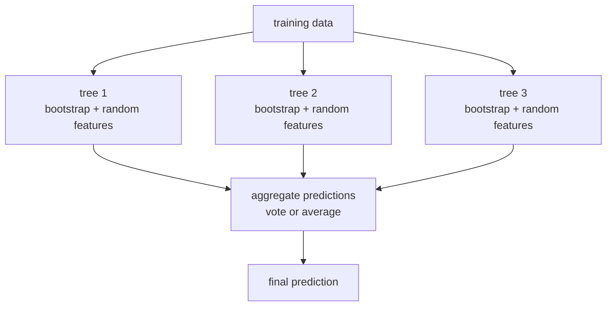
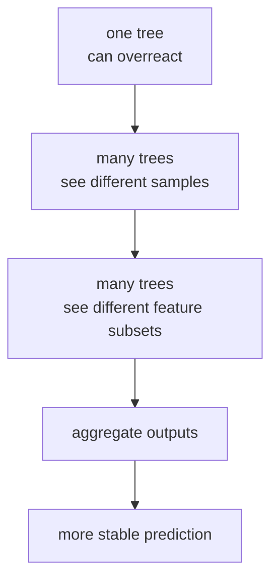
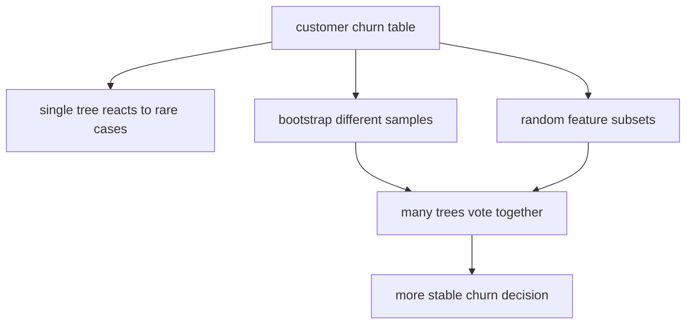

# P4-15.1 Random Forest

> Section ID: `P4-15.1`
> Version: `v2026.07.10`

In P4-14, we saw why the decision tree can feel intuitive yet also fall into overfitting easily. The next question naturally follows.

Then is there a way to keep the strengths of trees while reducing the excessive instability of a single tree?

This question is exactly where the random forest begins.

The random forest is a model that gathers predictions from many decision trees trained a little differently from one another to produce a more stable judgment than a single tree can.

In other words, random forest is not `a model that throws trees away`, but `a model that gathers many trees to reduce their weaknesses`.

This section explains the basic meanings of `random forest`, `ensemble`, `bootstrap`, and `random feature selection`. In later sections, we continue judging the current context based on these handles, and the basic intuition of reducing instability through the agreement of many trees reconnects here and through the [concept glossary](../../../reference/concept-glossary.md).

## Scope Of This Section

This section answers the following questions.

- Why does random forest use many trees?
- What roles do `bootstrap`, `max_features`, and `averaging` play?
- Why can it look more stable than a single tree?
- How does random forest work in classification and regression?
- What do `n_estimators`, `max_features`, `bootstrap`, and `oob_score` mean?

This section does not cover the following topics in depth.

- interpretation of feature importance
- strict evaluation interpretation of OOB(out-of-bag) scores
- detailed comparison with Extra Trees
- advanced comparison with gradient boosting

Feature importance continues in P4-15.2.
The evaluation interpretation of OOB(out-of-bag) scores continues in P4-15.3.
Comparison with gradient boosting continues in P4-16.1 and P4-16.2 through the contrast between `parallel averaging ensembles` and `sequential error-correcting ensembles`.
The detailed comparison with Extra Trees continues in the supplementary study of P4-15.4.

## Goals Of This Section

- You can explain random forest as `an average/aggregation model of many randomized trees`.
- You can describe why bootstrap sampling and random feature selection are needed.
- You can understand that random forest is an attempt to reduce the variance of the decision tree.
- You can distinguish the roles of representative hyperparameters at an introductory level.

## Learning Background

By the time you reach the decision-tree chapter, you usually end up holding two feelings at once.

- what felt good: it is easy to read and seems to fit tabular data well
- what feels unstable: as the tree grows deeper, it seems to memorize too much

Random forest appears right on top of that tension.

| Question Left From Chapter 14 | Direction P4-15.1 Tries To Answer |
| --- | --- |
| What should we do if one tree is unstable? | Gather many trees and average out the instability |
| Can we reduce branches that get pulled by exceptions? | Make each tree different so their errors are less tied together |
| Do we completely lose interpretability? | We lose some of it, but often gain stability and performance |

In other words, random forest does not `deny the weaknesses of the decision tree`, but instead `eases those weaknesses through an ensemble structure of many trees`.

If we add one more point here, the random-forest section connects directly to the comparison-record structure organized so far. When you raise random forest as a candidate, you should not leave only the explanation that `it uses many trees`; you should also record together `which error cases become less unstable compared with a single tree`, `which ambiguous cases still remain`, and `which forest setting should be examined next`. Even if average scores look similar, you still need to read separately which model repeats a certain error type more often and which model stays more stable even when the seed changes.

| Record To Keep Together | Why It Is Needed |
| --- | --- |
| comparison of a single tree and random forest | To see what the ensemble actually stabilizes |
| remaining error cases | To revisit cases that still stay wrong or ambiguous even after gathering many trees |
| whether instability decreased | To see whether average stability improved, not just one high score |
| next experimental question | To decide which of `n_estimators`, `max_features`, and `bootstrap` should be adjusted next |

Within the tree family, the question changes as follows.

| Model | Question To Hold First | Criterion To Watch More Strongly |
| --- | --- | --- |
| decision tree | In what order should we divide the data with questions? | readable branching structure and leaf rules |
| random forest | How do we reduce the instability of one tree? | diversity across many trees and average stability |
| gradient boosting | How does the next stage correct the previous stage's errors? | sequential correction and residual reduction |

So the core of random forest is not `it uses more trees`, but rather `it gathers and reduces the instability of different trees`. Only when this standard is fixed can later gradient boosting be read not as just another ensemble name, but as a contrast between `a stability-centered ensemble` and `an error-correction-centered ensemble`.

### When Is It Good To Raise Random Forest As An Early Candidate

Random forest is strong when you want to establish a more stable baseline candidate quickly in tabular data, even if that means giving up a little of the interpretability of a single tree.

| Current Problem State | Why Random Forest Is Worth Raising First | What To Check First |
| --- | --- | --- |
| a single tree shakes often | because averaging many trees can reduce variance | how much the score changes across seeds or splits |
| a strong baseline candidate is needed on tabular data | because it often keeps the strengths of the tree family while gaining stability | whether depth and leaf size are being controlled |
| nonlinear patterns seem to be missed by a linear model | because tree ensembles can hold complex branching structure more flexibly | whether overfitting and computation cost are being checked together |
| a stronger baseline is needed before interpretation | because you can often expect a less sensitive default performance than a single tree | what error cases still remain |
| you want to examine importance or OOB together later | because tree-family inspection tools can be used together | whether importance and OOB are being overtrusted |

The key of this table is to read random forest not as `using many trees`, but as `a stability candidate that reduces the instability of a single tree`.

## Main Learning Content

### The Larger Frame Called An Ensemble

The scikit-learn user guide describes ensemble methods as methods that try to gain better generalizability / robustness than a single estimator by combining predictions from multiple base estimators.

Within this ensemble family, random forest is a representative case that uses many trees.

Random forest is an ensemble method that gathers judgments from several slightly different trees to create a more stable answer.

`Instead of trusting the judgment of one model as it is, gather the judgments of several slightly different models to create a more stable answer.`

When you see this larger frame, it becomes clearer why random forest appeared.

### What Kind Of Model Is Random Forest

The scikit-learn documentation describes random forests as `decision tree based averaging algorithm`. Each tree is trained on a bootstrap sample drawn with replacement from the training set, and at each split only a random subset of features is considered as candidates.

The core is two kinds of randomness.

1. It draws the samples differently.  
2. It looks at features differently at each branch.

Then it gathers the predictions of many trees at the end.

If you compress this structure, it becomes the following.

`Random forest does not feed exactly the same data to every tree. Instead, it lets each tree see slightly different data and different feature candidates, and then combines the results at the end.`

### Seeing It In One Scene



The important point in this figure is that `not every tree sees exactly the same thing`. Only then is there room for them to make different mistakes, and only then can those mistakes be averaged or tied together through voting.

### Why Is It Not Enough To Simply Copy The Same Tree Many Times

At this point, beginners often ask the following question.

`If we train a decision tree 100 times, doesn't that just become a random forest?`

The key is `whether those 100 trees are really different`. If you make many almost identical trees with the same data, the same feature candidates, and the same rules, then their mistakes may also repeat in almost the same direction. In that case, it is closer to `repeating the same judgment loudly` than to `gathering many different judgments`.

The reason random forest is needed is not just that it increases `the number of trees`, but that it creates the reasons `why the trees differ from one another`.

| Comparison Scene | What Actually Happens | Conclusion You Should Read |
| --- | --- | --- |
| copy the same tree many times | it repeats almost the same branches and almost the same mistakes | even averaging may not reduce instability much |
| change only the bootstrap sample | the cases each tree sees become slightly different | the degree to which each tree is pulled by exceptions changes a little |
| also limit feature candidates randomly | the first split and later paths can diverge more strongly | the trees look less alike, so agreement matters more |
| aggregate at the end | the excessive confidence of one tree gets softened | the forest's overall judgment becomes more stable |

In other words, the core of random forest is not `many trees`, but `aggregation across trees that resemble one another less`.

### Why Can Gathering Many Trees Make Things More Stable

Decision trees are often described as high variance models. The scikit-learn user guide also explains that individual decision trees have high variance and can overfit easily. Random forest combines several diverse trees to reduce that variance.

The reader-level intuition is the following.

- one tree can be pulled too strongly by a specific exceptional case
- another tree may view that exception less strongly because its bootstrap sample is different
- yet another tree may create a completely different path because its branching feature candidates are different
- when you gather the answers of many trees, the excessive instability of any single tree can show up less strongly

So random forest usually chooses `the agreement of many trees` over `the confidence of one tree`.

If you shorten this into project-note format, it can be written like the following.

| Record Item | Example |
| --- | --- |
| baseline or single candidate | `single tree` |
| ensemble candidate | `random forest` |
| remaining review cases | `customer X is still ambiguous` |
| instability change | `the gap in test scores shrank even when the seed changed` |
| next question | `does increasing the number of trees improve stability further` |

With this table, the random-forest section reads through the structure `comparison candidate -> remaining error cases -> next question`. In other words, the strength of random forest becomes clearer not with one average number, but when you also ask `do the remaining failure patterns shake less?`

So the situation where practitioners usually consider random forest is a tabular-data problem where `a single tree is too unstable, but the data scale or structure is not large enough to jump directly to a neural network`. In that setting, the important expectation is to establish `a less unstable baseline candidate` quickly rather than to chase `the single best score once`.

### What Does Bootstrap Do

The first randomness in random forest is bootstrap sampling.

The scikit-learn documentation explains that each tree is built from a bootstrap sample drawn with replacement from the training set. Because it is sampling with replacement, one sample can enter a tree twice, while another sample may be left out entirely.

If you read this as intuition, it becomes the following.

`Each tree does not copy the full dataset and learn it as is. Instead, each tree goes through a slightly different training experience.`

Think of a very small example.

If the original data is `A, B, C, D, E`, one bootstrap sample might look like this.

- tree 1: `A, B, B, D, E`
- tree 2: `A, C, D, D, E`
- tree 3: `B, C, C, D, E`

Even though all of them start from the same original data, the view of each tree is slightly different.

If you compress this device into one sentence, it becomes the following.

`Bootstrap is a device that creates a different training experience for each tree so that they do not all memorize the same exceptional case in exactly the same way.`

### What Does Random Feature Selection Do

The second randomness is feature sub-sampling.

The scikit-learn documentation explains that at each split, a random subset of candidate features is considered. The representative hyperparameter that plays this role is `max_features`.

Why is this needed?

If one strong feature always dominates the first split of every tree, then the trees may become too similar. In that case, even if you gather many of them, diversity stays weak.

So if each tree sees only part of the feature candidates:

- some trees branch mainly around feature A
- some trees look at feature B first
- some trees can make a different detour path

So it is more important to read `max_features` not as just a speed option, but as `a device that makes trees resemble one another less`.

If you place bootstrap and `max_features` side by side, the difference in their roles becomes clearer.

| Device | What It Directly Changes | Problem It Tries To Prevent |
| --- | --- | --- |
| `bootstrap` | the sample bundle each tree sees | the phenomenon where every tree is pulled in exactly the same way by the same cases |
| `max_features` | the feature candidates seen at each split | the phenomenon where the same feature always dominates every tree |
| `averaging` or vote | the final prediction-combination method | the phenomenon where the excessive confidence of one tree dominates the final answer |

When read from this table, random forest no longer feels like a vague idea of `mixing things randomly`, but like a structure that separately designs `sample diversity`, `branch diversity`, and `final aggregation`.

### How Are Outputs Combined In Classification And Regression

Random forest can be used both for classification and for regression. What changes is the way the outputs of many trees are combined.

| Problem Type | Output Of Many Trees | Final Aggregation |
| --- | --- | --- |
| classification | each tree's class or class probability | vote or probability average |
| regression | each tree's predicted value | average |

The scikit-learn documentation explains that in a classification random forest, the probability predictions of the trees are averaged and combined. The phrase `majority vote` still fits the broad picture, but by the implementation standard of scikit-learn, probability averaging is the more precise description.

### Reading Random Forest As A Flow



The point is not simply `more trees` themselves, but `trees that can make different errors from one another`.

## Detailed Learning Content

### How Is It Helpful To Read The Representative Hyperparameters

According to the API documentation, the first handles you need to know in random forest are about the following.

| Hyperparameter | First Question To Read |
| --- | --- |
| `n_estimators` | How many trees will be built? |
| `max_features` | How many features will be considered as candidates at each split? |
| `bootstrap` | Will each tree be trained on a bootstrap sample? |
| `max_depth` | How deep can an individual tree grow? |
| `min_samples_leaf` | Will we prevent individual tree leaves from becoming too small? |
| `oob_score` | Will we inspect internal evaluation using the samples omitted by bootstrap? |

Among these, the three most important at the level of P4-15.1 are the following.

- `n_estimators`: the size of the forest
- `max_features`: the degree of tree diversity
- `bootstrap`: whether each tree is given a different training experience

Rather than memorizing these handles only by name, you need to read what changes when their values change.

| Hyperparameter | Change That Appears First When You Adjust It | First Point To Watch Carefully |
| --- | --- | --- |
| `n_estimators` | as the number of trees increases, the averaged judgment may become more stable | computation cost increases, and improvement may shrink after some point |
| `max_features` | trees become less alike or more alike | if it is too large, trees become similar; if too small, each tree may become weak |
| `bootstrap` | differences in training experience appear across trees | if it is turned off, tree diversity can shrink and weaken the forest's advantage |
| `max_depth` | the complexity of each tree changes | if too deep, each tree inside the forest can still memorize exceptions too strongly |
| `min_samples_leaf` | it prevents leaves from being split too finely | if too large, even necessary branches can become too blunt |

In practical terms, you can read it like this.

- if the score is decent but it still shakes across seeds, look first at `n_estimators` and `max_features`
- if all trees appear too similar, suspect that `max_features` may be too large
- if each tree seems to memorize exceptions too strongly, also look together at `max_depth` and `min_samples_leaf`

### What Is OOB(out-of-bag)

When bootstrap sampling is used, some samples do not enter the training of a given tree. The scikit-learn documentation explains that by using these omitted samples, OOB(out-of-bag) style generalization-error estimation can be performed.

OOB can be understood as a way to gain part of the feel of validation by using samples that each tree did not see.

But you should not understand OOB as `an all-purpose device that can replace every validation procedure`. In this section, we only fix its name and role before moving on.

Still, it is worth understanding why OOB is mentioned together here. Because random forest uses bootstrap, `samples that each tree did not train on` naturally appear, and OOB is exactly the structure that reuses those remaining samples. In other words, OOB is not an evaluation device forced onto random forest from outside, but is more naturally read as `an internal checking tool that comes along because bootstrap was used`.

## Cases And Examples

### Case 1. When Agreement Across Many Trees Works Better Than A Single Rule In Customer-Churn Prediction

The subscription-service team first tried a decision tree for customer-churn prediction. The criteria people had been looking at first were signals such as `recent visit count`, `payment delay`, `number of inquiries`, and `membership tier`.

The single tree was easy to read as a rule, but it had the problem that the boundary was easily pulled by a few exceptional customers. In one data split it fit well, but in another split, even a small change could shake the first branch and the prediction result. The team wants to keep the question flow of the tree while reducing the excessive sensitivity of a single tree.



In this scene, random forest should be read not as `a method that throws trees away`, but as `a method that gathers many slightly different trees and lets them reach agreement`. If bootstrap makes each tree look at a slightly different customer group, and `max_features` also changes the branching candidates, then the tendency of one tree to be pulled by a specific exception can weaken on average across the whole forest.

If you write this case more briefly like a work memo, the order is as follows.

| Stage | What The Team Actually Sees |
| --- | --- |
| criteria people looked at first | `recent visit count`, `payment delay`, `number of inquiries`, `membership tier` |
| limit of a single tree | a few exceptional customers easily shake the first branch and the boundary |
| what random forest changes | many trees see different customer bundles and different branch candidates |
| final decision method | it looks at the agreement of many trees rather than the excessive rule of one tree |
| verifiable result | it looks together at seed-by-seed instability and remaining error cases, not just the best score |

The verifiable result appears when you look not only at the test scores of a single tree and random forest, but also at instability across several random seeds. If average stability improves more than the best one-time score, then you can explain that the strength of random forest is not `a more complicated rule`, but `agreement that shakes less`.

### Case 2. How Can It Be Read In Practical Situations

Random forest can especially be read in the following way.

| Work Scene | Why Random Forest Can Feel Favorable |
| --- | --- |
| customer-churn prediction | it is less pulled by exceptional branches of one tree, and easy to start with on tabular data |
| loan-screening support | it captures nonlinear relationships while keeping the feel of the tree family |
| equipment-anomaly detection | it can divide and inspect complex sensor combinations through many trees |
| marketing-response prediction | it is often easier to gain stability than with a single tree that leans too much on one or two features |

On the other hand, in situations where interpretability is the top priority and you must explain `why this prediction came out` immediately as an individual rule, it can feel less favorable than a single decision tree. The whole forest is much harder to read than one tree.

## Practice And Examples

### Comparing One Tree And Many Trees With A Python Example

This example is a small exercise that compares one decision tree and a random forest on the same iris classification problem.

- problem situation: compare the difference between one tree and a forest of many trees
- input: the four iris features
- label: species class
- concepts to verify:
  - random forest gathers many trees
  - even on the same data, test performance and stability can differ
  - `n_estimators` connects to the size of the forest

```python
from sklearn.datasets import load_iris
from sklearn.model_selection import train_test_split
from sklearn.tree import DecisionTreeClassifier
from sklearn.ensemble import RandomForestClassifier

X, y = load_iris(return_X_y=True)

X_train, X_test, y_train, y_test = train_test_split(
    X, y, test_size=0.3, random_state=42, stratify=y
)

single_tree = DecisionTreeClassifier(random_state=42)
single_tree.fit(X_train, y_train)

forest = RandomForestClassifier(
    n_estimators=100,
    random_state=42
)
forest.fit(X_train, y_train)

print("single tree")
print("  train accuracy:", round(single_tree.score(X_train, y_train), 3))
print("  test accuracy :", round(single_tree.score(X_test, y_test), 3))
print("  depth         :", single_tree.get_depth())
print("  leaves        :", single_tree.get_n_leaves())
print()

print("random forest")
print("  train accuracy:", round(forest.score(X_train, y_train), 3))
print("  test accuracy :", round(forest.score(X_test, y_test), 3))
print("  trees         :", len(forest.estimators_))
print("  first depth   :", forest.estimators_[0].get_depth())
```

An example output is as follows.

```text
single tree
  train accuracy: 1.0
  test accuracy : 0.911
  depth         : 5
  leaves        : 8

random forest
  train accuracy: 1.0
  test accuracy : 0.911
  trees         : 100
  first depth   : 4
```

Looking only at this small result, the two can appear similar. So the next thing to examine is the instability when `random_state` is changed.

### Looking At The Difference In Instability With A Python Example

This example is an exercise that repeats the same data split across several random seeds and checks how much the test performance of a single tree and a random forest shakes.

Problem situation:

- in model comparison, you should also examine how much performance shakes across many splits, not only the best score

Input:

- the iris dataset
- a single-tree model
- a random-forest model
- several random seeds

Expected output:

- the tree scores and random-forest scores for each seed
- the difference in average or instability between the two models

Concepts to verify:

- the strength of random forest can show up more clearly in `reduced instability` than in a top score
- comparison across several seeds is the simplest way to read stability

```python
from sklearn.datasets import load_iris
from sklearn.model_selection import train_test_split
from sklearn.tree import DecisionTreeClassifier
from sklearn.ensemble import RandomForestClassifier

X, y = load_iris(return_X_y=True)

X_train, X_test, y_train, y_test = train_test_split(
    X, y, test_size=0.3, random_state=42, stratify=y
)

tree_scores = []
forest_scores = []

for seed in range(10):
    tree = DecisionTreeClassifier(random_state=seed)
    tree.fit(X_train, y_train)
    tree_scores.append(tree.score(X_test, y_test))

    forest = RandomForestClassifier(n_estimators=100, random_state=seed)
    forest.fit(X_train, y_train)
    forest_scores.append(forest.score(X_test, y_test))

print("single tree test scores :", [round(s, 3) for s in tree_scores])
print("forest test scores      :", [round(s, 3) for s in forest_scores])
print("tree avg                :", round(sum(tree_scores) / len(tree_scores), 3))
print("forest avg              :", round(sum(forest_scores) / len(forest_scores), 3))
```

An example output is as follows.

```text
single tree test scores : [0.978, 0.933, 0.911, 0.933, 0.911, 0.911, 0.933, 0.911, 0.911, 0.933]
forest test scores      : [0.978, 0.956, 0.933, 0.933, 0.933, 0.933, 0.956, 0.933, 0.933, 0.956]
tree avg                : 0.927
forest avg              : 0.944
```

What this example shows is the following.

1. Even a single tree can perform well on some seeds.
2. But random forest is often less unstable on average and more stable overall.
3. The value of random forest comes not from `a completely new structure`, but from `a way of averaging unstable trees`.

## Perspectives To Remember From This Section

- random forest is `an aggregation model of many randomized decision trees`
- bootstrap and random feature selection are devices that make the trees resemble one another less
- by gathering predictions from many trees, it tries to reduce the variance of a single tree
- its strength often shows up better in `stability that shakes less` than in `the single best performance once`
- interpretability can become lower than that of a single tree

## Checklist

- Are you checking whether instability really decreased compared with a single tree based on the same error cases?
- Are you reading the strength of random forest in average stability rather than in the best score?
- Are you distinguishing which of `n_estimators`, `max_features`, and `bootstrap` is the more important handle right now?
- When a single tree shakes easily with seed or sample changes, first recall the perspective of lowering variance through aggregation across many trees.
- When you need to explain why bootstrap and `max_features` are both needed, review the point that they are devices for making trees resemble one another less.
- In a comparison where average stability matters more than the single best score, raise random forest again as a stability candidate.

## Sources And References

- scikit-learn developers, `1.11. Ensembles: Gradient boosting, random forests, bagging, voting, stacking`, scikit-learn User Guide, checked on 2026-06-27. [https://scikit-learn.org/stable/modules/ensemble.html](https://scikit-learn.org/stable/modules/ensemble.html){: target="_blank" rel="noopener noreferrer" }
- scikit-learn developers, `RandomForestClassifier`, scikit-learn API Reference, checked on 2026-06-27. [https://scikit-learn.org/stable/modules/generated/sklearn.ensemble.RandomForestClassifier.html](https://scikit-learn.org/stable/modules/generated/sklearn.ensemble.RandomForestClassifier.html){: target="_blank" rel="noopener noreferrer" }
- Leo Breiman, `Random Forests`, Machine Learning, 45(1), 5-32, 2001.
