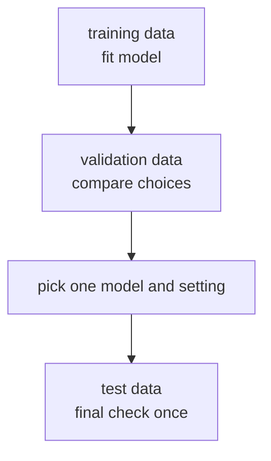
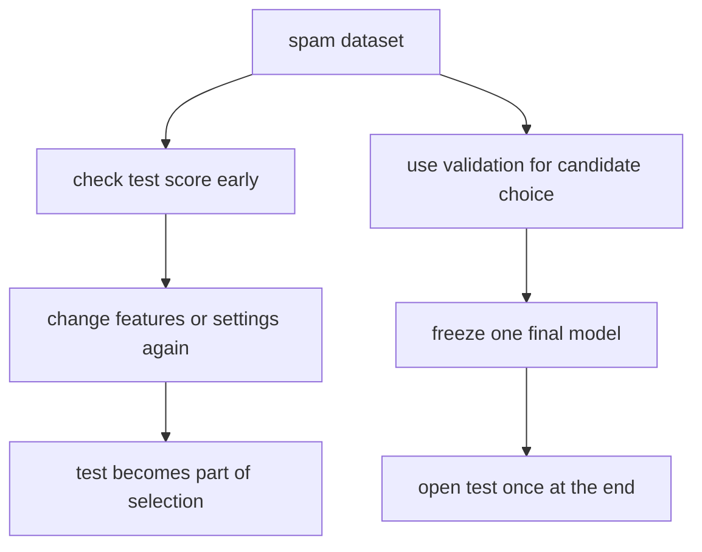
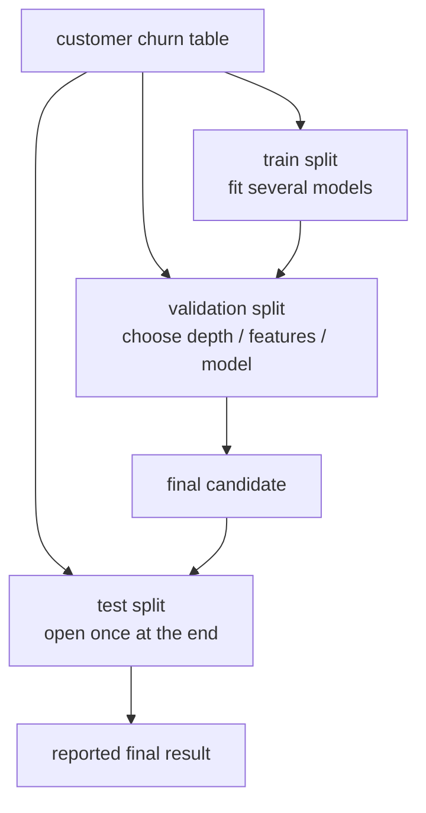

# P4-4.2 验证(validation)与测试(test)

> Section ID: `P4-4.2`
> Version: `v2026.07.09`

在 P4-4.1 里，我们看过为什么要把数据分成 training data 和 evaluation data。现在再往前走一步。`在选模型过程中使用的数据` 和 `最后只检查一次的数据`，它们承担的角色并不一样。

如果不把这个差别分开，人就会在选模型的过程中不断去看 test 结果，而一旦这样做，test data 就不再是 `第一次看到的数据`。因此在实务里，evaluation data 往往还会进一步分成 `validation data` 和 `test data`。

这一节会说明 `validation`、`test`，以及 `中途做模型选择的确认` 和 `最后一次确认` 之间的差别。后面的章节会带着这个抓手继续判断当前语境，而数据拆分之后的评估流程，会通过本节和 [概念词汇表](../../../reference/concept-glossary.md) 再次接回。

## 本节范围

这一节解释 validation 和 test 的角色差异。metric 的计算本身，这里不会详细展开。accuracy、precision、recall 等指标会在 P4-6 再处理。

同时，这一节会说明 `在选模型的过程中，到底该看什么` 这条流程，但完整的 model selection 程序和 baseline model 讨论会在 P4-8 再回来。overfitting 与 generalization 的概念，会在 P4-5 里更详细展开。

- 为什么 validation data 和 test data 要分开？
- 它们各自应该在什么时候使用？
- 为什么在中途不断看 test data 会有问题？
- 当数据很少时，应该怎样更谨慎地理解这个区分？
- cross-validation 会怎样接到这个结构里？

## 本节目标

- 能说明 validation 和 test 的角色差异。
- 能说明 validation data 是给选择使用的，而 test data 是给最后确认使用的。
- 能理解为什么反复看 test data 会扭曲结果解释。
- 能说明在小数据条件下，validation 和 test 的区分会变得更困难。
- 能理解 cross-validation 不是取代 test 的魔法，而是让既有数据中的 validation 更稳定的方法。

## 学习背景

### 先用一个场景来理解

想象一个学生正在通过模拟考试准备大学入学考试。

- 练习题：在学习过程中经常做
- 模拟考试：用来比较哪种解题策略更好
- 真正考试：最后只用一次来确认水平

机器学习里也有类似的流程。

| 数据 | 在做什么 | 什么时候看 |
| --- | --- | --- |
| training data | model 学习 pattern | 在学习过程中持续看 |
| validation data | 比较 model 与 setting | 在实验中途反复看 |
| test data | 确认最终结果 | 基本上在最后看 |

validation data 和 test data 最大的差别，在于 `它们被用于决策的频率`。

## 主要学习内容

### validation data 帮助做选择

validation data 是在选模型过程中使用的数据。例如，它会用于下面这些选择。

- logistic regression 和 decision tree 先试哪个
- tree depth 应该设成 3 还是 5
- 改 preprocessing 后结果有没有变好
- 加入某个 feature 后到底有没有帮助

也就是说，validation data 是在实验中途拿来比较 `这个选择是不是比前一个更好` 的。

用一个非常简单的例子来看，可以这样读。

| 候选 | 改了什么 | validation accuracy | 当前判断 |
| --- | --- | --- | --- |
| Model A | 使用 logistic regression | 0.78 | 作为基准点保留 |
| Model B | 使用 decision tree | 0.74 | 看起来低于 A，先搁置 |
| Model C | logistic regression + 增加 1 个 feature | 0.81 | 当前候选中最好 |

这张表里重要的不是数字本身，而是 `这些数字是为了做什么选择而被查看的`。现在还不是发布最终性能的阶段，而是比较候选、缩小范围的阶段。

如果换成工作场景，会更容易理解。假设你在做一个邮件垃圾分类服务。

- 候选 1：只使用词频
- 候选 2：词频 + 发件人特征
- 候选 3：候选 2 + 标题长度特征

在这三个候选之间决定哪个更好时，用的就是 validation data。因为现在还不是公布最终部署模型的阶段，而是 `先找到更好候选` 的阶段。



在这张图里，validation data 位于 model 最终固定之前。它会反复出现在 `改实验 -> 再看 -> 再改 -> 再看` 的循环里。

### test data 是最后确认用的

test data 更接近在选好 model 之后，做一次最终确认。

可以把流程想成下面这样。

1. 用 training data 训练多个 model。
2. 用 validation data 做比较，选出最合适的候选。
3. 再把这个选择固定下来。
4. 最后才用 test data 确认最终性能。

test data 的目的，是回答 `在经历完整个选择过程之后，这个 model 在第一次看到的数据上还能工作到什么程度？` 所以 test data 应该尽量晚看，也不应该反复查看。

如果把 validation score 和 test score 分开来看，会更清楚。

| 候选 | validation accuracy | test accuracy | 应该怎样理解 |
| --- | --- | --- | --- |
| Model A | 0.78 | 还没看 | 因为仍在 validation 阶段，所以 test 不打开 |
| Model C | 0.81 | 还没看 | 先按 validation 标准把它选出来 |
| 最终选择：Model C | 0.81 | 0.76 | 最后只确认一次 |

这里 `0.81` 和 `0.76` 的差距并不奇怪。因为 `0.81` 是通过 validation data 选候选时看到的，而 test data 则是在选完之后，用新数据再次做最终确认。

这也是读者很容易误会的地方。validation 分数更高，而 test 分数稍微低一点，并不代表立刻出错了。更合适的理解是：`选择用的数据` 和 `最终确认用的数据` 本来就承担不同角色。

validation data 和 test data 的区分，只要先问 `现在这个问题是为了选候选，还是为了做最终确认`，就会清楚很多。

| 现在在问什么 | 先看哪一类数据 | 原因 |
| --- | --- | --- |
| 这个 model 和那个 model 哪个更好？ | validation data | 因为还在选候选的阶段 |
| 多加一个 feature 有没有帮助？ | validation data | 因为这是实验中途的比较 |
| 现在这个最终 model 在新数据上到底能信到什么程度？ | test data | 因为这是最后确认的问题 |

## 细部学习内容

### 为什么不能一直看 test

如果在中途不断打开 test data，人就会在不知不觉中按照 test 结果去改选择。

| 实验顺序 | 表面上看似合理的行为 | 实际问题 |
| --- | --- | --- |
| 先看 Model A 的 test 结果 | 因为分数不满意，所以去试别的 model | test 结果已经开始影响选择 |
| 再看 Model B 的 test 结果 | 选择更高的那个分数 | test set 已经被当成比较候选的 validation data 来用 |
| 再改 setting，重新看 test | 一直重复到分数变好 | 会越来越容易去贴合 test data 本身 |

一旦发生这种事，test data 就不再是 `第一次看到、只用于最终确认的数据`。实际上，它已经被当成了 validation data 使用。

核心原则是下面这些。

- validation data 可以在实验中途看
- test data 尽量放到最后看
- 如果看了 test 之后继续改选择，test set 也会被污染成 validation 一样的角色

如果把它们并排比较，会更容易记住。

| 问题 | 可以问 validation data 吗？ | 可以问 test data 吗？ |
| --- | --- | --- |
| 这个 model 和那个 model 哪个更好？ | 可以 | 通常不这样做 |
| 改 preprocessing 后有没有变好？ | 可以 | 通常不这样做 |
| 最终 model 在新数据上到底能达到什么程度？ | 可以作为参考，但不是最终确认 | 可以 |

反过来，也要一起看一个 `不该这样走的流程`。

| 步骤 | 错误习惯 | 为什么有问题 |
| --- | --- | --- |
| 1 | 先看 test score | 最终确认用的数字变成了实验起点 |
| 2 | 因为分数低，就继续加 feature | 选择已经开始朝着 test 结果去改 |
| 3 | 再看 test score | test set 事实上已经像 validation data 那样被用掉了 |
| 4 | 采用分数最高的组合 | 对新数据性能的估计可能会被夸大 |

## 案例与示例

### 案例 1. 在垃圾邮件分类实验里过早打开 test 会怎样

假设某个邮件服务团队正在做垃圾邮件分类 model。到目前为止，人先是用 `广告词是不是很多`、`是不是某个特定发件域名`、`标题是不是过度刺激` 这样的规则做初步过滤。

现在团队想找一个比规则更好的 model。但如果实验过程中不断查看 test data，就会出问题。例如，Model A 的 test score 不够理想，于是加 feature，再看 test，再因为分数还是不满意继续改 setting。这样一来，test set 就等于被拿来做候选比较了。

把 validation data 和 test data 分开的原因，就在这里。validation data 是用来问 `哪个候选更好` 的地方；test data 则是用来问 `现在这个选出来的 model 能不能做最后确认` 的地方。只有把这两个角色分开，model selection 才不会被 test 结果牵着走。

真正可检查的结果，会出现在实验记录里。如果先根据候选各自的 validation 分数做出最终选择，然后只在最后看一次 test 分数，你就能分清：哪些数字是为了做选择，哪些数字是为了做最终确认。反过来，如果 test 分数被反复记录、并用来改选择，那么那份 test 结果就不再适合作为最终确认依据。



### 再用一个小表把角色分开

如果把客户流失预测的例子重写一下，可以拆成下面这样。

| 客户 ID | 最近购买次数 | 咨询次数 | 是否流失 | 用在哪里 |
| --- | --- | --- | --- | --- |
| C01 | 8 | 0 | 留存 | training data |
| C02 | 2 | 3 | 流失 | training data |
| C03 | 6 | 1 | 留存 | training data |
| C04 | 3 | 2 | 流失 | validation data |
| C05 | 7 | 0 | 留存 | validation data |
| C06 | 1 | 4 | 流失 | test data |
| C07 | 9 | 0 | 留存 | test data |

在这个例子里，C04 和 C05 在实验中途可能会被看很多次。比如比较 Model A 和 Model B 时，都要看它们在 C04、C05 上表现如何。但 C06 和 C07 应该尽量只在最后打开一次。

如果把它改写成问题，会更清楚。

- `树深应该设成 3 还是 5？` -> 问给 validation data 的问题
- `这个 model 现在可以对外宣布了吗？` -> 问给 test data 的问题

问题一旦不同，所用数据承担的角色也会跟着改变。

即使面对同一张客户流失表，只要问题变了，数据的角色就会变。下面这张图展示的，就是为什么 `挑候选的阶段` 和 `最后确认的阶段` 不应该共享同一块数据。



## 练习与示例

### 用 Python 看拆分结构

下面这段代码展示的是：怎样把数据最简单地拆成 `training`、`validation`、`test` 三部分。

问题场景：

- `validation 和 test 要分开` 这句话，在代码里具体呈现成怎样的两步拆分，往往一开始不容易马上形成感觉

输入：

- 样本列表 `X`
- label 列表 `y`

期望输出：

- training、validation、test 的样本数
- validation 与 test 的 label 构成

要确认的概念：

- 三块拆分通常不是一次性完成，而是先把 `train` 和临时评估数据拆开，再把后者二次拆分
- validation 和 test 的角色不同，所以也要分别检查

```python
from sklearn.model_selection import train_test_split

X = [[i] for i in range(12)]
y = ["stay", "churn", "stay", "stay", "churn", "stay", "stay", "churn", "stay", "stay", "churn", "stay"]

X_train, X_temp, y_train, y_temp = train_test_split(
    X,
    y,
    test_size=0.4,
    random_state=42,
)

X_val, X_test, y_val, y_test = train_test_split(
    X_temp,
    y_temp,
    test_size=0.5,
    random_state=42,
)

print("train size:", len(X_train))
print("validation size:", len(X_val))
print("test size:", len(X_test))
print("validation labels:", y_val)
print("test labels:", y_test)
```

一个示例输出可以这样读。

```text
train size: 7
validation size: 2
test size: 3
validation labels: ['stay', 'churn']
test labels: ['stay', 'stay', 'churn']
```

这段代码并不是直接一次切成三块，而是先拆成 `training` 和 `临时评估数据`，然后再把这部分临时评估数据拆成 `validation` 和 `test`。这种两步拆分往往反而更容易读。

### 用 Python 把 `选择` 和 `最终确认` 分开看

这次再用一个很小的实验记录，通过代码输出去读 validation score 和 test score 应该以什么顺序来看。即使不真正训练 model，也能看出结构。

问题场景：

- validation score 和 test score 都看起来像性能数字，但它们的阅读顺序和角色不同

输入：

- 各候选 model 的 `validation_score`
- 最终 `test_score`

输出：

- 每个候选的 validation 分数
- 按 validation 选出的结果
- 最后的 test 分数

要确认的概念：

- model selection 会先根据 validation score 完成
- test score 应该被读成选完之后才查看的一次性数字

```python
candidates = [
    {"name": "model_A", "validation_score": 0.78},
    {"name": "model_B", "validation_score": 0.74},
    {"name": "model_C", "validation_score": 0.81},
]

best = max(candidates, key=lambda item: item["validation_score"])

print("candidate scores on validation:")
for item in candidates:
    print(item["name"], "->", item["validation_score"])

print("chosen by validation:", best["name"])

test_score = 0.76
print("final test score:", test_score)
```

一个示例输出可以这样读。

```text
candidate scores on validation:
model_A -> 0.78
model_B -> 0.74
model_C -> 0.81
chosen by validation: model_C
final test score: 0.76
```

这里最重要的是顺序。

1. 先用 validation score 比较候选。
2. 然后选出一个。
3. 最后才看 test score。

这里真正要抓住的是顺序。`validation 用来做选择，test 用来在选完之后确认` 这层结构，在 Python 输出里也会直接出现。

### 再用 Python 看一条错误流程

下面这个例子是为了展示问题所在。它不是好的实验流程，而是一个用来说明 `为什么不能过早反复看 test` 的例子。

问题场景：

- 如果太早打开 test score，这个数字就会开始污染 model selection

输入：

- 被过早查看的候选 test 分数

输出：

- 因为看了 test 分数而改变了选择的记录

要确认的概念：

- 一旦 test data 被当成比较候选的 validation data 使用，它的意义就开始变弱
- 这个例子不是好流程，而是应该避免的流程

```python
test_scores_seen_too_early = {
    "model_A": 0.74,
    "model_B": 0.77,
}

print("looked at test too early:")
for name, score in test_scores_seen_too_early.items():
    print(name, "->", score)

print("decision changed after seeing test scores")
print("problem: test data has started to influence model choice")
```

一个示例输出可以这样读。

```text
looked at test too early:
model_A -> 0.74
model_B -> 0.77
decision changed after seeing test scores
problem: test data has started to influence model choice
```

这段代码展示的，与其说是计算，不如说是解释。`先看了 test score，然后又根据它去改选择` 的那一刻起，test data 就已经开始离开 `只用于最终确认` 的角色了。

### validation 和 test 到底该怎么读

在阅读实验结果时，比起先盯数字，更重要的是先区分角色。

| 数值 | 第一时间该问的问题 |
| --- | --- |
| validation score | 它是不是用来比较多个候选的数字？ |
| test score | 它是不是在最终选择之后才看的一次性数字？ |
| 异常好的 test score | 是不是中途反复打开过 test？ |
| validation 和 test 差距很大 | 是不是选择过程重复太多，或数据本身太小而不稳定？ |

这一节还不会细讲各种 metric。现在最重要的是：就算数字都写成 `0.82`，它到底是 validation score 还是 test score，意义也会不同。

因此，在阅读实验记录时，如果把句子补全成下面这样，`选择` 和 `最终确认` 的差别就会更明显。

- 这个数字是不是 `为了 model 选择而看的 validation score`？
- 这个数字是不是 `在最终选择后才看的 test score`？
- 看完这个数字之后，`是不是又改了 model`？

如果第三个问题的答案是 `是`，那么这个数字就很可能不再只是最终确认用的数字了。

### 数据少时要更加慎重

如果数据量不够大，就很难把 training、validation、test 都完整地分开。

| 问题 | 为什么会出现 |
| --- | --- |
| training data 太少 | 一旦分成三块，每一块都会变小 |
| validation score 波动很大 | validation data 太小时，偶然因素影响会更大 |
| test score 也会不稳定 | 用于最后确认的数据也可能太少 |

这时，人们就可能会用到 cross-validation。cross-validation 是在现有数据里反复做多次 validation，从而让比较更稳定的一种方法。但这并不意味着 test data 可以完全不要。真实项目里，validation 结构仍然必须根据数据规模和任务目标来调整。

例如，如果客户数据只有 30 条，很快就会出现下面这些问题。

| 拆分方式 | 可能产生的感觉 |
| --- | --- |
| train 20 / validation 5 / test 5 | validation 和 test 都太少，一两条样本就可能让分数大幅波动 |
| train 24 / evaluation 6 | 起初更简单，但很难再把 validation 和 test 彻底分开 |
| 使用 cross-validation | 会变成一种在小数据里让多次 validation 比较稍微更稳定的选择 |

这一节真正重要的，不是 `比例该是多少才正确`，而是：数据越小，validation 和 test 的解释就越要小心。

## 本节要记住的视角

- validation data 是用来比较 model 和 setting 的数据。
- test data 是在选定之后，用来做最后确认的数据。
- validation data 可以在实验中途反复查看。
- test data 看得越频繁，它作为最后确认数据的角色就越弱。
- 如果不断根据 test 结果来改选择，test set 也会被污染成 validation 一样的角色。
- 数据越小时，想同时保住稳定的 validation 与稳定的 test 就越困难。

这一节不是记名字的，而是用来固定 `比较` 和 `最后确认` 之间边界的一节。

| 这一节里先要固定的东西 | 紧接着要问的问题 | 后面会在哪里重新接回 |
| --- | --- | --- |
| `validation 用来比较，test 用来最后确认` 这一角色区分 | 为什么这种比较在新数据上还应该成立？ | generalization 在 P4-5，metric 在 P4-6，baseline 比较在 P4-8 |

## 简短检查

- 能不能说明为什么 validation data 是 `选用数据`，而 test data 是 `最终确认数据`？
- 能不能说明为什么中途反复看 test score，会让 test set 被污染成 validation 一样的角色？
- 能不能区分哪些问题应该问给 validation data，哪些问题应该留给 test data？

## 什么时候要先想到这个视角

- 当需要区分 `实验中途比较用的数据` 和 `最后确认才打开的数据` 时，就先想到 validation 和 test 的角色区分。
- 当要检查自己是不是在中途反复打开 test score 并据此改选择时，就回到这一节。
- 当需要再次说明为什么数据越小越难同时保住稳定的 validation 和 test，以及为什么会出现 cross-validation 时，这一节就是基准。

## 来源与参考资料

- scikit-learn developers, `Cross-validation: evaluating estimator performance`, scikit-learn User Guide, 确认日期：2026-06-26. [https://scikit-learn.org/stable/modules/cross_validation.html](https://scikit-learn.org/stable/modules/cross_validation.html){: target="_blank" rel="noopener noreferrer" }
- scikit-learn developers, `train_test_split`, scikit-learn API Reference, 确认日期：2026-06-26. [https://scikit-learn.org/stable/modules/generated/sklearn.model_selection.train_test_split.html](https://scikit-learn.org/stable/modules/generated/sklearn.model_selection.train_test_split.html){: target="_blank" rel="noopener noreferrer" }
- Gareth James, Daniela Witten, Trevor Hastie, Robert Tibshirani, Jonathan Taylor, `An Introduction to Statistical Learning`, Springer, 官方网站确认日期：2026-06-26. [https://www.statlearning.com/](https://www.statlearning.com/){: target="_blank" rel="noopener noreferrer" }
