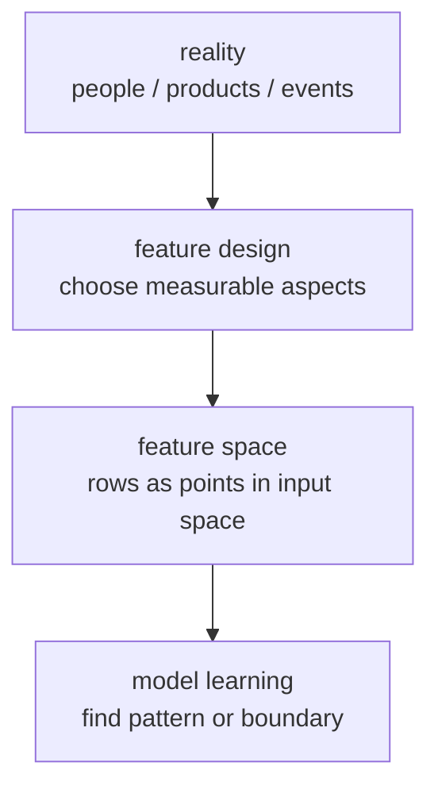
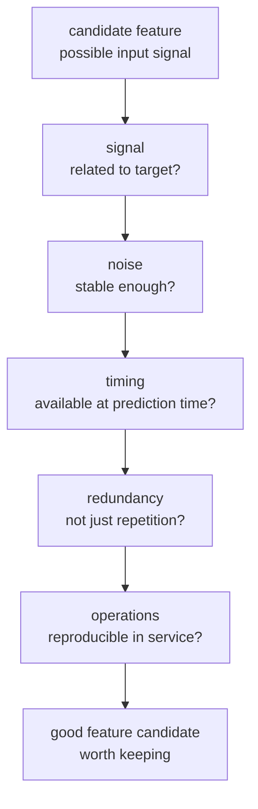
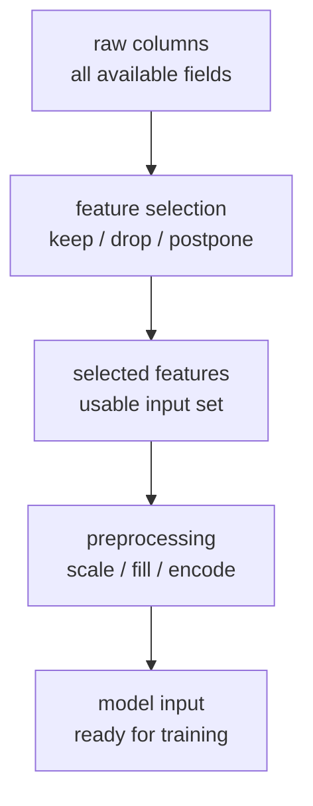
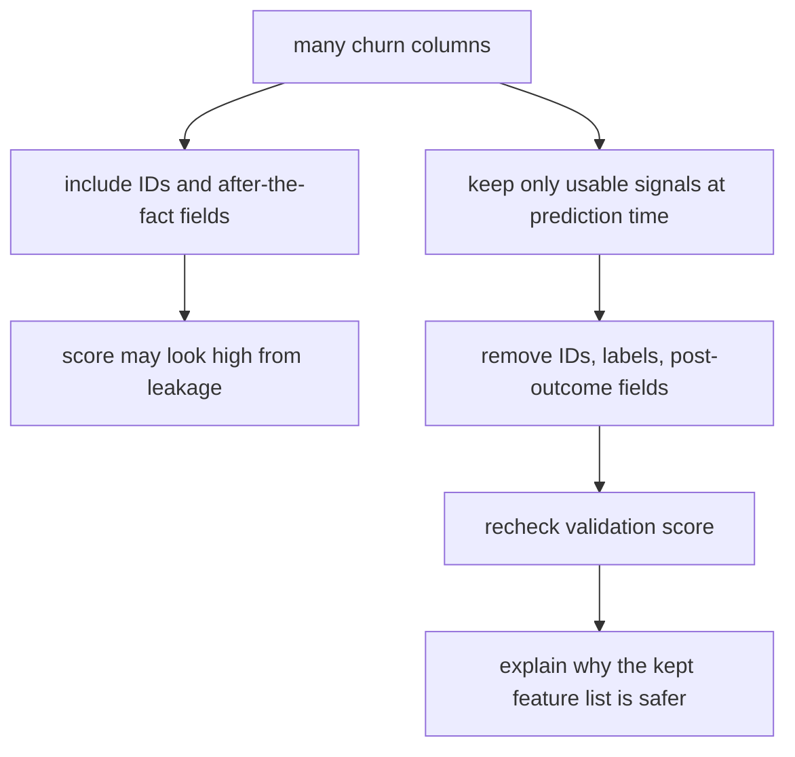

# P4-7.1 特征选择(feature selection)

> Section ID: `P4-7.1`
> Version: `v2026.07.10`

在 P4-6 里，我们看过 `该用什么标准来评价`。现在把问题再往前推一步。在更换评价指标之前，必须先检查：到底要给 model 什么输入。特征选择(feature selection)正是这个输入设计的起点。

这一节处理的是 `该怎样挑出好特征`。它的目的不是深讲复杂选择算法，而是先固定在实际工作里应该优先检查的判断标准。

这一节会说明 `特征选择(feature selection)` 和 `特征空间(feature space)` 的含义。下一节会沿着这个抓手继续当前语境，而 `到底用什么去填输入格子` 的基本标准，会通过这一节和 [概念词汇表](../../../reference/concept-glossary.md) 再次接回。

## 本节范围

这一节回答下面这些问题。

- 什么是特征(feature)，为什么输入设计很重要？
- 为什么不能因为可用数据多，就把它们全部塞进去？
- 读者最先该检查的特征选择标准是什么？
- 特征选择和预处理(preprocessing)有什么不同？

这一节不会深入处理下面这些内容。

- 基于统计检验的特征选择算法公式
- 递归特征消除(recursive feature elimination)的细致步骤
- 降维(dimensionality reduction)算法的内部计算

按输入问题来分预处理类型的感觉，会在补充学习 P4-7.3 再次抓住；基于统计检验的选择和递归特征消除的比较视角，会在补充学习 P4-7.4 再整理一次。降维的大图景和内部计算，则会在 P4-18.1、P4-18.2 再接回来。

## 本节目标

- 能把特征(feature)解释成 `现实信息被变成 model 输入后的形式`。
- 能说明特征选择不只和性能数字有关，也会连到 leakage、成本、稳定性和可解释性。
- 能使用基本问题去区分哪些特征该先丢掉，哪些特征该先留下。
- 能说明：如果 preprocessing 是 `把选出来的特征再加工`，那么 feature selection 就是 `决定一开始到底要采用哪些特征`。

## 学习背景

### 什么是特征

在 machine learning 里，特征(feature)就是把现实对象改造成 model 能读的输入格子。

例如，客户流失(churn)预测问题可以像下面这样来读。

| 现实信息 | 转成特征后的例子 |
| --- | --- |
| 最近一个月访问次数 | `visits_30d` |
| 最近一个月支付金额 | `spend_30d` |
| 最近一周咨询次数 | `support_tickets_7d` |
| 会员等级 | `membership_tier` |

特征并不是把现实世界里的事实原样复制进来，而是 `为了更好地解决问题而切出来的输入表达`。

所以，即使是同一份数据，只要把哪些格子当成特征来用，model 就会完全不同。

不过，这个判断要稳定下来，前提是先固定 `一条样本到底是什么`。因为如果一行到底代表一个客户、一次动作，还是多个时点汇总后的摘要行都不稳定，那么特征的含义也会一起摇晃。

如果稍微从理论一点的角度说，特征就是 `输入变量(input variable)` 的单位。model 通常不会一下子理解一个巨大的答案，而是会把多个输入变量放在一起看，并从它们的组合里找出重复出现的模式。每个输入变量就是一个特征。

例如，在房价预测问题里，`面积`、`房间数`、`到地铁站的距离` 可以成为特征。在 spam 分类问题里，`某个词是否出现`、`是否有附件`、`发件域名模式` 可以成为特征。也就是说，特征会随着问题改变，同样的现实也会因为提问不同而被表达成不同的特征集合。

## 主要学习内容

### 为什么特征选择要先重要

特征选择并不只是减少格子数量，它是在决定 `什么信息会被允许参加 model 判断`。

scikit-learn 文档说明，feature selection 模块可以用于减少不必要或噪音很大的特征，以此改善性能和计算效率。尤其是在维度很高的数据里，这个判断会变得更重要。

核心理由有下面四点。

1. 如果无关输入太多，model 可能会学到噪音。
2. 输入太多会提高训练和推理成本。
3. 难以解释的输入越多，结果解释就可能越困难。
4. 如果把未来预测时点拿不到的输入塞进去，就会出现数据泄漏(leakage)。

特征选择就是 `留下好信号，减少危险信号和不必要信号`。

如果再用理论语言说，特征选择会同时调整下面四件事。

| 视角 | 特征选择改变的东西 |
| --- | --- |
| 表达视角 | model 所看到的输入空间形状 |
| 学习视角 | model 必须学习的模式难度 |
| 统计视角 | signal 与 noise 的比例 |
| 运营视角 | 在实际 service 里能不能把这个输入再复现出来 |

按这张表来读，特征选择更接近的不是单纯整理数据，而是 `重新定义学习问题`。

### 特征空间(feature space)与表达(representation)

逐个看特征固然重要，但 machine learning 往往不是只靠一个特征来判断。它通常会看多个特征一起形成的输入空间。这一节把这个东西叫作 `特征空间(feature space)`。

例如，假设只有两个特征。

- `visits_30d`
- `support_tickets_30d`

那么一个客户就可以被表示成一个点，`(访问次数, 咨询次数)`。如果有几千个客户，这些点就会聚成一个空间。model 会在这个空间里学习 `流失点的倾向`、`相似点的聚集`、`边界的形状`。

所以，特征选择不只是减少列数，它也是在 `设计 model 将会看到的输入空间本身`。



这张图说明：特征选择并不只是挑列，而是在决定到底把现实翻译成什么样的输入空间。即使面对同样的现实，只要抽出的特征不同，model 学到的模式和边界就可能完全改变。

这张图的核心是，比起特征多不多，更重要的是 `你是用什么视角把现实切成输入空间`。

同样的事实，只要换一种表达方式，model 就可能更容易学，也可能更难学。

例如，假设在表达客户活动。

| 同样的现实 | 表达 1 | 表达 2 |
| --- | --- | --- |
| 最近活动 | 最近 30 天总访问数 | 最近 7 天、30 天、90 天访问数 |
| 购买规模 | 最近 1 次购买金额 | 最近 30 天平均购买金额 |
| 咨询行为 | 总咨询数 | 退款咨询数、配送咨询数 |

这张表的核心是：特征选择不仅和 `挑原始列` 有关，也和 `到底用什么表达单位来构造输入` 有关。

如果处理的是原始日志，这个差别会更明显。即使看到的是按时间顺序堆起来的值，model 输入也往往不会把整段原始行全部直接放进去，而是会先按动作单位重新生成一些摘要特征候选。

这里的顺序也一样是 `原始时序 -> 每次动作一条摘要行 -> 特征选择`。特征选择是在这个顺序完成后，再决定 `摘要行里哪些输入格子要留下` 的阶段。

| 原始日志里看到的值 | 转成特征候选后的例子 | 为什么需要这种表达 |
| --- | --- | --- |
| 随时间变化的 `signal_a` | `signal_a_mean` | 为了把整体水平概括成一个格子 |
| 前半段和后半段的值差 | `signal_a_drop` | 为了暴露变化方向和大小 |
| 分段波动 | `signal_a_std` | 为了同时看稳定性和变动性 |
| 每段反复出现的形状 | `pattern_code` | 为了把类似模式简短地做比较 |

这里重要的不是记名字，而是有没有把 `原始值本身` 转成 `更直接接到问题上的阅读单位`。也就是说，特征选择不只是删列，它也是把表达重新设计成 `原始时序 -> 每次动作一条摘要行 -> model 输入格子` 的工作。

反过来读，这也意味着：如果一张表里 `一行到底代表什么` 还没说明白，那就不该太早开始特征选择讨论。

这个场景更直接地看，可以像下面这样读。

| action_id | duration_steps | control_mean | sensor_a_peak | sensor_b_mean | sensor_a_slope |
| --- | ---: | ---: | ---: | ---: | ---: |
| A-101 | 5 | 0.44 | 28.4 | 1.18 | 0.63 |
| A-102 | 5 | 0.46 | 28.0 | 1.22 | 0.51 |
| A-103 | 5 | 0.43 | 29.1 | 1.34 | 0.72 |

这张表是把多行原始时序重新表达成 `每次动作一行` 的摘要表。这里像 `control_mean`、`sensor_a_peak`、`sensor_a_slope` 这样的列，不只是计算结果，它们已经是对 `什么应该留下作为 model 输入格子` 的选择结果。也就是说，特征选择在 `要丢哪些列` 这个问题之前，就已经连到 `用什么表达保留什么` 这个问题上了。

再往前一步，有些特征并不会停在描述单次动作，它们还会继续接到把最近状态和基准线做对比的输入上。

| metric | recent_5_avg | baseline_20_avg | delta | interpretation |
| --- | ---: | ---: | ---: | --- |
| duration_steps | 5.4 | 5.0 | 0.4 | recent longer |
| control_mean | 0.48 | 0.44 | 0.04 | recent slightly higher |
| sensor_a_peak | 29.6 | 28.2 | 1.4 | recent peak increased |
| sensor_b_mean | 1.42 | 1.16 | 0.26 | recent average increased |

在这张比较表里，重要的不是 `delta` 数字本身，而是前面做出来的特征现在又被拿去做 `最近区间` 和 `基准线` 的比较框架。所以，特征选择不只是学习输入设计，它也会同时变成给人阅读的比较报告设计。

不过，这张比较表首先展示的只是变化信号，它并不会自动把差异原因直接定死。

如果用一段短代码来看，这条线会更清楚。

问题场景：

- 想把多行原始日志变成动作单位特征，然后再把这些特征拿去做最近区间和基准线比较输入

输入(input)：

- 包含 `action_id`、`time_step`、`control_level`、`sensor_a`、`sensor_b` 的小型原始日志表

期望输出(output)：

- 动作单位摘要表
- 最近平均、基准线平均、差值对比表

确认概念：

- 特征是把原始日志改造成单行输入的表达设计
- 同一个特征可以同时被复用在 model 输入和运营比较表里

```python
import pandas as pd

raw = pd.DataFrame(
    [
        ["A-101", 0, 0.20, 24.8, 0.3],
        ["A-101", 1, 0.35, 25.6, 0.8],
        ["A-101", 2, 0.55, 27.1, 1.5],
        ["A-102", 0, 0.18, 24.5, 0.2],
        ["A-102", 1, 0.32, 25.3, 0.7],
        ["A-102", 2, 0.60, 27.8, 1.6],
        ["A-103", 0, 0.22, 25.0, 0.4],
        ["A-103", 1, 0.36, 26.1, 0.9],
        ["A-103", 2, 0.54, 29.1, 1.8],
    ],
    columns=["action_id", "time_step", "control_level", "sensor_a", "sensor_b"],
)

summary = (
    raw.groupby("action_id")
    .agg(
        duration_steps=("time_step", "count"),
        control_mean=("control_level", "mean"),
        sensor_a_peak=("sensor_a", "max"),
        sensor_b_mean=("sensor_b", "mean"),
    )
    .reset_index()
)

recent = summary.tail(2).mean(numeric_only=True)
baseline = summary.head(len(summary) - 2).mean(numeric_only=True)

comparison = pd.DataFrame(
    {
        "recent": recent,
        "baseline": baseline,
        "delta": recent - baseline,
    }
)

print(summary)
print(comparison.round(2))
```

在这段代码里，首先该看的不是性能数字，而是表达方式的转换。

- 多行原始日志被转换成动作单位特征表。
- 这个特征表又被继续拿去做最近区间和基准线对比表。
- 也就是说，特征选择甚至在预处理之前，就已经在决定 `什么会变成可比较输入`。
- 摘要行让比较更容易，但它并不会完全替代原始时序里的全部语境。

所以，特征选择总会同时装着下面两个问题。

1. 要留下什么信息？
2. 要把这些信息做成什么形状的输入表达？

第二个问题会继续接到 preprocessing，但出发点仍然是特征设计。

### 好特征需要具备什么

人们常常误会 `好特征 = 数字特征`。但真正重要的不是数据类型，而是这个特征和问题到底形成了什么关系。

这一节把好特征看成 `既是 model 容易学习的信号，又是实际运营中还能再做出来的输入`。也就是说，它不能只是训练表里看起来很像样的列，而应该是 `在预测时点也能正当使用、意义不会乱晃、和其他特征放在一起时角色仍然清楚的输入`。

从理论上说，下面五个视角最重要。

#### 1. 有没有 signal

这个特征应该多少装着一些和目标(label)有关的模式。

例如，在客户流失问题里，最近访问次数就可能和流失有关。相反，一个完全任意的内部流水号，通常无法解释问题的原因或倾向。

好特征应该多少装着 `有助于预测目标的 signal`。

#### 2. noise 会不会太大

就算看起来有值，也不一定就是好特征。

- 测量本身是不是不准确？
- 是不是人工随手输入，所以波动很大？
- 它的意义会不会经常随场景改变？

这种特征里，noise 可能比 signal 还大。那 model 就更容易学到偶然波动，而不是稳定规则。

#### 3. 在预测时点到底能不能用

好特征不能只是在训练数据集里 `存在这个值`，还必须是在真实预测时点也 `拿得到这个值`。

- 它是不是只有结果出来后才会被记录？
- 它是不是人事后补上的判断值？
- 它是不是只有看完整个时间段之后才算得出来的摘要值？

例如，像 `contract_cancelled_at`、`refund_confirmed_at`、`next_30d_spend` 这样的值，在训练表里可能会看起来信号很强，但在真实预测时点通常还不知道。这样的特征即使信号很强，也不是 `好特征`，而是 `有泄漏风险的特征`。

所以，好特征不仅要 `帮助预测`，还要同时具备 `在预测时点能被正当地使用`。

#### 4. redundancy 会不会太大

如果塞入过多意思相近的特征，信息不一定更丰富，解释反而可能只是重复。

例如，如果下面这些列同时出现，就值得先怀疑一定程度的重复。

- `monthly_spend`
- `quarterly_spend`
- `yearly_spend`

当然，它们并不总是无用。但首先要检查的是：是不是在 `用不同单位重复表达近似相同的意思`。

#### 5. 在运营里能不能再做出来

好特征不能只是离线实验表里存在的值，它还必须能在真实 service 里按类似规则再生成出来。

- 收集延迟会不会太大？
- 会不会像人工记录备注那样，质量波动很大？
- 会不会因为隐私、成本、API 依赖，而在推理时点很难稳定拿到？

例如，客服后来留下的摘要备注，训练时可能看起来很有用，但在实时流失预测里可能来得太晚，或者格式不稳定。反过来，像 `visits_7d`、`failed_payments_30d` 这样的聚合特征，就更容易被稳定复现。

概括起来，好特征大体会朝下面这个条件靠拢。

`它要装着和问题相关的 signal，noise 不能过大，预测时点必须能用，和其他特征的重复要可管理，并且在运营里还能再做出来。`

这五个条件其实不是分家各玩的。比如一个特征看起来很强，只要在预测时点不能用，就直接出局；只要在运营里无法复现，它也不适合作为 service 输入。反过来，一个特征就算 signal 不是最强，只要能稳定重复收集、意义清楚，也可能成为很好的基础特征候选。

如果想更直观地抓住好特征，最好把它和 `看起来很强但实际上危险的特征` 放在一起对照。

| 表面上为什么看起来不错 | 实际上为什么可能很危险 | 更好的方向 |
| --- | --- | --- |
| 和 label 几乎完美同步变化 | 如果是结果之后的值，就可能是 leakage | 去找预测时点之前的行为信号 |
| 数字大、变化也大，很显眼 | 可能只是单位效果大，真实 signal 反而弱 | 先看和问题直接相连的意义 |
| 描述文字很多，看起来信息很丰富 | 人工输入、延迟、格式波动会让运营复现性很低 | 优先选可重复收集的结构化信号 |
| 按不同时间窗口做了很多类似聚合，看起来很丰富 | 重复可能很大，新增信息不多 | 缩成各自角色不同的特征组合 |

所以，好特征更接近的不是 `看起来很强的特征`，而是 `能被正当且稳定地再次使用的特征`。

还是用客户流失问题来读，可以像下面这样。

| 特征候选 | signal | noise | 时点正当性 | 重复 | 运营复现性 | 一次判断 |
| --- | --- | --- | --- | --- | --- | --- |
| `visits_30d` | 有 | 较低 | 是 | 一般 | 高 | 优先保留候选 |
| `customer_id` | 低 | 看起来低，但泛化弱 | 是 | 低 | 高 | 通常排除 |
| `contract_cancelled_at` | 看起来很强 | 低 | 否 | 一般 | 低 | 排除 |
| `agent_note_score` | 可能有 | 可能高 | 视情况而定 | 一般 | 可能低 | 保留观察 / 追加审查 |
| 同时使用 `monthly_spend` 与 `quarterly_spend` | 可能有 | 较低 | 是 | 高 | 高 | 检查重复 |

这里重要的不是找出 `信号最强的单个特征`，而是建立 `model 和运营都能一起撑住的特征组合`。例如，`contract_cancelled_at` 虽然看起来信号非常强，却会被剔除；`visits_30d` 即使不完美，也可能被保留。原因在于后者更正当，也更可重复。

把这些条件再捆成一个图，可以像下面这样。



这张图的意思是：不要把 `好特征` 看成一个神秘属性，而要把它拆成相关性、稳定性、时点正当性、重复管理、运营复现性这五个问题来读。

#### 选好特征时最后还会附着的问题

真正能长期留下来的好特征，通常还要过下面这些问题。

1. 如果这个特征没有了，model 会不会真的漏掉重要 signal？
2. 如果这个特征有，但到运营里根本复现不出来，那还有什么意义？
3. 这个特征是在重复别的特征已经说过的话，还是带来了新的视角？

把这些问题附上之后，feature selection 就会更接近 `可解释输入设计`，而不是 `拼命多收集列`。

### 为什么不能因为能拿到就全放进去

在实务里，数据库列越多，反而越危险的情况非常常见。

例如，假设一个贷款审批 model 拿到了下面这些列。

| 列 | 直接塞进去可能出现的问题 |
| --- | --- |
| `customer_id` | 它只是区分人，不一定能解释泛化模式 |
| `loan_approved_at` | 这是审批结果已经出来后才生成的值，预测时点不能用 |
| `default_next_90d` | 它本身就是 label，放进输入就是 leakage |
| `branch_note_text` | 在真实运营里，它可能来得晚，格式也很不稳定 |
| `monthly_income` | 它可能是和问题相关的 signal，所以可以作为候选保留 |

这张表的核心非常简单。

`特征选择不是比谁放得多，而是在挑预测时点可以正当使用的信息。`

### 读者最好先用的三个问题

开始做特征选择时，比起复杂算法，更重要的是问题顺序。

#### 1. 这条信息在预测时点真的能用吗

首先要检查的是时点。

- 它是不是结果出来之后才会存在？
- 它是不是人事后补上的判断？
- 它是不是看完整个测试数据后才生成的值？

scikit-learn 的 common pitfalls 文档说明：包括 feature selection 在内的 preprocessing 步骤，都应该只用训练数据；一旦把测试数据拉进来，性能就会被乐观地膨胀。

可以这样记。

`如果把预测那一刻还不知道的信息放进输入里，那就不是会预测的 model，而是提前偷看答案的 model。`

#### 2. 这条信息是不是和问题相关的 signal

第二个问题是相关性。

并不是所有列都一样重要。

- 它是不是直接接到问题上的行为记录？
- 它是不是只是在区分人或物体的编号？
- 它是不是几乎总是同一个值，所以信息量很小？
- 它是不是几乎在重复另一个列的意思？

scikit-learn 文档提供了减少 low variance 特征、通过 univariate statistics 打分的特征、以及通过 model importance 减少特征的方法。但在这一节里，比起算法，重点仍然是先理解 `为什么这些特征可以被减少`。

#### 3. 这条信息能不能在运营里稳定拿到

第三个问题是现场性。

有些特征在训练数据集里看起来确实存在，但到了真实 service 里却很难每次稳定获得。

- 收集延迟是否经常发生？
- 会不会因为需要人工输入而让质量大幅波动？
- 会不会因为隐私或成本问题而很难在运营里使用？
- 如果每次推理都要拉一次，会不会把 latency 拉高？

最终，feature selection 不只是数据科学问题，它也是 service 设计问题。

这个判断流程的核心不是算法，而是检查顺序。尤其重要的是：先问 `预测时点能不能用`。

### feature selection 和 preprocessing 到底哪里不同

读者很容易把这两件事混在一起想。但它们问的问题不同。

| 区分 | 先问的问题 | 例子 |
| --- | --- | --- |
| feature selection | 要采用哪些列？ | 去掉 ID，去掉事后信息，排除太弱的特征 |
| preprocessing | 被采用的列要改造成什么形式？ | 缺失值处理、scale 调整、类别编码 |

feature selection 是 `先把入口定下来`，而 preprocessing 是 `把选中的输入修整成 model 更容易读的样子`。

如果把这个差别简单画出来，就是下面这样。



### 什么先留，什么先删

在复杂算法之前，feature selection 也意味着先把 `为什么留下` 和 `为什么保留观察或删除` 说清楚。

| 输入候选的状态 | 先做的判断 | 原因 |
| --- | --- | --- |
| 在预测时点已经能拿到 | 优先检查 | 因为它是 service 输入的可复现候选 |
| 只有答案出来后才出现 | 删除 | 因为作为事后信息，leakage 风险高 |
| 像 ID 一样只区分个体 | 通常删除 | 因为它更接近个体识别，而不是泛化模式 |
| 装着和问题相关的行为信号 | 优先考虑保留 | 因为它可能装着和目标相连的模式 |
| 收集延迟或人工输入波动很大 | 保留观察或补强检查 | 因为在运营里难以稳定复现 |
| 几乎在重复别的特征意思 | 考虑压缩 | 因为重复可能比新增信息更大 |

这个表里的顺序很重要。比起先问 `看起来和问题有关吗`，更应该先问 `在预测时点能不能被正当地使用`。这样就会先检查输入的正当性，而不是先被性能数字带走。

## 细部学习内容

### 在学术语境里怎样整理它的含义

在入门书里，`variable` 和 `feature` 常常会被写得几乎像同一个词。但在学术语境里，人们有时会把它们稍微区分开。

Guyon 和 Elisseeff 的经典综述把 `raw input variables` 和 `constructed features` 分开。把这个差别翻成入门层次，可以像下面这样理解。

| 表达 | 面向读者的理解 |
| --- | --- |
| 变量(variable) | 原本给定的输入列或测量值 |
| 特征(feature) | 直接使用这个变量，或把它加工后拿来做 model 输入的表达 |

例如，可以这样读。

| 原始值 | 从学术上看 | 在 model 输入里的角色 |
| --- | --- | --- |
| `year_of_birth`, `current_year` | raw variable | 还没计算 |
| `age = current_year - year_of_birth` | constructed feature | model 会直接读的特征 |

特征并不只是列名，它指向的是整个 `被投进学习里的输入表达`。所以，feature selection 有时会被用作一个更宽的词：它同时包括 `原始变量里留哪些` 和 `加工特征里采用哪些`。

从学术上，feature selection 的目的也会被整理得更清楚。Guyon 和 Elisseeff 把它的目的说明成下面这样。

1. 提高 prediction performance
2. 建立更快、成本更低的 predictor
3. 帮助理解生成这些数据的过程

这三个目的在实务里也会直接延续下来。

| 学术目的 | 在实务里出现的样子 |
| --- | --- |
| 改善预测性能 | 减少噪音，让性能更稳定 |
| 降低计算成本 | 降低训练时间和推理时间 |
| 提高可理解性 | 更容易解释判断到底用了什么信息 |

还有一点非常重要，就是 `relevance` 和 `usefulness` 并不总是同一个意思。

| 表达 | 含义 |
| --- | --- |
| relevance | 这个特征和目标之间到底有什么连接 |
| usefulness | 这个特征在当前 model 和当前特征集合里，实际上有没有帮到忙 |

例如，如果两个列几乎装着同样的信息，那么它们都可能有 relevance。但在真正构造 predictor 时，也许只留一个就已经足够。剩下那个就会变成 `虽然相关，但额外 usefulness 较低` 的特征。

这个区分说明：feature selection 不是 `把最相关的列全部留下`，而是 `找出重复低、放在一起也真的有帮助的子集(subset)`。

## 案例与示例

### 案例 1. 在流失预测表里，列越多反而越危险

订阅服务团队正在做客户流失预测 model。人最先使用的标准，是 `最近登录次数`、`咨询频率`、`是否支付失败`、`套餐变更历史` 这样的信号。

但把数据库打开之后，会发现可用列远远更多。像 `customer_id`、`解约完成时间`、`客服事后留下的备注`、`下个月是否逾期` 这些都放进去时，表面上会显得信息更丰富。但这些列里，既有只是区分人的编号，也有只有结果发生后才会出现的值，还有在真实预测时点根本还不知道的信息。

在这个场景里，feature selection 不再是 `尽量多放`，而是 `只留下可以正当地使用的信号`。先看它在预测时点是否可用，再看它是否和问题相关，最后再看它能不能在运营里稳定采集。走完这一套，虽然表面上信息变少了，但实际上会得到一个更容易泛化的输入空间。

可检查的结果也很清楚。只要比较包含泄漏列和排除泄漏列时的验证分数，就可能看出：最开始那个很高的分数为什么其实是幻觉。再回头检查保留下来的特征列表，也能说明哪些列是真正的行为信号，哪些列其实是事后信息。



## 案例与示例

### 先用实务 heuristic 来找优先丢弃候选

在做复杂计算之前，下面这些特征就很值得先检查。

| 先检查的特征 | 为什么要小心 |
| --- | --- |
| ID、订单号、客户编号 | 它能区分个体，但可能离泛化模式很远 |
| 结果之后才出现的列 | 它会制造 leakage |
| 几乎总是一样的列 | 信息量可能太小 |
| 意义重复的列 | 解释变长了，但实际收益可能不大 |
| 在真实运营里收集不稳定的列 | 到 service 阶段可能难以复现 |

这个列表不是数学公式，而是读者第一次打开数据时就能立刻拿来用的检查表。

### 用一个小例子挑一挑特征候选

下面是一个假设客户流失预测问题的很小例子。

| 列 | 纳入判断 | 原因 |
| --- | --- | --- |
| `customer_id` | 排除 | 标识符 |
| `visits_30d` | 纳入 | 最近活动信号 |
| `support_tickets_30d` | 纳入 | 不满或流失征兆信号 |
| `contract_cancelled_at` | 排除 | 已经发生结果之后才有的值 |
| `promo_code_used_30d` | 保留观察 | 意义会随场景变化，需要追加检查 |
| `churn_next_month` | 排除 | label |

这个例子里，重要的不是 `纳入` 本身，而是能不能解释 `为什么纳入或为什么排除`。

## 练习与示例

### 用 Python 做一轮特征候选初筛

下面这个例子模仿的是实务里非常常见的第一次筛查。它会先抓出标识符、label 列、结果之后产生的列，以及常数列。

问题场景：

- 第一次把特征候选摊开时，往往不会立刻知道该把什么留下来作为输入、把什么排除掉

输入(input)：

- 客户行列表 `rows`

期望输出(output)：

- 每一列的纳入/排除判断
- 这个判断的原因

确认概念：

- feature selection 的第一步，是在 model 学习之前，先按危险信号去检查候选列
- 把标识符、label、结果之后的值先读成排除候选，会更安全

```python
rows = [
    {
        "customer_id": "C001",
        "visits_30d": 12,
        "support_tickets_30d": 0,
        "contract_cancelled_at": "",
        "membership_tier": "gold",
        "country": "KR",
        "churn_next_month": 0,
    },
    {
        "customer_id": "C002",
        "visits_30d": 3,
        "support_tickets_30d": 2,
        "contract_cancelled_at": "2026-05-14",
        "membership_tier": "gold",
        "country": "KR",
        "churn_next_month": 1,
    },
    {
        "customer_id": "C003",
        "visits_30d": 7,
        "support_tickets_30d": 1,
        "contract_cancelled_at": "",
        "membership_tier": "gold",
        "country": "KR",
        "churn_next_month": 0,
    },
]

target = "churn_next_month"
columns = list(rows[0].keys())

selected = []
rejected = []

for column in columns:
    values = [row[column] for row in rows]
    unique_count = len(set(values))

    if column == target:
        rejected.append((column, "label"))
    elif column.endswith("_id"):
        rejected.append((column, "identifier"))
    elif column.endswith("_at"):
        rejected.append((column, "post-outcome timestamp"))
    elif unique_count == 1:
        rejected.append((column, "constant value"))
    else:
        selected.append((column, "keep as candidate"))

print("selected candidates:")
for name, reason in selected:
    print("-", name, "->", reason)

print()
print("rejected candidates:")
for name, reason in rejected:
    print("-", name, "->", reason)
```

执行结果如下。

```text
selected candidates:
- visits_30d -> keep as candidate
- support_tickets_30d -> keep as candidate

rejected candidates:
- customer_id -> identifier
- contract_cancelled_at -> post-outcome timestamp
- membership_tier -> constant value
- country -> constant value
- churn_next_month -> label
```

这个输出并不意味着 `好特征已经被完全决定好了`。它只是让读者在第一次打开数据表时，知道该先怀疑什么。

## 细部学习内容补充

### 在 scikit-learn 里常看到的特征选择方式是什么

在实务里，下面这些方式会经常出现。

| 方式 | 非常短的说明 | 在这一节里的位置 |
| --- | --- | --- |
| low variance 去除 | 减少几乎不变的列 | 只介绍直觉 |
| univariate selection | 给每列打分，再选一部分 | 只介绍直觉 |
| model-based selection | 根据 model 给出的重要度来减少 | 只介绍直觉 |
| recursive feature elimination | 反复删掉重要度较低的列 | 只介绍名字 |

这一节的目标不是把这些算法背下来，而是先抓住：`能不能说明为什么这样选。` 算法只是下一步帮忙的工具。

## 本节要记住的观念

- 特征(feature)是把现实信息转成 model 输入后的表达。
- feature selection 与其说是 `多放一点`，不如说是 `挑出能被正当使用的输入`。
- 最先该检查的是 leakage、相关性和运营可用性。
- feature selection 是挑输入，preprocessing 是修整已经挑好的输入。

## 简短检查

- 你是不是先在检查，这一列在预测时点到底存在不存在？
- 就算看起来像有 signal，那些在运营里无法稳定收集的特征，你有没有另外标出来？
- 你能不能把 feature selection 和 preprocessing 分开解释成 `留下什么` 和 `怎样改造`？

## 什么时候应该先想起这个观念

- 当你需要先检查输入里有没有混进预测时点不存在的列或 label 之后的信息时，要先想起 feature selection 的视角。
- 当你需要重新说明为什么标识符、常数列和运营上不稳定的信号该先被筛掉时，就该回到这一节。
- 当你需要检查自己是不是把 feature selection 和 preprocessing 当成同一件事来讲时，这一节会成为标准。

- 预测时点不知道的列是否已经去掉？
- label 或 label 之后的信息有没有混进去？
- 标识符和常数列有没有先检查？
- 留下来的特征是否都能在真实 service 里稳定拿到？
- 有没有把 feature selection 和 preprocessing 混成一件事？

## 和下一节的连接

如果这一节决定了 `留下什么`，那么下一节 P4-7.2 preprocessing 就会继续看 `把留下来的特征改造成什么形状`。缺失值、scale、类别编码，都是那个下一阶段的问题。

## 出处与参考资料

- scikit-learn, `1.13. Feature selection`, scikit-learn User Guide, 确认日期: 2026-06-26. [https://scikit-learn.org/stable/modules/feature_selection.html](https://scikit-learn.org/stable/modules/feature_selection.html){: target="_blank" rel="noopener noreferrer" }
- scikit-learn, `12.2. Data leakage during pre-processing`, scikit-learn User Guide, 确认日期: 2026-06-26. [https://scikit-learn.org/stable/common_pitfalls.html](https://scikit-learn.org/stable/common_pitfalls.html){: target="_blank" rel="noopener noreferrer" }
