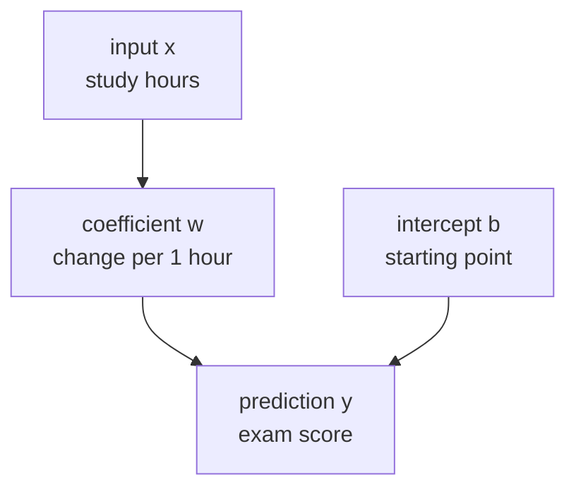
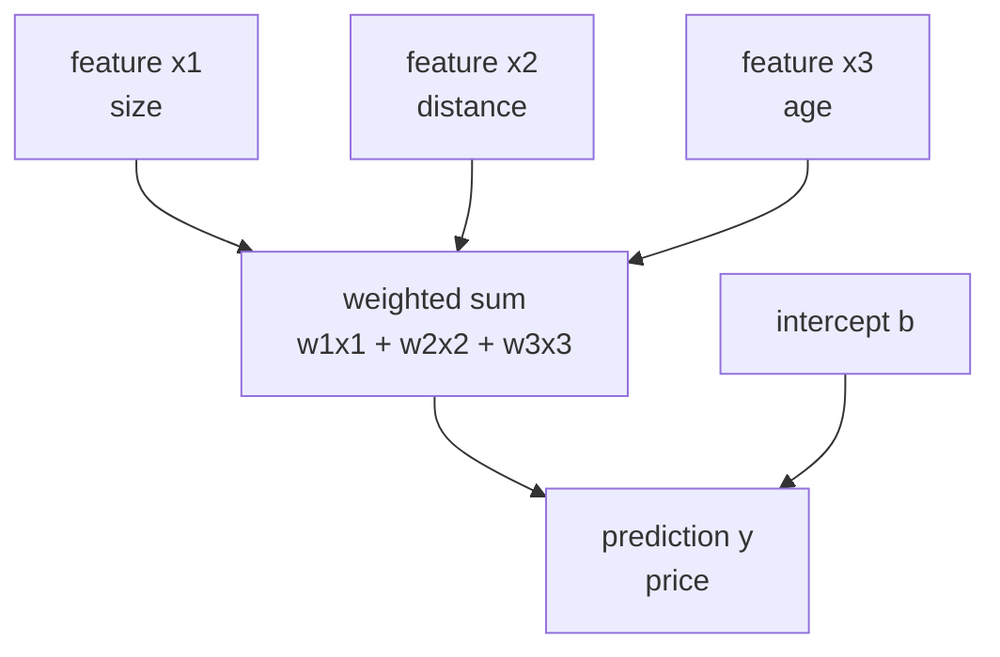
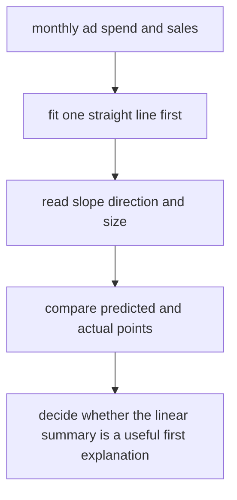

# P4-10.1 线性回归(linear regression)的直觉

> Section ID: `P4-10.1`
> Version: `v2026.07.10`

在 P4-9.2 里，我们通过 tuning 和 validation cost 看过 `那些看起来不错的设置到底该怎样比较`。现在轮到把这套比较流程接到一个真正的算法上了。

把 linear regression 放在 Part 4 的第一个算法位置，理由很明确。它既是 regression 问题最基本的出发点，也是一个能最透明地用 `斜率` 和 `截距` 展示输入与输出关系的 model。

这一节的中心问题如下。

如果输入变大，输出也会变大或变小，这种关系最简单可以怎样用一个 model 表达出来？

linear regression 是一个先用 `直线` 来回答这个问题的 model。

这一节说明 `regression`、`linear regression`、`coefficient`、`intercept` 的基本含义。后面的章节会以这些抓手继续当前语境下的判断，而把连续值预测读成一条直线的基本直觉，会以这一节和 [概念词汇表](../../../reference/concept-glossary.md) 为基准重新接回。

## 这一节的范围

这一节回答下面这些问题。

- regression 处理的是什么问题？
- 为什么 linear regression 会被说成是用 `直线` 表达关系？
- 应该怎样读取输入(feature)和输出(target)之间的方向与大小？
- 为什么 linear regression 要作为 Part 4 的第一个算法来学？

这一节不会深入讲下面这些内容。

- residual 的统计性质
- ordinary least squares 的严格推导
- multicollinearity、regularization、假设检验
- R²、MAE、RMSE 这类评估指标的详细比较

评估指标和 residual 解读会在下一节 P4-10.2 里直接接着讲。multicollinearity、假设检验、回归诊断的基础读取，会在 P4-10.3 补充学习里重新整理。regularization 以及相关 hyperparameter 的更宽视角，则会再通过 P4-9.1 和 P4-9.2 接回。

## 这一节的目标

- 你可以把 regression 解释成 `预测连续值的问题`。
- 你可以把 linear regression 说成是 `先用一条直线近似输入与输出关系的模型`。
- 你可以说明 linear 这个词意味着 `把整体输入读成固定的加权和`。
- 你可以解释 slope(coefficient) 与 intercept 的直觉。
- 你可以用入门水平说明 linear regression 想减少的是什么。
- 你可以理解为什么 linear regression 既是好的 baseline，也是好的出发点。

## 学习背景

Part 4 前半部分先整理了数据划分、baseline、tuning、评估标准。原因是：学习算法时，与其先背名字，不如先读懂 `想用什么形式解决什么问题`。

linear regression 在这套课程里承担下面这些角色。

| 课程位置 | linear regression 的角色 |
| --- | --- |
| 在 P4-4 的 regression 与 classification 之后 | 把 regression 问题接到真实模型上 |
| 在 P4-8 的 baseline 之后 | 提供第一个简单但可解释的比较模型 |
| 在 P4-11 之后分类模型之前 | 先准备连续值预测与概率分类之间的差异 |

也就是说，linear regression 之所以先出现，不是因为它是 `最简单的算法`，而是因为它是 `最容易解释输入与输出关系的算法`。

## 主要学习内容

### regression 处理的是什么问题

regression 不是像 classification 那样去猜一个类别(class)，而是去预测一个连续变化的数值。

例如：

| 业务场景 | 想预测的值 |
| --- | --- |
| 用房屋大小和位置预测房价 | 价格 |
| 用广告费和季节信息预测销售额 | 销售额 |
| 用移动距离和交通状况预测配送时间 | 时间 |
| 用学习时间和作业分数预测最终成绩 | 分数 |

这些问题的共同点在于：输出不是 `是/否`，而是一个数字。

`regression 是根据输入去估计一个连续值的问题。`

### 为什么 linear regression 要用直线表达关系

scikit-learn 的 linear model 文档把 linear regression 说明为：学习观测值与 linear combination 之间关系的一类 model。这一节把它改写成一个更容易的问题来读。

`如果输入增加一点，输出平均会增加多少？`

最简单地回答这个问题的式子，就是下面这种形式。

\[
y = wx + b
\]

- `x`: 输入(input)
- `y`: 预测值(prediction)
- `w`: 斜率(coefficient)
- `b`: 截距(intercept)

斜率 `w` 的意思是 `x 改变 1 时，y 会改变多少`。截距 `b` 是当输入为 0 时，model 放下的起点。

把这个结构像图一样来读，就是下面这样。



这张图把单变量 linear regression 展示成 `一个输入经过斜率和截距，连接到预测值的结构`。这里首先要抓住的是：linear regression 不是背下数据的 model，而是把输入变化如何推高或拉低输出变化，用数字读出来的 model。

关键点在于，linear regression 不是 `主张现实世界本来就是一条完美直线的模型`，而是 `检查是否存在一种可以先用直线解释的关系的模型`。

不过，这里还需要更准确地指出一点。读者常常把 linear regression 只记成 `总是在二维图上画一条直线的模型`。这个记忆在单变量例子里是对的，但拿来解释算法本身就太窄了。

### linear 这个词到底是什么意思

linear regression 里的 `linear`，虽然通常先通过 `直线` 这幅图来介绍，但在理论上更接近 `把输入读成带权重的和`。

当输入只有一个时：

\[
y = wx + b
\]

而当输入有多个时，它会扩展成下面这样。

\[
y = w_1x_1 + w_2x_2 + \cdots + w_nx_n + b
\]

也就是说，linear regression 会给每个输入 feature 放一个 coefficient，再把它们的贡献加总起来，形成最终预测。

`linear regression 是一个给多个输入分别分配影响数值，再把这些影响加起来形成一个预测值的模型。`

把这一点简单画出来，就是下面这样。



这张图说明：即使输入变多了，linear regression 的核心结构也没有变。就算每个特征都有自己的意义，model 最终还是把它们收进一个加权和，再生成一个预测值。这就是 `linear` 最核心的感觉。

所以，单变量例子里它会被读成 `直线`，而在两个以上变量里，它会被读成 `平面` 或更高维的 `线性关系`。读者不需要在这里把所有数学上的维度概念都理解完，只要抓住 `就算输入增加，结构依然是加权和` 这一点就够了。

### 为什么直线这种假设有用

现实数据大多不会整齐地落在一条完美直线上。即便如此，linear regression 依然重要，原因有三点。

1. 可以先尝试最简单的解释。
2. 斜率和截距相对容易解释。
3. 它能成为判断是否真的需要更复杂模型的基准点。

例如，如果学习时间增加时考试成绩大体会上升，linear regression 就会先用一条直线概括 `多一小时平均会对应多少分变化`。

即使这条线并不完美，它也能立刻让读者回答下面这些问题。

- 关系的方向是正的还是负的？
- 变化幅度大还是小？
- 是否存在因为模型太简单而漏掉的模式？

也就是说，linear regression 与其说是一个把现实全部装进去的工具，不如说更像是开始读取现实的第一条坐标轴。

### linear regression 在学习什么

在算法章节里，只靠 `用直线来读` 这个直觉还不太够。还需要指出：model 实际在学习什么。

linear regression 会针对数据点生成预测值，并调整 coefficient 与 intercept，让预测值和真实值之间的差(error)在整体上尽量变小。

这时，对每个数据点都会出现：

- 真实值(actual)
- 预测值(prediction)
- 两者之间的差(residual 或 error)

linear regression 会把线调整到这样一个方向：让这些差在整体上不要太大。

scikit-learn 的 `LinearRegression` 默认使用的是对应 ordinary least squares 的解。这个流程可以直接读成下面这句话。

`一种试图在整个数据上找到留下最少整体预测误差的直线的方法`

这里当前真正重要的，不是严格证明或矩阵计算，而是：它不是 `凭眼睛画一条看起来不错的线`，而是 `按照减少误差的标准去选线`。

把这个流程最简单地画出来，就是下面这样。

```mermaid
flowchart TD
  A["data points"]
  B["make a trial line"]
  C["compare prediction and actual"]
  D["reduce overall error"]
  E["choose a better line"]

  A --> B --> C --> D --> E
```



这张图说明，linear regression 不是单纯画一条线，而是在减少误差的标准下，逐步找到更好的线。也就是说，比起看得见的线长什么样，算法真正的核心是 `它如何整体上减少预测与现实之间的差距`。

所以，linear regression 既是 `画直线的模型`，也是 `减少误差的模型`。所谓算法，这个词正是在第二个视角下会更清楚。

### 什么时候适合先把 linear regression 放进候选

linear regression 并不是因为它是 `最简单的回归模型` 才最先出现，而是因为它常常是最适合透明读取关系方向与大小的出发点。

| 当前问题状态 | 为什么先放 linear regression | 先确认什么 |
| --- | --- | --- |
| 目标是连续值预测 | 因为它作为 regression 问题的 baseline 很容易解释 | 输出是不是数值而不是类别 |
| 想先读取输入与输出的方向性 | 因为可以较容易用 coefficient 与 intercept 解释关系 | 单位和 preprocessing 会怎样影响解释 |
| 还不知道复杂模型是否真的必要 | 因为可以先确认简单模型是否已经能解释到一定程度 | 相比 baseline 误差是否有改善 |
| 可解释性很重要 | 因为容易把每个特征的贡献解释成加权和结构 | 有没有把相关误读成因果 |
| 需要回归实验里的第一个比较模型 | 因为它会给后面更复杂的模型提供起点 | 有没有非线性关系或遗漏特征 |

这张表的核心，不是把 linear regression 视为 `永远好的模型`，而是把它视为 `最先揭露问题结构的比较模型`。

## 细部学习内容

### 在解释里最常见的误解是什么

linear regression 比起在公式上，更容易在解释上出错。尤其下面三点最容易混淆。

### 1. 容易把斜率大误解成这个特征一定更重要

不能因为斜率数字大，就断定这个特征一定更重要。

因为斜率的大小会受到输入单位(scale)和测量方式的影响。

- 如果输入是 `时间`，那么 1 单位就是 1 小时。
- 如果输入是 `韩元`，那么 1 单位也许就是 1 韩元。
- 如果输入是 `公里`，那么 1 单位就是 1km。

因此，如果不同单位的特征只拿斜率数字直接比较，解释就可能摇晃。

`斜率特别适合用来读方向，而大小比较必须连同单位和 preprocessing 一起看。`

### 2. 容易把正斜率直接误解成原因(cause)

linear regression 首先展示的是 `一起移动的倾向`。这并不等于 causality。

例如，就算广告费和销售额一起增加，也不能只凭这个数字就断定广告费增加是销售额上升的唯一原因。

中间还可能有下面这些其他解释。

- 季节效应
- 促销时期
- 原有品牌认知度
- 未被测量的外部变量

也就是说，linear regression 的系数首先是展示 `关系方向与大小` 的解释工具，而不是自动证明原因的工具。

### 3. 容易把预测值读成真实值

linear regression 的输出不是直接复制现实世界的值，而是在当前数据和当前假设之上得到的估计值(estimate)。

例如，像 `学习时间 7 小时 -> 预测分数 76.4` 这样的输出，意思是：

- 不是说一定会得到 76.4 分
- 而是说按照当前学到的直线，预期会是那个附近的值

必须理解这个差别，才能为下一节里读取 residual 和 error 做准备。

### linear regression 隐含地放了什么假设

学习算法时，比起先看性能，更重要的是养成一个习惯：先看 `这个模型是怎样简化世界的`。linear regression 放下的是下面这些简化。

### 1. 关系大体是线性的

它认为当输入变化时，输出也会按大体一致的方向和比例变化。

例如，学习时间增加时分数会提高，但在现实里，到了某个区间以后增长幅度可能会变小。即便如此，linear regression 还是会先把整体概括成一条直线方向。

### 2. 各个输入的影响可以相加

当有多个特征时，linear regression 会先把它们看成 `各自贡献的和`，而不是复杂的相互作用。

例如，在房价问题里，如果大小、距离、房龄都会产生影响，linear regression 就会先把它们读成各个因素对价格贡献多少的总和。

### 3. 误差会作为未解释部分留下来

model 无法解释现实中的全部波动。linear regression 会把那些解释不了的差距留下来作为 error，并让这个 error 在整体上尽量变小。

这三点并没有把全部严格的统计假设都讲完，但它们构成了理解 linear regression 世界观的核心基准。

`linear regression 是一个把关系简化成固定方向之和，并把剩余差距当成误差处理的模型。`

### 为什么 linear regression 会成为好的第一个 baseline

linear regression 因为 explainability 和 simplicity，常常被当成 baseline model。

在看复杂模型之前先跑一遍 linear regression，可以确认下面这些事情。

- 只靠简单的直线关系，是否已经能解释到一定程度？
- feature 和 target 的方向性是否符合预期？
- 更复杂模型到底有多大必要？

也就是说，linear regression 不只是一个追求高性能的模型，也很适合作为一个基准模型，先试探 `这个问题能被读得多线性`。

另外，linear regression 也特别适合做解释训练。更复杂的模型虽然性能可能稍高一点，但往往很难立刻说明为什么会得到这样的预测。相反，linear regression 至少比较容易直接回答下面这些问题。

- 它把关系读成了什么方向？
- 哪个输入增加时，预测也会跟着增加？
- 这个问题是否粗糙到不能只靠一条直线来解释？

也就是说，linear regression 不只是性能的出发点，也是 `解释的出发点`。

这种比较也会继续连接到后面的算法章节。

- 在 P4-11 logistic regression 里，读者会把这条直线改读成概率分类边界。
- 在 P4-14 decision tree 里，读者会改用分支规则而不是直线来读取关系。
- 在 P4-15 random forest 里，读者会通过组合多棵树来处理非线性关系。

## 案例及示例

### 案例 1. `广告费增加，销售额也增加` 这句话最简单可以怎样表达

一个小型线上购物团队想先读取月度广告费和销售额之间的关系。人们最先看的标准，是 `广告费增加的月份，订单数会不会一起增加`、`即使没有活动的普通月份，也能不能看到类似走势` 这类问题。

这时，团队会先尝试最简单的 linear regression，而不是更复杂的 model。因为只要先用一条直线概括广告费增加时销售额平均会一起动多少，就能马上读出关系方向是正还是负，变化幅度大约有多大。即使现实不是完美直线，它仍然足以作为第一个基准点，用来观察 `增加一单位平均会带来什么变化`。

在这个场景里，linear regression 不是在断言 `现实就是直线`，而是在追问 `能不能先用直线来解释`。如果广告费和销售额的关系大体沿着同一个方向移动，那么 coefficient 和 intercept 就会成为展示这段关系最透明的第一种解释。

可确认的结果会出现在学到的直线和对 coefficient 的解释里。如果 coefficient 是正的，就可以读出“广告费增加”和“销售额增加”一起移动的倾向；如果再看预测值与真实值之间的差，就能马上确认：只用一条直线来解释，到底有多粗糙。



## 案例及示例

### 最简单地读一遍单变量 linear regression

可以想想学习时间和考试分数这个例子。

| study_hours | exam_score |
| --- | --- |
| 1 | 52 |
| 2 | 55 |
| 3 | 61 |
| 4 | 64 |
| 5 | 68 |
| 6 | 72 |

从这组数据里可以看到，分数不是以完全固定的幅度上升，但总体上时间越多，分数也越高。linear regression 在这个场景里会尝试找出下面这样一条直线。

`学习时间增加时，分数也会平均上升的一条直线`

这里重要的不是去找 `精确穿过所有点的线`，而是去找 `最稳妥解释整体方向的线`。正如前面看到的，linear regression 会按照减少预测与真实之间差距的标准来挑更好的线，并把这个结果继续用在新输入预测上。

如果把这个表达再稍微变理论一点，就会变成下面这样。

- 每个单独数据点都可能留下误差。
- 但从整个数据来看，有些线留下的误差更小，有些线更大。
- linear regression 会从中选出 `更能减少整体误差的那条线`。

也就是说，linear regression 不是一个去完美贴合每个点的模型，而是 `一个最经济地概括整体趋势的模型`。

### coefficient 和 intercept 应该怎么读

很多读者第一次学 linear regression 时，看到了公式，却漏掉了含义。这一节先抓解释，再抓计算。

### coefficient

coefficient 表示：当输入变化时，输出会朝什么方向、以多大幅度变化。

- coefficient > 0：输入越大，输出也越大的倾向
- coefficient < 0：输入越大，输出反而越小的倾向
- coefficient 绝对值大：输入变化时，输出变化得更敏感

例如，如果广告费每增加 1 单位，预期销售额平均增加 3 单位，那么 coefficient 就可以大致读成 `+3`。

不过，解释时必须把两件事一起看。

- `方向`：是在增加，还是在减少？
- `单位`：输入的 1 单位在现实里到底指什么？

例如，输入是 `学习时间 1 小时` 还是 `广告费 1 万韩元`，同样的数字 3，意义就完全不同。因此，coefficient 不应该只读成一个数字，而应该读成一句话：`当什么变化 1 单位时，什么会变化多少`。

### intercept

intercept 是当输入为 0 时，model 设下的起点。不过，intercept 并不总是有现实可解释性。

例如，学习时间为 0 时预测考试成绩，在语境上还能读出一些意思；但去解释房屋面积为 0 平方米时的房价，在现实里就未必有太大意义。

因此，intercept 应该这样读。

`它是 model 的数学起点，但能不能直接解释，要看具体领域。`

## 练习与示例

### 用 Python 看一个小型 linear regression

下面这个例子，是一个很小的 linear regression 实作：用学习时间(`study_hours`)来预测考试成绩(`exam_score`)。

- 问题场景：大致预测学习时间和分数的关系。
- 输入(input)：学习时间
- 正答(label)：真实考试成绩
- 要确认的概念：
  - linear regression 会学习一条直线。
  - `coef_` 是 coefficient，`intercept_` 是起点。
  - 对新输入也能生成连续值预测。

```python
import numpy as np
from sklearn.linear_model import LinearRegression

study_hours = np.array([1, 2, 3, 4, 5, 6]).reshape(-1, 1)
exam_score = np.array([52, 55, 61, 64, 68, 72])

model = LinearRegression()
model.fit(study_hours, exam_score)

pred_2 = model.predict([[2]])[0]
pred_7 = model.predict([[7]])[0]

print("sample count      :", len(study_hours))
print("coefficient       :", round(model.coef_[0], 3))
print("intercept         :", round(model.intercept_, 3))
print("prediction at x=2 :", round(pred_2, 3))
print("prediction at x=7 :", round(pred_7, 3))
```

执行结果示例如下。

```text
sample count      : 6
coefficient       : 4.114
intercept         : 47.6
prediction at x=2 : 55.829
prediction at x=7 : 76.4
```

这个结果可以这样来读。

- 大约 `4.114` 的 coefficient，意思是学习时间每增加 1 小时，分数平均大约增加 4 分。
- 大约 `47.6` 的 intercept，是 model 放下的数学起点。
- `x=7` 的预测值说明：即使是训练里没有出现过的新输入，model 也可以沿着学到的直线生成连续值。

这里当前重要的，不是 `到底精确对了几分`，而是 `有没有把关系的方向和大小读成一条直线`。

如果把这个解释写得更谨慎一点，就是下面这样。

- 在这个例子里，读到了 `学习时间增加时，分数也会上升` 的方向。
- 但这并不意味着所有区间都一定有完全相同的增长幅度。
- 预测值 76.4 的意思是 `当前直线模型会这样估计`，而不是说真实分数一定就是这个值。

也就是说，linear regression 的第一层解释不是 `精准的未来预言`，而是 `关系的简单摘要`。

### 用 Python 读多个 coefficient

单变量例子很适合抓住直线的感觉，但真实业务数据通常会有多个特征。下面这个例子，是一个小型多变量 linear regression 实作：用 `study_hours`、`attendance`、`assignment_score` 三个特征预测 `final_score`。

- 问题场景：一起观察学习时间、出勤、作业分数来预测最终成绩。
- 输入(input)：三个数值特征
- 正答(label)：最终成绩
- 要确认的概念：
  - linear regression 会给每个特征放一个 coefficient。
  - 可以从 coefficient 的符号读取方向。
  - coefficient 的大小必须连同单位谨慎解读。

```python
import numpy as np
from sklearn.linear_model import LinearRegression

X = np.array([
    [2, 80, 60],
    [3, 82, 65],
    [4, 85, 70],
    [5, 88, 72],
    [6, 90, 78],
    [7, 93, 83],
])

y = np.array([58, 63, 67, 71, 77, 82])

feature_names = ["study_hours", "attendance", "assignment_score"]

model = LinearRegression()
model.fit(X, y)

new_student = np.array([[5, 89, 75]])
pred_new = model.predict(new_student)[0]

print("sample count :", len(X))
for name, coef in zip(feature_names, model.coef_):
    print(f"{name:17}: {coef:.3f}")
print("intercept         :", round(model.intercept_, 3))
print("prediction new    :", round(pred_new, 3))
```

执行结果示例如下。

```text
sample count : 6
study_hours      : 2.174
attendance       : 0.609
assignment_score : 1.130
intercept         : -6.391
prediction new    : 73.12
```

这个结果可以这样读取。

- 因为 `study_hours` 的 coefficient 是正的，所以在其他条件相同时，可以读成：学习时间越多，预测成绩越高。
- `attendance` 和 `assignment_score` 也都是正的，所以在这个例子里，三个特征都以提高成绩的方向被反映进来。
- 但不能看到 `2.174` 和 `0.609` 就立刻断定 `学习时间的重要性超过出勤三倍以上`。因为两个特征的单位和分布可能不同。
- intercept 为负，并不意味着 `现实中的分数会是负数`。这一点同样应当被读成 model 的数学起点。

这个多变量例子把 linear regression 再次展示成下面这样。

`一个分别读取多个特征影响，再把这些影响相加，形成一个预测值的模型`

### 再改一个值试试看：提高一个输入时，什么保持不变，什么会变化

这次把同一个学生的 `attendance` 和 `assignment_score` 保持不变，只把 `study_hours` 从 `5` 提高到 `7`。

```python
import numpy as np
from sklearn.linear_model import LinearRegression

X = np.array([
    [2, 80, 60],
    [3, 82, 65],
    [4, 85, 70],
    [5, 88, 72],
    [6, 90, 78],
    [7, 93, 83],
])

y = np.array([58, 63, 67, 71, 77, 82])

model = LinearRegression()
model.fit(X, y)

student_base = np.array([[5, 89, 75]])
student_more_hours = np.array([[7, 89, 75]])

pred_base = model.predict(student_base)[0]
pred_more_hours = model.predict(student_more_hours)[0]

print("prediction at [5,89,75] :", round(pred_base, 3))
print("prediction at [7,89,75] :", round(pred_more_hours, 3))
print("difference              :", round(pred_more_hours - pred_base, 3))
```

执行结果示例如下。

```text
prediction at [5,89,75] : 73.12
prediction at [7,89,75] : 77.468
difference              : 4.348
```

### 什么保持不变，什么发生变化

- 保持不变的点：当其他特征被固定时，`study_hours` coefficient 的方向保持不变。学习时间增加时，预测分数也会上升。
- 发生变化的点：虽然只改了一个输入，但预测值上升了大约 `4.348` 分。也就是说，linear regression 会让读者通过 `输入变化量 x coefficient` 的感觉去读取变化。
- 先留下的判断：这个变化是当前 model 给出的估计变化，并不保证现实里一定会按同样幅度增加。必须把单位和数据范围一起看。

### 这个练习如何回收 Part 4 的目标

这个练习把 linear regression 回收成：它不是 `背一条直线的模型`，而是用来读取 `改一个输入时，预测会朝什么方向、以多大幅度移动` 的出发点。Part 4 里真正重要的，不是知道 coefficient 的名字，而是通过真的去改一个值，说明 `什么被固定了，什么发生了变化`。只有有了这种重复练习，后面 baseline 比较、residual 解读、是否追加特征的判断，才能继续用同一种语言展开。

| 共同记录语言 | 这次练习里应该立刻留下的内容 |
| --- | --- |
| 看见的结构 | 对同一个学生只改一个特征时，预测值会沿着 coefficient 的方向连续移动 |
| 解释边界 | 预测值差异并不直接意味着现实里的因果效果或已经确定的成果提升幅度 |
| 下一个问题 | 这种变化在训练范围之外是否还成立，如果再接上 residual 和 baseline 比较，它是否仍然有效 |

### 在这一节里读取数字的基本顺序

在算法章节里，读者一看到数字，很容易立刻跳到 `性能很好` 或 `预测对了`。在 linear regression 里，应该按下面这个顺序来读。

1. 先确认这是 regression 问题。
2. 确认输入和输出分别是什么。
3. 用 coefficient 的符号读取方向。
4. 用 coefficient 的单位读取变化大小。
5. 确认 intercept 是否处在可解释的语境里。
6. 记住预测值是 estimate，不是真实值。

关键在于，读取数字是有 `顺序` 的。linear regression 不应该直接相信计算结果，而应该按这种解释规则来读。

## 这一节要记住的视角

- regression 是预测连续值的问题。
- linear regression 是先用直线近似输入与输出关系的模型。
- coefficient 展示变化的方向和大小，intercept 展示 model 的起点。
- coefficient 数字必须连同单位一起读，正相关也不能立刻读成原因。
- linear regression 不是完美解释现实的模型，而是最简单地开始读取关系的第一个模型。
- 预测值不是真实值，而是当前 model 给出的 estimate。
- 在看更复杂模型之前，会先把 linear regression 当作 baseline 来用。

## 简短检查

- 你有没有先确认当前问题是连续值预测？
- 你能不能从 baseline 视角解释，为什么 linear regression 会被放成第一个可解释比较模型？
- 你是不是没有把 coefficient 数字立刻读成重要度或原因，而是同时看单位与语境？

## 什么时候要先想到这个视角

- 当你需要重新确认当前问题不是 classification，而是连续值预测时，就先想到 linear regression 的视角。
- 当你需要重新解释为什么 linear regression 会被放成第一个可解释 baseline 候选，以及 coefficient 的意义该读到哪里时，就回到这一节。
- 当你需要整理：为什么即使直线并不完美，它仍然是一个有用的起点时，这一节就是基准。

- 你是否区分了当前处理的是 regression，而不是 classification？
- 你是否理解了 linear regression 的输出不是类别，而是连续值？
- 你能不能把 coefficient 和 intercept 解释成意义，而不是只解释成公式？
- 你能不能说明为什么 linear regression 会成为好的第一个 baseline？
- 你能不能说明为什么直线即使不完美，依然有用？

## 与下一节的连接

这一节先把 linear regression 看成 `用直线读取关系的模型`。下一节 P4-10.2 会继续进入：这条直线实际上拟合得有多好，什么情况下会很容易偏掉，以及 residual 和 error 应该怎样读取。

也就是说，如果 P4-10.1 是看 `模型形状` 的一节，那么 P4-10.2 就是检查 `这个形状到底合不合适` 的一节。

## 出处与参考资料

- scikit-learn, `1.1. Linear Models`, scikit-learn User Guide，确认日期：2026-06-26。 [https://scikit-learn.org/stable/modules/linear_model.html](https://scikit-learn.org/stable/modules/linear_model.html){: target="_blank" rel="noopener noreferrer" }
- scikit-learn, `LinearRegression`, scikit-learn API Reference，确认日期：2026-06-26。 [https://scikit-learn.org/stable/modules/generated/sklearn.linear_model.LinearRegression.html](https://scikit-learn.org/stable/modules/generated/sklearn.linear_model.LinearRegression.html){: target="_blank" rel="noopener noreferrer" }
