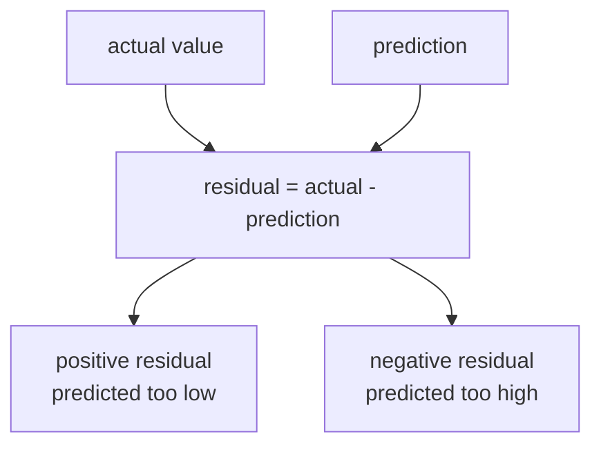
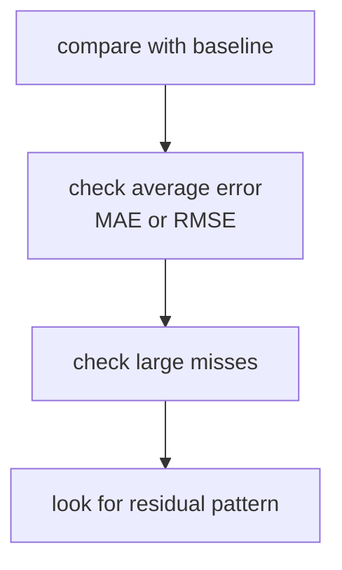
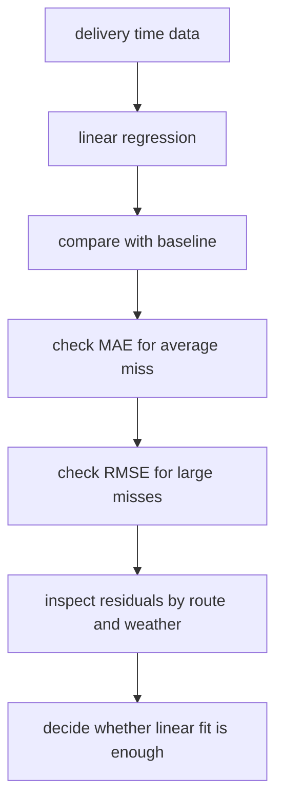

# P4-10.2 线性回归的评估与局限

> Section ID: `P4-10.2`
> Version: `v2026.07.10`

在 P4-10.1 里，我们把 linear regression 看成 `先用直线读取关系的模型`。现在要进入下一个问题。

那条直线实际上拟合得有多好，又会从哪里开始很容易失真？

这个问题正是 evaluation 和 limit 的出发点。

学习 linear regression 之后，人们常常停在 `斜率看起来挺像样`、`预测值好像差不多` 这种程度。但在算法章节里，必须再往前走一步。读者需要一起看：该怎样读取 prediction 与 reality 的差，用什么 metric 来概括它，以及直线假设会在什么时候变得勉强。

也就是说，这一节不会停在 `画出了一条直线`，而是会去读 `那条直线到底解释了数据多少`。

这一节不会再长篇重复 linear regression 的基本定义。`用直线读取关系的模型` 这个核心直觉，会通过 P4-10.1 和 [概念词汇表](../../../reference/concept-glossary.md) 重新接回；这里则只聚焦在评估与局限。

## 这一节的范围

这一节回答下面这些问题。

- residual 和 error 该怎样理解才更合适？
- 说 linear regression 的预测 `拟合得好`，到底是什么意思？
- MAE、MSE、RMSE、R² 在入门层面应该怎样区分？
- 当直线假设失效时，会出现什么局限？
- linear regression 的结果应该信到哪里，又该从哪里开始小心？

这一节不会深入讲下面这些内容。

- 统计显著性检验
- 对 residual 正态性与同方差性的严格检验
- multicollinearity 诊断
- regression regularization 与 feature engineering 的深化

回归诊断、显著性检验、multicollinearity 的基础读取，会在 P4-10.3 补充学习里重新整理。regularization 及相关 hyperparameter 的更宽视角，会再通过 P4-9.1 和 P4-9.2 接回。feature engineering 的大脉络，会再通过 P4-7.1、P4-7.2 以及 P4-18.1、P4-18.2 接回。

## 这一节的目标

- 你可以把 residual 解释成 `真实值和预测值之间的差`。
- 你可以说明 MAE、MSE、RMSE、R² 各自是在什么角度上看的 metric。
- 你可以区分：哪些 metric 对大误差更敏感，哪些没那么敏感。
- 你可以说明 linear regression 不太拟合的典型场景。
- 你可以理解：为什么不能只看一个好看的数字，就对 linear regression 过度信任。

## 学习背景

P4-10.1 把 linear regression 介绍成 `概括关系的第一个模型`。但既然已经立了 model，接下来就必须读 `它到底有多准`。

- 就算有一条线，prediction error 也仍然会留下。
- 既然 error 会留下来，就得决定怎样概括它的大小。
- 就算 metric 看起来不错，如果直线漏掉了结构性模式，也要重新怀疑这个 model。

因此，这一节在算法章节里承担下面的角色。

| 课程位置 | 这一节的角色 |
| --- | --- |
| 在 P4-10.1 之后 | 把直觉解释接到数值评估上 |
| 在 P4-6 评估指标之后 | 把 regression metric 重新放回真实模型语境里使用 |
| 在 P4-11 之后其他算法之前 | 提供区分 `预测对不对` 与 `模型是否解释得好` 的基准 |

也就是说，如果 P4-10.1 是看 `模型形状` 的一节，那么 P4-10.2 就是看 `模型留下来的差` 的一节。

在回归评估里，也要把下面四件事一起留下。

| 先确认什么 | 为什么要一起看 |
| --- | --- |
| baseline error | 因为要知道这条直线模型是否真的比简单平均预测更好 |
| 平均误差(MAE, RMSE) | 因为要知道整体上它离真实值有多远 |
| 出现大失败的区间 | 因为要另外看到藏在平均值后面的大误差 |
| 代表错误案例 | 因为要说明在什么输入条件下，它会用同一种方式反复失败 |

也就是说，好的回归评估，不是读完一个 metric 就结束，而是要一起确认 `是否比 baseline 更好`、`平均上错了多少`、`哪里错得很大`、`这种失败会在什么场景重复`。

如果这里再固定一点，分类章节里学到的比较结构就会原样延续到回归章节。回归里的 baseline，也可以是像简单平均预测那样的 `基准模型`，也可以是把最近 prediction error 和平常 error 分布并排放在一起的 `比较基准线`。也就是说，回归评估也不是只看绝对 error 数字，而是按这样一种结构推进：一起读取 `现在的 error 是不是比平常更大`、`是不是只在某个区间里反复出现`。这里也一样，大 error 先被读成变化信号，而对原因的解释则要等缺失特征或区间差异被重新检查之后再补上。

也就是说，在回归评估里，比较框架也必须绑成一体。如果 baseline error、当前 model error、最近区间的 error 分布开始在不同单位、不同区间里各自单读，就很难说清 `到底什么真的变好了`。

| 在回归评估前要一起留下什么 | 为什么需要 |
| --- | --- |
| baseline error | 因为要先看它是否真的比平均预测更好 |
| 大误差聚集的区间 | 因为要马上看到藏在平均值背后的失败区间 |
| error 解释边界句子 | 因为即使看到了大 error，也不能立刻固定原因 |
| 下一轮审查优先级 | 因为要决定接下来该补看哪个区间、该强化什么特征 |

## 主要学习内容

### residual 和 error 有什么不同

这两个词第一次看到时可能很像，但在这本书里会这样区分。

- residual：单个数据上的 `真实值 - 预测值`
- error：泛指 model 留下来的差

例如，如果真实分数是 72，而预测值是 68，那么 residual 就是 `72 - 68 = 4`。反过来，如果真实分数是 64，而预测值是 67，那么 residual 就是 `64 - 67 = -3`。

这里重要的是符号(sign)和大小(size)。

- 正 residual：model 预测得比真实值低
- 负 residual：model 预测得比真实值高
- 绝对值大：这个数据点上的 prediction 偏得更多

把这个差别简单画出来，就是下面这样。



这张图会让读者把 residual 读成一种 `带方向的差`，而不只是简单的失败标记。只有把 prediction 是比真实值低还是高一起看进去，后面才能怀疑：model 是否在某个区间里一直向同一边偏。

核心在于，residual 不是单纯的 `错了`，而是显示 `朝哪个方向错了多少`。

### 说 linear regression 预测得好，到底是什么意思

在 regression 里，不像 classification 那样能立刻分成 `答对/答错`。数字预测通常都会有一点偏差。所以在读 regression model 时，首先看的不是 `多常答对`，而是 `平均会偏离多少`。

假设现在有两个 model。

| 模型 | 误差特征 |
| --- | --- |
| 模型 A | 大多数时候偏 2 到 3 分左右 |
| 模型 B | 大多数时候差不多，但偶尔会一下偏 20 分 |

两者在平均上都可能看起来还行，但在真实使用里，B 可能会更危险。所以 regression evaluation 的核心就在于 `怎样概括 error`。

也就是说，在 regression 里，说 `拟合得好`，通常要重新拆成下面这些问题。

- 平均偏了多少？
- 大误差是不是经常出现？
- 是否真的比 baseline 更好？
- 直线有没有漏掉结构性模式？

### MAE、MSE、RMSE 应该怎样区分

scikit-learn 的 regression metric 文档提供了 mean absolute error、mean squared error、coefficient of determination(R²) 等指标。读者首先不是通过公式，而是通过 `它更重罚哪种失败` 来理解它们。

#### MAE(mean absolute error)

MAE 是 residual 的绝对值平均。

- 解释直观。
- 很容易读成平均会偏多少分、多少分钟、多少金额。
- 不会特别夸大大误差。

也就是说，MAE 是最平实地展示 `平均上错了多少` 的 metric。

#### MSE(mean squared error)

MSE 是把 residual 平方之后再取平均。

- 对大误差更敏感。
- 比起很多小误差，它会更重地看待少数大误差。
- 解释可能不那么直观，因为单位被平方了。

也就是说，MSE 在 `想更强地惩罚大失误` 时很有用。

#### RMSE(root mean squared error)

RMSE 是在 MSE 上再开平方。

- 它保留了对大误差敏感的优点。
- 同时又把单位拉回原本的单位，更容易解释。

也就是说，RMSE 经常在 `想敏感地看大误差，但又想用原始单位来解释` 时使用。

把这种差异很短地概括，就是下面这样。

| 指标 | 入门解释 |
| --- | --- |
| MAE | 平均错了多少 |
| MSE | 更强惩罚大误差的平均误差 |
| RMSE | 对大误差敏感，但单位仍按原始单位来读的误差 |

如果换成实务场景，这种差异会更清楚。

| 业务场景 | 更先看的指标 | 理由 |
| --- | --- | --- |
| 预测快递到达时间 | MAE | 因为想立刻读出平均会偏多少分钟 |
| 预测医院等候时间 | RMSE | 因为如果部分病人延迟特别大，希望更敏感地看到它 |
| 预测销售额 | MAE + RMSE | 因为想同时看平均偏差和大失败 |
| 预测设备故障时点 | RMSE | 因为少数大误差可能会直接变成运维风险 |

也就是说，选择指标不是数学口味问题，而是和 `什么样的失误更痛` 这个问题连在一起。

### R² 显示的是什么

R²(score, coefficient of determination) 是 linear regression 入门里经常出现的数字，但也很容易被误读。

`R² 是一个摘要值，用来显示这个 model 比简单平均预测多解释了多少数据。`

在入门层面，可以这样读。

- R² 接近 1：在当前数据里，这条直线解释了相当多的波动
- R² 接近 0：和用平均值预测相比，没有太大差别
- R² 甚至可能为负：可能比平均预测还差

这里重要的是，R² 很容易被读成 `越高越好` 的简单分数。但只靠 R²，读者没法知道下面是否藏着几个大误差。因此，它必须和 MAE、RMSE 这类 error metric 一起看。

在实证场景里，这种情况也经常出现。例如，在销售额预测里，大多数平日都预测得不错，但几次大型活动日会错得特别离谱。这种情况下，整体波动可能解释得不错，所以 R² 会很高；但运营者仍然可能因为那几次大失败而不敢信这个 model。

也就是说，R² 在 `整体解释力` 上很强，但它代替不了 `个别大失败的体感`。

### 指标应该怎样一起读

如果读 linear regression 时只看一个指标，解释就容易摇晃。例如会出现下面这些场景。

| 场景 | 解释风险 |
| --- | --- |
| R² 很高 | 可能藏着几个大误差 |
| MAE 很低 | 可能在某个区间里结构性地出错 |
| RMSE 很高 | 可能是在提醒存在一些大失败 |

回归评估在按下面这个顺序来读时，会更明确比较基准。

1. 是否比 baseline 更好？
2. 平均误差有多大？
3. 是否存在特别大的误差？
4. residual 是否往同一方向堆积？

把这个顺序简单画出来，就是下面这样。



这张图整理的是读取 regression metric 的顺序。好的 regression evaluation 不是看一个数字，而是依次确认：它是否比 baseline 更好、平均 error 有多大、是否藏着大失败。

核心是不要停在 `有一个数字看起来不错`。

在回归评估记录里，要把下面三句话一起留下。

- 变化被观察到了，但原因还没有被固定。
- 大误差区间是需要提高审查优先级的信号。
- 在小样本区间里的大误差，要更保守地解释。

这三句话最终都指向同一个意思。回归评估也一样，不是看 `一个 error 数字`，而是把 `同一个 baseline、同一个区间、同一种代表失败` 并排来看时，比较才更可解释。

### 应该先读哪个指标

回归指标不应该一股脑地列出来，而应该根据当前更警惕哪种失败，把读取顺序固定清楚。

| 当前关心点 | 先看的指标或基准 | 理由 |
| --- | --- | --- |
| 想知道平均偏离多少 | MAE | 因为容易用实际单位平实地读出来 |
| 想更敏感地看大失败 | RMSE 或 MSE | 因为它们会更重地反映大误差 |
| 想确认是否真的比平均预测更好 | baseline error + R² | 因为它们会一起显示相对简单基准的解释力与改善 |
| 怀疑它只在某个区间里错得特别大 | 代表错误案例 + 大误差区间 | 因为必须直接看到藏在平均值后的失败 |
| 想看最近性能是否在摇晃 | 最近 error vs. 平常基准线 | 因为需要用比较框架看 error 分布有没有变化 |

这张表的目的，不是永远固定一个指标，而是根据 `现在到底想读取什么类型的失败`，把评估顺序说清楚。

## 细部学习内容

### linear regression 不太拟合的典型情况是什么

linear regression 的局限，大多会在 `一条直线本来就不够，却还硬要用一条直线去推` 时暴露出来。

代表性的场景如下。

#### 1. 当关系是非线性的时候

输入变大时，输出可能在前半段增长很快，到了某个点以后又变得平缓。这种情况下，一条直线很难同时把前段和后段都拟合好。

例如，随着学习时间增加，成绩会提高，但到了某个时长以后，提升幅度会变小，就是这种情况。

#### 2. 当关系会随区间变化的时候

有些数据会在某个区间前后换一种性格。

- 小户型和大户型的价格结构可能不同
- 短距离配送和长距离配送的时间模式可能不同

这种情况下，如果用一条直线概括整体，平均上虽然可能看起来还行，但在各个区间里会持续出错。

#### 3. 当重要特征缺失的时候

问题可能不在直线本身，而在于解释所需要的输入(feature)缺失了。

例如，在房价预测里只放房屋大小，不放位置，model 看起来像是在读大小和价格的关系，但实际上会漏掉重要结构。

#### 4. 当 outlier 很强的时候

linear regression 无法无视大误差。如果有几个数据点特别远，整条直线就可能被它们拉走，使整体解释摇晃。

实证场景里，可能包括下面这些情况。

- 平时都在 5 分钟到 20 分钟之间的配送时间，因为一场暴雨有一天变成 90 分钟
- 平时都在 2000 万到 6000 万韩元的销售额，因为一次特殊活动突然打到 20 亿
- 普通住宅价格区间里混进几套超高价顶层公寓

这些数据在现实里也许是重要事件，但如果想只用一条直线去读整体，它们就可能把 model 拉得过头。

也就是说，linear regression 的局限，不应读成 `算法不好`，而应读成一个信号：`当前问题可能不适合被一条直线概括`。

如果把这个信号缩成实务型复盘笔记，可以写成下面这样。

| 复盘里要留下的项目 | 示例 |
| --- | --- |
| 相比 baseline 的变化 | `MAE 降了，但大误差区间仍然存在` |
| 重复出现的失败场景 | `在高值区间里持续低估` |
| 解释边界 | `看见了非线性可能，但原因还需要追加特征审查` |
| 下一步问题 | `是否需要用区间拆分或追加特征，而不是继续用一条直线` |

## 细部学习内容补充

### 学术背景与历史

在看过评估与局限之后，读者也能更清楚地理解：为什么 linear regression 会用这种方式去读取 error，它背后的历史背景是什么。linear regression 背后有两条脉络一起在走。

第一条是 least squares 的脉络。面对带有观测误差的数据，怎样选出最能解释它们的直线或公式，这个问题在 19 世纪初的 astronomy 和 geodesy 里非常重要。在这个语境下，least squares 很快成为一种系统减少观测值差异的方法。

第二条是 regression 这个名字的脉络。`regression` 这个词在 19 世纪后半期通过 Francis Galton 关于遗传和身高的研究被广泛传播。它最初是在描述极端值在下一代向平均值回归的倾向，后来在统计学里扩展成更一般的线性关系估计名称。

- least squares 来自 `减少误差的计算方法` 的历史
- regression 来自 `试图把关系数量化的统计解释` 的历史
- 今天的 linear regression 是这两条脉络合流后的结果

知道这层背景之后，读者会更清楚地看到：linear regression 不只是课本里的第一个算法，而是 `如何处理观测误差` 与 `如何解释关系` 的交汇点。

### 主要争议出现在哪里

只有看过指标和局限之后，读者才能更准确地读 linear regression 周围的争议。linear regression 本身是一个古典工具，但围绕解释的争议今天仍然不断重复。重要的争议主要有下面四个。

#### 1. 把 prediction 和 explanation 当成同一回事来处理的问题

某个回归式就算预测得不错，也不能因此断定它的 coefficient 就是在解释现实中的原因。预测性能和解释 causality 是不同的问题。

这种争议在数据驱动服务里也经常出现。

- 就算销售额预测做得好，也不意味着广告费 coefficient 就证明了因果效果
- 就算房价预测做得好，也不能断定某一个变量单独决定价格

也就是说，linear regression 可以帮助解释，但不会自动证明 causality。

#### 2. 把 coefficient 直接读成 importance 的问题

不能因为 coefficient 数字大，就立刻说这个特征更本质。因为 scale、preprocessing、变量选择方式都会一起影响它。

这种争议尤其常见于多变量回归。读者在看 linear regression 的 coefficient 时，应该先问的不是 `大还是小`，而是 `它是用什么单位测出来的`。

#### 3. 过度相信高 R² 的问题

如果 R² 很高，model 会看起来像是把数据解释得很好。但几个大失败、某些区间里的结构性误差、重要变量缺失，都可能藏在高 R² 下面。

也就是说，R² 是有用的摘要值，但不是最终判定值。

#### 4. regression 的历史起点与社会解释之间的问题

`regression` 这个术语随着 Galton 的遗传研究广泛传播，而它的周围也存在着今天需要被批判性审视的 genetic determinism 与 eugenics 历史。今天在统计学和机器学习里学习 linear regression 时，需要把数学工具本身，和当时的社会解释分开来读。

这一点虽然是不同于技术局限的争议，但它说明了：`用数字解释关系` 并不会自动正当化它的社会含义。

### 好的 linear regression 解释与坏的 linear regression 解释

linear regression 的优点是可解释性高，但正因为如此，草率解释也很容易出现。

| 坏的解释 | 更好的解释 |
| --- | --- |
| 斜率是正的，所以它就是原因 | 看见了正关系，但原因仍需另外审查 |
| R² 很高，所以已经足够好 | R² 虽高，但仍要一起看大误差与 residual 模式 |
| coefficient 大，所以它最重要 | coefficient 必须连同单位和 preprocessing 语境一起看 |
| 预测值是 76.4，所以现实也会在那附近 | 当前 model 是那样估计的，但误差可能性仍然存在 |

尤其重要的是下面这句话。

`linear regression 让解释得以开始，但不会替你把解释结束。`

## 案例及示例

### 案例 1. 平均上拟合得不错，但在特定客户区间里会严重出错的配送时间预测

物流团队正在用配送距离和下单时间段来预测到达时间。人们最先看的基准，是像 `距离越远会不会越久`、`下班时间下单会不会更晚` 这样的关系。

跑出 linear regression 之后，整体 R² 相当高，MAE 也不差。表面上看，这个 model 似乎还不错。但仔细看会发现：在长距离配送或暴雨天气里，预测会大幅偏掉，而 RMSE 会因为这些大失败而比想象中更高。



在这个场景里，回归评估不会因为一个数字就结束。MAE 显示平均偏离多少，RMSE 会对少数大失败更敏感，R² 则概括整体解释力的大小。因此，单靠 `R² 很高`，并不能把真实运维风险都说清楚。

可确认的结果，会在 residual 和 metric 一起看时显现出来。就算平均 error 看起来不大，只要某个区间里 residual 明显朝一边堆积，或大失败反复出现，就应把它读成一个信号：linear regression 并没有充分解释那个区间的结构。这个差异也首先是一个复查优先级信号，用来告诉读者 `该多看哪个区间`，而不是一句自动固定原因的话。

## 案例及示例

### 实证示例 1. 配送时间预测

假设现在要预测同一区域的配送时间。

| 模型 | MAE | RMSE | 解释 |
| --- | --- | --- | --- |
| 模型 A | 8 分钟 | 9 分钟 | 整体上比较均匀地出错 |
| 模型 B | 7 分钟 | 18 分钟 | 平均看起来更好，但混着大失败 |

这种情况下，只看平均数字时，B 可能看起来更好。但如果有些客户会遇到 30 分钟、40 分钟的延迟，真实服务体感反而可能更差。

也就是说，这个实证示例说明了：为什么 MAE 和 RMSE 必须一起读。

### 实证示例 2. 房价预测

在房价预测里，大多数中间价位可能拟合得不错，但在特别贵的房屋上会严重出错。

- MAE 可能相当低。
- RMSE 可能因为高价房误差而更高。
- R² 也可能因为解释了大量整体波动而显得很高。

在这个场景里，重要的问题不是 `平均上还行吗`，而是 `到底哪个区间特别危险`。

也就是说，metric 显示的是整体平均，而实务解释只有把按区间出现的失败模式也一起看进去才算完整。

## 练习与示例

### 用 Python 一起看 residual 和 metric

下面这个例子重新使用 10.1 的学习时间数据，一起确认 prediction、residual、MAE、RMSE、R²。

- 问题场景：用学习时间预测考试成绩后，检查它偏了多少。
- 输入(input)：学习时间
- 正答(label)：真实考试成绩
- 要确认的概念：
  - residual 会在每个数据点上分别出现
  - MAE 和 RMSE 会概括 error
  - R² 会显示它比平均预测多解释了多少

```python
import numpy as np
from sklearn.linear_model import LinearRegression
from sklearn.metrics import mean_absolute_error, mean_squared_error, r2_score

study_hours = np.array([1, 2, 3, 4, 5, 6]).reshape(-1, 1)
exam_score = np.array([52, 55, 61, 64, 68, 72])

model = LinearRegression()
model.fit(study_hours, exam_score)

pred = model.predict(study_hours)
residuals = exam_score - pred

print("predictions :", np.round(pred, 3))
print("residuals   :", np.round(residuals, 3))
print("MAE         :", round(mean_absolute_error(exam_score, pred), 3))
print("RMSE        :", round(mean_squared_error(exam_score, pred) ** 0.5, 3))
print("R2          :", round(r2_score(exam_score, pred), 3))
```

执行结果示例如下。

```text
predictions : [51.714 55.829 59.943 64.057 68.171 72.286]
residuals   : [ 0.286 -0.829  1.057 -0.057 -0.171 -0.286]
MAE         : 0.448
RMSE        : 0.608
R2          : 0.992
```

这个输出可以这样读取。

- residual 里正负都有，所以持续只朝一个方向出错的模式并不强。
- MAE 大约 `0.448`，意思是平均大约偏 0.45 分。
- RMSE 大约 `0.608`，是一个对大误差稍微更敏感的平均误差。
- R² 大约 `0.992`，说明在这个小例子里，这条直线对数据波动解释得相当好。

但即使在这里，也有需要小心的点。

- 这个例子的数据很小，也很简单。
- 它是在训练时用过的同一批点上再次评估，所以和真实泛化性能可能不同。
- 数字长得好看，并不意味着在所有回归问题里 linear regression 都已经足够。

也就是说，metric 是帮助解释的工具，不是一次就给出最终判定的工具。

### 用 Python 看 outlier 会怎样摇晃 metric

下面这个例子在同样脉络的数据里，故意让最后一个点出现大误差，以展示 MAE 和 RMSE 会怎样产生不同反应。

问题场景：

- 假设大多数点都沿着类似模式，但只有一个数据点严重偏离

输入(input)：

- 真实值数组 `actual`
- 一般预测 `pred_good`
- 在最后一个点放入大误差的预测 `pred_outlier`

期待输出(output)：

- 两种情况下的 MAE
- 两种情况下的 RMSE

要确认的概念：

- MAE 显示平均上的偏离
- RMSE 会对一个大失败更敏感地反应

```python
import numpy as np
from sklearn.metrics import mean_absolute_error, mean_squared_error

actual = np.array([52, 55, 61, 64, 68, 72])
pred_good = np.array([51, 56, 60, 65, 67, 73])
pred_outlier = np.array([51, 56, 60, 65, 67, 90])

print("good MAE    :", round(mean_absolute_error(actual, pred_good), 3))
print("good RMSE   :", round(mean_squared_error(actual, pred_good) ** 0.5, 3))
print("outlier MAE :", round(mean_absolute_error(actual, pred_outlier), 3))
print("outlier RMSE:", round(mean_squared_error(actual, pred_outlier) ** 0.5, 3))
```

执行结果示例如下。

```text
good MAE    : 1.0
good RMSE   : 1.0
outlier MAE : 3.833
outlier RMSE: 7.431
```

这个输出对解释训练非常有用。

- 在 `good` 预测里，MAE 和 RMSE 几乎一样。
- 在最后一个点严重偏掉的 `outlier` 预测里，MAE 也会上升，但 RMSE 的反应会大得多。

也就是说，从实证上看，RMSE 是 `更讨厌大失败的指标` 这句话，会直接通过数字表现出来。

### 再改一个值试试看：当大失败从一个点变成两个点时，什么保持不变，什么会变化

这次不再只让最后一个点严重出错，而是改成最后两个点一起严重出错的场景。

```python
import numpy as np
from sklearn.metrics import mean_absolute_error, mean_squared_error

actual = np.array([52, 55, 61, 64, 68, 72])
pred_outlier = np.array([51, 56, 60, 65, 67, 90])
pred_two_outliers = np.array([51, 56, 60, 65, 84, 90])

print("one-outlier MAE :", round(mean_absolute_error(actual, pred_outlier), 3))
print("one-outlier RMSE:", round(mean_squared_error(actual, pred_outlier) ** 0.5, 3))
print("two-outlier MAE :", round(mean_absolute_error(actual, pred_two_outliers), 3))
print("two-outlier RMSE:", round(mean_squared_error(actual, pred_two_outliers) ** 0.5, 3))
```

执行结果示例如下。

```text
one-outlier MAE : 3.833
one-outlier RMSE: 7.431
two-outlier MAE : 6.5
two-outlier RMSE: 8.91
```

### 什么保持不变，什么发生变化

- 保持不变的点：两种情况下，RMSE 的反应都比 MAE 更大。`它对大失败更敏感` 这个解释保持不变。
- 发生变化的点：当大失败从一个点增加到两个点时，MAE 也会更快上升。也就是说，`平均上也错得很多` 的信号变得更强了。
- 先留下的判断：它究竟是一个单点事故，还是多个区间里重复失败，会让同样的 `误差上升` 引向完全不同的运维问题。

### 这个练习如何回收 Part 4 的目标

这个练习把 regression evaluation 从 `读数字` 再次绑回 `读失败结构`。问题不只是误差有没有变大，而是它到底 `在哪里`、`几个点上`、`朝同一个方向` 变大了。Part 4 的目标不是围观模型分数，而是把评估结果继续传给下一步判断，所以比起死记 MAE 和 RMSE 的差别，更重要的是训练去区分 `大失败是一点事故，还是重复区间`。

| 共同记录语言 | 这次练习里应该立刻留下的内容 |
| --- | --- |
| 看见的结构 | 单点大失败和扩散到多个点的大失败，会以不同速度推高 MAE 和 RMSE |
| 解释边界 | RMSE 大幅跳升这一事实，本身并不能直接证明原因是单个 outlier 还是结构性缺失 |
| 下一个问题 | 是否应该先检查大误差是否集中在某个区间，以及缺失输入或非线性模式是否在重复出现 |

## 这一节要记住的视角

- residual 是真实值和预测值之间的差。
- MAE 显示平均偏了多少，RMSE 显示对大误差更敏感的平均误差。
- R² 是显示它比平均预测多解释了多少的摘要值。
- 如果只看一个 metric，解释就会摇晃，因此 baseline、平均误差、大误差、residual 模式都要一起看。
- linear regression 的局限，通常出现在 `一条直线根本不够的题目` 上。

这一节的核心，不是再背更多回归指标名字，而是固定：回归评估到底要一起看到什么程度。

| 必须一起看的东西 | 这一节先读的问题 | 后面会接回哪里 |
| --- | --- | --- |
| baseline error | 这条直线模型是否真的比简单平均预测更好 | P4-8 baseline 比较 |
| 平均误差与大失败区间 | 整体上错了多少，又是在哪里特别错 | P4-6 回归指标 |
| 代表错误案例 | 在什么输入条件下会重复出现同一种失败 | P4-18 feature engineering 与后续回归模型比较 |

## 简短检查

- 在确认是否比 baseline 更好之前，你是不是只看一个 error 数字就下结论了？
- 你有没有把平均误差和大失败区分开来读？
- 当大误差区间出现时，你是不是没有立刻固定原因，而是重新检查缺失输入或非线性可能性？

## 什么时候要先想到这个视角

- 当你要检查自己是不是在确认 baseline 改善之前，只看一个 error 数字就下结论时，就想起这一节。
- 当你需要把平均误差与大失败区分开，并且把 residual 和代表错误案例一起读时，就回到这一节。
- 当出现一个好看的数字，但你仍然需要重新检查缺失输入或非线性可能性，不能立刻固定原因时，这一节就是基准。

## 理解点检

- 你能解释 residual 的符号是什么意思吗？
- 你能用 `对大误差的敏感度` 来解释 MAE 和 RMSE 的差别吗？
- 你有没有把 R² 理解成相对 baseline 的解释力，而不只是一个简单分数？
- 你能举出一两个直线假设失效的场景吗？
- 即使数字很好看，你也能解释为什么不能立刻过度相信吗？

## 与下一节的连接

经过 linear regression 之后，读者现在可以准备从 `用直线预测连续值的模型`，转到 `把直线读成分类边界的模型`。下一节 P4-11 的 logistic regression，会最直接地展示这种连接。

- linear regression：连续值预测
- logistic regression：用于分类的概率输出与边界解释

也就是说，10 章展示的是 `直线在回归里怎样被使用`，而 11 章展示的是 `这种线性思维在分类里会怎样改变`。

## 出处与参考资料

- scikit-learn, `1.1. Linear Models`, scikit-learn User Guide，确认日期：2026-06-26。 [https://scikit-learn.org/stable/modules/linear_model.html](https://scikit-learn.org/stable/modules/linear_model.html){: target="_blank" rel="noopener noreferrer" }
- scikit-learn, `3.4. Metrics and scoring: quantifying the quality of predictions`, scikit-learn User Guide，确认日期：2026-06-26。 [https://scikit-learn.org/stable/modules/model_evaluation.html](https://scikit-learn.org/stable/modules/model_evaluation.html){: target="_blank" rel="noopener noreferrer" }
- scikit-learn, `mean_absolute_error`, scikit-learn API Reference，确认日期：2026-06-26。 [https://scikit-learn.org/stable/modules/generated/sklearn.metrics.mean_absolute_error.html](https://scikit-learn.org/stable/modules/generated/sklearn.metrics.mean_absolute_error.html){: target="_blank" rel="noopener noreferrer" }
- scikit-learn, `mean_squared_error`, scikit-learn API Reference，确认日期：2026-06-26。 [https://scikit-learn.org/stable/modules/generated/sklearn.metrics.mean_squared_error.html](https://scikit-learn.org/stable/modules/generated/sklearn.metrics.mean_squared_error.html){: target="_blank" rel="noopener noreferrer" }
- scikit-learn, `r2_score`, scikit-learn API Reference，确认日期：2026-06-26。 [https://scikit-learn.org/stable/modules/generated/sklearn.metrics.r2_score.html](https://scikit-learn.org/stable/modules/generated/sklearn.metrics.r2_score.html){: target="_blank" rel="noopener noreferrer" }
